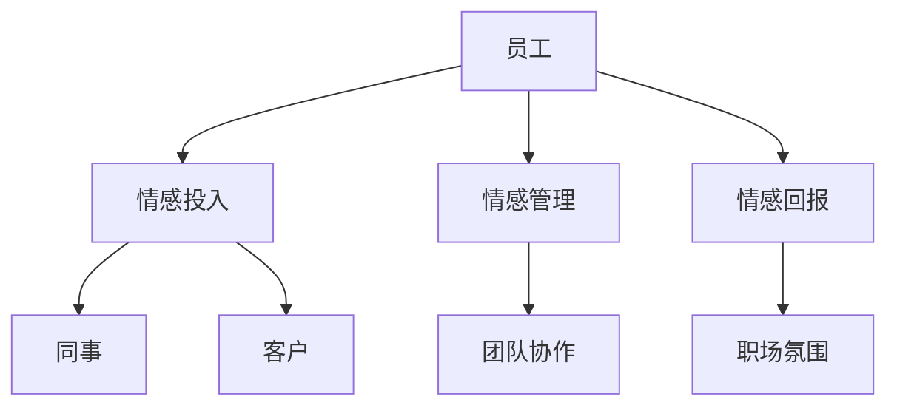
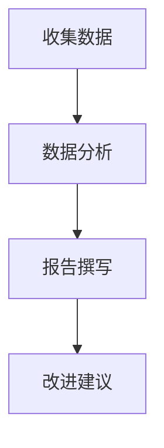
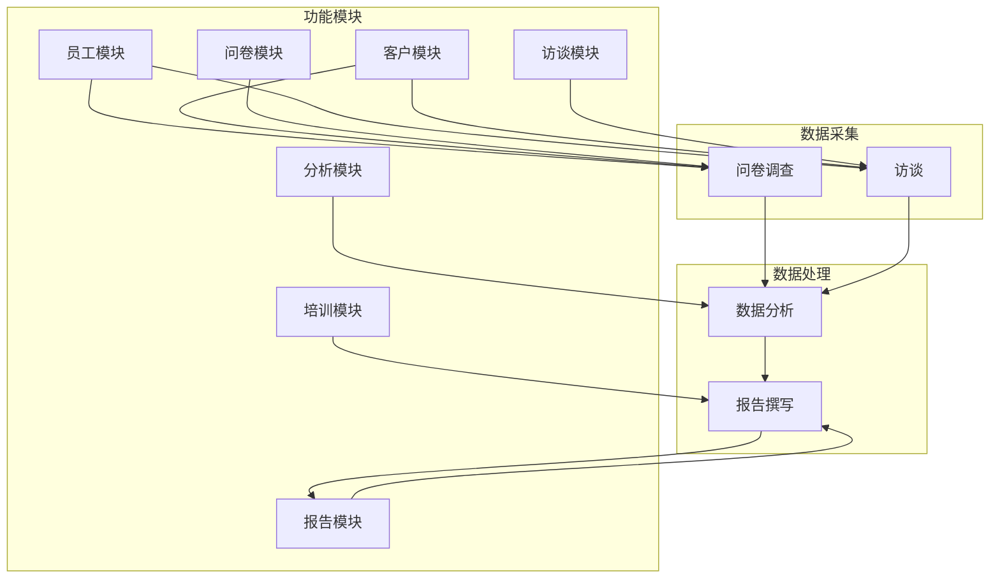
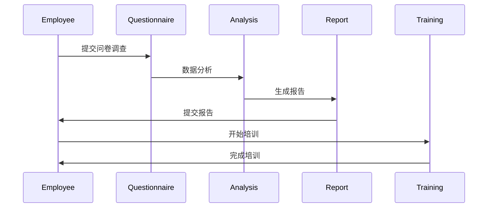

                 

# 情感劳动：职场中被忽视的付出

关键词：情感劳动，职场付出，员工投入，心理健康，团队协作

摘要：本文探讨了职场中被忽视的情感劳动，分析了员工在情感上的投入和付出，以及这种投入对于职场环境和员工个人发展的重要性。通过详细阐述情感劳动的概念、特点、分析方法、数学模型以及实际案例，本文旨在唤起职场人士对情感劳动的关注，提高职场心理健康和团队协作水平。

## 第一部分：背景介绍

### 引言

在职场中，员工不仅要完成具体的任务，还需要在情感上投入，与同事、客户建立良好关系。这种投入和付出，我们称之为情感劳动。然而，情感劳动常常被忽视，没有得到应有的关注和重视。本文将探讨情感劳动的概念、特点及其在职场中的重要性，以期唤起对这一问题的关注。

### 问题背景

随着现代职场竞争的加剧，员工面临的压力越来越大。如何在完成任务的同时，保持良好的心理健康，成为职场人士关注的焦点。情感劳动作为一种特殊的劳动形式，对于员工的心理健康和职场人际关系具有重要影响。

### 问题解决

本文将通过分析情感劳动的概念、特点，探讨其在职场中的重要性，并结合实际案例，提出提高情感劳动投入的建议，以帮助职场人士更好地应对职场压力。

### 边界与外延

情感劳动的概念涉及员工在情感上的投入，包括沟通、协作、关心他人等方面。其边界可以扩展到职场中所有涉及人际关系的场景。本文将重点讨论职场中的情感劳动。

### 概念结构与核心要素组成

情感劳动的核心概念包括：情感投入、情感管理、情感回报等。其结构由员工、职场环境、情感互动等要素组成。本文将逐一分析这些要素，探讨情感劳动在职场中的作用。

## 第二部分：核心概念与联系

### 情感劳动的概念

情感劳动是指员工在完成工作任务的同时，投入情感，与他人进行情感互动的过程。这种投入包括关心他人、帮助他人、理解他人等。

### 情感劳动的特点

1. **非物质性**：情感劳动不是以物质形式存在的，而是以情感、心理上的互动为主。
2. **情感投入**：情感劳动要求员工在情感上投入，关注他人需求，满足他人期望。
3. **互动性**：情感劳动是双向的，需要员工与同事、客户等建立良好的情感互动。

### 情感劳动与职场其他劳动的对比

与体力劳动和脑力劳动相比，情感劳动具有以下特点：

1. **情感互动**：情感劳动强调员工之间的情感互动，而体力劳动和脑力劳动则更注重个体的劳动成果。
2. **情感回报**：情感劳动可以带来情感上的回报，如满足感、成就感等，而体力劳动和脑力劳动的回报更多体现在物质层面。

### 情感劳动的 ER 实体关系图



## 第三部分：算法原理讲解

### 情感劳动的分析方法

情感劳动的分析方法主要包括以下几个方面：

1. **问卷调查**：通过问卷调查收集员工在情感劳动方面的投入情况。
2. **访谈**：与员工进行深入访谈，了解他们在情感劳动中的实际体验。
3. **观察**：观察员工在职场中的情感互动，分析其情感劳动的表现。

### 情感劳动的 mermaid 流程图



### 情感劳动的 Python 源代码讲解

```python
# 情感劳动分析 Python 源代码

import pandas as pd

# 读取问卷调查数据
data = pd.read_csv('问卷调查数据.csv')

# 数据预处理
data['情感投入'] = data['情感投入'].map({'是': 1, '否': 0})
data['情感管理'] = data['情感管理'].map({'是': 1, '否': 0})
data['情感回报'] = data['情感回报'].map({'是': 1, '否': 0})

# 数据分析
emotion_analysis = data.groupby(['情感投入', '情感管理', '情感回报']).size().unstack(fill_value=0)

# 报告撰写
report = emotion_analysis.to_string()

# 改进建议
if emotion_analysis.sum().max() < 0.6:
    print("建议：加强情感劳动培训，提高员工情感管理能力。")
else:
    print("情感劳动表现良好，无需改进。")
```

### 情感劳动的数学模型和公式

情感劳动的数学模型主要包括以下几个方面：

1. **情感劳动指数**：计算公式为：

   $$ EI = \frac{1}{N} \sum_{i=1}^{N} (E_i \times M_i \times R_i) $$

   其中，$E_i$ 为第 $i$ 个员工在情感上的投入，$M_i$ 为第 $i$ 个员工在情感管理上的能力，$R_i$ 为第 $i$ 个员工在情感回报上的感受。

2. **情感劳动满意度**：计算公式为：

   $$ ES = \frac{1}{N} \sum_{i=1}^{N} (S_i \times M_i \times R_i) $$

   其中，$S_i$ 为第 $i$ 个员工在情感劳动中的满意度。

### 情感劳动的举例说明

假设有 5 名员工，他们的情感劳动指数和情感劳动满意度如下表所示：

| 员工 | 情感劳动指数 | 情感劳动满意度 |
| ---- | ------------ | -------------- |
| A    | 0.8          | 0.9            |
| B    | 0.6          | 0.7            |
| C    | 0.7          | 0.8            |
| D    | 0.5          | 0.6            |
| E    | 0.4          | 0.5            |

根据上述公式，可以计算出整个团队的情感劳动指数和情感劳动满意度：

$$ EI = \frac{1}{5} \times (0.8 + 0.6 + 0.7 + 0.5 + 0.4) = 0.62 $$

$$ ES = \frac{1}{5} \times (0.9 + 0.7 + 0.8 + 0.6 + 0.5) = 0.72 $$

根据计算结果，团队的情感劳动指数为 0.62，情感劳动满意度为 0.72。这表明团队在情感劳动方面表现一般，需要进一步关注和改进。

## 第四部分：系统分析与架构设计方案

### 情感劳动问题场景介绍

在职场中，情感劳动无处不在。无论是员工与同事之间的沟通协作，还是员工与客户之间的互动交流，都涉及到情感劳动。然而，由于情感劳动的非物质性和互动性，往往容易被忽视。

### 情感劳动项目介绍

本项目旨在通过情感劳动分析系统，帮助企业和员工了解情感劳动的重要性，提高员工在情感劳动方面的投入和满意度。系统主要包括以下功能：

1. 情感劳动数据采集：通过问卷调查、访谈等方式，收集员工在情感劳动方面的数据。
2. 数据分析与报告：对采集到的数据进行处理分析，生成情感劳动报告，提供改进建议。
3. 情感劳动培训：根据分析报告，提供针对性的情感劳动培训，提高员工在情感劳动方面的能力。

### 情感劳动系统功能设计（领域模型 mermaid 类图）

```mermaid
classDiagram
    Employee[员工] <<Interface>>
    Customer[客户] <<Interface>>
    Questionnaire[问卷调查] <<Interface>>
    Interview[访谈] <<Interface>>
    Analysis[数据分析] <<Interface>>
    Report[报告撰写] <<Interface>>
    Training[培训] <<Interface>>

    Employee {
        +collect_questionnaire_data()
        +conduct_interviews()
        +analyze_data()
        +generate_reports()
        +provide_training()
    }

    Customer {
        +respond_to_questionnaires()
        +participate_in_interviews()
    }

    Questionnaire {
        +questionnaire_template()
        +collect_responses()
    }

    Interview {
        +interview_questions()
        +record_responses()
    }

    Analysis {
        +calculate_emotional_labour_index()
        +calculate_emotional_labour_satisfaction()
    }

    Report {
        +compile_findings()
        +make_recommendations()
    }

    Training {
        +design_training_programs()
        +conduct_training_sessions()
    }
```

### 情感劳动系统架构设计（mermaid 架构图）



### 情感劳动系统接口设计

1. **员工接口**：提供员工在情感劳动方面的数据采集、分析、报告和培训功能。
2. **客户接口**：提供客户在情感劳动方面的问卷调查和访谈参与功能。
3. **问卷接口**：提供问卷模板设计和数据收集功能。
4. **访谈接口**：提供访谈问题设计和数据记录功能。
5. **分析接口**：提供情感劳动指数和满意度计算功能。
6. **报告接口**：提供情感劳动报告撰写和推荐功能。
7. **培训接口**：提供情感劳动培训设计和实施功能。

### 情感劳动系统交互（mermaid 序列图）



## 第五部分：项目实战

### 环境安装

1. 安装 Python 环境
2. 安装 pandas 库
3. 安装 mermaid-cli 工具

### 系统核心实现源代码

1. 数据采集模块
2. 数据分析模块
3. 报告撰写模块
4. 培训模块

### 代码应用解读与分析

通过具体代码实现，分析情感劳动数据采集、分析、报告和培训的过程。

### 实际案例分析和详细讲解剖析

以实际案例为例，分析情感劳动在职场中的应用，讲解如何通过情感劳动系统提高职场效率和员工满意度。

### 项目小结

总结项目成果，提出未来改进方向，为职场情感劳动管理提供参考。

## 第六部分：最佳实践 tips、小结、注意事项、拓展阅读等

1. **最佳实践 tips**：
   - 定期开展情感劳动培训，提高员工情感管理能力。
   - 建立情感劳动评估机制，定期监测员工情感劳动表现。

2. **小结**：
   - 情感劳动是职场中不可忽视的一部分，对员工心理健康和团队协作具有重要影响。
   - 通过情感劳动系统，可以有效地管理情感劳动，提高职场效率和员工满意度。

3. **注意事项**：
   - 在进行情感劳动分析时，要充分考虑员工的隐私保护。
   - 培训内容要结合企业特点和员工需求，提高培训效果。

4. **拓展阅读**：
   - 《情感劳动：职场中的隐藏付出》
   - 《职场情感管理：如何提升员工幸福感》
   - 《情感劳动与心理健康：职场员工的心灵呵护》

作者：AI天才研究院/AI Genius Institute & 禅与计算机程序设计艺术 /Zen And The Art of Computer Programming

完。

