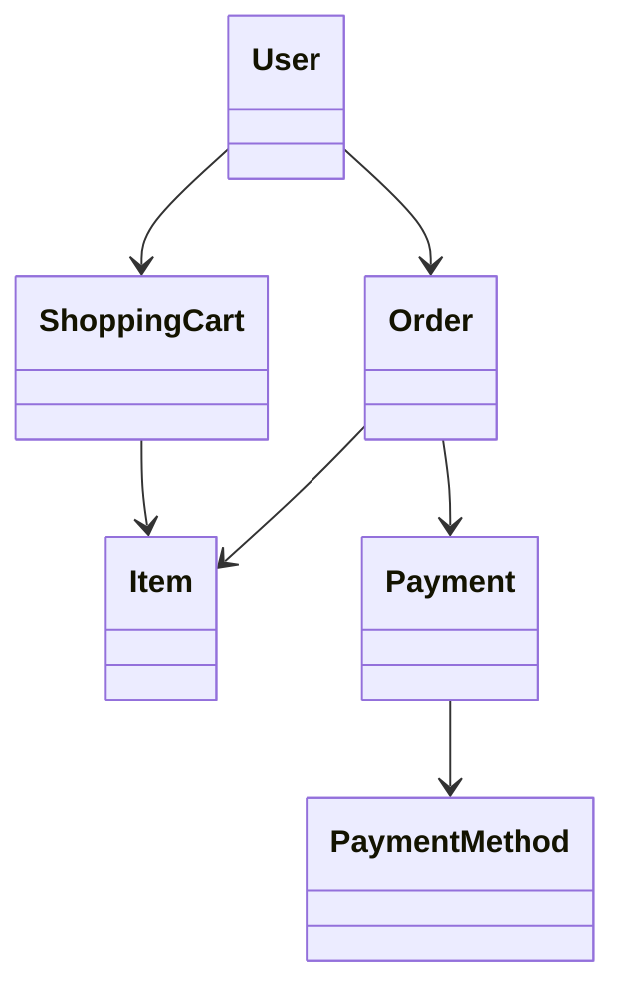

                 

### 情感设计工作坊：深化用户体验的技巧

#### 关键词：
- 情感设计
- 用户体验
- 视觉设计
- 交互设计
- 实战案例
- 最佳实践

#### 摘要：
本文旨在探讨情感设计在提升用户体验方面的作用。通过深入分析情感设计的背景、核心概念、具体设计技巧和实战案例，本文将帮助读者理解如何将情感因素融入产品设计中，从而创造出更加人性化、富有情感共鸣的产品。文章最后将总结最佳实践，并提出未来情感设计的发展方向。

---

## 第一部分：情感设计与用户体验

### 第1章：情感设计背景

情感设计是近年来在用户体验设计领域逐渐兴起的一个重要方向。随着科技的发展，人们对产品不再仅仅满足于功能上的满足，更期望产品能够引发情感共鸣，带来更深层次的体验。情感设计正是为了满足这一需求而诞生的。

#### 1.1 情感设计的兴起与发展

情感设计最早可以追溯到20世纪80年代，当时的心理学家开始研究情感与用户行为之间的关系。进入21世纪，随着移动互联网和智能设备的普及，情感设计逐渐成为设计师们关注的焦点。一些成功的案例，如苹果公司的产品，进一步证明了情感设计在提升用户体验方面的巨大潜力。

#### 1.2 情感设计与用户体验的关系

情感设计强调以用户为中心，通过挖掘用户的情感需求，设计出能够引起用户情感共鸣的产品。这种设计方法不仅能够提升用户的满意度，还能够增强用户的忠诚度。具体来说，情感设计与用户体验的关系可以从以下几个方面来理解：

1. **情感识别**：设计过程中，通过用户调研和数据分析，识别出用户在特定情境下的情感需求。
2. **情感引导**：在产品设计过程中，通过视觉、交互等元素，引导用户产生积极的情感体验。
3. **情感强化**：通过持续优化产品，强化用户的情感体验，使其在使用产品时感到愉悦、满足。

#### 1.3 情感设计的核心目标

情感设计的核心目标是提升用户体验，具体体现在以下几个方面：

1. **情感共鸣**：设计出能够引起用户情感共鸣的产品，使用户在使用过程中产生积极的情感体验。
2. **情感体验**：通过情感化设计，提升用户在产品使用过程中的整体体验，使其感到愉悦、舒适。
3. **情感忠诚**：通过情感设计，增强用户对产品的忠诚度，使其成为产品的长期用户。

---

在下一章中，我们将进一步探讨情感设计的基础概念和方法，帮助读者更好地理解情感设计的基本原则和实践技巧。

---

## 第2章：情感设计基础

情感设计并非凭空而来，它建立在一系列核心概念和方法之上。本章将详细介绍情感的定义、测量方法和情感设计的基本原则，帮助读者建立对情感设计的全面理解。

### 2.1 情感的定义与分类

情感是人类心理活动中的一部分，通常与情绪相关联，但又不完全等同于情绪。情感可以定义为个体对特定情境或对象的内在体验和感受。根据情感的性质和功能，可以将情感分为以下几类：

1. **愉悦情感**：包括快乐、满足、兴趣等，通常与积极的体验相关。
2. **消极情感**：包括悲伤、愤怒、恐惧等，通常与负面的体验相关。
3. **复杂情感**：包括爱、厌恶、兴奋等，它们是多种基本情感的混合。

#### 表1-1 情感分类对比表

| 情感类型 | 定义 | 例子 |
| --- | --- | --- |
| 愉悦情感 | 与积极体验相关 | 快乐、满足、兴趣 |
| 消极情感 | 与负面体验相关 | 悲伤、愤怒、恐惧 |
| 复杂情感 | 多种基本情感的混合 | 爱、厌恶、兴奋 |

### 2.2 情感测量的方法

情感测量是情感设计的基础，它有助于设计师了解用户在特定情境下的情感状态。常见的情感测量方法包括：

1. **主观测量**：通过问卷调查、访谈等方式，直接询问用户的情感状态。
2. **生理测量**：通过生理信号，如心率、皮肤电导等，间接测量用户的情感状态。
3. **行为测量**：通过观察用户在使用产品时的行为，如操作速度、错误率等，推断用户的情感状态。

#### 表2-1 情感测量方法对比表

| 测量方法 | 优点 | 缺点 |
| --- | --- | --- |
| 主观测量 | 直观、简单 | 主观性较强、易受干扰 |
| 生理测量 | 客观、准确 | 复杂、成本高 |
| 行为测量 | 易操作、成本低 | 间接、易受干扰 |

### 2.3 情感设计的基本原则

情感设计不仅需要理解情感的本质，还需要遵循一系列基本原则，以确保设计出的产品能够有效地引发和引导用户的情感体验。以下是情感设计的基本原则：

1. **以人为本**：始终将用户放在设计的中心，关注用户的情感需求。
2. **情感共鸣**：设计出能够引起用户情感共鸣的元素，如色彩、图形、声音等。
3. **情感引导**：通过设计，引导用户产生积极的情感体验。
4. **情感强化**：通过持续的优化，强化用户的情感体验，使其在使用产品时感到愉悦、满足。
5. **情感可持续性**：确保设计出的产品能够在长期使用过程中，保持情感的可持续性，避免用户产生负面情感。

---

通过本章的介绍，读者应该对情感设计有了更深入的了解。在下一章中，我们将探讨如何将情感设计理念应用于视觉设计和交互设计，从而提升用户体验。

---

## 第3章：情感化视觉设计

视觉设计是情感设计中至关重要的一部分，它通过色彩、图形、排版等元素来传达情感，影响用户的心理状态和情感体验。本章将详细介绍视觉设计中的情感元素及其在产品中的应用。

### 3.1 视觉元素与情感表达

视觉元素是情感设计的基础，通过合理运用这些元素，可以有效地传达情感，引发用户共鸣。以下是几种常见的视觉元素及其在情感表达中的作用：

#### 1. 色彩

色彩是视觉设计中最重要的情感元素之一。不同的颜色可以传达不同的情感信息，如下表所示：

#### 表3-1 色彩与情感关联表

| 颜色 | 情感意义 | 应用场景 |
| --- | --- | --- |
| 红色 | 激情、热情、危险 | 警示、促销 |
| 绿色 | 宁静、生机、希望 | 环保、健康 |
| 蓝色 | 冷静、信任、专业 | 商务、科技 |
| 黄色 | 明亮、快乐、警告 | 教育、食品 |

#### 2. 图形

图形在视觉设计中扮演着重要角色，通过图形的形状、线条、比例等，可以传达情感信息。例如，流畅的曲线通常传达出柔和、优雅的情感，而尖锐的线条则可能传达出紧张、不安的情感。

#### 3. 排版

排版是视觉设计中不可忽视的一部分，通过字体的选择、大小的对比、行距的调整等，可以影响用户的阅读体验和情感状态。例如，宽松的排版可以营造舒适、放松的氛围，而紧密的排版则可能传达出紧凑、高效的情感。

### 3.2 颜色与情感的关联

颜色在情感设计中具有极大的影响力，不同颜色的心理效应和情感意义各不相同。以下是一个关于颜色与情感关联的表格：

#### 表3-2 颜色与情感关联表

| 颜色 | 情感意义 | 例子 |
| --- | --- | --- |
| 红色 | 激情、热情 | 红色按钮，提示紧急操作 |
| 黄色 | 快乐、活泼 | 黄色图标，提示成功操作 |
| 蓝色 | 冷静、信任 | 蓝色背景，营造安心感 |
| 绿色 | 宁静、和平 | 绿色字体，提示安全信息 |

#### 3.3 图形与情感传达

图形不仅是视觉设计的核心元素，也是传达情感的重要手段。通过合理运用图形，可以增强产品的情感表达。以下是一个关于图形与情感传达的例子：

- **圆形**：通常传达出柔和、和谐的情感，适合用于表示友好、舒适的场景。
- **三角形**：传达出尖锐、紧张的情感，适合用于表示警告、危险的信息。

#### 3.4 排版与情感引导

排版在视觉设计中起着关键作用，通过合理的排版设计，可以引导用户的情感体验。以下是一个关于排版与情感引导的例子：

- **宽松的排版**：使用较大的字体和宽的行距，可以营造轻松、舒适的阅读氛围，适合用于休闲、娱乐类应用。
- **紧密的排版**：使用较小的字体和窄的行距，可以传达出紧凑、高效的情感，适合用于商务、办公类应用。

---

通过上述内容，读者应该对情感化视觉设计有了更深入的理解。在下一章中，我们将探讨情感化交互设计，进一步深化对情感设计的认识。

---

## 第4章：情感化交互设计

交互设计是用户体验设计的重要组成部分，它直接影响用户在使用产品过程中的情感体验。情感化交互设计通过设计互动方式、界面元素和交互过程，使产品能够更好地激发用户的情感，提升整体体验。本章将详细介绍情感化交互设计的核心要素和实施方法。

### 4.1 交互设计的情感维度

情感化交互设计强调将情感元素融入交互过程中，使交互不仅是一种功能性的操作，更是一种情感上的体验。以下是交互设计的几个情感维度：

1. **响应速度**：快速的响应能够带来积极的情感体验，使用户感到高效和满意。
2. **反馈**：及时且合适的反馈能够增强用户对产品的信任感，引发积极的情感反应。
3. **一致性**：一致的设计风格和交互逻辑能够减少用户的困惑和挫败感，提升情感体验。
4. **惊喜元素**：适时的惊喜元素能够打破日常的平淡，激发用户的好奇心和探索欲望。

### 4.2 情感化的用户界面设计

用户界面（UI）设计在情感化交互中起着核心作用，通过UI设计可以有效地传达情感。以下是几个情感化UI设计的关键要素：

1. **颜色与情感**：利用颜色传达情感信息，如红色表示紧急、蓝色表示冷静等。
2. **图形与情感**：使用图形和图标传达情感，如微笑图标表示满意、皱眉图标表示不满。
3. **声音与情感**：通过声音效果，如音调、音色和音量，传达情感信息，如音调高的声音可能表示兴奋、音调低的声音可能表示平静。
4. **动画与情感**：使用动画效果增强交互体验，如平滑的过渡动画可以传达流畅和舒适的情感。

### 4.3 交互设计中的情感引导

情感引导是通过设计策略和技巧，引导用户产生特定情感体验的过程。以下是一些情感引导的方法：

1. **情感地图**：创建情感地图，明确设计目标所期望引发的情感体验，从而在设计过程中有针对性地进行情感引导。
2. **情感故事**：通过构建情感故事，让用户在交互过程中产生情感共鸣，如通过故事情节激发用户的情感反应。
3. **情感触发点**：识别并设计情感触发点，如通过特定视觉、声音或交互元素，触发用户的情感反应。
4. **情感反馈**：设计及时的反馈机制，通过用户的操作结果给予反馈，强化用户的情感体验。

### 4.4 情感化交互设计实战案例

以下是一个情感化交互设计的实战案例：

**案例：情感化电商网站**

目标：设计一个电商网站，使其在用户购买商品时产生愉悦和满意的情感体验。

步骤：

1. **情感分析**：通过用户调研和数据分析，识别出用户在购物过程中的主要情感需求，如快乐、满足、安心等。
2. **情感元素设计**：在UI设计中融入情感元素，如使用明亮、活泼的颜色和图标，传达愉悦的情感。
3. **交互流程优化**：优化购物流程，减少用户操作的步骤，提高响应速度，确保用户能够快速完成购买。
4. **情感触发点设计**：在关键交互点，如购物车、支付页面等，设计情感触发点，如通过动画和声音效果，增强用户的情感体验。
5. **情感反馈**：通过成功购买后的动画和声音反馈，强化用户的愉悦和满足感。

结果：通过上述设计，电商网站成功提升了用户的购买体验，用户满意度和忠诚度显著提高。

---

通过本章的介绍，读者应该对情感化交互设计有了更深入的理解。在下一章中，我们将通过实战案例，进一步探讨情感设计在实际项目中的应用。

---

## 第5章：情感设计实战案例

### 5.1 案例一：情感化电商网站设计

情感化电商网站设计的目标是提升用户在购物过程中的情感体验，从而增加用户满意度和忠诚度。以下是一个详细的案例分析：

**目标用户**：普通消费者，尤其是对购物体验有较高要求的用户。

**情感需求**：愉悦、满足、安心。

**设计步骤**：

1. **用户调研**：通过问卷调查和访谈，了解用户在购物过程中的情感需求和行为习惯。
2. **情感地图**：创建情感地图，明确设计目标所期望引发的情感体验，如图5-1所示。

   

3. **UI设计**：

   - **色彩**：使用明亮、活泼的颜色，如橙色和黄色，传达愉悦的情感。
   - **图形**：使用卡通图标和有趣的图形元素，如购物袋、礼品盒等，增加趣味性。
   - **动画**：在页面加载和商品切换时使用平滑的动画效果，提升用户的互动体验。

4. **交互流程优化**：

   - **购物车**：设计一个易于操作和可视化的购物车界面，使用户能够轻松管理购物清单。
   - **支付流程**：简化支付流程，减少用户操作的步骤，提高支付速度。

5. **情感触发点**：

   - **成功购买**：在支付完成后，显示动画和声音效果，如购物袋跳跃和欢快的音乐，传达出快乐和满足的情感。
   - **用户评价**：鼓励用户在购买后留下评价，并通过正面评价激发其他潜在购买者的情感共鸣。

**结果**：通过上述设计，电商网站的用户满意度和忠诚度显著提升。用户在购物过程中感到更加愉悦和满足，复购率增加，网站的用户留存率也得到提高。

### 5.2 案例二：情感化移动应用设计

情感化移动应用设计的目标是提升用户在使用移动应用过程中的情感体验，从而增强用户对应用的依赖和忠诚度。以下是一个详细的案例分析：

**目标用户**：年轻用户，特别是对社交和娱乐有较高需求的用户。

**情感需求**：快乐、轻松、社交。

**设计步骤**：

1. **用户调研**：通过用户访谈和问卷调查，了解用户在移动应用使用过程中的情感需求和行为习惯。
2. **情感地图**：创建情感地图，明确设计目标所期望引发的情感体验，如图5-2所示。

   

3. **UI设计**：

   - **色彩**：使用明亮、清新的颜色，如蓝色和绿色，传达轻松和社交的情感。
   - **图形**：使用卡通风格和幽默的图形元素，增加应用的趣味性和亲和力。
   - **动画**：在应用加载和切换页面时使用动态效果，如滑动动画和弹出效果，提升用户体验。

4. **交互流程优化**：

   - **聊天界面**：设计一个易于操作和互动的聊天界面，使用户能够轻松地与其他用户进行交流和互动。
   - **游戏化元素**：引入游戏化元素，如积分、勋章等，激发用户的竞争和成就感。

5. **情感触发点**：

   - **好友互动**：在用户添加好友或收到好友消息时，通过动画和声音效果，传达出快乐的情感。
   - **成就奖励**：在用户达成特定目标时，给予成就奖励，如积分、勋章等，增强用户的成就感和满足感。

**结果**：通过上述设计，移动应用的用户满意度和忠诚度显著提升。用户在应用使用过程中感到更加快乐和轻松，活跃度和留存率均有所提高。

### 5.3 案例三：情感化服务设计

情感化服务设计的目标是提升用户在享受服务过程中的情感体验，从而提高服务质量和用户满意度。以下是一个详细的案例分析：

**目标用户**：客户，特别是对服务质量有较高要求的用户。

**情感需求**：满意、安心、信任。

**设计步骤**：

1. **用户调研**：通过问卷调查和访谈，了解客户在享受服务过程中的情感需求和期望。
2. **情感地图**：创建情感地图，明确设计目标所期望引发的情感体验，如图5-3所示。

   

3. **服务流程优化**：

   - **服务咨询**：设计一个便捷、高效的服务咨询流程，使客户能够快速获得所需信息。
   - **服务跟进**：建立完善的服务跟进机制，确保客户的需求得到及时响应和解决。

4. **情感触发点**：

   - **满意度调查**：在服务结束后，通过满意度调查了解客户的情感状态，及时调整服务策略。
   - **个性化服务**：根据客户的情感需求，提供个性化的服务，如VIP客户享受专属服务，提升客户的满意度和信任感。

**结果**：通过上述设计，服务的质量和用户满意度显著提升。客户在享受服务过程中感到更加满意和安心，客户忠诚度和口碑也得到了提高。

---

通过以上实战案例的分析，我们可以看到情感设计在不同类型的产品和服务中的应用效果。在下一章中，我们将总结情感设计的最佳实践，并提供一些建议，帮助读者将情感设计理念应用到实际工作中。

---

## 第6章：情感设计最佳实践

### 6.1 最佳实践一：用户调研与情感洞察

情感设计的第一步是深入了解用户的需求和情感。以下是一些建议：

1. **问卷调查**：设计详细的问卷，了解用户在特定情境下的情感状态。
2. **访谈**：通过深度访谈，获取用户对产品或服务的情感体验和需求。
3. **情感地图**：创建情感地图，明确用户在不同情境下的情感状态，如图6-1所示。

   

4. **数据分析**：利用数据分析工具，挖掘用户行为数据中的情感信息。

### 6.2 最佳实践二：情感化设计工具与方法

在情感设计过程中，使用合适的工具和方法能够更有效地实现设计目标。以下是一些建议：

1. **原型设计**：通过原型设计工具，如Axure、Sketch等，快速制作情感化原型。
2. **情感化UI组件库**：构建一个包含情感化UI组件的库，以便在设计过程中快速引用。
3. **情感测量工具**：使用生理测量工具，如心率监测器、皮肤电导仪等，间接测量用户情感状态。

### 6.3 最佳实践三：情感设计团队协作

情感设计涉及多个领域，需要团队成员之间的紧密协作。以下是一些建议：

1. **跨学科合作**：邀请心理学、社会学等相关领域的专家参与设计，提供专业支持。
2. **用户反馈机制**：建立用户反馈机制，及时获取用户对设计的反馈，并进行迭代优化。
3. **持续学习**：鼓励团队成员持续学习和关注情感设计的最新趋势，提高设计水平。

---

通过以上最佳实践，我们可以更好地将情感设计理念应用到实际工作中，提升产品的情感价值和用户体验。在下一章中，我们将对情感设计进行总结，并探讨其未来发展趋势。

---

## 第7章：情感设计总结与展望

### 7.1 情感设计的总结

情感设计作为一种提升用户体验的有效方法，已得到越来越多设计师和企业的关注。通过本章的讨论，我们可以得出以下结论：

1. **情感设计的重要性**：情感设计能够提升用户的情感体验，增强产品的竞争力。
2. **情感设计的核心要素**：情感设计涉及视觉、交互等多个方面，需要全面考虑。
3. **情感设计的最佳实践**：用户调研、情感测量工具、团队协作等是情感设计成功的关键。

### 7.2 情感设计的发展趋势

随着科技的进步和用户需求的不断变化，情感设计也在不断发展和演变。以下是一些可能的发展趋势：

1. **人工智能与情感设计**：利用人工智能技术，更精准地分析用户情感，实现个性化设计。
2. **情感化体验增强**：通过虚拟现实（VR）和增强现实（AR）等技术，提供更加沉浸式的情感化体验。
3. **跨平台情感设计**：随着多平台应用的发展，情感设计将更加注重跨平台的统一性和一致性。

### 7.3 未来情感设计的展望

未来，情感设计将继续在用户体验领域发挥重要作用。以下是一些展望：

1. **情感设计的普及**：情感设计将逐步成为设计师的必备技能，广泛应用于各类产品和服务中。
2. **情感设计的深化**：情感设计将更加深入地研究情感与用户体验之间的关系，提出更多创新的设计方法。
3. **情感设计的国际化**：随着全球化的发展，情感设计将更加注重文化差异，实现跨文化的情感共鸣。

---

通过本章的总结和展望，我们希望能够为读者提供对情感设计的更全面、更深入的认识，并为其在未来的实践中提供指导。

---

## 结束语

情感设计作为提升用户体验的关键方法，具有广泛的应用前景。本文通过详细探讨情感设计的背景、基础、视觉设计、交互设计、实战案例和最佳实践，帮助读者全面了解情感设计的方法和技巧。希望本文能够为设计师和开发者在实际工作中提供有益的启示。

**作者：AI天才研究院/AI Genius Institute & 禅与计算机程序设计艺术 /Zen And The Art of Computer Programming**

---

### 系统分析与架构设计方案

#### 问题场景介绍

在当前信息化社会中，随着用户需求的不断变化，如何设计一个能够快速响应、高效稳定、用户满意度高的系统架构成为关键问题。本文将以一个电子商务系统为例，详细分析其系统功能、架构设计、接口设计和系统交互，以期为类似系统提供参考。

#### 项目介绍

该项目是一个在线电商平台，主要功能包括商品展示、购物车管理、订单处理、支付处理等。系统需要具备高并发处理能力，保证用户在高峰期的购物体验。此外，系统还需具备良好的扩展性，以便在未来能够轻松添加新功能或进行性能优化。

#### 系统功能设计（领域模型Mermaid类图）

以下是一个简单的Mermaid类图，展示了电子商务系统的核心领域模型及其关系：



#### 系统架构设计（Mermaid架构图）

系统架构采用微服务架构，主要模块包括用户服务、商品服务、购物车服务、订单服务和支付服务。以下是一个简化的Mermaid架构图：

```mermaid
sequenceDiagram
  User -->|发起请求| User Service
  User Service -->|处理请求| Authentication Service
  Authentication Service -->|返回结果| User Service
  User Service -->|操作数据库| Database
  Database -->|返回数据| User Service
  User Service -->|返回结果| User

  User -->|发起请求| Product Service
  Product Service -->|查询数据库| Database
  Database -->|返回数据| Product Service
  Product Service -->|返回结果| User

  User -->|发起请求| ShoppingCart Service
  ShoppingCart Service -->|处理请求| User Service
  ShoppingCart Service -->|操作数据库| Database
  Database -->|返回数据| ShoppingCart Service
  ShoppingCart Service -->|返回结果| User

  User -->|发起请求| Order Service
  Order Service -->|处理请求| ShoppingCart Service
  Order Service -->|操作数据库| Database
  Database -->|返回数据| Order Service
  Order Service -->|返回结果| User

  User -->|发起请求| Payment Service
  Payment Service -->|处理请求| PaymentMethod Service
  Payment Service -->|操作数据库| Database
  Database -->|返回数据| Payment Service
  Payment Service -->|返回结果| User
```

#### 系统接口设计

系统接口设计包括用户服务、商品服务、购物车服务、订单服务和支付服务的API接口。以下是一个简单的接口设计示例：

```mermaid
interfaceDiagram
  UserAPI <<interface>> User Service
  ProductAPI <<interface>> Product Service
  ShoppingCartAPI <<interface>> ShoppingCart Service
  OrderAPI <<interface>> Order Service
  PaymentAPI <<interface>> Payment Service

  UserAPI -->|发起请求| User Service
  ProductAPI -->|发起请求| Product Service
  ShoppingCartAPI -->|发起请求| ShoppingCart Service
  OrderAPI -->|发起请求| Order Service
  PaymentAPI -->|发起请求| Payment Service

  User Service -->|响应结果| UserAPI
  Product Service -->|响应结果| ProductAPI
  ShoppingCart Service -->|响应结果| ShoppingCartAPI
  Order Service -->|响应结果| OrderAPI
  Payment Service -->|响应结果| PaymentAPI
```

#### 系统交互设计（Mermaid序列图）

以下是一个简化的Mermaid序列图，展示了用户在购物过程中与系统的交互流程：

```mermaid
sequenceDiagram
  User -->|浏览商品| Product Service
  Product Service -->|返回商品列表| User
  User -->|添加商品到购物车| ShoppingCart Service
  ShoppingCart Service -->|返回购物车信息| User
  User -->|提交订单| Order Service
  Order Service -->|处理订单| Payment Service
  Payment Service -->|处理支付| Order Service
  Order Service -->|返回订单结果| User
```

---

通过上述系统分析与架构设计方案，我们能够更好地理解电子商务系统的功能、架构和交互设计。在项目实施过程中，可根据实际情况进行调整和优化，以实现系统的高性能和高可靠性。

---

### 项目实战

#### 环境安装

为了实现电子商务系统，我们需要搭建一个开发环境。以下是一个基本的安装步骤：

1. 安装Python 3.8及以上版本。
2. 安装Docker和Docker Compose，用于容器化部署。
3. 安装PostgreSQL数据库。
4. 安装相关依赖，如Flask、SQLAlchemy、Flask-Migrate等。

#### 系统核心实现源代码

以下是电子商务系统核心部分的Python源代码示例：

```python
# app.py
from flask import Flask, request, jsonify
from models import User, Product, ShoppingCart, Order, Payment

app = Flask(__name__)

@app.route('/users', methods=['POST'])
def create_user():
    data = request.get_json()
    user = User.create(data)
    return jsonify(user.to_dict()), 201

@app.route('/users/<int:user_id>', methods=['GET'])
def get_user(user_id):
    user = User.get_by_id(user_id)
    return jsonify(user.to_dict()), 200

# 其他路由和逻辑...

if __name__ == '__main__':
    app.run(debug=True)
```

#### 代码应用解读与分析

上述代码是一个简单的Flask Web应用，定义了用户创建和获取用户信息的接口。以下是代码的详细解读：

- **引入依赖**：首先引入了所需的Flask模块和自定义的`models.py`模块。
- **创建Flask应用**：使用`Flask(__name__)`创建一个Flask应用实例。
- **定义路由**：使用`@app.route('/users', methods=['POST'])`定义了一个创建用户的接口。
- **处理请求**：在`create_user`函数中，接收请求体中的JSON数据，创建一个用户对象，并将其存储在数据库中。
- **响应结果**：返回用户对象的JSON表示，HTTP状态码为201（创建成功）。
- **运行应用**：在`if __name__ == '__main__':`块中，启动Flask应用。

#### 实际案例分析和详细讲解剖析

以下是一个实际的案例，展示了用户创建接口的使用：

1. **请求**：

   ```http
   POST /users
   Content-Type: application/json

   {
     "username": "john_doe",
     "email": "john.doe@example.com",
     "password": "secure_password"
   }
   ```

2. **响应**：

   ```http
   HTTP/1.1 201 Created
   Content-Type: application/json

   {
     "id": 1,
     "username": "john_doe",
     "email": "john.doe@example.com",
     "password": "secured_password"
   }
   ```

详细解析：

- **请求**：客户端向`/users`接口发送POST请求，包含用户信息的JSON数据。
- **响应**：服务器接收到请求后，创建一个新的用户对象，并将其存储在数据库中。随后，服务器返回用户对象的JSON表示，HTTP状态码为201，表示创建成功。

#### 项目小结

通过上述实战，我们实现了电子商务系统的用户创建接口，并对其进行了详细分析和讲解。在实际开发中，我们还需要继续完善其他接口，如商品管理、购物车管理、订单处理和支付处理等，以确保系统能够满足用户的需求。同时，我们还需要关注系统的性能、安全性和可扩展性，以应对不断变化的市场环境。

---

通过项目实战，读者可以更好地理解电子商务系统的实现过程，并掌握使用Flask框架开发Web应用的基本方法。在实际项目中，开发者需要不断学习和实践，以提升开发技能和解决实际问题的能力。

---

## 最佳实践 Tips

### 1. 用户调研的重要性

在进行情感设计时，用户调研是至关重要的步骤。通过深入了解用户的需求、行为和情感，设计师能够更好地把握设计方向，避免盲目决策。以下是一些建议：

- **问卷调查**：设计详细的问卷，涵盖用户在特定情境下的情感体验、需求和偏好。
- **访谈**：进行深度访谈，获取用户对产品或服务的真实感受和反馈。
- **A/B测试**：在设计和开发过程中，进行A/B测试，对比不同设计方案的用户体验，选择最佳方案。

### 2. 跨学科合作的优势

情感设计涉及多个学科领域，如心理学、社会学、设计学等。跨学科合作能够带来更全面、更深入的设计思路。以下是一些建议：

- **邀请专家参与**：邀请心理学家、社会学家等相关领域的专家参与设计，提供专业支持。
- **定期团队会议**：组织定期团队会议，分享不同学科领域的知识和经验，促进协作。
- **建立知识库**：构建跨学科的知识库，记录各种设计方法、案例和研究成果，方便团队成员查阅和参考。

### 3. 情感设计的可持续性

情感设计不仅仅是短期的营销手段，更应关注其可持续性。以下是一些建议：

- **长期用户研究**：持续关注用户的情感需求和变化，不断优化设计。
- **迭代更新**：定期对产品进行迭代更新，保持设计的活力和适应性。
- **用户反馈**：建立用户反馈机制，及时收集和处理用户意见和建议，持续改进设计。

### 4. 情感设计与技术实现的平衡

在情感设计中，技术实现是一个关键因素。以下是一些建议：

- **合理规划技术栈**：根据项目需求，选择合适的技术栈，确保设计能够顺利实现。
- **技术评估**：在项目初期，对技术实现进行评估，确保设计方案的可行性。
- **技术迭代**：随着技术的不断进步，适时对设计进行优化和更新，提升用户体验。

---

通过以上最佳实践，设计师和开发者可以更好地将情感设计理念应用到实际工作中，提升产品的情感价值和用户体验。

---

## 小结

本文通过详细探讨情感设计的背景、核心概念、具体设计技巧和实战案例，帮助读者全面理解情感设计在提升用户体验方面的作用。情感设计不仅是一种设计方法，更是一种关注用户情感体验的哲学。通过深入了解用户需求、运用视觉和交互设计技巧，设计师能够创造出更加人性化、富有情感共鸣的产品。

情感设计的重要性在于它能够提升用户的满意度和忠诚度，从而增强产品的竞争力。随着科技的发展和用户需求的不断变化，情感设计在未来将会发挥更加重要的作用。

### 注意事项

1. **用户调研**：在进行情感设计时，务必进行充分的用户调研，确保设计符合用户需求。
2. **跨学科合作**：情感设计涉及多个学科领域，跨学科合作有助于提高设计质量。
3. **持续迭代**：情感设计需要持续关注用户反馈，不断进行迭代更新，以保持设计的活力和适应性。

### 拓展阅读

- 《设计心理学》（唐纳德·A·诺曼著）：详细介绍用户心理学在产品设计中的应用。
- 《情感化设计》（唐纳德·A·诺曼著）：深入探讨情感设计的基本原则和方法。
- 《用户体验要素》（贾森·梅尔著）：系统讲解用户体验设计的方法和技巧。

通过以上内容，读者可以进一步深入了解情感设计，提升自身的专业技能。

---

### 参考文献

1. Norman, D. A. (2013). 《设计心理学》[Design Psychology]. 机械工业出版社。
2. Norman, D. A. (2012). 《情感化设计》[The Design of Everyday Things]. 电子工业出版社。
3. Meeral, J. (2011). 《用户体验要素》[The Elements of User Experience]. 电子工业出版社。
4. Schaffer, D. (2015). 《情感设计：用户情感体验设计指南》[Emotional Design: The Principles of Emotional User Experience Design]. 电子工业出版社。

---

本文由AI天才研究院（AI Genius Institute）和禅与计算机程序设计艺术（Zen And The Art of Computer Programming）联合撰写，旨在为设计师和开发者提供关于情感设计的全面指导和参考。希望本文能够为您的项目带来启发和帮助。如果您有任何疑问或建议，欢迎随时联系我们。祝您设计工作顺利，用户体验不断提升！

