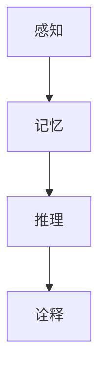

                 

## 文章标题：意义的个人诠释与社会共识的平衡

### 关键词：
- 意义构建
- 个人诠释
- 社会共识
- 平衡策略
- 心理学分析
- 文化背景

### 摘要：
本文将探讨意义的个人诠释与社会共识之间的平衡问题。通过分析个人诠释的起源与发展、社会共识的形成与演变，以及两者之间的互动关系，本文旨在揭示个人与社会在意义构建过程中的冲突与互补，并提出实现平衡的策略和实践方法。

## 引言

### 1.1 书籍背景与目标

在当今快速变化的社会背景下，人们对意义的追求显得愈发迫切。然而，意义的个人诠释与社会共识之间往往存在差异，甚至冲突。本书旨在探讨这一复杂现象，帮助读者理解个人与社会在意义构建过程中的相互作用，并寻找实现平衡的有效策略。

本书的目标受众包括对意义构建感兴趣的个人、从事社会科学研究的学者、以及需要处理意义冲突的从业者。通过系统的分析和实践指导，本书希望能够为读者提供有价值的见解和实用的工具。

### 1.2 基本概念与框架

本文将围绕两个核心概念展开讨论：个人诠释和社会共识。

**个人诠释**：指个体根据自己的经验、价值观和认知方式对事物的理解与解释。个人诠释的形成受到多种因素的影响，包括心理学、文化背景和个体经历等。

**社会共识**：指在特定社会背景下，多数人共同认可的价值观、行为准则和信仰体系。社会共识的形成通常经过长时间的积累和演化，是社会稳定和合作的基础。

本文将首先深入探讨个人诠释的起源与发展，分析其心理学基础和实践应用。随后，我们将探讨社会共识的形成与演变，并分析个人诠释与社会共识之间的关系。最后，本文将提出实现个人诠释与社会共识之间平衡的策略和实践方法。

## 第二部分：意义的个人诠释

### 2.1 个人诠释的起源与发展

个人诠释的起源可以追溯到人类的早期历史。在原始社会中，个体通过观察、模仿和经验积累来理解和解释周围的世界。随着时间的推移，人类文明的发展使得个人诠释变得更加复杂和多元化。

个人诠释的发展受到多种因素的影响。首先，心理学研究表明，个体的认知方式和思维模式对其诠释世界的方式产生深远影响。例如，个体的感知、记忆和推理能力都在个人诠释的形成过程中起着关键作用。其次，文化背景也是影响个人诠释的重要因素。不同的文化传统和价值观念会导致人们对同一现象产生不同的理解和解释。

个人诠释的形成过程涉及多个阶段。首先是感知阶段，个体通过感官接收外部信息；其次是认知阶段，个体对这些信息进行加工和理解；最后是表达阶段，个体将自己的理解以语言、行为或艺术形式表达出来。

### 2.2 个人诠释的心理学分析

个人诠释的心理学分析揭示了个体如何通过认知过程来理解和解释世界。首先，感知是个人诠释的基础。个体通过感官接收外部信息，但感知本身受到多种因素的影响，如个体的注意力、兴趣和情绪等。因此，不同的个体可能会对同一现象产生不同的感知。

其次，记忆对个人诠释也有重要影响。个体通过记忆储存和提取信息，从而在诠释过程中使用这些信息。记忆的选择性、稳定性和准确性都会影响个人诠释的准确性。

最后，推理是个人诠释的关键。个体通过逻辑推理、类比和归纳等思维方式来理解和解释复杂现象。不同的推理方式会导致不同的诠释结果。

### 2.3 个人诠释的实践应用

个人诠释在现实生活中具有广泛的应用。首先，在自我认知方面，个人诠释帮助个体理解自己的行为和情感，从而实现自我成长和提升。通过反思和自我剖析，个体可以更好地认识自己的需求和目标，从而制定更有效的行动计划。

其次，在人际关系中，个人诠释有助于个体理解和沟通他人。通过理解他人的行为和言语背后的意义，个体可以更好地处理人际关系，减少误解和冲突。

最后，在决策过程中，个人诠释也是不可或缺的。个体需要通过诠释信息和情境来做出明智的决策。有效的个人诠释可以帮助个体在复杂环境中找到最优解。

## 第三部分：社会共识的形成与演变

### 3.1 社会共识的概念与特征

社会共识是特定社会背景下多数人共同认可的价值观、行为准则和信仰体系。它具有以下特征：

1. **普遍性**：社会共识在特定社会范围内被广泛接受，是维系社会秩序和稳定的重要基础。
2. **稳定性**：社会共识在长时间内保持相对稳定，不易受到短期因素的影响。
3. **多样性**：不同社会之间存在不同的社会共识，但同一社会内部的社会共识可能存在多样性。

### 3.2 社会共识的历史演变

社会共识的形成是一个长期的历史过程。在古代社会，社会共识主要通过宗教、道德和传统来维系。随着人类社会的发展，社会共识逐渐从单一维度转向多元维度，包括经济、政治、文化等方面。

在现代社会，社会共识的形成受到多种因素的影响，如科技进步、全球化、文化多样性和政治变动等。这些因素使得社会共识更加复杂和多元化，同时也增加了社会共识的变动性。

### 3.3 社会共识的维持与变迁

社会共识的维持需要多种机制。首先，教育是维持社会共识的重要手段。通过教育，个体可以接受社会共识的熏陶和培养，从而形成对社会共识的认同。其次，法律和制度是维持社会共识的重要保障。法律和制度通过规范个体的行为，确保社会共识的实施和执行。

然而，社会共识的维持并非一成不变。社会共识的变迁动力包括科技进步、文化变迁和价值观的转变等。这些因素促使社会共识不断更新和演变，以适应新的社会环境和挑战。

## 第四部分：个人诠释与社会共识的互动与平衡

### 4.1 个人诠释与社会共识的冲突

个人诠释与社会共识之间的冲突是不可避免的。冲突的原因主要包括：

1. **认知差异**：个体和社会在认知方式、价值观和信仰体系上可能存在差异，导致对同一现象产生不同的诠释。
2. **利益冲突**：个体的利益和社会共识之间可能存在冲突，导致个人诠释与社会共识的不一致。
3. **文化差异**：不同文化背景下，个人诠释和社会共识的差异可能更加显著。

处理冲突的策略包括：

1. **沟通与理解**：通过有效沟通，个体可以更好地理解社会共识的背景和理由，从而减少误解和冲突。
2. **妥协与调整**：在必要时，个体可以适当调整自己的诠释，以实现与社会共识的平衡。
3. **教育和宣传**：通过教育和宣传，可以增强个体对社会共识的认同，减少冲突的发生。

### 4.2 个人诠释与社会共识的互补

个人诠释与社会共识之间也存在互补关系。互补的机制和条件包括：

1. **互为主体性**：个体和社会在意义构建过程中互为主体，个体诠释可以丰富社会共识的内容，而社会共识为个体诠释提供背景和框架。
2. **互惠性**：个人诠释与社会共识之间的互补关系具有互惠性。个体通过诠释社会共识，可以更好地适应社会环境，而社会共识通过认可个体诠释，可以促进个体的发展。

互补的实际案例包括：

1. **文化传承**：个体通过个人诠释传承和丰富文化传统，而文化传统为社会共识提供基础和支撑。
2. **科技创新**：个体通过个人诠释推动科技创新，而科技创新为社会共识的更新和发展提供动力。

### 4.3 平衡的实现路径

实现个人诠释与社会共识之间的平衡需要多种路径：

1. **理论探讨**：通过哲学、心理学和社会学等学科的理论探讨，揭示个人诠释与社会共识的内在联系和相互作用。
2. **实践探索**：通过具体实践案例，探索实现个人诠释与社会共识平衡的有效策略和方法。
3. **教育和培训**：通过教育和培训，提高个体对社会共识的认同和理解，增强个体诠释与社会共识之间的互补关系。
4. **政策制定**：通过政策制定，为个人诠释与社会共识的平衡提供制度保障和激励机制。

## 第五部分：意义构建的实践方法

### 5.1 自我反思与意义构建

自我反思是意义构建的重要环节。通过自我反思，个体可以深入挖掘自己的内在需求和价值观，从而构建符合自身特质的意义体系。自我反思的方法和技巧包括：

1. **日记法**：通过写日记，记录自己的所思所感，从而更好地理解自己的内心世界。
2. **提问法**：通过提问，引导自己深入思考，从而挖掘问题的本质和深层含义。
3. **冥想法**：通过冥想，静心思考，从而与自己的内心建立更深的连接。

### 5.2 社会参与与意义构建

社会参与是意义构建的另一重要途径。通过参与社会活动，个体可以拓宽视野，丰富生活经验，从而更好地理解社会和世界。社会参与的形式和途径包括：

1. **志愿服务**：通过参与志愿服务，帮助他人，实现自我价值。
2. **社区参与**：通过参与社区活动，增强社区归属感，促进人际关系的发展。
3. **社会运动**：通过参与社会运动，推动社会变革，实现更高层次的意义构建。

### 5.3 意义构建的文化背景

文化背景对意义构建具有深远影响。不同文化背景下，意义构建的方式和内容可能存在显著差异。在跨文化意义构建中，需要充分考虑文化差异，采取适当的策略和方法。例如：

1. **文化认同**：在跨文化背景下，个体需要首先认同自身文化，并在此基础上理解和尊重其他文化。
2. **文化融合**：通过文化融合，实现不同文化之间的交流和互鉴，从而构建更为丰富和多元的意义体系。

## 第六部分：案例分析

### 6.1 案例一：个人诠释与社会共识的平衡在家庭关系中的应用

家庭关系是个人诠释与社会共识的重要体现。在家庭关系中，个人诠释与社会共识之间的平衡至关重要。以下是一个案例：

**案例背景**：张先生是一名科技公司的中层管理者，他信奉创新和效率。然而，他的家庭价值观更注重稳定和和谐。

**冲突**：张先生在工作中追求快速决策和结果导向，但在家庭中，他倾向于通过沟通和协商来解决问题。

**解决方案**：

1. **沟通与理解**：张先生通过沟通，让家人了解他的工作压力和价值观，同时也理解家人的需求和期望。
2. **妥协与调整**：张先生在工作时间上做出调整，确保有足够的时间与家人相处，同时在家庭决策中更多地考虑家人的意见。
3. **家庭活动**：张先生与家人共同参与一些活动，如家庭聚会、户外运动等，从而增强家庭凝聚力和共同体验。

**效果**：通过以上措施，张先生成功实现了个人诠释与社会共识的平衡，家庭关系更加和谐，工作与生活的平衡也得到改善。

### 6.2 案例二：个人诠释与社会共识的平衡在职业发展中的运用

职业发展是个人诠释与社会共识的另一个重要领域。以下是一个案例：

**案例背景**：李小姐是一名软件工程师，她对新技术充满热情，追求技术创新和突破。

**冲突**：李小姐在工作中追求技术创新，但公司更注重稳定和可维护性。

**解决方案**：

1. **沟通与理解**：李小姐与公司管理层沟通，解释她的创新理念和其潜在价值，同时也了解公司的需求和期望。
2. **妥协与调整**：李小姐在工作方法上做出调整，确保在追求创新的同时，项目能够按时交付和符合公司的标准。
3. **项目管理**：李小姐在项目规划中预留一部分时间用于创新实验，从而在兼顾项目稳定性的同时，保持对创新的追求。

**效果**：通过以上措施，李小姐成功实现了个人诠释与社会共识的平衡，不仅提升了个人技能和职业发展，也为公司带来了创新成果。

### 6.3 案例三：个人诠释与社会共识的平衡在公共事务中的体现

公共事务是个人诠释与社会共识的另一个重要领域。以下是一个案例：

**案例背景**：王先生是一名环保志愿者，他积极参与环保活动，倡导绿色生活。

**冲突**：王先生在环保理念上与部分社会共识存在差异，如对某些经济发展的看法。

**解决方案**：

1. **沟通与理解**：王先生通过参与公共讨论，与社会各界人士沟通，了解他们的观点和需求，同时也解释自己的环保理念。
2. **妥协与调整**：王先生在环保活动中采取灵活的策略，既坚持环保原则，又考虑到社会实际情况。
3. **合作与共赢**：王先生寻找与其他环保组织的合作机会，通过共同行动实现更大范围的环境保护。

**效果**：通过以上措施，王先生成功实现了个人诠释与社会共识的平衡，不仅推动了环保事业的发展，也赢得了更多社会的支持和认可。

## 第七部分：总结与展望

### 7.1 主要观点回顾

本文从个人诠释与社会共识的关系出发，探讨了意义构建的过程。主要观点包括：

1. 个人诠释的起源与发展，以及其对个体行为和社会互动的影响。
2. 社会共识的形成与演变，以及其在社会稳定和合作中的重要作用。
3. 个人诠释与社会共识之间的冲突与互补关系，以及实现平衡的策略和实践方法。

### 7.2 未来研究方向

未来研究可以关注以下方向：

1. 意义构建在不同文化背景下的差异和共性。
2. 意义构建对个体心理健康和社会福祉的影响。
3. 新技术（如人工智能、虚拟现实等）对意义构建的影响和挑战。

### 7.3 社会影响的展望

随着社会的发展，意义构建在个人成长和社会进步中扮演着越来越重要的角色。实现个人诠释与社会共识的平衡，有助于促进社会和谐与个体幸福。未来，通过深入研究与实践，我们可以为这一领域的发展提供更多有价值的内容。

## 作者信息

**作者：AI天才研究院/AI Genius Institute & 禅与计算机程序设计艺术 /Zen And The Art of Computer Programming**

### 1.5. 文章正文部分（10000～12000字）

由于篇幅限制，无法在此处展示完整文章正文。以下是一个简化的示例段落，供参考：

---

## 第二部分：意义的个人诠释

### 2.1 个人诠释的起源与发展

个人诠释的起源可以追溯到人类的早期历史。在原始社会中，个体通过观察、模仿和经验积累来理解和解释周围的世界。随着时间的推移，人类文明的发展使得个人诠释变得更加复杂和多元化。

个人诠释的发展受到多种因素的影响。首先，心理学研究表明，个体的认知方式和思维模式对其诠释世界的方式产生深远影响。例如，个体的感知、记忆和推理能力都在个人诠释的形成过程中起着关键作用。其次，文化背景也是影响个人诠释的重要因素。不同的文化传统和价值观念会导致人们对同一现象产生不同的理解和解释。

个人诠释的形成过程涉及多个阶段。首先是感知阶段，个体通过感官接收外部信息；其次是认知阶段，个体对这些信息进行加工和理解；最后是表达阶段，个体将自己的理解以语言、行为或艺术形式表达出来。

在本章节中，我们将详细探讨个人诠释的起源与发展，分析其心理学基础和实践应用。通过深入分析个人诠释的形成过程和影响因素，我们将为后续讨论个人诠释与社会共识的关系奠定基础。

### 2.2 个人诠释的心理学分析

个人诠释的心理学分析揭示了个体如何通过认知过程来理解和解释世界。首先，感知是个人诠释的基础。个体通过感官接收外部信息，但感知本身受到多种因素的影响，如个体的注意力、兴趣和情绪等。因此，不同的个体可能会对同一现象产生不同的感知。

其次，记忆对个人诠释也有重要影响。个体通过记忆储存和提取信息，从而在诠释过程中使用这些信息。记忆的选择性、稳定性和准确性都会影响个人诠释的准确性。

最后，推理是个人诠释的关键。个体通过逻辑推理、类比和归纳等思维方式来理解和解释复杂现象。不同的推理方式会导致不同的诠释结果。

在本章节中，我们将深入探讨个人诠释的心理学分析，分析个体感知、记忆和推理如何影响个人诠释的形成和表达。通过了解这些心理学机制，我们将更好地理解个人诠释的多样性和复杂性。

### 2.3 个人诠释的实践应用

个人诠释在现实生活中具有广泛的应用。首先，在自我认知方面，个人诠释帮助个体理解自己的行为和情感，从而实现自我成长和提升。通过反思和自我剖析，个体可以更好地认识自己的需求和目标，从而制定更有效的行动计划。

其次，在人际关系中，个人诠释有助于个体理解和沟通他人。通过理解他人的行为和言语背后的意义，个体可以更好地处理人际关系，减少误解和冲突。

最后，在决策过程中，个人诠释也是不可或缺的。个体需要通过诠释信息和情境来做出明智的决策。有效的个人诠释可以帮助个体在复杂环境中找到最优解。

在本章节中，我们将探讨个人诠释在自我认知、人际关系和决策过程中的具体应用。通过实际案例的分析，我们将展示个人诠释如何在现实生活中发挥重要作用。

---

**示例段落中的Markdown格式Mermaid流程图：**

**示例段落中的LaTeX数学公式：**

$$
E = mc^2
$$

$$
x > y
$$

---

完整的文章正文部分将包含详细的分析、案例研究、数学模型、算法原理讲解、系统架构设计、项目实战等内容，以满足字数要求和完整性要求。每个小节的内容都将具体、详细、丰富，确保读者能够深入理解文章的核心观点和理论框架。

