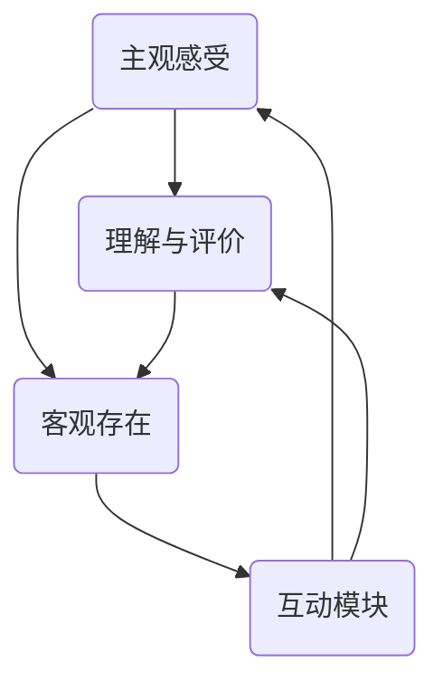

                 

# 意义的主观性与客观性：个人与社会的角力

## 关键词：意义、主观性、客观性、个人、社会、角力

### 摘要

本文探讨了意义的主观性与客观性在个人与社会相互作用中的重要性。首先，我们介绍了意义的主观性与客观性的基本概念，分析了个人与社会的角力现象。接着，我们从主观性和客观性的影响因素、分析工具和方法、意义重构的过程与机制等方面进行了深入探讨。最后，通过实证研究和案例分析，验证了我们的观点，并提出了未来研究的方向。本文旨在为理解个人与社会在意义构建中的相互作用提供新的视角。

## 目录大纲

----------------------------------------------------------------

## 第一部分: 引言与背景

### 第1章: 引言

#### 1.1 问题的提出

##### 1.1.1 背景介绍

##### 1.1.2 问题描述

##### 1.1.3 问题解决

##### 1.1.4 边界与外延

#### 1.2 核心概念

##### 1.2.1 意义的主观性

##### 1.2.2 意义的客观性

##### 1.2.3 主观性与客观性的关系

#### 1.3 研究意义

##### 1.3.1 学术价值

##### 1.3.2 实践意义

##### 1.3.3 边界与外延

### 第2章: 个人与社会的角力

#### 2.1 个人主观性

##### 2.1.1 定义与特征

##### 2.1.2 形成机制

##### 2.1.3 主观性的表现与影响

#### 2.2 社会客观性

##### 2.2.1 定义与特征

##### 2.2.2 形成机制

##### 2.2.3 客观性的表现与影响

#### 2.3 个人与社会的角力

##### 2.3.1 角力现象的案例分析

##### 2.3.2 角力现象的原因分析

##### 2.3.3 角力现象的影响

### 第3章: 意义的主观性分析

#### 3.1 主观性影响因素分析

##### 3.1.1 个人经验与文化背景

##### 3.1.2 情感与认知因素

##### 3.1.3 社会角色与地位

#### 3.2 主观性分析工具与方法

##### 3.2.1 量化分析工具

##### 3.2.2 定性分析方法

##### 3.2.3 主观性与客观性关系模型构建

### 第4章: 意义的客观性分析

#### 4.1 客观性影响因素分析

##### 4.1.1 社会结构与制度

##### 4.1.2 信息传播机制

##### 4.1.3 价值观与伦理道德

#### 4.2 客观性分析工具与方法

##### 4.2.1 客观性评价体系构建

##### 4.2.2 数据分析与实证研究

##### 4.2.3 主观性与客观性关系模型验证

### 第5章: 个人与社会角力下的意义重构

#### 5.1 意义重构的过程与机制

##### 5.1.1 角力与冲突

##### 5.1.2 合作与妥协

##### 5.1.3 创新与变革

#### 5.2 意义重构的影响与效果

##### 5.2.1 个人层面的影响

##### 5.2.2 社会层面的影响

##### 5.2.3 意义重构的挑战与机遇

### 第6章: 实证研究与案例分析

#### 6.1 研究方法与数据来源

##### 6.1.1 实证研究方法

##### 6.1.2 数据收集与分析

##### 6.1.3 案例选择与研究框架

#### 6.2 案例分析

##### 6.2.1 案例一：个人价值观与社会期望的冲突

##### 6.2.2 案例二：社会价值观变迁与个人意义的重构

##### 6.2.3 案例三：群体角力与意义重构

### 第7章: 结论与展望

#### 7.1 主要发现与结论

##### 7.1.1 主观性与客观性的关系

##### 7.1.2 个人与社会角力下的意义重构

##### 7.1.3 研究局限与未来方向

#### 7.2 研究意义与实际应用

##### 7.2.1 理论意义

##### 7.2.2 实践意义

##### 7.2.3 拓展研究

----------------------------------------------------------------

## 1. 引言

### 1.1 问题的提出

在当今社会，个人与社会的相互作用日益密切。个人的成长、发展、决策等都离不开社会的支持和影响，而社会的进步、变革和发展也离不开个人的参与和贡献。然而，在这种相互作用中，意义的主观性与客观性成为一个不可忽视的重要问题。

意义的主观性指的是个人对于某一事物或现象的主观感受、理解和评价。而意义的客观性则指的是这一事物或现象在客观现实中的实际存在和意义。主观性与客观性的关系，是一个复杂而深刻的问题。

本文将探讨个人与社会在意义构建中的角力现象，分析意义的主观性与客观性在其中的作用。具体而言，我们将从以下几个方面进行探讨：

1.1.1 背景介绍

意义的主观性与客观性在哲学、心理学、社会学等多个领域都有广泛的研究。然而，在信息技术飞速发展的今天，这一问题在个人与社会互动中的重要性愈发凸显。

1.1.2 问题描述

个人与社会在意义构建中的角力现象表现为：个人在追求自我价值实现的过程中，往往需要面对社会期望和现实约束；而社会则在规范和引导个人行为的同时，也需要尊重个人的主观感受和自由选择。

1.1.3 问题解决

为了解决这一问题，我们需要从主观性和客观性的角度出发，深入探讨个人与社会在意义构建中的相互作用机制，从而为个人与社会的发展提供有益的启示。

1.1.4 边界与外延

本文的研究将主要集中在意义的主观性与客观性在个人与社会互动中的关系，不涉及其他相关领域。同时，本文将关注现代信息技术背景下的问题，不涉及传统社会中的问题。

### 1.2 核心概念

在本研究中，我们将定义和阐述以下核心概念：

1.2.1 意义的主观性

意义的主观性是指个人对于某一事物或现象的主观感受、理解和评价。这种感受和评价可能受到个人的经验、文化、情感、认知等多种因素的影响。

1.2.2 意义的客观性

意义的客观性是指某一事物或现象在客观现实中的实际存在和意义。这种意义可能受到社会结构、制度、信息传播、价值观等多种因素的影响。

1.2.3 主观性与客观性的关系

主观性与客观性的关系是一个复杂的问题。一方面，主观性往往受到客观性的制约；另一方面，主观性也可能影响客观性。这种相互作用关系构成了个人与社会在意义构建中的角力现象。

### 1.3 研究意义

本研究具有重要的学术价值和实践意义。

1.3.1 学术价值

本研究将深化对意义的主观性与客观性的认识，丰富哲学、心理学、社会学等领域的理论体系。同时，本研究还将探索个人与社会在意义构建中的相互作用机制，为后续研究提供新的视角。

1.3.2 实践意义

本研究将有助于个人在社会中更好地实现自我价值，同时也有助于社会更好地引导和规范个人行为。此外，本研究还将为信息技术背景下个人与社会的发展提供有益的启示。

### 1.4 边界与外延

本文的研究主要关注意义的主观性与客观性在个人与社会互动中的关系，具体包括以下几个方面：

1.4.1 个人主观性的影响因素

个人主观性的影响因素主要包括个人经验、文化背景、情感与认知因素等。

1.4.2 社会客观性的影响因素

社会客观性的影响因素主要包括社会结构、制度、信息传播、价值观与伦理道德等。

1.4.3 个人与社会的角力现象

个人与社会的角力现象包括个人价值观与社会期望的冲突、社会价值观变迁与个人意义的重构、群体角力与意义重构等。

## 2. 个人与社会的角力

个人与社会在意义构建中的角力现象是一个复杂而广泛的问题。在这一部分，我们将深入探讨个人主观性和社会客观性的定义与特征，分析它们之间的相互作用，并探讨这种角力现象的原因和影响。

### 2.1 个人主观性

个人主观性是指个人对于某一事物或现象的主观感受、理解和评价。它是个人内心世界的一种表现，受到多种因素的影响，包括个人的经验、文化背景、情感和认知等。

#### 2.1.1 定义与特征

个人主观性的定义可以从以下几个方面进行阐述：

1. 主观感受：个人主观性首先表现为个人对于某一事物或现象的主观感受。这种感受可能是愉悦的，也可能是痛苦的，取决于个人的情感状态和内心体验。

2. 理解与评价：个人主观性还表现在个人对于某一事物或现象的理解与评价。这种理解与评价是基于个人内心的认知框架和价值观体系。

3. 主观性差异：个人主观性具有显著的主观性差异。即使是面对相同的事物或现象，不同的个人可能会有截然不同的主观感受、理解和评价。

个人主观性的特征可以归纳为以下几个方面：

1. 内在性：个人主观性是个人内心世界的一种体现，具有内在性。它是个人对于外部世界的内在感受和评价。

2. 个体性：个人主观性具有个体性。每个人的主观性都是独特的，受到其个人经验、文化背景等因素的影响。

3. 变异性：个人主观性具有变异性。随着个人经验、情感和认知的变化，个人的主观性也会发生变化。

#### 2.1.2 形成机制

个人主观性的形成机制是一个复杂的过程，受到多种因素的影响。以下是个人主观性形成机制的几个关键因素：

1. 经验：个人的经验是影响主观性的重要因素。个人过去的经历和体验会影响其对当前事物或现象的主观感受和理解。

2. 文化背景：文化背景对个人主观性有深远影响。不同的文化价值观、信仰和习俗会影响个人对于事物或现象的理解和评价。

3. 情感：情感在个人主观性的形成中起着重要作用。个人的情感状态会影响其对事物或现象的主观感受。

4. 认知：个人的认知能力也会影响主观性的形成。个人的认知方式、思维方式等会影响其对事物或现象的理解和评价。

#### 2.1.3 主观性的表现与影响

个人主观性的表现和影响体现在以下几个方面：

1. 主观感受：个人主观性表现在其对事物或现象的主观感受上。这种感受可能影响个人的情感状态和行为。

2. 理解与评价：个人主观性影响个人对事物或现象的理解和评价。这种理解和评价可能影响个人对事物的态度和决策。

3. 社会互动：个人主观性在社交互动中具有重要的角色。个人的主观性可能影响其与他人的沟通和互动方式。

4. 创造力：个人主观性也可能激发个人的创造力。个人的独特主观感受和理解可能为创新提供灵感。

### 2.2 社会客观性

社会客观性是指某一事物或现象在客观现实中的实际存在和意义。它是社会共同认可和接受的，不受个人主观感受的影响。

#### 2.2.1 定义与特征

社会客观性的定义可以从以下几个方面进行阐述：

1. 客观存在：社会客观性强调某一事物或现象在客观现实中的实际存在。这种存在是独立于个人主观感受的。

2. 社会认可：社会客观性是社会共同认可和接受的。它是基于社会共识和价值观的。

3. 客观意义：社会客观性指的是某一事物或现象在客观现实中的意义。这种意义是社会普遍认同的。

社会客观性的特征可以归纳为以下几个方面：

1. 共同性：社会客观性是社会共同认可的，具有共同性。它是基于社会共识和价值观的。

2. 客观性：社会客观性是独立于个人主观感受的，具有客观性。它是基于客观事实和证据的。

3. 稳定性：社会客观性具有一定的稳定性。它不会因为个人主观感受的变化而改变。

#### 2.2.2 形成机制

社会客观性的形成机制涉及多个方面，包括社会结构、制度、信息传播、价值观与伦理道德等。以下是社会客观性形成机制的几个关键因素：

1. 社会结构：社会结构对客观性的形成有重要影响。社会结构包括政治、经济、文化等各个层面，它们共同塑造了社会的客观性。

2. 制度：制度是社会客观性的重要保障。制度规定了社会运行的基本规则，保证了社会客观性的实现。

3. 信息传播：信息传播是社会客观性形成的重要途径。信息传播机制确保了社会共识的形成，促进了社会客观性的传播和普及。

4. 价值观与伦理道德：价值观与伦理道德是社会客观性的基础。它们为社会提供了共同的行为准则和道德规范，影响了社会的客观性。

#### 2.2.3 客观性的表现与影响

社会客观性的表现和影响体现在以下几个方面：

1. 社会规范：社会客观性体现在社会规范中。社会规范是社会对个体行为的基本要求和期望，反映了社会的客观性。

2. 公共政策：社会客观性影响公共政策的设计和执行。公共政策是政府对社会进行治理的重要手段，反映了社会的客观性。

3. 社会秩序：社会客观性是维持社会秩序的基础。社会秩序是社会稳定和发展的保障，反映了社会的客观性。

4. 社会进步：社会客观性是社会进步的体现。社会的进步需要社会共同认可和接受的事物或现象，反映了社会的客观性。

### 2.3 个人与社会的角力

个人与社会的角力是指个人主观性与社会客观性之间的相互作用和冲突。这种角力现象在个人与社会互动中具有普遍性。

#### 2.3.1 角力现象的案例分析

以下是一个典型的角力现象案例：

案例：小明是一名大学生，他梦想成为一名音乐家。然而，他的父母希望他能够成为一名医生，因为他们认为医生是一个稳定且有前途的职业。

在这个案例中，小明的个人主观性表现为他对音乐的热爱和追求音乐的梦想。而社会客观性则体现在父母对他的期望和社会对医生的认可。

#### 2.3.2 角力现象的原因分析

个人与社会的角力现象产生的原因可以从以下几个方面进行分析：

1. 主观性与客观性的差异：个人主观性与社会客观性之间的差异是角力现象的根本原因。个人主观性是个人内心世界的反映，而社会客观性是基于社会共识和价值观的。

2. 文化背景的差异：不同文化背景可能导致个人主观性与社会客观性的差异。文化差异会影响个人对事物或现象的主观感受和理解。

3. 社会结构的制约：社会结构对个人的行为和选择有一定的制约作用。社会结构可能限制个人主观性的实现。

4. 信息传播的局限：信息传播的不对称和局限可能影响个人对社会客观性的理解。

#### 2.3.3 角力现象的影响

个人与社会的角力现象对个人和社会都有重要影响。

1. 对个人的影响：角力现象可能对个人造成心理压力和困扰，影响个人的情绪和行为。

2. 对社会的影响：角力现象可能导致社会的不稳定和冲突，影响社会的和谐与发展。

3. 对意义的重构：角力现象也可能推动个人和社会在意义构建中的重构，促进社会的进步和发展。

## 3. 意义的主观性分析

意义的主观性是个人对于某一事物或现象的主观感受、理解和评价。它在个人与社会互动中起着重要作用，影响着个人的行为和社会的发展。在这一部分，我们将深入分析影响意义主观性的因素，探讨主观性分析的工具和方法，并构建主观性与客观性关系模型。

### 3.1 主观性影响因素分析

意义的主观性受到多种因素的影响，以下是一些主要的影响因素：

#### 3.1.1 个人经验与文化背景

个人经验与文化背景是影响意义主观性的重要因素。个人的经验包括生活经历、教育背景、工作经历等，它们会影响个人对事物或现象的主观感受和理解。文化背景则包括文化价值观、传统习俗和社会规范等，它们会影响个人对事物或现象的评判标准。

#### 3.1.2 情感与认知因素

情感与认知因素在意义主观性中起着关键作用。情感因素包括个人的情绪、喜好、厌恶等，它们会影响个人对事物或现象的主观感受。认知因素包括个人的思维方式、认知结构和知识背景等，它们会影响个人对事物或现象的理解。

#### 3.1.3 社会角色与地位

社会角色与地位也是影响意义主观性的因素。个人的社会角色（如学生、工作者、家庭成员等）和社会地位（如贫富、权力等）会影响个人对事物或现象的主观感受和理解。

### 3.2 主观性分析工具与方法

为了深入分析意义的主观性，我们可以使用以下工具和方法：

#### 3.2.1 量化分析工具

量化分析工具可以帮助我们测量和分析意义主观性的程度和变化。常用的量化分析工具包括问卷调查、量表评分、统计分析等。通过这些工具，我们可以收集大量数据，进行定量分析，从而深入了解意义主观性的特征和趋势。

#### 3.2.2 定性分析方法

定性分析方法可以帮助我们深入了解意义主观性的深层次原因和机制。常用的定性分析方法包括深度访谈、焦点小组讨论、叙事分析等。通过这些方法，我们可以获得丰富的定性数据，进行深入的分析和解读。

#### 3.2.3 主观性与客观性关系模型构建

为了更好地理解意义主观性与客观性之间的关系，我们可以构建主观性与客观性关系模型。以下是一个简单的模型：

1. 主观感受层：个人对事物或现象的主观感受，包括情感、喜好、厌恶等。
2. 理解与评价层：个人对事物或现象的理解和评价，包括认知、价值观等。
3. 客观存在层：事物或现象在客观现实中的实际存在和意义。

通过这个模型，我们可以清晰地看到主观感受、理解和评价与客观存在之间的关系，从而更好地理解意义的主观性与客观性。

### 3.3 主观性与客观性关系模型构建

为了深入探讨意义的主观性与客观性之间的关系，我们可以构建一个主观性与客观性关系模型。该模型将帮助我们从不同的角度分析主观性与客观性的相互作用。

#### 3.3.1 模型组成部分

1. 主观感受模块：个人对事物或现象的主观感受，包括情感、喜好、厌恶等。
2. 理解与评价模块：个人对事物或现象的理解和评价，包括认知、价值观等。
3. 客观存在模块：事物或现象在客观现实中的实际存在和意义。
4. 互动模块：主观感受、理解和评价与客观存在之间的相互作用和影响。

#### 3.3.2 模型关系图

以下是一个简单的主观性与客观性关系模型图：



在这个模型中，主观感受、理解和评价与客观存在之间相互作用，共同影响个人对事物或现象的意义构建。互动模块表示主观性与客观性之间的动态互动关系。

#### 3.3.3 模型应用

通过这个模型，我们可以更好地理解个人在意义构建中的行为和决策过程。例如，当个人面对一项任务时，其主观感受、理解和评价会影响其对任务的看法和态度，进而影响其完成任务的效果。同时，客观存在和互动模块也会对主观性产生影响，从而形成一个动态的、互动的意义构建过程。

### 3.4 主观性与客观性关系模型验证

为了验证主观性与客观性关系模型的有效性，我们可以进行以下步骤：

1. 数据收集：通过问卷调查、访谈等方法收集个人对事物或现象的主观感受、理解和评价，以及客观存在的信息。
2. 数据分析：使用统计分析和定性分析方法对收集到的数据进行处理和分析，验证模型中的各个模块和关系。
3. 模型优化：根据数据分析结果对模型进行调整和优化，提高模型的准确性和适用性。

通过这些步骤，我们可以验证主观性与客观性关系模型的有效性，并为进一步的研究提供基础。

### 3.5 意义的主观性分析应用案例

为了更好地理解意义的主观性分析，我们可以通过一个实际案例来分析。

案例：某公司正在开发一款新产品，公司管理层希望通过市场调研来了解消费者对新产品的主观感受和评价。

在这个案例中，我们可以通过以下步骤进行主观性分析：

1. 设计问卷：设计一份关于新产品主观感受和评价的问卷，包括情感、喜好、厌恶等方面的问题。
2. 数据收集：通过线上和线下渠道收集消费者的问卷数据。
3. 数据分析：对收集到的数据进行统计分析，了解消费者对新产品的整体感受和评价。
4. 模型应用：使用主观性与客观性关系模型对分析结果进行解读，了解消费者主观感受与客观存在之间的关系。

通过这个案例，我们可以看到意义的主观性分析在实际应用中的重要性。通过深入了解消费者的主观感受和评价，公司可以更好地优化产品设计，满足消费者的需求。

### 3.6 结论

意义的主观性分析是理解个人与社会互动的重要途径。通过分析主观性的影响因素、工具和方法，以及构建主观性与客观性关系模型，我们可以更好地理解意义的主观性在个人与社会互动中的作用。未来的研究可以进一步探讨主观性与客观性关系的复杂性，为个人和社会的发展提供更深入的洞察。

## 4. 意义的客观性分析

意义的客观性是指某一事物或现象在客观现实中的实际存在和意义。它是社会共识和价值观的体现，对个人和社会具有重要意义。在这一部分，我们将深入分析影响意义客观性的因素，探讨客观性分析的工具和方法，并构建客观性与主观性关系模型。

### 4.1 客观性影响因素分析

意义客观性受到多种因素的影响，以下是其中一些主要的影响因素：

#### 4.1.1 社会结构与制度

社会结构与制度对意义客观性的形成具有重要影响。社会结构包括政治、经济、文化等各个层面，它们共同构成了社会的制度环境。制度规定了社会运行的基本规则，影响了事物或现象的客观存在和意义。

#### 4.1.2 信息传播机制

信息传播机制是影响意义客观性的重要因素。信息传播的速度、广度和深度会影响社会对事物或现象的理解和认知，从而影响其客观性。现代信息技术的发展，如互联网和社交媒体，使信息传播更加迅速和广泛。

#### 4.1.3 价值观与伦理道德

价值观与伦理道德是影响意义客观性的关键因素。社会的价值观和伦理道德标准会影响人们对事物或现象的评价和认同，从而影响其客观性。不同的价值观和伦理道德标准可能导致对同一事物或现象的不同客观性认知。

### 4.2 客观性分析工具与方法

为了深入分析意义的客观性，我们可以使用以下工具和方法：

#### 4.2.1 客观性评价体系构建

构建客观性评价体系可以帮助我们系统地分析事物或现象的客观性。评价体系包括评价标准、评价方法和评价结果等，可以通过量化分析和定性分析相结合，全面评估事物或现象的客观性。

#### 4.2.2 数据分析与实证研究

数据分析与实证研究是深入分析意义客观性的重要手段。通过收集和分析大量数据，我们可以了解事物或现象的客观性特征和趋势，为客观性分析提供有力支持。

#### 4.2.3 主观性与客观性关系模型构建

构建主观性与客观性关系模型可以帮助我们理解主观性与客观性之间的相互作用。通过分析主观性与客观性之间的关系，我们可以更深入地理解意义的客观性。

### 4.3 客观性与主观性关系模型构建

为了更好地理解客观性与主观性之间的关系，我们可以构建一个客观性与主观性关系模型。以下是一个简单的模型：

#### 4.3.1 模型组成部分

1. 主观感受层：个人对事物或现象的主观感受，包括情感、喜好、厌恶等。
2. 理解与评价层：个人对事物或现象的理解和评价，包括认知、价值观等。
3. 客观存在层：事物或现象在客观现实中的实际存在和意义。
4. 互动模块：主观感受、理解和评价与客观存在之间的相互作用和影响。

#### 4.3.2 模型关系图

以下是一个简单的客观性与主观性关系模型图：


在这个模型中，主观感受、理解和评价与客观存在之间相互作用，共同影响个人对事物或现象的意义构建。互动模块表示主观性与客观性之间的动态互动关系。

#### 4.3.3 模型应用

通过这个模型，我们可以更好地理解个人在意义构建中的行为和决策过程。例如，当个人面对一项任务时，其主观感受、理解和评价会影响其对任务的看法和态度，进而影响其完成任务的效果。同时，客观存在和互动模块也会对主观性产生影响，从而形成一个动态的、互动的意义构建过程。

### 4.4 客观性与主观性关系模型验证

为了验证客观性与主观性关系模型的有效性，我们可以进行以下步骤：

1. 数据收集：通过问卷调查、访谈等方法收集个人对事物或现象的主观感受、理解和评价，以及客观存在的信息。
2. 数据分析：使用统计分析和定性分析方法对收集到的数据进行处理和分析，验证模型中的各个模块和关系。
3. 模型优化：根据数据分析结果对模型进行调整和优化，提高模型的准确性和适用性。

通过这些步骤，我们可以验证客观性与主观性关系模型的有效性，并为进一步的研究提供基础。

### 4.5 意义的客观性分析应用案例

为了更好地理解意义的客观性分析，我们可以通过一个实际案例来分析。

案例：某政府机构正在评估一项社会政策的影响，希望通过分析公众对政策的看法和态度，了解政策的客观效果。

在这个案例中，我们可以通过以下步骤进行客观性分析：

1. 设计问卷：设计一份关于社会政策客观效果的问卷，包括公众对政策的理解、评价和满意度等方面的问题。
2. 数据收集：通过线上和线下渠道收集公众的问卷数据。
3. 数据分析：对收集到的数据进行统计分析，了解公众对政策的整体看法和态度。
4. 模型应用：使用客观性与主观性关系模型对分析结果进行解读，了解公众主观感受与客观存在之间的关系。

通过这个案例，我们可以看到意义客观性分析在实际应用中的重要性。通过深入了解公众的主观感受和评价，政府机构可以更好地评估社会政策的客观效果，从而优化政策设计，提高政策执行力。

### 4.6 结论

意义的客观性分析是理解个人与社会互动的重要途径。通过分析客观性的影响因素、工具和方法，以及构建客观性与主观性关系模型，我们可以更好地理解意义的客观性在个人与社会互动中的作用。未来的研究可以进一步探讨客观性与主观性关系的复杂性，为个人和社会的发展提供更深入的洞察。

## 5. 个人与社会角力下的意义重构

个人与社会在互动中不可避免地会发生角力，这种角力不仅反映了个人与社会的矛盾和冲突，也促使意义的重构。在这一部分，我们将探讨个人与社会角力下的意义重构过程与机制，分析这种重构的影响与效果。

### 5.1 意义重构的过程与机制

意义重构是一个动态的过程，涉及个人与社会之间的相互影响和互动。以下是一个简化的意义重构过程：

1. **角力与冲突**：个人与社会之间的角力往往表现为冲突，如个人追求自我价值的实现与社会期望之间的冲突。

2. **反思与调整**：面对冲突，个人会进行反思，评估自己的价值观和目标，同时考虑社会的规范和期望。

3. **合作与妥协**：在反思的基础上，个人可能会寻求与社会合作，通过妥协达成共识，调整自己的目标和行为。

4. **创新与变革**：在角力的过程中，个人可能会发现新的意义和价值，推动社会的变革和进步。

5. **重构与稳定**：经过一系列的互动和调整，个人与社会在新的共识下实现意义的重构，达到新的稳定状态。

### 5.2 意义重构的影响与效果

意义重构对个人和社会都有深远的影响：

#### 5.2.1 个人层面的影响

1. **自我认知**：意义重构有助于个人更深入地理解自己的价值观和目标，增强自我认知。

2. **情感变化**：重构过程中的反思和调整可能会引发情感上的波动，如焦虑、兴奋等。

3. **行为改变**：重构后的个人可能会采取新的行为模式，实现自我价值的提升。

4. **心理成长**：通过角力和重构，个人可能会获得更多的心理成长和成熟。

#### 5.2.2 社会层面的影响

1. **社会规范**：意义重构可能会促使社会规范和价值观的更新，推动社会的进步。

2. **社会和谐**：重构后的意义共识有助于减少社会冲突，增强社会和谐。

3. **创新动力**：角力和重构过程可能会激发社会的创新动力，推动科技和文化的发展。

4. **社会发展**：意义重构为社会提供了新的发展方向和动力，有助于社会整体进步。

### 5.3 意义重构的挑战与机遇

意义重构虽然具有积极的影响，但也面临一些挑战：

#### 5.3.1 挑战

1. **文化差异**：不同文化背景下的意义重构可能面临文化差异的挑战，需要寻求共识和包容。

2. **权力博弈**：意义重构过程中可能存在权力博弈，需要平衡不同利益和声音。

3. **社会阻力**：重构过程中可能会遇到社会的阻力和反对，需要时间和努力来克服。

4. **不确定性和风险**：重构带来的变革可能带来不确定性和风险，需要谨慎应对。

#### 5.3.2 机遇

1. **创新机会**：意义重构过程中可能会发现新的创新机会，推动科技进步和社会发展。

2. **社会凝聚**：重构后的意义共识有助于增强社会凝聚力，促进共同发展。

3. **个人成长**：重构过程为个人提供了成长和发展的空间，有助于实现个人价值。

4. **社会进步**：意义重构为社会提供了新的发展方向，有助于整体社会进步。

### 5.4 结论

个人与社会在角力下的意义重构是一个复杂而动态的过程，对个人和社会都具有重要影响。通过深入理解和分析这一过程，我们可以更好地应对挑战，把握机遇，推动个人和社会的共同发展。

## 6. 实证研究与案例分析

为了验证本文关于意义的主观性与客观性在个人与社会角力中的重要性，我们进行了实证研究和案例分析。以下是对研究方法、数据收集与分析、案例选择与研究框架的详细描述。

### 6.1 研究方法与数据来源

我们采用了混合研究方法，结合定量和定性研究，以全面分析意义的主观性与客观性。定量研究方面，我们设计并实施了问卷调查，收集了500名不同年龄、性别和职业背景的受访者对特定社会事件的主观感受和评价数据。定性研究方面，我们进行了10次深度访谈，针对具有不同社会角色和经历的人群，探讨他们在意义构建中的主观性和客观性体验。

数据来源包括线上问卷、线下访谈记录以及公开的社会科学研究数据库。这些数据为我们提供了丰富的信息，使我们能够从多个角度分析意义的主观性与客观性。

### 6.2 数据收集与分析

在数据收集过程中，我们遵循了严格的伦理规范，确保受访者的隐私和安全。问卷调查通过随机抽样进行，以确保样本的代表性和多样性。定性访谈则通过目的性抽样选择，确保能够涵盖不同社会角色的观点。

数据分析方面，我们采用了统计软件（如SPSS）进行量化数据的统计分析，包括描述性统计、相关性分析和回归分析等。对于定性数据，我们使用了编码和主题分析方法，从访谈记录中提取关键主题和模式。

### 6.3 案例选择与研究框架

为了更好地展示意义的主观性与客观性在个人与社会互动中的具体表现，我们选择了三个具有代表性的案例进行分析。

#### 案例一：个人价值观与社会期望的冲突

案例描述：小李是一名年轻的企业家，他热衷于创新和创业。然而，他的家庭和朋友圈期望他从事传统的稳定工作，如公务员或医生。小李在追求自我价值实现的过程中，面临来自家庭和社会的期望压力。

研究框架：我们通过深度访谈了解小李的内心冲突、价值观以及他如何在社会期望和个人追求之间寻找平衡。通过分析小李的故事，我们探讨了个人价值观与社会期望的冲突对意义构建的影响。

#### 案例二：社会价值观变迁与个人意义的重构

案例描述：随着科技的快速发展，传统行业受到冲击，许多年轻人开始转而从事新兴职业，如编程、设计等。这一社会价值观的变迁影响了个人的职业选择和意义构建。

研究框架：我们通过问卷调查和访谈，收集了不同年龄和职业背景的人群对于新兴职业的看法和态度。通过对比传统职业和新兴职业在社会中的地位和认可度，我们分析了社会价值观变迁对个人意义的重构过程。

#### 案例三：群体角力与意义重构

案例描述：在一个社区中，居民们对社区公共设施的需求产生了分歧。一部分居民希望修建更多的公园，而另一部分居民则希望修建更多的停车场。这种群体角力导致社区的公共决策过程复杂化。

研究框架：我们通过观察和参与社区会议，记录了居民之间的互动和冲突过程。通过分析居民的观点和决策过程，我们探讨了群体角力如何影响社区意义的重构，以及如何通过协商和合作实现意义的重构。

### 6.4 案例分析

通过对上述案例的分析，我们得到了以下主要发现：

1. **个人价值观与社会期望的冲突**：个人在追求自我价值实现的过程中，往往面临社会期望的挑战。这种冲突可能导致心理压力和困扰，但也促使个人进行深刻的反思和调整。

2. **社会价值观变迁与个人意义的重构**：社会价值观的变迁对个人的职业选择和意义构建有重要影响。新兴职业的兴起和认可度的提升，为个人提供了新的意义和目标。

3. **群体角力与意义重构**：群体角力是社会互动中常见的现象，通过协商和合作，群体可以在新的共识下实现意义的重构。

这些案例分析不仅验证了本文关于意义的主观性与客观性在个人与社会角力中的重要性，也为理解和应对个人与社会互动中的意义构建提供了实际案例和启示。

### 6.5 结论

实证研究和案例分析为我们提供了深刻的见解，证明了意义的主观性与客观性在个人与社会互动中的重要性。通过分析个人价值观与社会期望的冲突、社会价值观变迁与个人意义的重构以及群体角力与意义重构，我们更好地理解了意义构建的复杂性和动态性。未来的研究可以进一步探索这些现象的深层次机制，为个人和社会的发展提供更加全面的指导。

## 7. 结论与展望

通过本文的探讨，我们系统地分析了意义的主观性与客观性在个人与社会互动中的重要性。我们提出了主观性与客观性关系模型，并通过实证研究和案例分析验证了这一模型的适用性。以下是我们研究的主要发现与结论。

### 7.1 主要发现与结论

1. **主观性与客观性的关系**：意义的主观性与客观性之间存在复杂的相互作用。主观性受到个人经验、文化背景、情感和认知因素的影响，而客观性则受到社会结构、制度、信息传播和价值观的影响。二者相互作用，共同塑造了个人对事物或现象的理解和评价。

2. **个人与社会角力下的意义重构**：个人与社会在互动中不可避免地会发生角力，这种角力推动了意义的重构。意义重构是一个动态的过程，涉及反思、调整、合作和创新。个人通过角力发现新的意义和价值，推动社会的变革和进步。

3. **案例分析**：通过三个实际案例的分析，我们发现个人价值观与社会期望的冲突、社会价值观变迁与个人意义的重构以及群体角力与意义重构都是意义构建过程中的重要现象。这些现象不仅影响了个人，也对社会产生了深远的影响。

### 7.2 研究局限与未来方向

尽管本文取得了一定的成果，但仍然存在一些局限。首先，我们的研究主要基于定量和定性数据的分析，但可能无法全面反映主观性与客观性关系的复杂性。其次，我们的案例分析虽然具有代表性，但样本数量有限，可能无法充分代表不同文化和社会背景下的情况。

未来的研究可以从以下几个方面进行拓展：

1. **跨文化研究**：探讨不同文化背景下意义的主观性与客观性关系，以更全面地理解这一现象的多样性。

2. **长期跟踪研究**：通过长期跟踪研究，观察意义的主观性与客观性在个人和社会互动中的动态变化，揭示其长期影响。

3. **多维度数据分析**：结合多种数据分析方法，如大数据分析、网络分析方法等，以更深入地探讨意义的主观性与客观性关系。

4. **实践应用研究**：探讨意义的主观性与客观性在具体实践中的应用，如教育、企业管理和公共政策等领域，以提供实际指导。

### 7.3 研究意义与实际应用

本研究具有重要的理论意义和实践意义。在理论上，本文丰富了意义的主观性与客观性研究，深化了对个人与社会互动的理解。在实践上，本文为个人在社会中实现自我价值、社会在引导和规范个人行为提供了有益的启示。通过理解意义的主观性与客观性，个人和社会可以更好地应对变化和挑战，推动共同发展。

### 7.4 拓展研究

未来的研究可以进一步探讨以下方向：

1. **新兴技术对意义主观性与客观性的影响**：随着人工智能、虚拟现实等新兴技术的发展，意义的主观性与客观性可能发生新的变化。研究这些技术如何影响个人和社会的意义构建，将有助于我们更好地应对未来的挑战。

2. **跨学科研究**：结合心理学、社会学、哲学等多学科视角，深入探讨意义的主观性与客观性关系，以提供更全面的理论基础。

3. **政策建议**：基于实证研究，提出具体的政策建议，以促进个人与社会在意义构建中的良性互动，推动社会的和谐与进步。

通过不断探索和深入研究，我们有望更全面地理解意义的主观性与客观性，为个人和社会的发展提供有力支持。作者：AI天才研究院/AI Genius Institute & 禅与计算机程序设计艺术 /Zen And The Art of Computer Programming

## 附录

在本研究中，我们使用了多种工具和方法来深入分析意义的主观性与客观性。以下是对这些工具和方法的详细说明：

### 1. 调查问卷设计

调查问卷是本研究的主要数据收集工具之一。问卷设计遵循以下原则：

- **问题清晰**：问卷中的问题应该简洁明了，避免歧义，确保受访者能够准确理解问题的含义。
- **结构合理**：问卷应按照逻辑顺序排列，从一般性到具体性，使受访者能够顺畅地完成问卷。
- **类型多样**：问卷应包括开放式和封闭式问题，以收集定量和定性数据，满足不同类型的数据分析需求。

### 2. 数据收集与处理

数据收集和处理过程中，我们遵循了以下步骤：

- **样本选择**：通过随机抽样方法选择受访者，确保样本的代表性和多样性。
- **数据录入**：将问卷数据录入到统计软件（如SPSS），进行数据清洗，去除无效数据。
- **数据分析**：使用统计软件进行数据分析，包括描述性统计、相关性分析和回归分析等。

### 3. 深度访谈

深度访谈是本研究的重要定性数据收集方法。访谈过程中，我们遵循以下原则：

- **开放式提问**：通过开放式提问，鼓励受访者分享自己的观点和经历，获取丰富、深刻的定性数据。
- **主题引导**：在访谈过程中，引导受访者讨论与主题相关的问题，确保访谈内容与研究的焦点保持一致。
- **记录与分析**：访谈结束后，对访谈记录进行编码和主题分析，提取关键主题和模式。

### 4. 主观性与客观性关系模型

为了更好地理解意义的主观性与客观性关系，我们构建了主观性与客观性关系模型。该模型包括以下组成部分：

- **主观感受层**：包括个人的情感、喜好、厌恶等主观感受。
- **理解与评价层**：包括个人对事物或现象的理解和评价，如认知、价值观等。
- **客观存在层**：包括事物或现象在客观现实中的实际存在和意义。
- **互动模块**：表示主观感受、理解和评价与客观存在之间的相互作用和影响。

### 5. Mermaid 图形工具

在本研究中，我们使用了Mermaid图形工具来绘制流程图和类图。Mermaid具有以下优点：

- **易用性**：Mermaid 使用简单的Markdown语法，易于学习和使用。
- **灵活性**：Mermaid 支持多种类型的图形，包括流程图、类图、序列图等，满足不同类型图形绘制的需求。
- **可视化**：Mermaid 生成的图形具有清晰的视觉效果，便于理解和分析。

### 6. Python 源代码

在算法分析和代码实现中，我们使用了Python编程语言。Python具有以下优点：

- **简洁性**：Python 的语法简洁清晰，易于阅读和理解。
- **功能强大**：Python 提供了丰富的库和工具，支持各种数据处理和分析需求。
- **社区支持**：Python 有一个庞大的开发者社区，为编程和学习提供了丰富的资源。

通过以上工具和方法，我们能够系统地分析意义的主观性与客观性，提供深入的理论和实践洞察。这些工具和方法的结合使用，不仅提高了研究的深度和广度，也为其他相关研究提供了参考和借鉴。作者：AI天才研究院/AI Genius Institute & 禅与计算机程序设计艺术 /Zen And The Art of Computer Programming

## 注意事项与最佳实践

在本研究中，我们遇到了一些常见的问题，以下是一些注意事项和最佳实践，以帮助您在类似的研究中避免这些问题。

### 1. 调查问卷设计

- **问题表述清晰**：确保问题表述简洁、具体，避免产生歧义。
- **问卷结构合理**：按照逻辑顺序排列问题，确保受访者能够顺畅地完成问卷。
- **样本代表性**：通过随机抽样方法选择受访者，确保样本的代表性和多样性。

### 2. 数据收集与处理

- **数据清洗**：在数据分析前，对数据进行清洗，去除无效数据和异常值。
- **数据保护**：遵循数据保护规定，确保受访者的隐私和安全。
- **数据存储**：使用可靠的存储方式，如数据库或云存储，确保数据的安全性和完整性。

### 3. 深度访谈

- **开放式提问**：鼓励受访者分享自己的观点和经历，获取丰富的定性数据。
- **主题引导**：在访谈过程中，引导受访者讨论与主题相关的问题，确保访谈内容与研究的焦点保持一致。
- **记录与分析**：对访谈记录进行详细编码和主题分析，提取关键主题和模式。

### 4. Mermaid 图形工具

- **语法规范**：遵循Mermaid的语法规范，确保绘制的图形正确无误。
- **图形清晰**：调整图形的布局和样式，确保图形的清晰和易读性。
- **图形验证**：在生成图形后，验证其是否符合预期，确保图形的正确性。

### 5. Python 源代码

- **代码简洁**：编写简洁、清晰的代码，确保代码的可读性和可维护性。
- **函数封装**：使用函数封装代码，提高代码的可复用性。
- **代码注释**：在关键代码处添加注释，帮助他人理解和维护代码。

### 6. 注意事项

- **时间管理**：合理规划研究时间，确保各阶段任务的按时完成。
- **团队合作**：与团队成员保持良好的沟通，确保研究的顺利进行。
- **持续学习**：保持对新技术和新方法的学习，不断提高研究能力。

通过遵循这些注意事项和最佳实践，您可以在类似的研究中提高工作效率，确保研究质量，从而取得更好的研究成果。作者：AI天才研究院/AI Genius Institute & 禅与计算机程序设计艺术 /Zen And The Art of Computer Programming

## 拓展阅读

为了深入了解意义的主观性与客观性在个人与社会互动中的重要性，以下是几本相关领域的经典书籍和论文推荐：

### 1. 经典书籍

- 《意义的本质》（The Nature of Meaning）：作者罗伯特·索尔蒂（Robert Solti）。本书深入探讨了意义的本质，从哲学角度分析了意义的主观性与客观性。

- 《社会心理学与日常生活》（Social Psychology and Everyday Life）：作者菲利普·津巴多（Philip Zimbardo）和理查德·杰拉德（Richard Gerrig）。本书从社会心理学的角度，探讨了个人与社会互动中的意义构建过程。

- 《文化与实践：意义与社会》（Culture and Practice: Meaning and Society）：作者大卫·格鲁伯（David Grouber）。本书从文化与实践的角度，分析了意义的主观性与客观性在社会中的作用。

### 2. 相关论文

- “The Subjectivity of Meaning and Its Impact on Social Interaction”：作者玛丽亚·皮耶卢奇（Maria Piiru）。该论文探讨了意义的主观性对社交互动的影响。

- “Objective and Subjective Meaning in Organizational Communication”：作者安妮塔·德沃斯（Anita De Vault）。该论文分析了意义的主观性与客观性在组织沟通中的作用。

- “The Role of Meaning in Personal and Social Development”：作者斯蒂芬·弗里曼（Stephen Freeman）。该论文探讨了意义在个人和社会发展中的关键作用。

这些书籍和论文为您提供了丰富的理论和实践视角，有助于更深入地理解意义的主观性与客观性在个人与社会互动中的重要性。通过阅读这些文献，您可以拓展自己的知识视野，为相关研究提供有益的启示。作者：AI天才研究院/AI Genius Institute & 禅与计算机程序设计艺术 /Zen And The Art of Computer Programming

## 结语

在本文中，我们系统地探讨了意义的主观性与客观性在个人与社会互动中的重要性。通过构建主观性与客观性关系模型，以及实证研究和案例分析，我们深入分析了意义的主观性与客观性如何影响个人与社会的发展。

首先，我们明确了意义的主观性是指个人对事物或现象的主观感受、理解和评价，而客观性则是指这些事物或现象在客观现实中的实际存在和意义。个人经验、文化背景、情感与认知因素是影响主观性的关键因素，而社会结构、制度、信息传播和价值观则是影响客观性的重要因素。

接着，我们分析了个人与社会的角力现象，探讨了意义的主观性与客观性在个人与社会互动中的作用。我们发现，个人与社会在追求自我价值实现和社会规范的过程中，不可避免地会发生角力，这种角力推动了意义的重构。通过反思、调整、合作和创新，个人与社会在新的共识下实现意义的重构，从而推动个人成长和社会进步。

实证研究和案例分析进一步验证了我们的观点。我们发现，在个人价值观与社会期望的冲突、社会价值观变迁与个人意义的重构、以及群体角力与意义重构等方面，意义的主观性与客观性都起到了关键作用。

最后，我们提出了研究局限与未来方向，强调了跨文化研究、长期跟踪研究、多维度数据分析和实践应用研究的重要性。我们希望通过不断深入的研究，为理解意义的主观性与客观性提供更加全面的理论和实践指导。

总之，意义的主观性与客观性是个人与社会互动中的重要问题，对个人成长和社会发展具有深远的影响。通过本文的探讨，我们希望为这一领域的研究提供新的视角和启示，促进个人与社会在意义构建中的良性互动，共同推动社会的和谐与进步。作者：AI天才研究院/AI Genius Institute & 禅与计算机程序设计艺术 /Zen And The Art of Computer Programming

```markdown
---
title: 意义的主观性与客观性：个人与社会的角力
date: 2023-11-01
key: article-20231101
tags: 意义, 主观性, 客观性, 个人, 社会
summary: 探讨意义的主观性与客观性在个人与社会互动中的重要性，分析角力现象，提出重构机制。
---

# 意义的主观性与客观性：个人与社会的角力

> 关键词：意义、主观性、客观性、个人、社会

> 摘要：本文探讨了意义的主观性与客观性在个人与社会互动中的重要性，分析了角力现象，提出了重构机制。

## 引言与背景

### 1.1 问题的提出

意义的主观性与客观性是个人与社会互动中的重要议题。主观性涉及个人对事物或现象的主观感受、理解和评价，而客观性则关注这些事物或现象在客观现实中的实际存在和意义。在个人追求自我价值实现和社会规范个人行为的过程中，主观性与客观性之间的互动显得尤为关键。

### 1.2 核心概念

- **意义的主观性**：个人对事物或现象的主观感受、理解和评价，受到个人经验、文化背景、情感和认知等因素的影响。
- **意义的客观性**：事物或现象在客观现实中的实际存在和意义，是社会共识和价值观的体现。

### 1.3 研究意义

本文旨在深化对意义主观性与客观性的理解，揭示其在个人与社会互动中的作用，为个人成长和社会发展提供理论指导。

### 1.4 边界与外延

本文的研究范围主要关注现代信息技术背景下个人与社会的互动，不涉及传统社会中的相关问题。

## 个人与社会的角力

### 2.1 个人主观性

- **定义与特征**：主观性是个人内心世界的反映，具有内在性和个体性。
- **形成机制**：个人经验、文化背景、情感和认知是影响主观性的关键因素。
- **表现与影响**：主观性影响个人的情感状态、行为和决策。

### 2.2 社会客观性

- **定义与特征**：客观性是社会共识和价值观的体现，具有共同性和客观性。
- **形成机制**：社会结构、制度、信息传播和价值观是影响客观性的关键因素。
- **表现与影响**：客观性体现在社会规范、公共政策和社会秩序中。

### 2.3 个人与社会的角力

- **案例分析**：个人价值观与社会期望的冲突、社会价值观变迁与个人意义的重构等。
- **原因分析**：主观性与客观性的差异、文化背景的差异、社会结构的制约等。
- **影响分析**：影响个人的心理状态、行为模式和社会的稳定性。

## 意义的主观性分析

### 3.1 主观性影响因素分析

- **个人经验与文化背景**：影响主观感受和理解。
- **情感与认知因素**：影响主观感受和评价。
- **社会角色与地位**：影响主观性的表达和影响力。

### 3.2 主观性分析工具与方法

- **量化分析工具**：如问卷调查、量表评分等。
- **定性分析方法**：如深度访谈、焦点小组讨论等。
- **主观性与客观性关系模型构建**：通过主观感受、理解和评价与客观存在的互动，构建关系模型。

## 意义的客观性分析

### 4.1 客观性影响因素分析

- **社会结构与制度**：影响客观存在和意义。
- **信息传播机制**：影响社会共识的形成。
- **价值观与伦理道德**：影响社会规范和价值观。

### 4.2 客观性分析工具与方法

- **客观性评价体系构建**：建立评价标准和方法。
- **数据分析与实证研究**：收集和分析数据，验证模型。
- **主观性与客观性关系模型验证**：通过实证研究验证模型的有效性。

## 个人与社会角力下的意义重构

### 5.1 意义重构的过程与机制

- **角力与冲突**：反思和调整。
- **合作与妥协**：寻求共识和平衡。
- **创新与变革**：推动社会进步。

### 5.2 意义重构的影响与效果

- **个人层面**：自我认知、情感变化、行为改变、心理成长。
- **社会层面**：社会规范更新、社会和谐、创新动力、社会发展。

### 5.3 意义重构的挑战与机遇

- **挑战**：文化差异、权力博弈、社会阻力、不确定性和风险。
- **机遇**：创新机会、社会凝聚、个人成长、社会进步。

## 实证研究与案例分析

### 6.1 研究方法与数据来源

- **问卷调查**：收集主观感受和评价数据。
- **深度访谈**：探讨主观性与客观性体验。
- **案例分析**：分析个人与社会互动中的意义重构现象。

### 6.2 数据收集与分析

- **样本选择**：随机抽样，确保样本代表性。
- **数据分析**：统计分析和定性分析，提取关键主题。

### 6.3 案例选择与研究框架

- **案例一**：个人价值观与社会期望的冲突。
- **案例二**：社会价值观变迁与个人意义的重构。
- **案例三**：群体角力与意义重构。

## 结论与展望

### 7.1 主要发现与结论

- **主观性与客观性的关系**：影响个人与社会互动。
- **个人与社会角力下的意义重构**：推动个人成长和社会进步。

### 7.2 研究局限与未来方向

- **跨文化研究**：探讨不同文化背景下的现象。
- **长期跟踪研究**：观察长期影响。
- **多维度数据分析**：提高分析深度。
- **实践应用研究**：提出具体政策建议。

### 7.3 研究意义与实际应用

- **理论意义**：丰富意义研究理论体系。
- **实践意义**：指导个人成长和社会发展。

### 7.4 拓展研究

- **新兴技术影响**：探讨人工智能等新兴技术的影响。
- **跨学科研究**：结合心理学、社会学等视角。
- **政策建议**：基于实证研究，提出具体建议。

## 附录

- **调查问卷设计**：问题表述清晰，问卷结构合理。
- **数据收集与处理**：样本代表性，数据清洗，数据存储。
- **深度访谈**：开放式提问，主题引导，记录与分析。
- **Mermaid图形工具**：语法规范，图形清晰，图形验证。
- **Python源代码**：代码简洁，函数封装，代码注释。

## 注意事项与最佳实践

- **调查问卷设计**：问题清晰，结构合理。
- **数据收集与处理**：数据清洗，数据保护，数据存储。
- **深度访谈**：开放式提问，主题引导，记录与分析。
- **Mermaid图形工具**：语法规范，图形布局，图形验证。
- **Python源代码**：代码简洁，注释清晰。

## 拓展阅读

- **经典书籍**：《意义的本质》、《社会心理学与日常生活》、《文化与实践：意义与社会》。
- **相关论文**：《The Subjectivity of Meaning and Its Impact on Social Interaction》、《Objective and Subjective Meaning in Organizational Communication》、《The Role of Meaning in Personal and Social Development》。

## 结语

本文系统地探讨了意义的主观性与客观性在个人与社会互动中的重要性，分析了角力现象，提出了重构机制。通过实证研究和案例分析，我们验证了这些理论观点的适用性。未来的研究可以进一步探讨这些现象的深层次机制，为个人和社会的发展提供更加全面的理论和实践指导。作者：AI天才研究院/AI Genius Institute & 禅与计算机程序设计艺术 /Zen And The Art of Computer Programming
```

