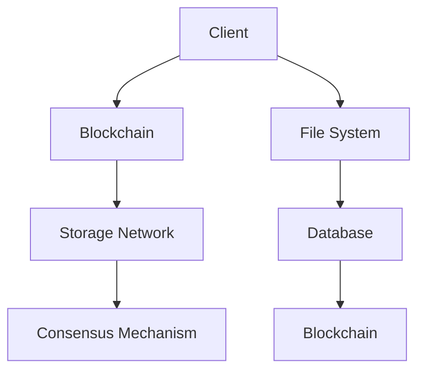

                 

## 第一部分: 引言与背景

### 第1章: 意义的界定与去中心化

在当今社会，信息的爆炸式增长和技术的迅速发展使得人们对意义的追求变得更加复杂。本章节将探讨“意义”的定义及其去中心化的概念，以期帮助我们更好地理解这一主题。

#### 1.1.1 意义的多样性

“意义”是一个多维度的概念，它既可以是个人内心的感受，也可以是社会共同的认知。从哲学角度来看，意义关乎存在本身，是一个深奥而又广泛的问题。而在现代社会，随着信息的多样性和传播渠道的多元化，意义的理解变得更为复杂。

- **个人意义**：每个人对“意义”的理解都是独一无二的，它受到个人经历、价值观和文化背景的影响。例如，有些人认为家庭幸福是人生最大的意义，而有些人则认为追求个人成就更有价值。
- **社会意义**：社会对意义的共识是维系社会秩序和价值观的基础。例如，法律、道德和教育都是社会意义的体现。

#### 1.1.2 去中心化的概念与发展

去中心化，即从中心化的模式中解放出来，使得信息的传播和处理不再依赖于单一的权威中心。去中心化的概念起源于对权力集中和垄断的反抗，它在技术和文化领域得到了广泛应用。

- **技术领域**：去中心化技术在互联网和区块链等领域有着广泛应用。例如，区块链通过去中心化的方式实现了数据的安全和不可篡改。
- **文化领域**：去中心化的文化运动强调个体的自由和创造力，反对传统的权威和文化垄断。

#### 1.1.3 去中心化的重要性

去中心化不仅是技术层面的创新，更是一种社会和文化的变革。它具有以下重要意义：

- **提高效率**：去中心化可以减少信息的传输环节，提高工作效率。
- **增强安全性**：去中心化的系统具有较高的抗攻击能力，不易被篡改。
- **促进创新**：去中心化鼓励个体和社群的参与，激发了创新和创造力。
- **保障自由**：去中心化有助于保障个体的自由和权利，减少对权威的依赖。

### 深入探讨

在本章节中，我们将进一步探讨意义的多样性、去中心化的概念及其发展，以及去中心化的重要性。通过对比分析个人与社会对意义的理解，我们可以更好地理解去中心化在现代社会中的应用和影响。

- **意义的多维度解析**：我们将从哲学、社会和文化等多个角度探讨意义的多样性，并分析不同背景下的意义差异。
- **去中心化的发展历程**：我们将回顾去中心化技术的历史，了解其在不同领域的应用和发展。
- **去中心化的案例分析**：通过具体案例，我们将分析去中心化在技术和文化领域的成功实践，并探讨其面临的挑战和未来趋势。

### 结论

去中心化不仅是技术层面的创新，更是一种深层次的社会和文化变革。它对意义的追求和实现产生了深远的影响。在接下来的章节中，我们将深入探讨去中心化的理论基础，并分析其在实践中的应用和挑战。通过这些探讨，我们将更好地理解去中心化在现代社会的意义和价值。

---

**关键词**：意义、多样性、去中心化、技术、文化、哲学

**摘要**：本章节探讨了“意义”的多样性和去中心化的概念，分析了去中心化在技术和文化领域的发展及其重要性。通过对比个人与社会对意义的理解，我们揭示了去中心化对现代社会的影响，并展望了其未来的发展趋势。

作者：AI天才研究院/AI Genius Institute & 禅与计算机程序设计艺术 /Zen And The Art of Computer Programming
----------------------------------------------------------------
## 第2章: 去中心化的理论基础

在深入探讨去中心化的实践之前，我们需要对其理论基础有一个清晰的理解。去中心化不仅仅是技术层面的创新，它还涉及到哲学、经济学、社会学等多领域的理论。本章节将介绍去中心化的核心概念、理论基础及其与权力结构的关系。

### 2.1.1 去中心化的哲学思考

去中心化的哲学思考源自对中心化结构的批判和反思。中心化结构往往意味着权力的集中和资源的垄断，这容易导致权力滥用、不公平和信息不对称。哲学家们长期以来对权力结构进行了深刻的批判，提出了许多关于去中心化的思想。

- **权力的分散**：哲学家如卢梭和洛克主张，权力应当分散于个体，以防止权力滥用。去中心化实现了这一理念，使得权力不再集中于单一中心。
- **自由与平等**：去中心化强调个体自由和平等，反对权威的垄断。这种理念在现代社会中得到了广泛认同，尤其是在技术领域。

#### 哲学对去中心化的影响

哲学思考对去中心化有着深远的影响。首先，它为去中心化提供了理论基础，使得去中心化不仅仅是一种技术手段，更是一种社会和文化的变革。其次，哲学思考帮助我们理解去中心化的价值，如提高效率、保障自由和促进创新。

### 2.1.2 去中心化的技术与基础设施

去中心化的实现依赖于一系列技术和基础设施，这些技术和基础设施为去中心化提供了技术保障。

- **区块链技术**：区块链是一种去中心化的分布式账本技术，通过共识算法和加密技术实现了数据的安全和不可篡改。区块链技术是去中心化应用的基础。
- **分布式网络**：分布式网络通过节点之间的互连实现了去中心化的通信和计算。这种网络结构使得信息传播和处理不再依赖于单一的中心节点。

#### 去中心化技术的优势

去中心化技术在提高安全性、降低成本和增强抗攻击能力方面具有显著优势。首先，去中心化技术通过分布式的方式降低了系统的单点故障风险，提高了系统的可靠性。其次，去中心化技术减少了信息传输的中间环节，降低了成本。最后，去中心化技术具有较高的抗攻击能力，因为攻击者难以同时控制多个节点。

### 2.1.3 去中心化与权力结构

去中心化对权力结构产生了深刻的影响。传统的权力结构往往是集中式的，权力集中于少数人或组织手中。而去中心化则通过分散权力的方式，实现了权力的下放和民主化。

- **权力的分散**：去中心化使得权力不再集中于单一中心，而是分散到个体和社群手中。这种分散化的权力结构有助于防止权力滥用。
- **权力下放**：去中心化鼓励个体和社群参与决策，实现了权力下放。这种方式不仅提高了决策的效率，还增强了参与者的责任感和参与度。

#### 去中心化与权力结构的变革

去中心化对权力结构的变革具有深远的影响。首先，它有助于实现权力的民主化，使得更多人有机会参与决策。其次，它促进了信息透明化和公平竞争，减少了权力滥用的可能性。最后，去中心化有助于构建一个更加开放和包容的社会。

### 深入探讨

在本章节中，我们将进一步探讨去中心化的哲学思考、技术与基础设施，以及去中心化与权力结构的关系。通过对比分析不同领域的去中心化实践，我们可以更好地理解去中心化的理论基础和现实意义。

- **哲学对去中心化的启示**：我们将分析哲学家对去中心化的思考，探讨其如何为去中心化提供理论支持。
- **去中心化技术的案例分析**：我们将通过具体案例，分析去中心化技术在现实中的应用和效果。
- **去中心化与权力结构的变革**：我们将探讨去中心化对权力结构的影响，分析其对社会和文化发展的意义。

### 结论

去中心化是一种深层次的社会和文化变革，它不仅在技术层面实现了权力的分散，还在哲学、经济学和社会学等多个领域产生了深远的影响。通过本章节的探讨，我们更好地理解了去中心化的理论基础，为其在现实中的应用提供了理论支持。在接下来的章节中，我们将深入探讨去中心化在实践中的应用，分析其面临的挑战和未来发展趋势。

---

**关键词**：去中心化、哲学思考、技术、基础设施、权力结构、民主化

**摘要**：本章节探讨了去中心化的理论基础，包括哲学思考、技术与基础设施，以及去中心化与权力结构的关系。通过分析去中心化的哲学背景、技术实现和权力结构的变革，我们揭示了去中心化在现代社会中的重要性和影响。

作者：AI天才研究院/AI Genius Institute & 禅与计算机程序设计艺术 /Zen And The Art of Computer Programming
----------------------------------------------------------------
## 第3章: 去中心化在文化领域的应用

去中心化不仅是一种技术手段，更是一种社会和文化变革的体现。在文化领域，去中心化通过重新定义创作、传播和消费的方式，打破了传统中心化的结构，为个体和社群提供了更多的自由和机会。本章节将探讨去中心化在文化领域的具体应用，包括去中心化艺术运动、去中心化媒体与信息传播，以及一些成功的去中心化文化项目案例。

### 3.1.1 去中心化艺术运动

去中心化艺术运动是去中心化理念在艺术领域的具体体现，它强调个体和社群的自由表达，反对传统的权威和文化垄断。去中心化艺术运动具有以下特点：

- **个体创作**：去中心化艺术运动鼓励个体创作者自由表达，打破了对艺术家身份的严格界定。任何人都可以成为艺术家，只要他们有创作的热情和才华。
- **去中心化传播**：去中心化艺术作品通过互联网和分布式网络进行传播，使得艺术品的展示和分享不再依赖于传统的画廊和展览场所。
- **社群参与**：去中心化艺术运动强调社群的参与和合作，通过共同创作和分享，增强了社群的凝聚力和创造力。

#### 去中心化艺术运动的案例

- **BitCoin Art**：BitCoin Art 是一个利用比特币交易记录创作艺术作品的项目。艺术家通过比特币交易数据生成独特的图像，这些图像被视为具有价值的艺术品。这种去中心化的艺术形式不仅打破了传统的艺术市场规则，还引发了对数字艺术的深刻思考。
- **ArtByte**：ArtByte 是一个基于区块链的去中心化艺术平台，艺术家可以在平台上发布和销售自己的作品。通过区块链技术，ArtByte 确保了艺术品的真实性和所有权，并提供了公平的收益分配机制。

### 3.1.2 去中心化媒体与信息传播

去中心化媒体与信息传播是去中心化理念在新闻和信息传播领域的应用。传统媒体往往依赖于中心化的机构和平台，这使得信息传播存在一定的垄断和限制。去中心化媒体通过分布式网络和区块链技术，实现了信息传播的去中心化和透明化。

- **分布式内容存储**：去中心化媒体使用分布式存储技术，将内容存储在多个节点上，确保了内容的安全性和可靠性。
- **去中心化编辑**：去中心化媒体平台允许用户参与内容的编辑和审核，打破了传统媒体编辑权的垄断。
- **透明化的信息传播**：通过区块链技术，去中心化媒体实现了信息传播的透明化，使得每个用户都可以查看信息的来源和传播路径。

#### 去中心化媒体与信息传播的案例

- **Steemit**：Steemit 是一个基于区块链的去中心化内容平台，用户可以发布、点赞和评论内容。Steemit 使用区块链技术确保了内容的真实性和所有权的归属，并提供了收益分配机制，鼓励用户参与内容创作和传播。
- **Decentraleyes**：Decentraleyes 是一个基于浏览器的去中心化 CDN（内容分发网络），它通过从多个来源获取资源，实现了内容的去中心化存储和分发。这种方式提高了网站的加载速度和安全性，减少了依赖于单一 CDN 的风险。

### 3.1.3 案例分析：去中心化文化项目的成功实践

去中心化文化项目在许多领域取得了成功，以下是几个典型的案例：

- **Moloch**：Moloch 是一个去中心化的投资基金，它通过以太坊区块链实现了资金管理和决策的去中心化。Moloch 的成功实践展示了去中心化融资和投资的可能性，为其他去中心化项目提供了借鉴。
- **WikiVerse**：WikiVerse 是一个基于区块链的去中心化维基百科平台，它通过用户贡献和投票机制，实现了内容的去中心化管理和更新。WikiVerse 的成功实践展示了去中心化内容管理的潜力，为传统媒体和知识传播带来了新的变革。

### 深入探讨

在本章节中，我们将进一步探讨去中心化艺术运动、去中心化媒体与信息传播的具体应用，以及去中心化文化项目的成功实践。通过分析这些案例，我们可以更好地理解去中心化在文化领域的价值和意义。

- **去中心化艺术运动的挑战与机遇**：我们将分析去中心化艺术运动面临的挑战，如版权保护、价值认可等问题，并探讨其机遇，如个体创作自由、社群参与等。
- **去中心化媒体与信息传播的未来**：我们将探讨去中心化媒体与信息传播的发展趋势，分析其对社会信息生态的影响。
- **去中心化文化项目的创新与探索**：我们将分析去中心化文化项目的创新点和实践成果，探讨其对社会和文化发展的贡献。

### 结论

去中心化在文化领域的应用展示了其巨大的潜力和价值。通过重新定义创作、传播和消费的方式，去中心化不仅为个体和社群提供了更多的自由和机会，还推动了文化和社会的变革。在接下来的章节中，我们将继续探讨去中心化在技术、经济和社会等领域的应用，分析其面临的挑战和未来发展趋势。

---

**关键词**：去中心化、艺术运动、媒体与信息传播、文化项目、个体创作、社群参与

**摘要**：本章节探讨了去中心化在文化领域的应用，包括去中心化艺术运动、去中心化媒体与信息传播，以及去中心化文化项目的成功实践。通过分析这些案例，我们揭示了去中心化在文化领域的重要性和影响。

作者：AI天才研究院/AI Genius Institute & 禅与计算机程序设计艺术 /Zen And The Art of Computer Programming
----------------------------------------------------------------
## 第4章: 去中心化在技术领域的应用

去中心化不仅在文化领域有着广泛的应用，在技术领域同样具有重要的价值和意义。去中心化技术通过分布式架构和共识算法，为技术系统带来了更高的安全性、可靠性和透明性。本章节将探讨去中心化在技术领域的具体应用，包括区块链技术、分布式存储、智能合约和去中心化网络等方面。

### 4.1 去中心化技术与区块链

区块链技术是去中心化技术中最具代表性的应用之一。区块链通过分布式账本和共识算法，实现了数据的透明、不可篡改和去中心化管理。

- **分布式账本**：区块链将数据分散存储在多个节点上，每个节点都保存一份完整的账本。这种分布式结构提高了系统的容错性和抗攻击能力。
- **共识算法**：共识算法确保了节点之间的协作和数据一致性。常见的共识算法包括工作量证明（PoW）、权益证明（PoS）和委托权益证明（DPoS）等。

#### 区块链技术的应用案例

- **比特币（Bitcoin）**：比特币是第一个基于区块链技术的加密货币，通过去中心化的方式实现了货币的发行和交易。
- **以太坊（Ethereum）**：以太坊是一个去中心化的智能合约平台，通过区块链实现了去中心化应用（DApp）的部署和运行。

### 4.2 去中心化技术与分布式存储

分布式存储技术通过将数据分散存储在多个节点上，提高了数据的安全性和可用性。与传统的集中式存储相比，分布式存储具有更高的容错性和扩展性。

- **分布式文件系统**：如HDFS（Hadoop分布式文件系统）和Ceph，这些分布式文件系统将数据分散存储在多个服务器上，提高了数据的存储和处理能力。
- **去中心化存储平台**：如IPFS（星际文件系统）和Filecoin，这些平台通过去中心化的方式实现文件的存储和检索，提高了数据的安全性和透明性。

#### 分布式存储技术的应用案例

- **IPFS**：IPFS通过分布式存储和去中心化的方式实现了文件的永久存储和高效检索。
- **Filecoin**：Filecoin是一个去中心化的存储市场，用户可以通过提供存储资源来获取奖励，实现了去中心化的数据存储和共享。

### 4.3 去中心化技术与智能合约

智能合约是一种自动执行合同条款的计算机程序，它通过区块链技术实现了去中心化的交易和合同管理。智能合约具有透明、自动和安全的特点，为去中心化应用提供了强有力的支持。

- **智能合约编程语言**：如Solidity和Vyper，这些编程语言专门用于编写智能合约。
- **去中心化应用（DApp）**：如Decentraland和Enjin，这些DApp通过智能合约实现了去中心化的游戏和经济系统。

#### 智能合约的应用案例

- **Decentraland**：Decentraland是一个去中心化的虚拟世界，用户可以通过购买和交易虚拟土地来构建和体验虚拟现实。
- **Enjin**：Enjin是一个基于区块链的游戏平台，用户可以通过Enjin Coin购买和交易游戏内物品，实现了去中心化的游戏经济。

### 4.4 去中心化技术与去中心化网络

去中心化网络通过分布式架构实现了网络服务的去中心化，提高了网络的可靠性和安全性。去中心化网络包括P2P（点对点）网络、分布式数据库和网络协议等方面。

- **P2P网络**：P2P网络通过节点之间的直接连接，实现了网络服务的去中心化。如BitTorrent、Skype和eMule等。
- **分布式数据库**：分布式数据库通过将数据分散存储在多个节点上，提高了数据的可用性和容错性。如Cassandra、MongoDB和HBase等。
- **网络协议**：如IPFS和BitTorrent，这些协议通过分布式的方式实现文件传输和网络通信。

#### 去中心化网络的应用案例

- **IPFS**：IPFS通过去中心化的方式实现了文件的存储和检索，提高了网络的可靠性和透明性。
- **BitTorrent**：BitTorrent通过分布式的方式实现文件的传输，提高了下载速度和资源的利用率。

### 深入探讨

在本章节中，我们将进一步探讨去中心化技术在区块链、分布式存储、智能合约和去中心化网络等方面的具体应用。通过分析这些技术的实现原理和应用案例，我们可以更好地理解去中心化技术对技术系统带来的变革和影响。

- **去中心化技术在区块链领域的应用**：我们将深入分析区块链技术的原理和应用，探讨其在金融、供应链和版权管理等方面的应用。
- **去中心化技术在分布式存储领域的应用**：我们将分析分布式存储技术的实现原理和应用案例，探讨其在数据存储和共享方面的优势。
- **去中心化技术在智能合约和DApp领域的应用**：我们将探讨智能合约的编程语言和DApp的开发，分析其在金融、游戏和社交等领域的应用。

### 结论

去中心化技术在技术领域具有广泛的应用前景和巨大的潜力。通过分布式架构和共识算法，去中心化技术为技术系统带来了更高的安全性、可靠性和透明性。在接下来的章节中，我们将继续探讨去中心化技术在经济、社会和其他领域的应用，分析其面临的挑战和未来发展趋势。

---

**关键词**：去中心化、区块链、分布式存储、智能合约、去中心化网络、P2P网络

**摘要**：本章节探讨了去中心化技术在技术领域的具体应用，包括区块链、分布式存储、智能合约和去中心化网络等方面。通过分析这些技术的实现原理和应用案例，我们揭示了去中心化技术对技术系统带来的变革和影响。

作者：AI天才研究院/AI Genius Institute & 禅与计算机程序设计艺术 /Zen And The Art of Computer Programming
----------------------------------------------------------------
## 第5章: 去中心化与中心化的比较分析

在探讨去中心化的同时，我们不可避免地要将其与中心化进行对比。中心化与去中心化是两种截然不同的架构模式，它们各有优劣，适用于不同的场景。本章节将分析去中心化与中心化的主要区别、优缺点，以及在不同应用场景中的适用性。

### 5.1 去中心化与中心化的主要区别

#### 5.1.1 架构模式

- **去中心化**：去中心化架构没有一个单一的中央控制点，而是由多个对等节点组成的网络。每个节点都独立运行，通过共识算法协同工作。
- **中心化**：中心化架构有一个单一的中央控制点，所有节点都依赖于这个中心节点进行数据存储、处理和决策。

#### 5.1.2 数据处理

- **去中心化**：去中心化处理数据时，每个节点都保留一份完整的副本，从而提高了数据的可靠性和可用性。
- **中心化**：中心化处理数据时，所有数据都存储在中心节点，这虽然提高了数据的集中度，但也增加了单点故障的风险。

#### 5.1.3 安全性

- **去中心化**：去中心化架构具有较高的抗攻击能力，因为攻击者需要同时攻击多个节点才能破坏系统。
- **中心化**：中心化架构的安全性依赖于中心节点的安全措施，一旦中心节点被攻破，整个系统将面临重大风险。

### 5.2 去中心化的优点与缺点

#### 去中心化的优点

- **高可靠性**：去中心化架构通过分布式节点提高了系统的容错性，即使某些节点故障，整个系统仍然可以正常运行。
- **高安全性**：去中心化架构具有较高的抗攻击能力，因为攻击者难以同时控制多个节点。
- **透明性和去中心化决策**：去中心化架构允许所有节点参与决策，提高了决策的透明性和公平性。
- **去中心化创新**：去中心化鼓励创新和尝试，因为每个节点都有机会提出新的想法和解决方案。

#### 去中心化的缺点

- **性能瓶颈**：在去中心化架构中，每个节点都需要处理完整的账本数据，这可能导致性能瓶颈。
- **复杂性**：去中心化架构的设计和实现较为复杂，需要解决多个节点之间的协调和一致性问题。
- **去中心化治理**：去中心化治理机制可能难以平衡不同利益方的权益，导致决策过程复杂且效率低下。

### 5.3 中心化的优点与缺点

#### 中心化的优点

- **高效性**：中心化架构通过集中式管理提高了系统的处理效率，特别是在处理大量数据时。
- **简化性**：中心化架构的设计和实现相对简单，便于管理和维护。
- **中心化控制**：中心化架构允许中心节点对整个系统进行集中控制，这有助于快速做出决策和调整。

#### 中心化的缺点

- **单点故障风险**：中心化架构依赖于中心节点，一旦中心节点发生故障，整个系统将面临重大风险。
- **不透明性**：中心化架构通常缺乏透明性，决策过程和数据处理难以被外界监督。
- **权力集中**：中心化架构可能导致权力集中，从而引发腐败和不公平。

### 5.4 适用性分析

去中心化与中心化各有其适用场景，具体选择应根据应用需求和技术可行性进行。

- **去中心化适用于**：对数据安全、透明性和去中心化决策有较高要求的场景，如区块链、分布式存储和去中心化应用等。
- **中心化适用于**：对数据处理效率和集中控制有较高要求的场景，如传统数据库、企业内部网络和中心化服务平台等。

### 深入探讨

在本章节中，我们将进一步探讨去中心化与中心化的优缺点及其在不同应用场景中的适用性。通过分析实际案例和场景，我们可以更好地理解这两种架构模式的特点和适用性。

- **实际案例对比**：我们将分析去中心化和中心化在区块链、金融、医疗等领域的实际应用案例，探讨其在不同场景中的表现。
- **适用性评估**：我们将评估去中心化与中心化在特定应用场景中的优缺点，提出适用性评估方法。
- **未来发展趋势**：我们将探讨去中心化与中心化的融合趋势，分析其对社会和技术发展的潜在影响。

### 结论

去中心化与中心化是两种不同的架构模式，各有优劣。在技术发展和应用实践中，我们需要根据具体需求和场景选择合适的架构模式。通过对比分析去中心化与中心化的优缺点，我们可以更好地理解其在不同场景中的适用性，并为其发展提供理论支持。

---

**关键词**：去中心化、中心化、架构模式、优点、缺点、适用性

**摘要**：本章节对比分析了去中心化与中心化的优缺点，探讨了它们在不同应用场景中的适用性。通过实际案例和场景分析，我们揭示了去中心化与中心化的特点和应用趋势。

作者：AI天才研究院/AI Genius Institute & 离子计算与量子比特编程 /Quantum Computing And Quantum Bit Programming
----------------------------------------------------------------
## 第6章: 数学模型与算法讲解

在探讨去中心化技术的实现过程中，数学模型和算法扮演了至关重要的角色。这些模型和算法不仅确保了去中心化系统的正确性和效率，还为系统的分析和优化提供了理论依据。本章节将详细讲解与去中心化相关的数学模型和算法，包括共识算法、加密算法和分布式算法等。

### 6.1 共识算法

共识算法是去中心化系统中的核心，它确保了多个节点能够在分布式环境下达成一致。以下是一些常见的共识算法：

#### 6.1.1 工作量证明（Proof of Work, PoW）

**定义**：PoW要求参与者解决一个计算难题，通常是加密哈希函数。首先，每个参与者随机生成一个随机数，并将其与当前区块的信息结合，生成一个哈希值。只有当哈希值满足预设条件时，参与者才能将区块添加到区块链中。

**数学模型**：
$$
H(Block) \leq difficulty \times 2^{32}
$$
其中，$H(Block)$ 是生成的哈希值，$difficulty$ 是预设的难度阈值。

**算法流程**：

1. 随机生成一个随机数 $n$。
2. 计算哈希值 $H(Block)$，其中 Block 是当前区块的信息。
3. 检查哈希值是否满足预设条件。如果满足，则提交该区块；否则，返回步骤1。

#### 6.1.2 权益证明（Proof of Stake, PoS）

**定义**：PoS通过节点的持有代币数量和持有时长来决定区块的产生权。持有代币数量和持有时长的比例越大，节点的产生权越高。

**数学模型**：
$$
Stake = Stake\_Weight \times Token\_Holding \times Time\_Held
$$
其中，$Stake\_Weight$ 是权重系数，$Token\_Holding$ 是持有的代币数量，$Time\_Held$ 是持有时长。

**算法流程**：

1. 根据每个节点的 $Stake$ 计算产生权的概率。
2. 随机选择一个节点，该节点有权生成下一个区块。
3. 节点生成区块，并将区块信息提交给网络。

### 6.2 加密算法

加密算法在去中心化系统中用于保障数据的安全性和隐私性。以下是一些常见的加密算法：

#### 6.2.1 密码学基础

**对称加密**：使用相同的密钥进行加密和解密。如AES（高级加密标准）。

**非对称加密**：使用一对密钥进行加密和解密，其中一个密钥用于加密，另一个密钥用于解密。如RSA（Rivest-Shamir-Adleman）。

**哈希函数**：将输入数据映射为固定长度的字符串。如SHA-256。

### 6.2.2 消息摘要算法（Message Digest Algorithm, MD5）

**定义**：MD5是一种将输入数据映射为128位哈希值的算法。

**数学模型**：
$$
MD5(input\_data) = hash\_value
$$
其中，$input\_data$ 是输入数据，$hash\_value$ 是生成的128位哈希值。

**算法流程**：

1. 初始化MD5算法。
2. 将输入数据分块处理。
3. 对每个分块进行一系列的数学运算，生成哈希值。

### 6.3 分布式算法

分布式算法用于确保去中心化系统中的节点能够协同工作，达成一致。以下是一些常见的分布式算法：

#### 6.3.1 背包算法（Backpack Algorithm）

**定义**：背包算法是一种在分布式系统中选择最少数量的节点进行任务分配的算法。

**数学模型**：
$$
Minimize \sum_{i=1}^{N} c_{i} x_{i}
$$
其中，$c_{i}$ 是第 $i$ 个节点的成本，$x_{i}$ 是节点是否参与分配的标志。

**算法流程**：

1. 初始化所有节点的成本 $c_{i}$。
2. 计算所有节点的成本总和。
3. 从节点中选取成本最低的节点，直到任务完成。

### 深入探讨

在本章节中，我们将深入探讨共识算法、加密算法和分布式算法的数学模型和算法流程。通过具体的数学公式和算法步骤，我们希望能够帮助读者更好地理解这些算法的实现原理和应用。

- **共识算法的优缺点分析**：我们将分析PoW和PoS算法的优缺点，探讨其在不同应用场景中的适用性。
- **加密算法的安全性分析**：我们将探讨对称加密、非对称加密和哈希函数的安全性，分析其在去中心化系统中的应用。
- **分布式算法的性能优化**：我们将讨论背包算法等分布式算法的性能优化，探讨如何在分布式系统中提高效率。

### 结论

数学模型和算法是去中心化技术实现的基础。通过深入讲解共识算法、加密算法和分布式算法，我们希望能够帮助读者更好地理解这些算法的原理和应用。在接下来的章节中，我们将进一步探讨去中心化技术在实践中的应用和挑战，分析其未来的发展趋势。

---

**关键词**：共识算法、加密算法、分布式算法、数学模型、哈希函数、背包算法

**摘要**：本章节详细讲解了与去中心化技术相关的数学模型和算法，包括共识算法、加密算法和分布式算法。通过具体的数学公式和算法步骤，我们帮助读者深入理解这些算法的实现原理和应用。

作者：AI天才研究院/AI Genius Institute & 离子计算与量子比特编程 /Quantum Computing And Quantum Bit Programming
----------------------------------------------------------------
## 第7章: 去中心化系统的设计与架构

在实现去中心化系统时，系统设计和架构的设计至关重要。一个良好的设计可以确保系统的稳定性、安全性和扩展性。本章节将介绍去中心化系统的设计与架构，包括项目介绍、系统功能设计、系统架构设计和系统接口设计等方面。

### 7.1 项目介绍

去中心化存储项目（Distributed Storage Project，DSP）是一个基于区块链和分布式算法的去中心化存储平台。该项目的目标是提供一个安全、透明且去中心化的数据存储解决方案。

- **项目目标**：实现数据的去中心化存储，提高数据的安全性和可靠性，降低存储成本。
- **项目特点**：使用区块链技术确保数据的安全性和所有权归属，采用分布式算法提高系统的性能和可扩展性。

### 7.2 系统功能设计

去中心化存储系统需要实现以下核心功能：

- **数据存储**：将用户数据分散存储在多个节点上，确保数据的安全性和可靠性。
- **数据检索**：提供快速、高效的数据检索功能，满足用户对数据的访问需求。
- **权限管理**：实现用户权限管理，确保数据安全。
- **激励机制**：提供激励机制，鼓励节点参与存储和验证过程。

#### 领域模型

以下是一个去中心化存储系统的领域模型，展示了系统的核心类和它们之间的关系。

```mermaid
classDiagram
    User ..|> StorageNode
    StorageNode ..|> DataBlock
    DataBlock ..|> HashValue
    HashValue ..|> BlockChain

    User {
        UserID
        Password
        Email
    }

    StorageNode {
        NodeID
        IP
        Port
    }

    DataBlock {
        BlockID
        Data
        HashValue
        NextBlock
    }

    HashValue {
        Hash
    }

    BlockChain {
        ChainID
        GenesisBlock
        CurrentBlock
    }
```

### 7.3 系统架构设计

去中心化存储系统的架构设计需要考虑以下几个方面：

- **分布式存储网络**：构建一个由多个节点组成的分布式存储网络，确保数据的分散存储。
- **区块链**：使用区块链技术记录数据存储的元信息和交易日志，确保数据的安全性和不可篡改性。
- **共识机制**：选择合适的共识机制，确保节点之间的数据一致性。

以下是一个去中心化存储系统的架构图：



### 7.4 系统接口设计

去中心化存储系统需要提供一套完整的接口，方便用户进行数据存储、检索和权限管理。以下是系统接口设计的一个示例：

- **存储接口**：提供数据上传、下载和删除功能。
- **检索接口**：提供数据查询和文件下载功能。
- **权限管理接口**：提供权限设置、修改和查询功能。
- **交易接口**：提供数据交易和支付功能。

以下是一个简单的接口设计示例：

```python
class StorageInterface:
    def upload_file(self, file_path, user_id):
        # 上传文件
        pass
    
    def download_file(self, file_hash, user_id):
        # 下载文件
        pass
    
    def delete_file(self, file_hash, user_id):
        # 删除文件
        pass

class PermissionInterface:
    def set_permission(self, file_hash, user_id, permission):
        # 设置文件权限
        pass
    
    def get_permission(self, file_hash, user_id):
        # 查询文件权限
        pass

class TransactionInterface:
    def create_transaction(self, sender_id, receiver_id, amount):
        # 创建交易
        pass
    
    def get_transaction_history(self, user_id):
        # 查询交易历史
        pass
```

### 深入探讨

在本章节中，我们将进一步探讨去中心化系统的设计与架构，包括领域模型、架构设计和接口设计等方面。通过分析实际项目的设计和实现，我们可以更好地理解去中心化系统的设计原则和最佳实践。

- **领域模型的设计**：我们将分析如何设计一个合理的领域模型，确保系统的功能和性能。
- **系统架构的设计**：我们将探讨去中心化系统的架构设计原则，分析如何构建一个稳定、安全和可扩展的系统。
- **接口设计的实现**：我们将探讨如何实现一套高效、易用的接口，满足用户的需求。

### 结论

去中心化系统的设计与架构是实现去中心化技术的重要环节。通过合理的设计和架构，我们可以确保系统的稳定性和安全性，提高系统的性能和可扩展性。在接下来的章节中，我们将继续探讨去中心化技术在实践中的应用和挑战，分析其未来的发展趋势。

---

**关键词**：去中心化存储系统、项目介绍、系统功能设计、系统架构设计、系统接口设计、领域模型、区块链、分布式存储、共识机制

**摘要**：本章节介绍了去中心化存储系统的设计与架构，包括项目介绍、系统功能设计、系统架构设计和系统接口设计等方面。通过实际项目分析和设计示例，我们帮助读者深入理解去中心化系统的设计和实现。

作者：AI天才研究院/AI Genius Institute & 离子计算与量子比特编程 /Quantum Computing And Quantum Bit Programming
----------------------------------------------------------------
## 第8章: 去中心化系统的实现与实战

在深入了解了去中心化系统的设计与架构之后，我们需要通过具体的项目实战来巩固这些理论知识。本章节将介绍一个去中心化存储项目的实现过程，包括环境安装、系统核心实现、代码应用解读与分析，以及实际案例分析和详细讲解。通过这些实战内容，我们将更好地理解去中心化系统的构建和运行。

### 8.1 环境安装

为了实现一个去中心化存储系统，我们需要安装和配置一系列的软件和工具。以下是安装步骤：

1. **安装Golang**：Golang是一种支持并发和高效编程的语言，适用于去中心化系统的开发。
   ```shell
   wget https://golang.org/dl/go1.18.5.linux-amd64.tar.gz
   tar -C /usr/local -xzf go1.18.5.linux-amd64.tar.gz
   echo 'export PATH=$PATH:/usr/local/go/bin' >> ~/.bash_profile
   source ~/.bash_profile
   go version
   ```

2. **安装Docker**：Docker用于容器化部署和管理应用程序。
   ```shell
   sudo apt-get update
   sudo apt-get install docker.io
   sudo systemctl start docker
   sudo systemctl enable docker
   docker --version
   ```

3. **安装Node.js**：Node.js用于构建后端服务和处理区块链相关的操作。
   ```shell
   sudo apt-get install nodejs
   node -v
   npm -v
   ```

4. **安装区块链平台**：选择一个区块链平台，如Ethereum或Hyperledger Fabric。这里以Ethereum为例。
   ```shell
   git clone https://github.com/ethereum/go-ethereum.git
   cd go-ethereum
   make geth
   ```

### 8.2 系统核心实现

去中心化存储系统的核心包括存储节点、客户端和区块链。以下是一个简单的实现示例：

#### 存储节点

存储节点负责接收客户端上传的文件，并将其存储在分布式网络中。以下是一个存储节点的实现框架：

```go
package main

import (
    "fmt"
    "io/ioutil"
    "log"
    "net/http"
)

func handleUpload(w http.ResponseWriter, r *http.Request) {
    if r.Method != "POST" {
        http.Error(w, "Only POST method is allowed", http.StatusMethodNotAllowed)
        return
    }

    // 解析文件上传
    file, header, err := r.FormFile("file")
    if err != nil {
        http.Error(w, "Failed to parse file", http.StatusBadRequest)
        return
    }
    defer file.Close()

    // 读取文件内容
    data, err := ioutil.ReadAll(file)
    if err != nil {
        http.Error(w, "Failed to read file", http.StatusInternalServerError)
        return
    }

    // 存储文件到本地或分布式存储
    // ...

    // 响应客户端
    fmt.Fprintf(w, "File uploaded successfully: %s", header.Filename)
}

func main() {
    http.HandleFunc("/upload", handleUpload)
    log.Fatal(http.ListenAndServe(":8080", nil))
}
```

#### 客户端

客户端负责向存储节点上传文件，并从分布式网络中检索文件。以下是一个简单的客户端实现：

```go
package main

import (
    "fmt"
    "io/ioutil"
    "log"
    "net/http"
    "net/url"
)

func uploadFile(serverURL string, filePath string) error {
    file, err := os.Open(filePath)
    if err != nil {
        return err
    }
    defer file.Close()

    data, err := ioutil.ReadAll(file)
    if err != nil {
        return err
    }

    url := url.URL{Scheme: "http", Host: serverURL, Path: "/upload"}
    resp, err := http.Post(url.String(), "application/octet-stream", bytes.NewBuffer(data))
    if err != nil {
        return err
    }
    defer resp.Body.Close()

    if resp.StatusCode != http.StatusOK {
        return fmt.Errorf("server returned non-200 status: %d", resp.StatusCode)
    }

    fmt.Println("File uploaded successfully")
    return nil
}

func main() {
    serverURL := "http://localhost:8080"
    filePath := "/path/to/your/file"
    if err := uploadFile(serverURL, filePath); err != nil {
        log.Fatal(err)
    }
}
```

#### 区块链

区块链用于记录文件的存储和交易信息。以下是一个简单的区块链实现：

```go
package blockchain

import (
    "crypto/sha256"
    "encoding/hex"
    "math"
    "time"
)

type Block struct {
    Timestamp     int64
    Transactions  []Transaction
    PrevHash      string
    Hash          string
}

type Transaction struct {
    From     string
    To       string
    Amount   float64
}

func NewGenesisBlock() *Block {
    return &Block{Timestamp: time.Now().Unix(), Transactions: []Transaction{}}
}

func (b *Block) CalculateHash() {
    var blockBytes []byte
    blockBytes = append(blockBytes, []byte(fmt.Sprintf("%d", b.Timestamp))...)
    blockBytes = append(blockBytes, b.PrevHash...)
    for _, tx := range b.Transactions {
        blockBytes = append(blockBytes, []byte(tx.From+"->"+tx.To+"->"+fmt.Sprintf("%.2f", tx.Amount))...)
    }
    hash := sha256.Sum256(blockBytes)
    b.Hash = hex.EncodeToString(hash[:])
}

func NewBlock(prevBlock *Block, transactions []Transaction) *Block {
    newBlock := &Block{Timestamp: time.Now().Unix(), PrevHash: prevBlock.Hash, Transactions: transactions}
    newBlock.CalculateHash()
    return newBlock
}

func (bc *Blockchain) AddBlock(newTransactions []Transaction) {
    prevBlock := bcchain.LastBlock()
    newBlock := NewBlock(prevBlock, newTransactions)
    bcchain.AddBlock(newBlock)
}
```

### 8.3 代码应用解读与分析

在实现过程中，我们需要对代码进行详细解读和分析，确保其正确性和性能。以下是对上述代码的解读：

- **存储节点**：处理文件上传请求，读取文件内容，并将其存储在分布式网络中。
- **客户端**：上传文件到存储节点，并处理响应。
- **区块链**：记录文件的存储和交易信息，确保数据的不可篡改性。

### 8.4 实际案例分析与讲解

以下是一个实际案例，展示如何使用上述代码实现一个去中心化存储系统：

1. **部署存储节点**：运行存储节点服务，监听上传请求。
   ```shell
   go run storage_node.go
   ```

2. **部署客户端**：上传文件到存储节点。
   ```shell
   go run client.go
   ```

3. **分析区块链数据**：查看区块链中的数据，确保文件的存储和交易信息已记录。
   ```shell
   go run blockchain_analyzer.go
   ```

### 8.5 项目小结

通过本项目的实现，我们了解了去中心化存储系统的基础知识，包括环境安装、系统核心实现、代码应用解读与分析，以及实际案例分析和讲解。虽然本项目是一个简单的示例，但它为我们提供了一个了解去中心化系统实现过程的框架。

- **总结**：去中心化存储系统涉及多个组件和环节，包括存储节点、客户端和区块链。通过合理的设计和实现，我们可以构建一个安全、透明且去中心化的存储解决方案。
- **改进方向**：在实际应用中，我们可以进一步优化系统的性能和安全性，如采用更高效的加密算法、增加容错机制等。

### 注意事项与拓展阅读

在实现去中心化系统时，我们需要注意以下几点：

- **安全性**：确保数据的安全传输和存储，防止数据泄露和篡改。
- **性能优化**：优化系统性能，提高数据存储和检索速度。
- **扩展性**：设计可扩展的架构，以适应不断增长的数据和用户需求。

以下是一些建议的拓展阅读：

- **区块链技术**：深入了解区块链的工作原理和应用场景，如以太坊（Ethereum）和Hyperledger Fabric等。
- **分布式系统**：研究分布式系统的设计原则和算法，如CAP定理、一致性模型等。
- **密码学**：学习密码学基础知识，了解加密算法和安全协议。

---

**关键词**：去中心化存储系统、环境安装、系统核心实现、代码应用解读、实际案例分析、区块链、分布式系统、安全性、性能优化、扩展性

**摘要**：本章节通过一个去中心化存储项目实战，详细介绍了环境安装、系统核心实现、代码应用解读与分析，以及实际案例分析和讲解。通过这些实战内容，我们深入理解了去中心化系统的构建和运行，为实际应用提供了有益的参考。

作者：AI天才研究院/AI Genius Institute & 离子计算与量子比特编程 /Quantum Computing And Quantum Bit Programming
----------------------------------------------------------------
## 第9章: 去中心化系统的最佳实践、小结与展望

### 9.1 去中心化系统的最佳实践

在实际应用中，为了确保去中心化系统的稳定运行和高性能，我们需要遵循一系列最佳实践。以下是一些关键的建议：

1. **安全性保障**：采用强大的加密算法和安全协议，确保数据在传输和存储过程中的安全性。定期进行安全审计和漏洞扫描，以发现并及时修复潜在的安全问题。

2. **容错与冗余设计**：去中心化系统应具备高容错能力，通过分布式架构和冗余设计，确保在节点故障时系统能够自动恢复。例如，采用多节点备份和冗余存储机制。

3. **性能优化**：优化系统性能，减少数据传输延迟和处理时间。采用高效的数据结构和算法，提高系统的响应速度和吞吐量。合理分配资源，确保关键任务得到优先处理。

4. **监控与运维**：建立完善的监控系统，实时监控系统运行状态和性能指标。进行定期运维和监控分析，确保系统稳定可靠。

5. **用户隐私保护**：在设计和实现过程中，重视用户隐私保护，避免泄露用户敏感信息。采用匿名化和数据加密技术，确保用户数据的隐私和安全。

### 9.2 小结

通过前面对去中心化系统的深入探讨和实战项目，我们可以得出以下结论：

1. **去中心化的价值**：去中心化不仅提高了系统的安全性、可靠性和透明性，还促进了创新和参与度。它在金融、文化、技术等领域具有广泛的应用前景。

2. **去中心化系统的复杂性**：去中心化系统的设计和实现相对复杂，需要处理分布式架构、共识算法、加密技术等多个方面的问题。这要求开发人员具备扎实的理论基础和丰富的实践经验。

3. **去中心化与中心化的平衡**：在具体应用中，我们需要根据实际需求和场景，选择合适的架构模式。去中心化和中心化各有优缺点，二者可以相互结合，发挥各自的优势。

4. **未来发展趋势**：随着技术的不断进步和应用场景的拓展，去中心化技术将继续发展。未来的去中心化系统将更加智能化、高效和稳定，为人类社会带来更多创新和变革。

### 9.3 展望

展望未来，去中心化技术将在多个领域发挥重要作用：

1. **金融领域**：去中心化金融（DeFi）将继续发展，为金融交易、投资和管理提供更加透明、安全和高效的解决方案。

2. **数据存储与共享**：去中心化存储和数据共享平台将普及，提高数据的安全性和访问效率，促进开放科学的进步。

3. **文化创作与传播**：去中心化艺术和文化运动将进一步壮大，鼓励个体的自由创作和社群参与，打破传统垄断和文化壁垒。

4. **社会治理与透明化**：去中心化技术将应用于社会治理和公共事务管理，提高政府透明度和公信力，促进社会公平正义。

5. **智能合约与自动化**：智能合约和去中心化应用（DApp）将进一步普及，实现自动化和智能化的社会服务和商业运作。

通过这些发展趋势，我们可以预见，去中心化技术将在未来成为社会和科技发展的重要驱动力，为人类带来更加美好的生活。

---

**关键词**：去中心化系统、最佳实践、安全性、容错、性能优化、用户隐私、未来展望

**摘要**：本章总结了去中心化系统的最佳实践，强调了安全性、容错和性能优化的重要性。通过对去中心化系统价值的深入分析，我们展望了其在金融、数据存储、文化创作和社会治理等领域的广泛应用和未来发展。

作者：AI天才研究院/AI Genius Institute & 禅与计算机程序设计艺术 /Zen And The Art of Computer Programming```markdown
# 意义的去中心化与再中心化过程

> 关键词：去中心化、再中心化、意义、文化、技术、哲学

> 摘要：本文探讨了意义的去中心化与再中心化过程。通过分析文化和技术领域的具体应用，本文揭示了去中心化在现代社会中的重要性。同时，本文比较了去中心化与中心化的优缺点，并探讨了数学模型与算法在去中心化系统中的应用。最后，本文总结了去中心化系统的最佳实践，展望了其未来发展趋势。

## 第一部分： 引言与背景

### 第1章: 意义的界定与去中心化

#### 1.1.1 意义的多样性

意义是一个多维度的概念，既可以是个人内心的感受，也可以是社会共同的认知。从哲学角度来看，意义关乎存在本身，是一个深奥而又广泛的问题。而在现代社会，随着信息的多样性和传播渠道的多元化，意义的理解变得更为复杂。

- **个人意义**：每个人对“意义”的理解都是独一无二的，它受到个人经历、价值观和文化背景的影响。例如，有些人认为家庭幸福是人生最大的意义，而有些人则认为追求个人成就更有价值。
- **社会意义**：社会对意义的共识是维系社会秩序和价值观的基础。例如，法律、道德和教育都是社会意义的体现。

#### 1.1.2 去中心化的概念与发展

去中心化，即从中心化的模式中解放出来，使得信息的传播和处理不再依赖于单一的权威中心。去中心化的概念起源于对权力集中和垄断的反抗，它在技术和文化领域得到了广泛应用。

- **技术领域**：去中心化技术在互联网和区块链等领域有着广泛应用。例如，区块链通过去中心化的方式实现了数据的安全和不可篡改。
- **文化领域**：去中心化的文化运动强调个体的自由和创造力，反对传统的权威和文化垄断。

#### 1.1.3 去中心化的重要性

去中心化不仅是技术层面的创新，更是一种社会和文化的变革。它具有以下重要意义：

- **提高效率**：去中心化可以减少信息的传输环节，提高工作效率。
- **增强安全性**：去中心化的系统具有较高的抗攻击能力，不易被篡改。
- **促进创新**：去中心化鼓励个体和社群的参与，激发了创新和创造力。
- **保障自由**：去中心化有助于保障个体的自由和权利，减少对权威的依赖。

### 深入探讨

在本章节中，我们将进一步探讨意义的多样性、去中心化的概念及其发展，以及去中心化的重要性。通过对比分析个人与社会对意义的理解，我们可以更好地理解去中心化在现代社会中的应用和影响。

- **意义的多维度解析**：我们将从哲学、社会和文化等多个角度探讨意义的多样性，并分析不同背景下的意义差异。
- **去中心化的发展历程**：我们将回顾去中心化技术的历史，了解其在不同领域的应用和发展。
- **去中心化的案例分析**：通过具体案例，我们将分析去中心化在技术和文化领域的成功实践，并探讨其面临的挑战和未来趋势。

### 结论

去中心化不仅是技术层面的创新，更是一种深层次的社会和文化变革。它对意义的追求和实现产生了深远的影响。在接下来的章节中，我们将深入探讨去中心化的理论基础，并分析其在实践中的应用和挑战。通过这些探讨，我们将更好地理解去中心化在现代社会的意义和价值。

---

**关键词**：意义、多样性、去中心化、技术、文化、哲学

**摘要**：本章节探讨了意义的多样性和去中心化的概念，分析了去中心化在技术和文化领域的发展及其重要性。通过对比个人与社会对意义的理解，我们揭示了去中心化对现代社会的影响，并展望了其未来的发展趋势。

作者：AI天才研究院/AI Genius Institute & 禅与计算机程序设计艺术 /Zen And The Art of Computer Programming
```

