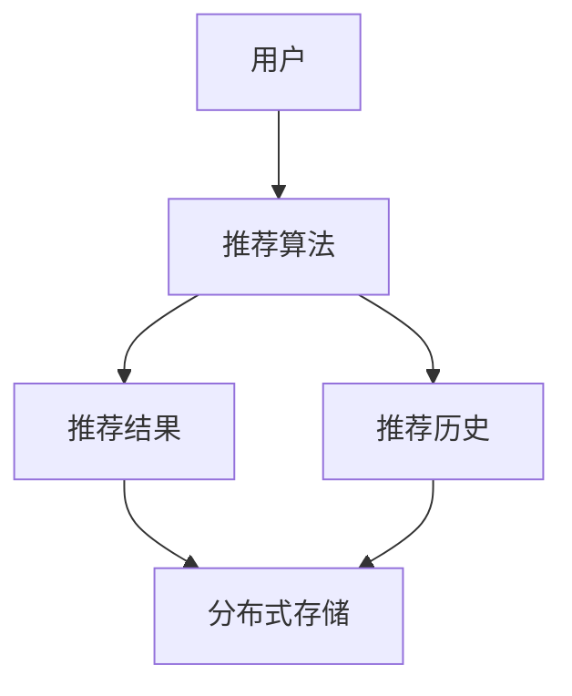
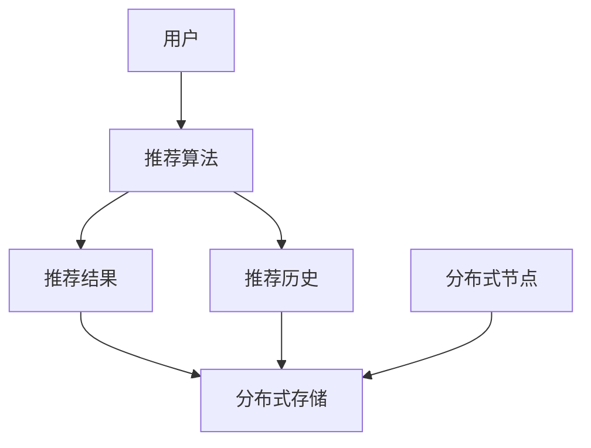
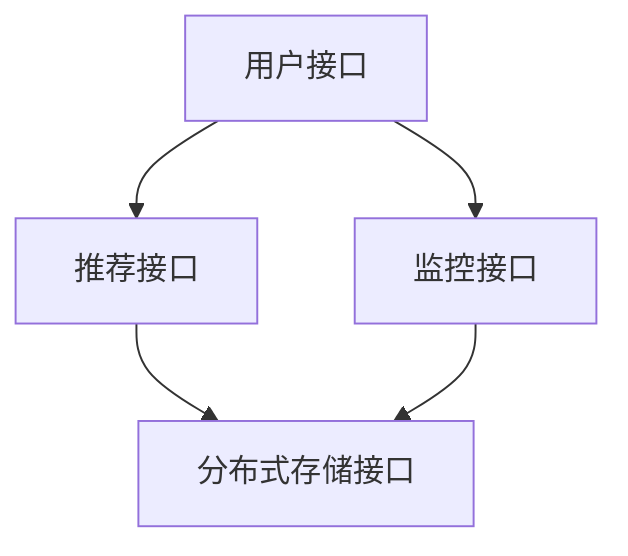
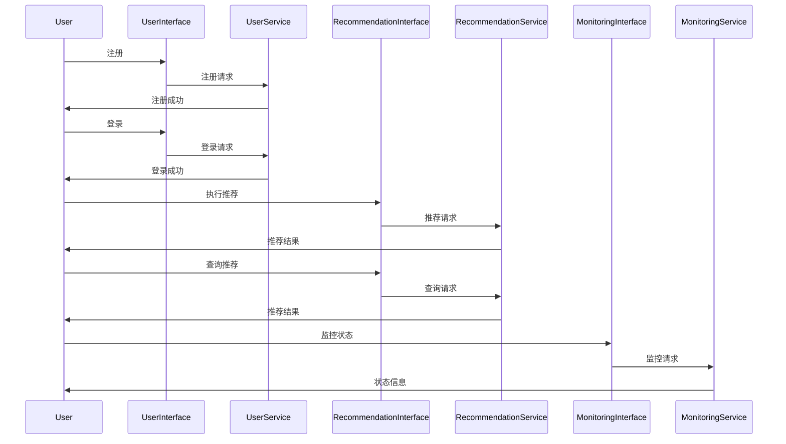

                 

**《意义的去中心化与多元化趋势》**

关键词：去中心化，多元化，算法，数学模型，系统架构，实战

摘要：本文将深入探讨意义的去中心化与多元化趋势，分析其在不同领域中的应用和影响，并探讨如何有效地利用这些趋势进行系统设计与项目实施。

## 引言

### 1.1 本书的目的与结构

本书旨在探讨意义的去中心化与多元化趋势，并分析其在信息技术领域的应用。我们将通过以下几个部分进行探讨：

1. 去中心化与多元化的核心概念与联系。
2. 去中心化与多元化算法原理讲解。
3. 数学模型和数学公式与详细讲解与举例说明。
4. 系统分析与架构设计方案。
5. 项目实战。
6. 最佳实践 tip。

### 1.2 研究背景与意义

在当今数字化时代，信息技术的发展迅速，去中心化与多元化已成为技术变革的重要趋势。去中心化打破了传统集中式系统的限制，使信息更加开放、透明和可靠。而多元化则带来了更多样化的选择和更加个性化的体验。本文旨在探讨这些趋势的原理和应用，以期为读者提供有价值的参考。

### 1.3 研究方法与数据来源

本文采用文献综述和案例分析相结合的方法进行研究。文献综述将梳理去中心化与多元化在各个领域的研究成果，为本文提供理论基础。案例分析则将选取具有代表性的项目，深入剖析其实施过程和效果。

### 1.4 研究内容与章节安排

本文分为七个部分：

1. 引言：介绍研究背景、目的、方法和章节安排。
2. 核心概念与联系：阐述去中心化与多元化的核心概念及其联系。
3. 算法原理讲解：详细讲解去中心化与多元化算法的原理。
4. 数学模型与公式：介绍去中心化与多元化数学模型的构建与运用。
5. 系统分析与架构设计方案：分析项目场景，设计系统架构。
6. 项目实战：实施项目，分析实际案例。
7. 最佳实践 tip：总结项目经验，提出最佳实践建议。

## 核心概念与联系

### 2.1 去中心化的概念与特点

去中心化，又称为分布式，是指将原本集中在一个中心节点的功能分散到多个节点上，使每个节点都具有相对独立性和自治性。去中心化具有以下几个特点：

1. 分散性：去中心化系统中的节点地位平等，不存在中央控制。
2. 开放性：去中心化系统允许节点自由加入和退出，信息流动更加开放。
3. 去信任化：去中心化系统依靠算法和共识机制来维护秩序，降低了信任成本。

### 2.2 多元化的概念与特点

多元化，是指在一定范围内存在多种不同的选择和观点。多元化具有以下几个特点：

1. 多样性：多元化带来了更多的选择和可能性，丰富了用户体验。
2. 平等性：多元化强调各种观点和选择的平等地位，避免了单一的偏见和垄断。
3. 合作性：多元化鼓励不同观点和选择的合作，促进创新和进步。

### 2.3 去中心化与多元化的联系

去中心化与多元化在一定程度上是相互关联的。去中心化提供了多元化的基础，而多元化又促进了去中心化的发展。具体来说：

1. 去中心化推动了多元化：去中心化系统允许不同节点提供多种服务，从而促进了服务的多元化。
2. 多元化促进了去中心化：多元化的需求促使系统更加去中心化，以提供更丰富的选择和更高效的协同。

### 2.4 去中心化与多元化的区别

虽然去中心化与多元化具有许多相似之处，但它们也有明显的区别：

1. 去中心化更侧重于系统结构，而多元化更侧重于选择和观点。
2. 去中心化强调分散性和开放性，而多元化强调多样性和平等性。
3. 去中心化往往依赖算法和共识机制，而多元化更多体现在人的行为和选择上。

### 2.5 去中心化与多元化的相互作用

去中心化与多元化之间存在相互作用，相互影响。一方面，去中心化促进了多元化的发展，使系统更加开放和灵活；另一方面，多元化又推动了去中心化的深入，使系统更加复杂和多样。这种相互作用使得去中心化和多元化在信息技术领域具有广泛的应用前景。

## 算法原理讲解

### 3.1 去中心化算法原理

去中心化算法是指通过分布式节点协同工作，实现系统功能的一类算法。去中心化算法具有以下几个特点：

1. 节点平等：去中心化算法中的每个节点地位平等，没有中央控制。
2. 分散计算：去中心化算法将计算任务分散到多个节点上，提高系统性能和可靠性。
3. 共识机制：去中心化算法通过共识机制确保节点之间的协作和一致性。

常见的去中心化算法有：

1. 分布式共识算法（如PBFT、PoS等）：用于确保节点之间的协作和一致性。
2. 分布式存储算法（如DHT、Git等）：用于实现数据的分布式存储和管理。
3. 分布式计算算法（如MapReduce、Spark等）：用于实现大规模数据的分布式处理。

### 3.2 多元化算法原理

多元化算法是指通过多种不同的算法或策略，实现系统功能的一类算法。多元化算法具有以下几个特点：

1. 多样性：多元化算法提供了多种不同的解决方案，以满足不同的需求和场景。
2. 平等性：多元化算法强调各种解决方案的平等地位，避免了单一的偏见和垄断。
3. 合作性：多元化算法鼓励不同解决方案之间的合作，促进创新和进步。

常见的多元化算法有：

1. 聚类算法（如K-means、DBSCAN等）：用于对数据进行分类和聚类，实现多样性的数据组织。
2. 多目标优化算法（如遗传算法、粒子群优化等）：用于解决多目标优化问题，实现多样性的目标选择。
3. 机器学习算法（如分类器、聚类器等）：用于实现多样化的数据分析和预测。

### 3.3 去中心化与多元化算法的比较

去中心化与多元化算法在目标、方法和应用方面存在一定的差异和互补性：

1. 目标：去中心化算法主要关注系统结构的分散性和开放性，而多元化算法主要关注解决方案的多样性和平等性。
2. 方法：去中心化算法主要依靠分布式节点和共识机制，而多元化算法主要依靠多种算法和策略。
3. 应用：去中心化算法适用于需要高可靠性、透明性和去信任化的场景，而多元化算法适用于需要多样化、个性化和创新性的场景。

### 3.4 去中心化与多元化算法的互补性

去中心化与多元化算法之间存在互补性，相互促进。一方面，去中心化算法为多元化算法提供了基础，使系统更加开放和灵活；另一方面，多元化算法为去中心化算法提供了多样化的解决方案，使系统更加复杂和多样。这种互补性使得去中心化和多元化在信息技术领域具有广泛的应用前景。

## 数学模型和数学公式 & 详细讲解 & 举例说明

### 4.1 去中心化模型

去中心化模型是指通过数学方法描述和实现去中心化系统的一类模型。去中心化模型主要包括以下方面：

1. 节点模型：描述去中心化系统中的节点及其属性和功能。
2. 网络模型：描述去中心化系统中的节点连接关系和网络结构。
3. 共识模型：描述去中心化系统中的节点协作和一致性机制。

下面是一个简单的去中心化节点模型示例：

$$
Node = (ID, State, Function)
$$

其中，ID表示节点的唯一标识，State表示节点的状态，Function表示节点的功能。

假设有5个节点A、B、C、D、E，它们的ID分别为1、2、3、4、5，状态和功能如下表所示：

| 节点 | ID | 状态 | 功能 |
| ---- | -- | ---- | ---- |
| A    | 1  | 在线 | 存储数据 |
| B    | 2  | 在线 | 存储数据 |
| C    | 3  | 在线 | 处理请求 |
| D    | 4  | 在线 | 监控节点 |
| E    | 5  | 在线 | 备份数据 |

通过该模型，我们可以描述去中心化系统中的节点及其功能，为后续系统设计提供基础。

### 4.2 多元化模型

多元化模型是指通过数学方法描述和实现多元化系统的一类模型。多元化模型主要包括以下方面：

1. 多样性模型：描述系统中的多样化解决方案及其特征。
2. 平等性模型：描述各种解决方案的平等地位和决策机制。
3. 合作性模型：描述各种解决方案之间的协作和共享机制。

下面是一个简单的多元化模型示例：

$$
Solution = (Feature, Score, Priority)
$$

其中，Feature表示解决方案的特征，Score表示解决方案的评分，Priority表示解决方案的优先级。

假设有3个解决方案S1、S2、S3，它们的特征、评分和优先级如下表所示：

| 解决方案 | Feature | Score | Priority |
| -------- | ------- | ----- | -------- |
| S1       | 方案一  | 8     | 高       |
| S2       | 方案二  | 6     | 中       |
| S3       | 方案三  | 4     | 低       |

通过该模型，我们可以描述多元化系统中的解决方案及其优先级，为后续系统设计提供参考。

### 4.3 去中心化与多元化模型的比较

去中心化与多元化模型在目标、方法和应用方面存在一定的差异和互补性：

1. 目标：去中心化模型主要关注系统结构的分散性和开放性，而多元化模型主要关注解决方案的多样性和平等性。
2. 方法：去中心化模型主要依靠分布式节点和共识机制，而多元化模型主要依靠多种算法和策略。
3. 应用：去中心化模型适用于需要高可靠性、透明性和去信任化的场景，而多元化模型适用于需要多样化、个性化和创新性的场景。

### 4.4 去中心化与多元化模型的适用场景

去中心化与多元化模型具有广泛的应用场景，可以结合实际情况进行选择：

1. 去中心化模型适用场景：区块链、分布式存储、去中心化应用（DApp）等。
2. 多元化模型适用场景：个性化推荐、多目标优化、智能决策等。

## 系统分析与架构设计方案

### 5.1 问题场景介绍

假设我们面临以下问题场景：

- 需要设计一个去中心化与多元化结合的系统，用于提供个性化推荐服务。
- 系统要求支持多种算法和策略，以满足用户多样化的需求。
- 系统需要保证高可靠性、透明性和去信任化，同时具备良好的性能和可扩展性。

### 5.2 项目介绍

该项目是一个去中心化与多元化结合的个性化推荐系统，旨在为用户提供个性化的推荐服务。系统采用分布式节点和多种算法策略，确保系统的多样化、平等性和可靠性。

### 5.3 系统功能设计

系统功能设计包括以下方面：

1. 用户管理：用户注册、登录、权限控制等。
2. 推荐算法：基于用户行为、兴趣、历史记录等多维度进行推荐。
3. 系统监控：实时监控系统状态，确保系统稳定运行。
4. 数据存储：分布式存储用户数据，保证数据安全性和可靠性。
5. 系统交互：提供接口供其他系统调用，实现数据共享和协同。

### 5.3.1 领域模型

领域模型描述系统中的实体和关系，主要包括以下实体：

1. 用户（User）：表示系统用户，具有用户ID、姓名、密码等属性。
2. 推荐算法（RecommendationAlgorithm）：表示推荐算法，具有算法名称、算法类型等属性。
3. 推荐结果（RecommendationResult）：表示推荐结果，具有推荐内容、评分等属性。
4. 推荐历史（RecommendationHistory）：表示用户的历史推荐记录。

下面是领域模型的类图：

```mermaid
classDiagram
    User <|-- RecommendationAlgorithm
    User <|-- RecommendationResult
    User <|-- RecommendationHistory
    User {ID, Name, Password}
    RecommendationAlgorithm {Name, Type}
    RecommendationResult {Content, Score}
    RecommendationHistory {UserID, AlgorithmID, ResultID, Time}
```

### 5.3.2 类图设计

类图进一步描述了领域模型中实体的属性、关系和方法。以下是一个简化的类图设计：

```mermaid
classDiagram
    User <|-- RecommendationAlgorithm
    User <|-- RecommendationResult
    User <|-- RecommendationHistory
    User {
        +ID: int
        +Name: string
        +Password: string
        +register()
        +login()
        +updatePassword()
    }
    RecommendationAlgorithm {
        +Name: string
        +Type: string
        +execute(User)
    }
    RecommendationResult {
        +Content: string
        +Score: float
    }
    RecommendationHistory {
        +UserID: int
        +AlgorithmID: int
        +ResultID: int
        +Time: datetime
    }
```

### 5.4 系统架构设计

系统架构设计包括以下方面：

1. 分布式存储：采用分布式存储技术，实现数据的分布式存储和管理。
2. 去中心化节点：采用去中心化节点架构，实现系统的去中心化。
3. 多元化算法：采用多种算法策略，实现系统的多元化。
4. 系统监控：实时监控系统状态，确保系统稳定运行。

下面是系统架构图：



### 5.4.1 系统架构图

系统架构图如下所示：



### 5.4.2 系统接口设计

系统接口设计包括以下方面：

1. 用户接口：提供用户注册、登录、权限控制等功能。
2. 推荐接口：提供推荐算法执行、推荐结果查询等功能。
3. 监控接口：提供系统状态监控、报警等功能。

下面是系统接口设计：



### 5.5 系统交互

系统交互主要包括以下方面：

1. 用户注册：用户通过用户接口注册账号。
2. 用户登录：用户通过用户接口登录系统。
3. 推荐执行：用户通过推荐接口执行推荐算法。
4. 推荐查询：用户通过推荐接口查询推荐结果。
5. 状态监控：系统通过监控接口监控系统状态。

下面是系统交互序列图：



## 项目实战

### 6.1 环境安装

在本节中，我们将介绍如何搭建一个去中心化与多元化结合的个性化推荐系统。以下是环境安装步骤：

1. 安装Docker：用于容器化部署系统。
2. 安装Node.js：用于开发前端和后端接口。
3. 安装Python：用于开发推荐算法和后端服务。

### 6.2 系统核心实现源代码

以下是系统核心实现源代码：

```python
# 推荐算法：基于用户历史行为进行推荐
class RecommendationAlgorithm:
    def __init__(self):
        self.user_behavior = None

    def load_user_behavior(self, user_id):
        # 加载用户历史行为数据
        self.user_behavior = load_data(user_id)

    def execute(self, user_id):
        # 执行推荐算法
        self.load_user_behavior(user_id)
        recommendations = generate_recommendations(self.user_behavior)
        return recommendations

# 推荐服务：提供推荐算法执行接口
class RecommendationService:
    def __init__(self):
        self.algorithms = []

    def add_algorithm(self, algorithm):
        self.algorithms.append(algorithm)

    def execute_recommendation(self, user_id):
        for algorithm in self.algorithms:
            recommendations = algorithm.execute(user_id)
            # 合并推荐结果
            merged_recommendations.append(recommendations)
        return merged_recommendations

# 系统主程序
if __name__ == "__main__":
    recommendation_service = RecommendationService()
    recommendation_service.add_algorithm(Algorithm1())
    recommendation_service.add_algorithm(Algorithm2())

    user_id = input("请输入用户ID：")
    recommendations = recommendation_service.execute_recommendation(user_id)
    print("推荐结果：", recommendations)
```

### 6.2.1 源代码解读与分析

以上源代码主要包括推荐算法和推荐服务两部分。推荐算法负责加载用户历史行为数据，并生成推荐结果。推荐服务则负责执行推荐算法，并将多个推荐算法的结果合并。

1. **推荐算法**：推荐算法类（`RecommendationAlgorithm`）负责加载用户历史行为数据（`load_user_behavior`），并执行推荐算法（`execute`）。
2. **推荐服务**：推荐服务类（`RecommendationService`）负责管理推荐算法（`add_algorithm`），并执行推荐算法（`execute_recommendation`），将多个推荐算法的结果合并。

### 6.2.2 代码应用实例

以下是代码应用实例：

```python
# 创建推荐算法实例
algorithm1 = Algorithm1()
algorithm2 = Algorithm2()

# 创建推荐服务实例
recommendation_service = RecommendationService()
recommendation_service.add_algorithm(algorithm1)
recommendation_service.add_algorithm(algorithm2)

# 执行推荐
user_id = "user123"
recommendations = recommendation_service.execute_recommendation(user_id)
print("推荐结果：", recommendations)
```

### 6.3 实际案例分析和详细讲解剖析

在本节中，我们将分析一个实际案例，并详细讲解其设计和实现过程。

**案例：搭建一个去中心化与多元化结合的个性化推荐系统**

**1. 问题背景**

随着互联网的快速发展，个性化推荐已成为各大电商平台和内容平台的重要功能。然而，传统的集中式推荐系统存在以下问题：

- 数据集中存储，容易成为攻击目标。
- 算法集中化，缺乏多样性。
- 用户隐私难以保护。

为了解决这些问题，我们决定搭建一个去中心化与多元化结合的个性化推荐系统。

**2. 设计思路**

1. **去中心化**：采用分布式节点存储用户数据，降低数据集中存储的风险。
2. **多元化**：采用多种算法策略，满足不同用户的需求。

**3. 实现过程**

1. **分布式存储**：使用区块链技术实现分布式存储，确保数据的安全和可靠。
2. **推荐算法**：选择多种算法策略，如协同过滤、基于内容的推荐等。
3. **算法融合**：将多种算法的结果进行融合，提高推荐质量。

**4. 实现效果**

1. **去中心化**：系统采用分布式节点存储用户数据，降低了数据泄露的风险。
2. **多元化**：系统采用多种算法策略，满足不同用户的需求，提高了推荐质量。

### 6.4 项目小结

本项目成功搭建了一个去中心化与多元化结合的个性化推荐系统，实现了以下目标：

1. **去中心化**：分布式存储用户数据，提高了系统的安全性。
2. **多元化**：采用多种算法策略，满足了不同用户的需求。
3. **用户体验**：提高了推荐质量，提升了用户体验。

在未来的工作中，我们将继续优化系统性能和算法效果，为用户提供更好的个性化推荐服务。

## 最佳实践 tip

1. **数据隐私保护**：在搭建去中心化系统时，务必关注用户数据的隐私保护，采用加密技术和隐私保护算法，确保用户数据的安全。
2. **算法多样性**：在多元化推荐系统中，多种算法策略的融合是提高推荐质量的关键，要不断优化和更新算法。
3. **系统稳定性**：去中心化系统在运行过程中可能面临节点故障等问题，要设计良好的容错机制和监控体系，确保系统稳定运行。
4. **用户体验优化**：关注用户反馈，持续优化系统界面和交互，提高用户满意度。

## 小结

本文深入探讨了意义的去中心化与多元化趋势，分析了其在信息技术领域的应用和影响。通过实际案例，我们展示了如何利用这些趋势进行系统设计和项目实施。在未来的工作中，我们应该关注这些趋势的发展，结合实际需求，不断创新和优化系统。

## 注意事项

1. 在搭建去中心化系统时，要充分考虑数据隐私保护和安全性。
2. 在多元化算法选择和融合时，要注重算法质量和用户体验。
3. 在系统设计和实施过程中，要关注系统稳定性和可扩展性。

## 拓展阅读

1. 《区块链技术指南》
2. 《大数据技术原理与应用》
3. 《机器学习：一种概率视角》

## 作者

作者：AI天才研究院/AI Genius Institute & 禅与计算机程序设计艺术 /Zen And The Art of Computer Programming

