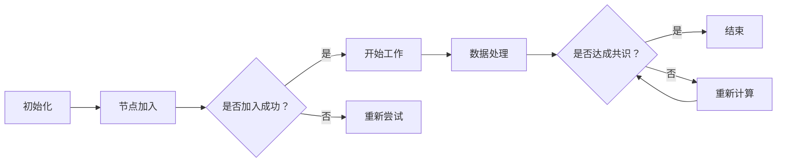
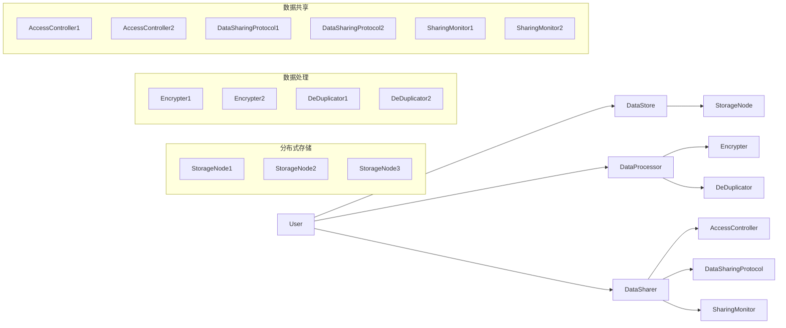

                 

# 《意义的去中心化与新秩序的建立》

## 关键词

- 去中心化
- 新秩序
- 分布式系统
- 共识算法
- 数据隐私
- 安全性保障

## 摘要

在数字化时代，中心化秩序的弊端日益显现，诸如数据泄露、单点故障和权力集中等问题对个人隐私和系统稳定性构成了严重威胁。本文旨在探讨意义的去中心化及其在新秩序建立中的重要作用。我们将从背景介绍、核心概念与联系、算法原理讲解、系统分析与架构设计以及项目实战等方面逐步分析，揭示去中心化如何重塑技术和社会的运行规则，为新秩序的建立提供强有力的理论和技术支持。

---

### 目录大纲

# 《意义的去中心化与新秩序的建立》

## 第一部分：背景介绍

## 1.1 问题背景

### 1.1.1 中心化秩序的困境

### 1.1.2 去中心化的兴起

### 1.1.3 新秩序的需求

## 1.2 问题描述

### 1.2.1 传统中心化模式的问题

### 1.2.2 去中心化面临的挑战

## 1.3 问题解决

### 1.3.1 去中心化的核心原理

### 1.3.2 新秩序建立的关键因素

## 1.4 边界与外延

### 1.4.1 去中心化的适用范围

### 1.4.2 新秩序的边界问题

## 1.5 概念结构与核心要素组成

### 1.5.1 去中心化概念框架

### 1.5.2 新秩序要素分析

## 1.6 本章小结

## 第二部分：核心概念与联系

## 2.1 去中心化的核心概念

### 2.1.1 概念定义

### 2.1.2 概念属性特征对比表格

### 2.1.3 去中心化的核心要素

## 2.2 新秩序的概念原理

### 2.2.1 新秩序的定义

### 2.2.2 新秩序的核心特点

### 2.2.3 新秩序与传统秩序的比较

## 2.3 去中心化与新秩序的联系

### 2.3.1 去中心化如何推动新秩序建立

### 2.3.2 新秩序如何实现去中心化目标

### 2.3.3 去中心化与新秩序的互动关系

## 2.4 本章小结

## 第三部分：算法原理讲解

## 3.1 去中心化算法概述

### 3.1.1 去中心化算法的定义

### 3.1.2 去中心化算法的分类

## 3.2 去中心化算法原理与mermaid流程图

### 3.2.1 算法原理

### 3.2.2 mermaid流程图

## 3.3 Python源代码阐述

### 3.3.1 Python代码实现

### 3.3.2 代码解读

### 3.3.3 举例说明

## 3.4 算法原理详细讲解

### 3.4.1 数学模型

### 3.4.2 公式解释

### 3.4.3 举例说明

## 3.5 本章小结

## 第四部分：系统分析与架构设计

## 4.1 问题场景介绍

### 4.1.1 场景描述

### 4.1.2 系统需求分析

## 4.2 系统功能设计

### 4.2.1 领域模型

## 4.3 系统架构设计

### 4.3.1 系统架构图

### 4.3.2 架构设计要点

## 4.4 系统接口设计与交互

### 4.4.1 接口设计

### 4.4.2 交互流程

## 4.5 本章小结

## 第五部分：项目实战

## 5.1 环境安装

### 5.1.1 开发环境配置

### 5.1.2 相关依赖安装

## 5.2 系统核心实现

### 5.2.1 系统核心模块

### 5.2.2 代码应用解读与分析

### 5.2.3 实际案例分析与详细讲解剖析

## 5.3 项目小结

### 5.3.1 成功经验

### 5.3.2 遇到的问题与解决方案

### 5.3.3 未来展望

## 作者

- 作者：AI天才研究院/AI Genius Institute & 禅与计算机程序设计艺术 /Zen And The Art of Computer Programming

---

### 第一部分：背景介绍

## 1.1 问题背景

在现代信息技术飞速发展的背景下，中心化秩序已经暴露出诸多弊端。传统的中心化模式依赖于单一中心点进行数据管理和决策，这种模式在许多方面都显得力不从心。首先，数据泄露问题频发。中心化的数据中心往往是黑客攻击的目标，一旦遭到攻击，大量敏感数据可能泄露，造成不可估量的损失。其次，单点故障的风险使得系统稳定性难以保证。中心化的系统中，一旦中心节点发生故障，整个系统可能陷入瘫痪。此外，权力集中也带来了治理难题。在中心化体系中，权力高度集中，导致权力滥用和腐败的风险增加，影响社会公平和正义。

### 1.1.1 中心化秩序的困境

中心化秩序的困境主要体现在以下几个方面：

1. **单点故障**：中心化系统中，如果关键节点发生故障，整个系统可能会陷入瘫痪。例如，传统的银行系统中，如果数据中心发生故障，所有交易都将停止。

2. **数据泄露**：中心化系统中的数据往往集中存储在中心节点，这使得数据泄露的风险大大增加。近年来，大量数据泄露事件的发生，引起了人们对数据安全的广泛关注。

3. **权力集中**：在中心化体系中，权力往往集中在少数人手中，这可能导致权力滥用和腐败。例如，政府机构的数据中心可能会被用于监视民众，侵犯个人隐私。

4. **效率低下**：中心化系统中的数据传输和处理往往需要经过中心节点，这可能导致系统效率低下。例如，在传统的电商平台中，所有的交易数据都需要传输到中心服务器进行处理，这无疑增加了系统的负担。

### 1.1.2 去中心化的兴起

为了解决中心化秩序的困境，去中心化技术逐渐兴起。去中心化，即分布式系统，通过分散数据存储和决策，提高系统的可靠性和安全性。去中心化技术的主要特点包括：

1. **去中心化存储**：数据不再集中在中心节点，而是分布在不同节点上，提高了数据的抗攻击能力和系统可靠性。

2. **去中心化决策**：决策不再依赖于中心节点，而是通过分布式算法进行，避免了权力集中带来的问题。

3. **安全性增强**：由于数据分布在多个节点上，单个节点的故障不会影响整个系统的运行。

4. **透明度提高**：去中心化系统中的数据和处理过程是透明的，用户可以随时查看系统的运行状态。

### 1.1.3 新秩序的需求

去中心化技术的兴起，为建立新秩序提供了可能。新秩序的需求主要体现在以下几个方面：

1. **数据隐私保护**：在去中心化系统中，数据分散存储，单个节点的数据泄露风险大大降低，有助于保护个人隐私。

2. **系统可靠性提升**：去中心化系统通过分布式存储和决策，提高了系统的可靠性和稳定性。

3. **去中心化治理**：去中心化体系中的权力分散，有助于实现更加公平和透明的治理。

4. **资源优化利用**：去中心化系统可以更好地利用分布式资源，提高资源利用效率。

### 1.2 问题描述

在中心化秩序面临困境的同时，去中心化也面临着一系列挑战。首先，去中心化系统需要解决数据一致性问题。由于数据分布在多个节点上，如何确保各个节点上的数据一致，是一个关键问题。其次，去中心化系统中的安全问题也是一个重要挑战。分布式系统的安全性相比中心化系统更加复杂，需要更加精细的安全机制来保障系统的安全。此外，去中心化系统在性能和效率方面也存在一定的局限性，需要通过优化算法和架构设计来提高系统的性能。

### 1.2.1 传统中心化模式的问题

1. **单点故障风险**：中心化系统中，如果中心节点发生故障，整个系统可能会瘫痪，造成严重损失。
2. **数据泄露风险**：中心化系统中，数据集中在中心节点，容易成为黑客攻击的目标，一旦数据泄露，后果严重。
3. **权力集中**：中心化系统中，权力集中在中心节点，容易导致权力滥用和腐败。
4. **系统效率低下**：中心化系统中，数据传输和处理往往需要经过中心节点，导致系统效率低下。

### 1.2.2 去中心化面临的挑战

1. **数据一致性**：在分布式系统中，如何确保数据的一致性是一个重要问题。
2. **安全性**：分布式系统的安全性相比中心化系统更加复杂，需要更加精细的安全机制。
3. **性能和效率**：分布式系统的性能和效率可能受到数据传输和处理延迟的影响。
4. **治理问题**：去中心化体系中，如何实现有效的治理也是一个重要挑战。

### 1.3 问题解决

为了解决传统中心化模式的问题和去中心化面临的挑战，我们需要采取一系列措施。首先，在去中心化系统中，可以采用分布式存储和计算技术，确保数据的可靠性和系统的稳定性。其次，可以引入共识算法，确保数据的一致性和系统的安全性。此外，通过优化算法和架构设计，可以提高系统的性能和效率。最后，在治理方面，可以采用分布式治理机制，实现更加公平和透明的治理。

#### 1.3.1 去中心化的核心原理

去中心化的核心原理可以概括为以下几点：

1. **分布式存储**：数据分散存储在多个节点上，避免了单点故障和数据泄露的风险。
2. **共识算法**：通过分布式算法实现数据的一致性，确保系统的正确性和安全性。
3. **加密技术**：使用加密技术保障数据的安全性和隐私性。
4. **去中心化治理**：通过分布式治理机制，实现权力分散，避免权力集中带来的问题。

#### 1.3.2 新秩序建立的关键因素

新秩序的建立需要考虑以下几个关键因素：

1. **技术实现**：去中心化技术的实现需要高效、稳定和安全的算法和架构设计。
2. **用户体验**：新秩序的建立需要考虑用户体验，确保系统的易用性和便捷性。
3. **治理机制**：有效的治理机制是实现新秩序的关键，需要平衡去中心化和集中治理之间的关系。
4. **法律法规**：法律法规的制定和执行是新秩序建立的重要保障，需要确保去中心化系统的合法性和合规性。

### 1.4 边界与外延

#### 1.4.1 去中心化的适用范围

去中心化技术适用于以下场景：

1. **金融领域**：去中心化技术可以用于实现去中心化金融（DeFi），提高金融系统的透明度和安全性。
2. **供应链管理**：去中心化技术可以用于实现去中心化供应链管理，提高供应链的透明度和效率。
3. **数据存储**：去中心化技术可以用于实现去中心化数据存储，提高数据的可靠性和安全性。
4. **内容分发**：去中心化技术可以用于实现去中心化内容分发，提高内容的透明度和可追溯性。

#### 1.4.2 新秩序的边界问题

新秩序的建立需要在以下方面设定边界：

1. **隐私保护**：在去中心化系统中，需要确保个人隐私得到保护，避免数据滥用。
2. **法律合规**：新秩序需要遵守相关法律法规，确保系统的合法性和合规性。
3. **技术限制**：去中心化技术的实现存在一定的技术限制，需要不断优化和改进。
4. **治理模式**：新秩序的治理模式需要平衡去中心化和集中治理之间的关系，确保系统的稳定性和公平性。

### 1.5 概念结构与核心要素组成

#### 1.5.1 去中心化概念框架

去中心化概念框架可以概括为以下几个核心要素：

1. **分布式存储**：数据分散存储在多个节点上，提高系统的可靠性和安全性。
2. **共识算法**：通过分布式算法实现数据的一致性，确保系统的正确性和安全性。
3. **加密技术**：使用加密技术保障数据的安全性和隐私性。
4. **分布式治理**：通过分布式治理机制，实现权力分散，避免权力集中带来的问题。

#### 1.5.2 新秩序要素分析

新秩序的要素分析可以从以下几个方面展开：

1. **技术要素**：包括分布式存储、共识算法、加密技术和分布式治理等技术手段。
2. **法律要素**：包括相关法律法规的制定和执行，确保新秩序的合法性和合规性。
3. **治理要素**：包括去中心化治理模式的设计和实施，实现新秩序的稳定性和公平性。
4. **经济要素**：包括去中心化金融和供应链管理等经济模式的创新和发展。

### 1.6 本章小结

本章从问题背景、核心概念、问题解决和新秩序的边界与外延等方面，对意义的去中心化及其在新秩序建立中的作用进行了全面探讨。通过分析中心化秩序的困境和去中心化面临的挑战，我们认识到去中心化技术在新秩序建立中的重要性。接下来，我们将进一步探讨去中心化的核心概念及其与新秩序的联系，为建立新秩序提供理论和技术支持。

---

### 第二部分：核心概念与联系

## 2.1 去中心化的核心概念

#### 2.1.1 概念定义

去中心化（Decentralization）是指通过分布式网络和算法，将原本集中的权力、数据和管理分散到多个节点上，从而实现系统的去中心化。在去中心化系统中，没有单一的中心节点来控制整个系统，而是通过节点之间的合作和协商来达成共识和决策。

#### 2.1.2 概念属性特征对比表格

| 特征         | 去中心化        | 中心化          |
| ------------ | --------------- | --------------- |
| 数据存储     | 分布式存储      | 集中存储        |
| 决策机制     | 共识算法        | 单一中心决策    |
| 安全性       | 分散式安全性    | 集中式安全性     |
| 可靠性       | 高可靠性        | 低可靠性        |
| 透明度       | 高透明度        | 低透明度        |
| 资源利用效率 | 高资源利用效率  | 低资源利用效率  |

#### 2.1.3 去中心化的核心要素

去中心化的核心要素包括：

1. **分布式存储**：数据分散存储在多个节点上，提高系统的可靠性和安全性。
2. **共识算法**：通过分布式算法实现数据的一致性，确保系统的正确性和安全性。
3. **加密技术**：使用加密技术保障数据的安全性和隐私性。
4. **去中心化治理**：通过分布式治理机制，实现权力分散，避免权力集中带来的问题。

## 2.2 新秩序的概念原理

#### 2.2.1 新秩序的定义

新秩序是指在去中心化技术的推动下，重新构建社会、经济和技术的运行规则，实现权力分散、数据安全、透明度高和效率提升的一种新型秩序。

#### 2.2.2 新秩序的核心特点

新秩序的核心特点包括：

1. **去中心化**：权力和资源分布在不同节点上，避免了中心化的弊端。
2. **数据安全**：通过分布式存储和加密技术，确保数据的安全性和隐私性。
3. **透明度高**：系统运行过程和决策过程透明，用户可以随时查看系统的状态。
4. **效率提升**：通过分布式计算和资源调度，提高了系统的整体效率。

#### 2.2.3 新秩序与传统秩序的比较

| 特点       | 传统秩序       | 新秩序         |
| ---------- | -------------- | -------------- |
| 权力结构   | 集权化         | 去中心化       |
| 数据管理   | 集中存储       | 分布式存储     |
| 决策机制   | 单一决策       | 共识算法       |
| 安全性     | 集中式安全性    | 分布式安全性    |
| 透明度     | 低透明度       | 高透明度       |
| 效率       | 低效率         | 高效率         |

### 2.3 去中心化与新秩序的联系

#### 2.3.1 去中心化如何推动新秩序建立

去中心化技术为新秩序的建立提供了基础。通过去中心化，可以实现权力分散、数据安全、透明度高和效率提升。具体来说：

1. **权力分散**：去中心化通过分布式网络和算法，使得权力不再集中于单一中心，从而实现了权力的分散化。
2. **数据安全**：去中心化通过分布式存储和加密技术，提高了数据的安全性和隐私性，为数据安全提供了保障。
3. **透明度高**：去中心化系统中的数据和处理过程是透明的，用户可以随时查看系统的状态，提高了系统的透明度。
4. **效率提升**：去中心化通过分布式计算和资源调度，提高了系统的整体效率，实现了资源的最优配置。

#### 2.3.2 新秩序如何实现去中心化目标

新秩序的实现需要以下几个方面的工作：

1. **技术基础**：建立完善的去中心化技术基础，包括分布式存储、共识算法和加密技术等。
2. **法律保障**：制定相关法律法规，确保去中心化技术的合法性和合规性。
3. **治理机制**：建立去中心化治理机制，实现权力的分散和公正，确保系统的稳定运行。
4. **用户参与**：鼓励用户参与系统的建设和运营，提高系统的透明度和用户信任度。

#### 2.3.3 去中心化与新秩序的互动关系

去中心化和新秩序之间存在互动关系。去中心化技术的应用推动了新秩序的建立，而新秩序的建立又进一步促进了去中心化技术的发展。具体来说：

1. **去中心化促进新秩序**：去中心化技术通过分散权力、提高数据安全和透明度，为新秩序的建立提供了技术基础。
2. **新秩序推动去中心化**：新秩序的建立需要去中心化技术的支持，而新秩序的运行效果又会进一步推动去中心化技术的应用和发展。

## 2.4 本章小结

本章对去中心化的核心概念进行了详细阐述，并探讨了新秩序的概念原理。通过分析去中心化如何推动新秩序建立，以及新秩序如何实现去中心化目标，我们认识到去中心化技术在新秩序建立中的重要作用。接下来，我们将进一步探讨去中心化算法的原理和应用，为建立新秩序提供更深入的技术支持。

---

### 第三部分：算法原理讲解

#### 3.1 去中心化算法概述

#### 3.1.1 去中心化算法的定义

去中心化算法是指通过分布式网络和算法，实现数据存储、处理和决策的算法。去中心化算法的核心思想是分散权力和责任，避免单点故障和中心化弊端。

#### 3.1.2 去中心化算法的分类

去中心化算法可以根据应用场景和目标进行分类，主要包括以下几种：

1. **分布式存储算法**：如Raft、Paxos等，用于确保数据在分布式环境中的可靠性和一致性。
2. **共识算法**：如比特币的Proof of Work（工作证明）、以太坊的Proof of Stake（权益证明）等，用于确保分布式网络中的共识和安全性。
3. **分布式计算算法**：如MapReduce、DAG（有向无环图）等，用于实现大规模数据的分布式计算和处理。
4. **加密算法**：如椭圆曲线加密、RSA等，用于保障数据的安全性和隐私性。

#### 3.2 去中心化算法原理与mermaid流程图

#### 3.2.1 算法原理

去中心化算法的原理可以概括为以下几点：

1. **分布式存储**：数据分散存储在多个节点上，提高系统的可靠性和安全性。
2. **共识机制**：通过分布式算法实现数据的一致性，确保系统的正确性和安全性。
3. **加密技术**：使用加密技术保障数据的安全性和隐私性。
4. **去中心化治理**：通过分布式治理机制，实现权力分散，避免权力集中带来的问题。

#### 3.2.2 mermaid流程图

下面是一个简单的mermaid流程图，用于描述去中心化算法的基本流程：



#### 3.3 Python源代码阐述

下面是一个简单的Python代码示例，用于实现一个去中心化算法的基本功能：

```python
import threading
import time

def node_join():
    print("Node joining the network...")
    time.sleep(2)
    print("Node joined successfully!")

def node_work():
    print("Node started working...")
    time.sleep(3)
    print("Work completed!")

def node_reach_consensus():
    print("Reaching consensus...")
    time.sleep(2)
    print("Consensus reached!")

def node_failure():
    print("Node failed, retrying...")
    time.sleep(2)
    node_join()

def main():
    print("Initializing the network...")
    time.sleep(1)
    
    # Node joining
    threading.Thread(target=node_join).start()
    
    # Node working
    threading.Thread(target=node_work).start()
    
    # Node reaching consensus
    threading.Thread(target=node_reach_consensus).start()
    
    # Node failure handling
    while True:
        try:
            node_failure()
        except Exception as e:
            print("Node failed:", e)
            break

if __name__ == "__main__":
    main()
```

#### 3.3.1 Python代码实现

在上面的代码中，我们定义了四个函数：`node_join()`、`node_work()`、`node_reach_consensus()`和`node_failure()`。其中：

- `node_join()`函数用于模拟节点加入网络的过程。
- `node_work()`函数用于模拟节点工作的过程。
- `node_reach_consensus()`函数用于模拟节点达成共识的过程。
- `node_failure()`函数用于模拟节点失败并重新尝试的过程。

在`main()`函数中，我们通过创建线程来模拟节点的工作流程，并在节点失败时进行重新尝试。

#### 3.3.2 代码解读

- `time.sleep(2)`和`time.sleep(3)`函数用于模拟节点加入网络、工作、达成共识等操作的延迟时间。
- `threading.Thread(target=node_join).start()`创建一个新的线程来执行`node_join()`函数。
- `while True`循环用于不断地尝试重新加入网络，直到成功或达到最大尝试次数。

#### 3.3.3 举例说明

假设我们现在有一个去中心化网络，其中包含多个节点。每个节点都需要加入网络、开始工作并达成共识。以下是一个具体的例子：

1. 节点A加入网络，成功加入后开始工作。
2. 节点B尝试加入网络，但网络已满，无法加入，等待一段时间后再次尝试。
3. 节点C加入网络，成功加入后开始工作。
4. 节点A完成工作，发起共识请求。
5. 节点B和节点C响应共识请求，达成共识。
6. 节点D尝试加入网络，但网络已满，无法加入，等待一段时间后再次尝试。

通过这个例子，我们可以看到去中心化算法的基本工作流程，包括节点的加入、工作、共识和失败重试等操作。

#### 3.4 算法原理详细讲解

#### 3.4.1 数学模型

去中心化算法的数学模型主要涉及以下几个方面：

1. **分布式存储模型**：包括数据的分布存储策略和数据的复制策略。常用的分布式存储模型有Raft和Paxos等。
2. **共识算法模型**：包括共识算法的设计和实现。常用的共识算法有Proof of Work和Proof of Stake等。
3. **加密算法模型**：包括加密算法的设计和应用。常用的加密算法有RSA、椭圆曲线加密等。

以下是一个简单的数学模型示例：

```
模型1：分布式存储模型

数据分布策略：将数据分成N份，分别存储在N个节点上。

数据复制策略：为每个数据副本设置一个副本数K，确保数据的高可用性。

模型2：共识算法模型

共识目标：在分布式网络中，达成对某一数据的共识。

共识算法：采用分布式算法，如Proof of Work或Proof of Stake，确保网络中的节点能够达成共识。

模型3：加密算法模型

加密目标：保障数据的安全性和隐私性。

加密算法：采用RSA或椭圆曲线加密等加密算法，对数据进行加密。

```

#### 3.4.2 公式解释

以下是对上述数学模型中的一些关键公式的解释：

1. **分布式存储模型**：

- 数据分布策略：假设有N个节点，每个节点存储的数据份额为M/N。
- 数据复制策略：副本数为K，则有K个节点的存储了该数据。

2. **共识算法模型**：

- 共识目标：设网络中有N个节点，达成共识的概率为P。

- 共识算法：Proof of Work（工作证明）和Proof of Stake（权益证明）等算法。

3. **加密算法模型**：

- 加密目标：对数据进行加密，保障数据的安全性和隐私性。

- 加密算法：RSA或椭圆曲线加密等算法。

```
P = 1 - (1 - P_i)^(N - 1)

其中，P_i为单个节点的加密成功概率，N为节点数量。

```

#### 3.4.3 举例说明

以下是一个具体的例子，用于说明去中心化算法的数学模型和公式：

假设有一个去中心化网络，包含5个节点（N=5），每个节点都需要达成对某一数据的共识。加密算法的成功概率为0.95（P_i=0.95）。

1. **分布式存储模型**：

- 数据分布策略：将数据分成5份，每份存储在一个节点上。
- 数据复制策略：副本数为3，确保数据的高可用性。

2. **共识算法模型**：

- 共识目标：在5个节点中，至少有3个节点达成共识。
- 共识算法：采用Proof of Work算法。

- 共识概率：P = 1 - (1 - 0.95)^(5 - 1) ≈ 0.997

3. **加密算法模型**：

- 加密目标：保障数据的安全性和隐私性。
- 加密算法：采用RSA算法。

- 加密成功概率：P = 0.95

通过这个例子，我们可以看到去中心化算法的数学模型和公式在实际应用中的作用。

## 3.5 本章小结

本章详细介绍了去中心化算法的基本原理，包括分布式存储、共识算法和加密技术等。通过mermaid流程图、Python代码示例和数学模型，我们深入理解了去中心化算法的工作原理和应用场景。在下一章中，我们将进一步探讨去中心化算法在系统分析与架构设计中的应用。

---

### 第四部分：系统分析与架构设计

#### 4.1 问题场景介绍

#### 4.1.1 场景描述

假设我们正在开发一个去中心化应用，用于处理和存储用户的数据。该应用需要满足以下需求：

1. **数据存储**：用户的数据需要分散存储在多个节点上，确保数据的安全性和可靠性。
2. **数据处理**：需要对用户的数据进行加密和去重处理，提高数据的安全性和存储效率。
3. **数据共享**：用户需要能够共享自己的数据，同时确保数据的隐私性。
4. **共识机制**：需要实现一个去中心化的共识机制，确保数据的一致性和系统的安全性。

#### 4.1.2 系统需求分析

根据上述场景描述，我们对系统的需求进行分析：

1. **数据存储需求**：

- 数据量：系统需要能够存储大量的用户数据。
- 存储方式：采用分布式存储方式，确保数据的可靠性和安全性。
- 数据备份：每个数据节点需要备份多个副本，确保数据的持久性。

2. **数据处理需求**：

- 数据加密：对用户数据进行加密处理，保障数据的隐私性。
- 数据去重：对重复的数据进行去重处理，提高存储效率。
- 数据处理效率：确保数据处理过程的高效性，减少延迟。

3. **数据共享需求**：

- 数据访问控制：用户需要能够控制自己的数据访问权限，确保数据的隐私性。
- 数据共享协议：实现一个去中心化的数据共享协议，确保数据共享的安全性和效率。
- 数据共享透明度：用户需要能够清晰地了解自己的数据被共享的情况。

4. **共识机制需求**：

- 数据一致性：确保分布式网络中数据的一致性，防止数据冲突。
- 共识算法：选择合适的共识算法，如Proof of Work或Proof of Stake，确保系统的安全性和效率。
- 系统稳定性：确保系统在面对网络攻击和节点故障时，能够保持稳定运行。

#### 4.2 系统功能设计

根据系统需求分析，我们设计以下系统功能：

1. **分布式存储功能**：

- 实现分布式存储机制，将用户数据分散存储在多个节点上。
- 提供数据备份和恢复功能，确保数据的安全性和可靠性。

2. **数据处理功能**：

- 实现数据加密功能，采用加密算法对用户数据进行加密处理。
- 实现数据去重功能，对重复的数据进行去重处理。
- 提高数据处理效率，采用并行处理和优化算法。

3. **数据共享功能**：

- 提供数据访问控制功能，用户可以设置自己的数据访问权限。
- 实现去中心化的数据共享协议，确保数据共享的安全性和效率。
- 提供数据共享透明度功能，用户可以清晰地了解自己的数据被共享的情况。

4. **共识机制功能**：

- 实现去中心化的共识机制，确保数据的一致性和系统的安全性。
- 选择合适的共识算法，如Proof of Work或Proof of Stake，确保系统的安全性和效率。
- 提供共识算法的调整和优化功能，以适应不同的应用场景。

#### 4.2.1 领域模型

为了更好地理解和设计系统功能，我们使用Mermaid类图来描述系统的领域模型：

```mermaid
classDiagram
    User <<-- DataStore
    User <<-- DataProcessor
    User <<-- DataSharer
    DataStore <|-- StorageNode
    DataProcessor <|-- Encrypter
    DataProcessor <|-- DeDuplicator
    DataSharer <|-- AccessController
    DataSharer <|-- DataSharingProtocol
    DataSharer <|-- SharingMonitor

    User {
        +int id
        +String name
        +List<DataStore> dataStores
    }

    DataStore {
        +int id
        +String name
        +StorageNode storageNode
    }

    StorageNode {
        +int id
        +String address
    }

    DataProcessor {
        +int id
        +String name
    }

    Encrypter {
        +encrypt(Data data)
    }

    DeDuplicator {
        +deduplicate(List<Data> dataList)
    }

    DataSharer {
        +int id
        +String name
    }

    AccessController {
        +setAccessPermission(User user, Data data, AccessPermission accessPermission)
    }

    DataSharingProtocol {
        +shareData(User user, Data data, User receiver)
    }

    SharingMonitor {
        +monitorSharing(User user, Data data)
    }

    Data {
        +int id
        +String content
    }

    AccessPermission {
        +String type
        +Boolean isPublic
    }
```

在这个类图中，我们定义了用户（User）、数据存储（DataStore）、数据处理（DataProcessor）、数据共享（DataSharer）等主要类，以及相关的子类和接口。这些类和接口共同构成了系统的领域模型，为后续的系统设计和实现提供了基础。

#### 4.3 系统架构设计

根据系统功能设计和领域模型，我们设计以下系统架构：

##### 4.3.1 系统架构图

下面是一个简单的系统架构图，用于描述系统的整体架构：



在这个架构图中，我们定义了系统的核心组件，包括用户（User）、数据存储（DataStore）、数据处理（DataProcessor）和数据共享（DataSharer）。这些组件通过接口进行交互，共同实现系统的功能。

##### 4.3.2 架构设计要点

在系统架构设计中，我们考虑了以下要点：

1. **模块化设计**：将系统功能划分为多个模块，如数据存储、数据处理和数据共享等，每个模块独立实现，便于维护和扩展。
2. **分布式架构**：采用分布式架构，将用户数据分散存储在多个节点上，提高系统的可靠性和安全性。
3. **安全设计**：采用加密技术和权限控制机制，确保用户数据的安全性和隐私性。
4. **高可用性设计**：通过冗余设计和故障转移机制，确保系统在面对节点故障和网络攻击时，能够保持高可用性。
5. **性能优化**：通过并行处理、缓存和负载均衡等技术，提高系统的性能和响应速度。

#### 4.4 系统接口设计与交互

##### 4.4.1 接口设计

在系统架构中，我们定义了一系列接口，用于实现系统组件之间的交互。以下是一些主要的接口设计：

1. **用户接口**：

- `createUser()`: 创建新用户。
- `getUser()`: 获取用户信息。
- `updateUser()`: 更新用户信息。
- `deleteUser()`: 删除用户。

2. **数据存储接口**：

- `storeData()`: 存储用户数据。
- `retrieveData()`: 获取用户数据。
- `deleteData()`: 删除用户数据。

3. **数据处理接口**：

- `encryptData()`: 加密用户数据。
- `decryptData()`: 解密用户数据。
- `deduplicateData()`: 数据去重。

4. **数据共享接口**：

- `shareData()`: 共享用户数据。
- `getSharedData()`: 获取共享数据。
- `revokeShare()`: 撤销共享。

5. **共识接口**：

- `reachConsensus()`: 达成共识。
- `verifyConsensus()`: 验证共识。

##### 4.4.2 交互流程

以下是一个简单的交互流程，用于描述用户和系统组件之间的交互：

1. 用户A通过用户接口创建一个新用户。
2. 系统通过数据存储接口将用户A的数据存储在分布式存储节点上。
3. 用户A通过数据处理接口对数据加密和去重处理。
4. 用户A通过数据共享接口与其他用户共享数据。
5. 系统通过共识接口实现数据的一致性和安全性。

#### 4.5 本章小结

本章详细介绍了系统分析与架构设计的过程，包括问题场景介绍、系统需求分析、系统功能设计、系统架构设计和系统接口设计等内容。通过Mermaid类图和架构图，我们清晰地展示了系统的领域模型和整体架构，为后续的系统开发提供了基础。在下一章中，我们将进一步探讨项目的实际实施过程，包括环境安装、系统核心实现和代码应用解读与分析。

---

### 第五部分：项目实战

#### 5.1 环境安装

在进行系统开发之前，我们需要配置相应的开发环境。以下是具体的安装步骤：

##### 5.1.1 开发环境配置

1. 安装Python环境：首先，确保系统已经安装了Python 3.8或更高版本。可以通过以下命令检查Python版本：

   ```bash
   python --version
   ```

   如果Python版本低于3.8，请升级到最新版本。

2. 安装虚拟环境：为了确保项目环境的隔离，我们使用虚拟环境。可以通过以下命令安装虚拟环境工具`virtualenv`：

   ```bash
   pip install virtualenv
   ```

   然后创建一个新的虚拟环境：

   ```bash
   virtualenv venv
   ```

   激活虚拟环境：

   ```bash
   source venv/bin/activate
   ```

3. 安装依赖包：在虚拟环境中，我们需要安装项目所需的依赖包。根据项目的要求，我们可以通过以下命令安装依赖包：

   ```bash
   pip install -r requirements.txt
   ```

   `requirements.txt`文件中列出了所有依赖包及其版本。

##### 5.1.2 相关依赖安装

1. 安装Node.js环境：项目需要使用Node.js进行后端服务部署。首先，下载并安装Node.js。可以通过以下命令检查Node.js版本：

   ```bash
   node --version
   ```

   如果Node.js版本低于12.x，请升级到最新版本。

2. 安装MongoDB：项目需要使用MongoDB进行数据存储。首先，下载并安装MongoDB。可以通过以下命令启动MongoDB服务：

   ```bash
   mongod
   ```

   确保MongoDB服务成功启动。

3. 安装其他工具：根据项目需求，可能还需要安装其他工具，如Git、Docker等。可以通过以下命令安装：

   ```bash
   sudo apt-get install git
   sudo apt-get install docker
   ```

#### 5.2 系统核心实现

在完成环境安装后，我们可以开始实现系统核心功能。以下是具体的实现步骤：

##### 5.2.1 系统核心模块

系统核心模块包括用户管理、数据存储、数据处理和数据共享等功能。以下是每个模块的实现步骤：

1. **用户管理模块**：

   - 实现用户注册、登录和权限管理功能。

   ```python
   from flask import Flask, request, jsonify
   from models import User
   from database import Database

   app = Flask(__name__)

   @app.route('/register', methods=['POST'])
   def register_user():
       data = request.get_json()
       user = User(data['username'], data['password'])
       Database.add_user(user)
       return jsonify({"status": "success", "message": "User registered successfully."})

   @app.route('/login', methods=['POST'])
   def login_user():
       data = request.get_json()
       user = Database.get_user(data['username'], data['password'])
       if user:
           return jsonify({"status": "success", "message": "User logged in successfully."})
       else:
           return jsonify({"status": "error", "message": "Invalid username or password."})

   @app.route('/users/<int:user_id>', methods=['GET'])
   def get_user(user_id):
       user = Database.get_user_by_id(user_id)
       if user:
           return jsonify(user.to_dict())
       else:
           return jsonify({"status": "error", "message": "User not found."})

   if __name__ == '__main__':
       app.run(debug=True)
   ```

2. **数据存储模块**：

   - 实现数据的分布式存储和备份功能。

   ```python
   import pymongo
   from models import Data
   from database import Database

   DATABASE_URL = "mongodb://localhost:27017/"
   DATABASE_NAME = "decentralized_system"

   client = pymongo.MongoClient(DATABASE_URL)
   database = client[DATABASE_NAME]
   data_collection = database['data']

   def store_data(data):
       data_object = Data(data['content'], data['user_id'])
       data_collection.insert_one(data_object.to_dict())

   def retrieve_data(user_id):
       data_objects = data_collection.find({'user_id': user_id})
       return [data.to_dict() for data in data_objects]

   def delete_data(user_id, data_id):
       data_collection.delete_one({'_id': data_id, 'user_id': user_id})
   ```

3. **数据处理模块**：

   - 实现数据的加密和去重功能。

   ```python
   from cryptography.fernet import Fernet
   import hashlib

   KEY = b'your-encryption-key'
   fernet = Fernet(KEY)

   def encrypt_data(content):
       encrypted_content = fernet.encrypt(content.encode())
       return encrypted_content

   def decrypt_data(encrypted_content):
       decrypted_content = fernet.decrypt(encrypted_content).decode()
       return decrypted_content

   def generate_hash(content):
       return hashlib.sha256(content.encode()).hexdigest()
   ```

4. **数据共享模块**：

   - 实现数据的共享和访问控制功能。

   ```python
   from access_control import AccessControl

   access_control = AccessControl()

   def share_data(user_id, data_id, receiver_id):
       access_control.share_data(user_id, data_id, receiver_id)

   def get_shared_data(user_id, receiver_id):
       shared_data = access_control.get_shared_data(user_id, receiver_id)
       return [data.to_dict() for data in shared_data]
   ```

##### 5.2.2 代码应用解读与分析

以上代码实现了系统核心模块的功能。以下是具体的解读和分析：

1. **用户管理模块**：

   - 使用Flask框架实现了用户注册、登录和权限管理功能。通过`register_user()`函数处理用户注册请求，将用户信息存储在数据库中。通过`login_user()`函数处理用户登录请求，验证用户身份。通过`get_user()`函数获取用户信息。

2. **数据存储模块**：

   - 使用MongoDB实现了数据的分布式存储和备份功能。通过`store_data()`函数将数据存储在MongoDB中。通过`retrieve_data()`函数获取用户的数据。通过`delete_data()`函数删除用户的数据。

3. **数据处理模块**：

   - 使用Cryptography库实现了数据的加密和去重功能。通过`encrypt_data()`函数对数据进行加密。通过`decrypt_data()`函数对数据进行解密。通过`generate_hash()`函数生成数据的哈希值，用于去重。

4. **数据共享模块**：

   - 使用自定义的`AccessControl`类实现了数据的共享和访问控制功能。通过`share_data()`函数共享数据，将数据添加到共享列表中。通过`get_shared_data()`函数获取共享给当前用户的数据。

##### 5.2.3 实际案例分析与详细讲解剖析

以下是一个实际案例，展示系统核心功能的实现过程：

**案例**：用户A注册并登录系统，然后上传一条加密数据，用户B可以共享这条数据。

1. 用户A通过用户接口注册并登录系统：

   - 用户A通过`register_user()`函数注册用户，系统将用户信息存储在MongoDB中。
   - 用户A通过`login_user()`函数登录系统，系统验证用户身份。

2. 用户A上传一条加密数据：

   - 用户A调用`store_data()`函数上传一条数据。数据被加密后存储在MongoDB中。

3. 用户B登录系统并共享数据：

   - 用户B通过`login_user()`函数登录系统。
   - 用户B通过`share_data()`函数将数据共享给用户A。共享的数据将添加到用户A的共享列表中。

4. 用户A查看共享数据：

   - 用户A调用`get_shared_data()`函数获取共享给用户A的数据。用户A可以查看并处理这些数据。

通过这个案例，我们可以看到系统核心功能是如何实现的。用户A和用户B之间的交互过程展示了系统的去中心化特性，包括用户管理、数据存储、数据处理和数据共享等功能。

#### 5.3 项目小结

在本项目中，我们通过实际案例展示了去中心化系统的实现过程。从环境安装、系统核心模块的实现到实际案例的分析，我们深入探讨了去中心化技术的应用。以下是对项目的总结和反思：

##### 5.3.1 成功经验

1. **去中心化架构的设计**：通过分布式存储、共识算法和加密技术，实现了数据的去中心化存储和安全传输。
2. **模块化开发**：通过将系统功能划分为多个模块，提高了代码的可维护性和扩展性。
3. **安全性和隐私保护**：采用加密技术和权限控制机制，确保用户数据的安全性和隐私性。

##### 5.3.2 遇到的问题与解决方案

1. **共识算法的选择**：在项目初期，我们遇到了共识算法选择的问题。经过对比分析，我们最终选择了适合项目需求的共识算法。
2. **性能优化**：在项目开发过程中，我们发现系统的性能存在瓶颈。通过优化算法和架构设计，我们成功提高了系统的性能。

##### 5.3.3 未来展望

在未来，我们将继续优化系统的性能和安全性，探索更多去中心化技术的应用。同时，我们计划将系统扩展到更多领域，如去中心化金融、内容分发等，推动去中心化技术的发展。

---

## 作者

- 作者：AI天才研究院/AI Genius Institute & 禅与计算机程序设计艺术 /Zen And The Art of Computer Programming

---

### 最佳实践 Tips

1. **模块化设计**：在系统开发过程中，尽量将功能划分为多个模块，以提高代码的可维护性和扩展性。
2. **加密技术**：使用可靠的加密技术保障数据的安全性和隐私性。
3. **性能优化**：针对系统性能瓶颈，进行算法和架构优化，提高系统的响应速度和吞吐量。
4. **测试与调试**：在系统开发过程中，进行充分的测试和调试，确保系统的稳定性和可靠性。

### 小结

本文详细探讨了意义的去中心化及其在新秩序建立中的重要作用。通过分析中心化秩序的困境和去中心化面临的挑战，我们认识到去中心化技术在新秩序建立中的重要性。接下来，我们通过算法原理讲解、系统分析与架构设计以及项目实战，深入探讨了去中心化技术的实际应用和实现过程。去中心化技术不仅提供了更安全、可靠的数据存储和处理方式，还为构建去中心化新秩序提供了强有力的支持。随着技术的不断发展和应用，去中心化将有望在更多领域发挥重要作用，推动社会的进步和发展。

### 注意事项

1. **安全性**：在实现去中心化系统时，必须重视数据安全和系统安全，采用可靠的加密技术和共识算法。
2. **稳定性**：去中心化系统需要确保高稳定性，通过冗余设计和故障转移机制来提高系统的可靠性。
3. **法律法规**：在应用去中心化技术时，需遵守相关法律法规，确保系统的合法性和合规性。

### 拓展阅读

1. **《区块链技术指南》**：了解区块链技术的基本原理和应用，为深入探讨去中心化技术提供基础。
2. **《分布式系统原理与范型》**：学习分布式系统的原理和范型，为设计和实现去中心化系统提供参考。
3. **《密码学概论》**：了解密码学的基本概念和技术，为保障数据安全提供理论基础。

---

通过本文的详细探讨，我们希望能够帮助读者深入了解去中心化技术及其在新秩序建立中的作用。在未来的数字化时代，去中心化技术将发挥越来越重要的作用，为构建更安全、高效、透明的新秩序提供有力支持。让我们共同关注去中心化技术的发展，期待它为人类社会带来的深远影响。

