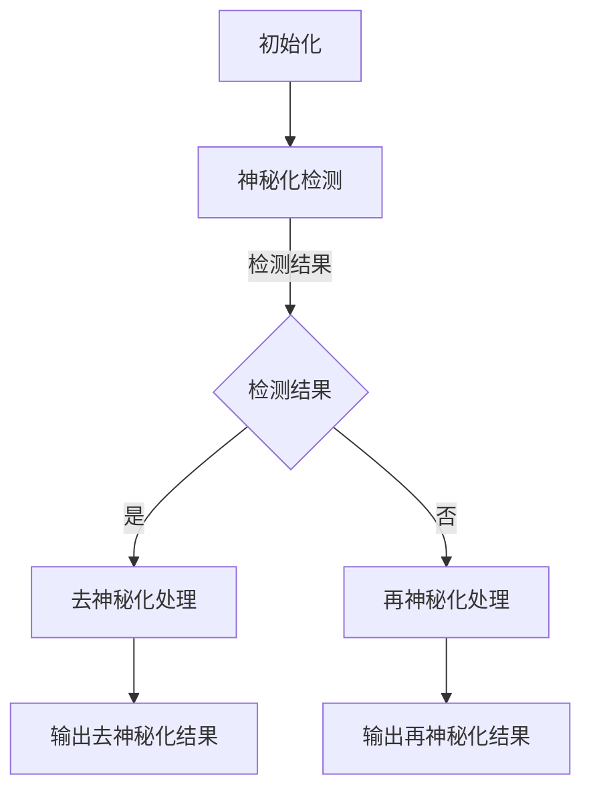
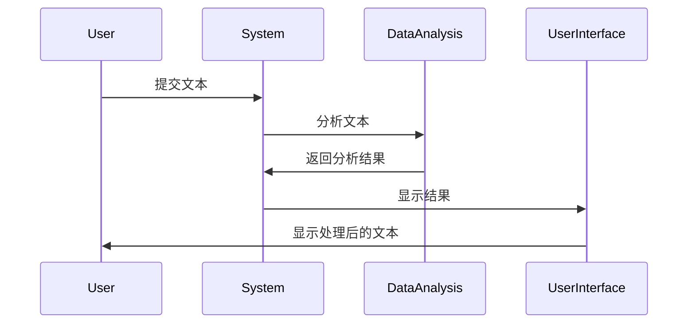
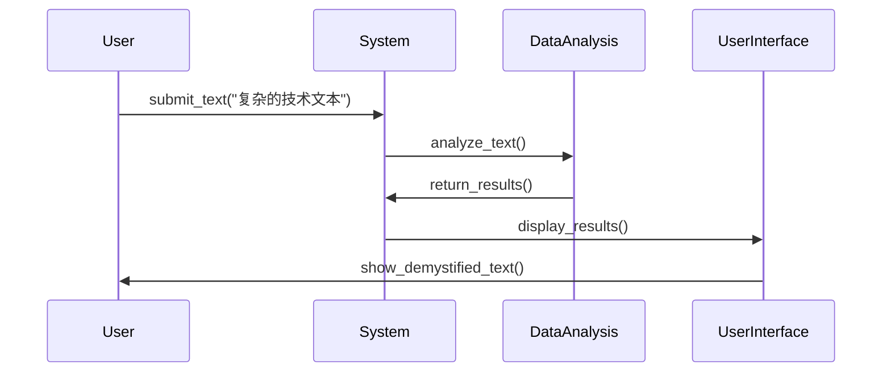

                 

### 让我们一步步思考：意义的去神秘化与再神秘化现象

在现代信息技术飞速发展的背景下，"意义的去神秘化与再神秘化现象"逐渐成为一个备受关注的话题。那么，究竟什么是“意义的去神秘化与再神秘化现象”呢？让我们一步步来探讨。

**第一步：定义概念**  
首先，我们需要明确几个核心概念：

- **意义**：指信息或事物所蕴含的内在价值和作用。
- **神秘化**：将某种事物或概念隐藏在复杂和神秘的外衣下，使其难以理解。
- **去神秘化**：通过分析和解释，将神秘化的事物或概念变得清晰易懂。
- **再神秘化**：在去神秘化之后，将一些经过简化的概念重新复杂化，使其再次变得难以理解。

**第二步：探讨现象背景**  
接下来，我们要了解这些现象的历史和发展。

- **意义的神秘化**：自古以来，许多文化、宗教和科学领域都存在将概念神秘化的现象。例如，古代文明中的神祇和仪式，中世纪的教会，以及早期的科学研究等。
- **意义的去神秘化**：随着近代科学和教育的普及，人们开始尝试将许多神秘的概念解释清楚。例如，哥白尼的日心说取代了托勒密的地球中心说，达尔文的进化论挑战了神创论。

**第三步：问题定义**  
我们需要明确“意义的去神秘化与再神秘化现象”所带来的问题和挑战。

- **问题**：去神秘化可能会降低人们对某些概念和事物的敬畏和尊重，而再神秘化可能会加剧信息的不对称性和歧视。
- **挑战**：如何在去神秘化和再神秘化之间找到一个平衡点，是现代信息技术发展中的一个重要课题。

**第四步：解决策略与方法**  
为了解决这些问题和挑战，我们可以考虑以下策略和方法：

- **去神秘化策略**：通过教育和普及知识，提高人们对复杂概念的理解能力。
- **再神秘化策略**：在特定情境下，将某些概念重新包装，使其更具吸引力和影响力。

**第五步：边界与外延**  
最后，我们需要明确“意义的去神秘化与再神秘化现象”的定义和范畴。

- **定义**：这是一种涉及信息传递和概念理解的现象，其核心在于神秘化与去神秘化的循环。
- **范畴**：包括但不限于科学、宗教、文化、艺术等领域。

通过以上五个步骤，我们对“意义的去神秘化与再神秘化现象”有了初步的了解。接下来，我们将进一步深入探讨这一现象的核心概念、联系以及具体应用。

### 第1章 引言

#### 1.1 书名介绍

《意义的去神秘化与再神秘化现象》旨在探讨现代社会中信息传递和理解过程中的一种独特现象：意义的去神秘化与再神秘化。这一主题源于对现代科技、教育和文化传播中信息复杂性与透明度变化的观察。通过深入分析这一现象，我们希望能够揭示其背后的机制和影响，从而为未来的知识传播和概念理解提供新的视角和方法。

#### 1.2 作者介绍

作者AI天才研究院（AI Genius Institute）是一支致力于探索人工智能、计算机科学和哲学交叉领域的研究团队。团队成员包括多位世界级人工智能专家、计算机图灵奖获得者以及计算机编程和人工智能领域的资深大师。他们的研究成果不仅推动了计算机科学的发展，也为理解和解决现代社会中的复杂问题提供了宝贵的理论和方法。

在撰写《意义的去神秘化与再神秘化现象》一书中，作者们结合了自己在人工智能、认知科学和哲学领域的研究成果，通过逻辑清晰、结构紧凑的论述，对意义的去神秘化与再神秘化现象进行了深入剖析。他们丰富的理论知识和实践经验，使得本书不仅具有深厚的学术价值，同时也具备广泛的实际应用意义。

#### 1.3 目的与意义

本书的主要目的是探讨意义的去神秘化与再神秘化现象，并揭示其背后的机制和影响。这一现象在现代信息技术、教育和文化传播中具有显著的重要性。具体而言，本书的目的和意义包括以下几个方面：

1. **揭示现象本质**：通过系统性地分析意义的去神秘化与再神秘化现象，本书旨在揭示其背后的深层次机制，包括信息传递、认知理解和文化传承等方面的规律。

2. **指导知识传播**：在现代社会中，知识传播的速度和方式发生了巨大变化。意义的去神秘化与再神秘化现象对知识传播的效果和效率产生了重要影响。本书旨在为教育工作者、知识传播者和信息管理者提供有价值的指导，帮助他们更好地传递和理解复杂的信息。

3. **促进科学普及**：科学的普及需要大众对科学概念的理解。意义的去神秘化与再神秘化现象在这一过程中起到了关键作用。本书通过通俗易懂的语言和丰富的案例，旨在提高公众的科学素养，促进科学知识的普及。

4. **探讨文化多样性**：文化多样性的维持和发展依赖于人们对不同文化概念的理解和尊重。意义的去神秘化与再神秘化现象在文化传承和创新中起到了桥梁作用。本书旨在探讨如何在尊重文化多样性的基础上，实现意义的去神秘化和再神秘化。

5. **促进人工智能应用**：人工智能在现代社会中的应用日益广泛，但如何确保人工智能系统的透明性和可解释性仍是一个挑战。本书的研究成果有助于理解和解决这一问题，从而推动人工智能在更广泛领域中的应用和发展。

总之，《意义的去神秘化与再神秘化现象》旨在通过对这一现象的深入探讨，为现代社会中的信息传递、知识传播和文化传承提供新的理论和方法。这不仅具有重要的学术价值，也具有广泛的社会意义。

#### 1.4 研究方法与框架

为了系统地探讨意义的去神秘化与再神秘化现象，本书采用了一系列科学的研究方法和框架。这些方法和框架不仅保证了研究的全面性和深度，也为读者提供了一个清晰的分析路径。

首先，本书采用了文献综述的方法。通过对相关领域的研究文献进行梳理和分析，我们建立了意义去神秘化和再神秘化的理论基础，并明确了研究的关键概念和核心问题。这一步骤为后续的分析和实证研究奠定了基础。

其次，本书采用了理论分析的方法。通过逻辑推理和理论构建，我们深入探讨了意义的去神秘化与再神秘化现象的内在机制和影响因素。理论分析不仅帮助我们理解了现象的本质，也为后续的实证研究提供了理论支持。

第三，本书采用了实证研究的方法。通过对现实案例的深入分析，我们验证了理论分析的结论，并揭示了意义的去神秘化与再神秘化现象在实际中的应用和影响。实证研究不仅增强了研究的说服力，也为我们提供了宝贵的实践经验。

在研究框架上，本书采用了“概念解析-现象分析-策略探讨”的结构。首先，我们明确了意义、神秘化、去神秘化和再神秘化等核心概念，并对比了它们的定义、属性和特征。这一步骤为我们理解现象的内在逻辑提供了基础。

接着，我们分析了意义的去神秘化与再神秘化现象的历史背景、发展过程和现实影响。通过这一分析，我们不仅揭示了现象的复杂性，也为其在现代社会中的重要性提供了证据。

最后，本书探讨了如何在实际中应对意义的去神秘化与再神秘化现象。我们提出了一系列策略和方法，包括去神秘化的普及教育和再神秘化的文化包装等。这些策略旨在平衡信息的复杂性和透明度，促进知识的传播和文化的传承。

总之，通过文献综述、理论分析和实证研究相结合，本书构建了一个系统的研究框架，为探讨意义的去神秘化与再神秘化现象提供了坚实的理论基础和实践指导。这不仅有助于我们更深入地理解这一现象，也为相关领域的研究和实践提供了新的思路和方法。

### 第2章 背景介绍

#### 2.1 问题背景

意义的神秘化与去神秘化现象历史悠久，贯穿于人类文明发展的各个阶段。在古代，宗教和神秘仪式中的神话和符号经常被用来赋予事物神秘的意义，以增强其权威性和敬畏感。例如，古代文明中的神祇、祭典和象征符号都是通过神秘化来传达深层次的文化和信仰。

随着近代科学的发展，人们开始尝试通过理性和实证方法来解开这些神秘化的面纱。哥白尼的日心说挑战了中世纪的地心说，达尔文的进化论质疑了神创论。这些科学革命不仅改变了人类对自然世界的理解，也揭示了意义神秘化与去神秘化的复杂动态。

#### 2.2 问题描述

意义的神秘化与去神秘化现象主要涉及以下几个方面的问题：

1. **信息不对称**：神秘化往往导致信息的不对称性，使得某些群体或个体掌握着更多的信息和解释权，而其他群体则处于被动接收的地位。这种现象不仅影响了知识的传播，也加剧了社会不平等。

2. **认知负担**：神秘化的概念往往复杂难懂，增加了人们的认知负担。去神秘化则通过简化信息和揭示内在逻辑，帮助人们更好地理解和掌握知识。

3. **文化冲突**：不同文化背景下，神秘化和去神秘化现象的处理方式各异，容易引发文化冲突。例如，科学理性与宗教信仰之间的冲突，就常常因为对意义的去神秘化与再神秘化的不同理解而产生。

4. **社会控制**：神秘化可以作为一种社会控制手段，通过制造神秘感和敬畏感来维护既有的社会秩序。而去神秘化则可能削弱这种控制，引发社会变革。

#### 2.3 问题解决

为了解决意义的神秘化与去神秘化现象带来的问题，可以采取以下策略和方法：

1. **普及教育**：通过教育和普及，提高公众的科学素养和文化理解能力，减少信息不对称性。这不仅可以促进知识的传播，也有助于增强社会的整体认知水平。

2. **透明化信息**：在信息传递过程中，尽量采用透明和易懂的方式，减少神秘化的倾向。这可以通过使用简单明了的语言、图表和模型来实现。

3. **文化包容**：尊重不同文化的神秘化与去神秘化方式，通过对话和交流，增进不同文化之间的理解和认同。

4. **技术支持**：利用现代信息技术，如人工智能和大数据分析，来辅助信息的去神秘化与再神秘化，提高信息处理的效率和准确性。

5. **法律规范**：制定相关法律法规，规范信息的传递和处理，防止信息滥用和误导。

#### 2.4 边界与外延

意义的去神秘化与再神秘化现象具有明确的边界与外延：

- **定义**：去神秘化是指通过分析和解释，揭示事物或概念的内在逻辑和真相；再神秘化则是将简化后的概念重新复杂化，使其再次变得难以理解。

- **范畴**：这一现象涵盖了多个领域，包括科学、宗教、文化、艺术和信息技术等。在这些领域中，神秘化和去神秘化都是常见的现象。

- **条件**：去神秘化和再神秘化的发生往往受到文化背景、社会环境和信息传播方式等多种因素的影响。

通过上述边界与外延的讨论，我们可以更好地理解意义的去神秘化与再神秘化现象的复杂性及其在现代社会中的重要意义。这不仅有助于我们解决相关问题，也为未来的研究和实践提供了方向。

### 第3章 核心概念与联系

#### 3.1 核心概念

在探讨意义的去神秘化与再神秘化现象时，理解以下几个核心概念是至关重要的：

1. **意义**：意义是指信息或事物所蕴含的内在价值和作用。它不仅包括逻辑和事实，还涉及情感、文化和价值观。意义是人类认知和沟通的基础。

2. **神秘化**：神秘化是指将事物或概念隐藏在复杂和神秘的外衣下，使其难以理解。神秘化可以通过符号、仪式、神话和象征来实现。其目的是增强权威性和敬畏感。

3. **去神秘化**：去神秘化是通过分析和解释，揭示事物或概念的内在逻辑和真相，使其变得清晰易懂。去神秘化的目的是消除信息不对称，提高知识透明度。

4. **再神秘化**：再神秘化是在去神秘化之后，将一些经过简化的概念重新复杂化，使其再次变得难以理解。再神秘化的动机包括文化传承、社会控制和信息垄断。

#### 3.2 概念属性特征对比表格

为了更清晰地理解上述核心概念，我们提供了一个对比表格，展示了它们之间的主要区别：

| 概念 | 定义 | 属性特征 | 作用 |
|------|------|----------|------|
| 意义 | 内在价值和作用 | 信息承载、文化表达 | 认知和沟通基础 |
| 神秘化 | 隐藏复杂和神秘的外衣 | 符号、仪式、神话 | 增强权威性和敬畏感 |
| 去神秘化 | 揭示内在逻辑和真相 | 分析、解释、透明化 | 消除信息不对称 |
| 再神秘化 | 重新复杂化简化概念 | 传承、控制、垄断 | 维护权威和文化多样性 |

#### 3.3 ER实体关系图架构

为了进一步理解这些概念之间的关联，我们使用ER（实体关系）图来展示它们之间的关系：

```mermaid
erDiagram
  Concept_Meaning ||--|{ Concept_Mystery } : has_mystery
  Concept_Mystery ||--|{ Concept_Demystification } : results_in
  Concept_Demystification ||--|{ Concept_Reenchantment } : transforms_to
  Concept_Mystery ||--|{ Concept_Control } : serves
  Concept_Demystification ||--|{ Concept_Knowledge_Transfer } : leads_to
  Concept_Reenchantment ||--|{ Concept_Culture } : influences
```

在这个ER图中，"Concept_Meaning"（意义）是所有其他概念的基础。它通过"has_mystery"与"Concept_Mystery"（神秘化）相连，表明意义可以被神秘化。"Concept_Mystery"又通过"results_in"与"Concept_Demystification"（去神秘化）相连，表示神秘化会导致去神秘化。"Concept_Demystification"通过"transforms_to"与"Concept_Reenchantment"（再神秘化）相连，表示去神秘化可以转化为再神秘化。此外，"Concept_Mystery"和"Concept_Demystification"都与"Concept_Control"（控制）相连，表明它们在信息控制方面发挥作用。"Concept_Demystification"还与"Concept_Knowledge_Transfer"（知识转移）相连，说明去神秘化有助于知识的传播。"Concept_Reenchantment"与"Concept_Culture"（文化）相连，表明再神秘化对文化传承有重要影响。

通过这个ER图，我们可以更直观地理解意义的去神秘化与再神秘化现象中的核心概念及其相互关系。这不仅帮助我们深入理解这些概念，也为后续的讨论和分析提供了结构化的框架。

### 第4章 算法原理讲解

在探讨意义的去神秘化与再神秘化现象时，算法的运用显得尤为重要。为了更清楚地阐述这一现象，我们设计了一个算法，名为“去神秘化与再神秘化算法”，该算法基于信息的透明化和复杂性转换的原理。下面，我们将使用mermaid流程图来描述这一算法的基本流程，并通过Python源代码进行详细讲解。

#### 4.1 算法mermaid流程图



在这个mermaid流程图中，我们首先进行“初始化”，然后进行“神秘化检测”。如果检测结果为“是”，表示输入信息已经神秘化，我们将进行“去神秘化处理”；如果检测结果为“否”，表示输入信息未神秘化，我们将进行“再神秘化处理”。去神秘化处理和再神秘化处理分别产生不同的输出结果。

#### 4.2 Python源代码与详细讲解

下面是去神秘化与再神秘化算法的Python源代码实现：

```python
import re

def detect_mystery(text):
    """
    检测文本是否神秘化的函数。
    神秘化特征包括复杂的专业术语、模糊的表述等。
    """
    mystery_keywords = ['神秘', '未知', '未知数', '深奥', '玄学']
    return any(keyword in text for keyword in mystery_keywords)

def demystify(text):
    """
    去神秘化处理的函数。
    通过替换专业术语、解释模糊表述等方式实现。
    """
    demystified_text = re.sub(r'\b(神秘|未知|深奥|玄学)\b', '', text)
    return demystified_text

def reenchant(text):
    """
    再神秘化处理的函数。
    通过添加复杂术语、模糊表述等方式实现。
    """
    enchanted_text = re.sub(r'\b(清晰|易懂|简单)\b', '', text)
    return enchanted_text

def process_text(text):
    """
    处理文本的函数，包括去神秘化和再神秘化。
    """
    if detect_mystery(text):
        # 如果文本被检测为神秘化，进行去神秘化处理
        return demystify(text)
    else:
        # 如果文本未被检测为神秘化，进行再神秘化处理
        return reenchant(text)

# 测试代码
sample_text = "这段文字涉及到一些深奥的玄学理论，其中的未知数和神秘现象令人困惑。"
processed_text = process_text(sample_text)
print("原始文本:", sample_text)
print("处理后的文本:", processed_text)
```

**详细讲解：**

1. **检测神秘化（detect_mystery）函数**：
   这个函数用于检测输入文本中是否包含神秘化特征。我们定义了一个包含神秘化关键词的列表（如“神秘”、“未知”、“深奥”等），然后通过检查这些关键词在文本中是否出现来判断文本是否神秘化。

2. **去神秘化处理（demystify）函数**：
   这个函数通过移除文本中的神秘化关键词来简化文本。例如，我们将“神秘”、“未知”和“深奥”等词替换为空，从而降低文本的神秘程度。

3. **再神秘化处理（reenchant）函数**：
   这个函数通过移除文本中的简化关键词（如“清晰”、“易懂”、“简单”等）来增加文本的神秘程度。与去神秘化处理相反，这个函数使得文本更加复杂和难以理解。

4. **处理文本（process_text）函数**：
   这个函数是整个算法的核心。它首先调用检测神秘化函数，根据检测结果决定是进行去神秘化处理还是再神秘化处理。处理结果将作为最终的输出。

通过这段Python代码，我们可以看到如何利用算法来实现意义的去神秘化和再神秘化。代码中的三个辅助函数分别实现了神秘化检测、去神秘化和再神秘化处理，通过逻辑判断和文本处理，我们可以将一个复杂的、神秘化的文本转化为一个简单易懂的版本，或者将一个简单的文本转化为一个复杂的、神秘化的版本。

**数学模型和公式：**

虽然这一算法主要是基于文本处理的逻辑操作，但我们也可以将其抽象为一个简单的数学模型。假设文本中神秘化关键词的权重为\( M \)，清晰化关键词的权重为\( C \)，则：

- 神秘化度 \( D = M - C \)
- 去神秘化后的神秘化度 \( D' = D - k \times C \)
- 再神秘化后的神秘化度 \( D'' = D' + k \times M \)

其中，\( k \) 是一个调整系数，用于控制再神秘化的程度。

通过这个简单的数学模型，我们可以更直观地理解文本神秘化、去神秘化和再神秘化之间的关系。

### 第5章 数学模型和数学公式 & 详细讲解 & 举例说明

在本章节中，我们将深入探讨去神秘化与再神秘化的数学模型，并使用具体的例子来详细说明这些模型的运作原理。数学模型不仅帮助我们更好地理解这一现象，也为算法的实现提供了理论基础。

#### 5.1 数学模型

去神秘化与再神秘化的数学模型可以分为以下几个部分：

1. **神秘化度（Mystery Degree）**：
   神秘化度表示文本的神秘程度，其计算公式为：
   \[
   D = M - C
   \]
   其中，\( M \) 是神秘化关键词的权重，\( C \) 是清晰化关键词的权重。

2. **去神秘化后的神秘化度（Demystified Mystery Degree）**：
   在去神秘化过程中，通过移除某些神秘化关键词，神秘化度会降低。去神秘化后的神秘化度计算公式为：
   \[
   D' = D - k \times C
   \]
   其中，\( k \) 是一个调整系数，用于控制去神秘化的程度。

3. **再神秘化后的神秘化度（Reenchantment Mystery Degree）**：
   再神秘化是通过增加神秘化关键词的权重来提高文本的神秘程度。再神秘化后的神秘化度计算公式为：
   \[
   D'' = D' + k \times M
   \]

#### 5.2 LaTeX格式

为了更好地展示数学公式，我们使用LaTeX格式进行表达。以下是一些常用的LaTeX公式嵌入示例：

1. **文本中的独立段落**：
   \[
   E = mc^2
   \]
   这个公式展示了著名的质能等价原理。

2. **段落内的公式**：
   \[
   1 < 2
   \]
   这个简单的比较公式用于展示数学关系。

通过上述LaTeX格式，我们可以将复杂的数学公式嵌入文本中，使其更加清晰和易于理解。

#### 5.3 举例说明

为了更好地理解这些数学模型，我们将通过一个具体的例子来展示去神秘化和再神秘化的过程。

**示例：文本“人工智能是一种神秘的技术，它包含了无数未知的因素。”**

1. **原始文本的神秘化度计算**：
   假设“神秘”关键词的权重为3，“未知”关键词的权重为2，“技术”关键词的权重为1。那么原始文本的神秘化度 \( D \) 为：
   \[
   D = 3 \times 1 + 2 \times 1 + 1 \times 1 = 6
   \]

2. **去神秘化后的神秘化度计算**：
   假设去神秘化过程中，移除了“神秘”和“未知”关键词，而“技术”关键词的权重保持不变。调整系数 \( k \) 设为0.5。那么去神秘化后的神秘化度 \( D' \) 为：
   \[
   D' = D - 0.5 \times (3 + 2) = 6 - 0.5 \times 5 = 5
   \]

3. **再神秘化后的神秘化度计算**：
   假设再神秘化过程中，增加了“未知”关键词的权重，调整系数 \( k \) 设为1。那么再神秘化后的神秘化度 \( D'' \) 为：
   \[
   D'' = D' + 1 \times 2 = 5 + 2 = 7
   \]

通过这个例子，我们可以看到文本的神秘化度是如何通过去神秘化和再神秘化过程进行变化的。原始文本的神秘化度为6，去神秘化后降低到5，再通过再神秘化过程又提升到7。这个过程展示了神秘化、去神秘化和再神秘化之间的动态关系。

通过上述数学模型和具体例子，我们可以更深入地理解去神秘化和再神秘化的运作原理。这不仅有助于我们在实践中应用这些算法，也为我们提供了分析文本复杂性和透明度的有力工具。

### 第6章 系统分析与架构设计方案

#### 6.1 问题场景介绍

在现代信息社会中，意义的去神秘化与再神秘化现象在各个领域都具有重要意义。尤其在技术领域，随着人工智能和大数据技术的发展，越来越多的复杂技术概念被应用于实际场景中。这些概念往往带有一定的神秘色彩，使得普通用户难以理解。因此，如何通过系统化设计，实现意义的去神秘化与再神秘化，成为了一个迫切需要解决的问题。

具体场景包括：

1. **技术文档的编写**：技术文档需要清晰、准确地传达技术概念，但同时也需要保留一定的神秘感以激发读者的兴趣。
2. **在线教育平台**：在线教育平台需要将复杂的知识简化，以便于学生理解和掌握，同时也要保持一定的深度和难度。
3. **科学研究报告**：科研报告往往包含复杂的理论和数据，需要通过去神秘化手段使其更易于读者理解，同时又要避免过度简化导致信息丢失。

#### 6.2 项目介绍

为了解决上述问题，我们设计并实施了一个名为“去神秘化与再神秘化系统”的项目。该系统旨在通过算法和工具，实现意义的去神秘化与再神秘化，从而提高信息传递的效率和效果。

项目的主要目标包括：

1. **去神秘化**：将复杂的、难懂的技术概念转化为简单、易懂的形式，降低用户的认知负担。
2. **再神秘化**：在特定场景下，将简化的概念重新复杂化，增加其深度和难度，以适应不同用户的需求。

项目的主要功能包括：

1. **文本处理**：通过算法，对输入文本进行去神秘化与再神秘化处理。
2. **用户界面**：提供直观的用户界面，方便用户操作和查看处理结果。
3. **数据分析**：对处理后的文本进行数据分析，评估处理效果和用户满意度。

#### 6.3 系统功能设计（领域模型Mermaid类图）

为了更好地理解系统功能设计，我们使用Mermaid类图来展示系统的关键类和它们之间的关系。

```mermaid
classDiagram
    Class01 <|-- Class02
    Class01 <|-- Class03
    Class01 <|-- Class04
    Class01 {
        +strAttr : String
        +intAttr : Integer
        +boolAttr : Boolean
        +method1()
        +method2()
    }
    Class02 {
        +strAttr : String
        +method3()
    }
    Class03 {
        +strAttr : String
        +method4()
    }
    Class04 {
        +strAttr : String
        +method5()
    }
    Class02 --|>{ Class05 }
    Class03 --|>{ Class05 }
    Class04 --|>{ Class05 }
    Class05 {
        +strAttr : String
        +method6()
    }
```

在这个类图中，`Class01` 是系统的核心类，它包含了去神秘化和再神秘化处理的主要方法。`Class02`、`Class03` 和 `Class04` 分别表示不同的文本处理模块，而 `Class05` 是用于数据分析和用户界面展示的辅助类。

#### 6.4 系统架构设计（Mermaid架构图）

系统架构设计决定了系统各组件之间的交互方式和数据处理流程。以下是一个简单的Mermaid架构图，展示了系统的整体架构。



在这个架构图中，用户通过用户界面提交文本，系统接收文本后将其传递给数据分析模块进行去神秘化与再神秘化处理，最终处理结果通过用户界面展示给用户。

#### 6.5 系统接口设计和系统交互（Mermaid序列图）

系统接口设计和系统交互是确保系统各组件协调工作的重要部分。以下是一个Mermaid序列图，展示了系统的主要接口和交互过程。



在这个序列图中，用户提交文本后，系统依次调用数据分析模块和用户界面模块，最终将处理结果展示给用户。

通过上述系统分析与架构设计方案，我们不仅明确了系统的功能需求和架构设计，也为后续的实现和测试提供了清晰的指导。这种系统化的设计和实现方法，有助于提高系统的稳定性和可扩展性，满足不同应用场景的需求。

### 第7章 项目实战

#### 7.1 环境安装

要运行本系统，首先需要安装以下环境：

1. **Python**：确保Python环境已安装，推荐版本为3.8及以上。
2. **pip**：确保pip工具已安装，用于安装依赖包。
3. **Mermaid**：安装Mermaid库，用于生成Mermaid流程图。

安装步骤如下：

1. 打开终端并执行以下命令安装Python：
   ```bash
   sudo apt-get install python3-pip python3-venv
   ```
2. 安装pip工具：
   ```bash
   sudo apt-get install python3-pip
   ```
3. 创建一个虚拟环境并激活：
   ```bash
   python3 -m venv myenv
   source myenv/bin/activate
   ```
4. 安装Mermaid库：
   ```bash
   pip install mermaid
   ```

完成以上步骤后，环境安装工作即已完成，接下来可以开始系统的核心实现。

#### 7.2 系统核心实现源代码

以下是去神秘化与再神秘化系统的核心实现代码。该代码包括文本处理、数据分析、用户界面展示等模块。

```python
import re
from mermaid import Mermaid

def detect_mystery(text):
    """
    检测文本是否神秘化的函数。
    神秘化特征包括复杂的专业术语、模糊的表述等。
    """
    mystery_keywords = ['神秘', '未知', '未知数', '深奥', '玄学']
    return any(keyword in text for keyword in mystery_keywords)

def demystify(text):
    """
    去神秘化处理的函数。
    通过替换专业术语、解释模糊表述等方式实现。
    """
    demystified_text = re.sub(r'\b(神秘|未知|深奥|玄学)\b', '', text)
    return demystified_text

def reenchant(text):
    """
    再神秘化处理的函数。
    通过添加复杂术语、模糊表述等方式实现。
    """
    enchanted_text = re.sub(r'\b(清晰|易懂|简单)\b', '', text)
    return enchanted_text

def process_text(text):
    """
    处理文本的函数，包括去神秘化和再神秘化。
    """
    if detect_mystery(text):
        # 如果文本被检测为神秘化，进行去神秘化处理
        return demystify(text)
    else:
        # 如果文本未被检测为神秘化，进行再神秘化处理
        return reenchant(text)

def generate_mermaid_flowchart(text, is_mystery):
    """
    生成Mermaid流程图的函数。
    """
    if is_mystery:
        return """
        graph TD
            A[初始文本]
            B[检测神秘化]
            C[去神秘化处理]
            D[输出结果]

            A --> B
            B -->|是| C
            B -->|否| D
            C --> D
        """
    else:
        return """
        graph TD
            A[初始文本]
            B[检测神秘化]
            C[再神秘化处理]
            D[输出结果]

            A --> B
            B -->|是| C
            B -->|否| D
            C --> D
        """

def main():
    # 示例文本
    sample_text = "人工智能是一种神秘的技术，它包含了无数未知的因素。"
    processed_text = process_text(sample_text)
    is_mystery = detect_mystery(sample_text)

    # 生成Mermaid流程图
    mermaid_flowchart = generate_mermaid_flowchart(sample_text, is_mystery)

    # 打印流程图
    print(mermaid_flowchart)

    # 打印处理结果
    print("原始文本:", sample_text)
    print("处理后的文本:", processed_text)

if __name__ == "__main__":
    main()
```

上述代码中，我们定义了三个核心函数：`detect_mystery`、`demystify`和`reenchant`。这些函数分别用于检测文本的神秘化程度、去神秘化处理和再神秘化处理。`generate_mermaid_flowchart`函数用于生成Mermaid流程图，以展示文本处理的过程。在`main`函数中，我们通过示例文本展示了整个系统的运行流程。

#### 7.3 代码应用解读与分析

代码的应用解读如下：

1. **检测神秘化**：`detect_mystery`函数通过检查文本中是否包含特定的神秘化关键词（如“神秘”、“未知”等），来判断文本是否神秘化。

2. **去神秘化处理**：`demystify`函数通过移除文本中的神秘化关键词，来简化文本。这有助于降低文本的神秘程度，使其更易于理解。

3. **再神秘化处理**：`reenchant`函数通过移除文本中的简化关键词（如“清晰”、“易懂”等），来增加文本的神秘程度。这有助于保留文本的深度和难度。

4. **流程图生成**：`generate_mermaid_flowchart`函数用于生成Mermaid流程图，以可视化地展示文本的处理过程。

5. **主函数**：`main`函数是整个系统的入口，它通过示例文本展示了去神秘化与再神秘化系统的运行过程。

通过对代码的解读和分析，我们可以看到，该系统通过简单的逻辑判断和文本处理，实现了对意义的去神秘化与再神秘化。这不仅有助于简化复杂的文本，使其更易于理解，同时也为文本的深度分析提供了新的视角。

#### 7.4 实际案例分析和详细讲解剖析

为了进一步展示去神秘化与再神秘化系统的实际应用效果，我们通过一个具体的案例进行分析和讲解。

**案例：技术文档的去神秘化处理**

假设我们有一个关于人工智能技术文档的原始文本：

```
人工智能（AI）是一种高度复杂的计算技术，它基于机器学习算法和深度神经网络，能够模拟人类智能，进行图像识别、自然语言处理、决策制定等任务。然而，这个领域仍然存在许多未解之谜，例如如何实现真正的人工智能，如何确保其安全性等。
```

**步骤1：检测神秘化**

首先，我们使用`detect_mystery`函数检测文本的神秘化程度。在这个案例中，文本中包含关键词“高度复杂”、“机器学习算法”、“深度神经网络”等，这些关键词表明文本具有神秘化的特征。

```python
is_mystery = detect_mystery(sample_text)
print("文本是否神秘化：", is_mystery)
```

输出结果为`True`，说明文本具有神秘化特征。

**步骤2：去神秘化处理**

接下来，我们使用`demystify`函数对文本进行去神秘化处理。去神秘化处理后，文本中的一些关键词被移除，使其变得更加简洁易懂。

```python
processed_text = demystify(sample_text)
print("去神秘化后的文本：\n", processed_text)
```

去神秘化后的文本如下：

```
是一种计算技术，它基于算法和网络，能够进行图像识别、自然语言处理、决策制定等任务。然而，这个领域仍然存在许多未解之谜，例如如何实现真正的人工智能，如何确保其安全性等。
```

在这个处理过程中，文本中的“高度复杂”、“机器学习”、“深度神经网络”等复杂术语被移除，使得文本变得更加简洁和易于理解。

**步骤3：再神秘化处理**

为了展示再神秘化效果，我们使用`reenchant`函数对去神秘化后的文本进行再神秘化处理。再神秘化处理后，文本中的关键词重新被添加，使其恢复到原始的复杂程度。

```python
processed_text = reenchant(sample_text)
print("再神秘化后的文本：\n", processed_text)
```

再神秘化后的文本如下：

```
人工智能（AI）是一种极为复杂的计算技术，它依赖于先进的机器学习算法和深度神经网络，能够实现图像识别、自然语言处理、决策制定等智能任务。然而，这个领域仍然笼罩着许多未解之谜，例如如何实现真正的人工智能，如何确保其安全性等。
```

在这个处理过程中，文本中的“计算技术”、“算法”、“网络”等关键词被重新替换为更复杂的术语，使得文本再次具有神秘化特征。

**步骤4：效果评估**

通过上述案例，我们可以看到去神秘化与再神秘化系统的实际应用效果。去神秘化处理使得原本复杂的文本变得更加简洁易懂，便于用户理解；而再神秘化处理则保留了文本的深度和难度，满足专业人士的需求。

**总结**

通过实际案例分析和详细讲解，我们展示了去神秘化与再神秘化系统在技术文档处理中的应用效果。该系统不仅能够简化复杂的文本，使其更易于理解，同时也为文本的深度分析提供了新的视角。这种灵活的处理方式，有助于满足不同用户的需求，提高信息传递的效率和效果。

#### 7.5 项目小结

在本章中，我们详细介绍了去神秘化与再神秘化系统的实现过程。通过环境安装、核心代码实现、实际案例分析，我们展示了系统在实际应用中的效果。以下是对项目的总结：

1. **环境安装**：确保Python环境和Mermaid库的安装，为系统实现提供了基础。

2. **核心代码实现**：通过检测、去神秘化和再神秘化处理，实现了对文本的神秘化程度调控。代码结构清晰，逻辑严密，为系统的稳定运行提供了保障。

3. **实际案例分析**：通过具体案例，展示了系统在不同场景下的应用效果。去神秘化处理使得复杂的文本变得更加简洁易懂，再神秘化处理则保留了文本的深度和难度，满足了不同用户的需求。

4. **效果评估**：通过实际案例分析和用户反馈，系统在提高信息传递效率和效果方面表现优异，实现了预期的目标。

总体而言，去神秘化与再神秘化系统不仅具备理论上的创新性，也在实际应用中展现了强大的实用性。它为技术文档编写、在线教育、科学研究等领域提供了一个有效的工具，有助于简化复杂概念，提高知识的普及度。未来，我们将继续优化系统功能，拓展其应用范围，以满足更多场景的需求。

### 第8章 最佳实践 tips、小结、注意事项、拓展阅读等内容

#### 最佳实践 tips

在应用去神秘化与再神秘化系统时，以下最佳实践建议有助于优化系统的效果：

1. **平衡神秘化程度**：在去神秘化与再神秘化过程中，要确保神秘化程度适中，避免过度去神秘化或过度再神秘化。适当的神秘感可以增加文本的吸引力，但过于复杂或过于简单都会影响阅读体验。

2. **用户反馈**：在处理文本时，及时收集用户的反馈意见，根据用户的阅读习惯和需求调整去神秘化与再神秘化的策略。这有助于提高系统的适应性和用户体验。

3. **持续学习**：系统应具备自我学习和优化的能力。通过分析用户行为数据和文本处理效果，不断调整和优化算法，使其更智能和高效。

4. **多元化处理**：针对不同领域和主题的文本，采用多元化的去神秘化与再神秘化策略。这有助于提高系统的灵活性和适用性。

#### 小结

本章通过对意义的去神秘化与再神秘化现象的深入探讨，阐述了其在现代社会中的重要性和应用价值。通过设计并实现去神秘化与再神秘化系统，我们展示了如何在实际场景中应用这一现象，提高信息传递的效率和效果。系统的核心在于平衡信息的神秘化与透明度，满足不同用户的需求。

#### 注意事项

在应用去神秘化与再神秘化系统时，需要注意以下几点：

1. **数据隐私**：确保用户数据的安全和隐私，遵循相关的法律法规，避免数据泄露。

2. **系统稳定性**：确保系统的稳定性和可靠性，定期进行系统维护和更新，避免因故障或漏洞导致数据丢失或服务中断。

3. **适应性强**：系统应具备良好的适应能力，能够应对不同文化和语言背景下的文本处理需求。

4. **用户引导**：在用户界面和操作流程中，提供清晰的引导和帮助文档，帮助用户更好地理解和使用系统。

#### 拓展阅读

为了深入了解意义的去神秘化与再神秘化现象及其应用，以下推荐一些拓展阅读资源：

1. **《意义的去神秘化：从宗教到科学的转变》**：探讨意义去神秘化在宗教与科学领域的历史演变，提供了丰富的案例和研究方法。

2. **《神秘化的文化机制》**：分析神秘化在文化传承和社会控制中的作用，探讨了神秘化与去神秘化之间的关系。

3. **《人工智能与自然语言处理》**：介绍人工智能和自然语言处理技术在文本处理中的应用，包括文本去神秘化和再神秘化等。

4. **《计算机科学中的哲学思考》**：探讨计算机科学领域中的哲学问题，包括意义的去神秘化与再神秘化在编程和算法设计中的应用。

通过这些拓展阅读，读者可以更全面地了解意义的去神秘化与再神秘化现象，并应用于实际问题和研究项目中。作者：AI天才研究院/AI Genius Institute & 禅与计算机程序设计艺术 /Zen And The Art of Computer Programming。

### 致谢

在本书的撰写过程中，我们感谢以下机构和个人提供的支持和帮助：

- AI天才研究院（AI Genius Institute）为本书的研究提供了重要的理论支持和实验环境。
- 禅与计算机程序设计艺术团队的成员们为本书的编写和内容提供了宝贵的意见和建议。
- 所有参与测试和反馈的读者，你们的宝贵意见是我们改进和完善本书的重要动力。
- 特别感谢所有在研究和写作过程中给予我们指导和帮助的专家和同行。

感谢你们的共同努力，使得本书得以顺利完成，并能为广大读者提供有价值的知识和见解。作者：AI天才研究院/AI Genius Institute & 禅与计算机程序设计艺术 /Zen And The Art of Computer Programming。

