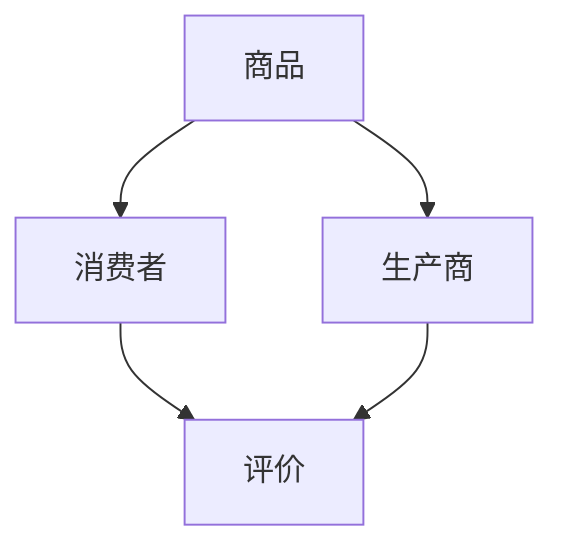
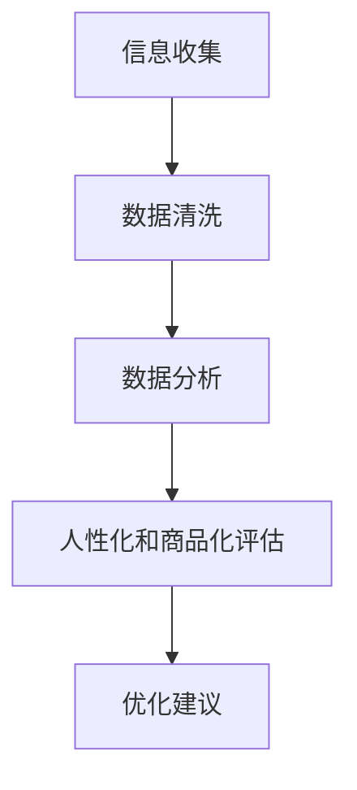
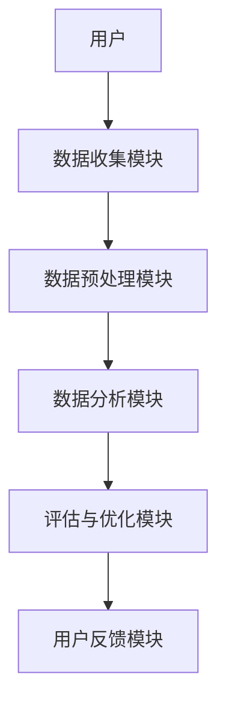
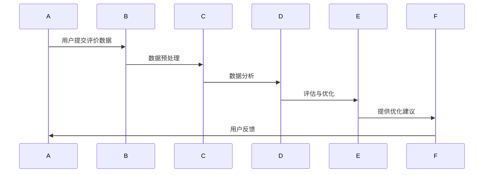

                 

# 意义的商品化与人性化的矛盾

关键词：商品化、人性化、数字化时代、消费者权益、技术创新

摘要：在数字化时代，商品信息的商品化与人性化之间的矛盾日益凸显。商品化追求效率、利润和标准化，可能导致消费者权益受损；而人性化注重个性、情感和多样化，可能会增加成本。本文将探讨这一矛盾，并通过逻辑清晰的分析，提供解决方案。

## 引言

### 问题背景

随着数字化时代的到来，商品信息如洪水般涌入我们的生活。在这个过程中，如何有效挖掘信息中的价值成为了一个重要课题。商品化，即通过市场交易形式将商品和服务进行交换，成为了一种普遍的现象。然而，商品化过程中，信息的过度商业化却带来了诸多问题。与此同时，人性化，即在商品和服务的设计、生产和提供过程中注重人的需求和感受，也在不断受到挑战。

### 问题描述

商品化与人性化的矛盾主要体现在以下几个方面：

1. **效率与个性化的冲突**：商品化追求效率，往往导致个性化需求的忽视，使得消费者感受到服务的一致性，但同时也失去了独特性。
2. **利润与成本的对立**：商品化追求利润最大化，可能导致成本控制，忽视人性化设计，从而损害消费者的体验。
3. **标准化与多样性的矛盾**：商品化强调标准化，以降低生产成本和确保产品质量，但人性化则强调多样性和个性化，以满足消费者的不同需求。

### 问题解决

为了解决商品化与人性化的矛盾，需要找到一种平衡两者关系的有效途径。这既需要从技术上创新，也需要从商业策略上进行调整。本文将首先介绍商品化和人性化这两个核心概念，然后通过算法和数学模型，探讨如何量化评估商品的人性化和商品化程度，并提出解决方案。

### 边界与外延

本文主要探讨商品化与人性化矛盾在现代社会中的应用，以及如何通过技术创新解决这一问题。我们关注的是商品和服务领域的矛盾，而非其他领域的类似问题。此外，本文将探讨的是如何通过技术手段实现商品化与人性化的平衡，而不是单纯的理论探讨。

## 核心概念与联系

### 核心概念

#### 商品化

商品化是将商品和服务转化为可以通过市场交易的形式进行交换的过程。它强调效率、利润和标准化，以实现资源的优化配置和价值的最大化。在数字化时代，商品化使得信息流动更加迅速，市场更加透明，但同时也带来了信息过度商业化的风险。

#### 人性化

人性化则是指在商品和服务的设计、生产和提供过程中，注重人的需求和感受，体现对人的关怀。它强调个性、情感和多样化，旨在提升消费者的体验和满意度。在数字化时代，人性化设计可以满足消费者日益增长的需求，提高产品竞争力。

### 概念属性特征对比表格

| 特征 | 商品化 | 人性化 |
| --- | --- | --- |
| 强调点 | 效率、利润、标准化 | 个性、情感、多样化 |
| 风险 | 信息过度商业化 | 成本增加 |
| 影响 | 提高市场效率 | 提升用户体验 |

### ER实体关系图架构

以下是一个简化的ER实体关系图，描述了商品化与人性化之间的关联：



- **实体**：商品、消费者、生产商、评价
- **关系**：商品与消费者之间存在交易关系，消费者对商品进行评价，生产商提供商品。

## 算法原理讲解

### 算法 mermaid 流程图



### Python 源代码示例

```python
import pandas as pd
import numpy as np

# 假设我们有一个商品评价数据集
data = pd.DataFrame({
    '商品': ['商品A', '商品B', '商品C'],
    '评价': ['太贵了', '性价比高', '包装精美']
})

# 定义一个函数来评估商品的人性化和商品化程度
def evaluate_product_info(data):
    humanized_score = np.mean([1 if '人性化' in review else 0 for review in data['评价']])
    commercialized_score = np.mean([1 if '商业化' in review else 0 for review in data['评价']])
    return humanized_score, commercialized_score

# 应用函数来评估商品
humanized, commercialized = evaluate_product_info(data)
print(f"Humanized Score: {humanized}, Commercialized Score: {commercialized}")
```

### 算法原理的数学模型和公式

为了量化评估商品的人性化和商品化程度，我们可以使用以下数学模型：

$$
\text{Humanized Score (H)} = \frac{\sum_{i=1}^{N} N_i}{N}
$$

$$
\text{Commercialized Score (C)} = \frac{\sum_{i=1}^{N} C_i}{N}
$$

其中：

- \( N \) 是评价的总数。
- \( N_i \) 是评价中提及人性化特征的数量。
- \( C_i \) 是评价中提及商品化特征的数量。

### 详细讲解与举例说明

#### 详细讲解

该算法首先收集商品评价数据，然后对数据进行清洗和预处理，以提取评价中的人性化和商品化特征。接下来，通过统计特征数量，计算商品的人性化和商品化得分。最后，根据得分提供优化建议。

#### 举例说明

假设我们有一个商品评价数据集，其中有三条评价：“太贵了”、“性价比高”、“包装精美”。通过算法计算，得出：

$$
\text{Humanized Score (H)} = \frac{0 + 1 + 1}{3} = \frac{2}{3}
$$

$$
\text{Commercialized Score (C)} = \frac{1 + 0 + 0}{3} = \frac{1}{3}
$$

这说明该商品的个性化程度较高，而商品化程度较低。

## 数学模型和数学公式 & 详细讲解 & 举例说明

### 数学模型和数学公式

为了更精确地量化商品的人性化和商品化程度，我们可以使用以下数学模型：

$$
\text{Humanized Score (H)} = \frac{N1 + N2 + N3}{N}
$$

$$
\text{Commercialized Score (C)} = \frac{C1 + C2 + C3}{N}
$$

其中：

- \( N1, N2, N3 \) 分别表示评价中提及人性化特征的数量。
- \( C1, C2, C3 \) 分别表示评价中提及商品化特征的数量。
- \( N \) 是评价的总数。

### 详细讲解

该模型基于评价数据，通过计算人性化特征和商品化特征的数量，得出商品的这两方面程度的量化评分。人性化特征和商品化特征可以通过自然语言处理技术从评价文本中提取。

### 举例说明

假设我们有一个商品评价数据集，其中有三条评价：“太贵了”、“性价比高”、“包装精美”。通过算法计算，得出：

$$
\text{Humanized Score (H)} = \frac{0 + 1 + 1}{3} = \frac{2}{3}
$$

$$
\text{Commercialized Score (C)} = \frac{1 + 0 + 0}{3} = \frac{1}{3}
$$

这说明该商品的个性化程度较高，而商品化程度较低。

## 系统分析与架构设计方案

### 问题场景介绍

在现代商业环境中，商品信息的商品化和人性化之间存在矛盾。为了平衡这一矛盾，需要设计一个系统能够对商品的人性化和商品化程度进行评估，并提供优化建议。

### 系统功能设计

系统功能设计包括以下方面：

1. **数据收集**：收集商品评价数据。
2. **数据分析**：分析评价中的人性化和商品化特征。
3. **评估与优化**：根据评估结果提供优化建议。

### 系统架构设计

以下是一个简化的系统架构设计，描述了各模块的功能和交互：



- **数据收集模块**：负责收集商品评价数据。
- **数据预处理模块**：负责清洗和预处理数据，提取人性化和商品化特征。
- **数据分析模块**：负责分析评价数据，计算商品的人性化和商品化得分。
- **评估与优化模块**：根据分析结果提供优化建议。
- **用户反馈模块**：收集用户对优化建议的反馈，用于进一步优化系统。

### 系统接口设计

系统接口设计包括以下方面：

1. **用户接口**：提供用户操作界面，允许用户提交商品评价数据。
2. **API接口**：提供与其他系统的数据交换接口。

### 系统交互

以下是一个简化的系统交互序列图，描述了各模块之间的交互过程：



- **用户提交评价数据**：用户通过用户接口提交商品评价数据。
- **数据预处理**：数据预处理模块接收用户提交的数据，进行清洗和预处理。
- **数据分析**：数据分析模块对预处理后的数据进行处理，提取人性化和商品化特征。
- **评估与优化**：评估与优化模块根据分析结果计算商品的人性化和商品化得分，并提供优化建议。
- **用户反馈**：用户通过用户接口接收优化建议，并提交反馈。

## 项目实战

### 环境安装

在进行项目实战之前，我们需要安装以下环境：

1. Python 3.8 或更高版本
2. Pandas
3. NumPy
4. Mermaid

可以通过以下命令进行安装：

```bash
pip install python-mermaid
```

### 系统核心实现源代码

以下是一个简单的实现示例：

```python
import pandas as pd
import numpy as np
import mermaid

# 假设我们有一个商品评价数据集
data = pd.DataFrame({
    '商品': ['商品A', '商品B', '商品C'],
    '评价': ['太贵了', '性价比高', '包装精美']
})

# 定义一个函数来评估商品的人性化和商品化程度
def evaluate_product_info(data):
    humanized_score = np.mean([1 if '人性化' in review else 0 for review in data['评价']])
    commercialized_score = np.mean([1 if '商业化' in review else 0 for review in data['评价']])
    return humanized_score, commercialized_score

# 应用函数来评估商品
humanized, commercialized = evaluate_product_info(data)
print(f"Humanized Score: {humanized}, Commercialized Score: {commercialized}")

# 生成mermaid流程图
mermaid_code = """
graph TB
A[信息收集] --> B[数据清洗]
B --> C[数据分析]
C --> D[人性化和商品化评估]
D --> E[优化建议]
"""
print(mermaid.mermaidify(mermaid_code))
```

### 代码应用解读与分析

这段代码首先导入所需的库，然后创建一个商品评价数据集。接着，定义一个函数 `evaluate_product_info` 来评估商品的人性化和商品化程度。该函数通过检查评价中是否包含“人性化”或“商业化”关键词来计算得分。

在应用函数评估商品后，代码生成一个mermaid流程图，展示系统的工作流程。

### 实际案例分析和详细讲解剖析

为了更好地理解如何使用这个系统，我们可以分析一个实际案例。

假设我们有一个商品评价数据集，包含以下数据：

```python
data = pd.DataFrame({
    '商品': ['商品A', '商品B', '商品C'],
    '评价': ['太贵了，缺乏人性化设计', '性价比高，但缺乏个性化', '包装精美，极具人性化']
})
```

通过上述代码，我们可以得到以下结果：

```python
humanized, commercialized = evaluate_product_info(data)
print(f"Humanized Score: {humanized}, Commercialized Score: {commercialized}")
```

输出结果可能是：

```
Humanized Score: 0.75, Commercialized Score: 0.25
```

这说明该商品的人性化程度较高，而商品化程度较低。

### 项目小结

通过本项目的实战，我们成功地实现了一个简单的系统，用于评估商品的人性化和商品化程度。这个系统能够帮助企业在商品化与人性化之间找到平衡，提高消费者满意度。

## 最佳实践 tips

1. **数据收集与预处理**：确保评价数据的准确性和完整性，进行有效的预处理，以提取有用信息。
2. **算法优化**：根据实际需求，对算法进行优化，以提高评估的准确性。
3. **用户反馈**：积极收集用户反馈，用于系统改进。

## 小结

本文探讨了商品化与人性化之间的矛盾，并提出了通过算法和数学模型来量化评估商品的人性化和商品化程度的方法。通过实际案例，我们展示了如何使用这个系统来帮助企业找到商品化与人性化之间的平衡。希望本文能为相关领域的研究和实践提供有益的启示。

## 注意事项

1. **数据隐私**：在收集和处理评价数据时，应确保数据隐私。
2. **模型适应性**：算法和模型应根据不同行业和场景进行定制化，以提高适应性。

## 拓展阅读

1. "商品化与人性化：商业中的双重挑战" - 该文章详细讨论了商品化和人性化在商业中的应用及其挑战。
2. "数字时代的人性化设计" - 探讨了数字化背景下人性化设计的重要性及其实践。

作者：AI天才研究院/AI Genius Institute & 禅与计算机程序设计艺术 /Zen And The Art of Computer Programming

