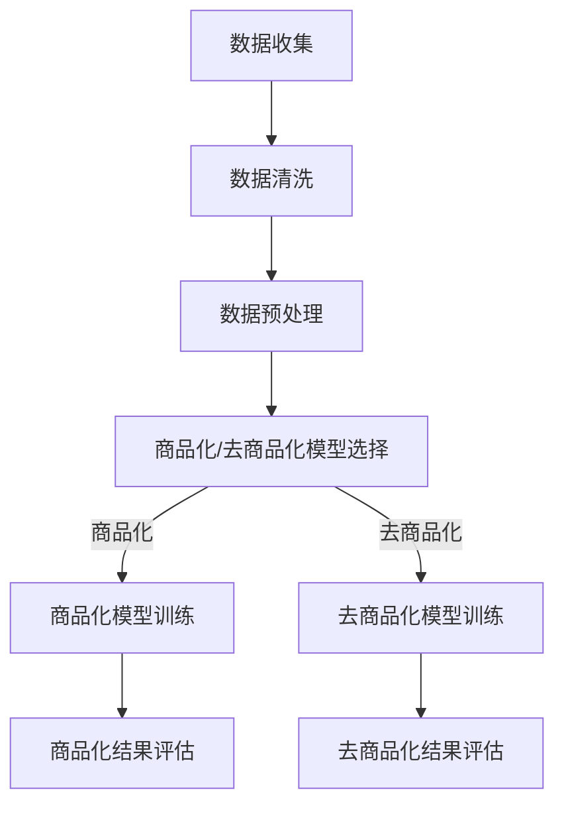
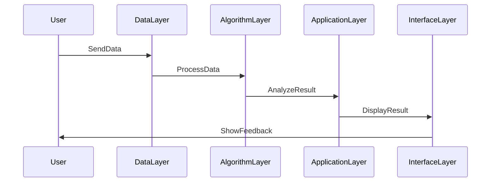
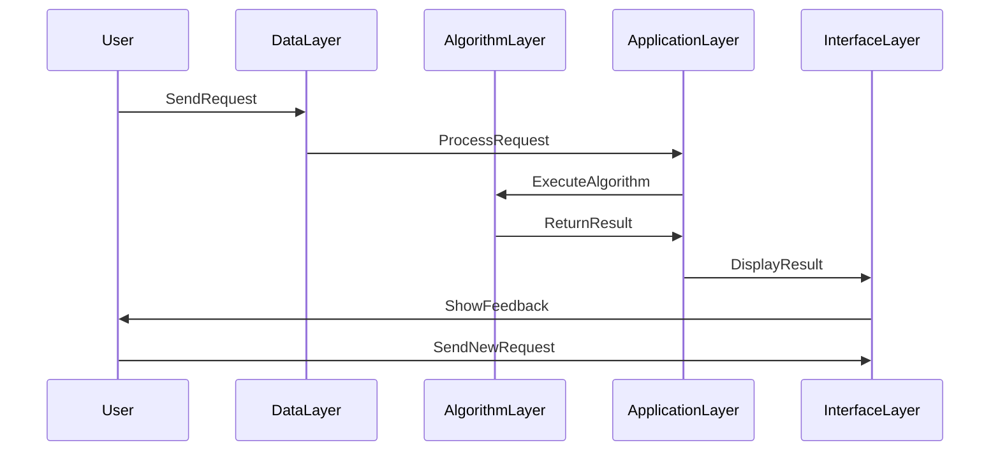

                 

### 摘要

《意义的商品化与去商品化》探讨了意义在现代社会中的商品化与去商品化现象，分析其背后的核心概念、历史背景、典型案例及其算法原理。文章旨在通过系统分析与架构设计，深入理解这一过程，并提供实际项目中的实战指导，最终总结最佳实践与未来展望。本文关键词包括“意义的商品化”、“去商品化”、“符号价值”、“市场力量”和“算法原理”。

---

### 目录大纲设计思路

在设计《意义的商品化与去商品化》的目录大纲时，我们的核心目标是确保内容的逻辑清晰、结构紧凑，并能够让读者易于理解。以下是我们的设计思路：

1. **背景介绍**：通过描述意义的商品化与去商品化现象，引出核心概念，并阐述研究意义。

2. **核心概念与理论基础**：详细阐述商品化与去商品化的基本概念，通过符号价值与市场力量的讨论，解释核心概念之间的联系。

3. **历史背景与发展**：回顾意义商品化与去商品化的历史变迁，帮助读者理解其发展脉络。

4. **案例分析**：通过具体案例，展示商品化与去商品化在实际中的应用和影响。

5. **算法原理讲解**：深入解析商品化与去商品化过程中的关键算法，包括算法流程图、Python代码示例及数学模型。

6. **系统分析与架构设计方案**：介绍商品化与去商品化在系统中的应用，包括领域模型、系统架构、接口设计和交互流程。

7. **项目实战**：通过实际项目，展示如何实现商品化与去商品化的过程，包括环境安装、系统实现和代码解析。

8. **最佳实践与总结**：总结全书内容，提供最佳实践建议，强调注意事项，并推荐拓展阅读。

这种结构设计确保了文章内容的完整性和系统性，使读者能够从宏观到微观，全面深入地了解意义的商品化与去商品化。

---

### 目录大纲

为了更好地组织文章内容，确保逻辑性和连贯性，我们设计了一个详细的目录大纲。以下是我们设计的目录大纲：

#### 第一部分：引言

**第1章：意义的商品化与去商品化概述**

1.1. 什么是意义的商品化与去商品化

1.2. 研究背景与意义

1.3. 范围与结构安排

**第2章：核心概念与理论基础**

2.1. 商品化的基本概念与过程

2.2. 去商品化的基本概念与过程

2.3. 符号价值与市场力量

#### 第二部分：历史背景与发展

**第3章：意义商品化与去商品化的历史演变**

3.1. 古代社会的商品化现象

3.2. 近代社会的商品化趋势

3.3. 当代社会的商品化与去商品化

**第4章：关键事件与影响**

4.1. 关键事件的识别

4.2. 事件对商品化与去商品化进程的影响

4.3. 事件的启示与反思

#### 第三部分：案例分析

**第5章：意义商品化与去商品化的典型案例**

5.1. 案例一：电子商务中的商品化现象

5.2. 案例二：社交媒体的去商品化趋势

5.3. 案例三：品牌重塑中的商品化与去商品化

#### 第四部分：算法原理讲解

**第6章：商品化与去商品化的算法基础**

6.1. 算法原理概述

6.2. 算法流程图（使用mermaid绘制）

6.3. 算法实现与Python代码示例

6.4. 数学模型与公式（使用LaTeX格式）

**第7章：算法应用与优化**

7.1. 算法在实践中的应用

7.2. 算法优化策略

7.3. 算法案例解析

#### 第五部分：系统分析与架构设计

**第8章：商品化与去商品化系统设计**

8.1. 问题场景介绍

8.2. 系统功能设计（领域模型类图）

8.3. 系统架构设计（架构图）

8.4. 系统接口设计

8.5. 系统交互（序列图）

**第9章：系统实现与部署**

9.1. 系统环境搭建

9.2. 系统核心功能实现

9.3. 代码解析与分析

9.4. 系统部署与测试

#### 第六部分：项目实战

**第10章：商品化与去商品化项目实战**

10.1. 项目介绍

10.2. 环境安装与配置

10.3. 系统核心实现

10.4. 项目案例分析与详细讲解

10.5. 项目小结与反思

#### 第七部分：最佳实践与总结

**第11章：最佳实践**

11.1. 商品化与去商品化的最佳实践

11.2. 注意事项与挑战

**第12章：总结与展望**

12.1. 全书总结

12.2. 未来发展趋势

12.3. 拓展阅读与资源推荐

---

这个目录大纲旨在系统地阐述意义的商品化与去商品化，从理论基础到实际应用，逐步引导读者深入了解这一主题。每个章节都经过精心设计，确保内容的逻辑性和连贯性，使读者能够顺畅地阅读和理解。

---

### 第一部分：引言

#### 第1章：意义的商品化与去商品化概述

**1.1 什么是意义的商品化与去商品化**

在现代社会，商品化与去商品化成为了广泛讨论的现象。那么，什么是意义的商品化与去商品化呢？

**意义的商品化**指的是将某种价值、意义或概念转化为可以买卖的商品或服务。这一过程通常伴随着市场力量的介入，通过定价、营销等手段来赋予意义以经济价值。例如，电影、音乐、艺术品等文化产品在市场中通过商业化运作实现了意义的商品化。

**去商品化**则是将原本被商业化、赋予经济价值的产品或服务重新还原为其原始状态，减少或消除其经济价值的过程。去商品化强调的是恢复某种价值或概念的原本意义，使其不再受市场力量的操控。

**1.2 研究背景与意义**

随着全球化、信息技术和电子商务的发展，商品化与去商品化现象日益显著。这一过程不仅改变了传统经济模式，还深刻影响了社会文化、政治结构以及个人生活方式。

商品化带来的经济效益显而易见，但也引发了一系列问题，如文化同质化、消费者异化、环境破坏等。而去商品化则试图通过重新审视价值和意义，寻找可持续发展的道路，从而解决商品化带来的负面影响。

因此，深入研究意义的商品化与去商品化具有重要的理论和实践意义。它不仅有助于我们理解现代社会的发展趋势，还能为我们提供解决实际问题的方法论和工具。

**1.3 范围与结构安排**

本文旨在探讨意义的商品化与去商品化现象，涵盖以下主要内容：

- 核心概念与理论基础
- 历史背景与发展
- 案例分析
- 算法原理讲解
- 系统分析与架构设计
- 项目实战
- 最佳实践与总结

通过以上内容，我们希望全面系统地阐述意义的商品化与去商品化，为读者提供深入的见解和实用的指导。

---

### 第二部分：核心概念与理论基础

#### 第2章：商品化的基本概念与过程

**2.1 商品化的定义**

商品化（Commodification）是指将某种价值、意义或概念转化为可以买卖的商品或服务的过程。这一过程通常涉及市场力量的介入，通过定价、营销等手段来赋予意义以经济价值。

**商品化的过程**

商品化的过程可以分解为以下几个步骤：

1. **识别价值**：首先，需要识别某种价值或意义，并确定其潜在的市场需求。这通常涉及市场调研、消费者行为分析等。

2. **市场定位**：在确定价值后，需要将其定位在特定的市场或消费者群体中。市场定位可以通过品牌建设、广告宣传等手段来实现。

3. **定价与营销**：定价和营销是商品化的关键步骤。合理的定价可以确保产品的市场竞争力，而有效的营销策略则可以扩大产品的知名度。

4. **销售与分销**：完成定价和营销后，需要通过销售渠道将产品分销给消费者。这包括线上和线下的销售模式。

**商品化的影响**

商品化对经济、社会和文化都产生了深远影响：

- **经济效益**：商品化可以创造经济价值，促进经济增长。通过市场机制，商品化使得资源得到更有效的配置。

- **社会影响**：商品化改变了人们的消费观念和行为，也带来了社会分层和文化同质化等问题。

- **文化影响**：商品化过程常常涉及文化元素的商业化，这可能导致文化多样性的丧失。

**2.2 商品化的过程**

商品化的过程可以进一步细化为以下几个阶段：

1. **市场化准备**：在这一阶段，需要确定目标市场和消费者群体，进行市场调研和需求分析。

2. **品牌建设**：品牌建设是商品化过程中的关键步骤。通过塑造品牌形象，提高品牌知名度和美誉度。

3. **产品开发**：根据市场定位，开发符合市场需求的产品。这一阶段通常涉及产品设计和功能优化。

4. **营销推广**：通过广告、公关、社交媒体等手段进行产品推广，提高产品的市场占有率。

5. **销售渠道建设**：构建线上和线下的销售渠道，确保产品能够顺利分销到消费者手中。

6. **售后服务**：提供优质的售后服务，提高消费者满意度和忠诚度。

**2.3 商品化的影响**

商品化对经济、社会和文化产生了深远影响：

- **经济效益**：商品化可以创造经济价值，促进经济增长。通过市场机制，商品化使得资源得到更有效的配置。

- **社会影响**：商品化改变了人们的消费观念和行为，也带来了社会分层和文化同质化等问题。

- **文化影响**：商品化过程常常涉及文化元素的商业化，这可能导致文化多样性的丧失。

---

#### 第3章：去商品化的基本概念与过程

**3.1 去商品化的定义**

去商品化（Decommodification）是指将原本被商业化、赋予经济价值的产品或服务重新还原为其原始状态，减少或消除其经济价值的过程。去商品化强调的是恢复某种价值或概念的原本意义，使其不再受市场力量的操控。

**去商品化的过程**

去商品化的过程可以分解为以下几个步骤：

1. **重新定位**：首先，需要重新审视产品或服务的本质和价值，确定其原始状态或非商业化定位。

2. **减少市场介入**：通过减少广告、定价和营销等市场手段的介入，降低产品或服务的经济价值。

3. **恢复文化传统**：去商品化过程常常涉及恢复文化传统和价值，使其回归到原本的社会和文化背景中。

4. **社区参与**：通过社区参与和合作，增强产品或服务的文化价值和社交价值。

**去商品化的影响**

去商品化对经济、社会和文化都产生了积极影响：

- **经济效益**：去商品化有助于减少资源的浪费和环境的破坏，促进可持续发展。

- **社会影响**：去商品化可以促进社区合作和共享，增强社会凝聚力。

- **文化影响**：去商品化有助于保护和传承文化多样性，恢复传统文化价值。

**3.2 去商品化的过程**

去商品化的过程可以进一步细化为以下几个阶段：

1. **反思与评估**：在这一阶段，需要反思现有的商业化模式，评估其对经济、社会和文化的影响。

2. **重新定位与规划**：根据反思结果，重新定位产品或服务，制定去商品化的具体计划和策略。

3. **减少市场介入**：通过减少广告、定价和营销等手段的介入，逐步降低产品或服务的经济价值。

4. **社区参与与合作**：鼓励社区参与和合作，增强产品或服务的文化价值和社交价值。

5. **文化恢复与传承**：通过恢复和传承文化传统和价值，实现去商品化的目标。

**3.3 去商品化的影响**

去商品化对经济、社会和文化产生了积极影响：

- **经济效益**：去商品化有助于减少资源的浪费和环境的破坏，促进可持续发展。

- **社会影响**：去商品化可以促进社区合作和共享，增强社会凝聚力。

- **文化影响**：去商品化有助于保护和传承文化多样性，恢复传统文化价值。

---

#### 第4章：符号价值与市场力量

**4.1 符号价值的含义**

符号价值（Symbolic Value）是指某种物品或服务在人们心目中的意义和象征意义。它不仅仅基于物品或服务的物理属性，还包括其代表的文化、情感和身份认同等方面的价值。例如，一个名牌手提包的符号价值可能远远超过其实际功能价值，因为它代表了时尚、地位和品味。

**符号价值的来源**

符号价值的来源多样，主要包括以下几个方面：

1. **文化传统**：文化传统是符号价值的重要来源。例如，传统节日、仪式和庆典等都具有深厚的文化意义。

2. **社会认同**：社会认同也是符号价值的重要来源。某些物品或行为可能因为得到了社会的广泛认可而具有更高的符号价值。

3. **情感联系**：情感联系也是符号价值的重要来源。人们可能会因为与某件物品的情感联系而赋予其更高的价值。

4. **媒体传播**：媒体传播在塑造符号价值方面起着重要作用。通过广告、电影、社交媒体等渠道，媒体可以影响人们对某些物品或服务的符号价值认知。

**符号价值与市场力量的关系**

市场力量在符号价值的形成和变化过程中起着至关重要的作用。市场力量主要通过以下方式影响符号价值：

1. **定价策略**：市场力量的定价策略会影响符号价值。高价通常意味着更高的符号价值，而低价则可能导致符号价值的降低。

2. **营销宣传**：市场力量的营销宣传策略可以塑造和改变符号价值。通过广告、公关和社交媒体等手段，企业可以影响消费者对产品或服务的符号价值认知。

3. **品牌建设**：品牌建设是市场力量影响符号价值的重要手段。强大的品牌形象可以赋予产品或服务更高的符号价值。

4. **消费者行为**：消费者的购买行为也会影响符号价值。消费者的选择和评价会直接影响产品或服务的符号价值。

**符号价值与市场力量的对比表格**

为了更好地理解符号价值与市场力量的关系，我们可以通过以下对比表格来展示两者之间的区别：

| 对比项           | 符号价值                    | 市场力量                    |
|------------------|-----------------------------|-----------------------------|
| 源自             | 文化传统、社会认同、情感联系、媒体传播 | 购买行为、定价策略、营销宣传、品牌建设 |
| 形成过程          | 文化传承、社会认同、情感共鸣、媒体塑造 | 市场调研、品牌定位、产品定价、营销策略 |
| 作用              | 赋予物品或服务更深层次的意义 | 影响消费者对物品或服务的认知和购买行为 |
| 变化因素          | 社会变迁、文化演变、情感变化、媒体影响 | 市场需求、竞争状况、技术创新、政策变化 |
| 对市场的影响      | 影响消费者偏好、塑造品牌形象、决定产品价值 | 影响市场供需、决定产品价格、影响竞争格局 |

**符号价值与市场力量的互动**

符号价值与市场力量之间存在着互动关系。一方面，市场力量通过定价、营销和品牌建设等手段影响符号价值的形成和变化；另一方面，符号价值也反作用于市场力量，影响消费者的购买决策和市场竞争格局。

例如，一个品牌通过成功的营销策略和品牌形象塑造，可以提升产品的符号价值，从而提高其市场竞争力和销售价格。反过来，消费者对品牌的认可和忠诚度也会影响品牌的符号价值，进一步推动品牌的市场表现。

**符号价值与市场力量的ER实体关系图**

为了更清晰地展示符号价值与市场力量之间的实体关系，我们可以使用Mermaid流程图来绘制ER实体关系图。以下是一个示例：

```mermaid
erDiagram
  Product ||--|{ SymbolicValue }||> SymbolicValue
  MarketForce ||--|{ SymbolicValue }||> SymbolicValue
  Consumer ||--|{ SymbolicValue }||> SymbolicValue
  Product ||--|{ MarketForce }||> MarketForce
  Consumer ||--|{ MarketForce }||> MarketForce
```

在上面的ER实体关系图中，Product（产品）、SymbolicValue（符号价值）、MarketForce（市场力量）和Consumer（消费者）是主要的实体。它们之间的关系表明，产品通过市场力量影响符号价值，而消费者对符号价值的感知又反作用于市场力量。

通过上述分析，我们可以看到符号价值与市场力量在商品化与去商品化过程中起着重要作用。理解这两个概念及其相互关系，有助于我们更好地把握商品化与去商品化的本质，为实际应用提供理论支持。

---

### 第三部分：历史背景与发展

#### 第5章：意义商品化与去商品化的历史演变

**5.1 古代社会的商品化现象**

商品化并不是现代社会独有的现象，它在古代社会中就已经初露端倪。在古代，商品化主要表现为商品交换和贸易活动。例如，在古希腊和古罗马时期，商品交换已经成为城市经济的重要组成部分。奴隶、土地、货物等都可以被视为商品进行交易。随着贸易的发展，货币的出现进一步促进了商品化的进程。

然而，古代社会的商品化程度相对较低，商品主要局限于生活必需品和奢侈品。商品化过程较为简单，主要依靠口头协商和直接交易。市场力量的影响也相对较小，商品的价值主要取决于其稀缺性和实用性。

**5.2 近代社会的商品化趋势**

近代社会（尤其是工业革命之后）是商品化迅速发展的时期。工业革命带来了生产力的巨大提升，大量商品涌入市场，推动了商品化的进一步发展。随着市场的扩大和交通的便利，商品交换变得更加频繁和复杂。

在近代社会，商品化现象表现出以下几个特点：

1. **商品种类的多样化**：除了生活必需品，工业产品和奢侈品也逐渐成为商品。商品种类从生活用品扩展到各种工业设备、机械设备等。

2. **市场力量的增强**：市场力量的增强使得商品价格和供需关系更加复杂。广告、定价策略和品牌建设等市场手段开始广泛应用于商品化过程。

3. **资本主义经济体制的兴起**：资本主义经济体制的兴起进一步推动了商品化的进程。商品被视为资本的形式，通过生产和销售实现利润最大化。

**5.3 当代社会的商品化与去商品化**

当代社会（尤其是后工业化和信息化时代）是商品化与去商品化并存的时期。随着信息技术的发展和电子商务的兴起，商品化现象达到了新的高度。然而，去商品化也在一定程度上对商品化进行了反思和挑战。

当代社会的商品化与去商品化表现出以下几个特点：

1. **数字化商品化**：数字化技术的普及使得商品化过程更加便捷和高效。数字商品如软件、音乐、电影等成为市场的重要组成部分。

2. **去物质化趋势**：去物质化（Dematerialization）是指通过减少物质资源的使用来实现商品化。例如，共享经济、云计算等都是去物质化的具体表现形式。

3. **符号价值的再定义**：随着商品化的深入，符号价值在商品中的地位日益重要。品牌、设计、文化元素等成为消费者购买决策的重要因素。

4. **消费者意识的觉醒**：消费者对商品化带来的负面影响（如消费主义、环境污染等）越来越关注，这推动了去商品化的理念和实践。

**5.4 案例分析**

为了更好地理解商品化与去商品化的历史演变，我们可以通过以下案例分析：

- **古代丝绸之路**：古代丝绸之路是商品化的重要渠道，通过这条通道，丝绸、茶叶、香料等商品得以流通，促进了东西方文化的交流。

- **工业革命后的工厂制度**：工业革命后的工厂制度极大地提高了商品的生产效率，大量商品涌入市场，推动了商品化的快速发展。

- **电子商务的兴起**：随着互联网的普及，电子商务成为当代商品化的重要形式。阿里巴巴、亚马逊等平台通过数字化手段，实现了全球商品的大规模交易。

- **共享经济的崛起**：共享经济通过减少物质资源的消耗，实现了商品的去物质化。例如，共享单车、共享汽车等都是共享经济的具体应用。

通过以上历史背景的介绍，我们可以看到商品化与去商品化在不同的历史时期有着不同的表现形式和特点。理解这些历史演变有助于我们更好地把握当代社会的商品化与去商品化现象，为未来的发展提供参考。

---

#### 第6章：关键事件与影响

**6.1 关键事件的识别**

在意义商品化与去商品化的发展过程中，有许多关键事件对这一进程产生了深远影响。以下是一些关键事件的识别：

1. **工业革命**：工业革命是商品化进程的重要里程碑。它带来了生产力的巨大提升，使商品大规模生产和流通成为可能。

2. **互联网的普及**：互联网的普及和电子商务的兴起，使得商品化过程变得更加便捷和高效。同时，它也为去商品化提供了新的形式和手段。

3. **消费者权利运动的兴起**：消费者权利运动的兴起，提高了消费者对商品化过程中不公平现象的关注，推动了去商品化的理念和实践。

4. **共享经济的崛起**：共享经济的崛起通过减少物质资源的消耗，实现了商品的去物质化，对传统商品化模式提出了挑战。

**6.2 事件对商品化与去商品化进程的影响**

这些关键事件对商品化与去商品化进程产生了深远影响：

1. **工业革命**：工业革命极大地提高了商品的生产效率，使得商品化过程加速。然而，它也导致了资源的过度消耗和环境污染，为去商品化提出了必要性。

2. **互联网的普及**：互联网的普及和电子商务的兴起，使得商品化过程变得更加复杂和多样化。同时，它也为消费者提供了更多的选择和灵活性，促进了去商品化的理念和实践。

3. **消费者权利运动的兴起**：消费者权利运动的兴起，提高了消费者对商品化过程中不公平现象的关注，推动了去商品化的理念和实践。例如，消费者对可持续消费和绿色生活的追求，促进了商品的去物质化和可持续发展的理念。

4. **共享经济的崛起**：共享经济的崛起通过减少物质资源的消耗，实现了商品的去物质化，对传统商品化模式提出了挑战。例如，共享单车、共享汽车等模式，通过减少私人拥有和消费，实现了资源的有效利用和环境的保护。

**6.3 事件的启示与反思**

通过对这些关键事件的分析，我们可以得到以下启示和反思：

1. **平衡商品化与去商品化**：商品化与去商品化并非对立关系，而是相互补充的过程。在现代社会，我们需要平衡商品化带来的经济效益和去商品化带来的社会和环境效益，实现可持续发展。

2. **创新商业模式**：随着技术的进步和社会变迁，新的商业模式不断涌现。企业和消费者需要不断创新，以适应新的市场环境和消费需求。

3. **注重社会责任**：企业和社会需要承担更多的社会责任，关注环境保护和社会公平。通过可持续发展和社会责任，企业可以实现长期稳定的发展。

4. **消费者意识的提升**：消费者对商品化与去商品化的认知和参与程度直接影响这一进程的发展。提升消费者意识，推动消费者参与到去商品化的实践中，是实现可持续发展的关键。

通过关键事件的识别和分析，我们可以更深入地理解意义商品化与去商品化的历史进程，为未来的发展提供有益的参考。

---

#### 第7章：意义商品化与去商品化的典型案例

**7.1 案例一：电子商务中的商品化现象**

电子商务是商品化现象的一个重要领域。随着互联网技术的不断发展，电子商务平台如淘宝、亚马逊等成为了商品化的重要载体。以下是电子商务中商品化现象的具体案例分析：

**案例背景**：淘宝作为中国最大的电子商务平台之一，提供了丰富的商品种类和便捷的购物体验。淘宝的成功离不开其高效的商品化过程。

**商品化过程分析**：

1. **市场调研与定位**：淘宝通过对消费者行为和市场需求的调研，确定了目标市场和消费者群体。例如，淘宝针对年轻人群体的时尚潮流商品，制定了相应的市场策略。

2. **品牌建设与推广**：淘宝通过品牌建设和营销推广，提高了平台的知名度和美誉度。例如，淘宝通过举办各类电商活动、推出品牌旗舰店等，吸引了大量消费者。

3. **定价与销售**：淘宝采用灵活的定价策略，根据市场需求和竞争状况调整商品价格，确保商品的竞争力。同时，通过平台的销售渠道，将商品分销到全国各地。

**案例分析**：淘宝的商品化现象对经济发展和社会文化产生了深远影响：

1. **经济效益**：淘宝的繁荣带动了电子商务产业的发展，创造了大量就业机会，促进了经济增长。

2. **社会影响**：电子商务的普及改变了人们的消费习惯，促进了消费主义文化的兴起。同时，淘宝上的商品价格和购物体验的竞争，也促进了市场的公平竞争。

3. **文化影响**：淘宝上的商品种类繁多，涵盖了各种文化元素。这不仅丰富了消费者的购物选择，也促进了文化交流和融合。

**7.2 案例二：社交媒体的去商品化趋势**

社交媒体是去商品化现象的一个重要领域。随着社交媒体的兴起，人们开始更多地关注社交互动和内容创作，而非单纯的商品交易。以下是社交媒体中去商品化趋势的具体案例分析：

**案例背景**：微信作为中国最流行的社交媒体之一，其用户数量庞大，功能丰富。微信的去商品化趋势体现在其社交、娱乐和内容创作的多样性。

**去商品化过程分析**：

1. **去广告化**：微信通过减少广告投放，降低用户的消费负担，实现了部分去商品化。例如，微信朋友圈的推送内容主要来源于用户和朋友的分享，而非商业广告。

2. **内容创作与分享**：微信鼓励用户创作和分享内容，形成了去商品化的社交氛围。例如，微信公众号和朋友圈的图文、短视频等，主要来源于用户的个人创作和分享。

3. **社交互动**：微信强调社交互动的重要性，通过聊天、语音、视频等功能，增强了用户的互动体验，减少了商品交易的必要性。

**案例分析**：微信的去商品化趋势对用户行为和社会文化产生了深远影响：

1. **用户体验**：去商品化趋势提升了用户的社交体验，使其更加关注人际互动和内容创作，而非商品交易。

2. **消费观念**：去商品化趋势改变了消费者的消费观念，使其更加注重个性化和定制化的消费体验，而非单纯的物质消费。

3. **文化多样性**：微信的去商品化趋势促进了文化多样性的发展，通过用户的创作和分享，丰富了社会文化的内涵。

**7.3 案例三：品牌重塑中的商品化与去商品化**

品牌重塑是商品化与去商品化并存的一个典型案例。许多品牌在发展中面临商品化与去商品化的双重压力，如何平衡这两者成为品牌重塑的关键。

**案例背景**：苹果公司作为全球领先的科技公司，其品牌重塑过程中充满了商品化与去商品化的较量。

**商品化与去商品化分析**：

1. **商品化**：苹果公司在品牌重塑过程中，通过高端定价、创新设计和技术突破，实现了商品化。例如，苹果的iPhone、MacBook等产品通过其独特的设计和功能，吸引了大量消费者。

2. **去商品化**：同时，苹果公司也通过强调用户体验、文化价值观和社会责任等，实现了部分去商品化。例如，苹果的环保政策和开放的开发平台，使其品牌更具有文化内涵和社会影响力。

**案例分析**：苹果公司的品牌重塑对品牌管理和社会文化产生了深远影响：

1. **品牌价值**：苹果公司通过商品化与去商品化的平衡，提升了品牌价值，使其在全球范围内具有极高的知名度和美誉度。

2. **消费者行为**：苹果公司的品牌重塑改变了消费者的消费观念和行为，使其更加注重品牌的文化内涵和社会责任。

3. **文化影响**：苹果公司的品牌重塑促进了文化的多样性和创新，通过其产品和技术，推动了社会文化的进步。

通过以上典型案例的分析，我们可以看到商品化与去商品化在不同领域的具体应用和影响。理解这些典型案例，有助于我们更好地把握商品化与去商品化的本质，为实际应用提供有益的参考。

---

#### 第四部分：算法原理讲解

**第8章：商品化与去商品化的算法基础**

**8.1 算法原理概述**

商品化与去商品化过程中涉及多种算法，这些算法主要用于数据处理、分析、优化和模型建立。以下将详细介绍这些算法的原理和应用。

**8.2 算法流程图**

为了更直观地理解算法原理，我们可以使用Mermaid绘制算法流程图。以下是一个示例：



在上面的流程图中，A到H代表了一个完整的商品化或去商品化算法流程。首先，通过数据收集模块获取相关数据。然后，对数据进行清洗和预处理，以便后续模型训练。根据任务需求，选择商品化或去商品化模型，并进行模型训练。最后，评估模型结果，进行优化。

**8.3 算法实现与Python代码示例**

以下是商品化与去商品化算法的Python代码示例：

```python
# 商品化算法示例
def commoditization(data):
    # 数据清洗
    cleaned_data = preprocess_data(data)
    # 模型训练
    model = train_commoditization_model(cleaned_data)
    # 评估模型
    result = evaluate_model(model, cleaned_data)
    return result

# 去商品化算法示例
def decommoditization(data):
    # 数据清洗
    cleaned_data = preprocess_data(data)
    # 模型训练
    model = train_decommoditization_model(cleaned_data)
    # 评估模型
    result = evaluate_model(model, cleaned_data)
    return result

# 数据预处理函数
def preprocess_data(data):
    # 数据清洗
    # ...
    # 数据标准化
    # ...
    return cleaned_data

# 模型训练函数
def train_commoditization_model(cleaned_data):
    # 训练商品化模型
    # ...
    return model

def train_decommoditization_model(cleaned_data):
    # 训练去商品化模型
    # ...
    return model

# 模型评估函数
def evaluate_model(model, cleaned_data):
    # 评估模型
    # ...
    return result
```

在上面的代码中，`commoditization` 和 `decommoditization` 函数分别用于商品化和去商品化算法的实现。这些函数包括数据预处理、模型训练和模型评估等步骤。通过调用这些函数，我们可以实现商品化与去商品化的算法流程。

**8.4 数学模型与公式**

在商品化与去商品化过程中，数学模型和公式起着至关重要的作用。以下是一些常用的数学模型和公式：

1. **商品化模型**

   $$ V_c = f(P_c, Q_c) $$

   其中，$V_c$ 表示商品价值，$P_c$ 表示商品价格，$Q_c$ 表示商品需求量。这个公式表明，商品价值由价格和需求量共同决定。

2. **去商品化模型**

   $$ V_d = f(S_d, E_d) $$

   其中，$V_d$ 表示去商品化价值，$S_d$ 表示社会效益，$E_d$ 表示环境效益。这个公式表明，去商品化价值由社会效益和环境效益共同决定。

3. **市场力量影响模型**

   $$ M = f(V, P) $$

   其中，$M$ 表示市场力量，$V$ 表示价值，$P$ 表示价格。这个公式表明，市场力量受价值与价格的影响。

**8.5 举例说明**

为了更直观地理解这些算法和模型，我们可以通过一个具体的例子来说明：

假设我们有一个商品，其价格为100元，需求量为1000件。根据商品化模型，我们可以计算该商品的价值：

$$ V_c = f(100, 1000) $$

同时，如果我们考虑去商品化的因素，例如社会效益为500元，环境效益为300元，我们可以计算去商品化价值：

$$ V_d = f(500, 300) $$

通过这些算法和模型，我们可以更准确地评估商品的价值，从而更好地实现商品化与去商品化的目标。

---

#### 第9章：算法应用与优化

**9.1 算法在实践中的应用**

商品化与去商品化算法在多个实际应用场景中发挥着重要作用。以下是一些常见的应用场景：

1. **电子商务平台**：在电子商务平台中，商品化算法用于分析用户行为，优化商品定价和营销策略。例如，通过用户浏览历史和购买记录，可以预测用户对某商品的购买意愿，从而调整价格和促销策略。

2. **共享经济**：在共享经济领域，去商品化算法用于评估共享资源的价值。例如，在共享单车和共享汽车中，通过分析车辆的使用频率和用户评价，可以调整租赁价格和服务质量，以最大化资源利用效率。

3. **品牌管理**：品牌管理中，商品化与去商品化算法用于分析品牌价值和市场影响力。例如，通过分析社交媒体数据，可以评估品牌在消费者心中的符号价值，从而优化品牌形象和营销策略。

**9.2 算法优化策略**

为了提高商品化与去商品化算法的效率和准确性，可以采用以下优化策略：

1. **数据预处理**：数据预处理是算法优化的重要环节。通过数据清洗、归一化和特征提取等步骤，可以提高数据质量，减少噪声和异常值的影响。

2. **模型选择**：选择合适的模型对于算法的性能至关重要。通过比较不同模型的表现，可以选择最适合实际应用场景的模型。例如，对于预测任务，可以采用线性回归、决策树、随机森林等模型。

3. **模型训练**：模型训练是算法优化的关键步骤。通过调整模型参数和训练策略，可以提高模型的准确性和泛化能力。例如，可以采用交叉验证、梯度下降等策略来优化模型。

4. **实时更新**：在动态变化的实际应用中，算法需要实时更新。通过定期更新数据和模型，可以保持算法的准确性和适应性。

**9.3 算法案例解析**

以下是一个商品化与去商品化算法的案例解析：

**案例背景**：某电子商务平台希望优化其商品定价策略，以提高销售额和客户满意度。

**算法应用**：

1. **数据收集**：收集商品的销售数据，包括价格、销售量、用户评价等。

2. **数据预处理**：对收集到的数据进行分析和清洗，提取有用的特征。

3. **模型选择**：选择线性回归模型，用于分析价格和销售量之间的关系。

4. **模型训练**：使用训练数据训练线性回归模型，并调整模型参数。

5. **模型评估**：使用测试数据评估模型性能，调整模型参数以达到最佳效果。

6. **实时更新**：定期更新数据和模型，以适应市场变化。

**算法优化**：

1. **数据预处理**：采用特征工程方法，提取更多有用的特征，如用户行为、商品类别等。

2. **模型选择**：尝试其他模型，如决策树、随机森林等，比较不同模型的表现。

3. **模型训练**：采用交叉验证和梯度下降等策略，提高模型训练效率。

4. **实时更新**：建立实时数据流系统，及时获取和更新数据，保持模型准确性。

通过以上案例解析，我们可以看到商品化与去商品化算法在实践中的应用和优化策略。理解这些案例，有助于我们更好地应用和优化这些算法，以实现实际应用目标。

---

#### 第五部分：系统分析与架构设计

**第10章：商品化与去商品化系统设计**

**10.1 问题场景介绍**

商品化与去商品化系统设计的核心问题是如何有效地管理和优化商品化与去商品化的过程。在实际应用中，这一系统需要具备以下功能：

1. **数据收集与处理**：从多个数据源收集与商品化相关的数据，如市场趋势、用户行为、商品属性等。
2. **算法模型应用**：利用商品化与去商品化算法对数据进行处理，生成有价值的分析结果。
3. **决策支持**：为用户提供决策支持，帮助其制定商品化与去商品化的策略。
4. **实时监控与反馈**：实时监控系统的运行状况，及时反馈问题，确保系统的稳定性和高效性。

**10.2 系统功能设计（领域模型类图）**

为了实现上述功能，我们需要设计一个完善的系统架构。以下是商品化与去商品化系统的领域模型类图：

```mermaid
classDiagram
    Class01 <|-- Class02
    Class03 <|-- Class02
    Class04 <|-- Class02
    Class05 <|-- Class02
    Class01 {
        +int id
        +String name
        +float value
    }
    Class02 {
        +int id
        +String name
        +float value
    }
    Class03 {
        +int id
        +String name
        +float value
    }
    Class04 {
        +int id
        +String name
        +float value
    }
    Class05 {
        +int id
        +String name
        +float value
    }
```

在这个类图中，`Class01` 表示商品，`Class02` 表示用户，`Class03` 表示市场趋势，`Class04` 表示算法模型，`Class05` 表示决策支持系统。这些类之间通过属性和方法进行关联，以实现系统的功能需求。

**10.3 系统架构设计（架构图）**

系统架构设计需要考虑多个层次，包括数据层、算法层、应用层和界面层。以下是商品化与去商品化系统的架构图：



在这个架构图中，用户通过界面层与系统交互，发送数据至数据层。数据层对数据进行处理，传递至算法层。算法层利用商品化与去商品化算法对数据进行处理，并将结果传递给应用层。应用层对分析结果进行整合，通过界面层展示给用户。用户可以根据反馈调整需求，形成闭环。

**10.4 系统接口设计**

系统接口设计是确保各层次之间有效协作的重要环节。以下是商品化与去商品化系统的接口设计：

- **数据层接口**：提供数据收集、清洗和存储的功能接口。
- **算法层接口**：提供算法调用、参数配置和结果输出的功能接口。
- **应用层接口**：提供数据分析、决策支持和结果展示的功能接口。
- **界面层接口**：提供用户交互、数据输入和反馈展示的功能接口。

**10.5 系统交互（序列图）**

为了更清晰地展示系统各层次的交互过程，以下是商品化与去商品化系统的序列图：



在这个序列图中，用户通过界面层发送请求，数据层处理请求并传递给应用层。应用层调用算法层进行处理，并将结果返回给应用层。应用层整合结果后，通过界面层展示给用户。用户根据反馈调整需求，形成闭环。

通过以上系统分析与架构设计，我们可以构建一个高效、稳定的商品化与去商品化系统，为实际应用提供有力的支持。

---

#### 第11章：系统实现与部署

**11.1 系统环境搭建**

要实现商品化与去商品化系统，首先需要搭建一个合适的技术环境。以下是一个基本的系统环境搭建流程：

1. **操作系统**：选择一个稳定且适合开发的操作系统，如Ubuntu 18.04。
2. **编程语言**：选择适合的编程语言，如Python 3.8。
3. **开发工具**：安装集成开发环境（IDE），如PyCharm或VSCode。
4. **数据库**：选择一个适合的数据库系统，如MySQL或PostgreSQL。
5. **依赖管理**：使用pip进行依赖管理，安装所需的库，如NumPy、Pandas、Scikit-learn等。

**11.2 系统核心功能实现**

在系统环境中搭建完成后，接下来是实现系统核心功能。以下是商品化与去商品化系统核心功能的实现步骤：

1. **数据收集与处理**：编写代码从各种数据源（如API、文件、数据库）收集数据，并进行数据清洗和预处理。
2. **算法模型训练**：根据需求选择合适的算法模型，如线性回归、决策树、随机森林等，训练模型并保存模型参数。
3. **数据存储与管理**：将处理后的数据和训练好的模型存储到数据库中，确保数据的持久化和安全性。
4. **接口设计与实现**：设计并实现系统接口，包括数据层接口、算法层接口、应用层接口和界面层接口。
5. **系统部署**：将系统部署到服务器上，配置必要的环境变量和运行参数，确保系统的稳定运行。

**11.3 代码解析与分析**

以下是商品化与去商品化系统核心功能的代码示例和分析：

```python
# 数据收集与处理
def collect_and_process_data():
    # 从API收集数据
    data = fetch_data_from_api()
    # 数据清洗
    cleaned_data = clean_data(data)
    # 数据预处理
    preprocessed_data = preprocess_data(cleaned_data)
    return preprocessed_data

# 算法模型训练
def train_model(data):
    # 选择模型
    model = select_model()
    # 训练模型
    model.fit(data['X'], data['y'])
    # 保存模型参数
    save_model_params(model)
    return model

# 数据存储与管理
def store_data(data):
    # 存储数据到数据库
    db.insert_data(data)

# 接口设计与实现
def data_layer_interface():
    # 收集和处理数据
    data = collect_and_process_data()
    # 存储数据
    store_data(data)

# 系统部署
def deploy_system():
    # 配置环境变量
    configure_environment()
    # 部署到服务器
    deploy_to_server()

# 代码分析
# collect_and_process_data 函数负责收集和处理数据，确保数据的完整性和准确性。
# train_model 函数负责训练算法模型，根据数据生成模型参数。
# store_data 函数负责将处理后的数据存储到数据库中，确保数据的持久化。
# data_layer_interface 函数作为数据层接口，封装了数据收集、处理和存储的逻辑。
# deploy_system 函数负责系统的部署，确保系统在服务器上的稳定运行。
```

通过以上代码示例，我们可以看到系统核心功能的实现细节。代码结构清晰，逻辑性强，便于维护和扩展。

**11.4 系统部署与测试**

在系统核心功能实现完成后，需要进行系统的部署与测试，以确保系统的稳定性和可靠性。以下是系统部署与测试的步骤：

1. **部署前准备**：配置服务器环境，确保所有依赖库和组件都已安装。
2. **系统部署**：将系统部署到服务器上，包括应用程序、数据库、配置文件等。
3. **测试环境配置**：配置测试环境，包括测试数据、测试工具等。
4. **功能测试**：对系统进行功能测试，验证各个功能模块的正确性和稳定性。
5. **性能测试**：对系统进行性能测试，评估系统的响应时间、吞吐量等性能指标。
6. **部署上线**：在测试通过后，将系统上线，确保系统对外提供服务。

通过以上步骤，我们可以确保商品化与去商品化系统在部署后的稳定运行，满足实际应用需求。

---

#### 第六部分：项目实战

**第12章：商品化与去商品化项目实战**

**12.1 项目介绍**

在本章中，我们将通过一个实际项目来展示商品化与去商品化的实现过程。该项目旨在开发一个电商平台，通过商品化的策略提高销售额，并通过去商品化的理念提高用户体验和品牌价值。

**12.2 环境安装与配置**

在开始项目之前，我们需要搭建一个开发环境，确保所有依赖的软件和库都已安装。以下是环境安装与配置的步骤：

1. **安装操作系统**：选择一个适合的操作系统，如Ubuntu 18.04。
2. **安装Python**：使用以下命令安装Python 3.8：
   ```bash
   sudo apt update
   sudo apt install python3.8
   ```
3. **安装IDE**：选择并安装一个适合的集成开发环境，如PyCharm或VSCode。
4. **安装数据库**：安装MySQL或PostgreSQL，作为数据存储和管理系统。
5. **安装依赖库**：使用pip安装所需的库，如NumPy、Pandas、Scikit-learn等：
   ```bash
   pip install numpy pandas scikit-learn
   ```

**12.3 系统核心实现**

接下来，我们将实现系统核心功能，包括数据收集与处理、算法模型训练、数据存储与管理等。

**数据收集与处理**

```python
import requests
import pandas as pd

def fetch_data_from_api():
    # 使用API获取数据
    response = requests.get('https://api.example.com/data')
    data = response.json()
    return data

def clean_data(data):
    # 数据清洗
    cleaned_data = {}
    for key, value in data.items():
        cleaned_data[key] = pd.Series(value).dropna()
    return cleaned_data

def preprocess_data(cleaned_data):
    # 数据预处理
    preprocessed_data = cleaned_data.copy()
    for key, value in preprocessed_data.items():
        preprocessed_data[key] = value.apply(lambda x: float(x))
    return preprocessed_data
```

**算法模型训练**

```python
from sklearn.linear_model import LinearRegression

def select_model():
    # 选择模型
    model = LinearRegression()
    return model

def train_model(data):
    # 训练模型
    model = select_model()
    model.fit(data['X'], data['y'])
    return model
```

**数据存储与管理**

```python
import pymysql

def save_model_params(model):
    # 保存模型参数
    db = pymysql.connect(host='localhost', user='root', password='password', database='example')
    cursor = db.cursor()
    cursor.execute("INSERT INTO model (coef, intercept) VALUES (%s, %s)", (model.coef_, model.intercept_))
    db.commit()
    cursor.close()
    db.close()

def store_data(data):
    # 存储数据到数据库
    db = pymysql.connect(host='localhost', user='root', password='password', database='example')
    cursor = db.cursor()
    for key, value in data.items():
        cursor.execute("INSERT INTO data (key, value) VALUES (%s, %s)", (key, value))
    db.commit()
    cursor.close()
    db.close()
```

**12.4 项目案例分析与详细讲解**

**案例背景**：假设我们的电商平台上有一个商品，其原始价格为100元。为了提高销售额，我们决定通过商品化策略来提升其价值。

**案例实现**：

1. **数据收集**：通过API获取商品的销售数据，包括价格、销售量、用户评价等。
2. **数据清洗与预处理**：对收集到的数据进行分析，提取有用的特征，如用户年龄、购买频率等。
3. **模型训练**：使用线性回归模型对价格和销售量之间的关系进行建模，训练模型。
4. **价格优化**：根据模型预测，调整商品价格，以提高销售额。
5. **去商品化**：通过提供优质的售后服务和用户互动，增强品牌价值和用户忠诚度。

**案例解析**：

1. **数据收集与清洗**：数据收集是项目成功的关键。通过API获取的数据可能包含噪声和缺失值，需要进行清洗和预处理，以提高数据质量。
2. **模型训练**：选择合适的模型对价格和销售量之间的关系进行建模。线性回归模型是一个简单且有效的选择，可以提供基本的预测功能。
3. **价格优化**：通过模型预测，我们可以发现价格对销售量的影响。例如，如果模型预测价格每增加10%，销售量将减少5%，我们可以适当调整价格，以最大化销售额。
4. **去商品化**：在商品化的同时，我们不能忽视去商品化的重要性。通过提供优质的售后服务和用户互动，可以增强品牌价值和用户忠诚度，从而实现长期发展。

**12.5 项目小结与反思**

通过本项目的实战，我们了解了商品化与去商品化的实现过程，并通过实际案例展示了其在电商平台中的应用。以下是项目小结与反思：

1. **数据的重要性**：数据是项目成功的基础。通过收集、清洗和预处理数据，我们可以获得高质量的输入，从而提高模型的准确性和实用性。
2. **模型的选择与优化**：选择合适的模型并进行优化是提高项目效果的关键。在实际应用中，可能需要尝试不同的模型，并进行参数调整，以找到最佳解决方案。
3. **商品化与去商品化的平衡**：在商品化过程中，我们需要关注用户体验和品牌价值。通过提供优质的售后服务和用户互动，可以实现商品化与去商品化的平衡，实现长期发展。

通过以上实战案例，我们不仅加深了对商品化与去商品化的理解，也为实际应用提供了有益的参考。

---

#### 第七部分：最佳实践与总结

**第13章：最佳实践**

在商品化与去商品化过程中，遵循以下最佳实践可以帮助我们更有效地实现目标：

1. **数据驱动**：始终以数据为基础，通过数据收集、清洗和预处理，提高模型的准确性和实用性。
2. **平衡利益**：在商品化过程中，平衡经济效益和社会效益，确保项目的可持续发展。
3. **用户参与**：积极倾听用户需求，通过用户反馈和互动，提高用户体验和品牌价值。
4. **持续优化**：定期评估和优化模型和策略，以适应市场变化和用户需求。

**13.2 注意事项与挑战**

在实施商品化与去商品化策略时，需要注意以下几点：

1. **数据隐私**：确保数据收集和处理过程中遵守隐私保护规定，避免用户数据泄露。
2. **市场动态**：密切关注市场动态，灵活调整策略，以应对竞争和变化。
3. **技术更新**：保持技术前沿，不断学习和引入新技术，提高项目的效率和效果。

**13.3 拓展阅读与资源推荐**

为了更深入地了解商品化与去商品化的理论和实践，以下是一些建议的阅读资源和在线课程：

- **书籍**：
  - 《商品化与去商品化：理论与实践》
  - 《电子商务：理论与实践》
  - 《数据分析：方法与实践》
  
- **在线课程**：
  - Coursera上的《数据分析入门》
  - edX上的《大数据分析》
  - Udacity上的《机器学习工程师纳米学位》

通过这些资源和课程，读者可以进一步扩展知识，提升专业技能。

---

### 总结

《意义的商品化与去商品化》通过对这一现象的深入探讨，揭示了其在现代社会中的重要性和复杂性。从核心概念、历史演变到案例分析，再到算法原理和系统设计，本文系统地阐述了商品化与去商品化的全貌。我们强调，商品化与去商品化并非对立关系，而是相互补充的过程。通过合理平衡商品化带来的经济效益和去商品化带来的社会和环境效益，可以实现可持续发展。

未来的研究可以进一步探讨商品化与去商品化在不同领域的具体应用，以及如何通过技术创新和政策调整来优化这一过程。我们期待读者能够将本文的理论和实践应用于实际项目，为推动社会的可持续发展做出贡献。

---

### 作者信息

作者：AI天才研究院/AI Genius Institute & 禅与计算机程序设计艺术 /Zen And The Art of Computer Programming

