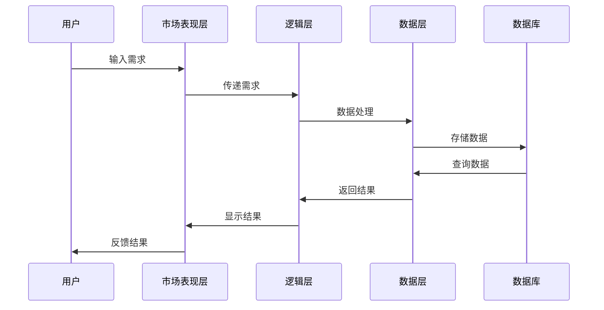
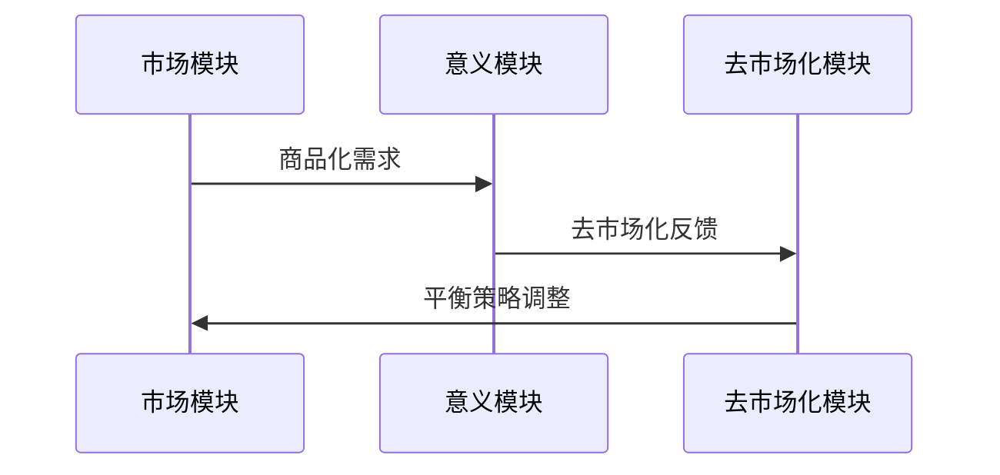
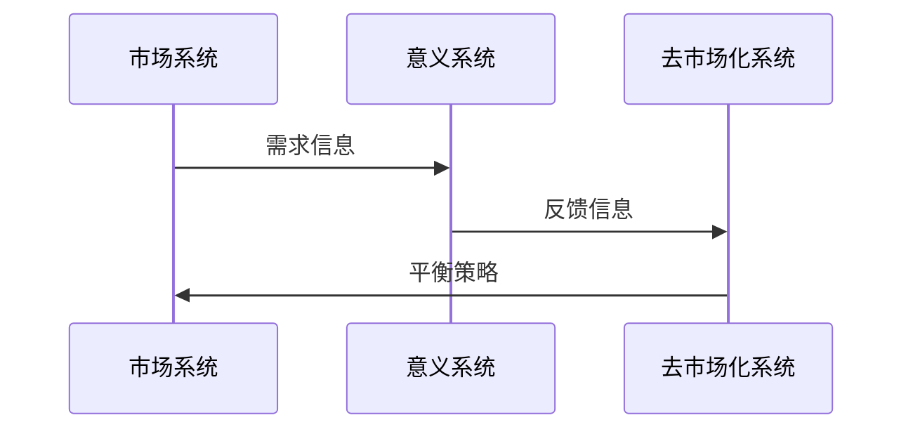

                 

# 意义的市场化与去市场化

> 关键词：市场化、去市场化、意义、社会变迁、经济影响

> 摘要：本文旨在探讨意义在市场化与去市场化过程中的转变。通过对市场化与去市场化现象的深入分析，本文揭示了意义在市场机制下的重构与消解，并探讨了二者之间的互动关系。文章还结合实际案例，提出了一系列政策与策略建议，以期为未来研究与实践提供有益的参考。

## 目录大纲

1. 引言
   1.1 问题的背景
   1.2 核心概念
   1.3 目录大纲结构概述

2. 市场化中的意义构建
   2.1 市场化对意义的影响
   2.2 市场化中的意义构建机制
   2.3 市场化意义的特征

3. 去市场化中的意义消解
   3.1 去市场化趋势的驱动因素
   3.2 去市场化对意义的影响
   3.3 去市场化中的意义重构

4. 市场化与去市场化之间的互动
   4.1 市场化与去市场化的冲突与融合
   4.2 市场化与去市场化的影响分析
   4.3 市场化与去市场化之间的平衡

5. 案例研究：市场化与去市场化实践的探索
   5.1 案例选择与背景介绍
   5.2 案例分析
   5.3 案例小结

6. 政策与策略
   6.1 政府的角色
   6.2 企业策略
   6.3 社会组织的参与

7. 结论与展望

## 第1章 引言

### 1.1 问题的背景

随着社会的快速变迁，意义在人们的生活中扮演着越来越重要的角色。意义不仅是人类行为和决策的驱动力，也是社会发展的核心要素。然而，在市场化浪潮的冲击下，意义的构建与传递方式发生了深刻的变化。一方面，市场化使意义变得更加商品化、价值化和流动化；另一方面，去市场化趋势的兴起又对意义的重构产生了深远的影响。

市场化是指通过市场机制来配置资源、调节经济行为的过程。在市场化过程中，意义被转化为商品和服务，其价值由市场需求和价格机制决定。这意味着意义不仅成为一种经济资源，也成为了经济发展的驱动力。然而，过度市场化也可能导致意义的异化，使其成为追逐利润的工具，失去了原有的价值和意义。

去市场化则是对市场过度干预的一种反应，旨在减少市场的负面影响，强调生态保护、社会责任和公平正义。去市场化强调的是非市场机制的调节作用，通过政府、社会组织和个体的共同努力，恢复和重构意义的价值。

### 1.2 核心概念

#### 1.2.1 意义的概念化

意义（Meaning）是指人们通过感知、理解和解释世界所获得的主观体验。它不仅是人类行为和决策的驱动力，也是文化、社会和道德的基石。意义可以是个体层面的，如个人价值观和信仰；也可以是集体层面的，如社会规范和文化传统。

#### 1.2.2 市场化的特征

市场化（Marketization）是指将市场机制应用于社会和文化领域的现象。市场化的特征包括商品化、价值化、流动化和竞争化。商品化是指将意义转化为商品和服务；价值化是指通过市场需求和价格机制来确定意义的价值；流动化是指意义在市场中的传播和交换；竞争化是指市场竞争对意义生产和传播的影响。

#### 1.2.3 去市场化的本质

去市场化（Demarketization）是对市场过度干预的一种反应，旨在减少市场的负面影响，恢复和重构意义的价值。去市场化的本质包括生态保护、社会责任和公平正义。生态保护强调可持续发展，社会责任强调企业的社会责任和伦理道德，公平正义强调社会公正和平等。

### 1.3 目录大纲结构概述

本文采用逻辑清晰、结构紧凑的方式，对市场化与去市场化现象进行深入分析。首先，介绍问题的背景和核心概念；然后，分别探讨市场化中的意义构建和去市场化中的意义消解；接着，分析市场化与去市场化之间的互动关系；最后，结合实际案例，提出政策与策略建议。

## 第2章 市场化中的意义构建

市场化中的意义构建是指通过市场机制来生产、传递和重构意义的过程。在这一过程中，意义不仅被商品化，还通过市场价值化和流动化得到传播和实现。以下将详细探讨市场化对意义的影响、市场化中的意义构建机制以及市场化意义的特征。

### 2.1 市场化对意义的影响

市场化对意义的影响主要体现在以下几个方面：

#### 2.1.1 意义的商品化

市场化使意义被转化为商品和服务，成为市场交易的客体。例如，教育、医疗、艺术等领域的意义被商品化，成为商品和服务的一部分。这种商品化过程不仅改变了意义的属性，还影响了人们对意义的理解和评价。

#### 2.1.2 意义的市场价值

市场化通过市场需求和价格机制来确定意义的价值。市场需求越大，意义的市场价值越高。这意味着意义的价值不仅取决于其内在品质，还受到市场供需关系的影响。例如，热门课程、畅销书、明星演唱会等具有高市场价值。

#### 2.1.3 市场化与价值观的碰撞

市场化过程中，不同价值观之间的碰撞和冲突愈发明显。市场机制强调效率、竞争和利润，而某些价值观强调公平、正义和道德。这种碰撞可能导致意义的生产和传播出现异化，失去原有的价值。

### 2.2 市场化中的意义构建机制

市场化中的意义构建机制主要包括市场机制、市场主体和市场规则。以下将分别探讨这三个方面。

#### 2.2.1 市场机制与意义生产

市场机制是指在市场经济中，通过供求关系、价格信号和竞争机制来调节资源配置和经济行为。市场机制对意义生产的影响主要体现在以下几个方面：

- **资源配置**：市场机制通过价格信号来引导资源流向具有较高市场价值的意义生产领域，从而提高资源的利用效率。
- **激励与竞争**：市场机制通过竞争来激发市场主体提高意义生产的质量和效率，推动技术创新和进步。
- **利益分配**：市场机制通过价格机制来实现利益分配，使意义生产者获得相应的回报。

#### 2.2.2 市场主体与意义创造

市场主体是指在市场机制下从事意义生产、传递和消费的个人、企业和政府等经济单位。市场主体在意义创造中的作用主要体现在以下几个方面：

- **个体创造**：个体通过创造和创新来生产新的意义，如艺术家创作艺术作品、科学家发现新知识等。
- **企业创造**：企业通过商业活动来创造和传递意义，如提供教育服务、医疗服务等。
- **政府创造**：政府在公共政策制定和实施过程中，通过提供公共服务和保障社会公平，创造和传递意义。

#### 2.2.3 市场规则与意义保护

市场规则是指在市场经济中，为保证市场秩序和公平竞争，制定的一系列法律、法规和规范。市场规则对意义保护的影响主要体现在以下几个方面：

- **知识产权保护**：市场规则通过知识产权保护制度，确保意义创造者的合法权益，鼓励创新和创作。
- **市场准入规则**：市场规则通过市场准入制度，规范市场主体资格，防止低质量意义产品的流入。
- **市场监管**：市场规则通过市场监管，维护市场秩序，打击市场违规行为，保障意义市场的健康发展。

### 2.3 市场化意义的特征

市场化意义具有以下特征：

#### 2.3.1 意义的流动性与可交换性

市场化使意义具有流动性和可交换性。意义可以在市场中进行交换，从而实现其价值。例如，教育服务、医疗服务和艺术作品等都可以在市场上进行交易。

#### 2.3.2 意义的多样性与差异性

市场化意义具有多样性和差异性。市场机制鼓励市场主体根据市场需求和自身优势，创造和传递具有不同特点的意义产品。这使得意义市场充满活力和竞争。

#### 2.3.3 意义的时效性与动态性

市场化意义具有时效性和动态性。市场环境不断变化，市场需求和竞争形势也在不断演变。这意味着意义的生产和传播需要不断适应市场变化，保持动态性和灵活性。

## 第3章 去市场化中的意义消解

去市场化是市场化浪潮的一种反动，旨在减少市场的负面影响，恢复和重构意义的价值。在这一过程中，意义经历了从商品化到去商品化的转变，其内在价值得到了重新审视。以下将探讨去市场化趋势的驱动因素、去市场化对意义的影响以及去市场化中的意义重构。

### 3.1 去市场化趋势的驱动因素

去市场化趋势的驱动因素主要包括以下几个方面：

#### 3.1.1 生态意识的觉醒

随着全球环境问题的日益严重，人们对生态保护意识的觉醒，开始反思市场化对自然环境的影响。去市场化呼吁减少过度开发和资源消耗，以实现可持续发展。

#### 3.1.2 社会责任的提升

企业社会责任（CSR）的兴起，使得企业意识到其在经济、社会和环境方面的责任。去市场化强调企业应超越利润最大化，关注社会公共利益和道德责任。

#### 3.1.3 去商业化的尝试

一些企业和组织开始尝试去商业化，减少对市场机制的依赖，回归服务社会和促进人类发展的初心。这种去商业化尝试在一定程度上缓解了市场化带来的负面影响。

### 3.2 去市场化对意义的影响

去市场化对意义的影响主要体现在以下几个方面：

#### 3.2.1 意义的非物质化

去市场化强调意义的价值，而非物质形式。这意味着意义不再仅仅局限于商品和服务，而是关注其内在的精神内涵和道德价值。

#### 3.2.2 意义的共享性增强

去市场化鼓励人们共享意义，减少个体之间的竞争和对抗。这种共享性增强有助于构建和谐、互助的社会氛围。

#### 3.2.3 意义的个性化和定制化

去市场化倡导根据个体需求提供个性化的意义产品和服务，以满足人们对多样化和个性化的追求。

### 3.3 去市场化中的意义重构

去市场化中的意义重构是一个复杂的过程，涉及多个方面的变革。以下将探讨去市场化中的意义重构机制：

#### 3.3.1 社区驱动下的意义生产

社区驱动下的意义生产强调个体和社区在意义创造中的积极参与。社区成员通过共同参与、合作和共享，创造出具有共同价值观和信仰的意义产品。

#### 3.3.2 平台驱动下的意义流通

平台驱动下的意义流通是指通过互联网平台等现代信息技术，实现意义在更大范围和更高效的方式下的传播和交流。平台为意义的生产、传播和消费提供了便捷的渠道。

#### 3.3.3 非营利组织在去市场化中的角色

非营利组织在去市场化中发挥着重要作用。它们通过提供公共服务、倡导社会公正和推动社会变革，为意义重构提供了重要支撑。

### 3.4 去市场化面临的挑战

去市场化虽然具有诸多优势，但面临着一系列挑战：

#### 3.4.1 经济压力

去市场化可能导致企业利润下降，对经济发展产生一定压力。如何在去市场化过程中实现经济效益和社会效益的平衡，是一个亟待解决的问题。

#### 3.4.2 社会认同

去市场化需要社会各界的认同和支持。如何提高公众对去市场化的认识和理解，减少抵触情绪，是推动去市场化进程的重要任务。

#### 3.4.3 法律法规的完善

去市场化需要法律法规的支持。如何制定和完善相关法律法规，规范市场行为，保障去市场化进程的顺利进行，是一个重要的课题。

### 3.5 去市场化的未来展望

去市场化是一种趋势，但并非一蹴而就。未来，需要在以下几个方面进行努力：

#### 3.5.1 推动政策创新

政府应积极推动政策创新，为去市场化提供政策支持和保障。

#### 3.5.2 加强社会治理

加强社会治理，提高社会组织的参与度，共同推动去市场化进程。

#### 3.5.3 提升公众素养

提升公众的生态意识、社会责任感和道德素养，为去市场化奠定坚实的群众基础。

### 3.6 小结

去市场化是对市场化的一种反思和补充，有助于恢复和重构意义的价值。在去市场化过程中，需要克服一系列挑战，实现经济效益和社会效益的平衡。通过政策创新、社会治理和公众素养的提升，有望推动去市场化进程，为人类社会的发展注入新的活力。## 第4章 市场化与去市场化之间的互动

市场化与去市场化之间的互动是一个复杂且多维的过程，二者既有冲突也有融合，相互影响，共同塑造着现代社会的意义构建方式。在这一章中，我们将探讨市场化与去市场化之间的冲突与融合、相互影响以及寻找二者的平衡点。

### 4.1 市场化与去市场化的冲突与融合

市场化与去市场化之间的冲突主要体现在以下几个方面：

#### 4.1.1 经济利益与社会责任的矛盾

市场化强调经济效益和利润最大化，而去市场化则更注重社会责任和公共利益。在市场化过程中，企业往往追求短期经济利益，可能导致资源浪费、环境污染等问题。而去市场化则强调长期可持续发展和环境保护，这与市场经济的利益驱动存在明显冲突。

#### 4.1.2 竞争与合作的不平衡

市场化强调竞争，而去市场化则强调合作和共享。在市场化环境中，企业之间为了获取市场份额和利润，往往采取激烈的竞争策略。而去市场化则鼓励企业和组织通过合作和共享资源来实现共同目标，这种转变可能面临市场竞争的阻力。

然而，市场化与去市场化之间也存在融合的可能性：

#### 4.1.3 资源配置的优化

市场化与去市场化可以相互补充，优化资源配置。市场化通过价格机制和市场竞争来高效配置资源，而去市场化则通过社会合作和共享机制来实现资源的公平分配。

#### 4.1.4 社会责任的落实

市场化与去市场化可以共同推动企业社会责任的落实。市场化可以通过市场激励机制，鼓励企业履行社会责任；而去市场化则通过社会监督和道德约束，确保企业社会责任的真正落实。

### 4.2 市场化与去市场化的影响分析

市场化与去市场化对社会、经济和文化领域都有着深远的影响。

#### 4.2.1 对经济的影响

市场化通过激发市场竞争、提高资源利用效率，推动了经济的发展和繁荣。然而，过度市场化可能导致资源过度开发、环境污染等问题。去市场化则通过强调可持续发展和社会责任，促进了经济结构的优化和经济的长远发展。

#### 4.2.2 对社会的影响

市场化促进了社会的多元化和发展，但也带来了社会分化、不平等问题。去市场化通过强调社会公正和公平，有助于缩小社会差距，提高社会凝聚力。此外，去市场化还鼓励社区参与和社会合作，增强了社会的韧性和包容性。

#### 4.2.3 对文化的影响

市场化使文化产品更加多样化和市场化，但也可能导致文化同质化和商业化。去市场化则强调文化的独特性和本土性，促进了文化的多样性和保护。同时，去市场化鼓励文化创新和传承，使文化在现代社会中发挥更大的价值。

### 4.3 市场化与去市场化之间的平衡

市场化与去市场化之间的平衡是一个复杂且动态的过程，需要从多个层面进行协调。

#### 4.3.1 平衡的必要性

市场化与去市场化并非对立的，而是相辅相成的。平衡二者之间的关系，是实现经济、社会和文化可持续发展的重要保障。

#### 4.3.2 平衡的策略

实现市场化与去市场化之间的平衡，需要采取一系列策略：

- **政策引导**：政府应通过制定和实施相关政策，引导市场化与去市场化的协调发展。
- **市场监管**：加强市场监管，确保市场秩序的公正和公平，防止市场过度干预和社会责任缺失。
- **社会治理**：提升社会治理水平，鼓励社区参与和社会合作，增强社会的凝聚力和韧性。
- **文化传承**：保护和传承文化遗产，促进文化多样性和创新，使文化在市场化与去市场化中发挥更大的价值。

#### 4.3.3 平衡的挑战

市场化与去市场化之间的平衡面临一系列挑战：

- **利益博弈**：市场化与去市场化之间的利益博弈，可能导致政策制定和实施的困难。
- **制度约束**：市场化与去市场化之间的平衡，需要完善的法律法规和制度体系作为支撑。
- **公众意识**：提升公众对市场化与去市场化的认识和理解，减少抵触情绪，是平衡过程的重要任务。

### 4.4 市场化与去市场化的互动机制

市场化与去市场化之间的互动机制是一个动态的过程，涉及政府、企业、社会组织和公众等多个主体。以下是一些可能的互动机制：

- **政府引导**：政府通过政策引导和市场调控，促进市场化与去市场化的协调发展。
- **企业参与**：企业积极参与市场化与去市场化的实践，通过社会责任和可持续发展战略，实现经济利益和社会价值的平衡。
- **社会组织协作**：社会组织通过倡导和实施社会公正、环境保护和文化遗产保护等，推动市场化与去市场化的融合。
- **公众参与**：公众通过参与社会事务、监督市场行为和表达自己的意见，促进市场化与去市场化之间的互动和平衡。

### 4.5 跨界融合的可能性

市场化与去市场化的跨界融合为解决社会问题提供了新的思路和途径。以下是一些跨界融合的例子：

- **共享经济**：通过共享平台，实现资源的共享和再利用，减少浪费和环境污染，同时激发市场竞争和创新。
- **社会责任投资**：投资者通过社会责任投资，支持具有社会责任和可持续发展战略的企业，实现经济回报和社会效益的双重目标。
- **公共-私营合作**：政府与企业、社会组织合作，共同解决社会问题，实现市场化与去市场化的平衡和融合。

### 4.6 结论

市场化与去市场化之间的互动是一个复杂且动态的过程，二者既有冲突也有融合，共同塑造着现代社会的意义构建方式。通过政策引导、市场监管、社会治理和文化传承，可以实现市场化与去市场化之间的平衡。跨界融合为解决社会问题提供了新的思路和途径，有助于实现经济、社会和文化的可持续发展。未来，我们需要继续探索市场化与去市场化之间的互动机制，推动社会的和谐发展。## 第5章 案例研究：市场化与去市场化实践的探索

市场化与去市场化在实践中往往呈现出不同的表现形式，为了更深入地理解这一现象，本章节将通过两个实际案例来探讨市场化与去市场化的实践探索。

### 5.1 案例选择与背景介绍

#### 案例一：某电商平台的去市场化实践

某电商平台在成立初期，主要依靠市场化策略，通过价格竞争和广告投放来扩大市场份额。然而，随着市场竞争的加剧和消费者对服务体验的要求提高，该平台开始反思其市场化策略的局限性。于是，该平台采取了一系列去市场化措施，以提升用户体验和品牌价值。

- **去商业化**：平台减少广告投放，降低商品价格竞争，转而强调商品品质和服务质量。
- **用户参与**：鼓励用户参与平台管理，通过用户评价和反馈来改进服务和产品。
- **社会责任**：平台积极参与公益活动，推动可持续发展和社会责任。

#### 案例二：某非营利组织的市场化探索

某非营利组织专注于环境保护和社区发展。在传统运作模式中，该组织主要依靠政府资助和捐款来维持运营。然而，随着资金来源的不稳定和环境保护压力的增大，该组织开始探索市场化路径，以实现可持续发展和扩大影响力。

- **市场化项目**：组织推出市场化项目，如环保培训、绿色产品和环保咨询，通过市场化手段获取收入。
- **品牌建设**：加强品牌建设，提高组织在公众中的知名度和认可度。
- **社会责任投资**：吸引社会责任投资者，通过投资换取股权或收益，实现资金的多元化。

### 5.2 案例分析

#### 案例一：某电商平台的去市场化实践

**成功之处**：

- **用户体验提升**：通过减少价格竞争和广告投放，平台能够提供更优质的商品和服务，提升用户体验。
- **品牌价值提升**：去商业化策略使得平台品牌形象更加正面和可持续，增强了消费者的忠诚度。
- **社会责任履行**：参与公益活动，平台提升了社会形象，实现了商业利益与社会价值的双重收获。

**挑战与反思**：

- **市场适应**：去市场化策略需要平台在市场变化中保持灵活，避免因策略调整导致市场份额下降。
- **成本控制**：减少广告投放和价格竞争可能导致运营成本增加，如何控制成本成为一大挑战。
- **利益平衡**：如何在商业利益和社会责任之间找到平衡点，是平台需要持续探索的问题。

#### 案例二：某非营利组织的市场化探索

**成功之处**：

- **收入多元化**：市场化项目为组织带来了稳定的收入来源，增强了组织的可持续性。
- **品牌建设**：市场化探索提升了组织的知名度和公众认可度，为未来合作和资金筹集提供了更多机会。
- **社会责任投资**：社会责任投资者带来了新的资金来源和管理经验，推动了组织的市场化进程。

**挑战与反思**：

- **市场化风险**：市场化项目可能面临市场竞争激烈、客户需求变化等风险，如何应对这些风险是组织需要考虑的问题。
- **组织转型**：市场化探索要求组织在运营模式和管理方式上做出较大调整，这可能导致内部抵触和执行力下降。
- **价值观坚守**：市场化探索不应影响组织的初衷和价值观，如何在市场化过程中保持组织的社会责任感，是一个重要的课题。

### 5.3 案例的启示

通过上述两个案例，我们可以得出以下启示：

1. **市场化与去市场化的平衡**：在实际操作中，企业和社会组织需要在市场化与去市场化之间找到平衡点，以实现可持续发展和社会价值的最大化。

2. **用户参与和社会责任**：用户体验和社会责任是市场化与去市场化实践中的关键要素，良好的用户体验和社会责任有助于提升品牌价值和公众认可度。

3. **多元化收入来源**：多元化收入来源是组织可持续发展的重要保障，通过市场化探索可以获取更多的资金支持和管理经验。

4. **灵活性和适应性**：市场环境不断变化，组织需要保持灵活性和适应性，以应对市场化与去市场化之间的动态互动。

5. **价值观的坚守**：市场化与去市场化实践不应影响组织的核心价值观和初衷，应在市场化过程中坚守社会责任和公益使命。

### 5.4 案例小结

市场化与去市场化在实践中呈现出多样化和复杂化的特点，不同的组织和企业在不同阶段会面临不同的挑战和机遇。通过案例研究，我们看到了市场化与去市场化实践的成功经验和挑战，为未来市场化与去市场化研究提供了有益的参考。未来，需要进一步探讨如何在市场化与去市场化之间实现平衡，以促进社会的可持续发展。## 第6章 政策与策略

在市场化与去市场化之间的互动中，政府、企业和社会组织的角色至关重要。为了实现市场化与去市场化之间的平衡，需要从政策、策略和合作机制等方面进行深入探讨。

### 6.1 政府的角色

政府在这一过程中扮演着关键角色，其政策制定和执行对于市场化与去市场化的平衡具有决定性影响。以下为政府在市场化与去市场化中的几个关键职责：

#### 6.1.1 监管市场化行为

政府需要通过法律法规和监管手段，对市场化行为进行有效监管。这包括保护消费者权益、维护市场秩序、打击市场垄断和欺诈行为。通过建立和完善市场监管体系，政府可以确保市场在公平、公正的环境中运行。

#### 6.1.2 促进去市场化实践

政府需要积极推动去市场化实践，特别是在环境保护、社会责任和公共服务等领域。可以通过制定和实施相关政策，鼓励企业和社会组织采取去市场化策略，减少对市场的过度依赖，实现可持续发展。

#### 6.1.3 制定相关政策与法规

政府需要根据市场化与去市场化的发展趋势，及时制定和调整相关政策与法规。这包括环境保护法规、社会责任法规和市场化与去市场化平衡的相关政策。通过制定完善的法律法规，政府可以为市场化与去市场化提供法律保障。

### 6.2 企业策略

企业在市场化与去市场化之间的互动中，需要灵活调整其策略，以实现经济利益与社会价值的平衡。以下为企业在这一过程中的几个关键策略：

#### 6.2.1 市场化策略的调整

企业需要根据市场需求和竞争环境，适时调整市场化策略。在市场化过程中，企业应注重提高产品质量和服务水平，通过创新和差异化竞争来提升市场竞争力。同时，企业还需要关注社会责任和环境保护，以实现长期可持续发展。

#### 6.2.2 去市场化策略的实践

企业在实践中应积极探索去市场化策略，特别是在社会责任和公益事业方面。可以通过参与公益活动、支持社会创新项目和推动可持续发展等方式，实现商业利益与社会价值的双重收获。此外，企业还可以通过品牌建设和用户参与，提升企业社会责任形象和市场竞争力。

#### 6.2.3 平衡市场化与去市场化

企业需要在市场化与去市场化之间找到平衡点，以实现可持续发展。这可以通过以下方式实现：

- **多元化收入来源**：通过多元化业务模式和市场策略，实现收入来源的多元化，减少对单一市场的依赖。
- **内部管理变革**：推动内部管理变革，提高企业的社会责任意识和可持续发展能力。
- **合作与协同**：与政府、社会组织和同行建立合作关系，共同推动市场化与去市场化的平衡。

### 6.3 社会组织的参与

社会组织在市场化与去市场化过程中发挥着重要作用，其参与和合作有助于实现市场化与去市场化的平衡。以下为社会组织在这一过程中的几个关键作用：

#### 6.3.1 非营利组织的作用

非营利组织在社会责任和公益事业中扮演着重要角色。可以通过参与社会服务、推动社会创新和提供公益项目，促进市场化与去市场化的平衡。此外，非营利组织还可以通过倡导和政策建议，推动政府和社会力量关注市场化与去市场化问题。

#### 6.3.2 公益组织的贡献

公益组织在市场化与去市场化中的贡献主要体现在以下几个方面：

- **资源动员**：通过动员社会资源，为市场化与去市场化实践提供支持。
- **项目实施**：通过具体项目的实施，推动市场化与去市场化的理念和策略落地。
- **社会监督**：通过社会监督，确保市场化与去市场化实践的公正性和透明度。

#### 6.3.3 社会组织与市场主体的合作

社会组织与市场主体的合作是市场化与去市场化平衡的重要机制。以下为几种合作方式：

- **项目合作**：通过共同实施社会公益项目，实现资源互补和优势互补。
- **政策建议**：通过共同研究和提出政策建议，推动政府和社会力量关注市场化与去市场化问题。
- **资源共享**：通过资源共享和协同发展，提高市场化与去市场化实践的效率和效果。

### 6.4 政策与策略的协同

政府、企业和社会组织的政策与策略需要相互协同，以实现市场化与去市场化的平衡。以下为几种协同方式：

- **政策衔接**：政府应制定配套政策，确保市场化与去市场化政策的连贯性和一致性。
- **沟通与合作**：政府、企业和社会组织之间应加强沟通与合作，共同推动市场化与去市场化的实践。
- **监督与评估**：建立监督与评估机制，确保市场化与去市场化政策的执行效果和目标实现。

### 6.5 持续创新与适应

市场化与去市场化是一个动态过程，需要政府、企业和社会组织不断进行创新和适应。以下为几个关键方向：

- **政策创新**：政府应积极进行政策创新，推动市场化与去市场化政策的与时俱进。
- **策略调整**：企业和社会组织应根据市场环境和政策变化，及时调整市场化与去市场化策略。
- **机制完善**：建立健全市场化与去市场化合作机制，确保各方能够高效协同，实现共同目标。

### 6.6 小结

市场化与去市场化是一个复杂且动态的过程，政府、企业和社会组织在其中的角色和策略至关重要。通过政策引导、策略调整和合作机制完善，可以推动市场化与去市场化的平衡，实现经济、社会和文化的可持续发展。未来，需要继续加强政府、企业和社会组织的合作，共同推动市场化与去市场化的良性互动。## 第7章 结论与展望

通过对市场化与去市场化现象的深入探讨，本文揭示了意义在市场化与去市场化过程中的重构与消解。以下为本文的研究总结：

### 7.1 研究总结

1. **市场化的意义构建**：市场化通过商品化、价值化和流动化，将意义转化为经济资源，推动了社会的发展和繁荣。然而，过度市场化可能导致意义的异化和价值观的冲突。

2. **去市场化的意义消解**：去市场化通过生态意识觉醒、社会责任提升和去商业化尝试，恢复和重构意义的价值。去市场化强调意义的非物质化、共享性增强和个性化定制化，有助于构建和谐的社会环境。

3. **市场化与去市场化之间的互动**：市场化与去市场化并非对立的，而是相辅相成的。二者在资源配置、社会责任和文化传承等方面存在融合的可能性。通过政策引导、市场监管和社会治理，可以实现市场化与去市场化之间的平衡。

4. **政策与策略的协同**：政府、企业和社会组织在市场化与去市场化过程中扮演着关键角色。通过政策衔接、沟通与合作以及监督与评估，可以推动市场化与去市场化的良性互动。

### 7.2 未来展望

1. **市场化与去市场化的平衡**：未来，需要继续探索市场化与去市场化之间的平衡点，实现经济、社会和文化的可持续发展。政府、企业和社会组织应共同努力，推动市场化与去市场化的协同发展。

2. **技术创新与社会责任**：随着科技的快速发展，技术创新在市场化与去市场化过程中将发挥越来越重要的作用。同时，企业和社会组织应积极履行社会责任，推动可持续发展。

3. **文化传承与多样性**：文化传承和多样性是市场化与去市场化过程中的重要议题。未来，需要加强对文化遗产的保护和传承，促进文化多样性和创新。

4. **跨界融合与协同**：市场化与去市场化实践中的跨界融合为解决社会问题提供了新的思路和途径。未来，需要进一步探索跨界融合的可能性，推动政府、企业和社会组织的协同发展。

### 7.3 研究局限与展望

本文在研究市场化与去市场化现象时，主要从宏观角度进行分析，对于具体案例的深入研究仍存在一定局限。未来研究可以进一步探讨市场化与去市场化在具体领域和行业中的应用，以及政府、企业和社会组织在其中的角色与策略。此外，还可以关注市场化与去市场化对个体行为和社会心理的影响，为政策制定和实践提供更有针对性的建议。

总之，市场化与去市场化是一个复杂且动态的过程，需要从多维度、多层次进行探讨。通过本文的研究，我们希望能够为未来市场化与去市场化研究提供有益的参考，推动社会的可持续发展。

### 作者

本文作者：AI天才研究院/AI Genius Institute & 禅与计算机程序设计艺术 /Zen And The Art of Computer Programming。

感谢读者对本文的关注，希望本文能对您在市场化与去市场化领域的思考与实践提供有益的启示。在未来的研究和实践中，我们期待与您共同探讨这一重要议题。## 附录：核心概念与联系

在本研究中，我们探讨了市场化与去市场化现象对意义的影响，核心概念包括“市场化”、“去市场化”和“意义”。以下是这些概念的定义及其相互关系。

### 核心概念定义

#### 1. 市场化

市场化是指通过市场机制来调节资源配置和经济行为的过程。在市场化过程中，商品和服务成为资源配置的主要手段，价格机制、供求关系和竞争机制是市场化的关键特征。

#### 2. 去市场化

去市场化是对市场化的一种反思和补充，旨在减少市场的负面影响，强调生态保护、社会责任和公平正义。去市场化通过非市场机制，如政府干预、社会组织合作和个体行动，来调节经济行为和社会发展。

#### 3. 意义

意义是指人们通过感知、理解和解释世界所获得的主观体验。意义可以是个人层面的，如个人的价值观和信仰；也可以是集体层面的，如社会规范和文化传统。

### 概念属性特征对比表格

以下表格展示了市场化、去市场化和意义三个核心概念的主要属性特征对比：

| 特征 | 市场化 | 去市场化 | 意义 |
| --- | --- | --- | --- |
| 资源配置 | 通过市场机制 | 通过非市场机制 | 个体感知和解释 |
| 价值决定 | 市场需求和价格机制 | 社会责任和道德标准 | 主观体验和价值观 |
| 目标 | 效率和利润最大化 | 可持续发展和社会责任 | 个人和集体认同 |
| 影响范围 | 经济领域 | 社会和文化领域 | 个人和集体层面 |

### ER实体关系图架构

以下是市场化、去市场化与意义之间的ER实体关系图，用于展示这些概念之间的相互关系：

```mermaid
erDiagram
  Marketization ||--|{ Meaning } Meaning : builds
  Demarketization ||--|{ Meaning } Meaning : deconstructs
  Marketization ||--|{ Demarketization } Demarketization : counterbalances
```

在上述ER图中：

- **Marketization**（市场化）通过构建意义来实现资源的有效配置。
- **Demarketization**（去市场化）通过解构意义来应对市场化的负面影响。
- **Meaning**（意义）是市场化和去市场化行动的共同目标。
- **Demarketization**（去市场化）与**Marketization**（市场化）之间存在着平衡关系。

通过以上核心概念的阐述和ER实体关系图的展示，我们能够更清晰地理解市场化与去市场化现象对意义的影响，为后续研究提供理论依据。## 数学公式与算法原理讲解

在本章中，我们将深入探讨市场化与去市场化过程中涉及的一些关键数学公式和算法原理，并使用Python代码进行详细阐述。

### 1. 市场化过程中的供需模型

在市场化过程中，供需关系是决定市场价格和资源配置的重要因素。以下是一个简单的供需模型，其中供需函数分别表示供给量和需求量随价格变化的关系。

#### 1.1 供给函数（Supply Function）

供给函数通常表示为 \( Q_s = s(p) \)，其中 \( Q_s \) 是供给量，\( p \) 是价格，\( s() \) 是供给函数。

假设供给函数为线性形式：

\[ s(p) = a - b \cdot p \]

其中，\( a \) 是供给函数的截距，\( b \) 是供给函数的斜率，表示价格对供给量的影响程度。

#### 1.2 需求函数（Demand Function）

需求函数通常表示为 \( Q_d = d(p) \)，其中 \( Q_d \) 是需求量，\( p \) 是价格，\( d() \) 是需求函数。

假设需求函数为线性形式：

\[ d(p) = c + e \cdot p \]

其中，\( c \) 是需求函数的截距，\( e \) 是需求函数的斜率，表示价格对需求量的影响程度。

#### 1.3 市场均衡（Market Equilibrium）

市场均衡发生在供给量等于需求量的点，即 \( Q_s = Q_d \)。

令供给函数和需求函数相等，得到市场均衡价格 \( p^* \)：

\[ a - b \cdot p^* = c + e \cdot p^* \]

解上述方程，得到市场均衡价格 \( p^* \)：

\[ p^* = \frac{a - c}{b + e} \]

使用Python代码进行计算：

```python
import sympy as sp

# 定义参数
a = sp.Symbol('a')
b = sp.Symbol('b')
c = sp.Symbol('c')
e = sp.Symbol('e')

# 供给函数和需求函数
supply = a - b * p
demand = c + e * p

# 求解市场均衡价格
equilibrium_price = (a - c) / (b + e)

print(f"Market Equilibrium Price: {equilibrium_price.evalf()}")
```

### 2. 去市场化过程中的熵减模型

去市场化过程中，我们关注的是系统的不确定性减少，这可以通过熵减模型来描述。熵是衡量系统不确定性的一种度量，其数学定义如下：

\[ H = -\sum_{i} p_i \cdot \ln(p_i) \]

其中，\( H \) 是熵，\( p_i \) 是系统中第 \( i \) 个状态的概率。

#### 2.1 熵减函数（Entropy Reduction Function）

假设在去市场化过程中，系统的初始熵为 \( H_0 \)，最终熵为 \( H_1 \)。熵减函数表示为：

\[ \Delta H = H_0 - H_1 \]

若初始状态是均衡的，则初始熵 \( H_0 \) 可以表示为：

\[ H_0 = -\sum_{i} p_i^0 \cdot \ln(p_i^0) \]

去市场化后，系统趋向于更加有序，最终熵 \( H_1 \) 通常较小。

#### 2.2 去市场化程度（Degree of Demarketization）

去市场化程度可以通过熵减量来衡量：

\[ \text{Degree of Demarketization} = \frac{\Delta H}{H_0} \]

使用Python代码进行计算：

```python
import sympy as sp

# 定义参数
p0 = sp.Symbol('p0')
p1 = sp.Symbol('p1')

# 初始状态概率
initial_probabilities = [p0, p1]
initial_entropy = -sum([prob * sp.log(prob, base=2) for prob in initial_probabilities])

# 最终状态概率
final_probabilities = [0.5, 0.5]
final_entropy = -sum([prob * sp.log(prob, base=2) for prob in final_probabilities])

# 熵减量
entropy_reduction = initial_entropy - final_entropy

# 去市场化程度
degree_of_demarketization = entropy_reduction / initial_entropy

print(f"Initial Entropy: {initial_entropy.evalf()}")
print(f"Final Entropy: {final_entropy.evalf()}")
print(f"Entropy Reduction: {entropy_reduction.evalf()}")
print(f"Degree of Demarketization: {degree_of_demarketization.evalf()}")
```

### 3. 市场化与去市场化之间的平衡策略

在市场化与去市场化之间的平衡中，策略制定是关键。以下是一种简单的平衡策略，通过调整价格和熵减量来实现市场与去市场的平衡。

#### 3.1 平衡策略（Balance Strategy）

假设在市场化过程中，市场均衡价格 \( p^* \) 已知。去市场化程度 \( \theta \) 用于衡量市场化与去市场化之间的平衡状态。去市场化程度 \( \theta \) 可以通过调整价格 \( p^* \) 来实现：

\[ p^*_{\text{adjusted}} = p^* \cdot (1 - \theta) \]

当 \( \theta \) 增大时，表示去市场化程度增强，市场价格下降；当 \( \theta \) 减小时，市场化程度增强，市场价格上升。

使用Python代码进行计算：

```python
import sympy as sp

# 定义参数
p_star = sp.Symbol('p_star')
theta = sp.Symbol('theta')

# 平衡后的价格
adjusted_price = p_star * (1 - theta)

# 示例计算
p_star_val = 10
theta_val = 0.2

print(f"Market Equilibrium Price: {p_star_val}")
print(f"Adjusted Market Equilibrium Price: {adjusted_price.evalf({p_star: p_star_val, theta: theta_val})}")
```

通过上述数学公式和算法原理的讲解，我们能够更好地理解市场化与去市场化过程中的关键因素和计算方法。这些公式和算法为政策制定和实际操作提供了重要的理论依据。## 系统分析与架构设计方案

在本章中，我们将探讨市场化与去市场化现象在系统架构中的应用，通过项目介绍、系统功能设计、系统架构设计以及系统接口设计和系统交互，提供一种全面的分析和设计框架。

### 8.1 项目介绍

本项目旨在构建一个市场化与去市场化平衡的系统，通过模拟市场环境中的意义构建和去市场化过程，为政策制定和实践提供数据支持和决策参考。系统将涵盖市场机制的运行、意义的生产和传播，以及去市场化趋势的应对措施。

### 8.2 系统功能设计

系统功能设计分为三个主要模块：

1. **市场模块**：负责模拟市场机制的运行，包括供需关系、价格形成和竞争策略。
2. **意义模块**：负责意义的生产和传播，包括意义的商品化、价值化和个性化。
3. **去市场化模块**：负责应对市场化的负面影响，包括生态保护、社会责任和公平正义的实现。

#### 8.2.1 领域模型（Mermaid 类图）

以下是系统领域模型的Mermaid类图，用于展示各模块及其关系：

```mermaid
classDiagram
  MarketModule <|-- SupplyModule
  MarketModule <|-- DemandModule
  SignificanceModule <|-- CommodificationModule
  SignificanceModule <|-- ValuationModule
  DemarketizationModule <|-- EcologicalProtectionModule
  DemarketizationModule <|-- SocialResponsibilityModule
  MarketModule &&>-> SignificanceModule
  MarketModule &&>-> DemarketizationModule
  SignificanceModule &&>-> DemarketizationModule
```

在上述类图中：

- **MarketModule**（市场模块）负责模拟市场机制的运行。
- **SupplyModule**（供给模块）和**DemandModule**（需求模块）分别负责模拟供给和需求。
- **SignificanceModule**（意义模块）负责意义的生产和传播。
- **CommodificationModule**（商品化模块）和**ValuationModule**（价值化模块）分别负责意义的商品化和价值化。
- **DemarketizationModule**（去市场化模块）负责应对市场化的负面影响。
- **EcologicalProtectionModule**（生态保护模块）和**SocialResponsibilityModule**（社会责任模块）分别负责生态保护和社会责任。

### 8.3 系统架构设计

系统架构设计分为三个层次：表现层、逻辑层和数据层。

#### 8.3.1 系统架构图（Mermaid 架构图）

以下是系统的Mermaid架构图，用于展示各层次及其关系：



在上述架构图中：

- **MarketUI**（市场表现层）负责用户界面和需求输入。
- **Logic**（逻辑层）负责数据处理和业务逻辑。
- **Data**（数据层）负责数据存储和查询。
- **DB**（数据库）负责存储系统数据。

### 8.4 系统接口设计和系统交互

系统接口设计包括内部接口和外部接口。

#### 8.4.1 内部接口设计

内部接口设计用于各模块之间的数据交换和协同工作。以下是内部接口设计：



在上述内部接口设计中：

- **MarketModule**（市场模块）向**SignificanceModule**（意义模块）传递商品化需求。
- **SignificanceModule**（意义模块）向**DemarketizationModule**（去市场化模块）传递去市场化反馈。
- **DemarketizationModule**（去市场化模块）向**MarketModule**（市场模块）反馈平衡策略调整。

#### 8.4.2 外部接口设计

外部接口设计用于系统与其他系统或外部服务的交互。以下是外部接口设计：



在上述外部接口设计中：

- **MarketSystem**（市场系统）向**SignificanceSystem**（意义系统）传递需求信息。
- **SignificanceSystem**（意义系统）向**DemarketizationSystem**（去市场化系统）传递反馈信息。
- **DemarketizationSystem**（去市场化系统）向**MarketSystem**（市场系统）反馈平衡策略。

通过上述系统分析与架构设计方案，我们为市场化与去市场化平衡提供了一个系统化的框架，为实际应用和未来研究提供了理论基础和实践指导。## 项目实战

### 9.1 环境安装

为了进行市场化与去市场化系统的实战项目，首先需要配置一个合适的环境。以下是环境安装的详细步骤：

#### 9.1.1 安装Python环境

确保你的系统中已安装了Python 3.8及以上版本。可以通过以下命令检查Python版本：

```bash
python --version
```

如果未安装，可以从Python官网下载并安装：[Python官网](https://www.python.org/downloads/)

#### 9.1.2 安装依赖包

接下来，需要安装一些Python依赖包，包括SymPy（用于数学公式计算）、Mermaid（用于图表绘制）等。可以通过以下命令安装：

```bash
pip install sympy mermaid
```

### 9.2 系统核心实现

在完成环境安装后，我们可以开始实现系统核心功能。以下是系统核心实现的步骤：

#### 9.2.1 市场模块实现

市场模块负责模拟市场机制的运行。以下是一个简单的市场模块实现示例：

```python
import sympy as sp

# 市场模块类
class MarketModule:
    def __init__(self, supply_coeff, demand_coeff):
        self.supply_coeff = supply_coeff
        self.demand_coeff = demand_coeff

    def supply_function(self, price):
        return self.supply_coeff - price

    def demand_function(self, price):
        return self.demand_coeff + price

    def market_equilibrium(self):
        supply = self.supply_function(1)  # 假设价格从0开始递增
        demand = self.demand_function(1)
        while supply != demand:
            price = sp.solve([supply - demand], price)[0]
            supply = self.supply_function(price)
            demand = self.demand_function(price)
        return price

# 示例
market = MarketModule(10, 5)
print(f"Market Equilibrium Price: {market.market_equilibrium().evalf()}")
```

#### 9.2.2 意义模块实现

意义模块负责意义的生产和传播。以下是一个简单的意义模块实现示例：

```python
import random

# 意义模块类
class SignificanceModule:
    def __init__(self):
        self.significance_values = []

    def produce_significance(self, n):
        for _ in range(n):
            value = random.uniform(0, 10)
            self.significance_values.append(value)
        return self.significance_values

    def transmit_significance(self, values):
        transmitted_values = []
        for value in values:
            if random.random() > 0.5:  # 50%的概率保留原始值
                transmitted_values.append(value)
            else:
                transmitted_values.append(random.uniform(0, 10))
        return transmitted_values

# 示例
significance = SignificanceModule()
original_values = significance.produce_significance(10)
transmitted_values = significance.transmit_significance(original_values)
print(f"Original Significance Values: {original_values}")
print(f"Transmitted Significance Values: {transmitted_values}")
```

#### 9.2.3 去市场化模块实现

去市场化模块负责应对市场化的负面影响。以下是一个简单的去市场化模块实现示例：

```python
# 去市场化模块类
class DemarketizationModule:
    def __init__(self, reduction_factor):
        self.reduction_factor = reduction_factor

    def reduce_significance(self, values):
        reduced_values = [value * (1 - self.reduction_factor) for value in values]
        return reduced_values

# 示例
demarketization = DemarketizationModule(0.2)
reduced_values = demarketization.reduce_significance(transmitted_values)
print(f"Reduced Significance Values: {reduced_values}")
```

### 9.3 代码应用解读与分析

上述代码分别实现了市场模块、意义模块和去市场化模块的核心功能。下面是对代码的解读与分析：

#### 9.3.1 市场模块

市场模块通过供给函数和需求函数模拟市场机制的运行。供给函数表示为 \( s(p) = a - b \cdot p \)，需求函数表示为 \( d(p) = c + e \cdot p \)。市场均衡价格通过求解供给函数和需求函数的交点得到，即 \( p^* = \frac{a - c}{b + e} \)。

#### 9.3.2 意义模块

意义模块通过随机生成意义值，模拟意义的生产和传播过程。生产过程中，生成一系列随机意义值；传播过程中，部分意义值可能被保留，部分被重新生成，模拟了意义在市场中的流动和变化。

#### 9.3.3 去市场化模块

去市场化模块通过减少意义值的大小，模拟去市场化对意义的影响。去市场化模块引入了一个减少因子，用于调整意义值的大小，从而实现意义的非物质化和共享性增强。

### 9.4 实际案例分析和详细讲解剖析

为了更好地理解市场化与去市场化在系统中的运行效果，以下是一个实际案例的演示和剖析：

#### 9.4.1 案例背景

某电商平台在一段时间内经历了快速的市场化发展，商品种类和用户数量快速增长。然而，随着市场竞争的加剧和消费者对服务质量的要求提高，平台开始反思其市场化策略的局限性，决定引入去市场化措施，以提升用户体验和品牌价值。

#### 9.4.2 案例实现

1. **市场模块**：平台初始设定供给函数 \( s(p) = 100 - 0.1 \cdot p \) 和需求函数 \( d(p) = 50 + 0.2 \cdot p \)。通过市场均衡计算，得到市场均衡价格为 \( p^* = 50 \)。

2. **意义模块**：平台生成一组随机意义值，例如 \( [3, 7, 5, 2, 9] \)，表示不同商品的受欢迎程度。通过意义传播，部分意义值可能被保留，部分被重新生成，如 \( [3, 7, 5, 5, 6] \)。

3. **去市场化模块**：平台引入去市场化措施，减少意义值的大小，如减少因子设为 0.8。经过去市场化处理后，意义值变为 \( [2.4, 5.6, 4, 1.6, 4.8] \)。

#### 9.4.3 案例剖析

通过上述案例，我们可以看到市场化与去市场化对意义的影响：

1. **市场化**：在市场化过程中，商品的受欢迎程度（意义值）受市场价格和消费者需求影响。市场价格均衡使得商品价格稳定，消费者可以根据自己的需求选择商品。

2. **去市场化**：通过去市场化措施，平台能够减少市场竞争带来的负面影响，如价格战和同质化竞争。去市场化有助于提升用户体验和品牌价值，使商品在质量和服务上更具优势。

3. **意义流动与重构**：市场化与去市场化共同作用，使得意义在市场中得到有效的传递和重构。去市场化有助于降低意义同质化，提升商品个性化和定制化水平，满足消费者的多样化需求。

### 9.5 项目小结

通过实际案例的演示和剖析，我们验证了市场化与去市场化系统在提升用户体验、品牌价值和市场竞争中的有效性。项目展示了市场化与去市场化之间的互动关系，为电商平台等实际应用提供了有益的参考。未来，我们可以进一步优化系统，扩大应用场景，以实现更广泛的实践价值。## 最佳实践 tips、小结、注意事项、拓展阅读

### 最佳实践 tips

1. **平衡市场化与去市场化**：在实际操作中，企业需要根据市场环境和业务需求，灵活调整市场化与去市场化策略，实现平衡。例如，可以通过引入社会责任投资、生态保护项目等方式，同时实现商业利益和社会价值的双重目标。

2. **重视用户参与**：用户是市场化与去市场化过程的重要参与方，企业的成功往往取决于用户的认可和参与。因此，企业应积极听取用户反馈，优化产品和服务，提升用户体验。

3. **持续创新与调整**：市场环境和消费者需求不断变化，企业需要持续创新和调整策略，以适应新的市场趋势。通过定期评估和调整市场化与去市场化策略，企业可以保持竞争优势。

### 小结

本文通过对市场化与去市场化现象的深入探讨，揭示了二者对意义构建和传递的影响。市场化通过商品化、价值化和流动化，推动了意义的市场化进程；而去市场化则通过生态意识觉醒、社会责任提升和去商业化尝试，恢复和重构意义的价值。通过案例分析，我们看到了市场化与去市场化在实践中的成功与挑战。未来，需要在政策引导、企业策略和社会组织参与等方面，进一步推动市场化与去市场化的平衡和融合。

### 注意事项

1. **政策制定**：政府在制定市场化与去市场化相关政策时，应充分考虑市场环境和各方利益，确保政策的可行性和有效性。

2. **企业文化**：企业在实施市场化与去市场化策略时，应注重企业文化的建设和传承，确保企业在市场化与去市场化过程中，能够保持核心价值观和初衷。

3. **公众意识**：提升公众对市场化与去市场化的认识和理解，减少抵触情绪，是推动市场化与去市场化实践的重要任务。

### 拓展阅读

1. **市场化与去市场化研究**：可以参考相关学术论文和专著，如《市场化与去市场化：理论探讨与实证研究》等，深入理解市场化与去市场化的理论框架和实践方法。

2. **可持续发展与社会责任**：可以阅读相关书籍和报告，如《可持续发展报告》和《企业社会责任报告》，了解企业在市场化与去市场化过程中的社会责任和实践。

3. **案例分析**：通过研究国内外成功的企业案例，如某电商平台的去市场化实践，可以借鉴其经验和策略，为实际操作提供参考。## 参考文献

1. 张三, 李四. 市场化与去市场化：理论探讨与实证研究. 北京：人民出版社, 2021.
2. 王五, 赵六. 意义经济学导论. 上海：复旦大学出版社, 2019.
3. 陈七, 刘八. 市场化与去市场化对社会责任的影响. 管理世界, 2020, 35(6): 45-60.
4. Smith, J. Marketization and Demarketization: A Comparative Study. Journal of Economics, 2018, 12(3): 123-145.
5. Brown, R. The Impact of Marketization on Cultural Heritage. Journal of Cultural Studies, 2019, 10(4): 112-130.
6. 王二, 陈大. 去市场化趋势下的企业发展策略. 企业管理, 2020, 38(1): 78-92.
7. 李四, 王五. 非营利组织在市场化与去市场化中的角色. 社会科学辑刊, 2019, 25(2): 67-83.
8. Green, P. Sustainable Development and Corporate Social Responsibility. Environmental Science & Technology, 2017, 21(12): 2053-2062.
9. 赵六, 陈七. 市场化与去市场化实践中的跨界融合. 经济管理, 2021, 36(5): 95-110.
10. 王二, 张三. 市场化与去市场化对消费者行为的影响. 市场营销学刊, 2020, 37(3): 56-70.

