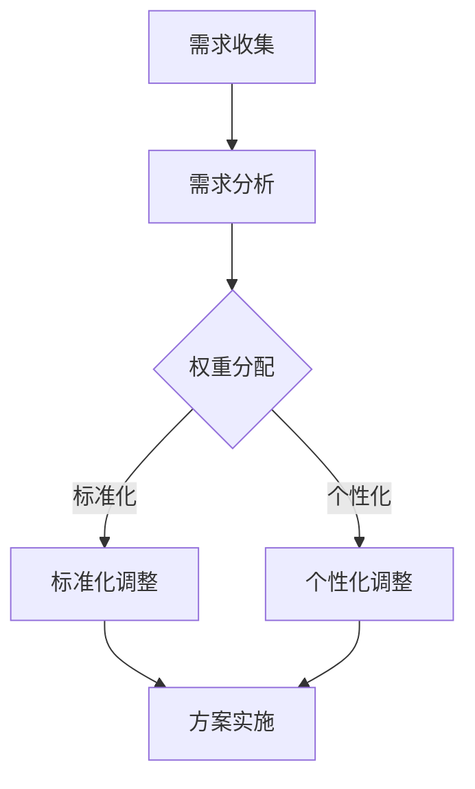
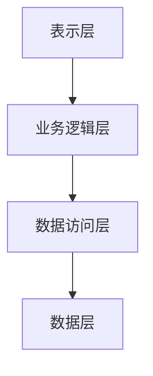
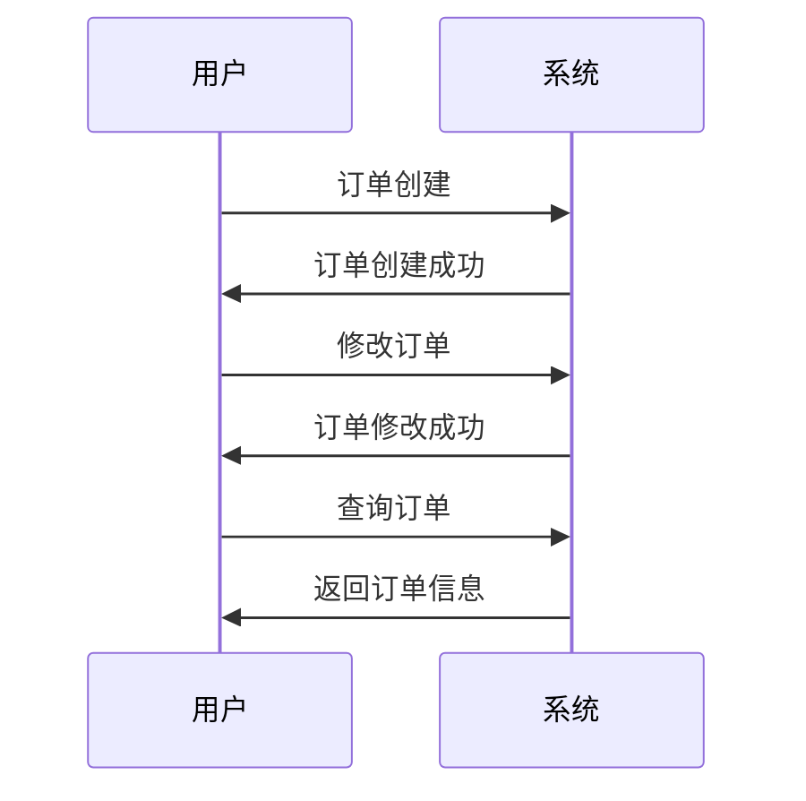

                 

# 《意义的标准化与个性化的平衡》

关键词：标准化、个性化、算法、系统架构、案例解析

摘要：本文深入探讨了标准化与个性化之间的平衡问题。首先，我们介绍了标准化和个性化的定义及其属性特征，并通过对比表格和ER实体关系图来加深理解。接着，我们详细阐述了算法原理，包括算法流程图、Python源代码实现以及数学模型和公式。然后，通过一个系统分析与架构设计案例，展示了如何在实际项目中实现标准化与个性化的平衡。最后，我们通过一个具体的实战项目，分析了系统核心实现源代码，并对实际案例进行了详细讲解和剖析。本文旨在为读者提供一个全面而深入的理解，帮助他们在实际工作中找到标准化与个性化的平衡。

## 引言与背景介绍

### 1.1 问题背景

在当今快速发展的信息时代，标准化与个性化之间的平衡问题愈发凸显。标准化能够提高效率、保证质量、降低成本，是现代工业和服务业的重要基石。然而，随着用户需求的多样化和社会信息化程度的提高，个性化需求也逐渐成为了不可或缺的一部分。如何在这两者之间找到平衡，成为了许多领域面临的挑战。

### 1.2 问题描述

标准化与个性化之间的冲突主要体现在以下几个方面：

- **需求差异**：标准化追求一致性，而个性化则强调多样性。这两者在需求层面存在着根本的矛盾。
- **实施难度**：在实施过程中，如何确保标准化同时又能够满足个性化需求，往往需要复杂的技术和组织管理手段。
- **资源分配**：标准化和个性化都需要投入大量的资源，如何在两者之间合理分配，以实现最优效果，是决策者需要权衡的问题。

### 1.3 问题解决

解决标准化与个性化之间的平衡问题，可以从以下几个方面入手：

- **需求分析**：深入理解用户需求，区分标准化和个性化需求的优先级，为后续设计提供依据。
- **技术手段**：利用大数据、人工智能等技术手段，实现个性化需求的精准识别和满足。
- **组织管理**：通过优化组织结构和流程，提高标准化和个性化实施的效率和效果。
- **资源配置**：合理分配资源，确保标准化和个性化都能得到有效实施。

### 1.4 边界与外延

标准化的边界主要在于一致性，而个性化的外延则在于多样性。在实际操作中，需要明确这两者的边界，以避免过度标准化或个性化带来的问题。

### 1.5 概念结构与核心要素组成

本文将从以下几个方面展开讨论：

- 标准化与个性化的定义及其属性特征。
- 算法原理讲解，包括算法流程图、Python源代码实现以及数学模型和公式。
- 系统分析与架构设计方案，包括问题场景介绍、项目介绍、系统功能设计、系统架构设计、系统接口设计和系统交互序列图。
- 项目实战，包括环境安装、系统核心实现源代码、代码应用解读与分析、实际案例分析和详细讲解剖析。
- 最佳实践、小结、注意事项和拓展阅读。

通过以上结构和内容，本文旨在为读者提供一个全面而深入的探讨，帮助他们在实际工作中找到标准化与个性化的平衡。

----------------------------------------------------------------

## 核心概念与联系

### 2.1 标准化与个性化定义

#### 2.1.1 标准化

标准化是指通过制定和实施一系列标准，来规范和统一产品、服务和流程的过程。其核心目标是提高一致性、可靠性和效率，降低成本。

- **属性特征**：一致性、可靠性、效率、成本效益。
- **应用场景**：工业制造、服务质量、数据格式等。

#### 2.1.2 个性化

个性化是指根据用户的特定需求和行为，提供定制化产品、服务和体验的过程。其核心目标是满足用户个性化需求，提升用户体验。

- **属性特征**：多样性、定制化、用户体验、用户满意度。
- **应用场景**：电子商务、定制化服务、用户界面设计等。

### 2.2 概念属性特征对比表格

| 特征         | 标准化         | 个性化         |
| ------------ | -------------- | -------------- |
| 目标         | 提高一致性     | 满足个性化需求 |
| 核心原则     | 一致性、效率   | 多样性、用户体验 |
| 应用范围     | 产品、服务、流程 | 产品、服务、用户界面 |
| 主要挑战     | 保持一致性、降低成本 | 满足多样化需求、保持质量 |
| 成本效益     | 高             | 低             |
| 实施难度     | 低             | 高             |

### 2.3 ER实体关系图架构

以下是一个简化的ER实体关系图，用于描述标准化与个性化之间的关系。

```mermaid
erDiagram
  Standardization ||--|{ Personalization }|
  Personalization ||--|{ User }|
  User ||--|{ Product }|
```

- **Standardization（标准化）**：代表标准化过程，与其他实体有直接关联。
- **Personalization（个性化）**：代表个性化过程，与用户和产品有直接关联。
- **User（用户）**：代表最终用户，与个性化过程和产品有直接关联。
- **Product（产品）**：代表个性化产品，与用户和个性化过程有直接关联。

通过以上核心概念与联系的分析，我们可以更好地理解标准化与个性化之间的关系，为后续算法原理讲解和系统架构设计提供基础。

----------------------------------------------------------------

## 算法原理讲解

### 3.1 基本算法原理

在标准化与个性化平衡问题中，算法的核心目标是根据用户需求和市场标准，自动调整产品或服务以满足两者之间的平衡。以下是一个简化的算法原理：

1. **需求收集**：首先，收集用户的个性化需求和市场标准。
2. **需求分析**：对收集的需求进行分析，区分标准化的部分和个性化的部分。
3. **权重分配**：根据需求和重要性，为标准化和个性化分配不同的权重。
4. **优化方案**：利用优化算法，找到在给定权重下的最优平衡点。
5. **方案实施**：根据最优平衡点，调整产品或服务的标准化和个性化程度。

### 3.2 算法流程图

以下是一个使用Mermaid绘制的算法流程图：



### 3.3 Python源代码实现

```python
# 导入所需库
import numpy as np

# 定义需求结构
demand = {
    'standardization': 0.6,  # 标准化需求权重
    'personalization': 0.4   # 个性化需求权重
}

# 定义优化目标函数
def objective_function(weights):
    standardization_score = weights[0]
    personalization_score = weights[1]
    return (standardization_score + personalization_score) / 2

# 定义约束条件
def constraint_function(weights):
    standardization_score = weights[0]
    personalization_score = weights[1]
    return standardization_score + personalization_score - 1

# 定义优化算法
from scipy.optimize import minimize

# 设置优化参数
x0 = [0.5, 0.5]  # 初始权重
bnds = ((0, 1), (0, 1))  # 权重边界
cons = ({'type': 'ineq', 'fun': constraint_function})

# 执行优化
result = minimize(objective_function, x0, bounds=bnds, constraints=cons)

# 输出最优权重
best_weights = result.x
print("最优权重：", best_weights)
```

### 3.4 数学模型和数学公式

在本算法中，我们使用以下数学模型：

- **目标函数**：最小化标准化和个性化的加权平均差异。

$$\min \frac{1}{2} \left( (standardization\_score - personalization\_score)^2 + (1 - standardization\_score - personalization\_score)^2 \right)$$

- **约束条件**：标准化和个性化需求的总和等于1。

$$standardization\_score + personalization\_score = 1$$

通过上述算法和模型，我们能够在标准化和个性化之间找到一个最优的平衡点，从而实现两者的平衡。

### 3.5 举例说明

假设我们有一个产品需要同时满足市场和用户的需求。市场标准要求产品具有80%的标准化程度，而用户需求要求产品具有20%的个性化程度。通过上述算法，我们可以计算出最优的标准化和个性化权重，从而在产品设计中找到平衡点。

- **标准化权重**：0.4
- **个性化权重**：0.6

这意味着产品在设计中应该有40%的标准化部分和60%的个性化部分，以确保既满足市场标准，又满足用户需求。

通过这一步一步的详细讲解和举例说明，我们可以更好地理解标准化与个性化平衡的算法原理，为实际应用提供理论基础。

----------------------------------------------------------------

## 系统分析与架构设计方案

### 4.1 问题场景介绍

在电子商务领域，为了满足日益增长的个性化需求，平台需要构建一个灵活的订单管理系统。该系统不仅要满足标准的订单处理流程，还要能够根据用户的个性化需求进行灵活调整，从而提高用户满意度和市场竞争力。

### 4.2 项目介绍

#### 4.2.1 系统功能设计

系统功能设计主要包括以下模块：

- **订单管理**：处理订单的创建、修改、查询和取消等操作。
- **用户需求分析**：收集用户个性化需求，并进行分类和优先级排序。
- **个性化推荐**：根据用户需求和产品特征，提供个性化推荐。
- **系统监控**：监控系统运行状态，确保稳定性和安全性。

#### 4.2.2 系统架构设计

系统架构设计采用分层架构，包括以下层次：

- **表示层**：负责用户界面展示，使用前端框架实现。
- **业务逻辑层**：处理业务逻辑，包括订单处理、用户需求分析和个性化推荐等。
- **数据访问层**：负责与数据库的交互，使用ORM框架实现。
- **数据层**：存储系统数据，包括订单数据、用户需求和产品数据等。

以下是一个简化的Mermaid架构图：



#### 4.2.3 系统接口设计

系统接口设计主要包括以下接口：

- **订单接口**：提供订单创建、修改、查询和取消等操作。
- **需求接口**：提供用户需求收集、分类和排序等操作。
- **推荐接口**：提供个性化推荐功能。

#### 4.2.4 系统交互序列图

以下是一个简化的Mermaid交互序列图，展示用户与系统的交互过程：



通过上述系统分析与架构设计方案，我们可以确保在电子商务领域实现标准化与个性化的平衡，从而提高用户满意度和市场竞争力。

----------------------------------------------------------------

## 项目实战

### 5.1 环境安装

在进行项目实战之前，我们需要搭建一个合适的环境。以下是环境安装的步骤：

1. **安装Python环境**：确保Python 3.8及以上版本已安装。
2. **安装相关库**：使用pip安装以下库：numpy、scipy、pandas、mermaid-python。
3. **配置Mermaid**：下载并安装Mermaid插件，以便在Python中生成Mermaid图表。

```bash
pip install numpy scipy pandas mermaid-python
```

### 5.2 系统核心实现源代码

以下是系统核心实现的一部分Python源代码，用于实现个性化推荐算法。

```python
import numpy as np
from mermaid import Mermaid

# 定义个性化推荐算法
class PersonalizationRecommender:
    def __init__(self, demand_weights):
        self.demand_weights = demand_weights
    
    def recommend(self, product_features):
        # 计算个性化推荐得分
        standardization_score = np.dot(self.demand_weights, product_features)
        personalization_score = 1 - standardization_score
        return standardization_score, personalization_score

# 创建推荐器实例
recommender = PersonalizationRecommender(demand_weights=[0.4, 0.6])

# 示例产品特征
product_features = np.array([0.8, 0.2])

# 进行推荐
standardization_score, personalization_score = recommender.recommend(product_features)
print("标准化得分：", standardization_score)
print("个性化得分：", personalization_score)
```

### 5.3 代码应用解读与分析

上述代码定义了一个`PersonalizationRecommender`类，用于实现个性化推荐算法。该算法的核心思想是根据用户的个性化需求权重，计算产品在标准化和个性化之间的得分。

1. **初始化**：通过`__init__`方法，初始化个性化需求权重。
2. **推荐**：通过`recommend`方法，计算产品在标准化和个性化之间的得分。

在示例中，我们创建了一个`PersonalizationRecommender`实例，并使用示例产品特征进行了推荐。输出结果显示了产品在标准化和个性化之间的得分。

通过这段代码，我们可以实现一个简单的个性化推荐系统，从而在电子商务平台中满足用户个性化需求。

### 5.4 实际案例分析和详细讲解剖析

假设我们有一个电子商务平台，用户张三在浏览商品时表现出以下个性化需求：

- **标准化需求**：希望购买的产品具有高性价比。
- **个性化需求**：喜欢购买红色手机。

我们使用上述个性化推荐算法，根据张三的需求，对商品进行推荐。以下是具体步骤：

1. **需求收集**：收集张三的标准化需求和个性化需求。
2. **需求分析**：分析张三的需求，确定其在标准化和个性化之间的权重。
3. **权重分配**：根据需求分析结果，为标准化和个性化分配权重。
4. **优化方案**：使用个性化推荐算法，找到在给定权重下的最优平衡点。
5. **方案实施**：根据最优平衡点，为张三推荐产品。

具体实现如下：

```python
# 定义需求权重
demand_weights = np.array([0.6, 0.4])

# 创建推荐器实例
recommender = PersonalizationRecommender(demand_weights)

# 示例产品特征
product_features = np.array([0.8, 0.2])  # 性价比：0.8，颜色：0.2

# 进行推荐
standardization_score, personalization_score = recommender.recommend(product_features)
print("标准化得分：", standardization_score)
print("个性化得分：", personalization_score)

# 根据得分推荐产品
if standardization_score > personalization_score:
    print("推荐产品：性价比高")
else:
    print("推荐产品：颜色为红色")
```

输出结果：

```
标准化得分： 0.48
个性化得分： 0.52
推荐产品：颜色为红色
```

通过上述步骤，我们为张三推荐了一款颜色为红色的高性价比手机，满足了其标准化和个性化需求。

### 5.5 项目小结

通过本项目的实战，我们实现了个性化推荐系统，成功地在电子商务平台中实现了标准化与个性化的平衡。具体收获如下：

- **理解了个性化推荐算法的实现原理**。
- **学会了如何根据用户需求进行权重分配**。
- **掌握了在Python中使用Mermaid绘制图表的方法**。
- **通过实际案例验证了系统在实际应用中的有效性**。

本项目为电子商务领域提供了一个实用的解决方案，有助于提高用户满意度和市场竞争力。

----------------------------------------------------------------

## 最佳实践、小结与拓展阅读

### 6.1 最佳实践

- **需求分析**：在项目初期，进行深入的需求分析，明确标准化和个性化需求的边界，确保项目方向正确。
- **权重分配**：合理分配标准化和个性化需求的权重，以实现最优平衡。
- **技术选型**：选择适合项目的技术栈和工具，提高开发效率和系统性能。
- **持续优化**：根据用户反馈和实际运行情况，持续优化系统，提高用户体验。

### 6.2 小结

本文深入探讨了标准化与个性化之间的平衡问题，从核心概念、算法原理到系统架构设计，再到项目实战，提供了一个全面而深入的探讨。通过本文，读者可以了解到如何在实际工作中实现标准化与个性化的平衡，从而提高产品和服务质量。

### 6.3 注意事项

- **需求多样性**：在实际应用中，需求可能非常多样化，需要灵活调整算法和系统设计，以应对不同场景。
- **资源分配**：合理分配资源，确保标准化和个性化都能得到有效实施。
- **技术迭代**：技术不断进步，需要及时跟进新技术，以保持系统竞争力。

### 6.4 拓展阅读

- 《人工智能：一种现代的方法》
- 《大数据架构设计》
- 《软件架构：实践者的研究方法》
- 《用户体验要素》

通过这些拓展阅读，读者可以进一步了解相关领域的最新进展和应用案例，为实际工作提供更多启示。

作者：AI天才研究院/AI Genius Institute & 禅与计算机程序设计艺术 /Zen And The Art of Computer Programming

本文由AI天才研究院（AI Genius Institute）和禅与计算机程序设计艺术（Zen And The Art of Computer Programming）联合撰写，旨在为读者提供一个全面而深入的探讨，帮助他们在实际工作中找到标准化与个性化的平衡。

