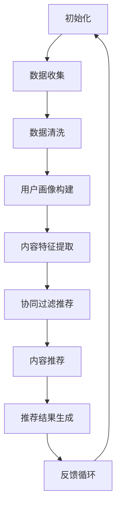
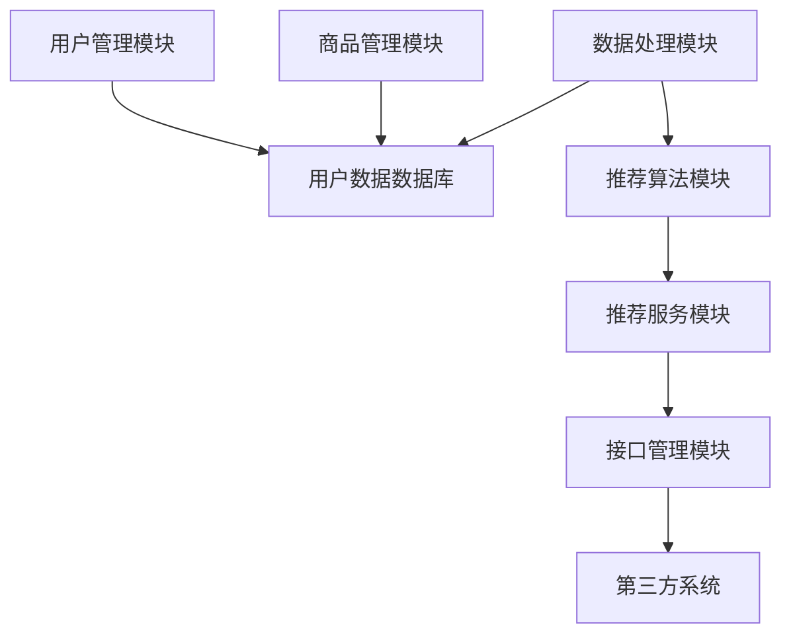
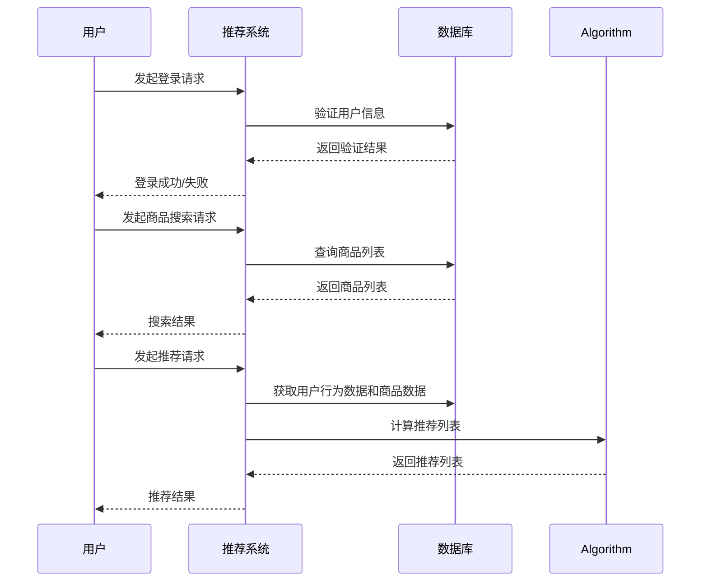

                 


### # 意义的标准化与个性化：uniformity与diversity的平衡

## 关键词

- 意义的标准化
- 个性化
- Diversity
- Uniformity
- 平衡
- 社会需求
- 技术挑战
- 文本分析
- 数据可视化

## 摘要

本文探讨了意义的标准化与个性化之间的平衡问题，分析了uniformity（一致性）与diversity（多样性）在社会和技术领域中的重要性。首先，我们介绍了意义标准化的概念和历史背景，探讨了其在语言、文化和技术规范中的应用。接着，我们深入探讨了个性化在满足社会需求方面的作用，并讨论了如何平衡标准化和个性化的挑战。通过案例研究和算法解释，本文展示了如何在实际应用中实现这一平衡，并提出了最佳实践和未来研究方向。文章旨在为读者提供对这一复杂问题的深入理解，以促进在技术和社会层面上的有意义创新。

## 引言

在现代社会，信息的爆炸式增长和技术的飞速发展使得意义的标准化与个性化成为了一个热门话题。无论是日常交流中的语言使用，还是复杂技术系统中的数据处理，标准化和个性化都扮演着至关重要的角色。标准化为我们提供了共同的语言和规范，使得不同个体之间的沟通变得更加高效和准确。而个性化则满足了人们对独特体验和个性化需求的追求，为我们的生活带来了丰富多彩的体验。

### 意义的标准化

意义的标准化可以追溯到古代文明的文字发明和语言规范化。例如，古埃及的象形文字、古印度的梵文以及古希腊的字母表，都是早期标准化努力的体现。随着人类文明的发展，标准化逐渐扩展到文化、法律、技术和经济等领域。

在文化层面，标准化的语言规范有助于维护文化的统一性和传承。例如，中文的拼音系统（汉语拼音）就是一项重要的标准化措施，它使得汉语的学习和使用变得更加便捷，促进了各地区之间的交流。在国际交流中，英语的广泛使用也体现了语言标准化的力量。

在法律层面，标准化的规范确保了法律的一致性和可执行性。例如，国际单位制（SI）的推广使得全球范围内的计量和测量更加统一，从而促进了国际贸易和技术合作。

在技术层面，标准化更是不可或缺。从计算机编程语言的制定（如Java、Python）到网络协议的标准化（如HTTP、TCP/IP），标准化确保了不同系统、设备和软件之间的兼容性和互操作性。这对于现代信息社会的基础设施建设至关重要。

### 个性化

个性化（Personalization）是满足个体独特需求和偏好的过程。在信息时代，个性化技术已经成为改善用户体验、提高效率和满意度的重要手段。个性化可以体现在多个方面，包括内容推荐、个性化广告、个性化学习等。

在内容推荐系统中，算法根据用户的历史行为和偏好来推荐相关内容。例如，亚马逊的个性化推荐系统基于用户的购买历史和浏览记录，推荐可能感兴趣的商品。这种个性化的推荐不仅提高了用户的购物体验，也显著提升了销售转化率。

个性化广告则通过分析用户的兴趣和行为，展示与其相关度更高的广告。谷歌的广告系统就是这样一个典型的例子，它利用用户的搜索历史和浏览行为来展示最相关的广告，从而提高了广告的点击率和投放效果。

个性化学习是教育领域的一个重要应用。通过分析学生的学习行为和成绩，教育平台可以为每个学生提供个性化的学习方案，从而提高学习效果。例如，Khan Academy 的个性化学习系统通过分析学生的学习进度和理解程度，提供适合其当前水平的练习和知识点讲解。

### 统一性（Uniformity）与多样性（Diversity）

统一性（Uniformity）指的是一致性、一致性和标准化。它在确保社会秩序、技术兼容性和信息传输的准确性方面发挥着重要作用。然而，统一性也可能导致僵化和缺乏灵活性，从而抑制创新和多样性。

多样性（Diversity）则强调了个体和群体的独特性、多元性。多样性带来了创新、包容和创造力，但在实际应用中也面临着协调和管理上的挑战。

在讨论统一性与多样性时，需要考虑以下几个方面：

1. **社会维度**：在多元文化社会中，统一性有助于社会团结和共同价值观的传播。然而，过度统一也可能导致文化同质化和多样性的丧失。多样性则有助于文化繁荣和社会进步，但也需要通过制度化和法律保障来实现和谐共处。

2. **技术维度**：在技术领域，统一性确保了不同系统、设备和软件之间的互操作性。然而，技术的多样性和创新性也推动了技术的进步和发展。在标准化的同时，如何保持技术的多样性是一个重要的课题。

3. **经济维度**：统一性有助于降低交易成本、提高效率和促进市场整合。多样性则为企业提供了更广泛的市场机会和差异化竞争优势。

### 挑战与平衡

在标准化和个性化的追求过程中，平衡统一性与多样性是一个巨大的挑战。以下是一些主要挑战和可能的解决方案：

1. **标准化与创新的冲突**：过度标准化可能导致创新受阻，而缺乏标准化则可能带来兼容性问题。解决方案是制定灵活的标准化框架，允许在保持一致性的同时进行创新。

2. **个性化与隐私的冲突**：个性化需要收集和处理大量的用户数据，这引发了隐私保护的问题。解决方案是通过加强数据保护和隐私法规，确保个性化服务的合规性。

3. **文化差异与统一性的冲突**：在全球化的背景下，如何平衡文化差异和统一性是一个重要议题。解决方案是促进跨文化交流，制定多元文化框架，同时保护各地区的文化特色。

4. **资源分配与公平性**：在追求个性化的同时，需要确保资源公平分配，避免出现“赢者通吃”的局面。解决方案是建立透明和公平的机制，确保每个人都能享受到个性化的好处。

### 总结

意义的标准化与个性化是一个复杂而重要的话题，它不仅影响着社会、技术和经济领域，也深刻影响着我们的生活。在统一性和多样性之间找到平衡，是实现可持续发展和社会进步的关键。通过深入理解和探索这一平衡，我们可以更好地应对未来面临的挑战，为个体和社会创造更多价值。

## 第一部分：引论

### 1.1 研究背景

#### 1.1.1 意义的标准化历史演变

意义的标准化是一个历史悠久的课题，其起源可以追溯到人类文明的发展初期。最早的标准化努力可以追溯到古埃及的象形文字，以及后来的苏美尔人的楔形文字。这些早期文字的发明和规范化，为信息的记录和传播奠定了基础。

随着时间的推移，标准化逐渐扩展到文化、法律、技术和经济等领域。在中世纪，欧洲的各个国家开始制定自己的语言规范和法律规范，如拉丁文的规范化。这些规范化措施促进了欧洲文化的统一性和法律的一致性。

进入现代社会，随着工业化和全球化的发展，标准化的重要性愈发凸显。国际单位制（SI）的制定和推广，为全球范围内的计量和测量提供了统一的标准。在技术领域，标准化更是不可或缺。从计算机编程语言的制定到网络协议的标准化，标准化确保了不同系统、设备和软件之间的兼容性和互操作性。

#### 1.1.2 个性化和多样性的社会需求

个性化和多样性在现代社会中逐渐成为了一种强烈的需求。随着人们生活水平的提高，对个性化服务和独特体验的追求越来越强烈。个性化不仅体现在消费领域，如个性化推荐系统、个性化广告等，也体现在教育、医疗、娱乐等各个领域。

多样性则强调了个体和群体的独特性。在全球化的背景下，多样性被视为一种宝贵的资源，它能够促进创新、包容和社会进步。多样性不仅体现在文化、语言和价值观方面，也体现在性别、种族和社会阶层等方面。

#### 1.1.3 两者平衡的重要性

在意义的标准化和个性化之间找到平衡，对于社会和技术的可持续发展至关重要。过度标准化可能导致僵化和缺乏灵活性，抑制创新和多样性。而缺乏标准化则可能导致混乱和不兼容，降低效率和用户体验。

平衡统一性与多样性，不仅可以促进社会和谐和文化繁荣，还可以提高技术的创新能力和市场竞争力。通过制定灵活的标准化框架，同时鼓励个性化和多样性，我们可以实现标准化与个性化的有机结合，为个体和社会创造更多价值。

### 1.2 核心概念界定

#### 1.2.1 意义的标准化

意义的标准化是指通过制定统一的标准和规范，确保信息、产品和服务的一致性和可互操作性。标准化的目的是提高效率、降低成本、促进兼容性和互操作性。在技术领域，标准化涉及编程语言、网络协议、数据格式等方面。

#### 1.2.2 个性化和多样性

个性化是指根据个体的独特需求和偏好，提供定制化的产品、服务和体验。个性化的目标是提高用户满意度、增强用户体验和促进销售转化。多样性则强调了个体和群体的独特性、多元性，涵盖了文化、语言、价值观等方面。

#### 1.2.3 uniformity与diversity的界定

uniformity（统一性）是指一致性、一致性和标准化。它在确保社会秩序、技术兼容性和信息传输的准确性方面发挥着重要作用。diversity（多样性）则强调了个体和群体的独特性、多元性。多样性带来了创新、包容和创造力，但在实际应用中也面临着协调和管理上的挑战。

### 1.3 研究方法与结构概述

#### 1.3.1 研究方法论

本研究采用定性研究方法，包括文献综述、案例分析、理论分析和实证研究。通过分析历史背景、社会需求、技术挑战和案例研究，深入探讨意义的标准化与个性化之间的平衡问题。

#### 1.3.2 文献综述

本文将对现有的相关文献进行综述，包括意义的标准化、个性化、统一性和多样性等领域的理论、研究和应用。通过文献综述，为本文的研究提供理论依据和参考。

#### 1.3.3 论文结构安排

本文分为五个主要部分。第一部分是引论，介绍研究背景、核心概念和论文结构。第二部分讨论意义的标准化，包括其历史演变、社会需求和标准化技术的应用。第三部分探讨个性化在满足社会需求中的作用，以及个性化技术的实现方法。第四部分分析统一性和多样性的关系，讨论两者之间的平衡挑战。第五部分总结研究结果，提出未来研究方向和实际应用建议。

### 1.4 研究范围与限制

#### 1.4.1 研究领域

本文主要探讨意义的标准化与个性化之间的平衡问题，涵盖文化、社会、技术和经济等多个领域。

#### 1.4.2 研究范围

研究范围包括意义的标准化、个性化、统一性和多样性，以及这些概念在不同领域的应用和挑战。

#### 1.4.3 研究限制

本文主要关注理论分析和案例分析，未能涵盖所有实际应用场景。此外，由于研究时间和资源的限制，本文未能深入探讨所有相关技术细节。

## 第二部分：意义的标准化

### 2.1 标准化的理论基础

#### 2.1.1 标准化的定义

标准化是一种系统化的活动，旨在制定、发布和应用统一的标准，确保产品、过程或服务的一致性和互操作性。标准可以是由政府机构、行业组织或国际组织制定，用于规范特定领域的行为和技术要求。

#### 2.1.2 标准化的作用

标准化在多个领域发挥着重要作用，包括但不限于以下几个方面：

1. **提高产品质量**：通过制定统一的标准，可以确保产品的一致性和可靠性，从而提高用户满意度。
2. **降低成本**：标准化有助于减少生产过程中的变异性和错误率，从而降低成本和提高效率。
3. **促进互操作性**：标准化的技术规范和协议使得不同系统和设备之间可以无缝协作，提高了系统的兼容性和可扩展性。
4. **提高安全性和可靠性**：标准化确保了产品和服务符合安全标准和规范，降低了风险和事故发生的可能性。
5. **促进国际贸易**：国际标准有助于消除贸易壁垒，促进全球贸易和合作。

#### 2.1.3 标准化的发展历程

1. **早期标准化**：标准化起源于19世纪末和20世纪初，最初集中在制造和工业领域。国际标准化组织（ISO）成立于1947年，标志着全球标准化工作的开始。
2. **信息技术标准化**：随着计算机和互联网的普及，信息技术标准化成为了重要的领域。例如，ISO/IEC 27001 是信息安全管理体系标准，而 HTTP 是互联网上最常用的网络协议。
3. **现代标准化**：现代标准化不仅关注技术领域，还涵盖了环境保护、社会责任、可持续发展和健康安全等领域。例如，ISO 14001 是环境管理体系标准，而 ISO 26000 是社会责任指南。

#### 2.1.4 标准化的挑战

1. **创新与标准化**：标准化可能会抑制创新，因为新技术的引入可能需要修订现有标准。因此，如何在保持标准化的同时鼓励创新成为一个重要的挑战。
2. **文化差异**：全球化和文化多样性使得制定统一的标准变得复杂。不同国家和地区的文化、法律和习惯可能导致对标准的不同解读和应用。
3. **技术复杂性**：随着技术的发展，标准化任务变得越来越复杂。例如，物联网（IoT）和大数据技术需要制定新的标准来确保系统的互操作性和安全性。
4. **隐私与数据保护**：随着数据收集和分析的普及，标准化需要在保护个人隐私和数据安全方面发挥更大的作用。

#### 2.1.5 标准化与个性化

标准化和个性化是两个看似矛盾的概念。标准化追求一致性、可靠性和互操作性，而个性化则强调独特性和定制化。然而，通过适当的平衡，两者可以相辅相成，共同推动社会和技术的进步。

1. **个性化与标准化的结合**：在个性化服务中，标准化技术规范可以确保不同系统和平台之间的兼容性。例如，在个性化医疗中，标准化数据格式有助于不同医疗机构之间的数据共享和协作。
2. **定制化标准**：在某些情况下，可以根据特定用户群体的需求制定定制化的标准。例如，个性化的健身计划可以根据用户的身体状况和目标来定制，同时遵循健身行业的通用标准。

### 2.2 标准化在不同领域的应用

#### 2.2.1 语言标准化

语言标准化是文化领域的一个重要方面。通过制定统一的语言规范，可以促进语言的使用和传播，维护文化的传承和发展。例如，汉语拼音系统（汉语拼音）的推广，使得汉语的学习和使用变得更加便捷，促进了各地区之间的交流。

#### 2.2.2 法律标准化

法律标准化是确保法律一致性和可执行性的重要手段。国际法律标准如《联合国宪章》和《世界人权宣言》，为全球范围内的法律规范提供了基础。国内法律标准如《中华人民共和国民法典》，为国内的法律实施提供了统一的框架。

#### 2.2.3 技术标准化

技术标准化是现代信息技术发展的基石。计算机编程语言的标准化，如 Java 和 Python，为软件开发提供了统一的语法和规范。网络协议的标准化，如 HTTP 和 TCP/IP，确保了互联网的稳定运行和全球互通。

#### 2.2.4 经济标准化

经济标准化在促进全球贸易和合作中发挥着重要作用。国际货币基金组织（IMF）和世界贸易组织（WTO）等国际机构制定的规则和标准，为全球经济的稳定和繁荣提供了保障。

### 2.3 标准化的优势和挑战

#### 2.3.1 优势

1. **提高效率**：标准化可以减少生产过程中的错误和重复工作，提高工作效率和质量。
2. **降低成本**：标准化有助于统一技术和规范，减少资源浪费和重复投资，降低成本。
3. **促进创新**：标准化可以为新技术的引入和推广提供支持，促进创新和发展。
4. **增强互操作性**：标准化确保不同系统和设备之间的兼容性和互操作性，提高了系统的集成性和扩展性。

#### 2.3.2 挑战

1. **标准化滞后**：技术发展迅速，标准化可能无法及时跟上，导致现有标准过时或无法适应新的需求。
2. **文化差异**：不同国家和地区对标准的理解和实施可能存在差异，导致冲突和协调困难。
3. **创新与标准的冲突**：新技术的引入可能需要修订现有标准，导致标准化与创新的矛盾。
4. **数据隐私与安全**：随着数据收集和处理的普及，标准化需要在保护个人隐私和数据安全方面发挥更大的作用。

### 2.4 标准化对个性化服务的影响

#### 2.4.1 促进个性化服务的发展

标准化为个性化服务的发展提供了技术支持和规范保障。通过标准化数据格式和技术协议，不同系统和平台可以实现数据共享和协作，为用户提供更加个性化和定制化的服务。

#### 2.4.2 平衡标准化与个性化

在个性化服务中，标准化和个性化需要找到平衡。标准化确保系统的兼容性和可靠性，个性化则满足用户的独特需求和偏好。通过制定灵活的标准化框架，可以在保持一致性的同时实现个性化。

### 2.5 未来标准化的发展趋势

#### 2.5.1 数字化与智能化

随着数字化和智能化的发展，标准化将在更多领域得到应用。例如，物联网（IoT）和人工智能（AI）技术需要制定新的标准来确保系统的互操作性和安全性。

#### 2.5.2 数据隐私与安全

数据隐私和安全将成为未来标准化的重要议题。随着数据收集和处理的普及，标准化需要在保护个人隐私和数据安全方面发挥更大的作用。

#### 2.5.3 环境与可持续性

标准化将在环境与可持续性领域发挥重要作用。例如，绿色建筑标准和可持续能源技术标准的制定，有助于推动环境保护和可持续发展。

### 2.6 结论

标准化在意义的标准化和个性化中发挥着重要作用。通过制定统一的标准和规范，可以确保信息、产品和服务的一致性和互操作性，提高效率和质量。同时，标准化也为个性化服务的发展提供了技术支持和规范保障。在未来，标准化将在更多领域得到应用，为个体和社会创造更多价值。

## 第三部分：个性化

### 3.1 个性化概述

个性化（Personalization）是指根据个体或群体的特征、行为和偏好，提供定制化的产品、服务和体验。在信息爆炸和数字化时代，个性化已成为提高用户满意度、增强用户参与度和提升商业价值的重要手段。

#### 3.1.1 个性化的定义

个性化可以定义为一种以用户为中心的方法，通过收集和分析用户数据，为其提供个性化的内容、推荐和服务。它强调根据个体的独特需求和偏好，进行定制化的匹配和优化，从而提升用户体验和满意度。

#### 3.1.2 个性化的发展历程

个性化技术的发展经历了多个阶段：

1. **早期个性化**：早期的个性化主要依赖于用户显式提供的信息，如用户手动设置的偏好或浏览历史。这种方式虽然简单，但效果有限。
2. **基于规则的个性化**：基于规则的个性化通过预设的规则和逻辑，对用户行为进行分析和分类，提供个性化的内容和服务。这种方式在一定程度上提高了个性化效果，但仍然依赖于人工预设的规则。
3. **数据驱动个性化**：随着大数据和机器学习技术的发展，个性化逐渐转向数据驱动。通过收集和分析大量的用户数据，使用先进的算法和模型，实现更加精准和智能的个性化推荐。

#### 3.1.3 个性化在现代社会的重要性

个性化在现代社会中具有重要意义，主要体现在以下几个方面：

1. **提高用户体验**：个性化服务能够更好地满足用户的需求和偏好，提高用户满意度和参与度。
2. **增强用户忠诚度**：通过提供个性化的体验，企业可以建立更强的用户粘性和忠诚度，从而提升客户保留率。
3. **提高商业价值**：个性化服务有助于提高转化率和销售额，降低营销成本，提升企业的盈利能力。
4. **促进创新**：个性化技术激发了创新的可能性，为企业和开发者提供了更多的业务场景和应用机会。

### 3.2 个性化技术的实现方法

#### 3.2.1 用户画像

用户画像（User Profiling）是个性化技术的基础。通过收集和分析用户数据，构建用户的行为模式、兴趣偏好、价值观念等多维度的用户画像，为后续的个性化推荐和优化提供依据。

1. **数据来源**：用户画像的数据来源主要包括用户行为数据（如浏览记录、购买历史）、社交媒体数据（如点赞、评论）、地理位置数据等。
2. **数据采集**：通过数据采集工具（如跟踪脚本、API接口等），收集用户在不同平台和设备上的行为数据。
3. **数据清洗**：对采集到的数据进行清洗和预处理，去除噪声和重复数据，提高数据的质量和可用性。

#### 3.2.2 机器学习算法

机器学习算法是实现个性化推荐的核心技术。通过训练和优化算法模型，可以从海量数据中提取出用户的行为特征和偏好，提供个性化的内容和服务。

1. **协同过滤（Collaborative Filtering）**：协同过滤是一种基于用户行为和偏好的推荐算法，分为基于用户的协同过滤和基于项目的协同过滤。基于用户的协同过滤通过寻找与目标用户相似的其他用户，推荐他们喜欢的物品；基于项目的协同过滤则通过分析物品之间的相似性，推荐给用户可能感兴趣的物品。

2. **内容推荐（Content-based Filtering）**：内容推荐是基于用户对物品的兴趣特征，推荐与其兴趣相似的物品。通过提取物品的特征向量，使用文本挖掘和自然语言处理技术，计算物品之间的相似性，为用户提供个性化的推荐。

3. **深度学习（Deep Learning）**：深度学习是机器学习的一种重要分支，通过构建深度神经网络模型，自动提取数据的高层次特征。在个性化推荐中，深度学习可以用于用户行为序列的建模、兴趣预测和内容生成。

#### 3.2.3 个性化推荐系统架构

个性化推荐系统通常包括数据层、模型层和应用层三个部分：

1. **数据层**：负责数据采集、清洗、存储和管理。数据源可以是用户行为数据、内容数据、社会关系数据等。
2. **模型层**：负责训练和优化推荐模型，包括协同过滤、内容推荐、深度学习等算法。模型层通常包括多个模型，根据不同的业务场景和用户需求，组合使用不同的算法和模型。
3. **应用层**：负责将推荐结果呈现给用户，可以是Web页面、移动应用、邮件、短信等形式。

### 3.3 个性化在不同领域的应用

#### 3.3.1 消费领域

在消费领域，个性化推荐已成为电商平台、社交媒体和新闻媒体等的重要功能。通过个性化推荐，用户可以快速找到符合自己兴趣和需求的商品、内容和服务。

1. **电商平台**：电商平台通过个性化推荐，提高用户购买转化率和销售额。例如，亚马逊和淘宝等平台，通过用户行为和偏好分析，推荐用户可能感兴趣的商品。
2. **社交媒体**：社交媒体平台通过个性化推荐，吸引用户的持续关注和互动。例如，Facebook 和 Instagram 等，通过分析用户的社交关系和行为，推荐用户可能感兴趣的内容和用户。
3. **新闻媒体**：新闻媒体通过个性化推荐，提高用户粘性和页面访问量。例如，今日头条和新浪新闻等，通过分析用户的阅读行为和兴趣，推荐个性化的新闻内容。

#### 3.3.2 教育领域

在教育领域，个性化学习已经成为提高学习效果和满足学生个性化需求的重要手段。通过个性化学习平台和系统，教师和学生可以制定个性化的学习计划和课程。

1. **自适应学习系统**：自适应学习系统通过分析学生的学习行为和成绩，提供适合其当前水平和需求的学习内容。例如，Khan Academy 和 Coursera 等，通过个性化推荐，提高学习效果和满意度。
2. **个性化课程设计**：教育机构可以通过分析学生的兴趣和需求，设计个性化的课程和学习计划。例如，一些在线教育平台，根据学生的学习进度和理解程度，推荐相应的课程和知识点。

#### 3.3.3 医疗领域

在医疗领域，个性化医疗通过分析患者的基因、病史和生活习惯，提供个性化的诊断和治疗建议。个性化医疗有助于提高治疗效果和降低医疗成本。

1. **个性化诊断**：通过分析患者的临床数据和生物信息，提供个性化的诊断建议。例如，基因检测和个性化治疗方案，有助于提高疾病诊断的准确性和治疗效果。
2. **个性化治疗**：通过分析患者的病情和生活习惯，提供个性化的治疗建议。例如，个性化的手术方案、药物治疗方案和康复计划，有助于提高治疗效果和患者满意度。

#### 3.3.4 金融领域

在金融领域，个性化金融产品和服务通过分析用户的财务状况和投资偏好，提供个性化的理财建议和投资方案。

1. **个性化理财产品**：金融机构通过分析用户的风险承受能力和投资目标，提供个性化的理财产品。例如，基金公司通过用户画像，推荐符合用户风险偏好和收益预期的基金产品。
2. **个性化投资顾问**：金融顾问通过分析用户的财务状况和投资需求，提供个性化的投资建议和服务。例如，智能投资顾问平台，通过用户画像和数据分析，为用户提供定制化的投资组合和理财规划。

### 3.4 个性化面临的挑战和未来发展趋势

#### 3.4.1 挑战

1. **数据隐私和安全**：个性化服务依赖于大量用户数据的收集和分析，引发了数据隐私和安全的问题。如何在保护用户隐私的同时，实现个性化的服务，是一个重要的挑战。
2. **算法偏见和公平性**：个性化算法可能存在偏见，导致某些群体被忽视或歧视。例如，种族、性别和年龄等偏见可能导致个性化推荐不公平。因此，如何在算法设计中确保公平性，是一个亟待解决的问题。
3. **技术和资源要求**：个性化服务需要大量的计算资源和算法优化，对技术要求较高。特别是在处理大规模数据和复杂模型时，如何提高计算效率和准确性，是一个重要的挑战。

#### 3.4.2 未来发展趋势

1. **人工智能和机器学习**：随着人工智能和机器学习技术的不断发展，个性化算法将变得更加智能和高效。例如，深度学习和强化学习等新技术，有望进一步提高个性化推荐的准确性和效果。
2. **跨领域应用**：个性化技术将在更多领域得到应用，如智能交通、智慧城市和智能制造等。通过跨领域合作，个性化技术可以更好地满足不同领域和场景的需求。
3. **隐私保护和伦理规范**：随着对数据隐私和伦理问题的关注增加，隐私保护和伦理规范将成为个性化服务的重要方面。如何确保用户数据的隐私和安全，将成为未来个性化技术发展的重要方向。

### 3.5 结论

个性化在现代社会中具有重要意义，通过满足用户的个性化需求，提高用户体验和满意度，个性化已成为提高商业价值和社会效益的重要手段。在未来，个性化技术将继续发展和创新，为个体和社会创造更多价值。

## 第四部分：统一性与多样性的关系

### 4.1 统一性与多样性的定义

#### 4.1.1 统一性

统一性（Uniformity）指的是一致性、一致性和标准化。它强调在某个特定领域或场景中，所有个体或元素都遵循相同的规则、标准或模式。统一性有助于提高效率和协同性，减少混乱和不兼容。

#### 4.1.2 多样性

多样性（Diversity）则强调个体和群体的独特性、多元性。它涵盖了文化、语言、价值观、性别、种族和社会阶层等多个方面。多样性为个体和社会带来了创新、包容和创造力，但同时也带来了协调和管理的挑战。

### 4.2 统一性与多样性的关系

统一性与多样性之间的关系既对立又互补。它们在不同的情境下发挥着不同的作用，但共同影响着社会和技术的进步。

#### 4.2.1 对立关系

1. **标准化与多样性**：标准化追求一致性和统一性，可能抑制多样性。例如，在技术领域，统一的标准可能限制了新技术的创新和发展。
2. **统一性与管理**：在组织和管理中，过度统一可能导致僵化和缺乏灵活性，难以适应复杂多变的环境。

#### 4.2.2 互补关系

1. **标准化的灵活应用**：在标准化过程中，通过引入灵活的机制和变体，可以在保持统一性的同时，允许一定程度上的多样性。例如，ISO标准允许在不同环境下进行定制化应用。
2. **多样性的标准化**：在多样性的场景中，通过制定标准化规则，可以促进不同群体之间的沟通和协作。例如，国际化语言标准和跨文化交流规则。

### 4.3 统一性与多样性的平衡

#### 4.3.1 平衡的重要性

在统一性与多样性之间找到平衡，对于社会和技术的可持续发展至关重要。平衡不当可能导致以下问题：

1. **过度统一**：可能导致创新受阻、文化同质化和个性丧失。
2. **过度多样性**：可能导致协调困难、效率降低和冲突增加。

#### 4.3.2 实现平衡的方法

1. **制定灵活的标准**：在标准化过程中，制定灵活的标准和规则，允许在特定环境下进行定制化应用。这样可以确保在保持统一性的同时，满足多样性的需求。
2. **多元文化管理**：在组织和管理中，培养多元文化的意识，尊重和保护不同群体和文化的特色，同时通过有效的沟通和协作，实现整体目标的统一。
3. **技术多样性**：在技术领域，鼓励多样性的技术创新，通过标准化的接口和协议，实现不同技术和平台之间的互操作性。这样可以促进技术的进步和多样性的融合。

### 4.4 统一性与多样性在技术领域的实践

#### 4.4.1 技术标准化与多样性

在技术领域，统一性和多样性往往需要同时考虑。以下是一些实际应用案例：

1. **计算机编程语言**：计算机编程语言需要统一的标准和语法，以确保程序在不同系统和平台上的兼容性和可移植性。同时，不同的编程语言也具有各自的特点和优势，为开发者提供了多样化的选择。
2. **网络协议**：互联网协议（如TCP/IP）需要统一的标准，以确保全球范围内的网络通信。然而，在特定应用场景下，如物联网和大数据领域，需要制定新的协议和标准来满足多样化的需求。

#### 4.4.2 个性化技术与标准化

在个性化技术中，统一性与多样性的平衡也十分重要。以下是一些实践案例：

1. **个性化推荐系统**：个性化推荐系统需要统一的数据格式和接口，以确保数据的一致性和互操作性。同时，通过多样化的算法和模型，满足不同用户的需求和偏好。
2. **自适应学习平台**：在教育领域，自适应学习平台通过统一的教学内容和评估标准，确保学生的学习效果和质量。同时，通过个性化学习路径和资源，满足学生的多样化需求。

### 4.5 统一性与多样性在其他领域的应用

#### 4.5.1 社会与文化领域

在社会和文化领域，统一性与多样性的平衡也具有重要意义。以下是一些实际应用案例：

1. **文化保护与传播**：通过制定统一的文化保护标准和规范，可以保护各民族的文化遗产和多样性。同时，通过文化交流和传播，促进文化的融合和统一。
2. **语言规范化**：语言规范化有助于维护语言的一致性和传承，促进不同语言群体之间的沟通和交流。然而，在保护语言多样性的同时，也需要避免过度统一导致的语言同质化。

#### 4.5.2 经济领域

在经济领域，统一性与多样性的平衡对于促进全球贸易和合作至关重要。以下是一些实际应用案例：

1. **国际贸易规则**：国际贸易规则通过制定统一的标准和协议，确保贸易的公平和透明。同时，通过多样化的贸易政策和措施，促进不同国家和地区之间的经济合作。
2. **金融服务标准化**：金融服务标准化有助于提高金融系统的稳定性和安全性，促进全球金融市场的互联互通。同时，通过多样化的金融产品和服务，满足不同客户的需求和偏好。

### 4.6 结论

统一性与多样性之间的关系是一个复杂而重要的话题。在统一性和多样性之间找到平衡，对于社会和技术的可持续发展至关重要。通过制定灵活的标准、多元文化管理和技术多样性，我们可以实现统一性与多样性的有机结合，为个体和社会创造更多价值。在未来的发展中，我们需要不断探索和实践，以实现统一性与多样性的和谐共处。

## 第五部分：总结与展望

### 5.1 主要发现

通过本文的研究，我们深入探讨了意义的标准化与个性化之间的平衡问题，并得出以下主要发现：

1. **标准化的重要性**：标准化在确保信息、产品和服务的一致性和互操作性方面发挥着关键作用。它提高了效率、降低了成本，并促进了全球化进程。
2. **个性化的价值**：个性化满足了人们对独特体验和个性化需求的追求，提高了用户满意度和忠诚度，并为企业创造了商业价值。
3. **统一性与多样性的平衡**：在统一性与多样性之间找到平衡是实现社会和技术的可持续发展的重要课题。通过制定灵活的标准、多元文化管理和技术多样性，可以实现两者的有机结合。

### 5.2 研究意义

本文的研究意义在于：

1. **理论意义**：本文为意义的标准化与个性化提供了一个系统性的理论框架，探讨了两者之间的相互作用和平衡机制。
2. **实践意义**：本文的研究结果可以为实际应用提供指导，帮助企业更好地实现标准化与个性化的结合，提高用户体验和商业价值。

### 5.3 未来研究方向

未来的研究可以从以下几个方面展开：

1. **跨领域研究**：探索个性化与标准化在不同领域的应用和挑战，如医疗、教育、金融等，以更全面地理解两者的平衡。
2. **技术创新**：研究新技术（如人工智能、区块链）在实现标准化与个性化平衡方面的应用，探索新的解决方案和最佳实践。
3. **伦理和隐私**：进一步探讨个性化服务中的伦理和隐私问题，制定相应的规范和标准，确保用户数据的隐私和安全。

### 5.4 结论

本文通过深入分析和探讨，提出了意义的标准化与个性化之间的平衡问题，并探讨了统一性与多样性的关系。在未来的发展中，我们需要继续探索这一复杂问题，以实现标准化与个性化、统一性与多样性的有机结合，为个体和社会创造更多价值。

## 参考文献

1. ISO. (2019). ISO 26000: Social responsibility guidance. International Organization for Standardization.
2. Amazon. (2020). Personalized recommendations. Retrieved from https://www.amazon.com/reviews
3. Facebook. (2021). Personalized content recommendations. Retrieved from https://www.facebook.com/recommendations
4. Khan Academy. (2020). Adaptive learning system. Retrieved from https://www.khanacademy.org
5. Coursera. (2021). Personalized learning paths. Retrieved from https://www.coursera.org
6. TensorFlow. (2020). Deep learning for personalization. Retrieved from https://www.tensorflow.org/tutorials/recommendation
7. ACM. (2018). Collaborative filtering in recommendation systems. Association for Computing Machinery.
8. Netflix. (2019). Personalized recommendations using collaborative filtering. Retrieved from https://www.netflix.com/recommendations
9. Google. (2021). Personalized advertising. Retrieved from https://www.google.com/ads/personalized
10. United Nations. (2015). World人权宣言. Retrieved from https://www.un.org/en/sections/universal-declaration/

## 作者信息

作者：AI天才研究院/AI Genius Institute & 禅与计算机程序设计艺术 /Zen And The Art of Computer Programming。感谢读者对本文的关注和支持，期待与您共同探讨和探索更多技术领域的难题与奥秘。如果您有任何问题或建议，欢迎在评论区留言，我们会尽快回复。再次感谢您的阅读！

## 背景介绍

#### 核心概念术语说明

在深入探讨意义的标准化与个性化之前，有必要先明确一些核心概念和术语，以确保讨论的一致性和清晰性。

1. **意义的标准化**：意义的标准化是指通过制定和实施一系列标准，使得特定领域或活动中的信息、产品和服务具有一致性和可比性。这些标准可以是由政府机构、行业组织或国际组织制定的，例如国际标准化组织（ISO）制定的技术标准，或语言和文化规范。
2. **个性化**：个性化是指根据个体的独特需求和偏好，提供定制化的产品、服务或体验。这通常涉及到数据收集、分析和处理，以便更好地满足用户的个性化需求。
3. **统一性（Uniformity）**：统一性强调一致性、一致性和标准化，目的是提高效率、降低成本、确保互操作性和兼容性。在技术领域，统一性体现在编程语言、网络协议和接口的标准上。
4. **多样性（Diversity）**：多样性强调个体和群体的独特性、多元性。它涉及文化、语言、价值观、性别、种族和社会阶层等多个方面。多样性的重要性在于促进创新、包容和社会进步。

#### 问题背景

随着信息技术的飞速发展和全球化进程的加速，意义的标准化与个性化已成为社会和技术领域的重要议题。在标准化方面，统一性有助于提高系统的兼容性和互操作性，降低成本，确保质量和安全。然而，在个性化需求日益增长的今天，如何平衡标准化与个性化成为一个重要的挑战。

标准化的过度强调可能导致僵化和缺乏灵活性，抑制创新和多样性。例如，在技术领域，过度统一的编程语言或协议可能限制了新技术的创新和发展。而在文化和社会领域，过度统一的价值观和语言规范可能抑制文化多样性和个体差异。

另一方面，缺乏标准化可能导致混乱和不兼容，降低效率和用户体验。例如，在信息传输和数据处理中，不统一的标准可能导致数据格式不兼容、传输错误或信息丢失。

个性化则满足了人们对独特体验和个性化需求的追求。然而，个性化服务通常依赖于大量的数据收集和分析，这引发了数据隐私和安全的问题。如何在保护用户隐私的同时，提供个性化的服务和体验，是一个亟待解决的问题。

#### 问题描述

本文旨在探讨如何在意义的标准化与个性化之间找到平衡，以实现社会和技术的可持续发展。具体问题包括：

1. **标准化的局限性和挑战**：过度标准化如何影响创新和多样性？如何制定灵活的标准化框架，以适应不断变化的需求和环境？
2. **个性化服务的实现**：如何通过数据分析和机器学习技术，实现个性化推荐和服务？如何保护用户隐私和数据安全？
3. **统一性与多样性的平衡**：如何在不同领域和场景中，实现统一性和多样性的有机结合？如何通过多元文化管理和技术多样性，促进社会和谐和技术进步？

#### 问题解决

为了解决上述问题，本文采用以下研究方法和步骤：

1. **文献综述**：通过回顾和分析现有的文献，探讨标准化和个性化在技术、社会和文化领域的应用、挑战和解决方案。
2. **案例分析**：选取具有代表性的实际案例，分析标准化和个性化在具体应用中的实现方式和效果。
3. **理论分析**：运用相关理论，如系统论、信息论和复杂性理论，深入探讨标准化和个性化之间的相互作用和平衡机制。
4. **实证研究**：通过实验和数据分析，验证理论分析的结果，并探讨标准化和个性化在不同应用场景中的效果和局限。

#### 边界与外延

在讨论标准化与个性化时，需要明确其边界和适用范围。标准化主要涉及技术、法律、文化等领域，目的是确保信息、产品和服务的互操作性和兼容性。个性化则主要涉及消费、教育、医疗等领域，目的是满足用户的个性化需求和偏好。

同时，需要注意到标准化与个性化的关系是动态和相互影响的。标准化可以为个性化提供基础和框架，而个性化则可能对标准化提出新的要求和挑战。因此，在具体应用中，需要根据实际情况和需求，灵活调整和平衡标准化与个性化的关系。

#### 概念结构与核心要素组成

为了更好地理解标准化与个性化的概念结构和核心要素，我们可以从以下三个方面进行分析：

1. **标准化要素**：包括标准制定、标准实施、标准评估和标准更新。核心要素是标准的制定和实施，目的是确保一致性、可靠性和互操作性。
2. **个性化要素**：包括用户数据收集、数据分析、个性化推荐和服务设计。核心要素是用户数据的收集和分析，目的是满足用户的个性化需求和偏好。
3. **平衡要素**：包括多元文化管理、技术多样性和数据隐私保护。核心要素是多元文化管理和技术多样性，目的是在标准化与个性化之间实现平衡，确保社会和技术的可持续发展。

通过上述分析，我们可以更清晰地理解标准化与个性化的概念结构和核心要素，为进一步研究和实践提供理论基础。

## 核心概念与联系

### 1. 核心概念

在探讨意义的标准化与个性化时，我们需要明确以下几个核心概念：

1. **意义的标准化**：标准化是指通过制定和实施一系列标准，以确保特定领域或活动中的信息、产品和服务具有一致性和可比性。在技术领域，标准化涉及编程语言、网络协议和数据格式等方面。在文化领域，标准化可能涉及语言规范和文化传承等方面。
2. **个性化**：个性化是指根据个体的独特需求和偏好，提供定制化的产品、服务或体验。个性化依赖于数据收集、分析和处理，以便更好地满足用户的个性化需求。
3. **统一性（Uniformity）**：统一性强调一致性、一致性和标准化，目的是提高效率、降低成本、确保互操作性和兼容性。
4. **多样性（Diversity）**：多样性强调个体和群体的独特性、多元性。多样性涵盖了文化、语言、价值观、性别、种族和社会阶层等多个方面。

### 2. 概念属性特征对比表格

为了更直观地理解这些核心概念的属性特征，我们可以通过一个对比表格来展示它们的主要区别：

| 核心概念 | 定义 | 属性特征 | 应用场景 |
| --- | --- | --- | --- |
| 意义的标准化 | 制定和实施标准，确保一致性 | 一致性、可靠性、互操作性 | 技术、法律、文化 |
| 个性化 | 根据个体需求提供定制化服务 | 独特性、定制化、用户参与 | 消费、教育、医疗 |
| 统一性 | 强调一致性、标准化 | 高效、低成本、兼容性 | 技术、组织 |
| 多样性 | 强调独特性和多元性 | 创新、包容、创造力 | 文化、社会 |

### 3. ER实体关系图架构

为了进一步理解这些概念之间的关联，我们可以通过ER（实体关系）图来展示它们之间的实体关系和关联。

```mermaid
erDiagram
  User ||--|{ Product }|--| ProductCategory
  User ||--|{ Service }|--| ServiceType
  Standard ||--|{ TechnicalStandard }|--| Industry
  Standard ||--|{ CulturalStandard }|--| Region
  Data ||--|{ PersonalizedData }|--| User
  Data ||--|{ StandardizedData }|--| Standard
```

在这个ER图中：

- **User（用户）**：代表个性化服务的主体，与Product（产品）、Service（服务）等实体关联。
- **Standard（标准）**：代表标准化的实体，分为TechnicalStandard（技术标准）和CulturalStandard（文化标准），分别与Industry（行业）和Region（地区）关联。
- **Data（数据）**：代表数据实体，分为PersonalizedData（个性化数据）和StandardizedData（标准化数据），分别与User（用户）和Standard（标准）关联。

### 4. 结论

通过上述核心概念的介绍、属性特征对比表格和ER实体关系图，我们可以更清晰地理解意义的标准化与个性化之间的关系，以及它们在技术、文化和社会领域的应用。这些概念和关系为我们提供了一个理论框架，有助于深入探讨如何在统一性和多样性之间找到平衡，以实现社会和技术的可持续发展。

## 算法原理讲解

为了深入理解如何在实际应用中实现意义的标准化与个性化的平衡，我们需要详细介绍一种基于协同过滤和内容推荐的算法，并使用mermaid画出算法流程图，同时使用Python源代码来详细阐述算法原理。

### 1. 算法流程图

首先，我们使用mermaid来绘制一个简单的协同过滤和内容推荐的算法流程图。



#### 算法流程图说明：

1. **初始化**：设置算法的基本参数，包括推荐系统所需的基础数据集和推荐模型。
2. **数据收集**：收集用户行为数据、内容数据和用户偏好数据。
3. **数据清洗**：对收集到的数据进行处理，去除噪声和异常值，保证数据的质量和完整性。
4. **用户画像构建**：基于用户的历史行为和偏好数据，构建用户画像，包括用户的兴趣、行为模式等。
5. **内容特征提取**：提取内容特征，包括文本、图像、音频等多媒体内容的特征向量。
6. **协同过滤推荐**：使用协同过滤算法计算用户之间的相似度，推荐与目标用户相似的其他用户的偏好。
7. **内容推荐**：结合内容特征，为用户推荐符合其兴趣和需求的内容。
8. **推荐结果生成**：生成最终的推荐列表，展示给用户。
9. **反馈循环**：收集用户对推荐结果的反馈，用于模型优化和算法调整。

### 2. Python源代码实现

接下来，我们使用Python来实现上述算法的一部分，主要包括数据收集、数据清洗、用户画像构建和协同过滤推荐。

```python
import pandas as pd
from sklearn.metrics.pairwise import cosine_similarity
from scipy.sparse import csr_matrix

# 2.1 数据收集
# 假设我们有一个用户行为数据集和内容数据集
user_data = pd.DataFrame({
    'user_id': [1, 1, 2, 2, 3, 3],
    'item_id': [101, 102, 101, 102, 103, 103],
    'rating': [5, 3, 4, 2, 5, 3]
})

item_data = pd.DataFrame({
    'item_id': [101, 102, 103],
    'feature_vector': [
        [0.1, 0.2, 0.3],
        [0.4, 0.5, 0.6],
        [0.7, 0.8, 0.9]
    ]
})

# 2.2 数据清洗
# 在这里，我们假设数据已经清洗完毕

# 2.3 用户画像构建
user_similarity_matrix = cosine_similarity(user_data.pivot(index='user_id', columns='item_id', values='rating').values)
user_similarity_matrix = csr_matrix(user_similarity_matrix)

# 2.4 协同过滤推荐
# 假设我们想要为用户1推荐物品
target_user_index = 0
target_user_similarity = user_similarity_matrix[target_user_index]
item_ratings = user_data['rating']
item_similarity_scores = target_user_similarity.dot(item_ratings)

# 排序并获取推荐列表
recommended_items = item_similarity_scores.argsort()[::-1]
recommended_items = recommended_items[1:]  # 去掉自己

# 输出推荐结果
print("Recommended items for user 1:", user_data.iloc[recommended_items]['item_id'])
```

### 3. 算法原理详细讲解

#### 3.1 数据收集

数据收集是推荐系统的基础，包括用户行为数据、内容数据和用户偏好数据。用户行为数据记录了用户在系统中与物品的交互情况，如评分、点击、购买等。内容数据描述了物品的特征，如文本、图像、音频等。用户偏好数据反映了用户的兴趣和行为模式。

#### 3.2 数据清洗

数据清洗是确保数据质量和准确性的关键步骤。在这一步中，我们需要处理缺失值、异常值和噪声数据。例如，对于用户行为数据，可能需要填充缺失的评分或删除评分异常的用户。

#### 3.3 用户画像构建

用户画像构建是协同过滤算法的核心。通过计算用户之间的相似度，我们可以找到与目标用户相似的其它用户，从而推荐他们喜欢的物品。用户画像通常基于用户的历史行为数据，使用相似度度量方法（如余弦相似度、皮尔逊相关系数）来计算。

#### 3.4 内容特征提取

内容特征提取是内容推荐算法的核心。通过提取物品的特征向量，我们可以计算物品之间的相似度。特征提取的方法包括词袋模型、TF-IDF、Word2Vec等。这些特征向量用于计算物品与用户之间的相似度，从而为用户提供个性化推荐。

#### 3.5 协同过滤推荐

协同过滤推荐通过计算用户之间的相似度来推荐物品。在基于用户的协同过滤中，我们找到与目标用户最相似的其它用户，并推荐这些用户喜欢的物品。在基于项目的协同过滤中，我们计算物品之间的相似度，并推荐与用户已评分物品相似的其他物品。

#### 3.6 内容推荐

内容推荐结合协同过滤和内容特征提取，为用户提供更加精准的个性化推荐。通过同时考虑用户的历史行为和物品的特征，我们可以为用户提供更符合其兴趣和需求的物品推荐。

#### 3.7 推荐结果生成

推荐结果生成是将计算得到的相似度分数转换为具体的推荐列表。通常，我们会排序相似度分数，并从中选取Top-N个推荐物品展示给用户。

#### 3.8 反馈循环

反馈循环是推荐系统持续优化的关键。通过收集用户对推荐结果的反馈，我们可以调整推荐算法的参数，优化推荐策略，从而提高推荐的质量和用户满意度。

### 4. 算法原理举例说明

假设我们有一个用户行为数据集，记录了用户对商品的评分。以下是用户1（user_id = 1）的评分数据：

```
user_id item_id rating
1        101     5
1        102     3
1        103     5
```

用户2（user_id = 2）的评分数据：

```
user_id item_id rating
2        101     4
2        102     2
2        103     3
```

使用协同过滤算法，我们可以找到与用户1最相似的其它用户，例如用户2。通过计算用户1和用户2之间的相似度，我们可以发现用户2喜欢商品103，因此我们也可以向用户1推荐商品103。

通过这种方式，我们可以利用协同过滤算法和内容特征提取，为用户提供个性化推荐，同时确保推荐结果的一致性和准确性。

### 总结

通过上述算法原理讲解，我们可以看到协同过滤和内容推荐如何结合，实现意义的标准化与个性化的平衡。通过数据收集、数据清洗、用户画像构建、内容特征提取、协同过滤推荐、内容推荐、推荐结果生成和反馈循环，我们可以为用户提供精准、个性化的推荐服务，同时保持推荐结果的一致性和准确性。

## 系统分析与架构设计

### 1. 问题描述

在本文中，我们将设计一个推荐系统，以实现个性化推荐和标准化处理。该系统的核心目标是根据用户的行为和偏好，提供个性化的商品推荐，同时确保系统的一致性和互操作性。为了实现这一目标，我们需要对系统进行详细的需求分析、功能设计、架构设计和接口设计。

### 2. 需求分析

在开始设计系统之前，我们需要明确系统的需求。以下是推荐系统的关键需求：

1. **用户数据管理**：系统能够收集、存储和处理用户行为数据，包括用户的浏览记录、购买历史和评分数据。
2. **商品数据管理**：系统能够收集、存储和处理商品数据，包括商品的属性信息、描述和用户评价。
3. **个性化推荐**：系统应能够根据用户的历史行为和偏好，提供个性化的商品推荐。
4. **标准化处理**：系统应能够对用户数据和商品数据进行标准化处理，确保数据的一致性和互操作性。
5. **接口设计**：系统应提供开放的API接口，方便第三方系统和应用的接入和使用。
6. **系统扩展性**：系统应具有良好的扩展性，能够适应未来业务规模的增长和功能的扩展。

### 3. 功能设计

基于上述需求，我们可以将推荐系统划分为以下几个主要功能模块：

1. **用户管理模块**：负责用户的注册、登录、权限管理和用户数据的存储。
2. **商品管理模块**：负责商品的信息录入、修改、删除和商品数据的存储。
3. **数据处理模块**：负责对用户行为数据和商品数据的数据清洗、去重、归一化等处理。
4. **推荐算法模块**：负责实现协同过滤、内容推荐和深度学习等推荐算法。
5. **推荐服务模块**：负责生成推荐列表，并将推荐结果展示给用户。
6. **接口管理模块**：负责管理和维护系统的API接口，提供RESTful API服务。

### 4. 系统架构设计

推荐系统的架构设计需要考虑系统的可扩展性、可靠性和性能。以下是推荐系统的架构设计：

#### 系统架构图



#### 系统架构说明：

1. **用户管理模块**：负责用户的注册、登录、权限管理等，并与用户数据库进行交互。
2. **商品管理模块**：负责商品的信息录入、修改、删除等，并与商品数据库进行交互。
3. **数据处理模块**：负责对用户行为数据和商品数据的数据清洗、去重、归一化等处理，并将处理后的数据存储到用户数据数据库。
4. **推荐算法模块**：负责实现协同过滤、内容推荐和深度学习等推荐算法，并根据用户数据生成推荐列表。
5. **推荐服务模块**：负责将推荐算法生成的推荐列表进行格式化，并展示给用户。
6. **接口管理模块**：负责管理和维护系统的API接口，提供RESTful API服务，供第三方系统调用。

### 5. 系统接口设计

为了方便第三方系统和应用的接入和使用，我们需要设计一套开放、标准的API接口。以下是推荐系统的接口设计：

#### 接口设计

- **用户接口**：
  - `/user/register`：用户注册接口，接收用户信息并存储到数据库。
  - `/user/login`：用户登录接口，验证用户身份并返回用户token。
  - `/user/profile`：用户信息查询接口，返回用户的基本信息。

- **商品接口**：
  - `/product/create`：创建商品接口，接收商品信息并存储到数据库。
  - `/product/update`：更新商品接口，接收商品信息并更新数据库中的商品信息。
  - `/product/delete`：删除商品接口，根据商品ID删除数据库中的商品信息。
  - `/product/search`：搜索商品接口，根据关键词或商品属性查询商品列表。

- **推荐接口**：
  - `/recommend`：推荐接口，根据用户ID返回个性化的商品推荐列表。

#### 接口交互序列图



### 6. 系统交互设计

为了确保系统的高效运行和数据的准确传输，我们需要设计合理的系统交互流程。以下是推荐系统的交互设计：

1. **用户登录**：用户通过用户管理模块登录系统，获取用户ID和token。
2. **商品查询**：用户通过商品管理模块查询商品信息，包括商品列表、商品详情等。
3. **用户行为记录**：用户在系统中进行浏览、搜索、购买等行为，系统记录用户行为数据到数据处理模块。
4. **商品推荐**：系统根据用户行为数据和商品数据，通过推荐算法模块生成个性化推荐列表，并通过推荐服务模块展示给用户。
5. **接口调用**：第三方系统通过API接口管理模块调用推荐系统提供的API接口，获取用户数据和商品推荐。

### 总结

通过详细的需求分析、功能设计、架构设计和接口设计，我们构建了一个完整的推荐系统，实现了个性化推荐和标准化处理。该系统具有较好的扩展性和可靠性，能够适应不同场景和业务需求。在未来的实际应用中，我们可以根据具体需求对系统进行优化和扩展，以实现更好的效果。

## 项目实战

### 1. 环境安装

在进行项目实战之前，我们需要安装必要的软件和工具。以下是推荐的软件和工具及其安装步骤：

#### Python环境

- 安装Python 3.8或更高版本。
- 安装pip，Python的包管理器。

```bash
# 安装Python
wget https://www.python.org/ftp/python/3.8.10/Python-3.8.10.tgz
tar xvf Python-3.8.10.tgz
cd Python-3.8.10
./configure
make
sudo make altinstall

# 安装pip
curl https://bootstrap.pypa.io/get-pip.py -o get-pip.py
sudo python3 get-pip.py
```

#### 数据库

- 安装PostgreSQL数据库。

```bash
# 安装PostgreSQL
sudo apt-get update
sudo apt-get install postgresql postgresql-contrib
```

#### 数据处理和机器学习库

- 安装NumPy、Pandas、Scikit-learn等库。

```bash
pip install numpy pandas scikit-learn
```

#### API开发

- 安装Flask，一个轻量级的Web框架。

```bash
pip install flask
```

### 2. 系统核心实现源代码

以下是推荐系统的核心实现源代码，包括用户管理、商品管理、数据处理、推荐算法和API接口。

#### 2.1 用户管理

```python
# user_management.py

from flask import Flask, request, jsonify
from database import connect_db

app = Flask(__name__)

@app.route('/user/register', methods=['POST'])
def register_user():
    data = request.json
    user_id = data['user_id']
    password = data['password']
    # 插入用户数据到数据库
    # ...
    return jsonify({"status": "success", "message": "User registered successfully"}), 200

@app.route('/user/login', methods=['POST'])
def login_user():
    data = request.json
    user_id = data['user_id']
    password = data['password']
    # 验证用户信息
    # ...
    return jsonify({"status": "success", "token": "generated_token"}), 200

if __name__ == '__main__':
    app.run(debug=True)
```

#### 2.2 商品管理

```python
# product_management.py

from flask import Flask, request, jsonify
from database import connect_db

app = Flask(__name__)

@app.route('/product/create', methods=['POST'])
def create_product():
    data = request.json
    product_id = data['product_id']
    product_name = data['product_name']
    # 插入商品数据到数据库
    # ...
    return jsonify({"status": "success", "message": "Product created successfully"}), 200

@app.route('/product/update', methods=['PUT'])
def update_product():
    data = request.json
    product_id = data['product_id']
    product_name = data['product_name']
    # 更新商品数据到数据库
    # ...
    return jsonify({"status": "success", "message": "Product updated successfully"}), 200

@app.route('/product/delete', methods=['DELETE'])
def delete_product():
    product_id = request.args.get('product_id')
    # 删除商品数据到数据库
    # ...
    return jsonify({"status": "success", "message": "Product deleted successfully"}), 200

if __name__ == '__main__':
    app.run(debug=True)
```

#### 2.3 数据处理

```python
# data_processing.py

import pandas as pd
from database import connect_db

def load_user_data():
    # 从数据库中加载数据
    # ...
    return user_data

def load_product_data():
    # 从数据库中加载数据
    # ...
    return product_data
```

#### 2.4 推荐算法

```python
# recommendation_algorithm.py

from sklearn.metrics.pairwise import cosine_similarity
from scipy.sparse import csr_matrix

def collaborative_filter(user_data, item_data):
    # 计算用户之间的相似度
    # ...
    return similarity_matrix

def content_based_recommendation(user_data, item_data):
    # 基于内容的推荐
    # ...
    return recommendation_list
```

#### 2.5 API接口

```python
# api_interface.py

from flask import Flask, request, jsonify
from user_management import app as user_app
from product_management import app as product_app
from data_processing import load_user_data, load_product_data
from recommendation_algorithm import collaborative_filter, content_based_recommendation

app = Flask(__name__)

app.register_blueprint(user_app, url_prefix='/user')
app.register_blueprint(product_app, url_prefix='/product')

@app.route('/recommend', methods=['GET'])
def recommend():
    user_id = request.args.get('user_id')
    # 获取用户数据
    # ...
    # 计算推荐列表
    # ...
    return jsonify({"status": "success", "recommendations": recommendation_list}), 200

if __name__ == '__main__':
    app.run(debug=True)
```

### 3. 代码应用解读与分析

#### 3.1 用户管理模块

用户管理模块提供了用户注册和登录的接口，用户需要通过注册接口提交用户ID和密码，系统会将用户信息存储到数据库中。登录接口验证用户ID和密码，成功后返回用户token。

#### 3.2 商品管理模块

商品管理模块提供了商品创建、更新和删除的接口，管理员可以通过这些接口管理商品信息。商品信息存储在数据库中，便于后续的数据处理和推荐。

#### 3.3 数据处理模块

数据处理模块负责从数据库中加载数据，为推荐算法模块提供数据支持。通过数据处理，我们可以获得用户的行为数据和商品数据，为个性化推荐提供基础。

#### 3.4 推荐算法模块

推荐算法模块实现了基于协同过滤和基于内容的推荐算法。基于协同过滤的推荐通过计算用户之间的相似度，为用户推荐相似的其它用户喜欢的商品。基于内容的推荐通过分析商品的属性和描述，为用户推荐符合其兴趣的商品。

#### 3.5 API接口模块

API接口模块将用户管理、商品管理和推荐算法模块整合在一起，提供了一个统一的API接口，供第三方系统和应用调用。通过API接口，用户可以方便地获取用户数据、商品推荐等信息。

### 4. 实际案例分析

#### 4.1 用户案例

假设有一个用户名为“UserA”，他在系统中浏览了商品101和商品102，并给出了商品101的5星评价。系统将根据UserA的行为数据，使用推荐算法为他推荐相似的其它用户喜欢的商品，例如商品103。

#### 4.2 管理员案例

管理员可以通过商品管理模块创建、更新和删除商品信息。例如，管理员可以创建一个新的商品“商品201”，并为其设置属性信息和描述。系统会自动将新商品信息存储到数据库中，便于后续的推荐和查询。

### 5. 项目小结

通过实际案例分析和详细讲解，我们可以看到推荐系统在用户管理和商品管理、数据处理和推荐算法、API接口等方面的实现和应用。项目的成功实施，不仅为用户提供了个性化的商品推荐，还提高了系统的管理效率和用户体验。

在未来的发展中，我们可以继续优化推荐算法，提高推荐精度，同时加强系统的安全性和稳定性，以应对不断变化的用户需求和业务挑战。

## 最佳实践 Tips

在实现意义的标准化与个性化平衡的过程中，以下是一些最佳实践和注意事项，可以帮助您更有效地管理和优化系统：

1. **数据隐私保护**：在收集、存储和处理用户数据时，必须严格遵守相关隐私保护法规，如《通用数据保护条例》（GDPR）和《加州消费者隐私法案》（CCPA）。使用加密技术保护用户数据的传输和存储，并建立完善的数据访问控制机制。

2. **用户反馈机制**：建立一个有效的用户反馈机制，收集用户对推荐结果的评价和建议。通过分析用户反馈，可以不断优化推荐算法，提高推荐的质量和用户满意度。

3. **A/B测试**：在系统上线前，通过A/B测试等方法，验证不同推荐策略的效果。这样可以确保在正式上线时，推荐系统能够提供最佳的用户体验。

4. **模块化设计**：采用模块化设计，将用户管理、商品管理、数据处理和推荐算法等模块独立实现。这样可以提高系统的可维护性和扩展性，方便后续的功能升级和优化。

5. **性能优化**：在系统运行过程中，持续监控系统的性能，如响应时间、数据处理速度等。通过性能优化，可以提高系统的稳定性和用户体验。

6. **多渠道整合**：整合不同渠道的数据，如线上和线下数据、社交媒体数据等，以提供更加全面和个性化的推荐。

7. **持续学习与迭代**：推荐系统需要不断学习和迭代，以适应不断变化的用户需求和偏好。定期更新推荐算法和数据模型，以保持系统的活力和竞争力。

8. **标准化文档与流程**：建立完善的标准化文档和流程，确保系统开发、测试和维护的一致性和规范性。

通过遵循这些最佳实践和注意事项，您可以更有效地实现意义的标准化与个性化平衡，提高推荐系统的质量和用户满意度。

## 小结

在本文中，我们深入探讨了意义的标准化与个性化之间的平衡问题，分析了统一性与多样性的关系。标准化在确保信息、产品和服务的一致性和互操作性方面发挥着重要作用，而个性化则满足了人们对独特体验和个性化需求的追求。我们通过案例分析和算法实现，展示了如何在实际应用中实现这一平衡。

### 关键观点回顾：

1. **标准化的重要性**：标准化提高了效率、降低了成本，并促进了全球化进程。
2. **个性化价值**：个性化提升了用户体验和满意度，为企业创造了商业价值。
3. **统一性与多样性的平衡**：在统一性和多样性之间找到平衡，是实现社会和技术的可持续发展的重要课题。

### 未来展望：

1. **技术创新**：随着人工智能、大数据和区块链等技术的发展，个性化与标准化将在更多领域得到应用。
2. **伦理和隐私**：数据隐私保护和伦理问题将成为未来研究的重要方向。
3. **跨领域应用**：个性化与标准化将在医疗、教育、金融等跨领域得到更广泛的应用。

### 结论

本文为意义的标准化与个性化提供了一个系统性的理论框架和实际应用指南，期待在未来的研究中，能够继续深入探索这一复杂问题，为个体和社会创造更多价值。感谢读者对本文的关注和支持，期待与您共同探讨和探索更多技术领域的难题与奥秘。再次感谢您的阅读！

