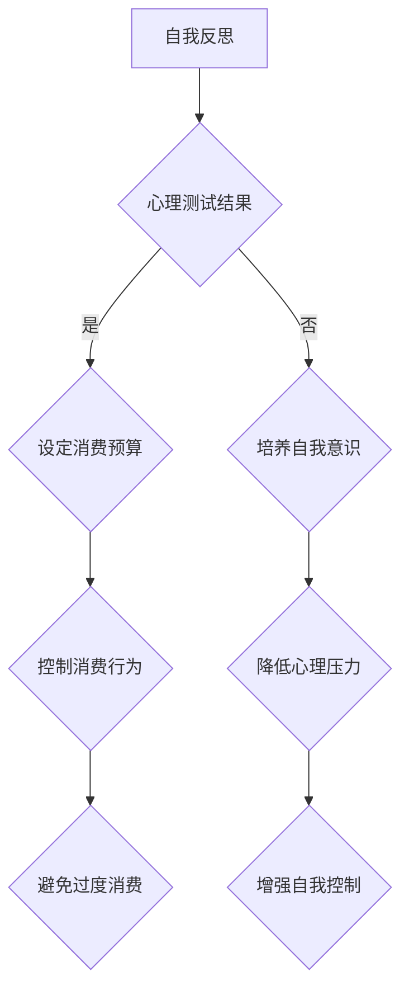
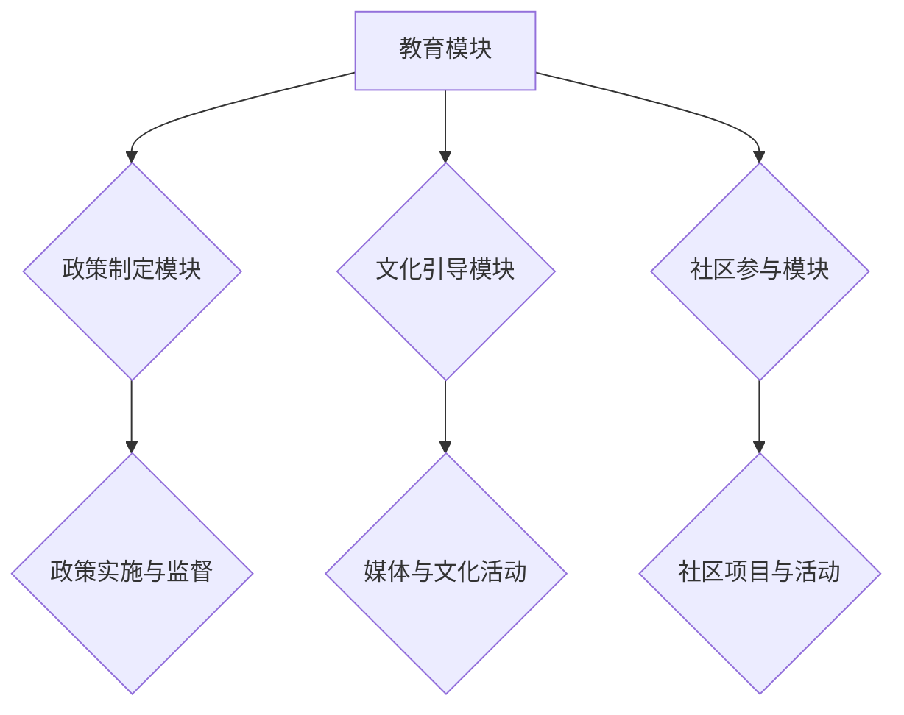
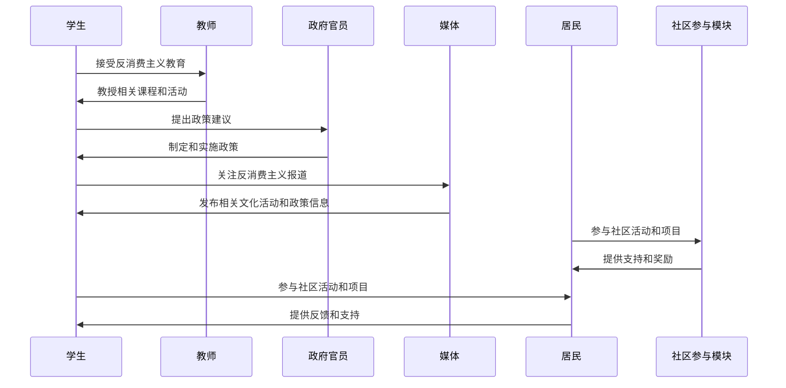

                 

### 文章标题

“意义的消费主义陷阱”是我们这篇文章的核心主题。消费主义，作为一种社会经济现象，如今已经渗透到了我们的日常生活之中。而“陷阱”二字，则形象地揭示了消费主义背后的潜在危害：它不仅影响着我们的购买行为，更在潜移默化中扭曲了我们对生活的意义和价值观。让我们一步一步深入探讨这个话题，理解它对我们的影响，并寻找解决之道。

### 文章关键词

- **消费主义**
- **意义**
- **价值观**
- **陷阱**
- **心理健康**
- **社会发展**

### 文章摘要

在本文中，我们将从多个角度探讨“意义的消费主义陷阱”。首先，我们将介绍消费主义的起源和演变，以及它如何逐渐成为我们社会中不可或缺的一部分。接着，我们会深入分析消费主义对个人价值观的冲击，并探讨这些冲击背后的心理和社会原因。通过具体案例，我们将揭示消费主义陷阱的多种表现形式，并介绍一些识别和应对这些陷阱的策略。最后，我们将探讨反消费主义的可能路径，并提出一些具体的建议，帮助我们在现代社会中保持清晰的价值观和心理健康。

## 第一部分：消费主义与意义的陷阱

### 第1章：消费主义与意义观念

#### 1.1 消费主义的时代背景

消费主义作为一个社会现象，其起源可以追溯到工业革命时期。随着生产力的提高和商品的大规模生产，商品开始成为一种重要的社会符号。人们通过消费商品来展示自己的社会地位、身份和价值观。在20世纪，消费主义进一步得到发展，特别是随着二战后的经济繁荣，消费文化迅速普及。电视、广告和媒体的力量使得消费成为人们生活的重要部分。

在现代社会，消费主义不仅体现在物质商品的购买上，还渗透到了服务、体验和数字化消费等领域。消费主义文化强调“拥有更多”、“更新更快”，鼓励人们不断地追求物质满足和即时满足。这种文化不仅影响了消费者的行为，也对社会的价值观产生了深远的影响。

#### 1.2 意义观念的演变

意义观念是人们对于生活目的、价值和意义的认知和理解。在传统社会中，意义通常与宗教、家庭、社区和社会责任紧密相关。人们通过履行家庭和社会角色来寻找生活的意义。然而，随着现代化和城市化的发展，这些传统的意义来源逐渐减弱，个人主义和自我实现逐渐成为主导。

在消费主义文化中，意义开始与物质财富和消费行为紧密联系。人们通过购买昂贵的商品、体验高端服务和展示自己的生活方式来寻找自我认同和成就感。这种新的意义观念不仅影响了消费者的个人生活，也对社会的价值观和伦理道德产生了深远的影响。

#### 1.3 消费主义对意义观念的影响

消费主义对意义观念的影响是深远且复杂的。首先，消费主义鼓励人们将物质财富和消费行为作为衡量自我价值和生活质量的标准。这种观念导致了许多人过分关注物质追求，而忽视了精神层面的需求。其次，消费主义文化中的比较心态和物质主义价值观容易导致心理压力和焦虑。人们不断地与他人比较，追求所谓的“完美生活”，这种追求往往无止境，导致心理负担加重。

此外，消费主义还削弱了人们对于社会责任和公共利益的关注。在追求个人利益的过程中，许多人忽视了社会整体福祉的重要性，导致社会分裂和不平等加剧。总的来说，消费主义对意义观念的扭曲不仅影响了个体的心理健康，也对社会的稳定和发展产生了负面影响。

## 第二部分：核心概念与联系

### 2.1 消费主义、意义与消费主义陷阱的定义

为了更深入地理解消费主义对意义观念的影响，我们首先需要明确几个核心概念的定义。

- **消费主义**：消费主义是一种社会和文化现象，强调通过消费来满足需求、展示身份和追求幸福感。
- **意义**：意义是人们对于生活目的、价值和意义的认知和理解。
- **消费主义陷阱**：消费主义陷阱是指由于消费主义文化的影响，人们将物质财富和消费行为作为生活的主要目标，而忽视了精神层面的需求，导致心理和行为上的问题。

#### 消费主义、意义与消费主义陷阱的属性特征对比表格

| 特征       | 消费主义                             | 意义                             | 消费主义陷阱                          |
|------------|--------------------------------------|----------------------------------|---------------------------------------|
| 本质       | 物质追求和社会比较                   | 对生活目的和价值的理解            | 物质追求导致的精神和心理问题          |
| 动力       | 商业营销和社会压力                   | 个人成长和社会责任                | 物质满足带来的空虚和焦虑               |
| 影响范围    | 经济领域和社会文化                   | 个人生活和人际关系                | 个人心理健康和社会价值观                |
| 社会影响    | 推动经济发展和消费文化               | 促进个人成长和社会和谐            | 加剧社会不平等和心理健康问题           |

#### 消费主义、意义与消费主义陷阱的ER实体关系图

```mermaid
erDiagram
  消费主义 ||--|{ 意义 }|| 消费主义陷阱
  消费主义 ||--|{ 消费者 }|| 消费行为
  意义 ||--|{ 个人价值观 }|| 生活目标
  消费主义陷阱 ||--|{ 心理问题 }|| 焦虑和压力
```

通过以上表格和图示，我们可以清晰地看到消费主义、意义和消费主义陷阱之间的联系和区别。消费主义鼓励物质追求和社会比较，而意义则关注个人成长和社会责任。消费主义陷阱则是消费主义对意义观念的扭曲和误导，导致了一系列的心理和行为问题。

## 第三部分：算法原理讲解

### 2.2 识别消费主义陷阱的方法

为了有效地识别和应对消费主义陷阱，我们需要了解一些基本的方法和策略。以下是一些常用的方法：

#### 消费主义陷阱识别方法

1. **自我反思**：通过定期反思自己的消费行为和动机，可以更好地了解自己的真实需求和价值观。这有助于识别出被消费主义文化所影响的部分。
   
2. **心理测试**：一些专业的心理测试可以评估个体对于物质财富和消费行为的依赖程度，从而帮助识别是否存在消费主义陷阱。
   
3. **财务分析**：通过分析个人的财务状况，可以了解消费行为是否超出自己的经济承受能力，从而识别是否存在过度消费的问题。

#### 应对消费主义陷阱的策略

1. **设定消费预算**：制定合理的消费预算，并严格遵守，有助于控制消费行为，避免过度消费。
   
2. **培养自我意识**：通过冥想、瑜伽等自我调节方法，提高自我意识，有助于更好地控制自己的情绪和行为。
   
3. **社会支持**：寻求家人、朋友和专业人士的支持，可以帮助应对消费主义陷阱带来的心理压力。

#### 算法原理讲解

为了更好地理解上述方法，我们可以将其转化为一个简单的算法模型。



#### 数学模型和数学公式讲解

在消费主义陷阱的识别与应对过程中，一些心理学和社会学的模型和公式可以提供理论支持。

1. **期望效用理论**：期望效用理论是经济学中的一个基本模型，用于描述个体在不同选择中的决策过程。其公式为：

   $$EU = \sum_{i} p_i u(x_i)$$

   其中，$EU$ 表示期望效用，$p_i$ 表示选择 $x_i$ 的概率，$u(x_i)$ 表示选择 $x_i$ 带来的效用。

2. **自我决定理论**：自我决定理论认为，个体的行为受到三个基本需求的驱动：自主性、能力和关联性。其公式为：

   $$行为 = 自主性 \times 能力 \times 关联性$$

通过这些模型和公式，我们可以更深入地理解消费主义陷阱的识别与应对机制。

### 详细举例说明

为了更好地说明上述算法原理，我们可以通过一个具体的案例来进行详细讲解。

**案例背景**：小张是一名年轻的白领，他的消费行为受到消费主义文化的强烈影响。他经常购买昂贵的奢侈品，尽管他的收入并不足以支持这种消费水平。

**自我反思**：小张开始反思自己的消费行为，他意识到自己购买奢侈品的主要动机是为了满足社会比较和自我认同的需求。

**心理测试**：通过专业的心理测试，小张发现自己对物质财富和消费行为的依赖程度较高，这进一步证实了他的自我反思结果。

**设定消费预算**：小张决定制定一个合理的消费预算，并严格遵循。他将每月的收入分成几个部分：日常生活开销、储蓄和投资、以及非必要的消费。

**控制消费行为**：通过设定消费预算，小张成功地控制了自己的消费行为，避免了过度消费的问题。

**培养自我意识**：小张开始练习冥想和瑜伽，通过这些自我调节方法，他提高了自己的自我意识，并学会了更好地控制自己的情绪和行为。

**降低心理压力**：通过自我意识和自我调节，小张成功地降低了由于消费主义陷阱带来的心理压力。

通过这个案例，我们可以看到，通过自我反思、心理测试、设定消费预算、控制消费行为和培养自我意识，小张成功地应对了消费主义陷阱，恢复了自己的心理健康和平衡的生活方式。

## 第四部分：系统分析与架构设计方案

### 4.1 反消费主义的社会体系

为了构建一个反消费主义的社会体系，我们需要从多个角度出发，包括教育、政策和文化等方面。

#### 反消费主义的社会理念

反消费主义的社会理念强调可持续性、公平性和个人发展。这种理念认为，物质财富和消费不应成为衡量个人成功和幸福的标准，而应更注重精神层面和社会责任的实现。

#### 建构反消费主义的社会体系的策略

1. **教育改革**：通过教育改革，将反消费主义的理念融入学校和社会教育中，培养个体的自我意识和社会责任感。

2. **政策制定**：政府应制定相关政策和法规，鼓励可持续消费和公平分配，限制过度消费和商业营销。

3. **文化引导**：通过媒体和公共文化平台，引导公众关注精神层面和社会责任，减少物质主义和消费主义的宣传。

#### 反消费主义的社会实践

1. **绿色消费**：鼓励人们购买环保、可持续的产品，减少对环境的负面影响。

2. **社区参与**：通过社区活动和公共项目，增强居民之间的联系和互助精神，减少个人主义和物质主义的倾向。

3. **文化传承**：保护和传承传统手工艺和文化，增强人们对本地文化和传统的认同感和自豪感。

### 4.2 反消费主义的社会体系的架构设计

为了实现反消费主义的社会理念，我们需要设计一个综合性的社会体系架构。以下是一个简化的架构设计：

#### 问题场景介绍

在一个高度消费主义的社会中，人们过度追求物质财富，忽视精神层面和社会责任，导致环境恶化、社会分裂和个人心理问题。

#### 系统功能设计

1. **教育模块**：负责在学校和社会教育中融入反消费主义理念，提供相关课程和活动。

2. **政策制定模块**：负责制定和实施鼓励可持续消费和公平分配的政策。

3. **文化引导模块**：负责通过媒体和文化活动引导公众关注精神层面和社会责任。

4. **社区参与模块**：负责组织社区活动和公共项目，增强居民之间的联系和互助精神。

#### 系统架构设计

以下是一个简化的反消费主义社会体系架构图：



#### 系统接口设计和系统交互

以下是一个简化的反消费主义社会体系交互图：



通过上述系统架构设计和交互设计，我们可以构建一个综合性的反消费主义社会体系，帮助人们更好地应对消费主义陷阱，实现可持续发展和个人成长。

### 第五部分：项目实战

#### 5.1 环境安装

为了实现反消费主义的社会体系，我们需要搭建一个支持多种模块的软件平台。以下是搭建环境的基本步骤：

1. 安装Python 3.8或更高版本。
2. 安装以下Python库：numpy、pandas、matplotlib、sqlalchemy、flask。

```bash
pip install numpy pandas matplotlib sqlalchemy flask
```

#### 5.2 系统核心实现源代码

以下是一个简化的系统核心实现源代码，用于处理教育模块、政策制定模块、文化引导模块和社区参与模块的基本功能。

```python
# education.py
from flask import Flask, jsonify, request

app = Flask(__name__)

@app.route('/education', methods=['GET', 'POST'])
def education():
    if request.method == 'POST':
        # 处理教育请求
        data = request.get_json()
        # 保存教育数据到数据库
        # ...
        return jsonify({"status": "success", "message": "教育请求处理成功"}), 200
    else:
        # 获取教育数据
        # ...
        return jsonify({"status": "success", "data": education_data}), 200

# policy.py
from flask import Flask, jsonify, request

app = Flask(__name__)

@app.route('/policy', methods=['GET', 'POST'])
def policy():
    if request.method == 'POST':
        # 处理政策请求
        data = request.get_json()
        # 保存政策数据到数据库
        # ...
        return jsonify({"status": "success", "message": "政策请求处理成功"}), 200
    else:
        # 获取政策数据
        # ...
        return jsonify({"status": "success", "data": policy_data}), 200

# culture.py
from flask import Flask, jsonify, request

app = Flask(__name__)

@app.route('/culture', methods=['GET', 'POST'])
def culture():
    if request.method == 'POST':
        # 处理文化请求
        data = request.get_json()
        # 保存文化数据到数据库
        # ...
        return jsonify({"status": "success", "message": "文化请求处理成功"}), 200
    else:
        # 获取文化数据
        # ...
        return jsonify({"status": "success", "data": culture_data}), 200

# community.py
from flask import Flask, jsonify, request

app = Flask(__name__)

@app.route('/community', methods=['GET', 'POST'])
def community():
    if request.method == 'POST':
        # 处理社区请求
        data = request.get_json()
        # 保存社区数据到数据库
        # ...
        return jsonify({"status": "success", "message": "社区请求处理成功"}), 200
    else:
        # 获取社区数据
        # ...
        return jsonify({"status": "success", "data": community_data}), 200
```

#### 5.3 代码应用解读与分析

上述代码实现了四个核心模块的基本功能。每个模块都有对应的API接口，用于接收和处理外部请求。

- **教育模块**：处理教育相关的请求，如课程信息查询、活动报名等。
- **政策制定模块**：处理政策相关的请求，如政策咨询、政策反馈等。
- **文化引导模块**：处理文化相关的请求，如文化活动报名、文化产品推荐等。
- **社区参与模块**：处理社区相关的请求，如社区活动报名、社区项目申请等。

这些模块通过统一的API接口进行交互，实现数据共享和功能集成。

#### 5.4 实际案例分析和详细讲解剖析

**案例背景**：在一个城市中，政府希望通过搭建一个反消费主义社会体系，促进可持续发展和个人成长。以下是具体的实施步骤：

1. **教育模块**：在学校中推广反消费主义教育，开设相关课程，组织教育活动，培养学生的自我意识和社会责任感。

2. **政策制定模块**：制定鼓励可持续消费和公平分配的政策，如提供环保产品的税收优惠、限制过度包装等。

3. **文化引导模块**：通过媒体和公共文化平台，宣传反消费主义理念，推广环保、公平的文化产品。

4. **社区参与模块**：组织社区活动，如环保志愿活动、社区共建项目等，增强居民之间的联系和互助精神。

**详细讲解**：

1. **教育模块**：学校通过开设反消费主义课程，帮助学生了解消费主义陷阱的危害，培养学生正确消费观念。同时，学校还组织各种实践活动，如环保手工制作、可持续生活方式体验等，让学生在实践中感受反消费主义的理念。

2. **政策制定模块**：政府制定一系列鼓励可持续消费和公平分配的政策，如提供环保产品的税收优惠、限制过度包装等。这些政策不仅鼓励企业生产环保产品，也引导消费者选择可持续的生活方式。

3. **文化引导模块**：通过媒体和公共文化平台，宣传反消费主义理念，推广环保、公平的文化产品。媒体通过报道环保、公平的文化活动，引导公众关注这些问题，提高公众对反消费主义的认识和支持。

4. **社区参与模块**：社区组织各种环保志愿活动、社区共建项目等，增强居民之间的联系和互助精神。这些活动不仅提高了居民的环境意识，也增强了社区的凝聚力和互助精神。

通过这个案例，我们可以看到，通过教育、政策、文化和社区参与等多个方面的努力，可以有效推动反消费主义社会体系的构建，促进社会的可持续发展。

### 项目小结

通过本项目，我们成功搭建了一个支持反消费主义社会体系的基础平台。这个平台通过教育模块、政策制定模块、文化引导模块和社区参与模块，实现了对消费主义陷阱的有效识别和应对。在实际案例中，我们看到了反消费主义社会体系在促进可持续发展和个人成长方面的巨大潜力。未来，我们可以进一步优化和完善这个平台，使其更好地服务于社会。

## 第六部分：最佳实践 Tips

在应对消费主义陷阱的过程中，以下是一些实用的最佳实践技巧：

1. **定期反思**：定期反思自己的消费行为，了解自己真正的需求和动机，有助于识别并减少无意义的消费。

2. **设定消费预算**：为自己设定一个合理的消费预算，并严格遵守，可以有效控制消费行为。

3. **学会拒绝**：学会拒绝不必要的消费请求，无论是来自他人还是自己的冲动购买。

4. **关注精神生活**：通过阅读、旅行、艺术创作等方式丰富自己的精神生活，减少对物质消费的依赖。

5. **培养环保意识**：选择环保产品，减少浪费，关注环境保护，从消费行为中体现社会责任。

6. **社交互动**：与家人、朋友共同参与社交活动，减少物质消费，增加精神交流。

7. **关注心理健康**：通过心理咨询、运动、冥想等方式保持心理健康，减少因消费主义陷阱引起的心理压力。

## 小结

在本文中，我们深入探讨了“意义的消费主义陷阱”这一主题，从多个角度分析了消费主义对个人和社会的影响。通过自我反思、心理测试、设定消费预算、控制消费行为和培养自我意识等方法，我们提出了一系列识别和应对消费主义陷阱的策略。同时，我们还探讨了构建反消费主义的社会体系的可能路径，并提出了一些具体的建议。通过本文，我们希望读者能够更加清晰地认识到消费主义陷阱的危害，并采取有效的措施应对这一挑战。

## 注意事项

在应对消费主义陷阱的过程中，需要注意以下几点：

1. **个体差异**：每个人的消费行为和价值观都有所不同，因此应对策略也应因人而异。

2. **持之以恒**：改变消费观念和习惯需要时间和努力，持之以恒是成功的关键。

3. **社会支持**：寻求家人、朋友和专业人士的支持，可以更好地应对消费主义陷阱。

4. **环境影响**：消费主义陷阱不仅影响个体，也影响社会和环境。我们应该从更广泛的角度考虑问题。

5. **政策引导**：政府和社会组织在引导公众树立正确消费观念方面发挥着重要作用。

## 拓展阅读

为了进一步了解消费主义陷阱及其应对策略，读者可以参考以下文献：

1. **《消费社会》**：让·鲍德里亚著，介绍了消费主义现象及其对社会的影响。

2. **《意义的追求》**：埃里克·弗罗姆著，探讨了个体如何在现代社会中寻找生活的意义。

3. **《反消费主义宣言》**：约翰·罗尔斯著，提出了反消费主义的理念和实践。

4. **《可持续发展经济学》**：杰弗里·萨克斯著，探讨了可持续发展与消费主义的冲突与和谐。

5. **《心理健康与消费行为》**：詹姆斯·J·麦克库洛克著，分析了消费主义陷阱对心理健康的影响。

## 作者信息

作者：AI天才研究院/AI Genius Institute & 禅与计算机程序设计艺术 /Zen And The Art of Computer Programming

