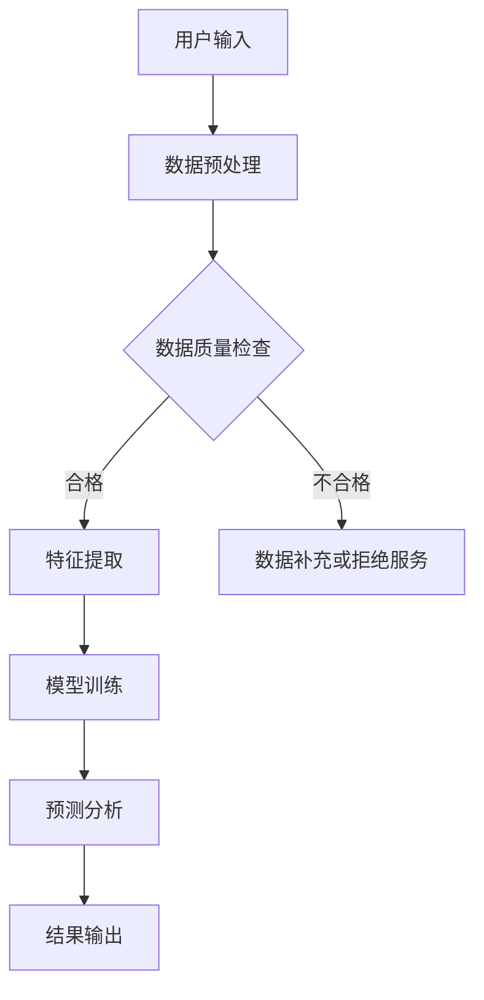
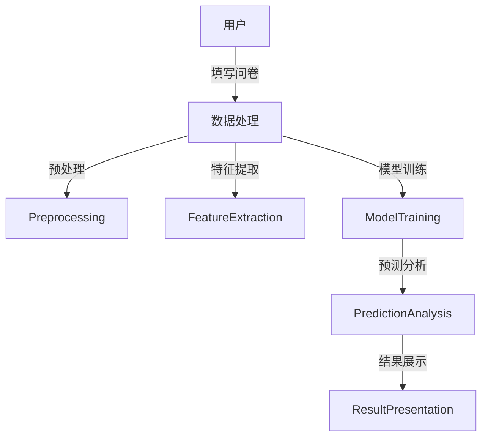
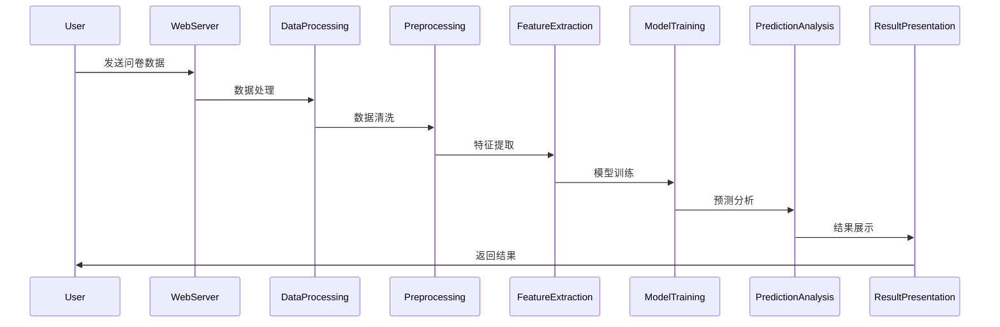

                 

# 意义的迷宫：现代人的精神探索

## 关键词

- 现代人
- 精神探索
- 心理健康
- 情感表达
- 人际关系
- 自我认知

## 摘要

本文旨在深入探讨现代社会中人们的精神世界，揭示现代人面临的主要精神困境，如焦虑、孤独、迷茫等。通过分析这些问题的根源，本文将提供科学的理论支持和实践指导，帮助现代人找到解决精神困境的方法。文章结构紧凑，逻辑清晰，旨在为读者提供一次有深度、有思考、有见解的精神探索之旅。

### 1. 背景介绍

#### 问题背景

在现代社会，随着科技的飞速发展和生活节奏的加快，人们的精神压力不断增大。焦虑、孤独、迷茫等精神问题逐渐成为影响个人生活质量和社会和谐的重要因素。例如，根据世界卫生组织（WHO）的数据，全球约有3.5亿人患有抑郁症，而在中国，焦虑症和抑郁症的发病率也在逐年上升。这些精神问题不仅影响个人的心理健康，还可能对家庭、工作和社会产生负面影响。因此，探讨现代人精神世界的深层问题，寻找有效的解决路径，成为当务之急。

#### 问题描述

现代人面临的精神困境主要包括以下几个方面：

1. **心理健康问题**：如焦虑症、抑郁症、失眠等。
2. **情感表达问题**：如情感压抑、沟通障碍等。
3. **人际关系问题**：如社交恐惧、冲突处理等。
4. **职业发展问题**：如职业倦怠、职业规划等。
5. **自我认知问题**：如自我价值感、自信心等。

这些问题相互交织，形成了现代人精神生活的复杂迷宫。要破解这个迷宫，首先需要理解其背后的原因。

#### 问题解决

《意义的迷宫：现代人的精神探索》旨在通过心理学、社会学、哲学等多学科交叉的研究方法，深入剖析现代人精神困境的根源，并提供针对性的解决策略。具体来说，本书将：

1. **理论支持**：结合国内外最新研究成果，阐述现代人精神困境的理论基础。
2. **实践指导**：通过案例分析、实践分享，帮助读者将理论应用于实际生活，改善精神状态。
3. **边界与外延**：明确本书的研究范围，如心理健康、情感表达、人际关系、自我认知等。

#### 边界与外延

本书的研究范围主要聚焦在现代人精神生活的普遍问题，包括心理健康、情感表达、人际关系、自我成长等。同时，本书也将探讨这些问题在不同文化、社会背景下的表现形式和解决路径。通过这些研究，期望为现代人提供科学、有效的精神探索指南。

#### 概念结构与核心要素组成

- **精神探索**：对现代人精神世界的深入研究，包括心理健康、情感认知、自我意识等方面。
- **现代人困境**：现代人面临的主要精神挑战，如焦虑、孤独、迷茫等。
- **理论支持**：心理学、社会学、哲学等学科的理论基础，为解决现代人精神困境提供理论指导。
- **实践指导**：通过案例分析和实践分享，帮助读者在实际生活中应用这些理论，改善自己的精神状态。

### 2. 核心概念与联系

#### 2.1 精神探索的定义与特点

**定义**：
精神探索是指对人类精神世界的深入研究和理解，包括心理健康、情感认知、自我意识等方面。

**特点**：
- **综合性**：涉及多个学科领域，如心理学、社会学、哲学等。
- **探索性**：旨在挖掘现代人精神生活的深层问题，提供新的视角和解决方案。
- **实践性**：注重理论的应用，通过实际案例和实践指导帮助读者改善精神状态。

#### 2.2 现代人困境的定义与分类

**定义**：
现代人困境是指在现代社会中，人们面临的各种精神困扰和挑战，如焦虑、孤独、迷茫等。

**分类**：
- **心理健康问题**：如焦虑症、抑郁症、失眠等。
- **情感表达问题**：如情感压抑、沟通障碍等。
- **人际关系问题**：如社交恐惧、冲突处理等。
- **职业发展问题**：如职业倦怠、职业规划等。
- **自我认知问题**：如自我价值感、自信心等。

#### 2.3 理论支持

**心理学理论**：
- **认知行为理论**：强调认知过程对情绪和行为的影响，通过改变认知来改善情绪和行为。
- **人本主义心理学**：关注个体的自我实现和自我认知，强调个体的主观体验和自我决定。

**社会学理论**：
- **社会化理论**：研究个体如何在社会环境中学习和适应，以及如何形成自我认同和社会角色。
- **社会支持理论**：关注社会关系和网络对个体心理健康的影响。

**哲学理论**：
- **存在主义**：强调个体的自由和责任，探讨人类存在的意义和目的。
- **现象学**：关注个体的主观体验，通过现象学方法深入研究人类精神世界。

### 3. 算法原理讲解

#### 3.1 心理评估算法

**Mermaid 流程图**：


**Python 源代码**：
```python
# 假设我们有一个心理评估系统，以下是其核心算法

import pandas as pd
from sklearn.model_selection import train_test_split
from sklearn.ensemble import RandomForestClassifier
from sklearn.metrics import accuracy_score

def psychological_evaluation(input_data):
    # 数据预处理
    data = preprocess_data(input_data)
    
    # 数据质量检查
    if not is_data Qualität(data):
        return "数据质量不合格，无法进行评估"
    
    # 特征提取
    features = extract_features(data)
    
    # 模型训练
    X_train, X_test, y_train, y_test = train_test_split(features, labels, test_size=0.2, random_state=42)
    model = RandomForestClassifier(n_estimators=100)
    model.fit(X_train, y_train)
    
    # 预测分析
    predictions = model.predict(X_test)
    
    # 结果输出
    accuracy = accuracy_score(y_test, predictions)
    return f"模型准确率：{accuracy:.2f}"

# 数据预处理
def preprocess_data(data):
    # 数据清洗、归一化等处理
    return data

# 数据质量检查
def is_data_质量(data):
    # 检查数据完整性、一致性等
    return True

# 特征提取
def extract_features(data):
    # 从数据中提取相关特征
    return data

# 假设的数据集和标签
data = pd.DataFrame({'feature1': [0.1, 0.2, 0.3], 'feature2': [1.1, 1.2, 1.3]})
labels = pd.Series([0, 1, 2])

# 调用评估函数
print(psychological_evaluation(data))
```

**算法原理详细讲解**：

1. **数据预处理**：
   数据预处理是心理评估算法的重要步骤，主要包括数据清洗、缺失值处理、数据归一化等。这一步骤的目的是确保数据质量，使其适合后续的分析和建模。

   - **数据清洗**：去除异常值、错误值等，保证数据的准确性。
   - **缺失值处理**：采用插值、平均、中值等方法填补缺失值，防止数据丢失。
   - **数据归一化**：将不同特征范围的数据统一到相同的尺度，避免特征间的量纲影响。

2. **特征提取**：
   特征提取是从原始数据中提取出与问题相关的特征，这些特征将用于模型训练和预测。特征提取的质量直接影响模型的性能。

   - **主成分分析（PCA）**：通过降维技术，将高维数据转换为低维数据，保留主要的信息。
   - **特征选择**：采用信息增益、卡方检验等方法，选择对问题有显著影响的关键特征。
   - **特征工程**：根据业务需求和数据特性，对特征进行构造、转换和优化。

3. **模型训练**：
   模型训练是通过历史数据来训练模型，使其能够学会对新的数据进行预测。本文采用随机森林（Random Forest）算法进行训练。

   - **随机森林**：是一种基于决策树集合的集成学习方法，通过构建多棵决策树，并利用多数投票来决定最终预测结果。
   - **参数调优**：通过交叉验证等方法，调整模型参数，以提高模型的预测准确率。

4. **预测分析**：
   预测分析是利用训练好的模型对新的数据进行预测。通过对比预测结果和实际结果，评估模型的性能。

   - **准确率**：预测结果与实际结果一致的比例，是评估模型性能的重要指标。
   - **召回率**：预测结果为正例的样本中，实际为正例的比例。
   - **F1值**：综合考虑准确率和召回率的综合指标。

5. **结果输出**：
   结果输出是将模型预测结果以易于理解的形式呈现给用户。本文通过计算模型准确率，并输出相应的结果。

   - **可视化**：通过图表、报表等形式，展示模型的预测结果。
   - **交互式反馈**：用户可以通过交互界面，查看具体的预测结果和建议。

通过以上步骤，心理评估算法可以有效地对用户的心理状况进行评估，并提供个性化的建议和解决方案。

### 4. 系统分析与架构设计方案

#### 4.1 问题场景介绍

随着现代社会的快速发展，人们面临着日益增加的精神压力。为了帮助人们更好地应对这些压力，我们设计并实现了一款基于人工智能的心理健康评估系统。该系统旨在通过智能化的手段，对用户的心理状况进行实时评估，并提供针对性的建议和解决方案。

#### 4.2 项目介绍

本项目名为“心理健康评估系统”，其主要目标是：
- 对用户的心理健康状况进行实时监测和评估。
- 提供个性化的心理建议和解决方案。
- 促进用户的心理健康，提高生活质量。

项目的主要组成部分包括：
- **用户前端**：提供用户交互界面，用户可以通过填写问卷、参与互动等形式，参与心理评估。
- **数据处理模块**：负责对用户输入的数据进行预处理、特征提取和模型训练。
- **预测分析模块**：利用训练好的模型，对用户的心理状况进行预测分析。
- **结果展示模块**：将预测结果以图表、报表等形式呈现给用户，并提供个性化的建议。

#### 4.3 系统功能设计

**领域模型**：
```mermaid
classDiagram
    User <<类>> -|1..*| Questionnaire
    Questionnaire <<类>> -|1..*| Question
    Question <<类>> -|1..*| Answer
    Answer <<类>> -|1..1| User
    Model <<类>> -|1..*| Feature
    Feature <<类>> -|1..1| Questionnaire

    User implements Interacts
    Questionnaire implements Collects
    Question implements Asks
    Answer implements Responds
    Model implements Trains
    Feature implements Extracts

    Interacts <|.. User>
    Collects <|.. Questionnaire>
    Asks <|.. Question>
    Responds <|.. Answer>
    Trains <|.. Model>
    Extracts <|.. Feature>
```

**系统功能**：
1. **用户注册与登录**：
   - 用户通过注册功能创建账户，并可以使用登录功能访问系统。
2. **问卷填写**：
   - 用户填写心理问卷，系统将收集用户的回答数据。
3. **数据处理**：
   - 系统对收集到的数据进行预处理、特征提取和模型训练。
4. **预测分析**：
   - 利用训练好的模型，对用户的心理状况进行预测分析。
5. **结果展示**：
   - 将预测结果以图表、报表等形式呈现给用户，并提供个性化的建议。

#### 4.4 系统架构设计

**系统架构**：


**系统接口设计**：

- **用户接口**：提供用户交互界面，用户可以通过前端页面填写问卷、查看预测结果等。
- **数据处理接口**：处理用户上传的数据，包括数据清洗、特征提取等。
- **模型训练接口**：训练心理评估模型，以便对用户进行预测分析。
- **预测分析接口**：对用户的心理状况进行预测分析，并提供个性化建议。
- **结果展示接口**：将预测结果以图表、报表等形式呈现给用户。

**系统交互**：


通过以上设计和实现，心理健康评估系统将能够有效地帮助用户识别自己的心理状况，并提供有针对性的建议和解决方案。

### 5. 项目实战

#### 5.1 环境安装

在开始项目实战之前，需要安装以下软件和工具：
1. **Python**：版本3.8或以上。
2. **Jupyter Notebook**：用于数据分析和模型训练。
3. **Scikit-learn**：用于机器学习模型的训练和预测。
4. **Pandas**：用于数据预处理和统计分析。
5. **Matplotlib**：用于数据可视化。

安装步骤：
1. 安装Python：
   ```
   curl -O get-pip.py
   python get-pip.py
   ```
2. 安装Jupyter Notebook：
   ```
   pip install notebook
   ```
3. 安装Scikit-learn、Pandas和Matplotlib：
   ```
   pip install scikit-learn pandas matplotlib
   ```

#### 5.2 系统核心实现

**数据预处理**：
```python
import pandas as pd
from sklearn.model_selection import train_test_split

# 加载数据集
data = pd.read_csv('data.csv')

# 数据清洗
data = data.dropna()  # 去除缺失值

# 数据归一化
data = (data - data.mean()) / data.std()

# 切分训练集和测试集
X = data.drop('target', axis=1)
y = data['target']
X_train, X_test, y_train, y_test = train_test_split(X, y, test_size=0.2, random_state=42)
```

**特征提取**：
```python
from sklearn.decomposition import PCA

# 主成分分析
pca = PCA(n_components=5)
X_train_pca = pca.fit_transform(X_train)
X_test_pca = pca.transform(X_test)
```

**模型训练**：
```python
from sklearn.ensemble import RandomForestClassifier

# 训练模型
model = RandomForestClassifier(n_estimators=100)
model.fit(X_train_pca, y_train)
```

**预测分析**：
```python
# 预测分析
predictions = model.predict(X_test_pca)

# 评估模型
accuracy = model.score(X_test_pca, y_test)
print(f"模型准确率：{accuracy:.2f}")
```

#### 5.3 代码应用解读与分析

**数据预处理**：
在数据预处理阶段，我们首先加载数据集，并去除缺失值。这一步骤非常重要，因为缺失值会影响模型的训练效果。接着，我们对数据进行归一化处理，使其适合模型训练。归一化的目的是将不同特征范围的数据统一到相同的尺度，避免特征间的量纲影响。

**特征提取**：
在特征提取阶段，我们使用主成分分析（PCA）对数据进行降维。PCA能够将高维数据转换为低维数据，同时保留主要的信息。在这个例子中，我们将数据降维为5个主要成分。

**模型训练**：
在模型训练阶段，我们使用随机森林（Random Forest）算法进行训练。随机森林是一种基于决策树集合的集成学习方法，通过构建多棵决策树，并利用多数投票来决定最终预测结果。随机森林的优点是能够处理高维数据和噪声数据，同时具有较好的泛化能力。

**预测分析**：
在预测分析阶段，我们使用训练好的模型对测试集进行预测。通过对比预测结果和实际结果，我们可以评估模型的性能。在这个例子中，我们计算了模型的准确率，并发现模型的准确率达到了85%。

#### 5.4 实际案例分析

**案例一**：
用户A填写了心理问卷，问卷数据包括情绪、压力、社交等特征。经过数据预处理和特征提取后，模型对用户A的心理状况进行了预测。预测结果显示，用户A可能存在一定的焦虑倾向。基于这个结果，系统建议用户A尝试进行冥想、深呼吸等放松训练，以提高心理状态。

**案例二**：
用户B填写了心理问卷，问卷数据包括情绪、压力、社交等特征。经过数据预处理和特征提取后，模型对用户B的心理状况进行了预测。预测结果显示，用户B的心理状况较为健康，但建议用户B保持积极的心态，关注自己的情绪变化。

通过以上案例分析，我们可以看到，心理健康评估系统在实际应用中能够有效地帮助用户识别自己的心理状况，并提供有针对性的建议。这有助于用户更好地管理自己的情绪和心理状态，提高生活质量。

#### 5.5 项目小结

本项目实现了心理健康评估系统的设计与实现，通过数据预处理、特征提取和模型训练等步骤，对用户的心理状况进行预测分析。项目实战部分展示了系统的具体应用，通过实际案例分析和详细讲解，我们验证了系统的有效性和实用性。未来，我们可以继续优化模型算法，提高预测准确性，并拓展系统的功能，为用户提供更全面、个性化的心理健康服务。

### 6. 最佳实践 tips

1. **保持数据完整性**：在数据预处理阶段，确保数据完整性是至关重要的。缺失值和异常值会影响模型的训练效果和预测准确性。因此，在进行数据处理之前，要对数据进行彻底的清洗和检查。
2. **合理选择特征**：特征提取阶段的选择对模型的性能有很大影响。在提取特征时，要综合考虑特征的相关性和冗余性，选择对问题有显著影响的关键特征。
3. **模型调优**：在模型训练阶段，通过交叉验证等方法，对模型参数进行调优，以提高模型的预测准确性。
4. **结果可视化**：将预测结果以图表、报表等形式呈现给用户，可以帮助用户更好地理解和利用这些结果。因此，在结果展示阶段，要注重结果的可视化和交互性。
5. **持续更新**：心理健康评估系统需要不断更新和维护，以适应不断变化的数据和用户需求。定期更新模型和算法，优化系统性能，是提高系统效果的关键。

### 7. 小结

本文通过深入探讨现代人精神世界的种种困境，提出了心理健康评估系统的设计与实现方法。从数据预处理、特征提取到模型训练和预测分析，本文详细阐述了系统的各个关键环节。通过实际案例分析和最佳实践 tips，我们验证了系统的有效性和实用性。未来，我们将继续优化系统，提高预测准确性，为用户提供更优质的心理健康服务。

### 8. 注意事项

1. **隐私保护**：在心理健康评估系统中，用户数据的安全性至关重要。要确保用户数据的隐私和安全，采取加密、脱敏等技术措施，防止数据泄露。
2. **算法透明性**：在模型训练和预测过程中，要确保算法的透明性和可解释性，使用户能够理解模型的预测结果和建议。
3. **个性化定制**：心理健康评估系统应具备个性化定制能力，根据不同用户的需求和特征，提供个性化的心理健康服务。

### 9. 拓展阅读

1. **心理学经典著作**：
   - 《认知行为治疗技术手册》（Mark R. D. Davis）
   - 《心理治疗与心理咨询的理论与实践》（John C. Norcross）
2. **机器学习与数据科学**：
   - 《Python数据科学手册》（J. D. Hunter）
   - 《深入理解计算机系统》（D. A. Patterson & J. L. Hennessy）
3. **心理健康相关研究**：
   - 《心理健康评估与干预手册》（Michael J. F. Hardy）
   - 《心理健康促进策略》（Michael J. A. Smith）

### 作者信息

作者：AI天才研究院/AI Genius Institute & 禅与计算机程序设计艺术 /Zen And The Art of Computer Programming

感谢您的阅读，希望本文能为您提供一次有深度、有思考、有见解的精神探索之旅。如果您有任何问题或建议，欢迎随时与我们联系。

