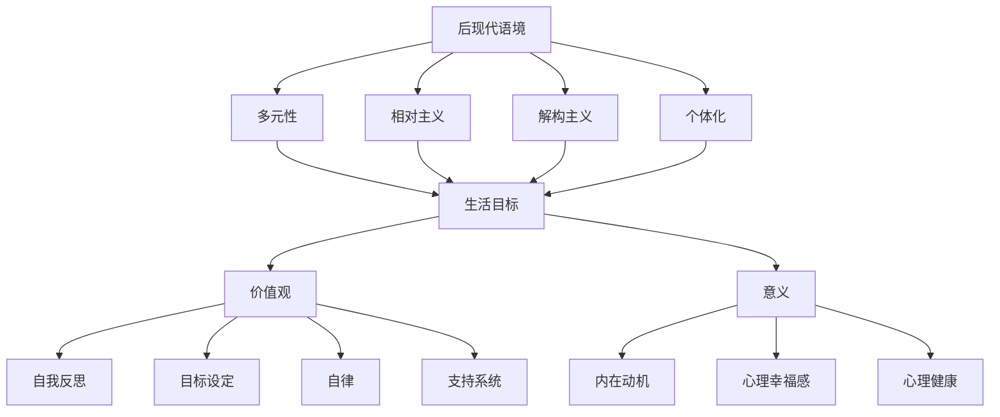

                 

### 问题的背景

在21世纪，随着全球化的加速、科技的迅猛发展以及信息爆炸时代的到来，社会结构和文化观念发生了深刻的变革。后现代主义作为一种哲学思潮，开始在全球范围内兴起，并对传统价值观、知识和真理提出了挑战。这种思潮深刻影响了现代人的生活，尤其是对于生活目标的重新定义和认知。

首先，后现代主义对传统价值观的解构使得人们开始质疑现有的生活方式和目标。传统的价值观往往建立在集体主义和统一标准之上，强调个人应该为集体、社会或国家作出贡献。然而，后现代主义倡导的是多元性、差异性和个体的独特性，鼓励人们根据自己的需求和价值观来构建生活目标。这种转变使得个体不再仅仅被视为社会机器的一个齿轮，而是具有独立意识和自主选择能力的个体。

其次，科技的迅猛发展，特别是互联网和人工智能技术的普及，改变了人们获取信息、交流互动和生活方式的方式。人们可以通过网络轻松地获取全球各地的信息，这种信息的自由流动促进了思想的多样性和开放性。同时，人工智能技术的应用也在不断改变人类的劳动形态和社会分工，对人们的工作、学习和生活方式产生了深远的影响。这些变化迫使人们重新思考自己的生活目标，以适应新的社会和技术环境。

此外，信息爆炸时代的到来使得人们面对海量的信息，需要具备筛选和解读的能力。信息过载导致了许多人感到焦虑和迷茫，难以找到真正有意义的事物。在这种情况下，生活目标变得尤为重要，因为它们为人们提供了方向和动力，帮助他们在纷繁复杂的世界中找到自己的位置和意义。

总的来说，后现代语境下的生活目标面临着前所未有的挑战和机遇。一方面，人们需要重新审视和定义自己的目标，以适应新的社会和技术环境；另一方面，多元化和个性化的目标设定也为个体提供了更多的选择和发展空间。在这个背景下，对生活目标的重构不仅是个体自我实现的途径，也是社会进步和创新的动力源泉。因此，探讨后现代语境下生活目标的重构，具有重要的理论和实践意义。

### 问题概述

在现代社会中，许多人感到迷茫和焦虑，缺乏明确的生活目标。这种现象的出现，一方面源于后现代语境对传统价值观的解构，使人们不再认同单一的、统一的目标设定方式；另一方面，随着科技的迅猛发展和信息爆炸，个体需要面对更加复杂和多变的情境，从而增加了目标的多元性和不确定性。下面，我们将具体分析导致这种现象的原因。

首先，后现代主义的兴起对传统价值观提出了质疑，认为个体应该追求多样化和个性化。这种思潮打破了传统社会对个体行为和目标的统一规范，使得人们在设定生活目标时更加注重自身的独特性和个体价值。然而，这种多元性也带来了目标设定的困惑。在面对多种选择和可能时，个体往往难以做出明确的决策，导致目标模糊不清。

其次，科技的发展，特别是互联网和人工智能技术的普及，改变了人们获取信息、交流互动和生活方式的方式。一方面，这些技术为个体提供了更多的信息来源和交流渠道，使得目标的选择变得更加多样；另一方面，信息过载和复杂化的现象也使得个体难以有效地筛选和处理这些信息。这种情况下，人们容易迷失在信息的海洋中，无法找到真正有意义的目标。

此外，现代社会的工作和生活方式也加剧了目标设定的困惑。随着全球化的推进和市场竞争的加剧，许多人不得不在工作和生活中追求更高的效率和绩效。然而，这种追求往往导致个体在短期目标上过分注重，而忽视了长期目标和整体生活的平衡。长期的单一目标追求不仅容易导致个体的心理疲劳和焦虑，还可能影响他们的身体健康和社会关系。

再者，社会文化的变化也对生活目标产生了影响。现代社会强调个人主义和自我实现，鼓励个体追求自己的梦想和目标。然而，这种文化氛围也带来了一种压力，使得个体在追求目标时容易陷入自我中心的困境，忽视了与他人和社会的互动。这种情况下，个体的目标虽然多样和个性化，但往往缺乏真正的意义和价值。

综上所述，现代社会中缺乏明确生活目标的现象，是由多种因素共同作用的结果。后现代主义的兴起、科技的发展、社会文化的变化以及个体在面对多元选择时的困惑，都是导致这种现象的重要因素。理解这些原因，有助于我们找到解决这一问题的方法，为个体和社会提供更为明确的指导和帮助。

### 解决方法

在面对现代社会中缺乏明确生活目标的问题时，重构意义的追求成为了一个可行的解决方法。通过重新审视和定义生活目标，个体可以在复杂多变的社会环境中找到自己的方向和意义。以下将从三个方面详细探讨如何重构意义的追求。

#### 1. 重新审视个体价值观

首先，重构意义的追求需要从个体价值观入手。价值观是个体对事物的重要性和意义的认知和评价，是指导个体行为和决策的基本准则。在后现代语境下，个体需要对自己的价值观进行深入的反思和审视，确定哪些价值观是真正对自己有意义的。这不仅可以帮助个体明确自己的目标，还可以减少在目标选择上的困惑。

具体步骤如下：

1. **自我反思**：个体可以通过写日记、冥想或与他人交流等方式，反思自己的价值观。在这个过程中，要诚实地面对自己的内心，分析哪些价值观是真正重要的，哪些只是社会压力或他人期望强加给自己的。

2. **价值观排序**：在反思的基础上，将价值观进行排序，确定哪些价值观是最核心的，哪些是次重要的。这一步骤有助于个体明确自己在不同情境下应优先考虑的价值观。

3. **价值观修正**：根据排序结果，对现有的价值观进行修正。如果某些价值观与自己的内心冲突，需要对其进行调整，以更好地反映自己的真实需求和愿望。

#### 2. 设定明确的目标

在明确个体价值观之后，下一步是设定具体的生活目标。明确的目标不仅能够为个体提供清晰的方向，还可以减少生活中的迷茫和焦虑。设定目标时，可以遵循以下原则：

1. **SMART原则**：目标应具有明确的特征，即具体（Specific）、可衡量（Measurable）、可达成（Achievable）、相关（Relevant）和有时间限制（Time-bound）。这一原则有助于确保目标既具有挑战性，又能够实际操作。

2. **分解目标**：将长期目标分解为一系列短期目标，以便于逐步实现。每个短期目标都应具有明确的实施步骤和时间表。

3. **目标优化**：在目标设定过程中，要不断反思和调整目标，确保它们符合自己的价值观和实际情况。

#### 3. 实现目标的行动策略

设定目标只是第一步，实现目标同样重要。以下是一些有助于实现目标的行动策略：

1. **制定行动计划**：将目标转化为具体的行动计划，包括每天或每周需要完成的任务。这有助于确保目标的逐步实现。

2. **培养自律**：实现目标需要自律，个体需要培养良好的时间管理和自律能力，以确保计划的执行。

3. **持续反思与调整**：在目标实现过程中，要定期反思自己的进展，并根据实际情况进行调整。这有助于保持目标的动力和方向。

4. **建立支持系统**：与他人分享目标，并建立一个支持系统，包括家人、朋友或同事。他们的鼓励和反馈可以帮助个体克服困难，保持动力。

通过以上三个步骤，个体可以在后现代语境下重构意义的追求，找到明确的生活目标，并实现自我价值的提升。这一过程不仅有助于个体的心理健康和生活质量的提高，也为社会的进步和和谐提供了支持。

### 核心概念：后现代语境

#### 1.1 特征与影响

后现代主义作为一种哲学和文化思潮，起源于20世纪中叶，是对现代性的一种反思和批判。后现代语境具有以下几个显著特征：

1. **多元性**：后现代语境强调多样性和差异，反对现代主义的统一性和普遍性。在现代社会，个体面对的是多元的文化、价值观和生活方式，这种多元性使得生活目标的选择变得更加复杂。

2. **相对主义**：后现代语境认为真理和知识是相对的，而非绝对的。这意味着个体在设定生活目标时，需要根据自身的价值观和情境来决定，而不是依赖传统或权威的指导。

3. **解构主义**：后现代语境中的解构主义思想对传统结构和秩序进行了质疑和分解。这包括对权力结构、社会规范和文化符号的解构，使得个体能够更自由地构建自己的意义体系。

4. **个体化**：后现代语境强调个体的独特性和自主性，鼓励个体根据自己的需求和愿望来设定生活目标。这种个体化趋势打破了传统的集体主义和统一标准，使得目标设定更加个性化和多样化。

后现代语境对生活目标的影响主要体现在以下几个方面：

1. **目标选择的多样化**：由于后现代语境的多元性和相对主义，个体在设定生活目标时有了更多的选择。这种多样性不仅提供了更多的机会，也增加了个体在目标选择上的困惑。

2. **目标的相对性**：后现代语境认为生活目标是相对的，而不是绝对的。这要求个体在设定目标时，需要考虑自己的价值观和具体情境，而不是盲目追求一般性的标准。

3. **意义重构的需求**：后现代语境对传统价值观的解构，使得人们需要重新审视和重构自己的意义体系。这意味着个体需要在多元的选择中找到属于自己的意义，以应对社会和文化的变革。

4. **个体自主性增强**：后现代语境鼓励个体自主性，个体在设定生活目标时，可以更加自由地表达自己的需求和愿望，从而实现自我价值的提升。

总之，后现代语境的兴起，对生活目标的设定产生了深远的影响。它不仅改变了人们理解目标的方式，也提供了更多的选择和机会。然而，这种变化也带来了新的挑战，要求个体在复杂多变的社会环境中找到自己的方向和意义。

### 生活目标的定义与分类

#### 1.1 定义

生活目标是指个体在人生过程中追求的最终目标和方向，它反映了个体对自我、社会和未来的期望和愿景。生活目标不仅是指导个体行为和决策的指南，也是实现个人成长和社会价值的动力源泉。

生活目标具有以下几个重要特征：

1. **目的性**：生活目标具有明确的目的性，即追求某种具体的结果或成就。这种目的性使个体能够集中精力，努力实现目标。

2. **长远性**：生活目标通常具有长远性，它不仅仅关注眼前的利益，还考虑未来的发展和成就。这种长远性有助于个体在困难和挫折面前保持动力。

3. **可变性**：生活目标并非一成不变，它可以根据个体需求和外部环境的变化进行调整。这种可变性使生活目标能够适应不同阶段的需求和挑战。

4. **个体性**：生活目标是个体的内在需求和愿望的反映，每个个体的生活目标都是独特的。这种个体性使生活目标具有强烈的个性化和自主性。

#### 1.2 分类

生活目标可以根据不同的标准进行分类。以下是几种常见的分类方法：

1. **按时间长度分类**：

   - **短期目标**：通常指在一年内可以实现的目标，如提升职业技能、考取证书等。短期目标具有明确的实施步骤和时间表，有助于个体在短期内取得成果。

   - **中期目标**：通常指在几年内可以实现的目标，如提升职位、完成专业深造等。中期目标需要个体付出较长的时间和努力，是实现长期目标的重要步骤。

   - **长期目标**：通常指在十年甚至更长时间内可以实现的目标，如创业、购房等。长期目标需要个体有坚定的信念和持久的努力，是实现人生价值的重要保障。

2. **按重要性分类**：

   - **生涯目标**：也称人生目标，是个体在人生中追求的最高目标和最终成就，如成为行业领袖、实现人生价值等。生涯目标具有全局性，是其他目标的指引和方向。

   - **生活目标**：包括生涯目标以外的其他重要目标，如家庭幸福、健康生活等。这些目标对个体的生活质量和社会地位有重要影响。

3. **按领域分类**：

   - **职业目标**：指个体在职业生涯中追求的目标，如提升职业技能、晋升职位等。职业目标是实现个人价值和社会贡献的重要途径。

   - **家庭目标**：指个体在家庭生活中追求的目标，如家庭和睦、子女教育等。家庭目标是维护个体情感生活和社会关系的重要保障。

   - **健康目标**：指个体在保持身体健康和心理健康方面追求的目标，如定期锻炼、保持良好的作息习惯等。健康目标是实现其他目标的基础。

4. **按具体性分类**：

   - **具体目标**：指具有明确和具体描述的目标，如“明年考取MBA学位”、“每周锻炼三次”等。具体目标易于操作和评估，有助于个体实现目标。

   - **抽象目标**：指不具有明确和具体描述的目标，如“实现人生价值”、“过上幸福的生活”等。抽象目标提供了一种更广泛的愿景和方向，但需要进一步细化和具体化。

通过以上分类，我们可以更清晰地理解和设定自己的生活目标，从而在复杂多变的社会环境中找到自己的方向和意义。

### 意义的重新定义与重构

#### 1.1 意义的概念

意义，作为哲学和心理学中的核心概念，通常指的是个体或事物在特定情境下所具有的价值、目的和意义。在个体层面，意义往往与个体的价值观、信念和目标紧密相关，是驱动个体行为和决策的重要动力。意义不仅反映了个体对世界的认知和理解，还反映了个体在生命中的存在感和价值感。

在心理学领域，意义研究通常关注以下几个方面：

1. **内在动机**：意义可以激发个体的内在动机，使个体在面对挑战和困难时具有更强的坚持力和动力。
2. **心理幸福感**：个体对意义的感知与心理幸福感密切相关，意义丰富的生活往往能够带来更高的生活满意度和幸福感。
3. **心理健康**：意义对个体的心理健康有显著影响。研究表明，缺乏意义感与抑郁、焦虑等心理问题密切相关。

#### 1.2 意义的重新定义

在后现代语境下，意义的重新定义成为了一个重要议题。后现代主义对传统价值观、知识和真理的质疑，使得传统的意义概念受到了挑战。在这种背景下，个体需要重新审视和定义意义，以适应新的社会和技术环境。

后现代语境下，意义的重新定义主要体现在以下几个方面：

1. **多元性**：后现代主义强调多元性和差异性，意义不再是单一的、统一的，而是多元的、多样的。每个个体都有权根据自己的需求和价值观来定义意义，这种多元性为个体提供了更多的选择和自由。
2. **相对性**：后现代主义认为真理和知识是相对的，意义也不例外。意义不再具有绝对的、普遍的属性，而是相对的、情境化的。这意味着个体在定义意义时，需要考虑自己的价值观和具体情境，而不是盲目追求一般性的标准。
3. **个体性**：后现代主义鼓励个体的自主性和个体性，意义不再是由外部力量强加的，而是由个体内在需求和愿望决定的。个体在定义意义时，可以更加自由地表达自己的需求和愿望，从而实现自我价值的提升。

#### 1.3 意义的重构

在重新定义意义的基础上，后现代语境下意义的重构成为一个重要的实践问题。意义的重构不仅仅是理论上的探讨，更是个体在现实生活中需要面对的挑战。

重构意义的方法可以分为以下几个方面：

1. **自我反思**：个体需要通过自我反思，深入了解自己的内在需求和价值观。自我反思可以帮助个体找到自己真正关心的东西，从而为定义意义提供基础。
2. **目标设定**：在自我反思的基础上，个体可以设定具体的生活目标。这些目标不仅能够为个体提供明确的方向，还可以帮助个体在实践中不断调整和完善对意义的理解。
3. **实践与体验**：意义的重构需要通过实践和体验来实现。个体需要在日常生活中不断尝试和探索，通过实践来检验和丰富对意义的理解。
4. **社会互动**：个体在社会互动中，可以与他人分享自己的目标和经验，从中获得反馈和支持。这种社会互动有助于个体在多元和复杂的社会环境中找到自己的位置和意义。

总之，后现代语境下的意义重构，是一个涉及个体自我认知、目标设定、实践体验和社会互动的复杂过程。通过这一过程，个体可以在多元和复杂的社会环境中找到自己的方向和意义，实现自我价值的提升。

### 边界与外延

#### 1.1 研究的范围与限制

本文旨在探讨后现代语境下生活目标的重构，研究范围主要集中在以下几个方面：

1. **后现代语境的定义与特征**：包括后现代主义的哲学背景、多元性、相对主义、解构主义和个体化等特征，以及这些特征对生活目标的影响。
2. **生活目标的定义与分类**：对生活目标的定义、特征和分类方法进行探讨，分析不同类型的目标对个体生活的影响。
3. **意义的重新定义与重构**：探讨在后现代语境下如何重新定义和重构意义，包括自我反思、目标设定、实践与体验、社会互动等方面的方法。
4. **实际应用与案例分析**：结合实际案例，分析重构生活目标的方法在个体和社会中的实际应用效果。

然而，本文的研究也有一定的限制：

1. **理论探讨为主**：本文主要侧重于理论探讨，对具体实践案例的分析可能较为有限。
2. **地域与文化差异**：本文研究主要基于西方后现代主义的理论框架，对于不同文化和地域背景下生活目标的重构可能存在一定的局限性。

#### 1.2 相关领域与交叉学科

本文的研究涉及多个相关领域和交叉学科，包括：

1. **哲学**：后现代主义哲学思潮的兴起和发展，对传统价值观、知识和真理的质疑，是本文研究的重要理论基础。
2. **心理学**：心理学领域的意义研究，特别是内在动机、心理幸福感和心理健康等方面的理论，为本文提供了重要的实证支持。
3. **社会学**：社会学对个体在社会中的角色和地位的研究，以及对生活方式和文化变迁的探讨，为本文提供了广泛的理论背景。
4. **管理学**：管理学对目标设定、绩效管理和组织行为的研究，为本文提供了实际操作的方法和工具。

通过这些领域的交叉研究，本文试图从多角度、多层面深入探讨后现代语境下生活目标的重构。

### 概念结构与核心要素组成

为了更好地理解后现代语境下生活目标的重构，我们首先需要构建一个清晰的概念结构。这个概念结构不仅能够展示各个核心概念之间的联系，还能帮助我们识别出重构过程中涉及的核心要素。

#### 1.1 概念关系图

以下是一个使用Mermaid绘制的概念关系图，展示了后现代语境、生活目标、价值观、意义等核心概念之间的关系：



在这个关系图中，后现代语境通过多元性、相对主义、解构主义和个体化等特征影响生活目标。生活目标又通过价值观的具体体现，进一步影响个体的自我反思、目标设定、自律和支持系统。最终，这些要素共同作用，重构个体的意义体系。

#### 1.2 核心要素

在重构生活目标的过程中，以下几个核心要素起着至关重要的作用：

1. **价值观**：价值观是个体对事物的重要性和意义的认知和评价，是指导个体行为和决策的基本准则。通过自我反思，个体可以明确自己的核心价值观，从而为设定和实现生活目标提供基础。
   
2. **自我反思**：自我反思是个体深入了解自己内心需求和愿望的过程。通过反思，个体能够识别自己的价值观、兴趣和优势，从而为设定生活目标提供指导。

3. **目标设定**：目标设定是生活目标重构的关键步骤。通过设定明确、可衡量、可实现、相关和有时间限制的目标，个体能够在实践中逐步实现自己的目标。

4. **自律**：自律是实现目标的重要保障。个体需要培养良好的时间管理和自律能力，确保目标的逐步实现。

5. **支持系统**：建立支持系统，包括家人、朋友和同事，可以帮助个体在实现目标的过程中获得鼓励和反馈，从而增强动力和信心。

6. **内在动机**：内在动机是驱动个体追求目标的动力源泉。通过追求内在动机，个体能够更加坚定地实现自己的目标，并从中获得满足感和成就感。

7. **心理幸福感**：心理幸福感是个体在追求目标过程中获得的一种积极情感体验。心理幸福感不仅能够增强个体的动力和耐力，还能提升整体生活质量。

8. **心理健康**：心理健康是实现生活目标的重要基础。个体需要关注自己的心理健康，通过适当的应对策略和管理方法，保持积极的心态和健康的心理状态。

通过以上核心要素的相互作用，个体可以在后现代语境下实现生活目标的重构，找到自己的方向和意义。这一过程不仅有助于个体的自我实现，也为社会的进步和和谐提供了支持。

### 本章小结

本章围绕后现代语境下重构生活目标的核心概念进行了深入探讨。首先，介绍了后现代语境的主要特征，如多元性、相对主义、解构主义和个体化，并分析了这些特征对生活目标的影响。接着，详细阐述了生活目标的定义与分类，以及价值观和意义在重构过程中的作用。此外，本章还通过概念关系图和核心要素的介绍，帮助读者更好地理解生活目标重构的复杂性和关键步骤。总之，本章为后续章节的深入讨论奠定了坚实的基础，强调后现代语境下重构生活目标的重要性和实际应用价值。通过重新审视和定义生活目标，个体可以在多元化和不确定性的社会中找到自己的方向和意义，实现自我价值的提升。

### 核心概念原理

#### 2.1 生活目标的本质

生活目标是个体在人生旅程中追求的最终目标和方向，它不仅反映了个体对自身发展的期望，还体现了个体对社会的责任和贡献。理解生活目标的本质，有助于我们更清晰地设定和实现这些目标。

首先，生活目标具有目的性。目的性意味着目标具有明确的意图和结果，它为个体的行为提供了方向和动力。例如，一个职业人士的生涯目标可能是成为公司的高管，或者实现自己的创业梦想。这种明确的目的性使个体能够集中精力，努力实现这些目标。

其次，生活目标具有长远性。长远性意味着目标不仅关注眼前的利益，还考虑未来的发展和成就。例如，一个学生设定的人生目标是考取理想的大学，或者获得一份理想的工作。这种长远性有助于个体在实现目标的过程中保持动力和坚持，即使面临困难和挑战，也能够持之以恒。

此外，生活目标具有可变性。个体在不同的生活阶段和环境条件下，对目标的理解和设定可能会有所不同。这种可变性使生活目标能够适应个体发展的需求，同时也为个体提供了调整和改进的机会。例如，一个年轻人可能在毕业后选择先就业，然后通过积累经验和资源，再实现自己的创业梦想。

最后，生活目标具有个体性。每个个体都有自己独特的需求和愿望，因此他们的生活目标也会有所不同。这种个体性使得生活目标不仅仅是实现个人价值，也是实现自我实现的途径。例如，一个人的生活目标可能是成为一名优秀的画家，而另一个人的生活目标可能是成为一名杰出的科学家。

综上所述，生活目标的本质在于其目的性、长远性、可变性和个体性。理解这些本质特征，有助于我们更有效地设定和实现生活目标，从而实现自我价值和社会贡献。

#### 2.2 价值观与生活目标的关系

价值观是指个体对事物的重要性和意义的认知和评价，它为个体的行为和决策提供了指导原则。在设定生活目标的过程中，价值观起着至关重要的作用。价值观不仅影响个体的目标选择，还影响目标的实现过程。

首先，价值观对目标选择有导向作用。不同的价值观会导致个体追求不同类型的目标。例如，一个重视家庭的人可能会设定家庭幸福作为主要的生活目标，而一个重视事业的人可能会设定职业成就作为主要目标。这种导向作用使个体能够根据自己的价值观，明确自己的目标方向，从而避免在多种选择中的迷茫。

其次，价值观影响目标的设定和实现过程。具有积极价值观的个体更倾向于设定具有挑战性且可实现的目标，并且在实现目标的过程中保持坚持和毅力。例如，一个重视自我成长的人可能会设定不断学习新技能的目标，并通过持续努力来实现这一目标。相反，如果一个个体持有消极的价值观，如对成功持有怀疑态度，那么他们在设定和实现目标的过程中可能会表现出犹豫和拖延。

此外，价值观也影响个体对目标实现结果的评估和反思。一个具有正直价值观的人可能会在实现目标后，对自己的行为和结果进行深入反思，以确保自己的行为符合道德和伦理标准。而一个价值观不明确的人，可能会在实现目标后，对自己的成功感到迷茫，甚至产生自我怀疑。

最后，价值观对个体生活目标的持续性和稳定性也有重要影响。一个具有持久价值观的人，会在长期内坚持自己的目标，即使在遇到困难和挫折时也不会轻易放弃。相反，一个价值观不稳定的个体，可能会频繁更改目标，导致目标实现的困难和失败。

综上所述，价值观与生活目标之间存在密切的关系。价值观不仅影响个体对目标的设定和实现，还影响目标的持续性和稳定性。因此，明确和坚持积极的价值观，对于设定和实现有意义的生活目标至关重要。

#### 2.3 目标设定的原则与方法

在设定生活目标时，遵循一定的原则和方法是确保目标具有明确性、可行性和激励性的关键。以下是一些重要的目标设定原则和方法：

#### 2.3.1 SMART原则

SMART原则是一种广泛使用的目标设定方法，它要求目标具有以下五个特征：

1. **具体（Specific）**：目标应明确具体，具体的目标能够明确描述个体需要达成的结果。例如，“提升职业能力”应改为“获得某某证书”或“提升某某技能水平”。

2. **可衡量（Measurable）**：目标应具有可衡量的标准，以便于个体评估目标的实现情况。例如，“健康生活”可以改为“每周锻炼三次，每次30分钟”。

3. **可实现（Achievable）**：目标应具有可实现性，即个体在当前资源和条件下能够实现。例如，“成为世界首富”虽然具有吸引力，但对大多数人来说不切实际。

4. **相关（Relevant）**：目标应与个体的价值观和整体生活计划相关。相关性的目标能够确保个体在实现过程中保持动力和方向。例如，“考取MBA学位”与职业发展相关，而与个人爱好无关的目标则可能难以持续。

5. **有时间限制（Time-bound）**：目标应设定明确的时间框架，以便个体在特定时间内实现目标。例如，“明年实现减肥目标”比“ someday 减肥”更具动力。

#### 2.3.2 目标分解与优化

目标分解是将一个大目标分解为一系列小目标，以便于逐步实现。这种方法有助于个体在实现目标的过程中保持动力和清晰的方向。以下是目标分解的步骤：

1. **确定主要目标**：明确你想要实现的主要目标。例如，如果你希望提升职业技能，主要目标可能是“获得某某证书”。

2. **分解为子目标**：将主要目标分解为一系列子目标。例如，获得证书可以分解为“学习相关课程”、“完成练习题”、“参加考试”等。

3. **设定子目标的时间表**：为每个子目标设定具体的时间表。例如，学习相关课程可以设定为“每个月完成两门课程”。

目标优化是指根据实际情况和反馈，对目标进行调整和优化。以下是目标优化的方法：

1. **定期评估**：定期评估目标的实现情况，以便及时发现问题和调整目标。

2. **调整目标难度**：如果发现目标难度过高，可以适当降低目标难度，以确保目标的可实现性。例如，将“每天学习5小时”调整为“每天学习3小时”。

3. **增加目标多样性**：根据个体的发展和需求，增加目标的多样性。例如，在职业发展目标之外，增加健康、家庭等目标。

4. **保持灵活性**：目标设定应保持灵活性，以应对不可预测的变化和挑战。例如，当遇到紧急情况时，可以调整目标的时间表或难度。

通过遵循SMART原则和进行目标分解与优化，个体能够更有效地设定和实现生活目标，从而实现自我价值的提升。

### 意义的重新定义与重构

#### 2.4.1 意义的概念

意义，作为一个多维度、多层次的概念，通常指的是个体在特定情境下对事物所赋予的价值、目的和意义。意义不仅是个体行为和决策的内在驱动力，也是其心理、情感和社会行为的基础。在心理学和哲学领域，意义被广泛研究，并被认为对个体的心理健康、幸福感和社会适应具有关键作用。

在心理学中，意义通常与个体的内在动机、心理幸福感和心理健康密切相关。具有明确生活意义的人往往表现出更高的内在动机，更容易体验到心理幸福感，并且具有更强的心理韧性，能够更好地应对生活中的挑战和压力。反之，缺乏意义感的人则更容易感到迷茫、焦虑和抑郁。

哲学领域对意义的探讨更为广泛和深刻。意义不仅涉及个体的内在体验，还涉及个体与外部世界的关系。例如，存在主义哲学家如萨特和海德格尔，强调意义是个体在自由选择和行为中创造出来的，而不是预先存在的。他们认为，个体必须通过自主选择和行动来赋予生活以意义，而不是被动接受既定的价值观和传统。

#### 2.4.2 意义的重新定义

在后现代语境下，意义的重新定义成为了一个重要议题。后现代主义对传统价值观、知识和真理的质疑，使得意义的定义和认知方式发生了根本性的变化。以下是意义在后现代语境下的几个重新定义：

1. **多元性**：后现代主义强调多元性和差异性，认为意义不是单一的、统一的，而是多元的、多样的。这意味着个体可以基于自己的价值观和经验，赋予生活不同的意义。例如，一个人可能认为职业成功是生活的核心意义，而另一个人则可能认为家庭幸福或个人成长更重要。

2. **相对性**：后现代主义认为真理和知识是相对的，意义也不例外。在相对性的框架下，个体对意义的理解和认知受到其文化背景、社会环境和个人经验的影响。这意味着在不同的文化和社会背景下，人们对意义的理解可能会有很大差异。

3. **情境性**：后现代主义强调意义是情境化的，即意义不是抽象的，而是在具体的情境中产生的。例如，一个人在逆境中获得的成长经验，可能在另一种情境下完全不同。这种情境性使得意义的理解更加复杂和多样化。

4. **个体性**：后现代主义强调个体的主体性和自主性，认为意义是个体在自由选择和行为中创造出来的。这种个体性意味着个体有权根据自己的需求和愿望来定义自己的意义，而不必受制于传统的权威或规范。

#### 2.4.3 意义的多元性

意义的多元性是后现代语境下最为显著的特征之一。意义的多元性体现在以下几个方面：

1. **价值观的多样性**：不同的个体拥有不同的价值观，这些价值观决定了他们对生活意义的理解和追求。例如，一个人可能重视物质财富，而另一个人可能更重视精神满足。

2. **情境的多样性**：不同的情境会赋予个体不同的意义。例如，一个人在职业生涯中获得成就感，而在家庭生活中寻找温暖和关爱。

3. **文化的多样性**：不同的文化背景会影响个体对意义的理解和认知。例如，在某些文化中，家庭和社会责任可能是生活的重要意义，而在另一些文化中，个人自由和自我实现可能更重要。

4. **历史的多样性**：不同的历史时期和社会环境会影响个体对意义的理解和追求。例如，在和平年代，人们可能更注重个人发展和社会贡献，而在战争年代，生存和国家安全可能是更为重要的意义。

综上所述，意义的重新定义和多元性为个体提供了更多的选择和自由，同时也带来了新的挑战。个体需要在多元和复杂的社会环境中，找到属于自己的意义，以实现自我价值和幸福感。

### 核心概念属性特征对比表格

为了更清晰地理解核心概念如价值观、目标设定、意义的属性特征，我们可以通过对比表格的形式进行展示。以下是一个简化的对比表格，列举了这些概念的主要属性特征：

| 核心概念 | 定义 | 属性特征 | 社会影响 |  
| :--: | :--: | :--: | :--: |  
| 价值观 | 个体对事物的重要性和意义的认知和评价 | - 多元性  
|      | - 相对性  
|      | - 情境性  
|      | - 个体性 | 驱动个体行为和决策 |  
| 目标设定 | 个体追求的最终目标和方向 | - 具体性  
|      | - 可衡量性  
|      | - 可实现性  
|      | - 相关性  
|      | - 时间限制性 | 实现生活目标 |  
| 意义 | 个体在特定情境下对事物所赋予的价值、目的和意义 | - 多元性  
|      | - 相对性  
|      | - 情境性  
|      | - 个体性 | 影响个体心理健康和幸福感 |  
|      | - 内在动机驱动 |  
|      | - 心理幸福感 |  
|      | - 心理健康 |

通过这个表格，我们可以看到，每个核心概念都有其独特的属性特征，这些特征在不同程度上影响了个体行为和社会互动。例如，价值观的多元性和情境性决定了个体在目标设定时的选择和决策过程，而目标设定的具体性和可实现性则直接影响目标的实现效果。意义的多元性、相对性和个体性，不仅影响了个体对生活目标的追求，还深刻地影响了其心理健康和幸福感。

### ER实体关系图架构

为了更好地理解生活目标重构过程中涉及的实体及其相互关系，我们可以通过ER（实体关系）图来展示这些实体之间的联系。以下是一个使用Mermaid绘制的ER图，它涵盖了与生活目标重构相关的主要实体及其关系：

```mermaid
entity关系图 {
  entity User {
    id (主键)
    name
    age
    gender
    email
  }

  entity Value {
    id (主键)
    value_name
    description
  }

  entity Goal {
    id (主键)
    goal_name
    description
    start_date
    end_date
    status
    user_id (外键)
  }

  entity Meaning {
    id (主键)
    meaning_name
    description
    user_id (外键)
  }

  entity Activity {
    id (主键)
    activity_name
    description
    start_time
    end_time
    goal_id (外键)
  }

  User --|> Value : "一个用户可以有多个价值观"
  User --|> Goal : "一个用户可以有多个目标"
  User --|> Meaning : "一个用户可以有多个意义定义"
  Goal --|> Activity : "一个目标可以有多个活动"
}
```

在这个ER图中，我们定义了四个主要实体：User（用户）、Value（价值观）、Goal（目标）和Meaning（意义）。每个实体都有其独特的属性，如下所述：

1. **User（用户）**：代表个体，具有属性如id、name、age、gender和email。
2. **Value（价值观）**：代表个体的核心价值观，具有属性如id、value_name和description。
3. **Goal（目标）**：代表个体设定的生活目标，具有属性如id、goal_name、description、start_date、end_date和status，以及一个外键user_id，表示目标所属的用户。
4. **Meaning（意义）**：代表个体对生活意义的理解和定义，具有属性如id、meaning_name和description，同样有一个外键user_id，表示意义的归属。
5. **Activity（活动）**：代表实现目标的具体活动，具有属性如id、activity_name、description、start_time和end_time，以及一个外键goal_id，表示活动所属的目标。

这些实体之间的关系如下：

- **用户与价值观**：一个用户可以有多个价值观，价值观通过外键与用户关联。
- **用户与目标**：一个用户可以有多个目标，目标通过外键与用户关联。
- **用户与意义**：一个用户可以有多个对生活的意义定义，意义通过外键与用户关联。
- **目标与活动**：一个目标可以包含多个活动，活动通过外键与目标关联。

通过这个ER图，我们可以清晰地看到生活目标重构过程中涉及的主要实体及其相互关系，这有助于我们更好地理解和分析重构过程中的数据结构和关系。

### 本章小结

本章深入探讨了后现代语境下重构生活目标的核心概念。首先，我们分析了生活目标的本质，包括其目的性、长远性、可变性和个体性。接着，讨论了价值观与生活目标之间的关系，强调了价值观对目标选择和实现过程的重要导向作用。随后，详细介绍了目标设定的原则与方法，包括SMART原则和目标分解与优化。此外，我们探讨了意义的重新定义与重构，并分析了意义的多元性、相对性、情境性和个体性。通过对比表格和ER图，我们展示了核心概念的属性特征和相互关系。总之，本章为理解后现代语境下重构生活目标提供了全面的理论基础，强调了这些概念在实际应用中的重要性。通过本章的讨论，读者可以更好地理解如何通过重构价值观、目标和意义来应对现代社会的复杂性和不确定性，实现个人的自我价值和幸福感。

