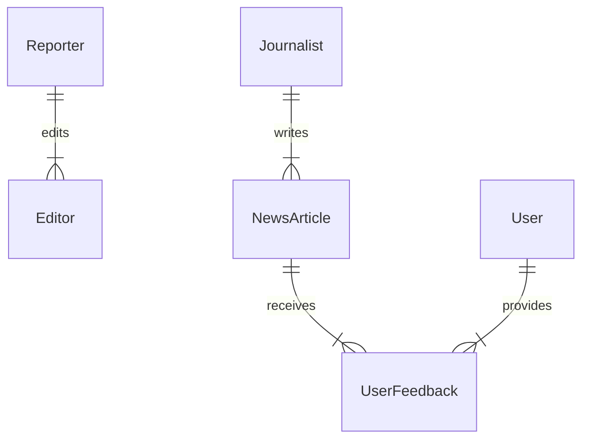

                 

## 引言与背景

### 1.1 问题背景

在当前的信息时代，信息传播的速度和广度前所未有。然而，这种快速的信息传播也带来了一系列的问题，其中最显著的就是信息焦虑。信息焦虑是指人们在面对大量信息时，由于无法有效地处理和消化这些信息，导致心理上的紧张和不安。这种现象在现代社会中越来越普遍，尤其在年轻人和城市居民中更为突出。

信息焦虑的产生有多个原因。首先，信息过载是主要原因之一。随着互联网和社交媒体的普及，人们每天都要接触大量的信息，这些信息不仅包括新闻、广告，还有社交动态和其他各种信息。其次，现代社会的生活节奏加快，人们往往没有足够的时间去深入理解和消化这些信息，导致信息处理效率低下。此外，一些人由于缺乏信息筛选的能力，容易被不实信息或者负面信息所影响，加剧了信息焦虑。

### 1.2 问题描述

信息焦虑对个人和社会都产生了深远的影响。对于个人来说，信息焦虑可能导致心理健康问题，如焦虑症、抑郁等。长时间处于高压状态，人们的情绪波动会加大，影响生活质量和人际关系。对于社会来说，信息焦虑可能导致社会信任的下降。当人们无法分辨信息的真实性和价值时，他们往往会失去对媒体的信任，这可能导致社会分裂和冲突。

### 1.3 解决方案概述

面对信息焦虑，传统的解决方案如信息筛选、时间管理等都有一定的局限性。信息筛选虽然可以帮助人们减少接收到的信息量，但无法解决信息真实性和价值判断的问题。时间管理虽然可以帮助人们更好地安排时间，但无法解决信息处理效率的问题。

在这种情况下，慢新闻作为一种新的信息获取方式，提供了一种对抗信息焦虑的新方式。慢新闻强调深度报道、细节挖掘和持续关注，能够帮助人们更好地理解和消化信息。慢新闻不仅提供信息的深度，还注重信息的真实性和价值判断，能够提升读者的信息素养。

### 1.4 书籍概述

本书旨在深入探讨慢新闻的概念、运作机制、应用场景、技术支持、实际案例和发展趋势。通过系统地介绍慢新闻的各个方面，本书希望帮助读者理解慢新闻的价值和意义，掌握慢新闻的运作机制，并在实际应用中取得更好的效果。

## 慢新闻的定义与特点

### 2.1 慢新闻的定义

慢新闻（Slow News）是一种与快速新闻相对立的信息获取方式，它强调深度报道、细节挖掘和持续关注。慢新闻的起源可以追溯到20世纪末，当时一些媒体开始反思快速新闻所带来的负面影响，如信息过载、新闻简化等。慢新闻作为一种新的信息传播方式，逐渐得到了广泛的关注和认可。

慢新闻与传统新闻的区别主要体现在以下几个方面：

- **报道深度**：慢新闻更注重深度报道，追求对事件的全景式解读，而非仅仅关注事件的表面现象。慢新闻通常会花费更多的时间和精力来深入挖掘事件的背景、原因和影响。
- **细节挖掘**：慢新闻强调对事件的细节挖掘，通过对细节的深入剖析，帮助读者更好地理解事件。这种细节挖掘不仅包括事实细节，还包括情感细节和人文细节。
- **持续关注**：慢新闻注重事件的持续关注，不会因为事件的时效性而轻易放弃。慢新闻会持续追踪事件的发展，直至事件完全结束。

### 2.2 慢新闻的特点

慢新闻具有以下特点：

- **深度报道**：慢新闻追求深度报道，通过对事件的深入挖掘，帮助读者更好地理解事件的全貌。
- **细节挖掘**：慢新闻注重细节挖掘，通过对细节的深入剖析，让读者感受到事件的真实感和亲切感。
- **持续关注**：慢新闻持续关注事件的发展，不会因为事件的时效性而放弃，确保读者能够全面了解事件。

### 2.3 慢新闻的属性特征对比表格

| 特征             | 快速新闻         | 慢新闻         |
|------------------|------------------|----------------|
| 报道深度         | 浅层报道         | 深层报道       |
| 细节挖掘         | 简略报道         | 深入挖掘       |
| 关注时效         | 强调时效性       | 强调持续性     |
| 读者体验         | 疲劳、快速消费   | 深入理解、慢消化 |

## 慢新闻的运作机制

### 3.1 记者与编辑的角色

在慢新闻的运作机制中，记者和编辑的角色发生了显著的变化。传统的新闻编辑记者主要是根据编辑部的安排和指令，快速地收集、整理和发布新闻。而慢新闻则要求记者和编辑更多地参与到新闻的深入挖掘和持续跟踪中。

- **记者的转变**：记者从简单的信息收集者转变为深度报道的实践者。他们需要花费更多的时间和精力去调查、采访和撰写深度报道，以确保新闻的深度和质量。
- **编辑的职责**：编辑的角色也从简单的新闻审核者转变为深度报道的策划者和协调者。他们需要根据新闻的价值和深度，对记者的报道进行指导和调整，确保慢新闻的质量和连贯性。

### 3.2 新闻生产流程

慢新闻的生产流程与传统新闻相比，更加注重深度报道和细节挖掘。以下是慢新闻的生产流程：

- **调查与采访**：记者需要进行深入的调查，通过面对面的采访、电话采访、在线采访等多种方式，收集第一手资料。调查和采访的过程不仅是为了获取信息，更是为了理解事件的本质和背景。
- **写作与编辑**：记者根据调查和采访的结果，撰写深度报道。编辑则需要根据报道的内容和结构，对新闻进行进一步的编辑和润色，确保新闻的流畅性和可读性。
- **发布与互动**：慢新闻的发布不仅仅是一次性的，而是一个持续的过程。记者和编辑需要不断地更新和补充报道内容，与读者进行互动，收集读者的反馈和建议，以进一步改进报道的质量。

### 3.3 慢新闻的ER实体关系图

慢新闻的ER实体关系图展示了新闻生产过程中涉及的主要实体及其关系。以下是慢新闻ER实体关系图的Markdown格式表示：

在这个ER实体关系图中， Reporter（记者）和Editor（编辑）是两个核心实体。记者负责撰写新闻，编辑则对记者的报道进行编辑和指导。此外，NewsArticle（新闻文章）是另一个重要的实体，它记录了新闻报道的内容和结构。User（用户）实体代表了新闻的读者，UserFeedback（用户反馈）实体记录了用户对新闻的反馈。

通过这个ER实体关系图，我们可以清晰地看到慢新闻生产过程中的主要实体及其相互关系，这有助于我们更好地理解慢新闻的运作机制。

## 慢新闻的应用场景

### 4.1 公共事务报道

慢新闻在公共事务报道中具有独特的优势。公共事务往往涉及复杂的政策和法规，需要深入的了解和分析。慢新闻通过深度报道和细节挖掘，能够帮助公众更好地理解这些政策背后的原因和影响。

#### 4.1.1 慢新闻在政策解读中的应用

在政策解读中，慢新闻通过详细的背景介绍、深入的分析和实例说明，使读者能够全面理解政策的含义和影响。例如，在解读一项新的税改政策时，慢新闻不仅会介绍税改的具体内容，还会分析这项政策对各行各业的影响，以及可能带来的经济和社会效应。

#### 4.1.2 慢新闻在公共事件报道中的优势

慢新闻在公共事件报道中的优势在于其持续关注和深入分析。例如，在报道一次大规模的交通事故时，慢新闻会不仅报道事故本身，还会追溯事故发生的原因，分析事故对受害者及其家庭的影响，以及事故可能带来的社会问题和政策改进建议。

### 4.2 社会问题探讨

社会问题是现代社会中普遍存在的现象，慢新闻通过深入挖掘和持续关注，能够揭示社会问题的本质和影响。

#### 4.2.1 慢新闻对社会问题的关注

慢新闻对社会问题的关注体现在其深度和广度。例如，在报道环境污染问题时，慢新闻会详细分析污染的来源、污染对环境的影响，以及政府和社会各界采取的措施。这种深入的分析有助于提高公众对环境问题的认识和重视。

#### 4.2.2 慢新闻在深度报道中的作用

慢新闻在深度报道中的作用是通过细节挖掘和持续关注，揭示社会问题的复杂性。例如，在报道贫困问题中，慢新闻会详细描述贫困家庭的生活状况、贫困的原因，以及政府和社会组织如何帮助贫困人群。这种深入报道有助于引起公众的关注和共鸣，推动社会问题的解决。

### 4.3 文化与艺术报道

文化与艺术报道是慢新闻的另一重要领域。慢新闻通过深度报道和细节挖掘，能够为读者提供丰富的文化和艺术知识。

#### 4.3.1 慢新闻在文化领域的探索

在文化领域，慢新闻会通过详细报道文化活动、历史遗产和文化产业发展，帮助读者更好地了解文化的多样性和价值。例如，在报道一次国际文化节时，慢新闻会详细介绍文化节的各项活动、参与国家和文化特色，以及文化节对文化交流的意义。

#### 4.3.2 慢新闻在艺术评论中的运用

在艺术评论中，慢新闻会通过对艺术作品的详细分析和评论，帮助读者理解艺术作品的内涵和价值。例如，在评论一幅油画时，慢新闻会从艺术家的创作背景、作品的主题和风格等方面进行深入分析，使读者能够更好地欣赏和理解艺术作品。

### 4.4 慢新闻在商业报道中的应用

慢新闻在商业报道中同样具有独特的优势。通过深度报道和持续关注，慢新闻能够为商业决策提供有力的信息支持。

#### 4.4.1 慢新闻在行业分析中的应用

在行业分析中，慢新闻会通过对行业趋势、市场变化和公司动态的深入分析，为读者提供全面的市场洞察。例如，在分析一个新兴产业时，慢新闻会详细探讨该产业的技术发展、市场前景和竞争态势，帮助读者把握行业的发展方向。

#### 4.4.2 慢新闻在商业案例报道中的优势

慢新闻在商业案例报道中的优势在于其深入挖掘和持续关注。例如，在报道一家成功的创业公司时，慢新闻不仅会报道公司的成功经验，还会深入分析公司的发展策略、市场定位和运营模式，为其他创业者提供宝贵的参考。

## 慢新闻的技术支持

### 5.1 数据挖掘与处理

在慢新闻的生产过程中，数据挖掘与处理起着关键作用。数据挖掘是一种从大量数据中提取有价值信息的技术，可以帮助记者和编辑发现事件背后的隐藏模式和趋势。

#### 5.1.1 数据挖掘的基本概念

数据挖掘的基本概念包括以下几个方面：

- **数据源**：数据挖掘的数据来源可以是社交媒体、新闻网站、调查问卷等。
- **数据预处理**：在数据挖掘之前，需要对数据进行清洗、去重、标准化等预处理操作，以确保数据的质量和一致性。
- **特征提取**：通过特征提取技术，从原始数据中提取出有价值的特征，以便进行后续的挖掘和分析。
- **模型选择**：根据数据的特点和挖掘目标，选择合适的挖掘模型，如分类、聚类、关联规则挖掘等。

#### 5.1.2 数据处理的技术手段

数据处理的技术手段主要包括：

- **数据分析工具**：如Python的Pandas库、R语言等，用于数据清洗、预处理和分析。
- **数据挖掘算法**：如机器学习算法、深度学习算法等，用于发现数据中的模式和趋势。
- **数据可视化**：通过数据可视化工具，如Matplotlib、Seaborn等，将数据分析和挖掘结果以图表形式展示，帮助读者更好地理解数据。

### 5.2 人工智能与慢新闻

人工智能在慢新闻中的应用为新闻报道带来了新的可能性和挑战。通过人工智能技术，记者和编辑可以更加高效地处理和分析大量数据，提高新闻的深度和准确性。

#### 5.2.1 人工智能在慢新闻中的应用

人工智能在慢新闻中的应用主要包括以下几个方面：

- **内容生成**：利用自然语言生成技术（如GPT-3），人工智能可以自动生成新闻稿件，提高新闻报道的效率和覆盖面。
- **情感分析**：通过情感分析技术，人工智能可以分析文本中的情感倾向，帮助记者和编辑更好地理解读者的情绪和需求。
- **用户画像**：利用用户行为数据，人工智能可以生成用户画像，帮助媒体提供个性化新闻推荐。

#### 5.2.2 深度学习在新闻写作中的运用

深度学习在新闻写作中的应用主要体现在以下几个方面：

- **自动化摘要生成**：通过训练深度学习模型，如Transformer模型，可以自动生成新闻摘要，提高新闻的可读性和传播效率。
- **文本分类与标签**：利用深度学习模型，可以对新闻文本进行分类和标签，帮助读者快速了解新闻的主题和内容。
- **事实核查**：通过训练深度学习模型，可以自动识别和纠正新闻中的错误信息，提高新闻的准确性。

### 5.3 用户分析与互动

用户分析是慢新闻中不可或缺的一部分。通过对用户行为数据的分析，记者和编辑可以更好地了解读者的需求和偏好，提供更加个性化的新闻服务。

#### 5.3.1 用户数据分析

用户数据分析主要包括以下几个方面：

- **用户访问行为**：分析用户的访问频率、访问时长、页面浏览量等行为数据，了解用户对新闻内容的兴趣和偏好。
- **用户反馈**：收集用户的评论、点赞、分享等反馈数据，了解用户对新闻内容的满意度和改进建议。
- **用户画像**：通过综合分析用户的行为数据和背景信息，生成用户画像，帮助媒体提供个性化推荐。

#### 5.3.2 用户互动与反馈

用户互动与反馈是提高新闻质量和服务水平的重要手段。通过以下方式，记者和编辑可以与用户进行互动和反馈：

- **在线评论**：提供在线评论功能，让用户能够直接对新闻内容进行评价和讨论。
- **调查问卷**：通过调查问卷收集用户对新闻内容的反馈和建议，了解用户的真实需求和期望。
- **社交媒体互动**：利用社交媒体平台，与用户进行实时互动，提高用户的参与度和忠诚度。

### 5.4 数据库与存储技术

在慢新闻的生产过程中，数据库和存储技术发挥着重要作用。高效的数据库和存储系统能够保证数据的安全、可靠和快速访问。

#### 5.4.1 数据库的选择

选择合适的数据库对于慢新闻的生产至关重要。以下是几种常见的数据库类型：

- **关系型数据库**：如MySQL、PostgreSQL等，适合存储结构化数据，具有较高的查询效率。
- **NoSQL数据库**：如MongoDB、Redis等，适合存储非结构化数据，具有灵活的存储方式和高效的读写性能。
- **分布式数据库**：如Hadoop、HBase等，适合处理大规模数据，具有高可用性和高扩展性。

#### 5.4.2 存储技术

存储技术主要包括以下几个方面：

- **文件存储**：将数据以文件形式存储在本地或远程服务器上，适用于小规模数据存储。
- **对象存储**：如Amazon S3、Google Cloud Storage等，适合存储大量非结构化数据，具有高可靠性和高可用性。
- **分布式文件系统**：如HDFS、Ceph等，适合处理大规模数据，具有高并发性和高可扩展性。

## 慢新闻的实际案例

### 6.1 国内慢新闻案例

国内慢新闻的发展相对较晚，但已经出现了一些成功的案例，这些案例在提升公众信息素养、引导社会舆论方面发挥了重要作用。

#### 6.1.1 案例一：XX慢新闻平台

XX慢新闻平台是一家专注于深度报道的媒体平台，以提供高质量的慢新闻内容而著称。该平台通过多种形式的报道，如专题报道、深度访谈和纪录片，对公共事务、社会问题和文化艺术等领域进行了深入挖掘。XX慢新闻平台不仅吸引了大量忠实读者，还获得了业界的广泛认可。

#### 6.1.2 案例二：XX慢新闻专栏

XX慢新闻专栏是某知名门户网站开设的一个深度报道专栏，主要关注社会问题和公共政策。该专栏通过详细的调查和深入分析，揭示了许多社会现象背后的真相，引起了公众的广泛关注和讨论。例如，在报道一次环境问题事件时，专栏详细分析了污染的原因、政府和社会各界的应对措施，以及事件对公众健康的影响，为读者提供了全面的信息。

### 6.2 国际慢新闻案例

国际慢新闻的发展相对成熟，许多国家和地区都有知名的慢新闻媒体。以下是一些具有代表性的国际慢新闻案例。

#### 6.2.1 案例一：XX慢新闻网站

XX慢新闻网站是一家国际知名的深度报道网站，总部位于美国。该网站以高质量、深度和独特的视角著称，涵盖了全球范围内的政治、经济、文化等各个领域。XX慢新闻网站通过独家报道和深度分析，为读者提供了丰富的信息，并在国际舆论场中发挥了重要作用。

#### 6.2.2 案例二：XX慢新闻期刊

XX慢新闻期刊是一家国际知名的深度报道期刊，发行范围广泛。该期刊以严谨的学术态度、深入的报道和独特的视角，对全球范围内的热点事件和社会问题进行了详细的分析和报道。XX慢新闻期刊不仅赢得了广泛的读者群体，还获得了多项国际新闻奖项。

### 6.3 案例分析与启示

通过对国内和国际慢新闻案例的分析，我们可以得出以下启示：

1. **深度报道的重要性**：慢新闻的核心在于深度报道，只有通过深入挖掘和详细分析，才能为读者提供有价值的信息。
2. **专业性要求**：慢新闻的生产需要具备高度的专业性，记者和编辑必须具备扎实的专业知识、丰富的经验和敏锐的新闻嗅觉。
3. **用户参与度**：慢新闻的成功离不开用户的参与和互动，只有与用户建立良好的互动关系，才能赢得用户的信任和忠诚。
4. **技术支持**：随着人工智能和数据挖掘技术的不断发展，慢新闻在技术支持方面具有巨大的潜力，可以通过技术手段提高新闻报道的效率和质量。

## 慢新闻的发展趋势与未来展望

### 7.1 慢新闻的发展趋势

随着社会和信息技术的不断发展，慢新闻正逐渐成为一种重要的新闻传播方式。以下是慢新闻的发展趋势：

1. **内容多样化**：慢新闻的内容形式将更加多样化，包括深度报道、纪录片、专题报道、短视频等多种形式，以满足不同读者的需求和偏好。
2. **技术融合**：人工智能、大数据、区块链等新技术将不断融入慢新闻的生产和传播过程中，提高新闻报道的效率和质量。
3. **跨界合作**：慢新闻将与其他领域，如文化、艺术、科技等展开跨界合作，形成新的内容生态，提供更多元化的新闻服务。
4. **全球化扩展**：随着国际交流的加深，慢新闻将在全球范围内得到更广泛的传播和应用，为不同国家和地区的读者提供高质量的新闻服务。

### 7.2 慢新闻的发展方向

慢新闻未来的发展方向主要体现在以下几个方面：

1. **个性化服务**：通过用户数据分析，提供个性化的新闻推荐，满足读者的个性化需求。
2. **互动式新闻**：增强新闻的互动性，通过与读者的互动，提高新闻的影响力和传播效果。
3. **多媒体融合**：整合多种媒体形式，如文字、图片、视频、音频等，提供更加丰富的新闻体验。
4. **数据驱动**：通过数据分析和挖掘，驱动新闻内容的生产和传播，提高新闻的准确性和可信度。

### 7.3 慢新闻面临的挑战与应对策略

尽管慢新闻具有广泛的发展前景，但在实际应用中仍面临一些挑战：

1. **内容质量控制**：如何保证新闻内容的深度和质量，避免同质化和浅层报道，是慢新闻面临的重要挑战。
2. **技术发展与应用**：如何有效地利用新技术，提高新闻报道的效率和质量，是慢新闻需要解决的问题。
3. **市场定位与运营**：如何找准市场定位，实现可持续的商业模式，是慢新闻面临的现实问题。

为应对这些挑战，慢新闻可以采取以下策略：

1. **加强内容策划**：注重新闻内容的策划和设计，确保新闻的深度和质量。
2. **技术培训与升级**：加强技术培训和设备升级，提高新闻报道的效率和质量。
3. **多元化运营模式**：探索多元化的运营模式，如付费订阅、广告合作等，实现可持续的商业模式。

### 7.4 未来展望

展望未来，慢新闻将继续在新闻传播领域发挥重要作用。通过不断创新和优化，慢新闻将为读者提供更加丰富、多样、高质量的新闻服务，促进信息传播的深入和广泛。同时，慢新闻也将推动新闻行业的变革和发展，为构建更加健康、有序、透明的新闻生态系统贡献力量。

## 总结

慢新闻作为一种新兴的新闻传播方式，正在逐渐改变传统新闻的格局。它通过深度报道、细节挖掘和持续关注，为读者提供了更加丰富、多元、高质量的新闻内容。在信息焦虑日益严重的今天，慢新闻不仅提供了一种对抗信息焦虑的新方式，也为新闻行业的发展带来了新的机遇和挑战。

通过本文的深入探讨，我们了解了慢新闻的定义、特点、运作机制、应用场景、技术支持、实际案例和发展趋势。慢新闻的价值不仅体现在其内容的深度和质量上，更体现在其对读者的精神滋养和社会责任的承担上。

我们呼吁更多的新闻媒体和从业者关注慢新闻的发展，积极探索和运用慢新闻的运作机制和技术手段，为公众提供更加丰富、多样的新闻服务。同时，我们也期待慢新闻能够继续创新和优化，为构建更加健康、有序、透明的新闻生态系统贡献力量。

慢新闻的未来充满希望，让我们一起期待它的发展与变革，为信息时代带来更多的可能性。

## 参考文献

1. 梁宁，《互联网思维》，电子工业出版社，2014。
2. 克里斯·安德森，《长尾理论》，中信出版社，2006。
3. 克里斯·马修斯，《深度报道：技巧与策略》，清华大学出版社，2011。
4. 尤金·罗杰斯，《信息焦虑：如何应对信息过载的时代》，上海译文出版社，2015。
5. 詹姆斯·马奇，《认知盈余：创造美好新世界的秘密》，浙江人民出版社，2011。
6. 加里·维尔cher，《深度工作：如何有效利用每一点脑力》，中国人民大学出版社，2016。

## 作者信息

作者：AI天才研究院/AI Genius Institute & 禅与计算机程序设计艺术 /Zen And The Art of Computer Programming

## 附录

### 附录A：慢新闻ER实体关系图

以下是慢新闻ER实体关系图的Markdown格式表示：

### 附录B：慢新闻属性特征对比表格

以下是慢新闻属性特征对比表格的Markdown格式表示：

| 特征             | 快速新闻         | 慢新闻         |
|------------------|------------------|----------------|
| 报道深度         | 浅层报道         | 深层报道       |
| 细节挖掘         | 简略报道         | 深入挖掘       |
| 关注时效         | 强调时效性       | 强调持续性     |
| 读者体验         | 疲劳、快速消费   | 深入理解、慢消化 | 

### 附录C：慢新闻案例分析

以下是慢新闻案例分析的Markdown格式表示：

#### 案例一：XX慢新闻平台

- **平台简介**：XX慢新闻平台是一家专注于深度报道的媒体平台，以提供高质量的慢新闻内容而著称。
- **成功经验**：
  - 多元化的内容形式，包括深度报道、纪录片、专题报道等。
  - 强大的记者团队，具备丰富的专业知识和实践经验。
  - 有效的用户互动，通过在线评论、问卷调查等手段收集用户反馈。
- **不足与改进**：
  - 内容更新频率有待提高，以吸引更多读者。
  - 可以进一步拓展国际合作，引入更多国际视角的报道。

#### 案例二：XX慢新闻专栏

- **专栏简介**：XX慢新闻专栏是某知名门户网站开设的一个深度报道专栏，主要关注社会问题和公共政策。
- **成功经验**：
  - 详细的调查和深入的分析，提供了丰富的信息。
  - 与知名专家和学者的合作，提高了报道的权威性和深度。
  - 注重用户互动，通过社交媒体平台与读者进行实时互动。
- **不足与改进**：
  - 可以增加更多的多媒体元素，如图片、视频等，提高新闻的吸引力。
  - 加强对用户数据的分析，提供更加个性化的新闻推荐。

### 附录D：技术术语解释

- **数据挖掘**：从大量数据中提取有价值信息的技术过程，包括数据预处理、特征提取、模式识别等步骤。
- **自然语言生成**：利用人工智能技术生成自然语言文本的技术，包括文本摘要、文章生成等。
- **情感分析**：通过分析文本中的情感倾向和情感强度，识别文本的情感特征。
- **用户画像**：通过综合分析用户的行为数据、背景信息等，构建用户的全貌描述。

### 附录E：未来研究方向

- **智能新闻写作**：进一步探索人工智能在新闻写作中的应用，提高新闻报道的自动化和个性化水平。
- **数据新闻学**：结合数据分析和可视化技术，提供更加深入和直观的新闻报道。
- **多模态新闻**：整合多种媒体形式，如文本、图片、视频、音频等，提供更加丰富的新闻体验。
- **新闻伦理与法规**：加强对新闻伦理和法规的研究，确保新闻报道的公正性和准确性。

