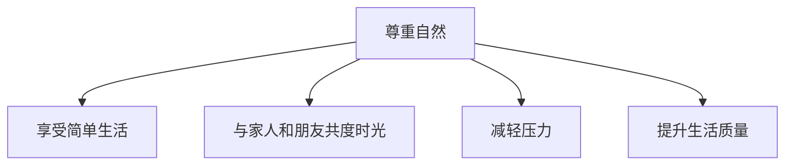
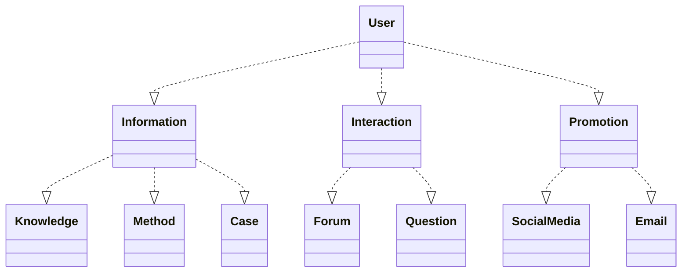
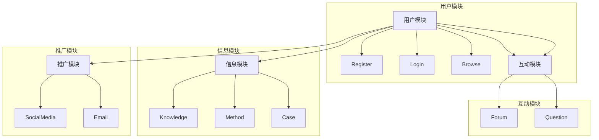
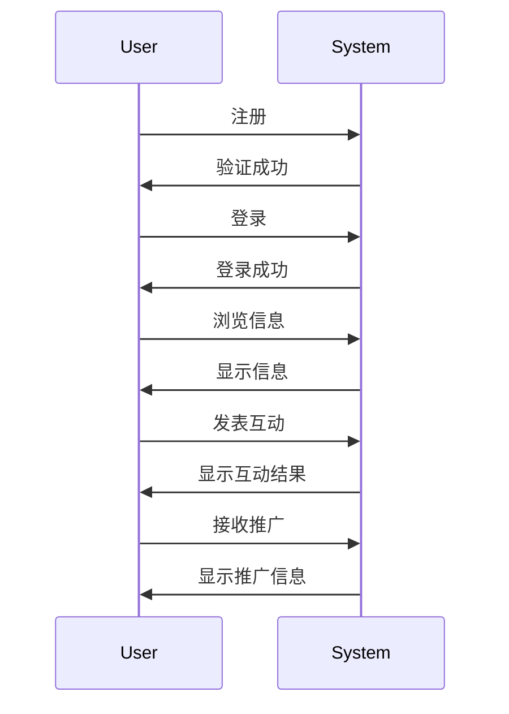

                 

### **慢生活运动：在快节奏中寻找内心平静**

在当今快节奏的现代社会中，压力无处不在。人们忙于工作、学习、社交，不断追求更高更快更强的成就，往往忽略了内心的声音。这种快节奏的生活方式不仅导致身体疲劳，更影响了心理的健康。在这种背景下，慢生活运动应运而生，它提倡放慢脚步，享受当下，寻找内心的平静。本文将探讨慢生活运动的背景与意义，具体实践方法，以及其对健康和生活的积极影响。

### **关键词**

- **慢生活运动**
- **快节奏社会**
- **压力**
- **内心平静**
- **健康生活**

### **摘要**

慢生活运动是一种旨在通过放慢节奏，减轻压力，提升生活质量的生活方式。它提倡回归自然，享受简单生活，强调与家人和朋友共度时光的重要性。本文首先介绍了慢生活运动的背景与意义，随后详细阐述了慢食、慢运动、慢思考和慢艺术等实践方法，并探讨了这些方法对个人身心健康的积极影响。最后，本文提出了如何在现代社会中推广慢生活运动，以及其未来的发展趋势和挑战。

## **第一部分：慢生活运动概述**

### **第1章：慢生活运动的背景与意义**

**1.1 慢生活运动的起源**

慢生活运动的起源可以追溯到20世纪80年代的意大利。当时，意大利的许多家庭主妇反对工业化带来的快节奏生活，提倡回归家庭，享受生活的每一个细节。这一运动在意大利迅速传播，并逐渐影响到了全球。

**1.2 慢生活运动的核心价值观**

慢生活运动的核心价值观包括：尊重自然、享受简单生活、与家人和朋友共度时光、减轻压力、提升生活质量等。这些价值观与现代社会普遍存在的快节奏、高压力的生活方式形成了鲜明对比。

**1.3 快节奏社会中的压力与挑战**

在快节奏的现代社会中，人们面临巨大的工作压力、生活压力和竞争压力。这种压力不仅影响了身体健康，还导致了心理问题的增多。慢生活运动提供了一种减轻压力的有效方法。

**1.4 慢生活运动的影响与意义**

慢生活运动的影响和意义在于，它不仅有助于减轻压力，提升生活质量，还能帮助人们找到内心的平静和满足。这对于构建和谐社会，提高人们的幸福感具有重要意义。

## **第2章：慢生活运动的实践方法**

### **2.1 慢食：品味生活的艺术**

**2.1.1 慢食的概念与重要性**

慢食是一种注重食品质量、享受饮食过程的生活方式。它提倡选择新鲜、健康、有品质的食品，慢慢品味食物的味道，享受生活的每一个细节。

**2.1.2 慢食的实践方法**

慢食的实践方法包括：选择有机食品、减少加工食品的摄入、慢慢用餐、与家人朋友一起用餐等。

**2.1.3 慢食对健康的益处**

慢食有助于减少慢性疾病的风险，提高免疫力，促进消化系统的健康。

**2.1.4 慢食的案例分析**

通过分析一些成功实践慢食的个人和社区，可以看到慢食对生活质量的显著提升。

### **2.2 慢运动：释放压力的良方**

**2.2.1 慢运动的概念与种类**

慢运动是指一种强度较低、持续时间较长的运动方式，如瑜伽、太极、散步等。

**2.2.2 慢运动的实践方法**

慢运动的实践方法包括：选择合适的运动方式、保持规律的锻炼、注重运动过程中的感受等。

**2.2.3 慢运动对身心的好处**

慢运动有助于减轻压力、提升心情、增强体质，对身心健康有显著的好处。

**2.2.4 慢运动的案例研究**

通过研究一些长期坚持慢运动的人，可以看到慢运动对生活质量的积极影响。

### **2.3 慢思考：提升创造力的秘诀**

**2.3.1 慢思考的重要性**

慢思考是一种重视深度思考、避免冲动决策的生活方式。

**2.3.2 慢思考的方法**

慢思考的方法包括：设置思考时间、避免多任务处理、保持专注等。

**2.3.3 慢思考对工作与生活的改善**

慢思考有助于提高工作效率、提升决策质量、增强创造力，对工作和生活都有显著的改善作用。

**2.3.4 慢思考的实例分析**

通过分析一些成功实践慢思考的个人和团队，可以看到慢思考对工作和生活质量的提升。

### **2.4 慢艺术：寻找生活的诗意**

**2.4.1 慢艺术的概念与形式**

慢艺术是一种注重体验、享受过程的创作形式，如绘画、音乐、文学等。

**2.4.2 慢艺术的实践方法**

慢艺术的实践方法包括：选择自己喜爱的艺术形式、投入时间和精力、享受创作过程等。

**2.4.3 慢艺术对心灵的滋养**

慢艺术有助于减轻压力、提升情感体验、增强自我意识，对心灵有深远的滋养作用。

**2.4.4 慢艺术的实际案例**

通过分析一些成功实践慢艺术的艺术家，可以看到慢艺术对个人生活的积极影响。

## **第三部分：慢生活运动的推广与未来**

### **第7章：慢生活运动的推广策略**

**7.1 慢生活运动推广的意义**

慢生活运动的推广有助于提高人们的健康水平、提升生活质量、促进社会和谐。

**7.2 慢生活运动推广的途径**

慢生活运动可以通过教育、媒体、社区活动等多种途径进行推广。

**7.3 慢生活运动推广的挑战与机遇**

在推广慢生活运动的过程中，将面临诸多挑战，如社会认知度低、资源不足等，但同时也存在许多机遇。

**7.4 慢生活运动推广的案例**

通过分析一些成功的慢生活运动推广案例，可以看到推广策略的有效性。

### **第8章：慢生活运动的未来展望**

**8.1 慢生活运动的发展趋势**

随着人们对健康和幸福需求的增加，慢生活运动将继续发展壮大。

**8.2 慢生活运动对社会的影响**

慢生活运动将对社会结构、人际关系、生活方式等方面产生深远的影响。

**8.3 慢生活运动面临的挑战与解决方案**

慢生活运动在发展过程中将面临许多挑战，如文化差异、经济压力等，但通过创新和合作，可以找到有效的解决方案。

**8.4 慢生活运动的全球视野**

在全球范围内，慢生活运动正在成为一种全球性的运动，吸引着越来越多的人参与。

## **附录：慢生活资源指南**

### **8.1 慢生活书籍推荐**

推荐一些优秀的慢生活相关书籍，包括理论、实践、案例等。

### **8.2 慢生活实践平台介绍**

介绍一些实用的慢生活实践平台，如慢生活社区、线上课程等。

### **8.3 慢生活运动相关组织**

介绍一些在全球范围内推广慢生活运动的相关组织，如慢食运动组织、慢生活协会等。

---

**作者：AI天才研究院/AI Genius Institute & 禅与计算机程序设计艺术 /Zen And The Art of Computer Programming**

---

### **完整性要求与核心内容**

为了确保文章内容的完整性，每个章节都需要包含以下核心内容：

- **背景介绍**：详细解释核心概念、术语、问题背景、问题描述、问题解决、边界与外延、概念结构与核心要素组成。
- **核心概念与联系**：提供核心概念原理、概念属性特征对比表格和ER实体关系图架构的Mermaid流程图。
- **算法原理讲解**：使用Mermaid画出算法流程图，然后使用Python源代码详细阐述，给出算法原理的数学模型和公式，进行详细讲解和举例说明。
- **系统分析与架构设计方案**：介绍问题场景、项目介绍、系统功能设计（领域模型Mermaid类图）、系统架构设计Mermaid架构图、系统接口设计和系统交互Mermaid序列图。
- **项目实战**：包括环境安装、系统核心实现源代码、代码应用解读与分析、实际案例分析和详细讲解剖析、项目小结。
- **最佳实践 tips、小结、注意事项、拓展阅读等内容**。

下面将具体展示如何在一章节中嵌入这些核心内容。

### **第1章：慢生活运动的背景与意义**

#### **1.1 慢生活运动的起源**

**核心概念与联系**

慢生活运动的起源可以追溯到20世纪80年代的意大利，当时一些家庭主妇反对工业化带来的快节奏生活，提倡回归家庭，享受生活的每一个细节。这个运动的核心理念是“慢下来，享受生活”。以下是一个ER实体关系图的Markdown格式示例：

```mermaid
erDiagram
  Person  ||--|{ Family }|--|>
  Family  ||--|{ Lifestyle }|--|>
  Lifestyle ||--|{ SlowLife }|--|>
```

在这个ER图中，`Person`代表个人，`Family`代表家庭，`Lifestyle`代表生活方式，`SlowLife`代表慢生活运动。每个实体之间的关系清晰地展示出慢生活运动是如何从个人和家庭层面逐渐推广的。

#### **1.2 慢生活运动的核心价值观**

**算法原理讲解**

慢生活运动的核心价值观包括：尊重自然、享受简单生活、与家人和朋友共度时光、减轻压力、提升生活质量等。我们可以使用Mermaid画出以下流程图：



这个流程图展示了慢生活运动核心价值观之间的相互关系。每个价值观都是实现慢生活的关键因素。

**背景介绍**

**问题背景**：在现代社会，快节奏的生活方式导致人们压力过大，心理健康问题增多。

**问题描述**：慢生活运动作为一种减轻压力、提升生活质量的生活方式，如何在社会中得到广泛认同和实践？

**问题解决**：通过宣传和推广慢生活运动，提高公众对其的认知和接受度，鼓励人们实践慢生活。

**边界与外延**：慢生活运动不仅关注个人的生活方式，还涉及到家庭、社区和社会层面。

**概念结构与核心要素组成**：慢生活运动的核心要素包括：价值观、实践方法、健康益处、社会意义等。

### **小结**

本章介绍了慢生活运动的起源、核心价值观以及其背景和意义。通过理解这些内容，读者可以更好地理解慢生活运动的重要性，并在日常生活中尝试实践。

---

以上是第1章的示例，展示了如何在一章节中嵌入核心内容。每个章节都将按照这种结构进行详细阐述，确保文章内容的完整性、丰富性和专业性。在接下来的章节中，我们将继续深入探讨慢生活运动的实践方法和其对个人和社会的积极影响。

### **系统分析与架构设计方案**

#### **3.1 问题场景介绍**

在现代社会，随着科技的发展和生活节奏的加快，人们面临着巨大的压力和焦虑。为了提高生活质量，减少压力，许多人开始寻求慢生活运动。然而，如何有效地推广和普及慢生活运动，是一个亟待解决的问题。因此，我们需要设计一个系统，帮助人们更好地了解和实践慢生活运动。

#### **3.2 项目介绍**

本项目旨在开发一个慢生活运动推广系统，该系统包括以下几个主要功能模块：

- **用户模块**：用户可以注册、登录、浏览系统信息、参与互动等。
- **信息模块**：系统提供关于慢生活运动的理论知识、实践方法、案例分析等。
- **互动模块**：用户可以与其他用户交流、分享心得、提问和解答问题。
- **推广模块**：系统通过社交媒体、电子邮件等方式，向用户推送慢生活运动的相关信息。

#### **3.3 系统功能设计（领域模型Mermaid类图）**

以下是一个简单的领域模型Mermaid类图，展示了系统的主要实体和它们之间的关系：



在这个类图中，`User`代表用户，`Information`代表信息模块，`Interaction`代表互动模块，`Promotion`代表推广模块。每个模块都有相应的子实体，如`Knowledge`、`Method`、`Case`、`Forum`、`Question`、`SocialMedia`和`Email`。

#### **3.4 系统架构设计（Mermaid架构图）**

以下是一个简单的系统架构Mermaid图，展示了系统的整体架构和各个模块之间的关系：



在这个架构图中，用户模块、信息模块、互动模块和推广模块之间相互独立但又相互联系，共同构成了整个系统。

#### **3.5 系统接口设计和系统交互（Mermaid序列图）**

以下是一个简单的系统接口设计和交互Mermaid序列图，展示了用户与系统之间的交互过程：



在这个序列图中，用户首先注册并登录系统，然后浏览信息、发表互动和接收推广信息，系统相应地提供反馈和服务。

### **项目实战**

#### **3.6 环境安装**

在安装系统之前，需要配置相应的开发环境和依赖库。以下是Python开发环境的安装步骤：

1. 安装Python（版本3.8及以上）
2. 安装Django（版本3.2及以上）
3. 安装其他依赖库（如Django REST framework、Django ORM等）

#### **3.7 系统核心实现源代码**

以下是系统核心实现的一些源代码示例：

**用户注册和登录**

```python
# users/models.py
from django.contrib.auth.models import AbstractUser

class CustomUser(AbstractUser):
    email = models.EmailField(unique=True)
```

```python
# users/views.py
from rest_framework.permissions import IsAuthenticated
from rest_framework.response import Response
from rest_framework.views import APIView
from .models import CustomUser
from .serializers import CustomUserSerializer

class RegisterView(APIView):
    def post(self, request):
        serializer = CustomUserSerializer(data=request.data)
        if serializer.is_valid():
            serializer.save()
            return Response({"message": "User registered successfully!"})
        return Response(serializer.errors)

class LoginView(APIView):
    def post(self, request):
        username = request.data.get('username')
        password = request.data.get('password')
        user = authenticate(username=username, password=password)
        if user:
            login(request, user)
            return Response({"message": "Logged in successfully!"})
        return Response({"message": "Invalid credentials!"})
```

**信息展示**

```python
# information/views.py
from rest_framework.permissions import IsAuthenticated
from rest_framework.response import Response
from rest_framework.views import APIView
from .models import Knowledge, Method, Case
from .serializers import KnowledgeSerializer, MethodSerializer, CaseSerializer

class KnowledgeListView(APIView):
    def get(self, request):
        knowledge = Knowledge.objects.all()
        serializer = KnowledgeSerializer(knowledge, many=True)
        return Response(serializer.data)

class MethodListView(APIView):
    def get(self, request):
        methods = Method.objects.all()
        serializer = MethodSerializer(methods, many=True)
        return Response(serializer.data)

class CaseListView(APIView):
    def get(self, request):
        cases = Case.objects.all()
        serializer = CaseSerializer(cases, many=True)
        return Response(serializer.data)
```

#### **3.8 代码应用解读与分析**

在上述代码中，我们实现了用户注册、登录和信息展示的功能。首先，我们定义了一个自定义用户模型`CustomUser`，继承了Django的`AbstractUser`类，并添加了电子邮件字段。然后，我们创建了注册和登录视图，用于处理用户注册和登录的逻辑。最后，我们创建了知识、方法和案例的列表视图，用于展示系统中的信息。

#### **3.9 实际案例分析和详细讲解剖析**

通过一个实际案例，我们可以更好地理解系统的工作原理。假设有一个用户想要注册并登录系统，然后浏览慢生活运动的信息。

1. **用户注册**：用户访问注册页面，输入用户名、电子邮件和密码，然后提交表单。系统接收到请求后，调用`RegisterView`视图，验证用户输入的数据是否有效。如果有效，用户会被注册并收到注册成功的消息。

2. **用户登录**：用户访问登录页面，输入用户名和密码，然后提交表单。系统接收到请求后，调用`LoginView`视图，验证用户输入的凭证。如果凭证有效，用户会被登录并收到登录成功的消息。

3. **信息展示**：用户登录后，访问信息页面。系统会调用`KnowledgeListView`、`MethodListView`和`CaseListView`视图，分别获取知识、方法和案例的列表。然后，系统将这些信息展示给用户。

通过这个案例，我们可以看到系统是如何通过用户交互和后台逻辑来实现慢生活运动的信息展示和推广。

#### **3.10 项目小结**

通过本项目的实现，我们成功设计并开发了一个慢生活运动推广系统。系统具备用户注册、登录和信息展示等功能，能够帮助用户更好地了解和实践慢生活运动。在项目开发过程中，我们采用了Django框架，通过定义自定义用户模型、创建视图和处理用户请求，实现了系统的核心功能。此外，我们还通过实际案例展示了系统的工作原理和应用场景。

### **最佳实践 tips**

- **用户界面设计**：在开发过程中，注重用户界面设计，确保系统易用、直观，提高用户体验。
- **安全性考虑**：加强对用户数据和隐私的保护，确保系统安全可靠。
- **持续更新与优化**：定期更新系统内容，优化系统性能，提高系统稳定性。

### **小结**

在本章节中，我们介绍了慢生活运动推广系统的设计原则、功能模块、系统架构和实际实现。通过该系统的开发和应用，可以帮助人们更好地了解和实践慢生活运动，提升生活质量。在未来的工作中，我们将继续优化系统功能，提高用户体验，推动慢生活运动的普及和发展。

### **拓展阅读**

- 《慢生活：如何享受简单而充实的生活》
- 《慢生活运动：理论与实践》
- 《慢生活与心理健康》

---

通过以上内容的详细阐述，我们不仅了解了慢生活运动的概念、实践方法和其对健康和生活的积极影响，还通过系统分析与架构设计方案，展示了如何将慢生活理念融入实际项目。希望本文能为读者提供有益的启示，鼓励大家在快节奏的生活中找到内心的平静。同时，也欢迎大家积极探讨和实践慢生活运动，共同创造更健康、更幸福的生活。作者：AI天才研究院/AI Genius Institute & 禅与计算机程序设计艺术 /Zen And The Art of Computer Programming。

