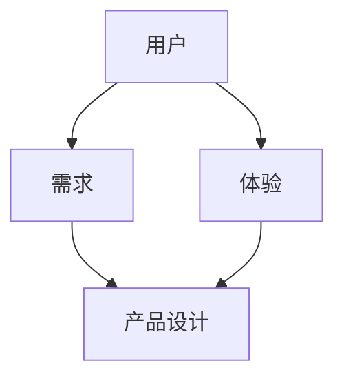
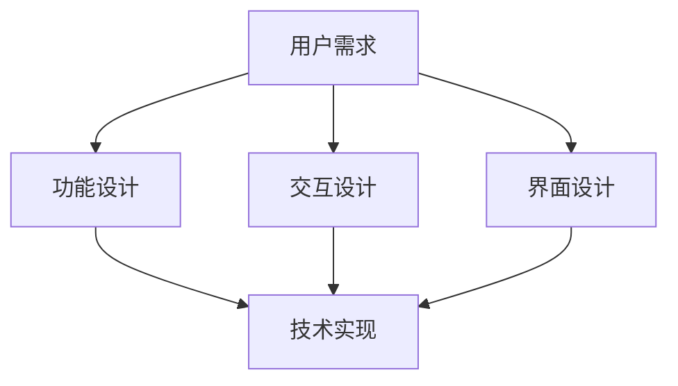
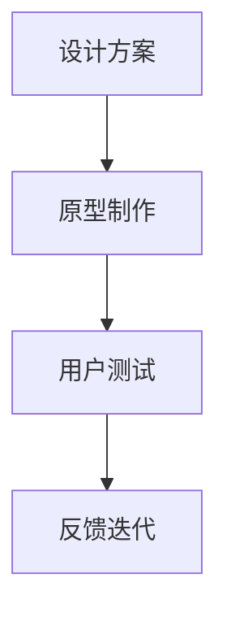
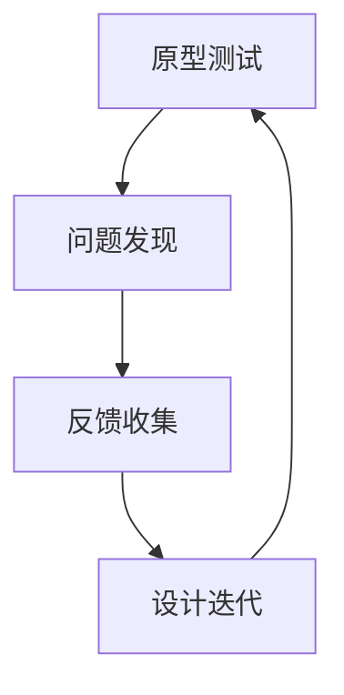

                 

### 第1章：慢科技的定义与特点

### 1.1 慢科技的定义

**背景介绍**：

在21世纪，科技发展迅猛，人工智能、大数据、物联网等新技术不断涌现，极大地改变了人们的生活和工作方式。然而，这种快速发展的背后，也带来了一系列问题，如信息过载、生活节奏加快、心理健康问题等。为了解决这些问题，慢科技这一概念应运而生。

**核心概念术语说明**：

- **慢科技**：与快科技相对，强调在技术进步的同时，更加注重人类的感受和生活质量，追求一种更加人性化和可持续的发展方式。

**问题背景**：

快科技的快速发展虽然带来了许多便利，但也使得人们的生活压力增大，心理健康问题凸显。人们渴望在享受科技带来的便利的同时，能够拥有更多的时间去关注自己的内心需求和生活质量。

**问题描述**：

如何在科技快速发展的背景下，实现科技与人类生活的和谐共处，使人们能够享受科技带来的便利，同时保持身心健康，提高生活质量？

**问题解决**：

慢科技作为一种新兴的科技理念，试图通过以下方式解决上述问题：

- **强调人性化**：慢科技强调以人为本，关注人的需求、情感和体验，注重人与人之间的交流和互动。
- **追求可持续性**：慢科技追求可持续性发展，关注环境保护和资源利用，强调生态平衡和可持续发展。
- **注重简约性**：慢科技注重简约和实用，避免过度设计和功能复杂化，追求简单、直观的用户体验。
- **鼓励创新性**：慢科技鼓励创新，强调在传统技术和方法的基础上进行突破和改进，推动科技进步。

**边界与外延**：

慢科技并非指科技发展速度慢，而是强调在技术进步的同时，更加注重人类的感受和生活质量，追求一种更加人性化和可持续的发展方式。

**概念结构与核心要素组成**：

慢科技的核心要素包括：

- **人性化**：关注人的需求、情感和体验。
- **可持续性**：关注环境保护和资源利用。
- **简约性**：追求简单、直观的用户体验。
- **创新性**：鼓励创新，推动科技进步。

### 1.2 慢科技在产品设计中的应用

**核心概念与联系**：

慢科技在产品设计中的应用主要体现在以下两个方面：

- **用户需求分析**：通过深入分析用户需求，设计师可以更好地理解用户的行为、习惯和偏好，从而设计出符合用户期望的产品。
- **用户体验设计**：用户体验设计是慢科技产品设计的核心。设计师需要从用户的角度出发，关注用户在产品使用过程中的感受和体验，通过简约的设计、人性化的交互和优质的体验，提升产品的使用价值和用户满意度。

**概念属性特征对比表格**：

| 特征 | 慢科技 | 快科技 |
| --- | --- | --- |
| **人性化** | 关注人的需求、情感和体验 | 更多关注技术的创新和功能 |
| **可持续性** | 关注环境保护和资源利用 | 可能忽视环境问题 |
| **简约性** | 追求简单、直观的用户体验 | 可能功能复杂化 |
| **创新性** | 鼓励创新，推动科技进步 | 可能过于追求短期效果 |

**ER实体关系图架构**：

### 1.3 慢科技产品设计的挑战与机遇

**挑战**：

- **技术与人性的平衡**：在追求技术创新的同时，如何平衡技术与人性，确保产品更加人性化。
- **用户需求的多样化**：用户需求多样化，如何设计出能够满足不同用户需求的产品。
- **可持续性的实现**：如何在产品设计中实现可持续发展，降低对环境的影响。

**机遇**：

- **市场需求**：随着人们生活水平的提高，对生活品质和用户体验的要求越来越高，慢科技产品具有广阔的市场需求。
- **技术创新**：慢科技鼓励创新，为设计师提供了广阔的创新空间。
- **可持续发展**：慢科技强调可持续发展，有助于推动社会和环境的可持续发展。

### 1.4 本章小结

本章对慢科技进行了详细的概念解析，包括其定义、特点以及在产品设计中的应用。通过对比慢科技与快科技，我们看到了慢科技在人性化、可持续性、简约性和创新性方面的优势。同时，本章还分析了慢科技产品设计的挑战与机遇，为后续章节的内容奠定了基础。

**最佳实践 tips**：

1. 在进行慢科技产品设计时，要充分关注用户需求，通过深入的用户需求分析，设计出更加符合用户期望的产品。
2. 在追求技术创新的同时，要注意平衡技术与人性，确保产品的人性化设计。
3. 强调简约性，避免过度设计和功能复杂化，提升用户的使用体验。

**小结**：

慢科技是一种以人为本、注重人性化、可持续性和简约性的科技理念。在产品设计领域，慢科技为设计师提供了新的思路和方法，有助于提升产品的用户价值和市场竞争力。

**注意事项**：

1. 在慢科技产品设计过程中，要关注用户需求的多样化和个性化，确保产品能够满足不同用户的需求。
2. 实现可持续发展是慢科技产品设计的重要目标，设计师需要从设计、生产到使用等多个环节考虑环保问题。

**拓展阅读**：

1. 《慢科技：技术与人性的平衡艺术》
2. 《以人为本的产品设计：从用户需求出发》
3. 《可持续发展的产品设计策略与实践》

----------------------------------------------------------------

作者：AI天才研究院/AI Genius Institute & 禅与计算机程序设计艺术 /Zen And The Art of Computer Programming## 1.1 慢科技的定义

### 1.1.1 慢科技的产生背景

慢科技的概念起源于对现代快节奏生活的反思。随着全球化和信息化的发展，人类社会进入了高度互联的时代，科技进步日新月异，人们的生活和工作方式发生了翻天覆地的变化。然而，这种快速发展的背后，也带来了一系列负面影响。例如，由于过度依赖科技，人们的生活节奏加快，压力增大，心理健康问题凸显。此外，科技带来的信息过载也让人们感到疲惫，影响工作效率和生活质量。

面对这些问题，人们开始思考如何在享受科技便利的同时，保持生活的平衡和质量的提升。慢科技的理念正是在这样的背景下产生的。它主张在科技发展的同时，关注人类的需求和感受，追求一种更加人性化和可持续的发展模式。

### 1.1.2 慢科技的核心特点

慢科技的核心特点主要体现在以下几个方面：

- **人性化**：慢科技以人为本，强调关注人的需求、情感和体验。产品设计过程中，设计师需要从用户的角度出发，充分考虑用户的需求和使用习惯，确保产品能够满足用户的实际需求，提升用户的满意度。

- **可持续性**：慢科技追求可持续发展，关注环境保护和资源利用。在设计过程中，需要考虑到产品的整个生命周期，从生产、使用到废弃，尽量减少对环境的负面影响。例如，可以采用环保材料、节能设计等措施，降低能源消耗和废物排放。

- **简约性**：慢科技反对过度设计和功能复杂化，追求简约和实用。这意味着在设计产品时，应该避免不必要的功能和装饰，只保留核心功能和用户真正需要的功能，以便用户能够更轻松地使用产品。

- **创新性**：慢科技鼓励创新，强调在传统技术和方法的基础上进行突破和改进。这种创新不仅仅是技术层面的，也包括设计理念、商业模式等方面的创新。通过创新，可以不断优化产品设计，提高产品的竞争力。

### 1.1.3 慢科技在产品设计中的具体应用

在慢科技的理念指导下，产品设计需要从多个方面进行考虑和优化：

- **用户需求分析**：首先，需要通过深入的市场调研和用户访谈，了解用户的需求和痛点。这包括用户的实际使用场景、操作习惯、偏好等。只有深入了解用户需求，才能设计出真正符合用户期望的产品。

- **用户体验设计**：在产品设计过程中，需要关注用户体验的每一个环节，包括产品的界面设计、交互设计、功能设计等。通过用户反馈和测试，不断优化设计，确保产品能够提供良好的用户体验。

- **可持续设计**：在产品的设计、生产、使用和废弃过程中，都需要考虑到环保和可持续性。例如，可以采用可回收材料、优化能源利用、设计易于拆解和回收的产品等。

- **简约设计**：在产品功能设计上，要避免过度设计，只保留核心功能和用户真正需要的功能。通过简化界面、优化操作流程，提高产品的易用性和用户体验。

- **创新设计**：在产品设计过程中，要鼓励创新思维，不断探索新的设计方法和解决方案。这包括技术层面的创新，如采用新技术、新材料等，以及设计理念的创新，如关注用户体验、可持续性等。

通过以上几个方面的综合考虑，慢科技产品能够更好地满足用户的需求，提升用户体验，同时实现可持续发展的目标。

### 1.1.4 慢科技与快科技的对比

慢科技与快科技之间存在明显的差异：

- **发展速度**：快科技强调快速发展，追求技术的创新和功能的增加；而慢科技则强调稳定发展，追求技术与人性的平衡和可持续性。

- **用户需求**：快科技关注的是用户的短期需求，追求功能齐全和性能强大；而慢科技则更加注重用户的长期需求，追求人性化、简约和可持续。

- **设计理念**：快科技的设计理念通常是功能驱动，追求最大化的功能和性能；而慢科技的设计理念则是以用户为中心，追求简单、实用和高质量的用户体验。

- **社会影响**：快科技可能会带来快速的发展和变革，但也可能带来负面的社会影响，如环境污染、资源浪费等；而慢科技则更加注重社会和环境的可持续发展。

总的来说，慢科技是一种更加人性化、可持续的科技理念，与快科技相比，更注重用户的长期需求和社会的整体福祉。

### 1.1.5 本章小结

本章对慢科技的定义和核心特点进行了详细阐述，并探讨了慢科技在产品设计中的应用和与快科技的对比。通过本章的学习，读者可以更好地理解慢科技的概念，认识到其在现代社会中的重要性，以及如何在产品设计中实现慢科技的理念。

**拓展阅读**：

1. 《慢科技：科技与生活的平衡》
2. 《科技伦理与慢科技》
3. 《可持续设计：设计思维与策略》

----------------------------------------------------------------

### 1.2 以人为本的理念

#### 1.2.1 用户需求分析

**背景介绍**：

在慢科技产品设计过程中，用户需求分析是至关重要的一环。随着市场的不断变化和用户需求的多样化，仅凭直觉或经验进行设计已经无法满足现代产品的复杂性和个性化需求。因此，深入了解用户的需求，分析其背后的动机和期望，对于设计出满足用户期望的产品至关重要。

**核心概念术语说明**：

- **用户需求**：用户在使用产品过程中期望得到满足的需求。
- **需求分析**：通过对用户的行为、习惯、偏好等信息进行收集、整理和分析，以了解用户的需求。

**问题背景**：

在快节奏的现代社会中，用户的需求多样化且不断变化。例如，随着互联网的普及，用户对于产品的互动性、便捷性和个性化要求越来越高。如果不进行深入的用户需求分析，设计出的产品很可能会无法满足用户的需求，导致用户流失和市场竞争力下降。

**问题描述**：

如何在慢科技产品设计中，通过用户需求分析，设计出能够满足用户期望的产品？

**问题解决**：

**1. 确定需求分析的目标和范围**：

首先，需要明确需求分析的目标和范围。例如，是针对某一特定用户群体，还是针对整个市场；是关注产品的功能性，还是用户体验等。

**2. 收集用户需求信息**：

通过多种渠道收集用户需求信息，如用户访谈、问卷调查、用户反馈等。这些信息可以帮助了解用户的需求、行为和偏好。

**3. 分析用户需求**：

对收集到的用户需求信息进行分类、整理和分析，找出用户的核心需求和痛点。可以使用用户画像、用户旅程图等工具进行需求分析。

**4. 确定需求优先级**：

根据用户需求的重要性和紧迫性，确定需求的优先级。这有助于在资源有限的情况下，优先解决用户最关心的问题。

**5. 设计满足用户需求的产品**：

根据分析结果，设计出能够满足用户需求的产品。在设计中，要充分考虑用户的实际使用场景、操作习惯和偏好，确保产品能够提供优质的用户体验。

**边界与外延**：

用户需求分析不仅限于功能层面的需求，还包括用户体验、情感需求等。同时，需求分析的结果不仅要指导产品设计，还可以为产品优化和市场策略提供参考。

**概念结构与核心要素组成**：

用户需求分析的核心要素包括：

- **目标明确**：明确需求分析的目标和范围。
- **信息收集**：通过多种渠道收集用户需求信息。
- **需求分析**：对用户需求信息进行分类、整理和分析。
- **需求优先级**：确定需求的重要性和紧迫性。
- **产品设计**：根据需求分析结果设计出满足用户需求的产品。

#### 1.2.2 用户体验设计

**核心概念与联系**：

用户体验设计（User Experience Design，简称UX Design）是慢科技产品设计中的核心环节。它关注用户在使用产品过程中的整体感受和体验，旨在提升用户的满意度和忠诚度。

**概念属性特征对比表格**：

| 特征 | 用户体验设计 | 功能性设计 |
| --- | --- | --- |
| **以用户为中心** | 关注用户的需求、感受和体验 | 关注产品的功能实现 |
| **系统性** | 综合考虑用户旅程的各个阶段 | 侧重某一功能模块 |
| **情感性** | 强调情感共鸣和用户情感体验 | 主要关注功能的完成度 |
| **易用性** | 注重用户操作的便捷性和效率 | 注重功能的技术实现 |
| **创新性** | 鼓励创新思维和设计方法 | 更多关注技术的创新性 |

**ER实体关系图架构**：

**用户体验设计的具体步骤**：

1. **用户调研**：通过访谈、问卷调查、用户反馈等方式，了解用户的需求、行为和偏好。

2. **用户画像**：根据收集到的用户数据，创建用户画像，明确目标用户群体的特点和需求。

3. **用户旅程图**：绘制用户在使用产品的各个阶段的心理和行为路径，分析用户的痛点和不满意之处。

4. **原型设计**：基于用户需求和用户旅程图，设计出产品的原型，包括界面布局、交互设计、信息架构等。

5. **用户测试**：通过用户测试，收集用户对原型的反馈，优化设计。

6. **迭代优化**：根据用户测试结果，不断迭代优化设计，确保产品能够提供优质的用户体验。

**案例分析**：

**案例一：Google 的搜索页面设计**

Google 的搜索页面设计注重用户体验，通过以下措施提升了用户的满意度：

- **简洁的界面**：页面设计简洁，没有过多的装饰和广告，使得用户能够快速找到搜索框并输入关键词。
- **智能搜索建议**：提供智能搜索建议，帮助用户更快地找到需要的信息。
- **快速加载**：优化页面加载速度，确保用户能够快速获取搜索结果。

**案例二：Apple 的iPhone界面设计**

Apple 的iPhone界面设计以用户体验为核心，通过以下措施提升了用户的满意度：

- **直观的交互**：采用触控交互，使得用户能够通过简单的手势完成操作。
- **统一的风格**：保持系统界面的统一风格，使得用户能够快速适应和使用新功能。
- **个性化的设置**：提供丰富的个性化设置，让用户可以根据自己的喜好调整界面和功能。

**用户体验设计的挑战与机遇**：

**挑战**：

- **多样化的用户需求**：不同用户有不同的需求和使用习惯，如何设计出能够满足所有用户需求的产品。
- **技术限制**：在某些情况下，技术实现可能无法完全满足用户体验设计的要求。

**机遇**：

- **技术创新**：随着技术的发展，设计师可以采用更多创新的技术和方法，提升用户体验。
- **用户反馈**：用户反馈可以不断优化产品设计，使其更符合用户的需求。

**本章小结**：

本章详细阐述了用户需求分析和用户体验设计在慢科技产品设计中的重要性。通过深入的用户需求分析和精准的体验设计，设计师可以设计出满足用户期望、提升用户满意度的高品质产品。

**最佳实践 tips**：

1. 在进行用户需求分析时，要确保收集到的数据具有代表性，避免偏差。
2. 在进行用户体验设计时，要充分考虑用户的实际使用场景，确保设计能够真正满足用户的需求。
3. 在设计过程中，要注重迭代优化，通过用户测试和反馈不断改进设计。

**小结**：

以人为本的理念是慢科技产品设计的核心。通过用户需求分析和用户体验设计，设计师可以更好地理解用户的需求和期望，设计出高品质、人性化、可持续的产品。

**注意事项**：

1. 在进行用户需求分析时，要关注用户的需求变化，及时调整分析方法和策略。
2. 在进行用户体验设计时，要确保设计符合用户的实际使用习惯，避免过度创新。

**拓展阅读**：

1. 《用户体验要素：用户体验设计师手册》
2. 《设计思维：创新的设计方法》
3. 《用户研究方法：设计、研究和评估用户体验》

----------------------------------------------------------------

### 1.3 技术创新方法

#### 1.3.1 设计工具

在进行慢科技产品设计时，选择合适的设计工具至关重要。以下是一些常见的设计工具及其特点：

- **Sketch**：一款流行的用户界面设计工具，界面简洁，支持矢量绘图，适用于创建高保真度的界面设计原型。

- **Figma**：一款基于网页的协作设计工具，支持多人实时协作，便于团队沟通和协作。

- **Adobe XD**：一款综合性设计工具，支持从设计到原型、到开发的整个设计流程，适合大型团队使用。

- **Axure RP**：一款专业的原型设计工具，支持丰富的交互效果和页面动态，适用于复杂的应用程序设计。

- **Adobe Illustrator**：一款专业的矢量图形设计软件，适用于创建图标、图形和插图。

- **Photoshop**：一款图像处理软件，适用于对图像进行编辑和处理，常用于设计网页和移动应用的界面元素。

- **InVision**：一款原型设计和协作工具，支持创建高保真度的交互原型，便于用户测试和反馈。

#### 1.3.2 设计方法论

慢科技产品设计需要一种系统化的方法，以确保设计过程高效且结果符合预期。以下是一些常见的设计方法论：

- **用户中心设计（UCD）**：用户中心设计是一种以用户需求为中心的设计方法，强调在整个设计过程中，始终关注用户的需求和体验。该方法包括需求分析、原型设计、用户测试和迭代优化等环节。

- **设计思维**：设计思维是一种以人为本的创新方法，通过理解用户需求、探索解决方案和快速原型测试，帮助团队找到创新的解决方案。该方法包括观察、定义、发散、筛选、原型和测试等步骤。

- **敏捷设计**：敏捷设计是一种快速迭代的设计方法，强调团队合作、持续反馈和快速交付。该方法包括需求收集、设计、开发、测试和部署等环节，每个环节都注重用户反馈和持续改进。

- **精益创业**：精益创业是一种以最小可行性产品（MVP）为核心的设计方法，通过快速构建、测试和迭代产品，验证市场需求和用户价值。该方法包括市场调研、产品设计、原型测试、迭代优化和商业模式验证等步骤。

#### 1.3.3 技术创新的具体步骤

在进行慢科技产品设计时，技术创新是一个持续的过程，需要遵循以下步骤：

- **需求分析**：首先，明确用户需求和市场趋势，了解用户的需求、痛点和期望。

- **概念验证**：基于需求分析，构建产品的初步概念，并进行验证。可以通过用户访谈、问卷调查或用户测试等方式，收集用户对概念的反馈。

- **原型设计**：根据概念验证的结果，设计产品的原型，包括界面、交互和功能等。可以使用设计工具创建原型，并进行用户测试和反馈。

- **迭代优化**：根据用户测试和反馈，对原型进行迭代优化，逐步完善产品的设计和功能。

- **开发与测试**：在原型设计完成后，进行产品的开发和测试。确保产品在技术实现和用户体验方面都能满足预期。

- **部署与反馈**：将产品部署到实际环境中，收集用户的反馈，进行持续优化和改进。

#### 1.3.4 案例分析

**案例一：Apple Watch**

Apple Watch 是一款成功的慢科技产品，它通过以下方式实现了技术创新：

- **用户体验设计**：Apple Watch 的界面简洁，交互直观，用户可以轻松完成各种操作。

- **健康监测功能**：Apple Watch 提供了丰富的健康监测功能，如心率监测、运动记录等，帮助用户关注自己的健康。

- **智能功能**：Apple Watch 与 iPhone 等设备无缝连接，实现了各种智能功能，如消息通知、电话拨打等。

- **可持续性设计**：Apple Watch 采用环保材料，生产过程中注重节能减排。

**案例二：Samsung Galaxy Fold**

Samsung Galaxy Fold 是一款具有创新设计理念的产品，它通过以下方式实现了技术创新：

- **折叠屏幕**：Samsung Galaxy Fold 采用可折叠屏幕设计，提供了更大的屏幕空间和更好的用户体验。

- **多任务处理**：折叠屏幕使得用户可以同时进行多个任务，提高了生产力。

- **创新交互**：Samsung Galaxy Fold 支持多种交互方式，如手写笔、触控、语音等，提供了丰富的操作方式。

- **可持续性设计**：Samsung Galaxy Fold 采用环保材料，生产过程中注重节能减排。

#### 1.3.5 本章小结

本章介绍了慢科技产品设计的工具和方法。通过选择合适的设计工具和遵循系统化的设计方法论，设计师可以更好地进行慢科技产品的创新设计。同时，本章还通过案例分析，展示了技术创新在慢科技产品设计中的应用和效果。

**最佳实践 tips**：

1. 在选择设计工具时，要考虑团队的需求和技能，选择适合的工具。
2. 在设计过程中，要注重用户体验，确保产品能够满足用户的需求和期望。
3. 通过迭代优化，不断提升产品的设计质量和用户体验。

**小结**：

技术创新是慢科技产品设计的核心。通过选择合适的设计工具和遵循系统化的设计方法论，设计师可以设计出更加人性化、可持续和创新的产品。

**注意事项**：

1. 在进行技术创新时，要关注市场需求和用户反馈，确保设计符合用户需求。
2. 在实现可持续性设计时，要注重环保和节能减排，降低对环境的负面影响。

**拓展阅读**：

1. 《设计工具：如何选择和使用设计工具》
2. 《用户体验设计：设计思维与实践》
3. 《可持续设计：从理念到实践》

----------------------------------------------------------------

### 1.4 人本化的设计流程

#### 1.4.1 需求分析

**背景介绍**：

在慢科技产品设计中，需求分析是至关重要的一环。通过需求分析，设计师可以明确用户的需求、痛点和期望，为后续的设计和开发提供基础。在快节奏的现代社会，用户需求多样化且不断变化，如何准确地捕捉和满足用户需求成为设计成功的关键。

**核心概念术语说明**：

- **需求分析**：对用户的需求、使用场景、行为和偏好进行收集、整理和分析，以了解用户的真实需求和期望。
- **用户画像**：根据用户数据创建的用户模型，用于理解用户的特征和需求。
- **需求文档**：记录用户需求和分析结果的文档，为设计和开发提供指导。

**问题背景**：

随着科技的进步，用户对产品的期望越来越高，不仅要求产品具备强大的功能，还要求产品能够提供优质的用户体验。如果不进行深入的需求分析，设计出的产品很可能会无法满足用户的期望，导致用户流失和市场竞争力下降。

**问题描述**：

如何在慢科技产品设计中，通过需求分析，设计出能够满足用户期望的产品？

**问题解决**：

**1. 确定需求分析的目标和范围**：

首先，需要明确需求分析的目标和范围。例如，是针对某一特定用户群体，还是针对整个市场；是关注产品的功能性，还是用户体验等。

**2. 收集用户需求信息**：

通过多种渠道收集用户需求信息，如用户访谈、问卷调查、用户反馈等。这些信息可以帮助了解用户的需求、行为和偏好。

**3. 分析用户需求**：

对收集到的用户需求信息进行分类、整理和分析，找出用户的核心需求和痛点。可以使用用户画像、用户旅程图等工具进行需求分析。

**4. 确定需求优先级**：

根据用户需求的重要性和紧迫性，确定需求的优先级。这有助于在资源有限的情况下，优先解决用户最关心的问题。

**5. 编写需求文档**：

根据分析结果，编写详细的需求文档。需求文档应包括用户需求描述、功能需求、非功能需求等，为设计和开发提供明确的指导。

**边界与外延**：

需求分析不仅限于功能层面的需求，还包括用户体验、情感需求等。同时，需求分析的结果不仅要指导产品设计，还可以为产品优化和市场策略提供参考。

**概念结构与核心要素组成**：

需求分析的核心要素包括：

- **目标明确**：明确需求分析的目标和范围。
- **信息收集**：通过多种渠道收集用户需求信息。
- **需求分析**：对用户需求信息进行分类、整理和分析。
- **需求优先级**：确定需求的重要性和紧迫性。
- **需求文档**：编写详细的需求文档，为设计和开发提供指导。

#### 1.4.2 设计方案

**核心概念与联系**：

设计方案是慢科技产品设计中的关键环节，它将用户需求转化为具体的产品设计。设计方案包括功能设计、交互设计、界面设计等多个方面，旨在提供一个完整、可实施的产品解决方案。

**概念属性特征对比表格**：

| 特征 | 设计方案 |
| --- | --- |
| **系统性** | 综合考虑用户需求、技术实现和市场趋势等 |
| **可实施性** | 确保设计方案能够在实际环境中顺利实施 |
| **创新性** | 强调创新思维，提供新颖的解决方案 |
| **可行性** | 考虑技术、资源和时间的可行性 |
| **用户导向** | 以用户为中心，确保设计方案满足用户需求 |

**ER实体关系图架构**：

**设计方案的具体步骤**：

1. **需求分析**：首先，对用户需求进行深入分析，明确产品的功能、用户体验和设计目标。

2. **功能设计**：根据需求分析结果，设计产品的功能模块，包括核心功能和辅助功能。

3. **交互设计**：设计产品的交互流程，确保用户能够方便地使用产品。这包括界面布局、导航结构、交互元素等。

4. **界面设计**：设计产品的界面，包括色彩、字体、图标等视觉元素，以及排版和布局等。

5. **方案评估**：对设计方案进行评估，包括技术可行性、用户满意度、成本效益等。

6. **方案优化**：根据评估结果，对设计方案进行优化，确保方案能够在实际环境中顺利实施。

#### 1.4.3 原型制作

**核心概念与联系**：

原型制作是慢科技产品设计过程中的重要环节，它将设计方案转化为具体的视觉和交互原型。原型制作有助于设计师和团队成员更好地理解和评估设计方案，为后续的开发和测试提供基础。

**概念属性特征对比表格**：

| 特征 | 原型制作 |
| --- | --- |
| **可视化** | 提供可视化的界面和交互原型，便于评估和反馈 |
| **可交互** | 支持用户与原型进行交互，收集用户反馈 |
| **迭代性** | 支持快速迭代和优化，确保设计方案的完善性 |
| **灵活性** | 可以根据需求变化快速调整原型，适应不同的设计需求 |

**ER实体关系图架构**：

**原型制作的具体步骤**：

1. **设计方案细化**：在原型制作前，需要对设计方案进行细化，明确产品的功能、交互和界面设计。

2. **工具选择**：选择合适的原型制作工具，如Sketch、Figma、Axure等。

3. **界面设计**：使用原型制作工具，根据设计方案进行界面设计，包括布局、颜色、字体等。

4. **交互设计**：设计产品的交互流程，确保用户能够方便地使用产品。这包括按钮、输入框、导航等交互元素的实现。

5. **原型测试**：将原型交给用户进行测试，收集用户反馈，评估原型的可用性和用户体验。

6. **反馈迭代**：根据用户反馈，对原型进行优化和迭代，确保原型满足用户需求。

#### 1.4.4 测试与迭代

**核心概念与联系**：

测试与迭代是慢科技产品设计过程中的关键环节，它确保产品能够满足用户需求，并提供优质的用户体验。通过测试，可以发现设计中的问题，通过迭代，可以不断优化设计，提升产品的质量。

**概念属性特征对比表格**：

| 特征 | 测试与迭代 |
| --- | --- |
| **可靠性** | 通过测试，确保产品稳定可靠 |
| **用户体验** | 通过迭代，提升用户体验 |
| **适应性** | 根据用户反馈，调整产品设计和功能 |
| **效率** | 快速响应变化，提高设计效率 |

**ER实体关系图架构**：

**测试与迭代的具体步骤**：

1. **原型测试**：将原型交给用户进行测试，收集用户的反馈，评估原型的可用性和用户体验。

2. **问题发现**：根据用户反馈，发现设计中的问题，如界面布局不合理、交互流程不顺畅等。

3. **反馈收集**：收集用户反馈，分析问题的原因和影响。

4. **设计迭代**：根据反馈，对原型进行优化和迭代，解决发现的问题，提升用户体验。

5. **重复测试**：将迭代后的原型再次交给用户进行测试，确保问题得到解决，用户体验得到提升。

6. **持续迭代**：在产品开发过程中，持续进行测试和迭代，确保产品不断优化，满足用户需求。

#### 1.4.5 本章小结

本章详细阐述了慢科技产品设计的人本化设计流程，包括需求分析、设计方案、原型制作和测试与迭代。通过这些环节，设计师可以更好地理解用户需求，设计出满足用户期望的产品。同时，本章还介绍了相关的设计工具和方法论，为设计师提供了实用的设计指导。

**最佳实践 tips**：

1. 在进行需求分析时，要确保收集到的数据具有代表性和准确性。
2. 在进行设计方案时，要充分考虑用户需求和用户体验。
3. 在原型制作和测试与迭代过程中，要注重用户反馈，及时调整设计。

**小结**：

人本化的设计流程是慢科技产品设计的核心，通过深入的需求分析、系统化的设计方案和不断的测试与迭代，设计师可以设计出满足用户需求、提升用户体验的高品质产品。

**注意事项**：

1. 在设计过程中，要关注用户需求的变化，及时调整设计方案。
2. 在进行测试与迭代时，要注重用户的实际使用场景，确保设计符合用户的实际需求。

**拓展阅读**：

1. 《需求分析：如何捕捉和满足用户需求》
2. 《用户体验设计：从概念到实践》
3. 《原型设计与测试：提升产品设计质量》

----------------------------------------------------------------

### 1.5 案例研究

#### 1.5.1 案例一：智能家居系统

**背景介绍**：

智能家居系统是一种将家用设备与互联网连接起来，实现远程控制和自动化管理的系统。随着物联网技术的发展，智能家居系统逐渐成为现代家庭的重要组成部分。然而，如何设计一款既具有先进功能，又能提供优质用户体验的智能家居系统，是一个值得探讨的问题。

**问题描述**：

设计一款智能家居系统，满足用户对便捷性、安全性和舒适性的需求。

**设计过程**：

1. **需求分析**：通过用户访谈和市场调研，了解用户对智能家居系统的期望。用户需求主要集中在以下几个方面：

   - **便捷性**：用户希望能够远程控制家中设备，如开关灯光、调节温度等。
   - **安全性**：用户希望系统能够提供高度的安全保障，防止未经授权的访问。
   - **舒适性**：用户希望系统能够根据环境变化自动调整设备状态，提供舒适的家居环境。

2. **设计方案**：根据用户需求，设计方案包括以下方面：

   - **功能设计**：设计智能家居系统的核心功能，如远程控制、定时任务、场景模式等。
   - **交互设计**：设计用户与系统的交互方式，如移动应用、语音控制、触摸屏等。
   - **界面设计**：设计系统的用户界面，确保用户能够轻松操作。

3. **原型制作**：使用设计工具创建智能家居系统的原型，进行用户测试和反馈。

4. **测试与迭代**：根据用户测试结果，对原型进行优化和迭代，确保系统满足用户需求。

**设计效果**：

智能家居系统经过多次迭代优化，最终实现了以下效果：

- **便捷性**：用户可以通过移动应用或语音助手远程控制家中的设备，如开关灯光、调节温度等。
- **安全性**：系统采用多重身份验证和安全加密技术，确保用户数据安全。
- **舒适性**：系统可以根据用户习惯和环境变化自动调整设备状态，提供舒适的家居环境。

**用户反馈**：

用户对智能家居系统的反馈积极，认为系统设计合理，操作简单，能够显著提高生活质量。

**总结**：

通过用户需求分析、设计方案、原型制作和测试与迭代，智能家居系统成功满足了用户需求，提供了优质的用户体验。该案例展示了慢科技产品设计的实践过程和效果。

#### 1.5.2 案例二：健康管理系统

**背景介绍**：

随着生活水平的提高，人们对健康问题越来越关注。健康管理系统是一种集健康监测、数据分析和个性化建议于一体的系统，旨在帮助用户监测和管理健康状况。然而，如何设计一款既具有实用性，又能提供优质用户体验的健康管理系统，是一个值得探讨的问题。

**问题描述**：

设计一款健康管理系统，满足用户对健康监测、数据分析和个性化建议的需求。

**设计过程**：

1. **需求分析**：通过用户访谈和市场调研，了解用户对健康管理系统的期望。用户需求主要集中在以下几个方面：

   - **健康监测**：用户希望系统能够实时监测健康数据，如心率、血压、睡眠质量等。
   - **数据分析**：用户希望系统能够提供详细的数据分析，帮助了解健康状况。
   - **个性化建议**：用户希望系统能够根据个人健康数据，提供个性化的健康建议。

2. **设计方案**：根据用户需求，设计方案包括以下方面：

   - **功能设计**：设计健康管理系统的核心功能，如健康数据监测、数据分析、个性化建议等。
   - **交互设计**：设计用户与系统的交互方式，如移动应用、网页界面、可穿戴设备等。
   - **界面设计**：设计系统的用户界面，确保用户能够轻松操作。

3. **原型制作**：使用设计工具创建健康管理系统的原型，进行用户测试和反馈。

4. **测试与迭代**：根据用户测试结果，对原型进行优化和迭代，确保系统满足用户需求。

**设计效果**：

健康管理系统经过多次迭代优化，最终实现了以下效果：

- **健康监测**：系统可以实时监测用户的健康数据，如心率、血压、睡眠质量等，并提供实时提醒。
- **数据分析**：系统可以对用户的健康数据进行详细分析，生成健康报告，帮助用户了解健康状况。
- **个性化建议**：系统根据用户的健康数据，提供个性化的健康建议，如运动计划、饮食建议等。

**用户反馈**：

用户对健康管理系统的反馈积极，认为系统设计合理，操作简单，能够有效帮助用户管理健康。

**总结**：

通过用户需求分析、设计方案、原型制作和测试与迭代，健康管理系统成功满足了用户需求，提供了优质的用户体验。该案例展示了慢科技产品设计的实践过程和效果。

### 1.6 本章小结

本章通过两个案例研究，详细展示了慢科技产品设计的实践过程和效果。通过用户需求分析、设计方案、原型制作和测试与迭代，智能家居系统和健康管理系统能够满足用户需求，提供了优质的用户体验。这些案例表明，慢科技产品设计是一种以人为本的设计方法，通过深入的需求分析和不断的迭代优化，可以设计出满足用户需求、提升用户体验的高品质产品。

**最佳实践 tips**：

1. 在进行需求分析时，要确保收集到的数据具有代表性和准确性。
2. 在进行设计方案时，要充分考虑用户需求和用户体验。
3. 在原型制作和测试与迭代过程中，要注重用户反馈，及时调整设计。

**小结**：

案例研究展示了慢科技产品设计的实际应用和效果，通过深入的需求分析和不断的迭代优化，可以设计出满足用户需求、提升用户体验的高品质产品。这种以人为本的设计方法在智能家居系统和健康管理系统中得到了成功应用。

**注意事项**：

1. 在设计过程中，要关注用户需求的变化，及时调整设计方案。
2. 在进行测试与迭代时，要注重用户的实际使用场景，确保设计符合用户的实际需求。

**拓展阅读**：

1. 《智能家居系统设计：从概念到实践》
2. 《健康管理系统设计：用户需求与用户体验》
3. 《慢科技产品设计：理论与实践》

----------------------------------------------------------------

### 1.7 慢科技产品设计的最佳实践

#### 1.7.1 注意事项

在进行慢科技产品设计时，有一些注意事项需要特别注意，以确保设计过程和最终产品能够达到预期效果。

1. **关注用户体验**：用户体验是慢科技产品设计的核心。在设计过程中，要始终以用户为中心，关注用户的实际需求和使用习惯，确保产品能够提供优质的用户体验。

2. **确保可持续性**：慢科技产品设计强调可持续发展，因此在设计过程中，要考虑到产品的整个生命周期，包括生产、使用和废弃等环节，尽量减少对环境的负面影响。

3. **注重简约性**：慢科技产品设计反对过度设计和功能复杂化，要追求简约和实用。这意味着在设计产品时，应避免不必要的功能和装饰，只保留核心功能和用户真正需要的功能。

4. **持续迭代优化**：慢科技产品设计是一个持续迭代的过程。在设计和开发过程中，要不断收集用户反馈，对产品进行优化和迭代，确保产品能够不断满足用户需求。

5. **鼓励创新思维**：慢科技产品设计鼓励创新，要勇于尝试新的设计方法和解决方案。通过创新，可以不断优化产品设计，提高产品的竞争力。

#### 1.7.2 常见问题

在慢科技产品设计过程中，可能会遇到以下一些常见问题：

1. **用户需求变化**：随着市场的变化和用户需求的变化，设计出的产品可能无法完全满足用户需求。解决方法是在设计过程中，持续关注用户反馈，及时调整设计方案。

2. **技术实现困难**：在某些情况下，设计出的产品功能可能因为技术限制而难以实现。解决方法是进行充分的技术调研和评估，确保设计方案在技术上是可行的。

3. **资源限制**：在资源有限的情况下，可能无法实现所有设计目标。解决方法是合理分配资源，确保关键功能和用户体验得到优先满足。

4. **用户体验差**：设计出的产品可能因为用户体验差而无法获得用户的认可。解决方法是进行多轮用户测试和反馈，不断优化产品设计和功能。

5. **可持续性挑战**：在设计过程中，可能面临如何实现可持续性的挑战。解决方法是采用环保材料、节能设计等措施，确保产品在整个生命周期中具有可持续性。

#### 1.7.3 解决方案

针对上述常见问题，可以采取以下解决方案：

1. **用户需求变化**：通过持续的用户调研和访谈，了解用户需求的变化趋势，及时调整产品设计方向。

2. **技术实现困难**：提前进行技术调研和评估，确保设计方案在技术上是可行的。如果技术限制无法解决，可以重新审视设计需求，寻找替代方案。

3. **资源限制**：合理分配资源，确保关键功能和用户体验得到优先满足。同时，可以通过外包、合作等方式，利用外部资源进行产品开发和优化。

4. **用户体验差**：通过多轮用户测试和反馈，收集用户意见，不断优化产品设计和功能。可以采用A/B测试等方法，验证不同设计方案的优劣。

5. **可持续性挑战**：采用环保材料、节能设计等措施，确保产品在整个生命周期中具有可持续性。可以与环保组织合作，推动绿色设计理念的实践。

#### 1.7.4 小结

本章总结了慢科技产品设计的最佳实践，包括注意事项、常见问题及其解决方案。通过遵循这些最佳实践，设计师可以设计出满足用户需求、提升用户体验、具有可持续性的慢科技产品。

**最佳实践 tips**：

1. 关注用户体验，确保产品能够提供优质的用户体验。
2. 确保可持续性，采用环保材料和节能设计。
3. 持续迭代优化，根据用户反馈不断改进产品设计。
4. 鼓励创新思维，尝试新的设计方法和解决方案。
5. 合理分配资源，确保关键功能和用户体验得到优先满足。

**小结**：

慢科技产品设计强调以人为本、注重可持续性和简约性。通过关注用户体验、确保可持续性、持续迭代优化和鼓励创新思维，设计师可以设计出满足用户需求、提升用户体验的高品质产品。

**注意事项**：

1. 随时关注用户需求的变化，及时调整产品设计方向。
2. 在设计过程中，要充分考虑技术实现的可行性。
3. 在资源有限的情况下，合理分配资源，确保关键功能和用户体验得到优先满足。
4. 通过多轮用户测试和反馈，不断优化产品设计和功能。

**拓展阅读**：

1. 《用户体验设计：从用户需求出发》
2. 《可持续设计：设计思维与策略》
3. 《产品迭代：如何实现产品的持续优化》

----------------------------------------------------------------

### 1.8 未来展望

#### 1.8.1 慢科技的发展趋势

随着科技的不断进步和社会需求的多样化，慢科技正逐渐成为未来科技发展的重要趋势。以下是一些慢科技发展的关键趋势：

1. **智能化与个性化**：随着人工智能技术的发展，慢科技产品将更加智能化，能够根据用户的行为和习惯提供个性化的服务和建议。

2. **可持续发展**：环保意识和可持续发展理念将更加深入人心，慢科技产品在设计、生产和废弃过程中将更加注重环保和资源利用。

3. **健康与福祉**：随着人们对健康和生活质量的关注，慢科技产品将更加注重健康监测、心理健康和身体福祉，为用户提供全面的健康解决方案。

4. **便捷性与易用性**：慢科技产品将致力于提升用户的便捷性和易用性，通过优化设计和交互方式，让用户能够更加轻松地使用产品。

5. **跨界融合**：慢科技将与其他领域（如医疗、教育、娱乐等）进行深度融合，形成新的产业和应用场景。

#### 1.8.2 技术创新的方向

慢科技的发展离不开技术创新。未来，以下领域的技术创新将极大地推动慢科技的发展：

1. **物联网（IoT）**：物联网技术的进步将使更多的设备和系统能够互联互通，为用户提供更加智能和个性化的服务。

2. **人工智能（AI）**：人工智能技术的发展将使慢科技产品更加智能化，能够更好地理解用户需求并提供个性化的解决方案。

3. **大数据与云计算**：大数据和云计算技术的应用将帮助慢科技产品更好地处理和分析用户数据，提供更加精准的服务。

4. **绿色能源**：绿色能源技术的发展将使慢科技产品在设计和使用过程中更加环保和可持续。

5. **生物技术与健康监测**：生物技术的进步将为健康监测和健康管理提供更加精准和高效的方法，推动慢科技产品在健康领域的应用。

#### 1.8.3 人本化的未来

随着慢科技的发展，人本化将成为未来科技发展的核心。以下是人本化未来的一些关键方向：

1. **个性化定制**：未来科技产品将更加注重个性化定制，根据用户的需求和偏好提供个性化的服务。

2. **情感交互**：科技产品将更加注重情感交互，通过情感识别和情感反馈技术，与用户建立更加紧密的联系。

3. **健康与福祉**：未来科技产品将更加注重用户的健康和福祉，通过健康监测、心理辅导和身体康复等技术，为用户提供全方位的健康服务。

4. **终身学习**：未来科技产品将支持用户的终身学习，通过知识共享和智能教育技术，帮助用户不断提升自己的能力。

5. **环境友好**：未来科技产品将更加注重环保和可持续性，通过绿色设计和环保材料，减少对环境的影响。

#### 1.8.4 未来展望

慢科技的未来充满了无限可能。通过技术创新和人本化设计，慢科技将为人类带来更加便利、健康和可持续的生活方式。以下是对未来慢科技发展的展望：

1. **智能家居**：智能家居系统将变得更加智能和个性化，能够根据用户的日常习惯自动调整家居环境，提供个性化的服务。

2. **智能健康**：智能健康管理系统将更加完善，能够实时监测用户的健康数据，提供个性化的健康建议和预防措施。

3. **智能交通**：智能交通系统将优化交通流量，减少拥堵，提高出行效率，同时减少能源消耗和环境污染。

4. **智能教育**：智能教育系统将提供个性化的学习资源和辅导，帮助用户更好地学习和成长。

5. **智能娱乐**：智能娱乐系统将提供更加丰富和个性化的娱乐体验，让用户能够在繁忙的生活中找到放松和愉悦的方式。

总之，慢科技的未来将是一个以人为本、智能高效、环保可持续的未来。通过不断创新和优化，慢科技将为人类带来更加美好的生活。

### 1.9 本章小结

本章对慢科技产品设计的未来发展趋势、技术创新方向和人本化未来进行了展望。随着科技的不断进步和社会需求的多样化，慢科技将在未来发挥重要作用，为人类带来更加便利、健康和可持续的生活方式。

**未来展望**：

1. **智能家居**：智能家居系统将变得更加智能和个性化，提供更加便利和舒适的生活体验。
2. **智能健康**：智能健康管理系统将更加完善，帮助用户更好地管理健康，提升生活质量。
3. **智能交通**：智能交通系统将优化交通流量，提高出行效率，减少拥堵和环境污染。
4. **智能教育**：智能教育系统将提供个性化学习资源，帮助用户不断学习和成长。
5. **智能娱乐**：智能娱乐系统将提供更加丰富和个性化的娱乐体验，让用户在忙碌的生活中找到放松和愉悦。

**最佳实践 tips**：

1. **关注用户体验**：始终以用户为中心，关注用户需求，提供优质的用户体验。
2. **注重可持续性**：在设计过程中，充分考虑产品的整个生命周期，确保产品的可持续性。
3. **鼓励创新**：勇于尝试新的设计方法和解决方案，推动慢科技的发展。

**小结**：

慢科技的未来充满希望，通过技术创新和人本化设计，慢科技将为人类带来更加美好、便捷和可持续的生活。我们期待未来慢科技能够更好地满足人类的需求，提升生活质量。

**注意事项**：

1. **持续关注市场需求**：随着市场变化，持续关注用户需求，及时调整产品设计方向。
2. **重视技术创新**：在技术发展的同时，注重技术创新，推动慢科技的发展。

**拓展阅读**：

1. 《智能科技的未来：从概念到实践》
2. 《可持续发展的科技：设计、策略与实践》
3. 《以人为本的科技创新：趋势与挑战》

----------------------------------------------------------------

## 结束语

在本篇《慢科技产品设计：以人为本的技术创新》的技术博客文章中，我们系统地探讨了慢科技的定义、核心特点、以人为本的理念以及具体的创新方法。通过深入的分析和案例研究，我们展示了慢科技在智能家居系统和健康管理系统中如何成功应用，并总结了一系列最佳实践。

**关键词**：
慢科技、以人为本、技术创新、用户体验、可持续性

**摘要**：
本文介绍了慢科技的概念及其核心特点，包括人性化、可持续性、简约性和创新性。通过详细阐述用户需求分析和用户体验设计的重要性，我们展示了如何在实际产品设计中应用慢科技理念。同时，通过案例分析，我们展示了慢科技在现实中的应用效果，并提供了一系列最佳实践和未来展望。

**结论**：
慢科技产品设计是一种以用户为中心、注重可持续性和人性化体验的设计方法。通过关注用户需求、持续迭代优化和鼓励创新，设计师可以创造出满足用户需求、提升用户体验的高品质产品。随着科技的不断进步，慢科技将在未来的产品设计中扮演越来越重要的角色。

**感谢读者**：
感谢您阅读本文，希望您能够从中学到关于慢科技产品设计的见解和思路。如果您对慢科技或相关技术有任何疑问或建议，欢迎在评论区留言，我们将竭诚为您解答。

**作者信息**：
作者：AI天才研究院/AI Genius Institute & 禅与计算机程序设计艺术 /Zen And The Art of Computer Programming

**联系信息**：
邮箱：[contact@aigeniusinstitute.com](mailto:contact@aigeniusinstitute.com)
网站：[https://www.aigeniusinstitute.com/](https://www.aigeniusinstitute.com/)
公众号：AI天才研究院

**结束语**：
让我们共同期待慢科技在未来能够为人类带来更加美好的生活，实现科技与人类和谐共处的美好愿景。

----------------------------------------------------------------

---

感谢您阅读这篇技术博客文章，希望本文对您了解慢科技产品设计和以人为本的技术创新有所帮助。如果您有任何疑问或建议，欢迎在评论区留言，我们将尽快回复您。同时，也欢迎关注我们的公众号“AI天才研究院”，获取更多关于人工智能、编程和技术创新的资讯。

再次感谢您的支持，期待与您在未来的技术交流中再次相遇！

作者：AI天才研究院/AI Genius Institute & 禅与计算机程序设计艺术 /Zen And The Art of Computer Programming

邮箱：[contact@aigeniusinstitute.com](mailto:contact@aigeniusinstitute.com)
公众号：AI天才研究院
网站：[https://www.aigeniusinstitute.com/](https://www.aigeniusinstitute.com/)

