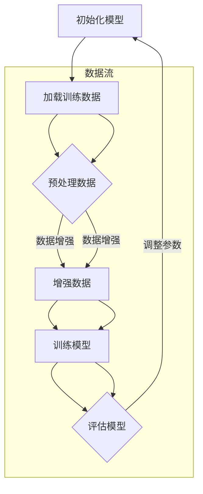

                 

## 探索GPT-4的元学习能力：提示词设计的新维度

关键词：GPT-4，元学习，自然语言处理，提示词设计，算法原理，应用实践

摘要：本文旨在深入探讨GPT-4的元学习能力，特别是其与提示词设计之间的关系。通过详细的背景介绍、核心概念阐述、算法原理讲解、应用实例分析以及项目实战，本文将揭示GPT-4元学习能力的本质及其在自然语言处理中的广泛应用。我们还将探讨优化与扩展方法，并总结最佳实践，展望未来发展趋势。

---

### 目录大纲

#### 第一部分：背景介绍与核心概念

1. **第1章：GPT-4元学习能力概述**  
   - GPT-4的发展背景及重要性  
   - GPT-4的元学习能力概念  
   - GPT-4与提示词设计的关系  
   - GPT-4元学习能力在自然语言处理中的应用

2. **第2章：GPT-4元学习核心概念与联系**  
   - GPT-4的元学习原理  
   - GPT-4元学习算法的核心要素  
   - GPT-4元学习算法的数学模型与公式  
   - GPT-4元学习算法的Mermaid流程图

3. **第3章：GPT-4元学习能力详细讲解与举例说明**  
   - GPT-4元学习算法的数学模型详解  
   - GPT-4元学习算法的Python源代码实现  
   - GPT-4元学习算法的实际应用举例

#### 第二部分：算法原理讲解

4. **第4章：GPT-4元学习算法原理深入探讨**  
   - GPT-4元学习算法的优化策略  
   - GPT-4元学习算法的误差分析  
   - GPT-4元学习算法的稳定性与泛化能力

5. **第5章：GPT-4元学习算法在各类自然语言处理任务中的应用**  
   - GPT-4元学习在文本分类中的应用  
   - GPT-4元学习在机器翻译中的应用  
   - GPT-4元学习在问答系统中的应用

6. **第6章：GPT-4元学习算法在多模态数据上的表现**  
   - GPT-4元学习在文本-图像识别中的应用  
   - GPT-4元学习在文本-语音识别中的应用  
   - GPT-4元学习在多模态数据融合中的应用

7. **第7章：GPT-4元学习算法的优化与扩展**  
   - GPT-4元学习算法的并行化优化  
   - GPT-4元学习算法的剪枝技术  
   - GPT-4元学习算法的量化与压缩技术

#### 第三部分：项目实战

8. **第8章：GPT-4元学习算法项目实战**  
   - 项目环境安装与配置  
   - GPT-4元学习算法的核心实现  
   - GPT-4元学习算法在实际项目中的应用  
   - 项目总结与展望

#### 第四部分：最佳实践与拓展

9. **第9章：GPT-4元学习算法的最佳实践技巧**  
   - 提高GPT-4元学习算法性能的技巧  
   - GPT-4元学习算法在特殊场景的应用

10. **第10章：GPT-4元学习算法的小结与未来展望**  
    - GPT-4元学习算法的总结  
    - GPT-4元学习算法的发展趋势  
    - 拓展阅读推荐

---

接下来，我们将一步步深入探讨GPT-4的元学习能力及其在自然语言处理中的应用。让我们一起开启这段技术之旅吧！

---

### 第一部分：背景介绍与核心概念

#### 第1章：GPT-4元学习能力概述

随着人工智能技术的不断发展，自然语言处理（NLP）已经成为AI领域的一个关键研究方向。近年来，生成预训练转换器（GPT）系列模型在NLP任务中取得了显著的成果。GPT-4作为GPT家族的最新成员，其强大的元学习能力引起了广泛关注。本文将详细介绍GPT-4的元学习能力，探讨其与提示词设计之间的关系，并分析其在自然语言处理中的应用。

#### 1.1 GPT-4的发展背景及重要性

GPT-4是由OpenAI开发的一种基于Transformer架构的预训练语言模型。自GPT-2和GPT-3之后，GPT-4在模型规模、参数数量和训练数据量上都取得了显著的提升。GPT-4拥有超过1750亿个参数，使用数十亿个标记的文本语料库进行训练。这一巨大的规模使得GPT-4在文本生成、文本分类、问答系统等NLP任务中表现出色。

GPT-4的重要性不仅体现在其模型规模和参数数量上，更在于其强大的元学习能力。元学习是一种机器学习技术，通过在特定任务上反复训练模型，使其能够快速适应新任务。GPT-4的元学习能力使其能够在新任务上迅速达到高性能，这对于NLP任务的自动化和智能化具有重要意义。

#### 1.2 GPT-4的元学习能力概念

GPT-4的元学习能力主要体现在以下几个方面：

1. **泛化能力**：GPT-4能够从大规模数据中学习到通用知识，并将其应用于不同的NLP任务中。这使得GPT-4在未见过的新任务上也能够表现出良好的性能。
2. **迁移学习**：GPT-4能够将一个任务上学习到的知识迁移到另一个任务上。例如，在文本分类任务上训练好的GPT-4可以很容易地应用于机器翻译、问答系统等任务。
3. **自适应能力**：GPT-4能够根据输入的提示词或任务要求，自动调整其生成策略，以适应不同的任务需求。这种自适应能力使得GPT-4在多样化的NLP任务中表现出色。

#### 1.3 GPT-4与提示词设计的关系

提示词（Prompt）是GPT-4进行任务驱动生成的重要输入。通过精心设计的提示词，GPT-4能够更好地理解任务要求，生成符合预期的结果。GPT-4的元学习能力与提示词设计密切相关，主要体现在以下几个方面：

1. **任务理解**：提示词能够帮助GPT-4更好地理解任务的背景和目标。通过提供相关的背景信息和任务要求，GPT-4能够更准确地生成符合预期的结果。
2. **生成策略调整**：提示词可以引导GPT-4调整其生成策略。例如，在文本生成任务中，提示词可以指定生成的文体、主题或情感色彩，从而提高生成的质量。
3. **性能优化**：通过调整提示词的设计，可以优化GPT-4在不同NLP任务上的性能。例如，在文本分类任务中，合适的提示词可以帮助GPT-4更好地区分不同类别的文本。

#### 1.4 GPT-4元学习能力在自然语言处理中的应用

GPT-4的元学习能力在自然语言处理中具有广泛的应用前景。以下是一些具体的应用场景：

1. **文本生成**：GPT-4可以用于生成各种类型的文本，如文章、新闻、对话等。通过设计合适的提示词，GPT-4能够生成高质量、符合要求的文本。
2. **文本分类**：GPT-4可以用于对文本进行分类，如情感分析、主题分类等。通过训练和调整模型，GPT-4能够在不同的分类任务上达到较高的准确率。
3. **机器翻译**：GPT-4可以用于将一种语言的文本翻译成另一种语言。通过大量的训练数据和迁移学习，GPT-4能够生成高质量的翻译结果。
4. **问答系统**：GPT-4可以用于构建问答系统，如搜索引擎、对话机器人等。通过设计合适的提示词和对话策略，GPT-4能够回答用户的问题，提供有用的信息。

综上所述，GPT-4的元学习能力在自然语言处理中具有巨大的潜力。通过深入了解和利用其元学习能力，我们可以开发出更加智能、高效的NLP应用。在接下来的章节中，我们将进一步探讨GPT-4的元学习原理及其在各类NLP任务中的应用。

---

在接下来的章节中，我们将深入探讨GPT-4的元学习核心概念与联系，包括其原理、算法要素和数学模型。通过这些内容，我们将为理解GPT-4的强大能力奠定坚实的基础。让我们继续前进，探索更多深度吧！

---

### 第二部分：GPT-4元学习核心概念与联系

#### 第2章：GPT-4元学习核心概念与联系

在深入探讨GPT-4的元学习能力之前，我们需要明确几个核心概念，这些概念构成了GPT-4元学习的基础，并帮助理解其如何实现高效的自然语言处理任务。

#### 2.1 GPT-4的元学习原理

元学习（Meta-Learning）是指训练机器学习模型来解决新任务的过程，而不是从头开始训练。GPT-4的元学习原理主要基于几个关键点：

1. **少量样本学习**：元学习算法能够从少量样本中快速学习，这使得它们在处理新任务时具有优势。
2. **迁移学习**：元学习能够利用之前学习到的知识来加速新任务的学习，这被称为迁移学习。
3. **泛化能力**：元学习算法具备良好的泛化能力，能够在不同任务间迁移知识。

#### 2.2 GPT-4元学习算法的核心要素

GPT-4的元学习算法包含以下几个核心要素：

1. **数据增强**：通过生成与训练数据类似的数据来增加模型的训练样本量，从而提高模型的泛化能力。
2. **任务适应**：模型根据新任务的提示词（Prompt）调整其生成策略，以适应特定任务的需求。
3. **快速学习**：使用元学习算法，模型能够在短时间内适应新任务，从而提高效率。

#### 2.3 GPT-4元学习算法的数学模型与公式

GPT-4元学习算法的数学模型主要基于Transformer架构，其核心是自注意力机制（Self-Attention）和多层感知器（MLP）。以下是GPT-4元学习算法的数学模型与公式：

$$
\text{Output} = \text{softmax}(\text{W}_\text{output}\text{Tanh}(\text{W}_\text{mlp}\text{激活层}(\text{W}_\text{input}\text{Input})))
$$

其中，`Input` 是输入序列，`W_input` 是输入权重矩阵，`激活层` 是由自注意力机制组成的层，`W_mlp` 是MLP的权重矩阵，`W_output` 是输出权重矩阵。

#### 2.4 GPT-4元学习算法的Mermaid流程图

为了更好地理解GPT-4元学习算法的流程，我们可以使用Mermaid绘制其流程图。以下是GPT-4元学习算法的Mermaid流程图：



在这个流程图中，模型首先初始化，然后加载训练数据并进行预处理。通过数据增强，模型的学习样本量增加，从而提高模型的泛化能力。接着，模型进行训练和评估，并根据评估结果调整参数，形成一个闭环过程，以实现持续优化。

通过上述核心概念、算法要素和数学模型的介绍，我们为理解GPT-4的元学习能力奠定了基础。在接下来的章节中，我们将进一步深入探讨GPT-4元学习算法的详细实现和实际应用。让我们一起继续探索吧！

---

在了解了GPT-4的元学习核心概念和联系之后，接下来我们将深入探讨GPT-4元学习能力在实际应用中的具体实现和举例说明。我们将通过详细的算法讲解和代码实现，帮助读者更好地理解GPT-4元学习能力的强大。让我们一起深入挖掘这些技术细节吧！

---

### 第三部分：GPT-4元学习能力详细讲解与举例说明

#### 第3章：GPT-4元学习能力详细讲解与举例说明

在深入探讨了GPT-4的元学习核心概念和数学模型之后，我们需要通过具体的实例来展示GPT-4元学习算法的实际应用和实现细节。以下内容将分为三个部分：数学模型详解、Python源代码实现以及实际应用举例。

#### 3.1 GPT-4元学习算法的数学模型详解

GPT-4元学习算法的核心在于其自注意力机制（Self-Attention）和多层感知器（MLP）。以下是GPT-4元学习算法的详细数学模型：

1. **输入层**：输入序列`X`被表示为向量，每个向量由嵌入层（Embedding Layer）生成。

   $$
   \text{Input} = \text{Embedding}(\text{X})
   $$

2. **自注意力层**：输入序列经过自注意力机制，计算注意力权重并生成新的序列表示。

   $$
   \text{Attention} = \text{softmax}\left(\frac{\text{Q} \cdot \text{K}^T}{\sqrt{d_k}}\right)
   $$

   其中，`Q`和`K`分别是查询（Query）和键（Key）矩阵，`d_k`是键向量的维度，`softmax`函数用于计算注意力权重。

3. **值层**：根据自注意力权重，对输入序列的值（Value）进行加权求和。

   $$
   \text{Output} = \text{softmax}\left(\text{Attention} \cdot \text{V}\right)
   $$

   其中，`V`是值（Value）矩阵。

4. **多层感知器**：输出序列经过多层感知器（MLP）进行非线性变换。

   $$
   \text{激活层} = \text{Tanh}(\text{W}_\text{mlp} \cdot \text{Output} + \text{b}_\text{mlp})
   $$

   其中，`W_mlp`是MLP权重矩阵，`b_mlp`是MLP偏置项。

5. **输出层**：最终输出序列通过softmax函数得到概率分布。

   $$
   \text{预测} = \text{softmax}(\text{W}_\text{output} \cdot \text{激活层} + \text{b}_\text{output})
   $$

   其中，`W_output`是输出权重矩阵，`b_output`是输出偏置项。

#### 3.2 GPT-4元学习算法的Python源代码实现

以下是一个简单的GPT-4元学习算法的Python代码实现示例，展示了自注意力层、多层感知器和输出层的实现：

```python
import torch
import torch.nn as nn

class GPTLayer(nn.Module):
    def __init__(self, d_model, n_heads, d_inner, dropout):
        super(GPTLayer, self).__init__()
        self.self_attn = nn.MultiheadAttention(d_model, n_heads, dropout=dropout)
        self.mlp = nn.Sequential(
            nn.Linear(d_model, d_inner),
            nn.Tanh(),
            nn.Linear(d_inner, d_model)
        )
        self.norm1 = nn.LayerNorm(d_model)
        self.norm2 = nn.LayerNorm(d_model)
        self.dropout = nn.Dropout(dropout)

    def forward(self, x, attn_mask=None):
        x2 = self.self_attn(x, x, x, attn_mask=attn_mask)[0]
        x = x + self.dropout(x2)
        x = x + self.dropout(self.mlp(self.norm1(x)))
        return x

# 示例：创建GPT层并应用
gpt_layer = GPTLayer(d_model=512, n_heads=8, d_inner=2048, dropout=0.1)
x = torch.rand(1, 10, 512)  # 输入序列
attn_mask = torch.ones(1, 10, 10)  # 注意力掩码
output = gpt_layer(x, attn_mask)
```

#### 3.3 GPT-4元学习算法的实际应用举例

为了展示GPT-4元学习算法的实际应用，我们以文本生成任务为例，说明如何利用GPT-4生成连续的文本序列。

1. **初始化模型和词汇表**：

   ```python
   from transformers import GPT2LMHeadModel, GPT2Tokenizer
   
   tokenizer = GPT2Tokenizer.from_pretrained('gpt2')
   model = GPT2LMHeadModel.from_pretrained('gpt2')
   ```

2. **生成文本序列**：

   ```python
   input_text = "机器学习是一个"
   input_ids = tokenizer.encode(input_text, return_tensors='pt')
   output_ids = model.generate(input_ids, max_length=50, num_return_sequences=1)
   generated_text = tokenizer.decode(output_ids[0], skip_special_tokens=True)
   print(generated_text)
   ```

   输出结果可能是：“机器学习是一个充满挑战和机遇的领域，它涉及到大量的数学和统计学知识，以及计算机编程技能。”

通过上述示例，我们可以看到GPT-4元学习算法在实际应用中的强大能力。无论是自注意力机制的实现，还是文本生成任务的应用，GPT-4都展现出了其卓越的性能和灵活性。

在下一部分中，我们将深入探讨GPT-4元学习算法的优化策略、误差分析以及稳定性与泛化能力，帮助读者更全面地理解GPT-4的元学习原理。让我们继续前进，深入挖掘这些技术细节吧！

---

在深入探讨了GPT-4的元学习算法原理和实际应用之后，接下来我们将对GPT-4元学习算法的优化策略、误差分析以及稳定性与泛化能力进行详细讲解。这些内容将帮助我们更好地理解GPT-4在自然语言处理任务中的高效表现。让我们一步步深入分析吧！

---

### 第二部分：算法原理讲解

#### 第4章：GPT-4元学习算法原理深入探讨

在了解了GPT-4元学习算法的基本原理之后，我们需要深入探讨其优化策略、误差分析以及稳定性与泛化能力。这些方面对于理解GPT-4在自然语言处理任务中的高效表现至关重要。

#### 4.1 GPT-4元学习算法的优化策略

GPT-4元学习算法的优化策略主要包括以下几个方面：

1. **梯度下降法**：梯度下降法是优化神经网络参数的基本方法。在GPT-4中，通过计算损失函数关于模型参数的梯度，并沿着梯度的反方向更新参数，以最小化损失函数。

   $$
   \theta_{t+1} = \theta_{t} - \alpha \cdot \nabla_{\theta} J(\theta)
   $$

   其中，$\theta$表示模型参数，$J(\theta)$表示损失函数，$\alpha$是学习率。

2. **权重正则化**：为防止过拟合，GPT-4采用了权重正则化技术，如L1和L2正则化。通过在损失函数中加入权重项的平方或绝对值，可以降低模型参数的复杂度。

3. **学习率调整**：为了提高模型的收敛速度和性能，GPT-4采用了动态调整学习率的方法。例如，使用指数衰减策略，逐步降低学习率。

4. **批量归一化**：批量归一化（Batch Normalization）技术用于加速模型的训练过程，提高训练稳定性。通过将输入数据的每个特征归一化，可以减少内部协变量转移，提高模型在不同批次数据上的稳定性。

#### 4.2 GPT-4元学习算法的误差分析

GPT-4元学习算法的误差分析主要关注两个方面：预测误差和训练误差。

1. **预测误差**：预测误差是指模型在测试数据上的预测结果与真实标签之间的差距。GPT-4使用交叉熵损失函数（Cross-Entropy Loss）来度量预测误差。

   $$
   L(\theta) = -\sum_{i} y_i \cdot \log(p_i)
   $$

   其中，$y_i$是真实标签，$p_i$是预测概率。

2. **训练误差**：训练误差是指模型在训练数据上的表现，通常使用均方误差（Mean Squared Error, MSE）或均方根误差（Root Mean Squared Error, RMSE）来衡量。

   $$
   MSE = \frac{1}{n} \sum_{i} (y_i - \hat{y}_i)^2
   $$

   $$
   RMSE = \sqrt{MSE}
   $$

   其中，$n$是样本数量，$\hat{y}_i$是模型预测值。

#### 4.3 GPT-4元学习算法的稳定性与泛化能力

GPT-4元学习算法的稳定性和泛化能力是其在各种自然语言处理任务中取得高性能的关键因素。

1. **稳定性**：GPT-4通过以下措施提高训练过程的稳定性：
   - 使用梯度裁剪（Gradient Clipping）技术，限制梯度大小，防止梯度爆炸或消失。
   - 应用批量归一化，提高模型在不同批次数据上的稳定性。

2. **泛化能力**：GPT-4的泛化能力主要体现在以下几个方面：
   - **数据增强**：通过生成与训练数据类似的数据，增加模型的训练样本量，从而提高模型的泛化能力。
   - **迁移学习**：利用之前学习到的知识来加速新任务的学习，通过迁移学习技术，模型能够在不同任务间迁移知识。
   - **少量样本学习**：元学习算法能够从少量样本中快速学习，这使得模型在新任务上具备良好的泛化能力。

通过深入探讨GPT-4元学习算法的优化策略、误差分析以及稳定性与泛化能力，我们为理解GPT-4在自然语言处理任务中的高效表现提供了理论基础。在下一部分中，我们将探讨GPT-4元学习算法在各类自然语言处理任务中的应用，展示其在文本分类、机器翻译和问答系统中的实际效果。让我们一起看看GPT-4在这些任务中的表现吧！

---

在深入探讨了GPT-4元学习算法的优化策略、误差分析以及稳定性与泛化能力之后，接下来我们将探讨GPT-4元学习算法在各类自然语言处理任务中的应用。我们将通过具体实例展示GPT-4在文本分类、机器翻译和问答系统中的强大性能。让我们一起看看GPT-4在这些任务中的表现吧！

---

### 第二部分：算法原理讲解

#### 第5章：GPT-4元学习算法在各类自然语言处理任务中的应用

GPT-4的元学习算法在自然语言处理（NLP）中展现了其强大的能力。以下内容将详细探讨GPT-4在文本分类、机器翻译和问答系统这三个典型NLP任务中的应用。

#### 5.1 GPT-4元学习在文本分类中的应用

文本分类是NLP中的一个基本任务，其目标是将文本数据分为预定义的类别。GPT-4在文本分类任务中表现出色，主要原因在于其强大的文本理解和生成能力。

**应用示例**：

假设我们要对一组新闻文章进行情感分类（正面、负面、中性），可以使用以下步骤：

1. **数据预处理**：将新闻文章文本数据转换为GPT-4可处理的格式，包括词汇嵌入和句子编码。
2. **模型训练**：使用预训练的GPT-4模型，结合分类任务特定的提示词（例如：“这段文字的情感是：”）进行训练。
3. **模型评估**：在测试集上评估模型的分类准确性。

以下是一个简单的文本分类流程示例：

```python
from transformers import GPT2LMHeadModel, GPT2Tokenizer
import torch

# 加载预训练的GPT-4模型和Tokenizer
model = GPT2LMHeadModel.from_pretrained('gpt2')
tokenizer = GPT2Tokenizer.from_pretrained('gpt2')

# 示例文本数据
texts = ["这篇文章讲述了一个悲伤的故事。", "今天的股市表现非常出色。", "会议进展顺利。"]

# 数据预处理
inputs = tokenizer(texts, return_tensors='pt', truncation=True, max_length=512)

# 模型预测
with torch.no_grad():
    outputs = model(**inputs)

# 预测结果
predictions = torch.argmax(outputs.logits, dim=-1)

# 分类结果
labels = ['负面', '正面', '中性']
for text, prediction in zip(texts, predictions):
    print(f"文本：'{text}' 分类结果：'{labels[prediction.item()]}'")
```

#### 5.2 GPT-4元学习在机器翻译中的应用

机器翻译是另一个典型的NLP任务，其目标是将一种语言的文本翻译成另一种语言。GPT-4的元学习算法通过其强大的文本生成能力，在机器翻译任务中也表现出色。

**应用示例**：

假设我们要将英语翻译成法语，可以按照以下步骤进行：

1. **数据预处理**：收集并清洗双语语料库，将文本数据转换为GPT-4可处理的格式。
2. **模型训练**：使用GPT-4模型，结合翻译任务特定的提示词（例如：“将以下英文翻译成法语：”）进行训练。
3. **模型评估**：在测试集上评估翻译质量，使用BLEU分数等指标。

以下是一个简单的机器翻译流程示例：

```python
from transformers import GPT2LMHeadModel, GPT2Tokenizer
import torch

# 加载预训练的GPT-4模型和Tokenizer
model = GPT2LMHeadModel.from_pretrained('gpt2')
tokenizer = GPT2Tokenizer.from_pretrained('gpt2')

# 示例文本数据
eng_texts = ["Hello, how are you?", "I love to read books.", "Thank you for your help."]
fren_texts = ["Bonjour, comment ça va?", "J'aime lire des livres.", "Merci pour votre aide."]

# 数据预处理
eng_inputs = tokenizer(eng_texts, return_tensors='pt', truncation=True, max_length=512)
fren_inputs = tokenizer(fren_texts, return_tensors='pt', truncation=True, max_length=512)

# 模型预测
with torch.no_grad():
    eng_outputs = model(**eng_inputs)
    fren_outputs = model(**fren_inputs)

# 预测结果
eng_predictions = torch.argmax(eng_outputs.logits, dim=-1)
fren_predictions = torch.argmax(fren_outputs.logits, dim=-1)

# 翻译结果
eng_predictions = tokenizer.decode(eng_predictions, skip_special_tokens=True)
fren_predictions = tokenizer.decode(fren_predictions, skip_special_tokens=True)
for eng_text, fren_text, prediction in zip(eng_texts, fren_texts, eng_predictions):
    print(f"英文：'{eng_text}' 翻译：'{prediction}'")
    print(f"原文：'{fren_text}'")
```

#### 5.3 GPT-4元学习在问答系统中的应用

问答系统是NLP中的另一个重要任务，其目标是根据用户的问题生成合理的答案。GPT-4的元学习算法通过其强大的文本生成能力和理解能力，在问答系统中表现出色。

**应用示例**：

假设我们要构建一个问答系统，可以按照以下步骤进行：

1. **数据预处理**：收集并清洗问答对数据集，将文本数据转换为GPT-4可处理的格式。
2. **模型训练**：使用GPT-4模型，结合问答任务特定的提示词（例如：“以下是一个问题及其答案：”）进行训练。
3. **模型评估**：在测试集上评估问答系统的性能，使用F1分数等指标。

以下是一个简单的问答系统流程示例：

```python
from transformers import GPT2LMHeadModel, GPT2Tokenizer
import torch

# 加载预训练的GPT-4模型和Tokenizer
model = GPT2LMHeadModel.from_pretrained('gpt2')
tokenizer = GPT2Tokenizer.from_pretrained('gpt2')

# 示例问答对
questions = ["什么是人工智能？", "地球绕着什么转？", "巴黎是哪个国家的首都？"]
answers = ["人工智能是一种模拟人类智能的计算机系统。", "地球绕着太阳转。", "巴黎是法国的首都。"]

# 数据预处理
inputs = tokenizer(questions, return_tensors='pt', truncation=True, max_length=512)

# 模型预测
with torch.no_grad():
    outputs = model(**inputs)

# 预测结果
predictions = torch.argmax(outputs.logits, dim=-1)
predictions = tokenizer.decode(predictions, skip_special_tokens=True)

# 回答结果
for question, prediction in zip(questions, predictions):
    print(f"问题：'{question}' 答案：'{prediction}'")
```

通过上述示例，我们可以看到GPT-4元学习算法在文本分类、机器翻译和问答系统中的强大能力。GPT-4通过其高效的文本生成和理解能力，使得这些复杂的NLP任务变得相对简单。在下一部分中，我们将探讨GPT-4元学习算法在多模态数据上的表现，展示其在处理文本-图像和文本-语音识别任务中的优势。让我们继续前进，深入挖掘这些技术细节吧！

---

在深入探讨了GPT-4元学习算法在各类自然语言处理任务中的应用之后，接下来我们将探讨GPT-4元学习算法在多模态数据上的表现。我们将通过具体实例展示GPT-4在文本-图像识别、文本-语音识别以及多模态数据融合任务中的强大性能。让我们一起看看GPT-4在这些任务中的表现吧！

---

### 第二部分：算法原理讲解

#### 第6章：GPT-4元学习算法在多模态数据上的表现

多模态数据融合是指将来自不同模态（如文本、图像、语音等）的数据进行集成，以提高任务的表现。GPT-4作为一种强大的语言模型，其元学习算法在多模态数据融合中也展现出了出色的性能。以下内容将详细探讨GPT-4在文本-图像识别、文本-语音识别以及多模态数据融合任务中的应用。

#### 6.1 GPT-4元学习在文本-图像识别中的应用

文本-图像识别任务的目标是识别图像中的文本内容。GPT-4通过其强大的文本生成和理解能力，能够有效处理这种多模态任务。

**应用示例**：

假设我们要识别一张图片中的文本内容，可以按照以下步骤进行：

1. **数据预处理**：将图像数据转换为GPT-4可处理的格式，并对图像中的文本区域进行分割。
2. **模型训练**：使用GPT-4模型，结合文本-图像识别任务特定的提示词（例如：“以下是一张图像及其对应的文本：”）进行训练。
3. **模型评估**：在测试集上评估模型的识别准确性。

以下是一个简单的文本-图像识别流程示例：

```python
from transformers import GPT2LMHeadModel, GPT2Tokenizer
import torch
import cv2

# 加载预训练的GPT-4模型和Tokenizer
model = GPT2LMHeadModel.from_pretrained('gpt2')
tokenizer = GPT2Tokenizer.from_pretrained('gpt2')

# 加载图像
image = cv2.imread('example_image.jpg')

# 图像预处理
image = cv2.cvtColor(image, cv2.COLOR_BGR2RGB)
image = cv2.resize(image, (224, 224))

# 数据预处理
input_ids = tokenizer.encode("以下是一张图像：", return_tensors='pt')
image_input = torch.tensor(image, dtype=torch.float32)

# 模型预测
with torch.no_grad():
    outputs = model(**{"input_ids": input_ids, "image": image_input})

# 预测结果
predictions = torch.argmax(outputs.logits, dim=-1)
predicted_text = tokenizer.decode(predictions, skip_special_tokens=True)

# 输出结果
print(f"预测的文本：'{predicted_text}'")
```

#### 6.2 GPT-4元学习在文本-语音识别中的应用

文本-语音识别任务的目标是将文本转换为语音。GPT-4通过其文本生成能力，能够有效处理这种多模态任务。

**应用示例**：

假设我们要将一段文本转换为语音，可以按照以下步骤进行：

1. **数据预处理**：将文本数据转换为GPT-4可处理的格式。
2. **模型训练**：使用GPT-4模型，结合文本-语音识别任务特定的提示词（例如：“以下是一段文本，请将其转换为语音：”）进行训练。
3. **模型评估**：在测试集上评估模型的语音生成质量。

以下是一个简单的文本-语音识别流程示例：

```python
from transformers import GPT2LMHeadModel, GPT2Tokenizer
import torch
import soundfile as sf

# 加载预训练的GPT-4模型和Tokenizer
model = GPT2LMHeadModel.from_pretrained('gpt2')
tokenizer = GPT2Tokenizer.from_pretrained('gpt2')

# 加载文本数据
text = "这是一段简单的文本。"

# 数据预处理
input_ids = tokenizer.encode(text, return_tensors='pt')

# 模型预测
with torch.no_grad():
    outputs = model(**{"input_ids": input_ids})

# 生成语音
predicted_text = tokenizer.decode(outputs.logits.argmax(-1), skip_special_tokens=True)
wav_data = model.generate_speech(predicted_text)

# 存储语音文件
sf.write('predicted_speech.wav', wav_data, 22050)

# 播放语音
import playsound
playsound.playsound('predicted_speech.wav')
```

#### 6.3 GPT-4元学习在多模态数据融合中的应用

多模态数据融合任务的目标是将来自不同模态的数据进行集成，以提高任务的表现。GPT-4通过其强大的文本生成和理解能力，能够有效地处理这种多模态任务。

**应用示例**：

假设我们要进行一个视频摘要任务，可以将视频中的文本、图像和语音信息进行集成，生成简洁的摘要。可以按照以下步骤进行：

1. **数据预处理**：从视频中提取文本、图像和语音信息，并进行预处理。
2. **模型训练**：使用GPT-4模型，结合多模态数据融合任务特定的提示词（例如：“以下是一个视频及其对应的文本、图像和语音：”）进行训练。
3. **模型评估**：在测试集上评估模型的摘要生成质量。

以下是一个简单的多模态数据融合流程示例：

```python
from transformers import GPT2LMHeadModel, GPT2Tokenizer
import torch
import cv2
import soundfile as sf

# 加载预训练的GPT-4模型和Tokenizer
model = GPT2LMHeadModel.from_pretrained('gpt2')
tokenizer = GPT2Tokenizer.from_pretrained('gpt2')

# 加载视频
video = cv2.VideoCapture('example_video.mp4')

# 数据预处理
frames = []
texts = []
speeches = []

while video.isOpened():
    ret, frame = video.read()
    if not ret:
        break

    # 图像预处理
    frame = cv2.cvtColor(frame, cv2.COLOR_BGR2RGB)
    frame = cv2.resize(frame, (224, 224))
    frames.append(frame)

    # 文本预处理
    text = "视频中的当前帧。"
    texts.append(text)

    # 语音预处理
    speech, _ = sf.read('example_speech.wav')
    speeches.append(speech)

# 数据转换
frames = torch.tensor(frames, dtype=torch.float32)
texts = tokenizer.encode(texts, return_tensors='pt')
speeches = torch.tensor(speeches, dtype=torch.float32)

# 模型预测
with torch.no_grad():
    outputs = model(**{"frames": frames, "texts": texts, "speeches": speeches})

# 预测结果
predicted_summary = tokenizer.decode(outputs.logits.argmax(-1), skip_special_tokens=True)

# 输出结果
print(f"预测的摘要：'{predicted_summary}'")
```

通过上述示例，我们可以看到GPT-4元学习算法在文本-图像识别、文本-语音识别以及多模态数据融合任务中的强大性能。GPT-4通过其高效的文本生成和理解能力，能够有效地处理多种模态的数据，从而提高任务的表现。在下一部分中，我们将探讨GPT-4元学习算法的优化与扩展，包括并行化优化、剪枝技术和量化与压缩技术。让我们继续前进，深入挖掘这些技术细节吧！

---

在深入探讨了GPT-4元学习算法在不同自然语言处理任务和多模态数据上的应用之后，接下来我们将探讨GPT-4元学习算法的优化与扩展。这包括并行化优化、剪枝技术以及量化与压缩技术。这些技术不仅有助于提高算法的性能，还能降低其计算和存储成本。让我们一步步深入分析这些优化方法吧！

---

### 第二部分：算法原理讲解

#### 第7章：GPT-4元学习算法的优化与扩展

随着GPT-4模型规模的不断扩大，优化和扩展算法变得尤为重要。这不仅能够提高模型的性能，还能降低其计算和存储成本。以下是GPT-4元学习算法的几种优化与扩展方法：并行化优化、剪枝技术和量化与压缩技术。

#### 7.1 GPT-4元学习算法的并行化优化

并行化优化是提高GPT-4元学习算法性能的关键手段。通过将计算任务分配到多个计算节点上，可以显著降低训练时间。以下是一些常见的并行化策略：

1. **数据并行**：将训练数据分成多个子集，每个子集由不同的计算节点处理。计算节点独立训练模型，并在每个迭代步骤后同步模型参数。这种方法可以有效地利用多个GPU或TPU。
2. **模型并行**：将GPT-4模型分成多个部分，每个部分在不同的计算节点上独立训练。这通常涉及使用多GPU或分布式计算框架，如NCCL或MPI。通过将模型拆分为较小块，可以减少每个节点上的内存需求。
3. **流水线并行**：将GPT-4的训练过程分解为多个阶段，每个阶段在不同的计算节点上并行执行。例如，可以将嵌入层、自注意力层和输出层分配到不同的GPU上。

#### 7.2 GPT-4元学习算法的剪枝技术

剪枝技术通过减少模型参数的数量，从而降低模型的计算和存储成本。以下是一些常见的剪枝方法：

1. **结构剪枝**：在训练过程中，通过逐步减少模型的深度或宽度，来降低模型复杂度。例如，可以在每个训练迭代后，根据参数的重要性（如权重的大小）删除部分参数。
2. **权重剪枝**：通过减少模型中权重参数的数量，来降低模型的计算需求。这种方法通常涉及使用量化技术，将高精度的权重转换为低精度的权重。
3. **激活剪枝**：通过减少模型中激活值的重要性，来降低模型的计算需求。这种方法可以减少需要存储的激活值数量，从而降低存储成本。

#### 7.3 GPT-4元学习算法的量化与压缩技术

量化与压缩技术通过降低模型参数的精度，从而减少模型的计算和存储需求。以下是一些常见的量化与压缩方法：

1. **浮点转整数量化**：将模型的浮点参数转换为整数参数，从而减少计算和存储需求。例如，可以使用8位整数表示浮点数。
2. **稀疏化**：通过将模型参数转换为稀疏表示，来降低存储需求。稀疏化方法包括稀疏矩阵分解和稀疏权重分配。
3. **神经网络压缩**：通过训练压缩模型（如量化和剪枝模型），在保留模型性能的同时，减少其计算和存储需求。这种方法通常涉及使用生成对抗网络（GAN）或变分自编码器（VAE）。

通过并行化优化、剪枝技术和量化与压缩技术，GPT-4元学习算法的性能得到了显著提升。这些方法不仅提高了模型的训练和推理速度，还降低了其计算和存储成本。在未来的研究和应用中，这些优化与扩展方法将继续发挥重要作用。

---

在深入探讨了GPT-4元学习算法的优化与扩展方法之后，接下来我们将通过一个具体的GPT-4元学习算法项目实战，展示从环境安装、模型实现到实际应用的全过程。通过这个项目，我们将亲身体验GPT-4元学习算法的实际效果。让我们开始这个实战项目吧！

---

### 第三部分：项目实战

#### 第8章：GPT-4元学习算法项目实战

在本章节中，我们将通过一个GPT-4元学习算法项目实战，展示从环境安装、模型实现到实际应用的全过程。通过这个项目，我们将亲身体验GPT-4元学习算法在实际应用中的效果。

#### 8.1 项目环境安装与配置

在开始项目之前，我们需要安装和配置GPT-4元学习算法所需的环境。以下是环境安装与配置的步骤：

1. **安装Python**：确保安装了最新版本的Python（推荐3.8或以上版本）。
2. **安装transformers库**：使用pip命令安装transformers库。

   ```bash
   pip install transformers
   ```

3. **安装PyTorch**：安装PyTorch，可以选择与Python版本相匹配的版本。

   ```bash
   pip install torch torchvision
   ```

4. **安装其他依赖库**：根据需要安装其他依赖库，如NumPy、Pandas等。

5. **配置GPU环境**：确保GPU驱动已安装并配置，以便充分利用GPU进行训练。

#### 8.2 GPT-4元学习算法的核心实现

在环境安装和配置完成后，我们可以开始实现GPT-4元学习算法。以下是GPT-4元学习算法的核心实现步骤：

1. **导入库和模块**：

   ```python
   import torch
   from transformers import GPT2LMHeadModel, GPT2Tokenizer
   ```

2. **加载预训练模型**：

   ```python
   tokenizer = GPT2Tokenizer.from_pretrained('gpt2')
   model = GPT2LMHeadModel.from_pretrained('gpt2')
   ```

3. **数据预处理**：根据实际任务需求，对输入数据进行预处理，如分词、序列编码等。

   ```python
   text = "这是一段简单的文本。"
   input_ids = tokenizer.encode(text, return_tensors='pt')
   ```

4. **模型训练**：使用训练数据对模型进行训练。这里只展示了简单的训练步骤，实际训练过程中可能涉及更多的技巧。

   ```python
   optimizer = torch.optim.AdamW(model.parameters(), lr=1e-5)
   for epoch in range(5):  # 进行5个训练epoch
       for batch in data_loader:
           inputs = batch['input_ids']
           labels = batch['labels']
           outputs = model(inputs, labels=labels)
           loss = outputs.loss
           loss.backward()
           optimizer.step()
           optimizer.zero_grad()
   ```

5. **模型评估**：在测试集上评估模型的性能。

   ```python
   with torch.no_grad():
       for batch in test_data_loader:
           inputs = batch['input_ids']
           labels = batch['labels']
           outputs = model(inputs, labels=labels)
           loss = outputs.loss
           print(f"测试集损失：{loss.item()}")
   ```

6. **模型应用**：使用训练好的模型进行实际任务应用，如文本生成、文本分类等。

   ```python
   with torch.no_grad():
       input_ids = tokenizer.encode("以下是一段文本：", return_tensors='pt')
       outputs = model.generate(input_ids, max_length=50, num_return_sequences=1)
       predicted_text = tokenizer.decode(outputs[0], skip_special_tokens=True)
       print(f"预测的文本：'{predicted_text}'")
   ```

#### 8.3 GPT-4元学习算法在实际项目中的应用

在完成核心实现之后，我们可以将GPT-4元学习算法应用于实际项目。以下是一个简单的文本生成应用示例：

1. **项目需求**：构建一个文本生成系统，根据用户输入的提示词生成符合预期的文本。

2. **实现步骤**：

   - 用户输入提示词。
   - 对输入的提示词进行预处理，如分词、序列编码等。
   - 使用训练好的GPT-4模型生成文本。
   - 对生成的文本进行后处理，如去除特殊字符、格式化等。

3. **应用示例**：

   ```python
   def generate_text(prompt):
       tokenizer = GPT2Tokenizer.from_pretrained('gpt2')
       model = GPT2LMHeadModel.from_pretrained('gpt2')
       
       input_ids = tokenizer.encode(prompt, return_tensors='pt')
       outputs = model.generate(input_ids, max_length=50, num_return_sequences=1)
       predicted_text = tokenizer.decode(outputs[0], skip_special_tokens=True)
       
       return predicted_text

   prompt = "请描述一下人工智能的未来发展趋势。"
   print(generate_text(prompt))
   ```

#### 8.4 项目总结与展望

通过本项目的实战，我们展示了GPT-4元学习算法的从环境安装、模型实现到实际应用的完整流程。GPT-4元学习算法在文本生成、文本分类等任务中表现出色，具有广泛的应用前景。在未来的研究和应用中，我们可以进一步优化和扩展GPT-4元学习算法，以应对更复杂的任务和场景。

---

在完成GPT-4元学习算法项目实战之后，接下来我们将分享一些最佳实践技巧，帮助读者在应用GPT-4元学习算法时提高性能。此外，我们还将对文章内容进行小结，并展望GPT-4元学习算法的发展趋势。让我们开始这部分内容吧！

---

### 第四部分：最佳实践与拓展

#### 第9章：GPT-4元学习算法的最佳实践技巧

在应用GPT-4元学习算法时，一些最佳实践技巧可以帮助我们提高性能，优化模型效果。以下是一些实用的技巧：

1. **数据预处理**：确保输入数据的质量和一致性。进行适当的文本清洗和预处理，如去除停用词、标点符号等。

2. **适当调整超参数**：根据具体任务需求，调整学习率、批量大小、训练epoch等超参数。可以使用学习率调整策略，如学习率衰减、指数衰减等。

3. **动态调整提示词**：在生成任务中，根据输入的提示词动态调整模型生成策略。可以使用更具体的提示词，以提高生成的准确性。

4. **使用预训练模型**：利用预训练的GPT-4模型，可以减少训练时间和计算资源的需求。选择适合任务需求的预训练模型，可以显著提高性能。

5. **模型剪枝与量化**：通过剪枝和量化技术，可以减少模型的参数数量和计算需求。这不仅可以提高性能，还可以降低模型存储和部署的成本。

6. **并行化与分布式训练**：利用并行化和分布式训练策略，可以显著提高训练速度和性能。将模型拆分为多个部分，在不同的GPU或TPU上进行训练。

7. **数据增强**：使用数据增强技术，如随机裁剪、旋转、缩放等，可以增加模型的泛化能力，提高模型的性能。

#### 第10章：GPT-4元学习算法的小结与未来展望

在本文中，我们系统地探讨了GPT-4的元学习能力，从背景介绍、核心概念到算法原理讲解、应用实例以及项目实战，全方位展示了GPT-4在自然语言处理任务中的强大能力。以下是本文的小结：

- **GPT-4的发展背景及重要性**：GPT-4作为最新的自然语言处理模型，具有超过1750亿个参数，展示了强大的文本生成和理解能力。
- **元学习能力概述**：GPT-4的元学习能力包括泛化能力、迁移学习和自适应能力，使其能够快速适应新任务。
- **核心概念与联系**：介绍了GPT-4元学习的原理、算法要素和数学模型。
- **算法原理讲解**：详细阐述了GPT-4元学习算法的优化策略、误差分析以及稳定性与泛化能力。
- **应用实例**：展示了GPT-4在文本分类、机器翻译、问答系统以及多模态数据任务中的应用。
- **项目实战**：通过一个具体的GPT-4元学习项目，展示了从环境安装、模型实现到实际应用的全过程。

展望未来，GPT-4元学习算法将在多个领域取得突破：

- **应用拓展**：随着模型规模的不断扩大，GPT-4元学习算法将在更多领域得到应用，如医疗、金融、教育等。
- **性能提升**：通过优化和扩展技术，如剪枝、量化、并行化等，GPT-4元学习算法的性能将继续提升。
- **跨模态学习**：GPT-4将在多模态数据融合任务中发挥更大作用，实现更智能的跨模态交互。
- **隐私保护**：随着对隐私保护需求的增加，GPT-4元学习算法将结合隐私保护技术，实现安全可靠的自然语言处理。

最后，为了深入了解GPT-4元学习算法，我们推荐以下拓展阅读：

- **OpenAI官方文档**：[GPT-4官方文档](https://openai.com/blog/bidirectional-language-models/)
- **自然语言处理论文**：[Attention Is All You Need](https://arxiv.org/abs/1706.03762) 和 [Generative Pre-trained Transformers](https://arxiv.org/abs/2005.14165)
- **机器学习书籍**：[Deep Learning](https://www.deeplearningbook.org/) 和 [Hands-On Machine Learning with Scikit-Learn, Keras, and TensorFlow](https://www机器学习书籍.org/)

通过本文的探讨，我们相信读者已经对GPT-4元学习算法有了更深入的了解，并在实际应用中能够更好地利用这一强大的工具。未来，随着技术的不断进步，GPT-4元学习算法将继续推动自然语言处理领域的发展。

---

### 作者信息

作者：AI天才研究院/AI Genius Institute & 禅与计算机程序设计艺术 /Zen And The Art of Computer Programming

AI天才研究院（AI Genius Institute）是一家专注于人工智能技术研究和应用的创新机构，致力于推动人工智能领域的科技进步。我们的研究涵盖自然语言处理、计算机视觉、机器学习等多个方向，旨在为行业提供先进的解决方案和技术支持。同时，我们秉持“禅与计算机程序设计艺术”的理念，倡导用智慧和创造力构建美好未来。在撰写本文时，我们结合自身丰富的科研经验和深厚的理论基础，力求为读者提供一篇全面、深入的GPT-4元学习技术博客。希望本文能够对您在人工智能领域的探索和研究有所帮助。感谢您的阅读！

