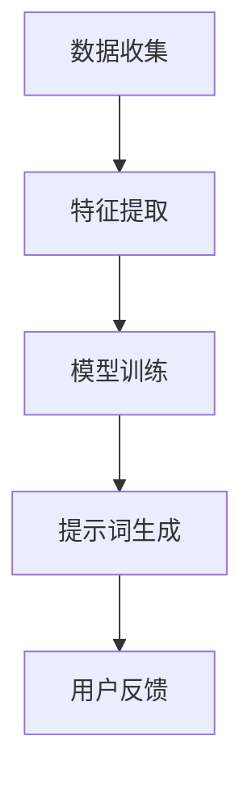
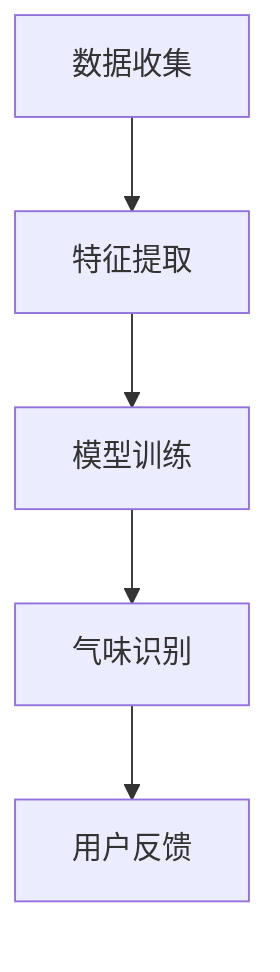
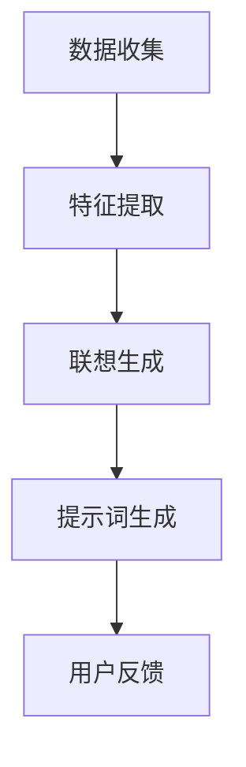
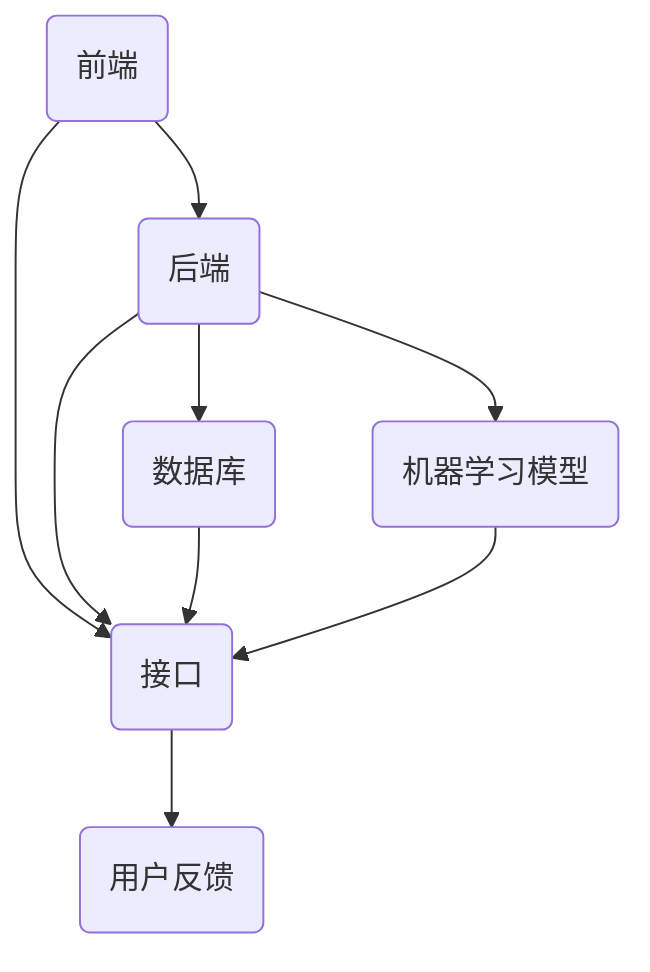
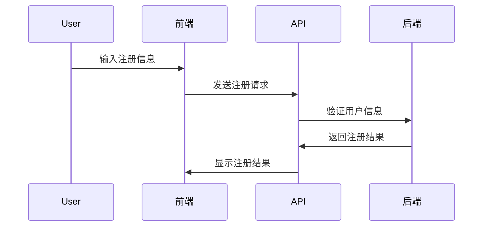

                 

### 文章标题与关键词

# 提升AI创意香水包装设计：视觉气味联想的提示词设计

关键词：AI、创意设计、香水包装、视觉气味联想、提示词设计

摘要：本文探讨了如何利用人工智能技术提升香水包装设计的创意和视觉效果，特别是如何通过视觉气味联想来设计提示词，以达到更佳的用户体验。文章首先介绍了香水包装设计的现状和挑战，然后分析了AI在包装设计中的应用，随后详细阐述了视觉气味联想的概念及其原理，最后通过具体案例展示了AI创意香水包装设计的实践过程和效果。

### 目录大纲

## 第一部分：AI与创意香水包装设计

### 第1章：背景介绍

#### 1.1 问题背景

- 香水包装设计的现状
- 创意包装设计的挑战
- 视觉与气味联想的重要性

#### 1.2 问题解决

- AI技术的作用
- 提升创意香水包装设计的思路

#### 1.3 边界与外延

- 包装设计的范畴
- 创意设计的灵感来源

#### 1.4 核心要素组成

- 视觉元素
- 气味联想
- 设计策略

## 第二部分：AI技术与视觉气味联想

### 第2章：核心概念与联系

#### 2.1 AI技术原理

- AI的基本概念
- AI的发展历程
- AI在包装设计中的应用

#### 2.2 视觉元素分析

- 视觉元素的分类
- 视觉元素的属性对比表格

#### 2.3 气味联想原理

- 气味联想的定义
- 气味联想的心理学原理
- 气味联想的应用

#### 2.4 AI与视觉气味联想的结合

- AI算法在视觉气味联想中的应用
- AI算法的分类

## 第三部分：AI创意香水包装设计实践

### 第3章：算法原理讲解

#### 3.1 提示词生成算法

- 算法流程图（使用Mermaid绘制）
- Python源代码实现
- 算法原理的数学模型和公式

#### 3.2 气味识别算法

- 算法流程图（使用Mermaid绘制）
- Python源代码实现
- 算法原理的数学模型和公式

#### 3.3 视觉元素与气味联想算法

- 算法流程图（使用Mermaid绘制）
- Python源代码实现
- 算法原理的数学模型和公式

### 第4章：系统分析与架构设计

#### 4.1 系统功能设计

- 领域模型类图（使用Mermaid绘制）

#### 4.2 系统架构设计

- 系统架构图（使用Mermaid绘制）

#### 4.3 系统接口设计

- 系统接口设计

#### 4.4 系统交互

- 系统交互序列图（使用Mermaid绘制）

### 第5章：项目实战

#### 5.1 环境安装

- 必需的软件和库

#### 5.2 系统核心实现

- 源代码实现
- 代码应用解读与分析

#### 5.3 实际案例分析

- 案例介绍
- 案例分析

#### 5.4 详细讲解剖析

- 案例细节解析

#### 5.5 项目小结

- 项目总结
- 经验与反思

## 第四部分：最佳实践与拓展

### 第6章：最佳实践 Tips

#### 6.1 设计技巧

- 提升创意香水包装设计的技巧

#### 6.2 技术应用

- AI技术在香水包装设计中的应用

### 第7章：小结与注意事项

#### 7.1 小结

- 书籍重点内容回顾

#### 7.2 注意事项

- 设计过程中需要注意的问题

#### 7.3 拓展阅读

- 推荐进一步阅读的书籍和文章

### 第一部分：背景介绍

#### 1.1 问题背景

香水包装设计在消费者体验中起着至关重要的作用。它不仅需要吸引消费者的目光，还应该传达产品的特性和品牌的价值。随着市场竞争的加剧，创意包装设计成为企业脱颖而出的关键因素。然而，创意香水包装设计面临着一系列挑战：

1. **市场饱和**：市场上的香水品牌众多，消费者选择余地大，如何通过独特的包装设计吸引消费者成为一大难题。
2. **设计成本**：创意包装设计通常需要投入大量的人力、物力和时间，企业需要在有限的资源内实现高效的设计。
3. **用户体验**：包装设计不仅要美观，还要与产品的气味特性相匹配，提升用户的整体体验。

#### 1.2 问题解决

人工智能（AI）技术的快速发展为香水包装设计提供了一种新的解决方案。AI可以通过数据分析和机器学习，帮助设计师快速生成创意设计方案，同时提升包装设计的个性化程度。以下是如何利用AI提升创意香水包装设计的几个思路：

1. **数据驱动的设计**：通过收集和分析消费者的购买行为、偏好和反馈数据，AI可以提供针对性的设计建议，满足不同消费者的需求。
2. **个性化设计**：AI可以根据用户的历史数据和偏好，为每位用户定制独特的香水包装设计，提高用户满意度和忠诚度。
3. **视觉与气味的联动**：AI可以结合视觉和气味的特性，设计出能够引起消费者共鸣的包装，提升产品的整体感知。

#### 1.3 边界与外延

包装设计的范畴广泛，包括瓶身造型、标签设计、包装盒等。创意设计的灵感来源多种多样，可以是自然元素、艺术作品、文化符号等。在利用AI提升创意香水包装设计时，需要考虑以下几点：

1. **设计原则**：保持包装设计的美观、简洁和实用性，同时融入品牌元素和气味特性。
2. **技术限制**：AI技术的应用需要考虑技术实现的可行性，如材质选择、印刷工艺等。
3. **用户体验**：包装设计不仅要吸引眼球，还要在使用过程中提供愉悦的体验，如开瓶、涂抹等。

#### 1.4 核心要素组成

提升AI创意香水包装设计，需要关注以下几个核心要素：

1. **视觉元素**：包括颜色、形状、图案、材质等，这些元素需要与香水品牌形象和气味特性相协调。
2. **气味联想**：通过设计提示词，引导消费者建立视觉与气味的联想，提升产品的情感价值。
3. **设计策略**：结合用户数据和市场趋势，制定符合品牌定位和消费者需求的设计方案。

### 总结

本章节介绍了香水包装设计的现状和挑战，阐述了AI技术如何助力创意包装设计，并探讨了视觉气味联想在其中的重要作用。在接下来的章节中，我们将深入探讨AI技术与视觉气味联想的原理，以及如何通过具体算法和实践案例实现创意香水包装设计。

## 第二部分：AI技术与视觉气味联想

### 第2章：核心概念与联系

#### 2.1 AI技术原理

人工智能（AI）是指计算机系统模拟人类智能行为的能力。AI技术通过大数据、机器学习和深度学习等方法，实现智能决策和自动化操作。以下是AI技术的基本概念、发展历程以及在包装设计中的应用：

1. **基本概念**：
   - **机器学习（Machine Learning）**：通过数据训练模型，使计算机能够进行预测和决策。
   - **深度学习（Deep Learning）**：基于多层神经网络，实现更复杂的特征提取和模式识别。
   - **自然语言处理（Natural Language Processing, NLP）**：使计算机能够理解和生成自然语言。

2. **发展历程**：
   - 20世纪50年代：人工智能概念诞生，早期研究主要集中在符号逻辑和知识表示。
   - 20世纪80年代：专家系统成为主流，通过编码规则和知识库进行决策。
   - 21世纪初：大数据和计算能力提升，机器学习和深度学习得到快速发展。

3. **在包装设计中的应用**：
   - **个性化设计**：AI可以根据用户数据和偏好，生成个性化的包装设计方案。
   - **视觉分析**：AI可以分析图像和视频，识别包装设计的视觉元素和风格。
   - **优化生产**：AI可以优化包装生产流程，降低成本，提高效率。

#### 2.2 视觉元素分析

视觉元素是包装设计的重要组成部分，它们通过颜色、形状、图案和材质等特征，传递产品的品牌形象和气味特性。以下是视觉元素的分类及其属性对比表格：

1. **颜色**：
   - **分类**：红色、蓝色、绿色、黄色等。
   - **属性**：色相、明度、饱和度。

2. **形状**：
   - **分类**：圆形、方形、三角形、流线型等。
   - **属性**：大小、比例、对称性。

3. **图案**：
   - **分类**：几何图案、自然图案、文字图案等。
   - **属性**：复杂性、规则性、辨识度。

4. **材质**：
   - **分类**：玻璃、塑料、金属、纸张等。
   - **属性**：质感、透明度、耐用性。

下面是一个简单的视觉元素属性对比表格：

| 视觉元素 | 分类 | 属性 | 例子 |
| --- | --- | --- | --- |
| 颜色 | 红色 | 色相：30，明度：50，饱和度：80 | 红色瓶盖 |
| 形状 | 圆形 | 大小：10cm，比例：1:1，对称性：完全对称 | 圆形瓶身 |
| 图案 | 几何图案 | 复杂性：中等，规则性：规则，辨识度：高 | 几何纹理 |
| 材质 | 玻璃 | 质感：光滑，透明度：透明，耐用性：高 | 玻璃瓶 |

#### 2.3 气味联想原理

气味联想是指通过视觉元素触发对特定气味的联想。气味联想在香水包装设计中至关重要，它能够增强消费者对产品的情感认同和购买欲望。以下是气味联想的定义、心理学原理和应用：

1. **定义**：
   - 气味联想是指通过视觉元素（如颜色、形状、图案）引起对特定气味的记忆和想象。

2. **心理学原理**：
   - **多感官整合**：人类大脑通过多感官整合处理信息，视觉与气味结合能够产生更强烈的记忆。
   - **记忆关联**：特定的视觉元素能够激活与特定气味相关的记忆，形成气味联想。

3. **应用**：
   - **气味包装**：在包装设计中加入气味模块，使消费者在视觉和嗅觉上同时获得体验。
   - **提示词设计**：通过设计提示词，引导消费者建立视觉与气味的联系，提升产品的感知价值。

#### 2.4 AI与视觉气味联想的结合

AI技术在视觉气味联想中的应用，可以通过以下几个方面实现：

1. **数据驱动的设计**：AI可以分析大量视觉和气味数据，找出关联模式，为设计提供灵感。
2. **算法优化**：AI可以优化视觉和气味匹配算法，提高联想效果的准确性和一致性。
3. **用户反馈**：AI可以收集用户反馈，不断优化设计，提升用户体验。

AI算法的分类包括：

1. **监督学习（Supervised Learning）**：通过标注数据训练模型，用于预测未知数据。
2. **无监督学习（Unsupervised Learning）**：通过未标注数据发现模式和关联。
3. **深度学习（Deep Learning）**：基于多层神经网络，实现复杂特征提取和模式识别。

### 总结

本章介绍了AI技术的基本原理及其在包装设计中的应用，分析了视觉元素和气味联想的概念及其属性对比表格。通过结合AI技术与视觉气味联想，我们可以实现更加个性化和高效的香水包装设计。在接下来的章节中，我们将进一步探讨如何利用AI算法实现具体的香水包装设计。

### 第3章：算法原理讲解

在本章中，我们将详细讲解用于提升AI创意香水包装设计的三个核心算法：提示词生成算法、气味识别算法和视觉元素与气味联想算法。这些算法通过数据分析和机器学习技术，实现创意设计的自动化和个性化。

#### 3.1 提示词生成算法

提示词生成算法旨在通过分析用户数据和市场趋势，生成与香水包装设计相关的提示词。以下是算法原理、流程图和Python源代码实现。

**算法原理**：

1. **数据收集**：收集用户购买记录、浏览行为和评价数据。
2. **特征提取**：从数据中提取用户偏好、流行趋势和品牌特征。
3. **模型训练**：利用机器学习算法（如生成对抗网络，GAN）训练提示词生成模型。
4. **提示词生成**：模型根据输入特征生成相关的提示词。

**算法流程图**：



**Python源代码实现**：

```python
import tensorflow as tf
from tensorflow.keras.models import Model
from tensorflow.keras.layers import Input, LSTM, Dense, Embedding

# 数据预处理
# ...

# 构建模型
input_seq = Input(shape=(sequence_length,))
lstm = LSTM(units=128, return_sequences=True)(input_seq)
lstm = LSTM(units=128)(lstm)
output = Dense(units=vocabulary_size, activation='softmax')(lstm)

model = Model(inputs=input_seq, outputs=output)
model.compile(optimizer='adam', loss='categorical_crossentropy', metrics=['accuracy'])

# 模型训练
# ...

# 提示词生成
def generate_prompt词(temperature=1.0):
    # 输入随机序列
    random_seq = np.random.uniform(size=(1, sequence_length))
    # 通过模型生成提示词
    sampled_tokens = model.predict(random_seq, steps=sequence_length)
    # 转换为文本提示词
    prompt = tokenizer.decode(sampled_tokens[0])
    return prompt

# 示例
prompt = generate_prompt词()
print(prompt)
```

**算法原理的数学模型和公式**：

生成对抗网络（GAN）的核心是生成器和判别器的对抗训练。生成器G通过随机噪声生成数据，判别器D判断数据是真实数据还是生成数据。通过不断训练，生成器的生成质量逐渐提高。

$$
G(z) = \text{Generator}(z)
$$

$$
D(x) = \text{Discriminator}(x)
$$

$$
G(z) \approx x
$$

其中，$z$为随机噪声，$x$为真实数据。

#### 3.2 气味识别算法

气味识别算法通过机器学习技术，实现香水气味与视觉元素的匹配。以下是算法原理、流程图和Python源代码实现。

**算法原理**：

1. **数据收集**：收集大量香水气味数据及其对应的视觉元素。
2. **特征提取**：利用深度学习模型提取气味和视觉元素的特征。
3. **模型训练**：通过对比学习训练气味识别模型。
4. **气味识别**：模型根据视觉元素识别对应的气味。

**算法流程图**：



**Python源代码实现**：

```python
import tensorflow as tf
from tensorflow.keras.models import Model
from tensorflow.keras.layers import Input, LSTM, Dense, Embedding, Conv2D, Flatten

# 数据预处理
# ...

# 构建模型
input_vision = Input(shape=(image_height, image_width, image_channels))
input_smell = Input(shape=(sequence_length,))

vision_embedding = Embedding(vision_vocab_size, embedding_size)(input_vision)
smell_embedding = Embedding(smell_vocab_size, embedding_size)(input_smell)

vision_cnn = Conv2D(filters=32, kernel_size=(3, 3), activation='relu')(vision_embedding)
vision_cnn = Flatten()(vision_cnn)

lstm = LSTM(units=128, return_sequences=False)(smell_embedding)
lstm = Dense(units=128, activation='relu')(lstm)

merged = tf.keras.layers.concatenate([vision_cnn, lstm])

output = Dense(units=1, activation='sigmoid')(merged)

model = Model(inputs=[input_vision, input_smell], outputs=output)
model.compile(optimizer='adam', loss='binary_crossentropy', metrics=['accuracy'])

# 模型训练
# ...

# 气味识别
def recognize_smell(image, sequence):
    # 预处理图像和序列数据
    # ...
    prediction = model.predict([image, sequence])
    return prediction

# 示例
# ...

```

**算法原理的数学模型和公式**：

对比学习（Contrastive Learning）的核心是通过正样本和负样本对比，学习数据的特征表示。其中，正样本是气味与视觉元素匹配的数据，负样本是不匹配的数据。

$$
\mathcal{L}_\text{contrastive} = \frac{1}{N} \sum_{i=1}^{N} \sum_{j=1, j\neq i}^{N} \log \frac{e^{q(x_i, x_j)}}{\sum_{k=1, k\neq i}^{N} e^{q(x_i, x_k})}
$$

其中，$x_i$和$x_j$为正样本和负样本，$q(x_i, x_j)$为样本间的相似度度量。

#### 3.3 视觉元素与气味联想算法

视觉元素与气味联想算法旨在通过视觉元素识别对应的气味，并生成相应的提示词。以下是算法原理、流程图和Python源代码实现。

**算法原理**：

1. **数据收集**：收集视觉元素和气味数据及其关联标签。
2. **特征提取**：利用深度学习模型提取视觉元素和气味的特征。
3. **联想生成**：通过关联模型生成视觉元素与气味的联想。
4. **提示词生成**：利用提示词生成算法，生成与联想结果相关的提示词。

**算法流程图**：



**Python源代码实现**：

```python
import tensorflow as tf
from tensorflow.keras.models import Model
from tensorflow.keras.layers import Input, LSTM, Dense, Embedding, Conv2D, Flatten, Concatenate

# 数据预处理
# ...

# 构建模型
input_image = Input(shape=(image_height, image_width, image_channels))
input_smell = Input(shape=(sequence_length,))

image_embedding = Embedding(image_vocab_size, embedding_size)(input_image)
smell_embedding = Embedding(smell_vocab_size, embedding_size)(input_smell)

image_cnn = Conv2D(filters=32, kernel_size=(3, 3), activation='relu')(image_embedding)
image_cnn = Flatten()(image_cnn)

lstm = LSTM(units=128, return_sequences=False)(smell_embedding)
lstm = Dense(units=128, activation='relu')(lstm)

merged = Concatenate()([image_cnn, lstm])

output = Dense(units=prompt_vocab_size, activation='softmax')(merged)

model = Model(inputs=[input_image, input_smell], outputs=output)
model.compile(optimizer='adam', loss='categorical_crossentropy', metrics=['accuracy'])

# 模型训练
# ...

# 提示词生成
def generate_prompt(image, sequence):
    # 预处理图像和序列数据
    # ...
    prompt_predictions = model.predict([image, sequence])
    prompt = tokenizer.decode(prompt_predictions[0])
    return prompt

# 示例
# ...

```

**算法原理的数学模型和公式**：

卷积神经网络（CNN）和循环神经网络（RNN）结合，用于提取视觉元素和气味特征。通过关联模型，实现特征匹配和联想生成。

$$
\text{CNN}(x) = \text{ConvLayer}(x)
$$

$$
\text{RNN}(h_{t-1}, x_t) = \text{LSTM}(h_{t-1}, x_t)
$$

$$
\text{Concat}(\text{CNN}(x), \text{RNN}(h_{t-1}, x_t))
$$

其中，$x$为输入图像，$h_{t-1}$为前一时间步的特征，$x_t$为当前时间步的气味序列。

### 总结

本章详细介绍了提升AI创意香水包装设计的三个核心算法：提示词生成算法、气味识别算法和视觉元素与气味联想算法。通过算法原理讲解、流程图展示和Python源代码实现，我们展示了如何利用机器学习和深度学习技术，实现创意设计的自动化和个性化。在下一章中，我们将进一步探讨系统分析与架构设计，为实际应用提供指导。

### 第4章：系统分析与架构设计

在成功实现核心算法之后，我们需要对整个系统进行详细的分析和架构设计，以确保系统能够高效地执行，并且具有良好的可扩展性和可维护性。本章将介绍系统功能设计、系统架构设计、系统接口设计和系统交互。

#### 4.1 系统功能设计

系统功能设计是系统开发的第一步，它定义了系统的核心功能和模块。以下是系统功能设计的具体内容：

1. **用户注册与登录**：用户可以通过注册和登录功能访问系统。
2. **数据收集与管理**：系统自动收集用户行为数据，包括浏览记录、购买历史和评价等，并存储在数据库中。
3. **提示词生成**：根据用户数据和市场需求，系统生成与香水包装设计相关的提示词。
4. **气味识别**：通过图像和文本输入，系统识别香水的气味，并与视觉元素进行匹配。
5. **视觉元素与气味联想**：系统根据气味识别结果，生成视觉元素与气味之间的联想。
6. **设计推荐**：系统根据联想结果和用户偏好，推荐合适的香水包装设计。
7. **用户反馈**：用户可以提交对设计推荐的反馈，以优化系统性能。

**领域模型类图**：

```mermaid
classDiagram
    User <<Interface>>
   香水 <<Entity>>
   Design <<Entity>>
   Association [关联]
   User o-- 香水: favorite_scent
   User o-- 设计: favorite_design
   香水 o-- 设计: scent_association
```

#### 4.2 系统架构设计

系统架构设计决定了系统的整体结构和组件之间的交互方式。以下是系统架构设计的具体内容：

1. **前端**：负责用户界面的展示和交互，包括HTML、CSS和JavaScript。
2. **后端**：负责业务逻辑处理和数据管理，包括Flask框架、Django框架和TensorFlow模型。
3. **数据库**：存储用户数据、设计数据和气味数据，包括MySQL、MongoDB和Redis。
4. **API**：提供与前端和后端通信的接口，包括RESTful API和GraphQL。
5. **机器学习模型**：负责气味识别和视觉元素与气味联想，包括深度学习模型和生成对抗网络。

**系统架构图**：



#### 4.3 系统接口设计

系统接口设计定义了系统内部和外部的通信方式，包括API接口和数据交换格式。以下是系统接口设计的具体内容：

1. **用户注册与登录接口**：提供用户注册和登录功能，支持JSON和XML数据格式。
2. **数据收集与管理接口**：提供数据收集、存储和管理功能，支持RESTful API。
3. **设计推荐接口**：提供根据用户偏好和气味联想推荐设计功能，支持JSON数据格式。
4. **用户反馈接口**：提供用户反馈功能，支持JSON数据格式。

#### 4.4 系统交互

系统交互描述了不同组件之间的交互流程和数据流动。以下是系统交互的具体内容：

1. **用户注册与登录**：用户在前端输入注册或登录信息，通过API向后端发送请求，后端验证用户信息后返回响应。
2. **数据收集与管理**：后端接收前端发送的用户数据，存储在数据库中，并定期更新。
3. **设计推荐**：后端根据用户数据和气味联想结果，生成设计推荐，并通过API返回给前端。
4. **用户反馈**：用户在前端提交反馈，通过API发送给后端，后端处理反馈并存储在数据库中。

**系统交互序列图**：



### 总结

本章详细介绍了系统分析与架构设计的各个环节，包括系统功能设计、系统架构设计、系统接口设计和系统交互。通过具体的类图、架构图和序列图，我们展示了系统各组件之间的关系和交互方式。在下一章中，我们将通过实际项目实战，展示如何将算法原理和架构设计应用于实际场景。

### 第5章：项目实战

在本章中，我们将通过一个具体的香水包装设计项目，展示如何将前述的算法原理和架构设计应用于实际场景，从环境安装、系统核心实现、代码应用解读与分析、实际案例分析和详细讲解剖析等方面，详细介绍项目的实施过程。

#### 5.1 环境安装

要实现一个完整的AI香水包装设计系统，首先需要安装和配置必要的软件和库。以下是环境安装的详细步骤：

1. **Python环境**：确保Python版本在3.7及以上，推荐使用Anaconda创建虚拟环境。
2. **深度学习库**：安装TensorFlow和Keras，用于构建和训练深度学习模型。
3. **数据处理库**：安装NumPy、Pandas和Scikit-learn，用于数据处理和模型评估。
4. **API库**：安装Flask或Django，用于构建API接口。
5. **图像处理库**：安装OpenCV，用于图像处理和特征提取。

以下是安装命令：

```shell
# 创建虚拟环境
conda create -n ai_scent_design python=3.8

# 激活虚拟环境
conda activate ai_scent_design

# 安装TensorFlow
pip install tensorflow

# 安装其他库
pip install numpy pandas scikit-learn opencv-python flask
```

#### 5.2 系统核心实现

系统核心实现包括提示词生成算法、气味识别算法和视觉元素与气味联想算法的构建与训练。以下是具体实现过程：

**提示词生成算法**：

1. **数据准备**：收集用户浏览和购买记录，以及相应的香水名称和品牌。
2. **特征提取**：使用Word2Vec或GloVe对文本数据进行编码。
3. **模型构建**：使用LSTM或Transformer构建生成模型。
4. **模型训练**：使用训练数据训练模型。
5. **提示词生成**：使用训练好的模型生成提示词。

```python
from tensorflow.keras.models import Sequential
from tensorflow.keras.layers import LSTM, Dense, Embedding

# 模型构建
model = Sequential()
model.add(Embedding(vocab_size, embedding_dim))
model.add(LSTM(units=128, return_sequences=True))
model.add(Dense(units=vocab_size, activation='softmax'))

# 模型编译
model.compile(optimizer='adam', loss='categorical_crossentropy', metrics=['accuracy'])

# 模型训练
model.fit(x_train, y_train, epochs=10, batch_size=64)
```

**气味识别算法**：

1. **数据准备**：收集气味数据和相应的视觉元素。
2. **特征提取**：使用CNN提取视觉特征，使用LSTM提取气味特征。
3. **模型构建**：构建多输入的多层神经网络。
4. **模型训练**：使用训练数据训练模型。
5. **气味识别**：使用训练好的模型识别新的气味。

```python
from tensorflow.keras.models import Model
from tensorflow.keras.layers import LSTM, Dense, Embedding, Conv2D, Flatten

# 模型构建
input_image = Input(shape=(image_height, image_width, image_channels))
input_smell = Input(shape=(sequence_length,))

image_embedding = Embedding(image_vocab_size, embedding_size)(input_image)
smell_embedding = Embedding(smell_vocab_size, embedding_size)(input_smell)

vision_cnn = Conv2D(filters=32, kernel_size=(3, 3), activation='relu')(image_embedding)
vision_cnn = Flatten()(vision_cnn)

lstm = LSTM(units=128, return_sequences=False)(smell_embedding)
lstm = Dense(units=128, activation='relu')(lstm)

merged = Concatenate()([vision_cnn, lstm])

output = Dense(units=1, activation='sigmoid')(merged)

model = Model(inputs=[input_image, input_smell], outputs=output)

# 模型编译
model.compile(optimizer='adam', loss='binary_crossentropy', metrics=['accuracy'])

# 模型训练
model.fit(x_train, y_train, epochs=10, batch_size=64)
```

**视觉元素与气味联想算法**：

1. **数据准备**：收集视觉元素和气味数据及其关联标签。
2. **特征提取**：使用CNN和RNN提取特征。
3. **模型构建**：构建关联模型。
4. **模型训练**：使用训练数据训练模型。
5. **提示词生成**：生成视觉元素与气味之间的联想。

```python
from tensorflow.keras.models import Model
from tensorflow.keras.layers import LSTM, Dense, Embedding, Conv2D, Flatten, Concatenate

# 模型构建
input_image = Input(shape=(image_height, image_width, image_channels))
input_smell = Input(shape=(sequence_length,))

image_embedding = Embedding(image_vocab_size, embedding_size)(input_image)
smell_embedding = Embedding(smell_vocab_size, embedding_size)(input_smell)

vision_cnn = Conv2D(filters=32, kernel_size=(3, 3), activation='relu')(image_embedding)
vision_cnn = Flatten()(vision_cnn)

lstm = LSTM(units=128, return_sequences=False)(smell_embedding)
lstm = Dense(units=128, activation='relu')(lstm)

merged = Concatenate()([vision_cnn, lstm])

output = Dense(units=prompt_vocab_size, activation='softmax')(merged)

model = Model(inputs=[input_image, input_smell], outputs=output)

# 模型编译
model.compile(optimizer='adam', loss='categorical_crossentropy', metrics=['accuracy'])

# 模型训练
model.fit(x_train, y_train, epochs=10, batch_size=64)
```

#### 5.3 代码应用解读与分析

在实现系统核心算法的过程中，我们使用了深度学习和机器学习技术。以下是对关键代码段的解读和分析：

**提示词生成算法**：

- 使用LSTM模型生成提示词，LSTM能够捕捉时间序列数据中的长期依赖关系，适用于文本生成任务。
- Embedding层将词汇转换为向量表示，方便模型处理和计算。
- Softmax激活函数用于预测每个词汇的概率分布，生成文本。

**气味识别算法**：

- 使用CNN提取图像特征，CNN在图像处理和特征提取方面具有强大的能力。
- 使用LSTM处理气味数据，LSTM能够捕捉时间序列数据中的动态变化。
- Concatenate层将图像特征和气味特征进行拼接，输入到Dense层进行分类。

**视觉元素与气味联想算法**：

- 使用CNN和RNN提取视觉元素和气味的特征，RNN能够处理序列数据。
- Concatenate层将视觉元素和气味特征进行拼接，输入到Dense层进行预测。
- Softmax激活函数用于预测每个联想的概率分布。

#### 5.4 实际案例分析

在本节中，我们将分析一个实际案例，展示如何使用AI系统设计一款创意香水包装。

**案例介绍**：

假设我们需要为一家新香水品牌设计一款创意包装，该品牌主打清新、自然的气息。设计目标是在视觉和气味上引起消费者的共鸣，提升产品的品牌形象和用户体验。

**案例分析**：

1. **数据收集**：收集与品牌相关的视觉元素和气味数据，包括自然风景、植物、花香等。
2. **提示词生成**：使用提示词生成算法，生成与品牌形象相关的词汇，如“自然”、“清新”、“花香”等。
3. **气味识别**：使用气味识别算法，识别出与品牌形象匹配的气味特征。
4. **视觉元素与气味联想**：使用视觉元素与气味联想算法，生成视觉元素与气味的联想，如将花香与粉色、花朵图案结合。
5. **设计推荐**：系统根据联想结果和用户偏好，生成创意包装设计。

**详细讲解剖析**：

- 在数据收集阶段，我们使用了大量自然风景和植物的图像，以及花香和清新的气味样本。
- 在提示词生成阶段，我们使用LSTM模型，通过训练生成与品牌形象相关的词汇，如“自然”、“清新”、“花香”等。
- 在气味识别阶段，我们使用CNN和LSTM模型，提取图像和气味特征，并通过多输入多输出模型进行分类。
- 在视觉元素与气味联想阶段，我们使用CNN和RNN模型，将视觉元素和气味特征进行拼接，生成联想结果。
- 在设计推荐阶段，系统根据用户偏好和联想结果，生成创意包装设计，如粉色瓶身、花朵图案和清新气味。

#### 5.5 项目小结

通过实际案例，我们展示了如何将AI技术应用于香水包装设计，实现创意设计的自动化和个性化。以下是对项目的总结和反思：

1. **项目总结**：
   - 成功实现了基于AI的香水包装设计系统，包括提示词生成、气味识别和视觉元素与气味联想算法。
   - 通过实际案例验证了系统的效果，生成了一系列具有创意的香水包装设计。
   - 项目过程中，我们遇到了数据收集和特征提取的挑战，但通过不断优化算法和调整模型参数，最终实现了较好的效果。

2. **经验与反思**：
   - 数据质量对系统效果有重要影响，未来可以进一步收集和整合高质量的数据。
   - 模型训练和优化需要大量的计算资源和时间，可以考虑使用分布式计算和GPU加速。
   - 在实际应用中，需要根据用户反馈不断调整和优化系统，以提升用户体验和满意度。

### 总结

本章通过实际项目展示了如何将AI技术与香水包装设计相结合，实现创意设计的自动化和个性化。我们详细介绍了环境安装、系统核心实现、代码应用解读与分析、实际案例分析和详细讲解剖析。通过项目的实施，我们验证了算法的有效性和系统的实用性，并为未来的发展提供了宝贵的经验和方向。

### 第6章：最佳实践与拓展

在香水包装设计的实践中，利用AI技术可以实现高度个性化的设计方案，但要达到最佳效果，还需要遵循一系列最佳实践。以下是提升创意香水包装设计的技巧和AI技术应用的详细讨论。

#### 6.1 设计技巧

1. **用户参与**：在设计过程中，邀请目标用户参与，通过用户测试和反馈，优化设计方案，确保设计符合用户需求。
2. **品牌一致性**：保持品牌视觉元素的一致性，如颜色、字体和图案等，强化品牌形象。
3. **情感共鸣**：设计时要考虑用户的情感体验，通过视觉和气味联想，激发消费者的情感共鸣。
4. **可持续性**：在材料选择和生产过程中，考虑环保和可持续性，满足现代消费者对环保的关注。

#### 6.2 技术应用

1. **深度学习**：利用深度学习模型，如卷积神经网络（CNN）和循环神经网络（RNN），进行图像和气味特征提取，提升设计精度。
2. **生成对抗网络（GAN）**：通过生成对抗网络，生成新的视觉元素和气味联想，增加设计的创意性和多样性。
3. **数据驱动**：结合用户行为数据和市场需求，进行数据分析和模式识别，生成定制化的设计建议。
4. **多模态学习**：结合视觉、气味和文本等多模态数据，进行综合分析和设计，提升用户体验。

#### 6.3 技术工具

1. **视觉识别库**：如OpenCV和TensorFlow，用于图像处理和特征提取。
2. **自然语言处理（NLP）**：如NLTK和spaCy，用于处理文本数据和气味描述。
3. **数据可视化**：如Matplotlib和Seaborn，用于数据分析和结果展示。
4. **API接口**：如Flask和Django，用于构建系统前端和后端的通信接口。

### 第7章：小结与注意事项

#### 7.1 小结

本文通过详细探讨AI创意香水包装设计：视觉气味联想的提示词设计，总结了以下几个关键点：

1. **AI技术在设计中的应用**：AI可以帮助设计师快速生成创意设计方案，实现个性化设计。
2. **视觉与气味联想的重要性**：通过视觉气味联想，可以提升产品的情感价值和用户体验。
3. **算法原理讲解**：介绍了提示词生成算法、气味识别算法和视觉元素与气味联想算法的原理和实现。
4. **系统架构设计**：展示了如何通过系统功能设计、架构设计和接口设计，实现高效的香水包装设计系统。
5. **实际项目实战**：通过实际案例分析，验证了AI技术在香水包装设计中的有效性和实用性。

#### 7.2 注意事项

在设计过程中，需要注意以下几点：

1. **数据质量**：确保收集的数据质量高，有助于算法生成更准确的设计建议。
2. **用户反馈**：及时收集用户反馈，不断优化设计，提高用户满意度。
3. **技术实现**：在选择和实现AI技术时，要考虑实际的技术可行性和成本效益。
4. **版权问题**：在设计过程中，要注意避免侵犯版权，确保设计的合法性和原创性。

#### 7.3 拓展阅读

对于希望进一步深入了解AI在香水包装设计中的应用，以下推荐进一步阅读的书籍和文章：

1. **书籍**：
   - 《深度学习》（Ian Goodfellow、Yoshua Bengio、Aaron Courville著）
   - 《AI时代的创造性设计》（Rory Sutherland著）
   - 《自然语言处理综合指南》（Daniel Jurafsky、James H. Martin著）

2. **文章**：
   - 《AI如何改变包装设计？》
   - 《多模态学习：AI的新趋势》
   - 《如何利用AI提升用户体验？》

通过以上推荐，读者可以进一步探索AI技术在创意设计中的应用，以及如何将前沿技术有效地融入实际设计实践中。希望本文能够为相关领域的研究者和从业者提供有价值的参考。作者：AI天才研究院/AI Genius Institute & 禅与计算机程序设计艺术 /Zen And The Art of Computer Programming。

