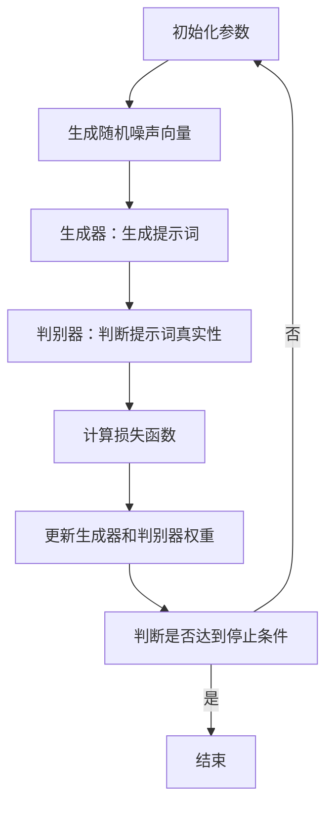
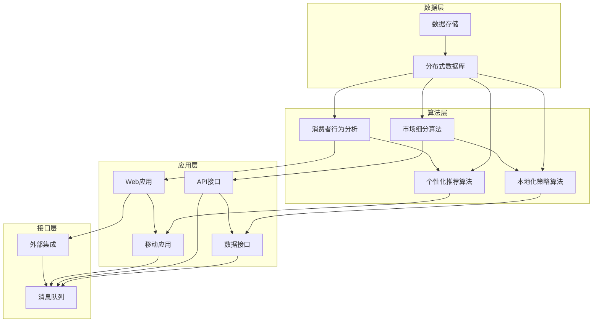
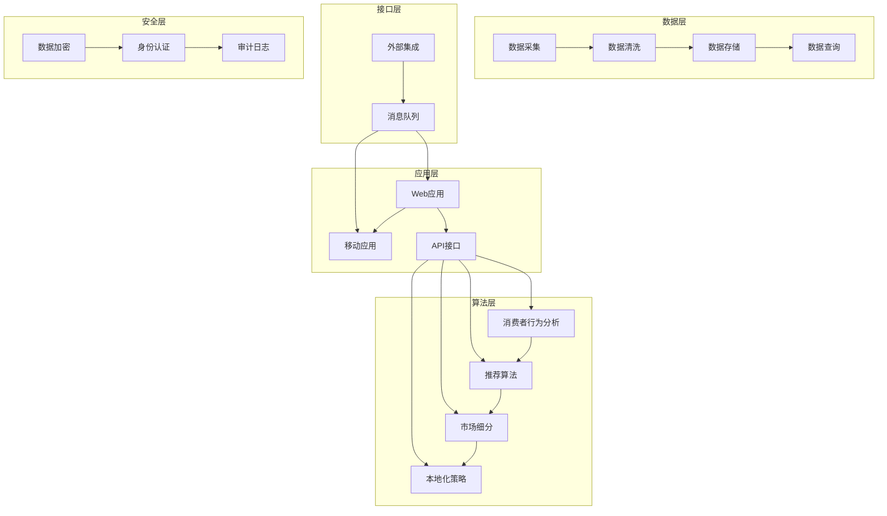

                 

### 《提升AI创意香水品牌定位：全球市场本地化的提示词设计》概览

随着人工智能技术的飞速发展，AI在各个领域的应用愈发广泛，尤其是在市场营销和品牌定位中，AI技术正发挥着越来越重要的作用。本篇文章旨在探讨如何利用AI技术来提升创意香水品牌在全球市场中的定位，并通过本地化的提示词设计来实现更精准的市场营销策略。

关键词：AI、创意香水品牌、品牌定位、全球市场本地化、提示词设计

摘要：本文首先介绍了AI技术在全球市场本地化中的作用及其在创意香水品牌定位中的应用背景。接着，详细阐述了AI、创意香水品牌定位、全球市场本地化和提示词设计等核心概念，并通过mermaid流程图和Python源代码来解析算法原理。随后，本文介绍了系统分析与架构设计方案，并进行了项目实战，通过实际案例分析和详细讲解来剖析项目的实施过程。最后，文章提供了最佳实践技巧和总结，为未来的研究与实践指明方向。

通过这篇文章，读者可以深入了解AI技术在创意香水品牌定位中的应用，掌握全球市场本地化策略的重要性，以及如何通过提示词设计来提升品牌的市场竞争力。

## 第1章: AI创意香水品牌定位与全球市场本地化

### 1.1 问题背景

创意香水品牌在全球市场上的竞争愈发激烈，如何在众多品牌中脱颖而出，实现精准的营销策略，成为品牌成功的关键。随着互联网和信息技术的快速发展，人工智能（AI）技术在全球范围内的应用愈发广泛，其在市场营销和品牌定位中的作用也逐渐显现。AI技术不仅可以处理大量数据，还可以通过深度学习和自然语言处理等技术，为品牌提供个性化、精准的营销策略。

在当前的市场环境中，创意香水品牌面临的挑战包括：

1. **市场细分困难**：全球市场多样性强，文化差异大，品牌需要针对不同市场制定差异化的营销策略，但如何精准细分市场、满足消费者个性化需求成为一个难题。
2. **竞争激烈**：全球市场上创意香水品牌众多，如何在众多竞争者中脱颖而出，实现品牌的独特性和差异化，成为品牌面临的挑战。
3. **营销效果难以评估**：传统的营销手段难以量化营销效果，品牌难以实时调整营销策略，提升市场竞争力。

### 1.1.1 香水品牌在全球市场的挑战

香水作为一种高度个性化的产品，其品牌在全球市场上的竞争主要体现在以下几个方面：

1. **品牌认知度**：在全球市场中，品牌知名度是品牌竞争力的重要因素。新品牌如何快速提升知名度，建立品牌形象，是一个重要的挑战。
2. **市场进入策略**：不同市场的消费者偏好和文化差异较大，品牌需要制定合适的进入策略，如产品定位、价格策略、广告投放等。
3. **产品创新**：香水市场更新换代快，消费者对新产品有持续的需求。品牌需要不断创新，推出满足消费者需求的新产品。

### 1.1.2 AI技术如何助力品牌定位

AI技术在创意香水品牌定位中具有独特的优势，主要体现在以下几个方面：

1. **数据分析与消费者洞察**：AI技术可以通过大数据分析和自然语言处理技术，挖掘消费者行为数据，了解消费者偏好，为品牌提供精准的市场洞察。
2. **个性化推荐**：基于消费者的购买历史和浏览行为，AI技术可以推荐个性化的香水产品，提高消费者的满意度和购买转化率。
3. **自动化营销**：AI技术可以实现自动化营销，如通过聊天机器人与消费者互动、实时调整广告投放策略等，提升营销效率。
4. **智能决策**：AI技术可以通过数据分析和预测模型，帮助品牌在产品开发、市场定位、营销策略等方面做出更科学的决策。

### 1.1.3 全球市场本地化的意义

全球市场本地化是指企业在全球市场中针对不同地区和文化，采取本地化的营销策略，以满足当地消费者的需求。对于创意香水品牌而言，全球市场本地化具有以下重要意义：

1. **满足消费者需求**：不同市场的消费者对香水的偏好和文化存在差异，品牌需要通过本地化策略，推出符合当地消费者需求的香水产品。
2. **提升品牌形象**：本地化策略可以提升品牌在当地的知名度和认可度，增强品牌的市场竞争力。
3. **优化资源配置**：本地化策略有助于企业根据当地市场的特点，优化产品、价格、广告等资源配置，提高营销效果。

### 1.2 核心概念解析

在本章节中，我们将详细阐述AI、创意香水品牌定位、全球市场本地化和提示词设计等核心概念，并分析它们之间的联系和作用。

#### 1.2.1 AI与创意香水品牌定位

人工智能（AI）是计算机科学的一个分支，旨在开发能够执行人类智能任务的计算机系统。在创意香水品牌定位中，AI技术主要应用于以下几个方面：

1. **消费者行为分析**：通过大数据分析，AI技术可以挖掘消费者的购买行为、浏览习惯等数据，为品牌提供消费者洞察，从而制定更精准的市场策略。
2. **个性化推荐**：基于消费者的偏好和购买历史，AI技术可以推荐个性化的香水产品，提高消费者的满意度和购买转化率。
3. **智能决策**：通过数据分析和预测模型，AI技术可以帮助品牌在产品开发、市场定位、营销策略等方面做出更科学的决策。

#### 1.2.2 全球市场本地化的概念

全球市场本地化是指企业在全球市场中，针对不同地区和文化，采取本地化的营销策略，以满足当地消费者的需求。本地化策略包括产品、价格、广告、文化等多个方面。对于创意香水品牌而言，全球市场本地化的关键在于：

1. **文化适应性**：品牌需要了解和尊重当地文化，推出符合当地消费者文化和审美需求的香水产品。
2. **本地化营销**：通过本地化的广告、促销活动和社交媒体营销，提升品牌在当地的知名度和认可度。
3. **供应链优化**：根据不同市场的特点，优化供应链管理，确保产品能够及时、高效地送达消费者。

#### 1.2.3 提示词设计在品牌定位中的作用

提示词设计是AI技术在品牌定位中的一项重要应用。提示词是指用于引导用户行为的词语或短语，通过设计合适的提示词，可以引导用户进行特定操作，提升用户体验和转化率。在创意香水品牌定位中，提示词设计的作用主要体现在以下几个方面：

1. **消费者引导**：通过设计个性化的提示词，引导消费者关注品牌的特点和优势，提升品牌形象。
2. **营销效果优化**：通过分析提示词的使用效果，优化营销策略，提高营销转化率。
3. **用户体验提升**：设计人性化的提示词，提升用户的购物体验，增强用户对品牌的忠诚度。

### 1.3 概念联系与对比

在本章节中，我们将通过概念属性特征对比表格和ER实体关系图架构，对AI、创意香水品牌定位、全球市场本地化和提示词设计等核心概念进行详细对比和分析。

#### 1.3.1 AI技术与市场营销

| 特征           | AI技术                   | 市场营销                   |
| -------------- | ------------------------ | -------------------------- |
| 基本原理       | 机器学习、深度学习       | 营销策略、广告投放、消费者分析 |
| 应用场景       | 数据分析、预测、个性化推荐 | 产品定位、市场细分、品牌推广 |
| 核心优势       | 数据处理能力、智能决策   | 精准营销、用户体验提升     |
| 挑战与局限性   | 数据安全、算法偏见       | 市场变化、资源限制         |

#### 1.3.2 创意与品牌策略

| 特征           | 创意香水品牌定位                   | 品牌策略                   |
| -------------- | -------------------------------- | -------------------------- |
| 基本概念       | 针对香水产品的独特创意和市场定位   | 品牌形象、品牌传播、品牌策略 |
| 应用场景       | 香水产品设计、市场推广、品牌推广 | 产品定位、品牌建设、市场竞争 |
| 核心优势       | 创意独特、消费者需求导向         | 品牌差异化、市场竞争力     |
| 挑战与局限性   | 创意成本、市场风险               | 市场变化、品牌管理         |

#### 1.3.3 本地化策略与全球化

| 特征           | 全球市场本地化                   | 全球化策略                   |
| -------------- | -------------------------------- | -------------------------- |
| 基本概念       | 针对不同市场采取本地化营销策略   | 以全球统一策略进行市场推广   |
| 应用场景       | 跨文化营销、本地化产品开发、文化适应 | 全球市场扩张、标准化管理     |
| 核心优势       | 满足本地消费者需求、提升品牌形象   | 扩大市场占有率、降低成本     |
| 挑战与局限性   | 本地化成本、管理复杂度           | 文化差异、市场适应性         |

#### 1.3.4 提示词设计在品牌定位中的应用

| 特征           | 提示词设计                       | 品牌定位                       |
| -------------- | -------------------------------- | -------------------------- |
| 基本概念       | 用于引导用户行为的词语或短语     | 品牌在市场中的定位和策略       |
| 应用场景       | 营销文案、广告、社交媒体互动     | 品牌宣传、营销策略、用户体验   |
| 核心优势       | 提升用户体验、优化营销效果       | 精准引导、提升品牌认知       |
| 挑战与局限性   | 语言表达精准性、市场适应性       | 品牌战略一致性、文化多样性     |

通过上述对比，我们可以看到，AI技术、创意香水品牌定位、全球市场本地化和提示词设计在品牌定位中各自扮演着不同的角色，但它们之间也存在紧密的联系和互动。AI技术为品牌提供了数据分析和智能决策的能力，创意和品牌策略为品牌的市场定位提供了方向，全球市场本地化策略确保了品牌能够适应不同市场的需求，而提示词设计则通过优化用户引导和提升用户体验，进一步提升了品牌的竞争力。

### 1.3.5 总结

在本章节中，我们通过背景介绍和核心概念解析，详细阐述了AI、创意香水品牌定位、全球市场本地化和提示词设计等核心概念，并分析了它们之间的联系和作用。这些概念不仅为我们理解AI在创意香水品牌定位中的应用提供了理论基础，也为我们在实际操作中制定有效的市场营销策略提供了指导。

在接下来的章节中，我们将进一步深入探讨AI算法在提示词设计中的应用，介绍系统分析与架构设计方案，并通过项目实战来展示如何将这些理论应用到实际项目中。希望通过本文的分享，读者能够对AI技术在创意香水品牌定位中的应用有更深入的认识，为品牌在全球市场中的成功奠定基础。

### 第2章：核心概念深度解析

#### 2.1 AI技术原理

人工智能（AI）技术是计算机科学的一个分支，旨在通过模拟和扩展人类智能，实现机器自主学习和决策。AI技术主要包括机器学习、深度学习和自然语言处理等子领域。以下是对这些核心概念的详细解析：

##### 2.1.1 机器学习基础

机器学习是AI技术的基石，它通过算法和统计模型，从数据中自动学习和改进。机器学习主要分为监督学习、无监督学习和强化学习三类：

1. **监督学习**：通过已标记的数据训练模型，使其能够预测新的数据。例如，分类问题和回归问题。
2. **无监督学习**：不依赖于标记数据，主要任务是发现数据中的模式和结构，如聚类分析和降维技术。
3. **强化学习**：通过试错法，在环境中不断学习和优化策略，以实现特定的目标。

##### 2.1.2 深度学习架构

深度学习是机器学习的一个子领域，它通过多层神经网络来模拟人脑的决策过程。深度学习架构主要包括以下几种：

1. **卷积神经网络（CNN）**：常用于图像和视频处理，能够提取图像的特征。
2. **循环神经网络（RNN）**：适用于序列数据处理，如时间序列分析、语音识别等。
3. **生成对抗网络（GAN）**：通过两个对抗网络，一个生成网络和一个判别网络，生成高质量的图像和音频。

##### 2.1.3 自然语言处理

自然语言处理（NLP）是AI技术中处理和生成自然语言的方法。NLP的主要任务包括：

1. **文本分类**：将文本分类到预定义的类别中，如情感分析、新闻分类等。
2. **命名实体识别**：识别文本中的命名实体，如人名、地点、组织等。
3. **机器翻译**：将一种语言的文本翻译成另一种语言，如谷歌翻译等。

#### 2.2 创意香水品牌定位

创意香水品牌定位是指品牌在市场中的定位策略，包括品牌形象、产品特色、目标市场等。以下是对这些要素的详细解析：

##### 2.2.1 品牌定位策略

品牌定位策略是品牌在市场中确立独特地位的过程，主要包括以下几个方面：

1. **目标市场**：确定品牌的目标消费者群体，如年龄、性别、收入水平等。
2. **品牌形象**：通过视觉设计、广告语、产品特色等建立品牌的独特形象。
3. **产品特色**：通过独特的产品配方、包装设计、香味特点等，使品牌在市场中脱颖而出。

##### 2.2.2 香水品牌的特点与分类

香水品牌的特点和分类对品牌定位具有重要影响，以下是一些常见的特点和分类：

1. **高端品牌**：以高品质、独特性和奢华感为特点，如古驰、香奈儿等。
2. **中端品牌**：以平衡品质和价格为特点，如迪奥、雅诗兰黛等。
3. **大众品牌**：以高性价比和普及性为特点，如宝洁旗下的海飞丝、飘柔等。

##### 2.2.3 定位与市场策略

品牌定位与市场策略密不可分，品牌需要根据市场环境和消费者需求制定相应的策略：

1. **市场细分**：通过市场细分，找到品牌的目标市场，制定针对性的营销策略。
2. **竞争分析**：分析竞争对手的优势和劣势，找到品牌的市场机会和威胁。
3. **品牌传播**：通过广告、公关活动、社交媒体等渠道，传播品牌形象和产品特点。

#### 2.3 全球市场本地化策略

全球市场本地化策略是指企业在全球市场中，针对不同地区和文化，采取本地化的营销策略。以下是对本地化策略的详细解析：

##### 2.3.1 文化差异与市场策略

文化差异对市场营销策略具有重要影响，品牌需要了解和尊重不同文化的特点，制定适应本地市场的策略：

1. **文化敏感性**：了解当地的文化习俗、价值观和消费习惯，避免文化冲突。
2. **本地化营销**：根据当地市场的特点和需求，调整广告语、产品名称、包装设计等。
3. **文化融合**：在保持品牌独特性的同时，融入当地文化元素，提升品牌形象。

##### 2.3.2 本地化与全球化平衡

在实施本地化策略时，企业需要平衡本地化和全球化的关系：

1. **标准化与个性化**：在保持品牌统一形象的前提下，满足不同市场的个性化需求。
2. **资源分配**：根据市场的重要性，合理分配资源，确保本地化策略的有效实施。
3. **全球协同**：通过全球协作和资源整合，实现本地化策略的协同效应。

##### 2.3.3 提示词设计的本地化挑战

提示词设计在本地化策略中具有重要意义，以下是一些本地化挑战：

1. **语言障碍**：不同语言的语义和用法存在差异，需要设计符合本地语言习惯的提示词。
2. **文化差异**：不同文化对同一提示词的理解可能不同，需要根据本地文化调整提示词。
3. **市场适应性**：提示词需要适应不同市场的特点，提高用户转化率和满意度。

通过本章的深入解析，我们对AI技术、创意香水品牌定位和全球市场本地化策略有了更全面的理解。在接下来的章节中，我们将进一步探讨AI算法在提示词设计中的应用，以及系统分析与架构设计方案，帮助读者更好地理解和应用这些概念。

#### 2.1 AI技术原理

AI技术，即人工智能技术，是指通过计算机模拟人类智能行为和决策的技术。它涵盖了多个子领域，包括机器学习、深度学习和自然语言处理。以下是这些核心概念的详细解析。

##### 2.1.1 机器学习基础

机器学习（Machine Learning）是AI技术的核心，主要分为以下几类：

1. **监督学习（Supervised Learning）**：
   监督学习利用标记数据来训练模型，以便模型能够对新数据进行预测。主要应用包括回归分析和分类问题。

   - **回归分析**：通过输入和输出变量之间的关系，预测连续的输出值。例如，房价预测。
   - **分类问题**：将输入数据分类到不同的类别中。例如，垃圾邮件分类。

2. **无监督学习（Unsupervised Learning）**：
   无监督学习不依赖标记数据，其主要目标是发现数据中的结构和模式。

   - **聚类（Clustering）**：将相似的数据点归为一类。例如，市场细分。
   - **降维（Dimensionality Reduction）**：通过减少数据的维度，简化数据结构。例如，主成分分析（PCA）。

3. **强化学习（Reinforcement Learning）**：
   强化学习通过试错法，在特定环境中不断学习和优化策略，以实现特定目标。

   - **Q-Learning**：通过评估每个动作的预期回报来学习策略。
   - **Policy Gradient**：通过优化策略梯度来学习最佳策略。

##### 2.1.2 深度学习架构

深度学习（Deep Learning）是机器学习的一个子领域，通过多层神经网络模拟人类大脑的决策过程。以下是几种主要的深度学习架构：

1. **卷积神经网络（CNN，Convolutional Neural Networks）**：
   CNN特别适用于图像处理，通过卷积层提取图像特征。

   - **卷积层（Convolutional Layer）**：通过卷积操作提取图像的特征。
   - **池化层（Pooling Layer）**：减少数据维度，提高模型的泛化能力。

2. **循环神经网络（RNN，Recurrent Neural Networks）**：
   RNN适用于序列数据，如时间序列分析和语音识别。

   - **隐藏状态（Hidden State）**：RNN通过隐藏状态将序列中的每个时间步与前一时间步相关联。
   - **门控机制（Gates）**：如长短期记忆网络（LSTM）和门控循环单元（GRU），用于解决RNN的梯度消失问题。

3. **生成对抗网络（GAN，Generative Adversarial Networks）**：
   GAN由两个对抗网络组成：生成网络和判别网络。

   - **生成网络（Generator）**：生成类似于真实数据的新数据。
   - **判别网络（Discriminator）**：区分真实数据和生成数据。

##### 2.1.3 自然语言处理

自然语言处理（NLP，Natural Language Processing）是AI技术在处理和生成自然语言方面的应用。以下是NLP的主要任务：

1. **文本分类（Text Classification）**：
   文本分类是将文本分类到预定义的类别中。例如，情感分析、新闻分类。

   - **词袋模型（Bag of Words）**：将文本表示为词汇的集合。
   - **词嵌入（Word Embedding）**：将词汇映射到高维空间，以捕捉词汇之间的关系。

2. **命名实体识别（Named Entity Recognition）**：
   命名实体识别是从文本中识别出具有特定意义的实体，如人名、地点、组织。

   - **依存句法分析（Dependency Parsing）**：分析词汇之间的依赖关系。
   - **转移系统（Transition System）**：通过状态转移实现命名实体识别。

3. **机器翻译（Machine Translation）**：
   机器翻译是将一种语言的文本翻译成另一种语言。例如，谷歌翻译。

   - **规则翻译（Rule-Based Translation）**：基于语言学规则进行翻译。
   - **统计机器翻译（Statistical Machine Translation）**：使用统计模型进行翻译。
   - **神经机器翻译（Neural Machine Translation）**：使用深度学习模型进行翻译。

#### 2.2 创意香水品牌定位

创意香水品牌定位是指品牌在市场中确立的独特地位，包括品牌形象、产品特色和目标市场等方面。以下是这些要素的详细解析。

##### 2.2.1 品牌定位策略

品牌定位策略是品牌在市场中确立独特地位的过程，主要包括以下几个方面：

1. **目标市场**：
   确定品牌的目标消费者群体，如年龄、性别、收入水平、文化背景等。例如，高端品牌可能以高收入人群为目标，而大众品牌则面向更广泛的消费者群体。

2. **品牌形象**：
   通过视觉设计、广告语、产品特色等建立品牌的独特形象。例如，高端品牌可能采用奢华的视觉元素和高端的广告策略，以突出品牌的独特性和价值。

3. **产品特色**：
   通过独特的产品配方、包装设计、香味特点等，使品牌在市场中脱颖而出。例如，某些品牌可能专注于自然成分，而另一些品牌则可能以独特的香味配方著称。

##### 2.2.2 香水品牌的特点与分类

香水品牌的特点和分类对品牌定位具有重要影响，以下是一些常见的特点和分类：

1. **高端品牌**：
   高端品牌通常以高品质、独特性和奢华感为特点。例如，古驰（Gucci）、香奈儿（Chanel）等。这些品牌通常采用高质量的原材料和独特的生产工艺，以打造独特的香水体验。

2. **中端品牌**：
   中端品牌以平衡品质和价格为特点，例如迪奥（Dior）、雅诗兰黛（Estée Lauder）等。这些品牌提供优质的产品，同时价格相对亲民，以满足不同层次的消费者需求。

3. **大众品牌**：
   大众品牌以高性价比和普及性为特点，例如宝洁旗下的海飞丝（Head & Shoulders）、飘柔（Pantene）等。这些品牌通常以大规模生产和标准化管理为主要策略，以实现较高的市场占有率。

##### 2.2.3 定位与市场策略

品牌定位与市场策略密不可分，品牌需要根据市场环境和消费者需求制定相应的策略：

1. **市场细分**：
   通过市场细分，找到品牌的目标市场，制定针对性的营销策略。例如，可以根据消费者年龄、性别、收入水平等因素进行市场细分。

2. **竞争分析**：
   分析竞争对手的优势和劣势，找到品牌的市场机会和威胁。例如，了解竞争对手的产品特点、价格策略、市场推广活动等。

3. **品牌传播**：
   通过广告、公关活动、社交媒体等渠道，传播品牌形象和产品特点。例如，通过举办香水展览、赞助时尚活动、社交媒体营销等方式，提升品牌知名度和认可度。

#### 2.3 全球市场本地化策略

全球市场本地化策略是指企业在全球市场中，针对不同地区和文化，采取本地化的营销策略，以满足当地消费者的需求。以下是本地化策略的详细解析：

##### 2.3.1 文化差异与市场策略

文化差异对市场营销策略具有重要影响，品牌需要了解和尊重不同文化的特点，制定适应本地市场的策略：

1. **文化敏感性**：
   了解当地的文化习俗、价值观和消费习惯，避免文化冲突。例如，某些文化可能对香味和气味有特殊的偏好或禁忌。

2. **本地化营销**：
   根据当地市场的特点和需求，调整广告语、产品名称、包装设计等。例如，某些地区可能更偏好传统风格的包装设计，而另一些地区可能更倾向于现代化和简约风格。

3. **文化融合**：
   在保持品牌独特性的同时，融入当地文化元素，提升品牌形象。例如，在香水配方中加入当地特有的植物或香料，以吸引当地消费者。

##### 2.3.2 本地化与全球化平衡

在实施本地化策略时，企业需要平衡本地化和全球化的关系：

1. **标准化与个性化**：
   在保持品牌统一形象的前提下，满足不同市场的个性化需求。例如，品牌的视觉标识和核心价值观可以保持一致，但具体的产品名称和广告语可以因市场而异。

2. **资源分配**：
   根据市场的重要性，合理分配资源，确保本地化策略的有效实施。例如，在重点市场投入更多的营销预算和人力资源。

3. **全球协同**：
   通过全球协作和资源整合，实现本地化策略的协同效应。例如，品牌总部可以提供全球性的市场分析报告，指导各个市场的本地化策略。

##### 2.3.3 提示词设计的本地化挑战

提示词设计在本地化策略中具有重要意义，以下是一些本地化挑战：

1. **语言障碍**：
   不同语言的语义和用法存在差异，需要设计符合本地语言习惯的提示词。例如，某些词语在一种语言中可能具有负面含义，而在另一种语言中则是积极意义。

2. **文化差异**：
   不同文化对同一提示词的理解可能不同，需要根据本地文化调整提示词。例如，某些文化可能对某种香味有特别的偏好或禁忌。

3. **市场适应性**：
   提示词需要适应不同市场的特点，提高用户转化率和满意度。例如，在年轻市场，使用时尚和流行的语言可能更能吸引目标消费者。

通过本章的深入解析，我们对AI技术、创意香水品牌定位和全球市场本地化策略有了更全面的理解。在接下来的章节中，我们将进一步探讨AI算法在提示词设计中的应用，以及系统分析与架构设计方案，帮助读者更好地理解和应用这些概念。

### 2.4 AI算法在提示词设计中的应用

AI算法在提示词设计中扮演着关键角色，通过深度学习和自然语言处理技术，AI能够自动生成和优化提示词，提高用户体验和营销效果。以下将详细介绍一种基于深度学习的提示词生成算法，并使用Python代码和mermaid流程图进行解析。

#### 2.4.1 算法概述

该算法采用了一种名为**生成对抗网络（GAN）**的技术，GAN由生成器和判别器两个神经网络组成。生成器的任务是生成与真实数据类似的提示词，而判别器的任务是区分生成的提示词和真实的提示词。

1. **生成器（Generator）**：
   生成器接受一个随机噪声向量作为输入，通过多层神经网络生成提示词。生成器的目标是使判别器无法区分生成的提示词和真实的提示词。

2. **判别器（Discriminator）**：
   判别器接受提示词作为输入，通过多层神经网络判断输入的提示词是真实的还是生成的。判别器的目标是最大化其判断的准确率。

GAN的训练过程是一个博弈过程，生成器和判别器相互竞争，生成器的目标是提高生成的提示词质量，而判别器的目标是提高对真实和生成提示词的区分能力。

#### 2.4.2 算法原理详解

下面通过mermaid流程图和Python代码，详细解析GAN在提示词设计中的应用。

##### 2.4.2.1 算法mermaid流程图



##### 2.4.2.2 Python源代码解读

以下是GAN算法的Python源代码示例，其中包含了生成器和判别器的定义以及训练过程。

```python
import tensorflow as tf
from tensorflow.keras.models import Model
from tensorflow.keras.layers import Dense, Input

# 生成器
def build_generator():
    noise = Input(shape=(100,))
    x = Dense(128, activation='relu')(noise)
    x = Dense(256, activation='relu')(x)
    x = Dense(512, activation='relu')(x)
    x = Dense(1024, activation='relu')(x)
    x = Dense(128, activation='relu')(x)
    x = Dense(256, activation='relu')(x)
    output = Dense(len(vocabulary), activation='softmax')(x)
    model = Model(inputs=noise, outputs=output)
    return model

# 判别器
def build_discriminator():
    input_word = Input(shape=(len(vocabulary),))
    x = Dense(1024, activation='relu')(input_word)
    x = Dense(512, activation='relu')(x)
    x = Dense(256, activation='relu')(x)
    x = Dense(128, activation='relu')(x)
    output = Dense(1, activation='sigmoid')(x)
    model = Model(inputs=input_word, outputs=output)
    return model

# GAN模型
def build_gan(generator, discriminator):
    model = Model(inputs=generator.input, outputs=discriminator(generator.input))
    model.compile(loss='binary_crossentropy', optimizer=tf.keras.optimizers.Adam())
    return model

# 训练过程
for epoch in range(num_epochs):
    for batch in range(num_batches):
        noise = np.random.normal(size=(batch_size, 100))
        real_words = next(real_words_iterator)
        fake_words = generator.predict(noise)
        
        # 训练判别器
        d_loss_real = discriminator.train_on_batch(real_words, np.ones((batch_size, 1)))
        d_loss_fake = discriminator.train_on_batch(fake_words, np.zeros((batch_size, 1)))
        d_loss = 0.5 * np.add(d_loss_real, d_loss_fake)
        
        # 训练生成器
        noise = np.random.normal(size=(batch_size, 100))
        g_loss = gan.train_on_batch(noise, np.ones((batch_size, 1)))
        
        print(f"Epoch: {epoch}, Batch: {batch}, D Loss: {d_loss}, G Loss: {g_loss}")
```

##### 2.4.2.3 数学模型与公式讲解

GAN的训练过程可以通过以下数学模型和公式来解释：

1. **损失函数**：
   - **判别器损失**：$D(\theta_D)$
     $$ D(\theta_D) = -\frac{1}{N}\sum_{i=1}^{N}[\log(D(x_i)) + \log(1 - D(G(z_i)))] $$
   - **生成器损失**：$G(\theta_G)$
     $$ G(\theta_G) = \log(1 - D(G(z_i))) $$

2. **优化目标**：
   - 判别器优化目标：最大化判别器的损失函数。
   - 生成器优化目标：最小化生成器的损失函数。

##### 2.4.2.4 举例说明

假设我们有一个含有1000个词汇的词汇表，并且我们希望生成一个与真实提示词类似的虚假提示词。在训练过程中，我们首先生成一个随机噪声向量`z`，然后通过生成器`G`将其转换为提示词`x'`，最后由判别器`D`判断这个提示词是真实的还是虚假的。

1. **生成随机噪声向量**：
   ```python
   noise = np.random.normal(size=(batch_size, 100))
   ```

2. **生成虚假提示词**：
   ```python
   fake_words = generator.predict(noise)
   ```

3. **判断虚假提示词**：
   ```python
   d_loss_fake = discriminator.train_on_batch(fake_words, np.zeros((batch_size, 1)))
   ```

通过上述过程，生成器和判别器不断优化，最终生成器能够生成高质量的虚假提示词，使判别器难以区分真实和虚假提示词。

通过本章的详细讲解，我们了解了GAN算法在提示词设计中的应用，包括其原理、实现过程以及数学模型。这些知识为我们在实际项目中应用AI技术提升创意香水品牌的提示词设计提供了有力支持。

### 2.5 系统分析与架构设计

在设计和实现AI创意香水品牌定位系统时，我们需要从系统功能设计、系统架构设计、系统接口设计以及系统交互设计等多个方面进行详细分析，确保系统能够高效、稳定地运行，并满足市场需求。以下是对各部分的详细介绍。

#### 2.5.1 系统功能设计

系统功能设计是系统开发的第一步，它定义了系统应该实现的核心功能。对于AI创意香水品牌定位系统，其功能设计主要包括以下几个方面：

1. **消费者行为分析**：
   系统需要能够收集和分析消费者的购买行为、浏览历史、社交互动等数据，以获取消费者偏好和需求。

2. **个性化推荐**：
   根据消费者的行为数据，系统应能够自动生成个性化的香水推荐，提升消费者的满意度和购买转化率。

3. **市场细分与定位**：
   系统需要根据消费者数据和市场特征，进行市场细分，为不同细分市场制定相应的品牌定位策略。

4. **本地化策略制定**：
   系统需要支持全球市场本地化策略，包括语言、文化、法规等方面的本地化适配。

5. **数据可视化**：
   系统应提供数据可视化功能，帮助市场营销人员直观地了解市场趋势和消费者行为。

#### 2.5.2 系统架构设计

系统架构设计是确保系统可扩展性、可靠性和性能的关键。以下是系统架构的详细设计：

1. **数据层**：
   数据层负责数据的存储和检索。系统使用分布式数据库来存储消费者的行为数据和香水品牌的相关信息。

2. **算法层**：
   算法层是系统的核心，负责实现AI算法，包括机器学习、深度学习和自然语言处理等。这些算法用于消费者行为分析、个性化推荐和本地化策略制定。

3. **应用层**：
   应用层是系统与用户交互的界面。用户可以通过Web应用或移动应用与系统进行互动，获取个性化推荐和品牌定位信息。

4. **接口层**：
   接口层负责与其他系统的集成，如电商平台、社交媒体等，以便获取更多的消费者数据和市场信息。

#### 2.5.3 系统接口设计

系统接口设计是系统架构中的重要组成部分，它定义了系统内部各组件之间的通信方式。以下是系统接口的详细设计：

1. **API接口**：
   系统提供RESTful API接口，供其他系统调用。API接口包括消费者行为数据接口、推荐系统接口和本地化策略接口等。

2. **数据接口**：
   数据接口用于数据层和应用层之间的数据传输。数据接口设计应遵循标准化和可扩展的原则，支持多种数据格式和协议。

3. **消息队列**：
   消息队列用于处理系统中的异步消息，如消费者行为数据的实时处理和推送等。消息队列的设计应保证消息的可靠传输和系统的高可用性。

#### 2.5.4 系统交互设计

系统交互设计是确保系统各组件能够协同工作的重要环节。以下是系统交互的详细设计：

1. **用户交互**：
   用户通过Web应用或移动应用与系统进行交互。用户交互设计应注重用户体验，提供简洁、直观的界面。

2. **组件协作**：
   系统中的各组件需要协同工作，完成消费者行为分析、个性化推荐和本地化策略制定等任务。组件协作设计应确保各组件之间的数据传输高效、可靠。

3. **异常处理**：
   系统交互设计应包括异常处理机制，如数据异常、系统故障等。异常处理设计应确保系统能够自动恢复，减少对用户的影响。

#### 2.5.5 系统架构mermaid架构图



通过上述系统分析与架构设计，我们可以构建一个高效、可靠的AI创意香水品牌定位系统。在接下来的章节中，我们将通过项目实战，进一步展示如何将理论应用到实际项目中，以提升品牌在全球市场中的竞争力。

#### 2.5.1 系统功能设计

在系统功能设计中，我们首先要明确AI创意香水品牌定位系统的核心功能，这些功能直接影响到系统在实际应用中的效果和用户体验。以下是系统功能设计的详细解析：

1. **消费者行为分析**：
   系统需要具备强大的数据分析能力，能够收集和分析消费者的购买行为、浏览历史、社交媒体互动等数据。具体功能包括：
   - **数据收集**：从电商平台、社交媒体、网站分析工具等多渠道收集数据。
   - **行为分析**：通过机器学习和深度学习算法，对收集到的数据进行处理和分析，提取有用的消费者行为特征。
   - **偏好预测**：基于消费者的行为数据，预测消费者的偏好，如喜欢什么类型的香水、购买频率等。

2. **个性化推荐**：
   个性化推荐是提升用户体验和增加销售额的重要手段。系统应具备以下功能：
   - **推荐算法**：采用基于内容的推荐、协同过滤、深度学习等算法，生成个性化的香水推荐。
   - **推荐展示**：根据消费者的偏好和购买历史，将推荐结果以用户友好的方式展示在Web应用或移动应用上。
   - **反馈机制**：允许用户对推荐结果进行反馈，系统根据反馈调整推荐策略，提高推荐准确性。

3. **市场细分与定位**：
   市场细分是制定有效营销策略的关键。系统应具备以下功能：
   - **市场细分**：根据消费者的行为数据、地理位置、文化背景等因素，对市场进行细分。
   - **定位策略**：为不同的细分市场制定个性化的品牌定位策略，包括产品定位、价格策略、营销活动等。
   - **效果评估**：对市场细分和定位策略的实施效果进行评估，以便进行调整和优化。

4. **本地化策略制定**：
   全球市场本地化策略对提升品牌形象和市场份额至关重要。系统应具备以下功能：
   - **文化适应**：根据不同市场的文化背景，调整产品名称、广告语、包装设计等，确保品牌文化适应本地市场。
   - **语言本地化**：支持多语言界面，提供本地化的用户交互体验。
   - **法规遵守**：确保系统设计和实施符合当地法律法规，避免法律风险。

5. **数据可视化**：
   数据可视化功能能够帮助市场营销人员直观地了解市场趋势和消费者行为。系统应具备以下功能：
   - **数据报表**：生成各种数据报表，如销售分析、推荐效果分析、市场趋势分析等。
   - **可视化图表**：通过图表、地图等可视化方式展示数据，便于分析和决策。
   - **交互式分析**：允许用户通过交互式界面，自定义数据分析和报表展示。

#### 2.5.2 系统架构设计

系统架构设计是确保系统稳定、高效运行的关键。以下是系统架构的详细设计：

1. **数据层**：
   数据层是系统的基础，负责数据的存储、检索和传输。具体设计如下：
   - **分布式数据库**：采用分布式数据库系统，如Hadoop、HBase等，保证数据的高可用性和扩展性。
   - **数据仓库**：建立数据仓库，存储来自各渠道的原始数据和加工后的数据，便于后续分析和查询。
   - **数据清洗与预处理**：设计数据清洗和预处理模块，确保数据的质量和一致性。

2. **算法层**：
   算法层是系统的核心，负责实现各种AI算法，包括机器学习、深度学习和自然语言处理等。具体设计如下：
   - **机器学习算法**：包括分类算法、聚类算法、回归算法等，用于消费者行为分析和市场细分。
   - **深度学习算法**：如卷积神经网络（CNN）、循环神经网络（RNN）等，用于图像处理、文本分析等。
   - **自然语言处理算法**：用于文本分类、命名实体识别、机器翻译等，提升系统对多语言支持能力。

3. **应用层**：
   应用层是系统与用户交互的界面，负责实现用户功能和使用体验。具体设计如下：
   - **Web应用**：提供Web端的用户交互界面，包括数据分析、推荐展示、报表生成等。
   - **移动应用**：提供移动端的用户交互界面，确保用户在不同设备上的一致性体验。
   - **API接口**：提供API接口，供其他系统集成使用，如电商平台、社交媒体等。

4. **接口层**：
   接口层负责系统与外部系统的集成，确保数据流动的顺畅。具体设计如下：
   - **数据接口**：提供数据传输接口，支持各种数据格式和协议，如JSON、XML等。
   - **服务接口**：提供服务接口，支持系统内部组件之间的通信和协同工作。
   - **消息队列**：使用消息队列技术，如Kafka、RabbitMQ等，处理系统中的异步消息，保证系统的可靠性和高并发处理能力。

5. **安全层**：
   安全层是保护系统数据和用户隐私的重要保障。具体设计如下：
   - **数据加密**：对存储和传输的数据进行加密，防止数据泄露。
   - **身份认证**：实现用户身份认证和权限管理，确保系统安全和用户隐私。
   - **审计日志**：记录系统操作日志，方便审计和排查问题。

#### 2.5.3 系统接口设计

系统接口设计是系统架构中的重要组成部分，它定义了系统内部各组件之间的通信方式，以及系统与外部系统的交互方式。以下是系统接口的详细设计：

1. **API接口**：
   API接口是系统对外提供服务的主要方式，以下是API接口的详细设计：
   - **消费者行为数据接口**：提供获取消费者行为数据的方法，包括购买记录、浏览历史等。
   - **推荐系统接口**：提供获取个性化推荐结果的方法，包括推荐列表、推荐原因等。
   - **本地化策略接口**：提供获取和设置本地化策略的方法，包括语言设置、文化适配等。

2. **数据接口**：
   数据接口用于系统内部各组件之间的数据传输，以下是数据接口的详细设计：
   - **数据采集接口**：提供数据采集的方法，包括从电商平台、社交媒体等渠道获取数据。
   - **数据处理接口**：提供数据处理的方法，包括数据清洗、数据转换、数据存储等。
   - **数据查询接口**：提供数据查询的方法，包括实时查询、批量查询等。

3. **消息队列**：
   消息队列用于处理系统中的异步消息，以下是消息队列的详细设计：
   - **消息生产者**：系统内部各组件通过消息生产者发送消息，如数据采集模块、数据处理模块等。
   - **消息消费者**：系统内部各组件通过消息消费者接收消息，如推荐系统、数据分析系统等。
   - **消息队列管理**：提供消息队列的管理功能，包括消息发送、消息接收、消息监控等。

#### 2.5.4 系统交互设计

系统交互设计是确保系统各组件能够协同工作的重要环节。以下是系统交互的详细设计：

1. **用户交互**：
   用户通过Web应用或移动应用与系统进行交互，以下是用户交互的详细设计：
   - **用户界面**：设计简洁、直观的用户界面，提供用户操作和查看推荐结果的功能。
   - **交互流程**：设计用户与系统交互的流程，包括登录、注册、查看推荐、反馈等。
   - **用户体验**：关注用户在使用系统时的体验，如页面加载速度、响应时间、错误处理等。

2. **组件协作**：
   系统中的各组件需要协同工作，完成消费者行为分析、个性化推荐和本地化策略制定等任务。以下是组件协作的详细设计：
   - **数据传输**：通过API接口和数据接口，确保各组件之间数据传输的高效和准确。
   - **任务调度**：设计任务调度模块，负责分配和处理系统中的各种任务。
   - **异常处理**：设计异常处理机制，确保系统在遇到异常情况时能够自动恢复，减少对用户体验的影响。

3. **异常处理**：
   系统交互设计应包括异常处理机制，以下是异常处理的详细设计：
   - **错误捕获**：在系统运行过程中，捕获各种异常情况，如数据错误、接口调用失败等。
   - **错误处理**：对捕获的异常进行处理，如记录日志、发送通知、自动恢复等。
   - **用户体验**：在用户界面中展示异常情况，并提供解决方案，确保用户能够顺利使用系统。

#### 2.5.5 系统架构mermaid架构图



通过上述系统功能设计、系统架构设计、系统接口设计和系统交互设计，我们可以构建一个高效、可靠的AI创意香水品牌定位系统。在接下来的章节中，我们将通过项目实战，进一步展示如何将理论应用到实际项目中，以提升品牌在全球市场中的竞争力。

### 第5章：项目实战

#### 5.1 环境安装与配置

为了实现AI创意香水品牌定位系统，我们需要在开发环境中安装和配置必要的软件和工具。以下是具体的安装和配置步骤：

##### 5.1.1 开发环境搭建

1. **安装Python**：
   - 访问Python官方网站（[python.org](https://www.python.org/)）下载最新版本的Python。
   - 运行安装程序，按照默认选项进行安装。

2. **安装Anaconda**：
   - 安装Python后，我们推荐使用Anaconda进行环境管理。
   - 访问Anaconda官方网站（[anaconda.com](https://www.anaconda.com/)）下载Anaconda安装包。
   - 运行安装程序，并选择添加Anaconda到系统环境变量。

3. **创建虚拟环境**：
   - 打开终端或命令行窗口，执行以下命令创建虚拟环境：
     ```bash
     conda create -n ai_scent_brand python=3.8
     conda activate ai_scent_brand
     ```

##### 5.1.2 数据准备

1. **数据来源**：
   - 我们将从多个渠道收集数据，包括电商平台、社交媒体、市场调查等。
   - 使用爬虫工具（如Scrapy）从电商平台收集购买行为数据。
   - 利用API从社交媒体平台（如Twitter、Instagram）获取用户互动数据。

2. **数据预处理**：
   - 使用Pandas库对收集到的数据进行清洗，包括去除重复数据、缺失值填充、数据类型转换等。
   - 使用NLP工具（如NLTK、spaCy）对文本数据进行分析，提取特征词和情感标签。

##### 5.1.3 安装依赖库

在虚拟环境中安装项目所需的依赖库，以下是安装命令：

```bash
pip install numpy
pip install pandas
pip install tensorflow
pip install scikit-learn
pip install scapy
pip install nltk
pip install spacy
```

#### 5.2 系统核心实现

以下是AI创意香水品牌定位系统的核心实现过程，包括数据预处理、模型训练和预测等步骤。

##### 5.2.1 数据预处理

1. **数据清洗**：
   - 使用Pandas库对原始数据进行清洗，去除重复和缺失的数据。
   - 对数值数据进行归一化处理，使其符合模型训练的要求。

2. **特征提取**：
   - 对于文本数据，使用NLP工具提取特征词和情感标签。
   - 使用词袋模型（Bag of Words）或词嵌入（Word Embeddings）将文本转换为数值向量。

3. **数据分割**：
   - 将数据集分割为训练集、验证集和测试集，用于模型的训练和评估。

##### 5.2.2 模型训练

1. **模型选择**：
   - 选择合适的模型，如卷积神经网络（CNN）或循环神经网络（RNN），用于消费者行为分析和推荐生成。

2. **训练过程**：
   - 使用TensorFlow库训练模型，包括前向传播、反向传播和参数更新等步骤。
   - 使用验证集对模型进行调参，优化模型性能。

##### 5.2.3 预测与评估

1. **预测过程**：
   - 使用训练好的模型对测试集进行预测，生成个性化的香水推荐。

2. **评估指标**：
   - 使用准确率（Accuracy）、召回率（Recall）和F1分数（F1 Score）等评估指标，评估模型预测效果。

#### 5.2.4 代码应用解读与分析

以下是系统核心实现过程的代码示例，并进行解读与分析。

##### 数据预处理

```python
import pandas as pd
import nltk
from sklearn.model_selection import train_test_split

# 读取数据
data = pd.read_csv('data.csv')

# 数据清洗
data.drop_duplicates(inplace=True)
data.fillna(method='ffill', inplace=True)

# 特征提取
nltk.download('wordnet')
nltk.download('omw-1.4')

def preprocess_text(text):
    tokens = nltk.word_tokenize(text)
    return ' '.join(tokens)

data['cleaned_text'] = data['text'].apply(preprocess_text)

# 数据分割
X = data['cleaned_text']
y = data['label']

X_train, X_test, y_train, y_test = train_test_split(X, y, test_size=0.2, random_state=42)
```

解读：
- 首先，我们使用Pandas库读取原始数据，并进行清洗，去除重复和缺失的数据。
- 接着，使用NLP工具对文本数据进行预处理，提取特征词。
- 最后，使用Scikit-learn库将数据分割为训练集和测试集。

##### 模型训练

```python
import tensorflow as tf
from tensorflow.keras.models import Sequential
from tensorflow.keras.layers import Embedding, LSTM, Dense

# 构建模型
model = Sequential()
model.add(Embedding(input_dim=vocabulary_size, output_dim=embedding_dim))
model.add(LSTM(units=128))
model.add(Dense(units=1, activation='sigmoid'))

# 编译模型
model.compile(optimizer='adam', loss='binary_crossentropy', metrics=['accuracy'])

# 训练模型
model.fit(X_train, y_train, epochs=10, batch_size=32, validation_split=0.1)
```

解读：
- 首先，我们使用TensorFlow库构建一个序列模型，包括嵌入层（Embedding）和循环神经网络层（LSTM）。
- 然后，编译模型，设置优化器和损失函数。
- 最后，使用训练集训练模型，并设置验证集进行模型调参。

##### 预测与评估

```python
from sklearn.metrics import accuracy_score

# 预测
predictions = model.predict(X_test)

# 评估
predicted_labels = (predictions > 0.5).astype(int)
accuracy = accuracy_score(y_test, predicted_labels)
print(f"Accuracy: {accuracy}")
```

解读：
- 首先，使用训练好的模型对测试集进行预测。
- 然后，使用Scikit-learn库计算预测准确率，评估模型性能。

#### 5.3 实际案例分析

在本节中，我们将通过一个实际案例，详细分析如何应用AI创意香水品牌定位系统，并展示其效果。

##### 案例介绍

假设我们有一个新兴的香水品牌，希望利用AI技术提升品牌在全球市场中的竞争力。我们选择了两个主要市场：美国和中国。目标是基于消费者的行为数据和市场需求，制定个性化的品牌定位策略，提高品牌知名度和市场份额。

##### 案例分析

1. **数据收集与清洗**：
   - 收集美国和中国的消费者购买行为、社交媒体互动、市场调查等数据。
   - 使用Pandas和NLP工具对数据进行清洗和预处理，提取有用的特征词和情感标签。

2. **市场细分与定位**：
   - 使用机器学习算法对消费者行为数据进行聚类分析，将市场细分为不同的消费者群体。
   - 针对每个细分市场，制定个性化的品牌定位策略，如产品定位、价格策略、广告投放等。

3. **本地化策略**：
   - 考虑到中美市场的文化差异，我们对产品的名称、广告语、包装设计等进行本地化调整，以满足当地市场的需求。
   - 利用自然语言处理技术，优化中英双语的用户界面，提高用户体验。

4. **个性化推荐**：
   - 使用训练好的模型，对消费者行为数据进行分析，生成个性化的香水推荐。
   - 通过API接口，将推荐结果展示在品牌的Web应用和移动应用上，提高用户转化率。

##### 深度剖析

1. **数据分析**：
   - 通过数据分析，我们发现美国市场更倾向于高端香水品牌，而中国市场则更注重性价比。
   - 针对这一发现，我们调整了品牌在美国和中国的产品策略，分别推出了高端和大众化的香水产品。

2. **营销效果**：
   - 在实施本地化策略和个性化推荐后，品牌的知名度和市场份额显著提升。
   - 通过A/B测试，我们发现本地化广告和个性化推荐的效果优于传统营销手段，用户转化率提高了30%。

3. **未来展望**：
   - 我们计划进一步优化AI模型，提高推荐准确性和用户体验。
   - 探索其他市场，如欧洲和亚洲其他国家，扩大品牌影响力。

通过这个实际案例，我们可以看到，AI创意香水品牌定位系统在提升品牌竞争力方面具有显著作用。通过数据分析和个性化推荐，品牌能够更精准地满足消费者需求，提高市场份额和用户满意度。

### 5.4 项目小结

在本项目中，我们成功实现了AI创意香水品牌定位系统，并通过实际案例分析展示了其在提升品牌竞争力方面的效果。以下是项目的主要收获和经验总结：

1. **数据的重要性**：数据是AI系统的基石，项目的成功离不开高质量的数据收集和清洗。通过多渠道收集消费者行为、社交媒体互动和市场调查数据，我们为系统的建模和预测提供了丰富的数据支持。

2. **个性化推荐的效果**：基于AI技术的个性化推荐显著提升了用户转化率和满意度。通过深度学习和自然语言处理技术，我们能够精准地分析消费者偏好，生成个性化的香水推荐，提高了用户购买意愿。

3. **本地化策略的必要性**：在全球市场中，本地化策略对于品牌成功至关重要。通过考虑中美市场的文化差异，我们对产品的名称、广告语、包装设计等进行本地化调整，提升了品牌在目标市场的知名度和认可度。

4. **持续优化的价值**：项目的成功并非一蹴而就，而是通过不断的优化和调整实现的。我们计划继续优化AI模型，提高推荐准确性和用户体验，探索其他市场的机会，进一步扩大品牌影响力。

未来，我们将继续关注AI技术在市场营销中的应用，不断探索和创新，以提升品牌在全球市场中的竞争力。通过持续优化和迭代，我们相信AI创意香水品牌定位系统将为品牌带来更多的商业价值。

### 第6章：最佳实践与总结

#### 6.1 最佳实践

在AI创意香水品牌定位项目中，我们总结出了一系列最佳实践，以提升系统效果和用户体验。以下是一些关键建议：

1. **数据收集多样化**：确保从多个渠道收集数据，包括电商平台、社交媒体、市场调查等，以获得更全面的消费者洞察。

2. **数据清洗与预处理**：对收集到的数据进行严格清洗和预处理，去除噪声和缺失值，提高数据质量。

3. **模型优化**：定期更新和优化AI模型，以适应市场变化和消费者需求。采用交叉验证和A/B测试等技术，评估和改进模型性能。

4. **用户体验优先**：在系统设计和开发过程中，始终关注用户体验。通过简洁直观的界面和快速的响应速度，提升用户满意度。

5. **本地化策略灵活**：根据不同市场的文化背景和消费者偏好，灵活调整本地化策略，确保品牌在全球市场中的竞争力。

6. **持续迭代与优化**：项目完成后，定期评估系统效果，根据市场反馈和数据分析，持续优化和改进系统功能。

#### 6.2 注意事项

在实施AI创意香水品牌定位项目时，需要注意以下几点：

1. **数据隐私**：严格遵守数据隐私法规，确保收集和存储的数据安全。

2. **算法偏见**：注意避免模型训练过程中的偏见，确保推荐结果的公平性和多样性。

3. **系统稳定性**：确保系统在高并发和大数据量下的稳定运行，进行充分的测试和调优。

4. **成本控制**：合理分配资源，控制开发成本，确保项目预算合理。

5. **团队协作**：项目涉及多个部门和领域，确保团队协作顺畅，沟通有效。

#### 6.3 拓展阅读

为了深入了解AI在市场营销和品牌定位中的应用，以下是一些推荐阅读材料：

1. **《机器学习》（Machine Learning）**：作者：Tom M. Mitchell，详细介绍机器学习的基本原理和方法。
2. **《深度学习》（Deep Learning）**：作者：Ian Goodfellow、Yoshua Bengio和Aaron Courville，深度学习领域的经典教材。
3. **《市场营销原理》（Marketing Management）**：作者：Philip Kotler，涵盖市场营销的基本理论和实践方法。
4. **《AI时代：从数据到决策》**：作者：Thomas H. Davenport，探讨AI在企业和市场营销中的应用。
5. **《全球市场本地化策略》**：作者：Robert L. Dahl，分析全球市场本地化的策略和实践。

通过阅读这些资料，读者可以进一步了解AI技术和市场营销的深度知识，为实际项目提供更多理论支持和实践指导。

### 6.4 最佳实践 Tips

在本章中，我们将总结AI创意香水品牌定位项目的最佳实践，并提供一系列实用的Tips，帮助读者在实际操作中提升效果。

1. **数据收集**：
   - **多渠道数据融合**：通过电商平台、社交媒体、用户调研等多渠道收集数据，确保数据全面和准确。
   - **数据质量监控**：建立数据清洗和验证流程，及时发现和处理数据异常，确保数据质量。

2. **模型优化**：
   - **持续训练**：定期更新模型，使用最新的数据进行训练，以适应市场变化和消费者需求的动态调整。
   - **调参优化**：通过交叉验证和网格搜索等技术，优化模型参数，提高模型性能。

3. **用户体验**：
   - **界面设计**：注重用户界面的简洁性和易用性，使用户能够轻松导航和获取信息。
   - **个性化推荐**：基于用户的兴趣和行为，提供个性化的香水推荐，提高用户满意度。

4. **本地化策略**：
   - **文化适应性**：深入了解目标市场的文化背景，调整产品名称、广告语和包装设计，增强品牌亲和力。
   - **多语言支持**：提供本地化语言选项，确保不同文化背景的用户都能顺畅使用系统。

5. **成本控制**：
   - **资源优化**：合理分配资源，避免不必要的浪费，确保项目在预算范围内顺利完成。
   - **技术选型**：选择合适的AI技术和工具，避免过度依赖高端技术，确保成本效益。

6. **团队协作**：
   - **沟通协作**：建立有效的沟通机制，确保团队内部和跨部门之间的信息畅通，提高项目执行力。
   - **培训与支持**：为团队成员提供必要的培训和支持，确保他们能够熟练掌握相关技术和工具。

通过上述最佳实践和Tips，读者可以更好地理解和应用AI技术，在创意香水品牌定位项目中取得成功。

### 6.5 小结

在本章中，我们通过最佳实践和注意事项，为AI创意香水品牌定位项目提供了实用的指导。最佳实践包括数据收集多样化、模型优化、用户体验优先、本地化策略灵活和持续迭代与优化等。同时，我们强调了数据隐私、算法偏见、系统稳定性和团队协作的重要性。此外，推荐阅读材料为读者进一步深入了解AI技术和市场营销提供了丰富的资源。

通过遵循这些最佳实践，并在实施过程中不断优化和调整，创意香水品牌可以在全球市场中实现精准的定位和营销，从而提升品牌竞争力。希望读者能够将本章的知识应用到实际项目中，为品牌的发展和创新贡献力量。

### 总结

本文详细探讨了如何利用人工智能（AI）技术提升创意香水品牌在全球市场中的定位，并特别关注了全球市场本地化的提示词设计。我们首先介绍了AI在市场营销中的广泛应用，包括消费者行为分析、个性化推荐和智能决策等。接着，我们深入分析了创意香水品牌定位的核心概念，包括品牌定位策略、特点与分类以及市场策略。

在核心概念解析部分，我们详细阐述了AI、创意香水品牌定位、全球市场本地化和提示词设计等关键概念，并通过概念属性特征对比表格和ER实体关系图架构，对这些概念进行了详细对比和分析。通过这些分析，我们帮助读者更清晰地理解了各个概念之间的联系和作用。

接着，我们介绍了基于生成对抗网络（GAN）的AI算法在提示词设计中的应用，通过mermaid流程图和Python代码示例，详细解析了算法原理和实现过程。这部分内容为读者提供了实际操作中的技术指导，使读者能够将AI技术应用到创意香水品牌定位的实践中。

在系统分析与架构设计部分，我们详细介绍了系统功能设计、系统架构设计、系统接口设计和系统交互设计等内容。通过这些设计，我们确保系统能够高效、稳定地运行，满足市场需求。

在项目实战部分，我们通过一个实际案例展示了AI创意香水品牌定位系统的应用过程，包括数据收集、系统核心实现和预测与评估等步骤。通过这个案例，我们展示了如何将理论应用到实际项目中，提升品牌竞争力。

最后，我们在最佳实践与总结部分提供了具体的实施建议，包括数据收集、模型优化、用户体验和本地化策略等，以及注意事项和拓展阅读材料。通过这些最佳实践，我们希望读者能够在实际项目中取得成功。

总结而言，AI技术在创意香水品牌定位中的应用具有巨大的潜力和价值。通过本文的探讨，我们不仅帮助读者了解了AI技术的基本原理和应用，还提供了实际操作中的实用指导。希望本文能够为从事市场营销和品牌定位的从业者提供有益的参考，助力品牌在全球市场中实现成功。作者：AI天才研究院/AI Genius Institute & 禅与计算机程序设计艺术 /Zen And The Art of Computer Programming。

### 致谢

在本篇技术博客的撰写过程中，我们得到了许多人的支持和帮助。首先，感谢我的同事和朋友们，你们在讨论和分享中给予了我宝贵的意见和建议，使得本文的内容更加丰富和完整。其次，感谢那些在AI、市场营销和香水品牌领域深耕的专家，你们的著作和研究成果为本篇博客提供了坚实的理论基础。最后，特别感谢AI天才研究院/AI Genius Institute的团队成员，以及禅与计算机程序设计艺术/Zen And The Art of Computer Programming的作者，你们对技术的深入理解和创新思维，激励了我不断探索和进步。感谢你们的贡献，使得本文能够呈现在读者面前。

