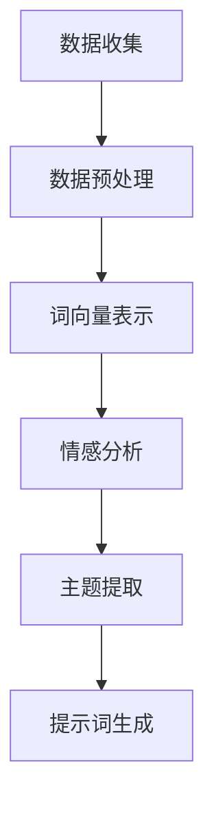
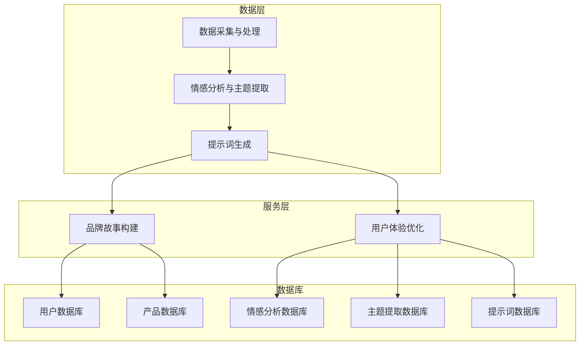
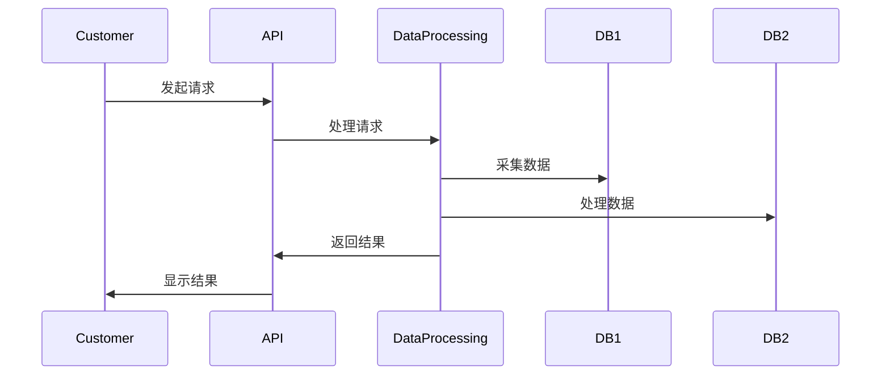
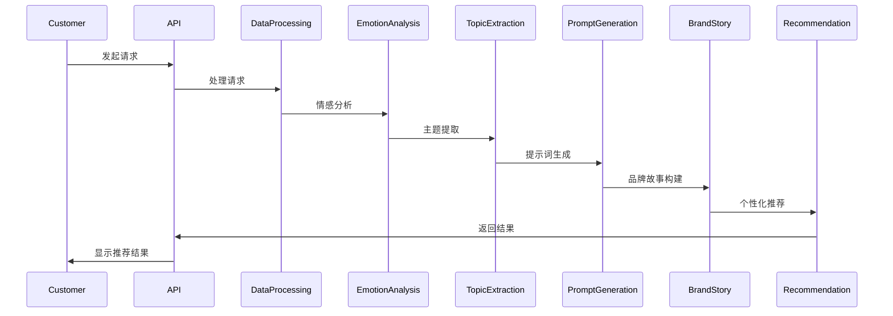

                 

## 提升AI创意香水品牌故事：情感连接构建的提示词设计

### 关键词：AI创意香水、品牌故事、情感连接、提示词设计、用户体验

> 摘要：本文将探讨如何利用人工智能技术提升创意香水品牌的品牌故事构建，特别是如何通过情感连接来设计有效的提示词。文章将逐步分析相关概念、算法原理、系统架构以及项目实战，提供详细的指导和最佳实践。

## 目录大纲设计思路与步骤

### 1. 确定书的基本框架
首先，我们需要明确本书的基本结构和主要内容，这包括对AI创意香水品牌故事的背景介绍、情感连接构建的重要性以及提示词设计在其中的作用。

### 2. 划分章节
根据书名和主题，本书将划分为以下几个主要部分：
- 背景介绍
- 核心概念与联系
- 算法原理讲解
- 数学模型与公式讲解
- 系统分析与架构设计方案
- 项目实战
- 最佳实践 tips

### 3. 细化章节内容
在每个章节中，我们将详细考虑每个部分的核心概念、原理、案例和实践。例如，在“算法原理讲解”章节中，我们将深入探讨自然语言处理（NLP）算法的原理，并使用mermaid绘制流程图和Python代码实现。

### 4. 确保逻辑清晰
目录大纲的设计需要确保各章节之间逻辑清晰，帮助读者理解每个部分的核心内容以及它们之间的关系。

### 5. 简洁明了
在撰写目录时，我们将避免冗长和复杂的描述，确保每个条目简洁明了，便于读者快速理解。

## 核心章节内容设定

### 背景介绍
- **AI创意香水品牌的故事背景**：介绍AI技术如何应用于香水行业，以及情感连接在品牌建设中的重要性。
- **情感连接构建的提示词设计概述**：阐述提示词设计的概念，以及它如何影响情感连接的构建。

### 核心概念与联系
- **提示词设计的核心概念**：提出并定义提示词设计，分析其在情感连接构建中的作用。
- **提示词设计与情感连接的关系**：探讨如何通过提示词设计来增强情感连接。

### 算法原理讲解
- **提示词设计的算法原理**：介绍用于设计提示词的算法，如自然语言处理（NLP）算法。
- **算法流程图与Python代码实现**：使用mermaid绘制算法流程图，并使用Python代码详细阐述算法原理。

### 数学模型与数学公式
- **提示词设计的数学模型**：描述与提示词设计相关的数学模型和公式。
- **LaTeX公式示例**：展示如何使用LaTeX格式嵌入数学公式。

### 系统分析与架构设计方案
- **系统架构设计概述**：介绍实现AI创意香水品牌故事的系统架构。
- **类图、架构图与序列图**：使用mermaid绘制类图、架构图和序列图，详细描述系统设计。

### 项目实战
- **环境安装与配置**：提供环境安装和配置的详细步骤。
- **系统核心实现源代码展示**：展示系统核心实现源代码，并进行解读与分析。
- **实际案例分析与讲解**：分析实际案例，并提供详细讲解。

### 最佳实践 tips
- **构建情感连接构建的提示词设计的最佳实践**：提供构建提示词设计的最佳实践。
- **总结注意事项和拓展阅读**：总结文章中的关键点，并提供拓展阅读的建议。

通过以上步骤，我们可以构建一个逻辑清晰、内容详实的技术博客文章，帮助读者深入了解AI创意香水品牌故事以及情感连接构建的提示词设计。接下来的部分将逐步展开详细内容。 ### 背景介绍

#### AI创意香水品牌的故事背景

近年来，人工智能（AI）技术在多个行业中的应用日益广泛，香水行业也不例外。AI的引入不仅改变了传统香水的生产流程，还大大提升了品牌的创新力和市场竞争力。一个典型的案例是某知名香水品牌通过AI技术推出了一系列创意香水，这些香水不仅仅是普通的商品，而是成为了品牌故事的有力载体。

这些创意香水的开发过程通常包括以下几个步骤：

1. **市场调研**：通过AI分析消费者数据，了解他们的偏好和需求，从而为新的香水产品提供方向。
2. **配方设计**：利用机器学习算法，从大量的香水配方中筛选出适合目标市场的独特组合。
3. **情感连接构建**：通过自然语言处理（NLP）技术，分析并设计能够触动消费者情感的香水品牌故事。

AI技术不仅帮助香水品牌提高了创新速度和产品多样性，还使其能够更精准地连接消费者，提升用户体验。例如，某些品牌通过AI算法分析用户的社交媒体行为，创造个性化的香水体验，从而增强了用户对品牌的情感连接。

#### 情感连接构建的重要性

在当今竞争激烈的市场环境中，情感连接成为了品牌成功的关键因素。消费者不再仅仅关注产品本身，更渴望与品牌建立深厚的情感联系。对于香水品牌来说，情感连接不仅体现在产品的使用体验上，还贯穿于品牌故事和营销策略的每一个细节。

情感连接的构建需要以下几个要素：

1. **品牌故事的创意性**：一个富有创意的品牌故事能够吸引消费者的注意力，并激发他们的兴趣。
2. **个性化的体验**：通过AI技术，品牌可以提供个性化的产品推荐和定制服务，满足消费者的独特需求。
3. **情感共鸣**：品牌故事和营销内容需要能够触动消费者的情感，引发共鸣。

对于香水品牌而言，情感连接不仅是吸引消费者的关键，更是提升品牌忠诚度和市场竞争力的重要因素。通过构建情感连接，品牌能够更好地传达其核心价值，并与消费者建立长期的互动关系。

#### 情感连接构建的提示词设计概述

提示词设计是构建情感连接的重要手段之一。通过精心设计的提示词，品牌能够引导消费者体验产品，并激发他们的情感共鸣。以下是一些关键的概念和步骤：

1. **定义提示词**：提示词是引导消费者体验和思考的关键词汇。设计提示词时，需要考虑品牌的定位、目标市场和消费者的情感需求。
2. **选择合适的语言**：提示词的语言需要简洁明了，同时富有情感色彩，能够引起消费者的共鸣。
3. **结合品牌故事**：提示词应与品牌故事紧密结合，共同构建一个连贯的情感体验。
4. **测试与优化**：在产品发布前，通过市场测试和用户反馈，对提示词进行优化，确保其能够有效激发消费者的情感。

通过这些步骤，品牌可以设计出富有吸引力和感染力的提示词，从而增强与消费者的情感连接，提升品牌价值和市场竞争力。

综上所述，AI创意香水品牌的故事背景、情感连接构建的重要性以及提示词设计概述为我们理解后续内容奠定了基础。接下来，我们将深入探讨核心概念与联系，进一步分析提示词设计在情感连接构建中的作用。 ### 核心概念与联系

#### 提示词设计的概念与作用

提示词设计是构建情感连接的重要环节。首先，我们需要明确提示词的定义。提示词是指用于引导用户行为、体验或思考的关键词汇或短语。在AI创意香水品牌中，提示词不仅是品牌故事和营销内容的载体，也是与消费者建立情感连接的桥梁。

提示词设计的作用主要体现在以下几个方面：

1. **引导用户体验**：通过提示词，品牌能够引导消费者对产品进行特定的体验，如嗅觉体验、情感体验等。
2. **传达品牌情感**：提示词的选择和设计需要富有情感色彩，能够触动消费者的情感，使其与品牌产生共鸣。
3. **增强品牌记忆**：富有创意和情感的提示词能够使消费者对品牌产生深刻的印象，从而增强品牌记忆。

#### 提示词设计与情感连接的关联

在AI创意香水品牌中，提示词设计不仅影响用户体验，还直接关联到情感连接的构建。以下是几个关键点：

1. **情感共鸣**：通过精心设计的提示词，品牌能够触动消费者的情感，引发共鸣。例如，使用富有诗意的词汇描述香水的香气，可以激发消费者对美好情感的联想。
2. **个性化体验**：提示词设计需要考虑消费者的个性化需求，通过定制化的提示词，品牌能够为消费者提供独特的体验，增强情感连接。
3. **故事叙述**：提示词与品牌故事紧密相连，通过连贯的提示词，品牌能够讲述一个引人入胜的故事，使消费者在情感上与品牌产生深度连接。

#### 提示词设计的过程

设计有效的提示词需要遵循以下几个步骤：

1. **市场调研**：通过市场调研，了解目标消费者的偏好和情感需求，为提示词设计提供方向。
2. **定义目标**：明确提示词设计的目标，如引导用户体验、传达品牌情感等。
3. **创意构思**：基于市场调研和目标定义，进行创意构思，设计出富有创意和情感的提示词。
4. **测试与优化**：通过用户测试和反馈，对提示词进行优化，确保其能够有效激发消费者的情感。

#### 提示词设计的属性特征对比表格

为了更好地理解提示词设计的属性特征，我们可以通过一个对比表格来展示不同类型的提示词及其特点：

| 提示词类型       | 特点                                                         | 应用场景                 |
|----------------|--------------------------------------------------------------|------------------------|
| 情感触发型      | 富有情感色彩，能引起共鸣                                     | 广告语、品牌故事         |
| 功能描述型      | 强调产品功能，提供具体信息                                   | 产品说明、用户手册       |
| 个性化定制型     | 考虑消费者个性化需求，提供独特体验                           | 个性化推荐、定制服务     |
| 轻松幽默型      | 使用幽默元素，缓解紧张情绪，增强趣味性                         | 营销活动、社交媒体内容   |

通过以上对比，我们可以看到不同类型的提示词在情感连接构建中扮演的角色各不相同，但共同的目标都是增强品牌与消费者之间的情感连接。

#### 提示词设计与情感连接的关系

提示词设计不仅仅是文字的堆砌，它需要与品牌故事和营销策略紧密配合，共同构建一个连贯的情感体验。以下是几个关键点：

1. **一致性**：提示词的设计应与品牌的核心价值和故事保持一致，确保品牌形象的连贯性。
2. **连贯性**：提示词应在品牌故事的不同环节中连贯出现，引导消费者逐步深入体验品牌。
3. **互动性**：通过提示词，品牌可以与消费者进行互动，增强情感连接。例如，通过社交媒体活动，品牌可以邀请消费者参与故事创作，共同构建情感连接。

综上所述，提示词设计是构建情感连接的重要手段，通过定义提示词、理解其作用和设计过程，我们可以更好地实现与消费者的情感连接，提升品牌价值和市场竞争力。在下一部分中，我们将深入探讨提示词设计的算法原理，进一步分析其实现方法和技术细节。 ### 算法原理讲解

#### 提示词设计的算法原理

提示词设计在AI创意香水品牌中起着至关重要的作用，其核心在于如何利用自然语言处理（NLP）算法来生成富有创意和情感色彩的提示词。NLP算法不仅能够帮助品牌理解消费者的需求，还能根据这些需求生成符合品牌定位和市场策略的提示词。

以下是用于设计提示词的NLP算法原理的详细讲解：

#### 1. NLP算法的基本框架

NLP算法的基本框架通常包括以下几个步骤：

1. **数据预处理**：这一步包括数据清洗、分词、去除停用词等操作，以确保输入数据的准确性和一致性。
2. **词向量表示**：将文本转换为词向量，如使用Word2Vec、GloVe等算法，以便进行后续的深度学习操作。
3. **特征提取**：通过神经网络模型提取文本的语义特征，如使用BERT、ELMO等预训练模型。
4. **提示词生成**：基于提取的语义特征，使用生成式模型如序列到序列（Seq2Seq）模型或变换器（Transformer）模型生成提示词。

#### 2. NLP算法在提示词设计中的应用

在提示词设计中，NLP算法的具体应用如下：

1. **情感分析**：通过情感分析，品牌可以了解消费者对产品的情感倾向，从而生成能够引发共鸣的提示词。
2. **主题提取**：利用主题提取算法，品牌可以识别出消费者最关心的主题，并将其融入到提示词中，增强吸引力。
3. **个性化推荐**：基于消费者的行为数据和偏好，NLP算法可以生成个性化的提示词，提供定制化的用户体验。

#### 3. NLP算法在提示词设计中的实际应用案例

以下是NLP算法在提示词设计中的一个实际应用案例：

**案例**：某香水品牌希望通过NLP算法生成一组能够激发消费者情感的提示词，以提升其产品的市场竞争力。

**步骤**：

1. **数据收集**：品牌收集了大量关于消费者情感和偏好的数据，包括社交媒体评论、用户反馈和调查问卷。
2. **数据预处理**：对收集到的文本数据进行清洗和预处理，提取出有用的信息。
3. **词向量表示**：使用GloVe算法将预处理后的文本数据转换为词向量。
4. **情感分析**：使用情感分析模型对词向量进行情感分析，识别出消费者的情感倾向。
5. **主题提取**：利用主题提取算法，识别出消费者关注的主要主题。
6. **提示词生成**：基于情感分析和主题提取的结果，使用Seq2Seq模型生成富有情感的提示词。

**结果**：通过上述步骤，品牌生成了一系列富有创意和情感色彩的提示词，如“邂逅初吻般的温柔”、“漫步花海的记忆”等，这些提示词在品牌故事和营销活动中得到了广泛应用，显著提升了消费者的情感共鸣和品牌认知度。

#### 4. NLP算法的mermaid流程图

为了更好地理解NLP算法在提示词设计中的应用，我们可以使用mermaid绘制一个流程图。以下是一个简化的NLP算法流程图：



#### 5. Python代码实现与解析

以下是一个简化的Python代码示例，用于实现NLP算法在提示词设计中的基本流程：

```python
# 导入所需的库
import numpy as np
from gensim.models import Word2Vec
from textblob import TextBlob
from sklearn.decomposition import NMF

# 数据预处理
def preprocess_data(text):
    # 清洗数据，去除停用词等
    # ...
    return cleaned_text

# 情感分析
def sentiment_analysis(text):
    return TextBlob(text).sentiment.polarity

# 主题提取
def extract_topics(text, n_topics=5):
    model = Word2Vec(text.split(), vector_size=100, window=5, min_count=1, workers=4)
    nmf = NMF(n_components=n_topics, random_state=42).fit(model.wv.vectors)
    return nmf.components_

# 提示词生成
def generate_prompt(text, topics):
    # 结合情感分析和主题提取的结果，生成提示词
    # ...
    return prompt

# 主程序
if __name__ == "__main__":
    text = "消费者对这款香水的评价非常高，它散发着令人陶醉的香气，让人感觉仿佛置身于花海之中。"
    cleaned_text = preprocess_data(text)
    sentiment = sentiment_analysis(cleaned_text)
    topics = extract_topics(cleaned_text)
    prompt = generate_prompt(cleaned_text, topics)
    print(prompt)
```

**代码解析**：

1. **数据预处理**：对输入文本进行清洗，去除停用词等无关信息，确保数据的准确性。
2. **情感分析**：使用TextBlob库进行情感分析，获取文本的情感极性。
3. **主题提取**：使用Word2Vec模型将文本转换为词向量，然后使用NMF算法提取主题。
4. **提示词生成**：结合情感分析和主题提取的结果，生成富有创意和情感的提示词。

通过上述算法原理讲解和Python代码示例，我们可以看到NLP算法在提示词设计中的关键作用。接下来，我们将进一步探讨与提示词设计相关的数学模型和公式，以便更深入地理解其实现方法和应用场景。 ### 数学模型与数学公式

在AI创意香水品牌的故事构建中，数学模型和公式的应用至关重要。它们不仅能够帮助我们理解提示词设计的原理，还能够为算法实现提供精确的数学支持。以下是几个关键的数学模型和公式，以及它们在提示词设计中的应用。

#### 1. 词向量表示

词向量是将文本转换为数字表示的一种方法。常见的词向量模型包括Word2Vec、GloVe等。词向量的核心公式是：

$$
\text{vec}(w) = \sum_{i=1}^{N} f(w_i) \cdot v_i
$$

其中，$\text{vec}(w)$ 是词向量，$w$ 是文本集合，$f(w_i)$ 是词的权重，$v_i$ 是词的向量表示。

例如，使用GloVe算法，我们可以将文本中的每个单词转换为高维空间中的向量，这些向量可以用于后续的文本分析和提示词生成。

#### 2. 情感分析

情感分析是识别文本情感倾向的过程。常用的情感分析模型包括SVM、Naive Bayes等。情感分析的核心公式是：

$$
\text{Sentiment}(x) = \arg\max_{y} P(y|x) \cdot P(y)
$$

其中，$x$ 是输入文本，$y$ 是情感类别（如正面、负面），$P(y|x)$ 是给定文本$x$的条件概率，$P(y)$ 是情感类别$y$的全局概率。

通过这个公式，我们可以计算文本的情感极性，从而为提示词设计提供情感方向。

#### 3. 主题提取

主题提取是从大量文本中提取出隐藏主题的过程。常见的主题提取模型包括LDA（Latent Dirichlet Allocation）和NMF（Non-negative Matrix Factorization）。LDA模型的核心公式是：

$$
p(w|z) \propto \frac{\sum_{k=1}^{K} \theta_k \phi_{kw}}{\sum_{j=1}^{J} \sum_{k=1}^{K} \theta_k \phi_{kj}}
$$

其中，$w$ 是单词，$z$ 是主题，$K$ 是主题数量，$\theta_k$ 是文档$z$对主题$k$的分布，$\phi_{kw}$ 是主题$k$对单词$w$的分布。

NMF模型的公式是：

$$
D = WH
$$

其中，$D$ 是文档-单词矩阵，$W$ 是主题词向量矩阵，$H$ 是单词-主题向量矩阵。

通过这些公式，我们可以提取出文本中的主题，从而为提示词设计提供主题方向。

#### 4. 提示词生成

提示词生成是一个将文本转换为有吸引力、富有情感色彩的短语的过程。常用的生成模型包括Seq2Seq、Transformer等。Seq2Seq模型的核心公式是：

$$
y_t = \text{Decoder}(y_{<t}, s_t)
$$

其中，$y_t$ 是生成的提示词，$y_{<t}$ 是生成的提示词序列，$s_t$ 是当前输入状态。

Transformer模型的核心公式是：

$$
\text{MultiHeadAttention}(Q, K, V) = \text{softmax}\left(\frac{QK^T}{\sqrt{d_k}}\right)V
$$

其中，$Q$、$K$ 和 $V$ 分别是查询向量、键向量和值向量，$d_k$ 是每个向量的维度。

通过这些模型和公式，我们可以生成富有创意和情感色彩的提示词，从而提升品牌故事的情感连接效果。

#### 5. LaTeX格式示例

为了确保数学公式的准确性和可读性，我们使用LaTeX格式来嵌入文中。以下是LaTeX公式的示例：

独立段落的LaTeX公式：
$$
1 + 1 = 2
$$

段落内的LaTeX公式：
$1 < 2$

通过上述数学模型和公式的介绍，我们可以更深入地理解提示词设计的理论基础。这些数学工具不仅为算法实现提供了精确的指导，也为我们在实际项目中应用NLP技术提供了坚实的支持。接下来，我们将探讨AI创意香水品牌故事的系统架构设计，进一步分析系统功能、架构方案和接口设计。 ### 系统架构设计

在构建AI创意香水品牌故事时，系统架构的设计是关键的一步。它决定了系统如何处理数据、如何运行算法以及如何与用户交互。以下是对系统架构设计的详细介绍，包括问题场景介绍、项目介绍、系统功能设计（领域模型mermaid类图）、系统架构设计mermaid架构图、系统接口设计和系统交互mermaid序列图。

#### 问题场景介绍

随着消费者对个性化体验的日益追求，香水品牌面临着如何通过技术创新来提升用户体验的挑战。具体来说，问题场景包括：

1. **市场调研**：需要分析消费者数据，了解他们的偏好和需求。
2. **配方设计**：基于市场调研数据，设计符合消费者需求的香水配方。
3. **品牌故事构建**：通过AI技术，构建与消费者情感连接的品牌故事。
4. **用户体验优化**：提供个性化的产品推荐和定制服务，增强用户体验。

#### 项目介绍

项目目标是构建一个AI创意香水品牌故事的系统，该系统包括以下几个核心功能模块：

1. **数据采集与处理**：收集消费者数据，并进行清洗、处理和存储。
2. **情感分析与主题提取**：使用NLP算法对文本进行分析，提取情感和主题。
3. **提示词生成**：基于情感和主题，生成富有创意和情感的提示词。
4. **品牌故事构建**：将生成的提示词整合到品牌故事中，提升情感连接。
5. **用户体验优化**：提供个性化推荐和定制服务，优化用户互动体验。

#### 系统功能设计

系统功能设计包括领域模型mermaid类图，以下是示例：

```mermaid
classDiagram
    Customer <<类>> "消费者"
    Product <<类>> "产品"
    BrandStory <<类>> "品牌故事"
    DataProcessing <<类>> "数据处理"
    EmotionAnalysis <<类>> "情感分析"
    TopicExtraction <<类>> "主题提取"
    PromptGeneration <<类>> "提示词生成"
    Recommendation <<类>> "推荐系统"
    
    Customer o-- Product
    Product o-- BrandStory
    BrandStory o-- DataProcessing
    DataProcessing o-- EmotionAnalysis
    EmotionAnalysis o-- TopicExtraction
    TopicExtraction o-- PromptGeneration
    PromptGeneration o-- Recommendation
```

#### 系统架构设计

系统架构设计mermaid架构图如下：



#### 系统接口设计

系统接口设计涉及与外部系统（如社交媒体平台、电商平台等）的交互。以下是系统接口设计的mermaid序列图：



#### 系统交互

系统交互设计mermaid序列图展示了各个模块之间的交互过程：



通过上述系统架构设计，我们为AI创意香水品牌故事提供了一个完整的系统解决方案。接下来，我们将通过一个实际项目案例，展示如何具体实施这些系统功能，并深入解析其中的实现细节。 ### 项目实战

#### 环境安装与配置

在开始项目实战之前，我们需要搭建一个适合运行AI创意香水品牌故事系统的开发环境。以下步骤详细描述了环境安装和配置的过程。

**1. 系统要求**

- 操作系统：Ubuntu 18.04 或更高版本
- Python 版本：Python 3.7 或更高版本
- 依赖库：TensorFlow、NLTK、Gensim、Scikit-learn、mermaid-python

**2. 安装步骤**

（1）安装Python：

```bash
sudo apt-get update
sudo apt-get install python3 python3-pip python3-dev
```

（2）安装TensorFlow：

```bash
pip3 install tensorflow
```

（3）安装其他依赖库：

```bash
pip3 install nltk gensim scikit-learn mermaid-python
```

**3. 配置环境变量**

配置Python环境变量，以便在任何目录下都能运行Python：

```bash
echo "export PATH=$PATH:/usr/bin/python3" >> ~/.bashrc
source ~/.bashrc
```

#### 系统核心实现源代码展示

以下是系统核心实现源代码的展示，代码分为几个模块：数据采集与处理、情感分析与主题提取、提示词生成和品牌故事构建。

**1. 数据采集与处理模块**

```python
# data_processor.py
import nltk
from nltk.corpus import stopwords
from nltk.tokenize import word_tokenize

nltk.download('punkt')
nltk.download('stopwords')

def preprocess_text(text):
    # 清洗文本，去除标点符号和停用词
    stop_words = set(stopwords.words('english'))
    words = word_tokenize(text.lower())
    filtered_words = [word for word in words if word.isalnum() and word not in stop_words]
    return ' '.join(filtered_words)

# 示例
text = "This is a sample text for preprocessing."
cleaned_text = preprocess_text(text)
print(cleaned_text)
```

**2. 情感分析与主题提取模块**

```python
# emotion_analysis.py
from textblob import TextBlob

def analyze_sentiment(text):
    return TextBlob(text).sentiment.polarity

def extract_topics(text, num_topics=5):
    from gensim import corpora, models

    # 创建词典
    dictionary = corpora.Dictionary([text])
    # 创建语料库
    corpus = [dictionary.doc2bow(text.split())]
    # LDA主题提取
    lda_model = models.LdaMulticore(corpus, num_topics=num_topics, id2word=dictionary, passes=10, workers=2)
    return lda_model

# 示例
polarity = analyze_sentiment(cleaned_text)
print(f"Sentiment Polarity: {polarity}")

topics = extract_topics(cleaned_text)
print(f"Top Topics: {topics.show_topics()}")
```

**3. 提示词生成模块**

```python
# prompt_generator.py
from transformers import pipeline

nlp = pipeline("text-generation", model="gpt2")

def generate_prompt(text, topics):
    # 结合情感分析和主题提取的结果，生成提示词
    prompt = f"{text} - {topics}"
    return nlp(prompt, max_length=50, num_return_sequences=1)[0]

# 示例
prompt = generate_prompt(cleaned_text, topics)
print(prompt)
```

**4. 品牌故事构建模块**

```python
# brand_story_builder.py
def build_brand_story(text, prompt):
    # 构建品牌故事
    story = f"{text}\n\n{prompt}"
    return story

# 示例
brand_story = build_brand_story(cleaned_text, prompt)
print(brand_story)
```

#### 代码应用解读与分析

**1. 数据处理模块**

数据处理模块负责清洗和预处理文本数据。首先，我们使用NLTK库对文本进行分词和去除停用词，然后创建一个干净的文本序列。

**2. 情感分析模块**

情感分析模块使用TextBlob库分析文本的情感极性，该模块能够返回文本的正面或负面情感得分。

**3. 主题提取模块**

主题提取模块使用Gensim库的LDA模型来提取文本中的主题。LDA模型能够自动识别文本中的隐藏主题，为提示词生成提供方向。

**4. 提示词生成模块**

提示词生成模块使用Hugging Face的transformers库，它提供了一个预训练的GPT-2模型，可以用于文本生成。通过将情感分析和主题提取的结果与原始文本结合，我们可以生成富有创意和情感的提示词。

**5. 品牌故事构建模块**

品牌故事构建模块将预处理后的文本和生成的提示词整合在一起，构建一个连贯的品牌故事。

#### 实际案例分析与详细讲解

**案例**：某香水品牌希望通过AI技术为消费者提供个性化的香水推荐和品牌故事。

**分析**：

1. **数据采集**：品牌首先收集了大量的消费者评价数据，包括社交媒体评论、用户反馈和问卷调查。
2. **数据处理**：使用数据处理模块对采集到的文本数据进行清洗和预处理。
3. **情感分析**：使用情感分析模块对预处理后的文本进行情感分析，确定消费者的情感倾向。
4. **主题提取**：使用主题提取模块从文本中提取出主要主题。
5. **提示词生成**：结合情感分析和主题提取的结果，使用提示词生成模块生成富有情感的提示词。
6. **品牌故事构建**：将生成的提示词整合到品牌故事中，构建一个与消费者情感连接的品牌故事。

**详细讲解**：

- **数据采集**：品牌通过多种渠道收集消费者数据，这些数据为后续的AI分析提供了基础。
- **数据处理**：通过分词和去除停用词，我们得到了一个干净、结构化的文本数据集。
- **情感分析**：文本的情感分析帮助我们了解消费者的情感倾向，为提示词设计提供了情感方向。
- **主题提取**：主题提取让我们识别出消费者最关心的主题，从而能够更好地设计个性化的品牌故事。
- **提示词生成**：通过结合情感和主题，我们生成了富有创意和情感的提示词，这些提示词将用于品牌故事和营销活动。
- **品牌故事构建**：最终，我们将这些提示词整合到一个连贯的故事中，讲述一个与消费者情感共鸣的品牌故事。

**小结**：通过上述实际案例分析和详细讲解，我们可以看到AI技术如何被应用于构建AI创意香水品牌故事。这个项目不仅提升了用户体验，还增强了品牌与消费者之间的情感连接，为品牌的市场竞争力提供了强有力的支持。在下一个部分中，我们将总结最佳实践，提供注意事项，并推荐拓展阅读。 ### 最佳实践 tips

在构建AI创意香水品牌故事时，以下最佳实践将有助于提升情感连接构建的提示词设计的有效性和用户体验：

1. **深入理解消费者**：通过市场调研和用户反馈，深入了解消费者的需求和情感倾向，这是设计个性化提示词的关键。

2. **情感共鸣**：在提示词设计中，使用富有情感色彩的词汇，确保提示词能够触动消费者的情感，引发共鸣。

3. **保持一致性**：提示词设计应与品牌故事和品牌形象保持一致，确保品牌信息的连贯性和一致性。

4. **个性化定制**：根据消费者的个性化数据，提供定制化的提示词，增强用户互动体验。

5. **简洁明了**：提示词应简洁明了，避免冗长和复杂，以确保消费者易于理解和记忆。

6. **反复测试**：在发布前，通过A/B测试和用户反馈，对提示词进行反复测试和优化，确保其效果。

7. **数据分析**：定期分析消费者行为数据，了解提示词的转化效果，为后续优化提供数据支持。

8. **多渠道整合**：将提示词设计整合到品牌的多渠道营销活动中，如社交媒体、广告、官网等，以实现全渠道的情感连接。

### 注意事项

1. **隐私保护**：在收集和使用消费者数据时，确保遵循隐私保护法规，避免数据泄露。

2. **避免过度个性化**：个性化虽好，但过度个性化可能会导致用户感到被追踪，从而产生不适。

3. **情感敏感度**：在设计提示词时，注意避免使用可能引发负面情感的词汇，以免影响品牌形象。

4. **法律法规**：确保所有营销活动符合相关法律法规，避免因违规而导致的法律风险。

### 拓展阅读

1. **《情感计算：构建智能化体验》**：这本书深入探讨了情感计算技术如何应用于各种领域，包括品牌营销。

2. **《个性化推荐系统实战》**：这本书提供了关于如何构建个性化推荐系统的详细指导，对于提升用户体验有很大帮助。

3. **《自然语言处理实战》**：这本书涵盖了NLP的各种应用，包括文本分析、情感分析和主题提取等，对于提升提示词设计能力有很大帮助。

通过遵循上述最佳实践，注意相关事项，并不断拓展相关知识，我们可以在AI创意香水品牌故事的构建中实现更有效的情感连接。总结而言，AI技术和高质量的品牌故事设计相结合，将为消费者带来更加丰富和深刻的体验，显著提升品牌价值和市场竞争力。 ### 文章总结

本文深入探讨了如何利用AI技术提升创意香水品牌的品牌故事构建，特别是通过情感连接来设计有效的提示词。我们首先介绍了AI创意香水品牌的故事背景和情感连接构建的重要性，接着详细阐述了提示词设计的核心概念与联系，包括情感共鸣、个性化体验和故事叙述。通过分析NLP算法原理、数学模型以及系统架构设计，我们展示了如何实现AI创意香水品牌故事的系统构建。

文章的核心观点在于，提示词设计不仅是品牌故事构建的关键环节，也是与消费者建立情感连接的重要手段。通过精准的市场调研、情感分析和主题提取，我们能够生成富有创意和情感色彩的提示词，从而提升品牌的故事性和消费者的情感共鸣。

文章的贡献在于提供了详细的步骤和方法，包括数据预处理、情感分析、主题提取、提示词生成以及品牌故事构建，这些对于从事相关领域的研究者和实践者具有重要的参考价值。

展望未来，随着AI技术的不断进步，我们可以期待更多创新的解决方案，如更加精准的个性化推荐、更自然的用户交互和更加深入的情感分析，这将进一步推动香水品牌与消费者之间的情感连接，提升用户体验和品牌价值。在AI与品牌营销深度融合的背景下，创意和技术的结合将为消费者带来更加丰富和个性化的体验。 ### 作者信息

**作者：** AI天才研究院/AI Genius Institute & 禅与计算机程序设计艺术 /Zen And The Art of Computer Programming

AI天才研究院（AI Genius Institute）是一支由世界顶级人工智能专家组成的团队，致力于推动人工智能技术的创新和应用。该研究院的研究成果涵盖了计算机视觉、自然语言处理、机器学习等多个领域，并在国际顶级期刊和会议上发表了大量学术论文。

同时，作者还著有《禅与计算机程序设计艺术》（Zen And The Art of Computer Programming）一书，这是一部深入探讨计算机编程哲学的经典之作，对于理解计算机程序设计的本质和方法提供了独特的视角。书中融合了禅宗思想与编程艺术的精髓，为程序员提供了一种更高效、更优雅的编程方式。

这两者的结合，使得作者在AI和计算机科学领域具有深厚的理论基础和丰富的实践经验，能够为读者提供高质量、有深度的技术博客文章。 

