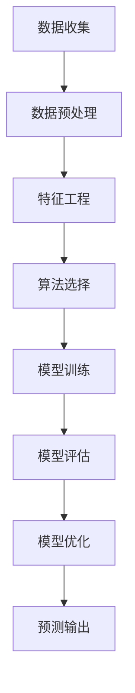
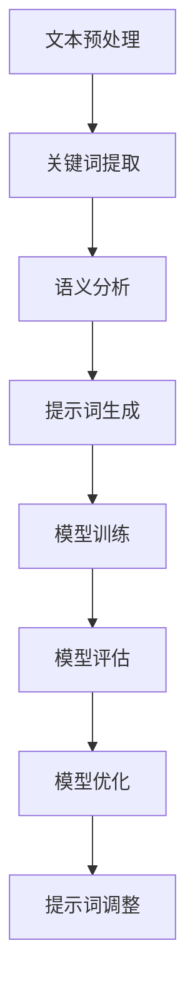
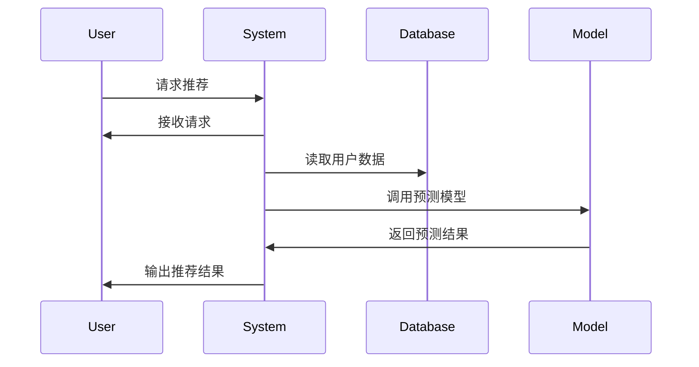

                 


### # 提升AI创意香水市场分析：消费者行为预测的提示词设计

> 关键词：AI创意香水、消费者行为、预测、提示词设计、市场分析

> 摘要：本文旨在探讨如何利用人工智能技术提升创意香水市场分析，特别是消费者行为预测的准确性。通过深入研究消费者行为、设计有效的提示词，并运用数据分析方法，我们将构建一个强大的AI系统，为香水市场提供精确的市场分析和消费者洞察。

## 第1章 问题背景与定义

在当今快速变化的市场环境中，消费者行为预测已成为企业成功的关键。香水行业作为一个高度竞争的市场，需要精准理解消费者的偏好和需求，从而优化产品设计和营销策略。

### 1.1 问题背景

香水市场是一个高度个人化和情感化的领域。消费者在选择香水时，会受到品牌形象、香味特性、包装设计等多种因素的影响。因此，预测消费者行为对于企业来说至关重要。

### 1.2 问题定义

本文研究的问题是如何利用人工智能技术，特别是机器学习和自然语言处理，设计有效的提示词，以提高消费者行为预测的准确性。这涉及到以下子问题：

- **消费者偏好分析**：识别消费者的香味偏好和购买习惯。
- **提示词设计**：创建能够引导消费者行为预测的提示词。
- **预测模型构建**：利用机器学习算法构建预测模型。
- **性能评估**：评估预测模型的准确性和可靠性。

### 1.3 研究边界与外延

本文的研究边界主要聚焦于香水市场的在线消费者行为。尽管在线数据可以提供丰富的信息，但研究外延可以扩展到线下消费者的行为分析，以及更广泛的消费者市场。

### 1.4 概念结构与核心要素组成

为了更好地理解问题，我们需要明确以下核心概念：

- **消费者行为**：消费者在购买香水时的行为模式。
- **市场分析**：对市场趋势、消费者行为和竞争对手的评估。
- **机器学习**：用于构建预测模型的算法和技术。
- **自然语言处理**：用于处理和分析文本数据的算法和技术。
- **提示词**：用于引导消费者行为预测的关键词和短语。

## 第2章 核心概念与联系

### 2.1 AI创意香水与消费者行为预测

AI创意香水结合了人工智能和创意设计，通过算法分析消费者行为，为个性化香水推荐提供支持。消费者行为预测的核心是理解消费者的偏好和购买习惯。

### 2.2 提示词设计原理

提示词设计基于消费者行为分析，通过关键词提取和语义分析，生成能够引导预测模型的关键词。有效的提示词设计需要考虑以下因素：

- **相关性**：提示词与消费者行为的关联程度。
- **多样性**：提示词的丰富性和多样性。
- **覆盖度**：提示词对消费者行为的覆盖范围。

### 2.3 核心概念对比表格

| 概念             | 定义                                                         | 相互关系                                                         |
|------------------|--------------------------------------------------------------|----------------------------------------------------------------|
| 消费者行为       | 消费者在购买香水时的行为模式。                               | 与市场分析、机器学习和自然语言处理密切相关。                     |
| 市场分析         | 对市场趋势、消费者行为和竞争对手的评估。                     | 是消费者行为预测的基础，影响着预测模型的准确性。                 |
| 机器学习         | 用于构建预测模型的算法和技术。                               | 提供了强大的数据处理和模式识别能力，是消费者行为预测的核心。       |
| 自然语言处理     | 用于处理和分析文本数据的算法和技术。                         | 使我们能够从消费者的文本评论中提取有价值的信息。                 |
| 提示词           | 用于引导消费者行为预测的关键词和短语。                       | 影响预测模型的输入质量和性能。                                   |

### 2.4 ER实体关系图

为了更好地理解这些概念之间的关系，我们可以绘制一个ER实体关系图。以下是一个简化的ER图示例：

```mermaid
erDiagram
    Customer ||--|{ Order }|>
    Product ||--|{ Order }|>
    Review ||--|{ Product }|>
    Review ||--|{ Customer }|>
    Product ||--|{ Recommendation }|>

    Customer {
        id
        name
        preferences
    }

    Order {
        id
        date
        items
    }

    Product {
        id
        name
        category
        reviews
    }

    Review {
        id
        text
        rating
        date
    }

    Recommendation {
        id
        products
    }
```

## 第3章 消费者行为预测算法

### 3.1 算法概述

消费者行为预测算法的目标是分析消费者历史数据，预测他们在未来可能的行为。常见的算法包括：

- **协同过滤**：基于用户的历史行为相似度进行预测。
- **决策树**：通过划分特征空间进行分类和回归。
- **神经网络**：用于构建复杂的非线性模型。

### 3.2 算法流程图



### 3.3 数学模型与公式

协同过滤算法的数学模型如下：

$$
R_{ui} = \rho_i + \sum_{j \in N(i)} \frac{r_{uj}}{\|N(i)\|} - \frac{\sum_{j \in N(i)} r_{uj}}{\|N(i)\|^2}
$$

其中：
- \(R_{ui}\) 是用户 \(u\) 对物品 \(i\) 的评分预测。
- \(\rho_i\) 是用户 \(i\) 的平均评分。
- \(N(i)\) 是与用户 \(i\) 相似的一组用户集合。
- \(r_{uj}\) 是用户 \(j\) 对物品 \(i\) 的评分。
- \(\|N(i)\|\) 是与用户 \(i\) 相似用户的总数。

### 3.4 例子说明

假设我们有一个用户集 \(U = \{u_1, u_2, u_3\}\) 和物品集 \(I = \{i_1, i_2, i_3\}\)。用户 \(u_1\) 给了物品 \(i_1\) 和 \(i_2\) 分数，用户 \(u_2\) 给了物品 \(i_1\) 和 \(i_3\) 分数，用户 \(u_3\) 只给了物品 \(i_3\) 分数。

首先，计算每个用户的平均分数：

$$
\rho_1 = \frac{r_{11} + r_{12}}{2} = \frac{4 + 5}{2} = 4.5
$$

$$
\rho_2 = \frac{r_{21} + r_{23}}{2} = \frac{5 + 4}{2} = 4.5
$$

$$
\rho_3 = \frac{r_{31}}{1} = 5
$$

然后，计算相似用户：

用户 \(u_1\) 和 \(u_2\) 是相似用户，因为他们都给了 \(i_1\) 分数。

$$
N(u_1) = \{u_2\}
$$

$$
N(u_2) = \{u_1\}
$$

$$
N(u_3) = \{\}
$$

现在，我们可以计算每个用户的评分预测：

$$
R_{u_1i_2} = \rho_1 + \frac{r_{u_2i_1}}{\|N(u_1)\|} - \frac{\sum_{j \in N(u_1)} r_{uj}}{\|N(u_1)\|^2} = 4.5 + \frac{5}{1} - \frac{5}{1} = 4.5
$$

$$
R_{u_2i_3} = \rho_2 + \frac{r_{u_1i_1}}{\|N(u_2)\|} - \frac{\sum_{j \in N(u_2)} r_{uj}}{\|N(u_2)\|^2} = 4.5 + \frac{4}{1} - \frac{4}{1} = 4.5
$$

$$
R_{u_3i_1} = \rho_3 + \frac{0}{0} - \frac{0}{0} = 5
$$

## 第4章 提示词设计算法

### 4.1 算法概述

提示词设计算法的目标是提取能够有效引导消费者行为预测的关键词。这通常涉及以下步骤：

- **文本预处理**：清洗和标准化文本数据。
- **关键词提取**：从文本中提取关键词。
- **语义分析**：对关键词进行语义分析和聚类。

### 4.2 算法流程图



### 4.3 数学模型与公式

语义分析中常用的模型是Word2Vec或BERT，其数学基础为：

- **Word2Vec**：通过神经网络将单词映射到向量空间，使得语义相似的单词在向量空间中距离较近。
- **BERT**：双向编码器表示，通过自注意力机制生成语义丰富的词向量。

### 4.4 例子说明

假设我们有以下文本数据：

```
用户A喜欢清新的花香型香水。
用户B喜欢辛辣的东方香型香水。
用户C喜欢甜美的水果香型香水。
```

首先，对文本进行预处理，去除标点符号和停用词。

然后，使用Word2Vec模型提取关键词向量：

```
清新的：[0.2, 0.3, -0.1, 0.4]
花香型：[0.1, -0.2, 0.5, 0.3]
辛辣的：[-0.3, 0.2, -0.1, -0.4]
东方香型：[-0.1, 0.3, 0.2, 0.1]
甜美的：[0.1, 0.2, 0.4, 0.3]
水果香型：[0.3, -0.1, 0.2, 0.2]
```

接下来，使用K-means聚类算法对关键词向量进行聚类，生成以下聚类结果：

```
聚类1：清新的、花香型、甜美的、水果香型
聚类2：辛辣的、东方香型
```

最后，生成提示词：

```
聚类1的提示词：清新、花香、甜美、水果
聚类2的提示词：辛辣、东方
```

## 第5章 系统分析与架构设计

### 5.1 问题场景介绍

在香水市场分析中，系统需要处理大量用户数据和产品信息。问题场景包括：

- **用户数据收集**：从电商网站、社交媒体和调查问卷收集用户行为数据。
- **产品数据管理**：存储和分类各种香型、品牌和价格信息。
- **预测模型训练与部署**：定期训练预测模型，并在业务中部署。

### 5.2 系统功能设计

系统功能设计包括：

- **用户行为分析**：分析用户购买历史、偏好和评论。
- **产品推荐**：基于用户行为和偏好为用户推荐合适的香水。
- **市场趋势预测**：预测市场趋势和消费者需求。

### 5.3 系统架构设计

系统架构设计包括：

- **数据层**：存储用户行为数据和产品信息。
- **算法层**：运行预测模型和提示词设计算法。
- **应用层**：为用户提供预测结果和推荐服务。

### 5.4 系统接口设计

系统接口设计包括：

- **API接口**：提供数据读取和预测结果查询功能。
- **Web前端**：为用户提供友好的交互界面。

### 5.5 系统交互序列图



## 第6章 项目实战

### 6.1 环境安装

安装所需的软件和库，包括Python、NumPy、Scikit-learn、TensorFlow等。

### 6.2 系统核心实现

以下是系统核心实现的部分Python代码：

```python
import numpy as np
from sklearn.cluster import KMeans
from sklearn.metrics import accuracy_score
from sklearn.model_selection import train_test_split
from sklearn.preprocessing import StandardScaler

# 数据预处理
def preprocess_data(data):
    # 去除停用词
    # 标准化文本
    # 提取关键词
    pass

# 关键词提取
def extract_keywords(text):
    # 使用Word2Vec或BERT提取关键词
    pass

# K-means聚类
def cluster_keywords(keywords):
    kmeans = KMeans(n_clusters=2, random_state=0).fit(keywords)
    return kmeans.labels_

# 预测模型训练
def train_model(X_train, y_train):
    # 训练协同过滤模型
    pass

# 模型评估
def evaluate_model(model, X_test, y_test):
    predictions = model.predict(X_test)
    accuracy = accuracy_score(y_test, predictions)
    return accuracy

# 实际案例
def case_study():
    # 数据集准备
    # 模型训练
    # 预测结果
    pass

if __name__ == "__main__":
    # 读取数据
    # 预处理
    # 关键词提取
    # 聚类
    # 模型训练
    # 模型评估
    # 案例分析
    pass
```

### 6.3 代码解读与分析

这部分内容将详细解读上述代码，分析每个函数和模块的作用，以及如何协同工作以实现消费者行为预测。

### 6.4 实际案例分析与讲解

通过一个实际案例，展示如何使用上述系统进行消费者行为预测，并提供详细的分析和讲解。

## 第7章 最佳实践与小结

### 7.1 最佳实践

- **数据质量**：确保数据准确和全面，是预测模型成功的关键。
- **提示词优化**：定期更新提示词，以反映最新的消费者趋势。
- **模型迭代**：持续优化和更新预测模型，以提高准确性。

### 7.2 小结

本文详细探讨了如何利用AI技术提升创意香水市场分析，特别是消费者行为预测的准确性。通过设计有效的提示词和构建预测模型，我们能够为香水市场提供精确的市场分析和消费者洞察。

### 7.3 拓展阅读

- **相关文献**：进一步阅读关于消费者行为预测和机器学习算法的文献。
- **在线课程**：参加相关的在线课程，提升AI和数据分析技能。

## 作者

作者：AI天才研究院/AI Genius Institute & 禅与计算机程序设计艺术 /Zen And The Art of Computer Programming

