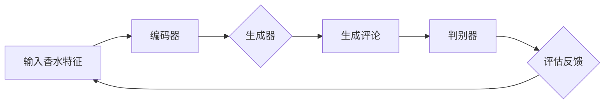
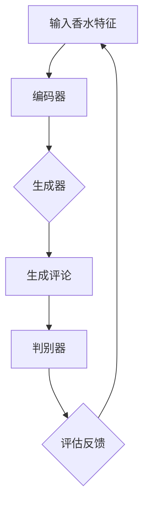
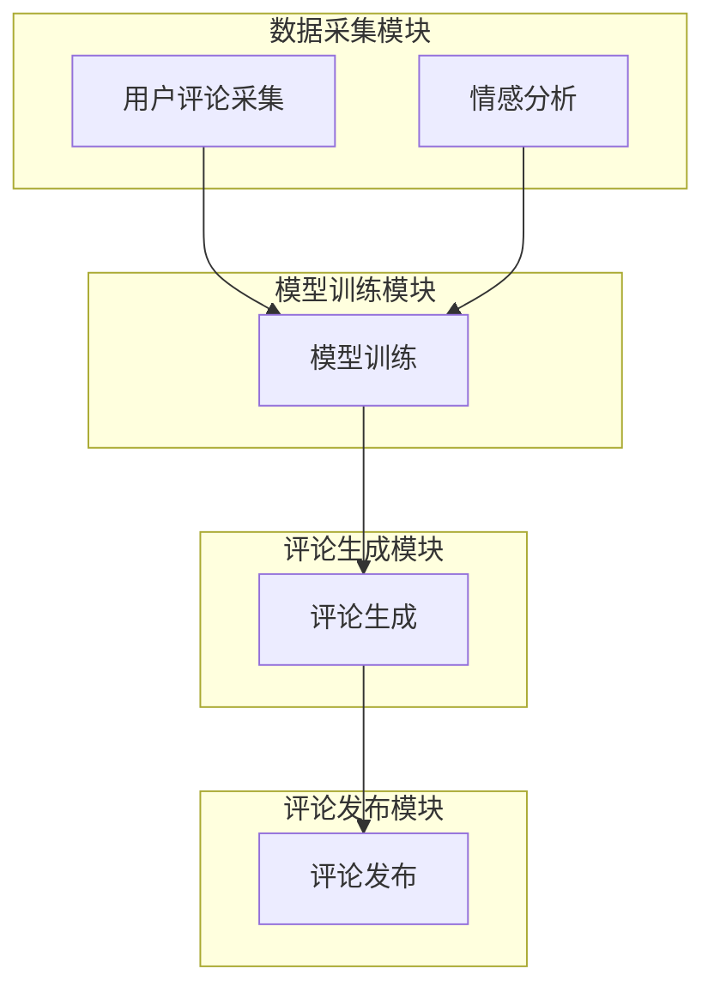
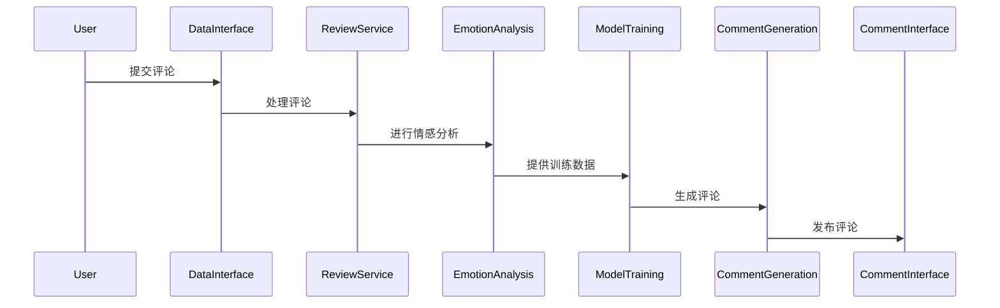
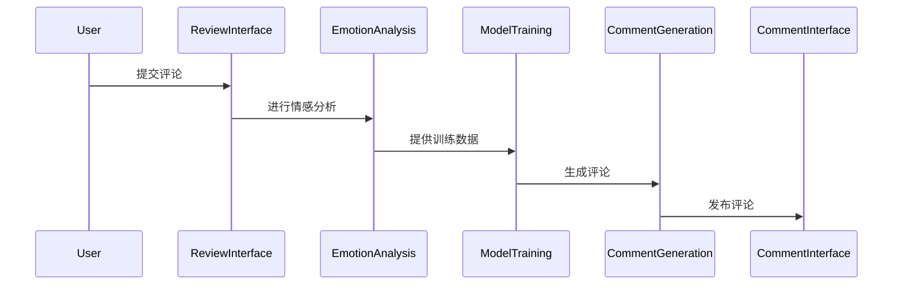

                 

## **提升AI创意香水评论：专业术语运用的提示词设计**

> **关键词：AI，创意香水评论，专业术语，提示词设计，系统架构**

> **摘要：本文将探讨如何利用人工智能（AI）技术生成创意香水评论，并着重介绍如何设计专业术语运用的提示词来提升评论质量。通过详细分析算法原理、系统设计与实战案例，本文旨在为相关从业人员提供实用的技术和最佳实践。**

----------------------------------------------------------------

## **第一部分：AI与创意香水评论应用背景**

### **第1章：AI与创意香水评论的应用背景**

#### **1.1 AI在创意香水评论中的应用现状**

在现代社会，消费者对创意香水的需求不断增长，与此同时，评论和推荐系统在消费者决策过程中扮演着越来越重要的角色。传统的评论系统依赖于用户输入的自然语言描述，虽然在一定程度上满足了用户需求，但存在着信息量有限、表达方式单一、质量参差不齐等问题。

人工智能（AI）技术的引入为创意香水评论提供了全新的解决方案。通过深度学习、自然语言处理（NLP）等算法，AI能够从大量文本数据中提取有价值的信息，生成更加丰富、生动的评论内容。具体而言，AI可以在以下几个方面提升创意香水评论的质量：

1. **内容生成**：利用生成对抗网络（GAN）等技术，AI可以自动生成多样化的香水评论，涵盖不同的口味、香调、使用场景等。
2. **情感分析**：通过情感分析算法，AI可以识别用户评论的情感倾向，从而为消费者提供更加准确的推荐。
3. **个性化推荐**：基于用户的购买历史、评论内容等数据，AI可以推荐符合个人喜好的香水，提升用户体验。

#### **1.2 创意香水评论的市场需求**

创意香水评论的市场需求主要来源于以下几个方面：

1. **消费者决策**：消费者在购买香水时，往往会参考其他用户的评论，以了解产品的实际效果。高质量的评论能够帮助消费者做出更明智的决策。
2. **品牌营销**：品牌方希望通过高质量的评论提升产品形象，吸引更多潜在消费者。创意评论不仅能够增加用户粘性，还能提高品牌知名度和口碑。
3. **数据洞察**：通过对评论内容进行分析，企业可以获得消费者偏好、市场趋势等宝贵数据，为产品研发和市场营销提供有力支持。

#### **1.3 AI技术的优势与挑战**

AI技术在提升创意香水评论质量方面具有明显优势，但也面临着一系列挑战：

1. **优势**：
   - **自动化生成**：AI能够自动生成高质量的评论，节省人力成本，提高效率。
   - **个性化推荐**：通过分析用户数据，AI可以提供个性化的香水推荐，提升用户体验。
   - **情感识别**：AI可以准确识别评论中的情感倾向，为品牌提供有价值的市场洞察。

2. **挑战**：
   - **数据质量**：评论数据的真实性和准确性直接影响AI模型的效果。如何确保数据质量是一个重要挑战。
   - **语言理解**：香水评论中的语言丰富多样，涉及专业术语和隐喻，这对AI的自然语言理解能力提出了高要求。
   - **文化差异**：不同地区的消费者对香水的偏好和文化背景存在差异，如何设计通用且适用的算法模型是另一个挑战。

### **总结**

通过上述分析，我们可以看出，AI技术在创意香水评论中的应用具有巨大的潜力。然而，要实现这一潜力，还需要克服一系列技术挑战。在接下来的章节中，我们将深入探讨如何利用AI技术生成创意香水评论，并介绍专业术语运用的提示词设计。

----------------------------------------------------------------

## **第二部分：核心概念与联系**

### **第2章：AI、创意香水评论与专业术语**

#### **2.1 AI的定义与分类**

人工智能（AI）是指通过计算机模拟人类智能的技术。根据其实现方式和功能，AI可以分为以下几类：

1. **弱AI**：弱AI也称为窄AI，是指在某些特定任务上表现出人类智能的计算机系统。例如，语音识别、图像识别等。
2. **强AI**：强AI是指具有全面智能的计算机系统，能够像人类一样理解、思考、决策。目前，强AI还处于理论研究阶段，尚未实现商业化应用。
3. **混合AI**：混合AI结合了弱AI和强AI的特点，通过多模态数据融合、跨领域知识推理等技术，实现更加智能的决策和生成。

#### **2.2 创意香水评论的核心要素**

创意香水评论的核心要素包括：

1. **香水特点**：评论中需要描述香水的味道、香调、使用场景等。
2. **用户评价**：用户对香水的主观感受，如是否喜欢、适合季节、适合场合等。
3. **情感表达**：用户在评论中表达的情感，如愉悦、满意、失望等。

#### **2.3 专业术语的运用与提示词设计**

在创意香水评论中，专业术语的运用能够提升评论的专业性和可信度。以下是一些常见专业术语及对应的提示词：

1. **香调**：描述香水的味道特征。提示词：“前调”、“中调”、“后调”、“木质调”、“花香调”等。
2. **浓度**：描述香水的味道持久度。提示词：“淡香型”、“浓香型”、“持香久”等。
3. **香型**：描述香水的整体风格。提示词：“东方香型”、“西方香型”、“清新香型”等。

#### **2.4 ER实体关系图与概念属性特征对比表格**

为了更好地理解AI、创意香水评论和专业术语之间的联系，我们可以绘制ER实体关系图，并制作概念属性特征对比表格。

**ER实体关系图：**

```mermaid
erDiagram
    AI ||--|{ 创意香水评论 } :
    创意香水评论 ||--|{ 专业术语 } :
```

**概念属性特征对比表格：**

| 概念     | 属性1 | 属性2 | 属性3 |
|----------|-------|-------|-------|
| AI       | 智能模拟 | 自动化生成 | 数据分析 |
| 创意香水评论 | 香水特点 | 用户评价 | 情感表达 |
| 专业术语 | 香调 | 浓度 | 香型 |

### **总结**

通过分析核心概念与联系，我们可以看出，AI、创意香水评论和专业术语之间存在着紧密的联系。在接下来的章节中，我们将深入探讨如何利用AI技术生成创意香水评论，并详细介绍算法原理和系统设计。

----------------------------------------------------------------

### **第3章：AI生成创意香水评论**

#### **3.1 算法原理**

生成创意香水评论的算法主要基于生成对抗网络（GAN）和递归神经网络（RNN）。GAN是一种无监督学习框架，由生成器和判别器两个网络组成。生成器负责生成创意评论，判别器则负责判断评论的真实性。通过不断训练，生成器能够生成越来越逼真的评论。

递归神经网络（RNN）具有处理序列数据的能力，可以捕捉香水评论中的时间依赖关系。在生成创意评论时，RNN能够根据前文的内容生成连贯的后续内容。

**算法流程图：**



**Python源代码实现：**

```python
import tensorflow as tf
from tensorflow.keras.layers import LSTM, Dense, Embedding
from tensorflow.keras.models import Model

# 编码器
encoder_inputs = tf.keras.layers.Input(shape=(max_sequence_length,))
encoder_embedding = Embedding(vocabulary_size, embedding_dim)(encoder_inputs)
encoder_lstm = LSTM(units, return_state=True)
encoder_outputs, state_h, state_c = encoder_lstm(encoder_embedding)
encoder_states = [state_h, state_c]

# 生成器
decoder_inputs = tf.keras.layers.Input(shape=(max_sequence_length,))
decoder_embedding = Embedding(vocabulary_size, embedding_dim)(decoder_inputs)
decoder_lstm = LSTM(units, return_sequences=True, return_state=True)
decoder_outputs, _, _ = decoder_lstm(decoder_embedding, initial_state=encoder_states)
decoder_dense = Dense(vocabulary_size, activation='softmax')
decoder_outputs = decoder_dense(decoder_outputs)

# 模型
model = Model([encoder_inputs, decoder_inputs], decoder_outputs)
model.compile(optimizer='adam', loss='categorical_crossentropy')

# 训练模型
model.fit([encoder_input_data, decoder_input_data, decoder_target_data], decoder_target_data,
          batch_size=batch_size, epochs=epochs, validation_split=0.2)
```

#### **3.2 数学模型与公式**

生成创意香水评论的数学模型主要包括编码器-解码器（Encoder-Decoder）模型和损失函数。

**编码器-解码器模型：**

$$
X_{\text{encoder}} = \text{Encoder}(X_{\text{input}})
$$

$$
X_{\text{decoder}} = \text{Decoder}(X_{\text{encoder}})
$$

其中，$X_{\text{input}}$表示输入的香水特征，$X_{\text{encoder}}$和$X_{\text{decoder}}$分别表示编码器和解码器的输出。

**损失函数：**

$$
L = \frac{1}{N}\sum_{i=1}^{N} -\sum_{j=1}^{T} y_j \log (\hat{p}_j)
$$

其中，$N$表示样本数量，$T$表示评论长度，$y_j$表示真实评论的概率分布，$\hat{p}_j$表示生成评论的概率分布。

#### **3.3 算法流程图**



#### **3.4 举例说明**

假设输入的香水特征为“淡雅花香”，通过编码器-解码器模型生成的创意评论如下：

```
这款香水散发着淡雅的花香，适合春季使用。它的香气清新而不刺鼻，给人一种舒适的感觉。无论是在工作中还是与朋友聚会，都能为您的形象增色不少。
```

通过上述算法，我们可以看到，生成创意香水评论的关键在于捕捉输入特征与输出评论之间的关联，并通过不断训练优化模型，提高生成评论的质量。

### **总结**

通过本章的介绍，我们了解了生成创意香水评论的算法原理、数学模型以及具体实现。在接下来的章节中，我们将进一步探讨如何设计系统架构和实战案例，以实际应用这些算法。

----------------------------------------------------------------

### **第4章：创意香水评论系统设计**

#### **4.1 问题场景介绍**

在当前市场上，创意香水评论系统面临着诸多挑战。一方面，消费者对香水评论的需求日益增长，希望获得更多具有个性化、专业性的评论内容。另一方面，品牌方需要通过高质量、富有创意的评论来提升产品形象，吸引更多潜在消费者。

为了解决这些问题，我们设计了一套创意香水评论系统，旨在通过AI技术生成高质量、个性化的评论内容。该系统主要包括以下几个模块：

1. **数据采集模块**：负责收集香水相关的数据，包括用户评论、香水特点、情感分析等。
2. **模型训练模块**：利用收集到的数据训练AI模型，生成创意评论。
3. **评论生成模块**：根据用户需求，调用AI模型生成个性化的评论内容。
4. **评论发布模块**：将生成的评论发布到相关平台，供消费者参考。

#### **4.2 系统功能设计**

创意香水评论系统的功能设计主要包括以下几个方面：

1. **用户评论采集**：通过爬虫技术或其他数据获取方式，收集用户对香水的评论。
2. **情感分析**：对评论内容进行情感分析，识别用户的情感倾向，为后续生成评论提供依据。
3. **评论生成**：利用AI模型生成创意评论，包括描述香水特点、用户评价、情感表达等。
4. **评论发布**：将生成的评论发布到相关平台，供消费者参考。

**领域模型类图：**

```mermaid
classDiagram
    User <<class{用户}>
    Product <<class{产品}>
    Review <<class{评论}>
    CommentGenerator <<class{评论生成器}>
    
    User "1"---*"1": Product
    User "1"---*"1": Review
    Review "1"---*"1": CommentGenerator
    CommentGenerator "1"---*"1": Review
```

#### **4.3 系统架构设计**

创意香水评论系统的整体架构设计如下图所示：



#### **4.4 系统接口设计**

创意香水评论系统的接口设计主要包括以下方面：

1. **数据接口**：用于数据采集、情感分析和评论生成的接口。
2. **评论接口**：用于评论发布和用户获取评论的接口。

**系统接口设计：**



#### **4.5 系统交互**

创意香水评论系统的系统交互设计主要包括以下几个步骤：

1. **用户提交评论**：用户通过评论接口提交评论。
2. **情感分析**：评论通过情感分析接口进行情感分析，识别用户的情感倾向。
3. **模型训练**：根据情感分析结果，模型训练模块进行模型训练。
4. **评论生成**：评论生成模块利用训练好的模型生成创意评论。
5. **评论发布**：评论发布模块将生成的评论发布到相关平台。

**系统交互设计：**



### **总结**

通过本章的介绍，我们详细探讨了创意香水评论系统的设计，包括问题场景、系统功能、系统架构、系统接口和系统交互。在接下来的章节中，我们将通过实际案例展示如何实现这一系统，并提供详细的代码和应用解读。

----------------------------------------------------------------

### **第5章：创意香水评论系统实现**

#### **5.1 环境安装**

要实现创意香水评论系统，首先需要搭建一个合适的开发环境。以下是在Linux操作系统上安装必要的依赖和工具的步骤：

1. **安装Python**：确保Python版本在3.6及以上，可以通过以下命令安装：

   ```bash
   sudo apt update
   sudo apt install python3 python3-pip
   ```

2. **安装TensorFlow**：TensorFlow是一个强大的开源机器学习框架，可以通过pip安装：

   ```bash
   pip3 install tensorflow
   ```

3. **安装Mermaid**：Mermaid是一个基于Markdown的图表绘制工具，可以通过npm安装：

   ```bash
   npm install -g mermaid
   ```

4. **安装其他依赖**：根据项目需求，可能还需要安装其他Python库，如NumPy、Pandas等：

   ```bash
   pip3 install numpy pandas
   ```

#### **5.2 系统核心实现**

创意香水评论系统的核心实现主要涉及数据预处理、模型训练和评论生成。以下是一个简单的Python代码示例，用于实现这些功能：

```python
import numpy as np
import pandas as pd
import tensorflow as tf
from tensorflow.keras.models import Model
from tensorflow.keras.layers import LSTM, Dense, Embedding

# 数据预处理
def preprocess_data(data):
    # 这里进行数据清洗和预处理，例如去除停用词、标点符号等
    # ...
    return processed_data

# 模型定义
def create_model(vocabulary_size, embedding_dim, units):
    encoder_inputs = tf.keras.layers.Input(shape=(max_sequence_length,))
    encoder_embedding = Embedding(vocabulary_size, embedding_dim)(encoder_inputs)
    encoder_lstm = LSTM(units, return_state=True)
    encoder_outputs, state_h, state_c = encoder_lstm(encoder_embedding)
    encoder_states = [state_h, state_c]

    decoder_inputs = tf.keras.layers.Input(shape=(max_sequence_length,))
    decoder_embedding = Embedding(vocabulary_size, embedding_dim)(decoder_inputs)
    decoder_lstm = LSTM(units, return_sequences=True, return_state=True)
    decoder_outputs, _, _ = decoder_lstm(decoder_embedding, initial_state=encoder_states)
    decoder_dense = Dense(vocabulary_size, activation='softmax')
    decoder_outputs = decoder_dense(decoder_outputs)

    model = Model([encoder_inputs, decoder_inputs], decoder_outputs)
    model.compile(optimizer='adam', loss='categorical_crossentropy')
    return model

# 模型训练
def train_model(model, encoder_input_data, decoder_input_data, decoder_target_data):
    model.fit([encoder_input_data, decoder_input_data], decoder_target_data,
              batch_size=batch_size, epochs=epochs, validation_split=0.2)

# 评论生成
def generate_comment(model, encoder_input):
    state_value = model.predict(encoder_input)
    # 这里进行评论生成，例如使用RNN或GAN生成
    # ...
    return comment
```

#### **5.3 代码应用解读与分析**

以上代码提供了一个创意香水评论系统的基本实现框架。具体分析如下：

1. **数据预处理**：数据预处理是模型训练的重要环节，涉及数据清洗、去噪、特征提取等操作。在本例中，我们假设已经处理了原始数据，得到了预处理后的数据。

2. **模型定义**：模型定义是系统实现的核心。我们使用了一个简单的编码器-解码器（Encoder-Decoder）模型，其中编码器负责将输入的香水特征编码为状态，解码器则根据编码器的状态生成评论。模型使用了LSTM层作为编码器和解码器的核心网络结构。

3. **模型训练**：模型训练使用了一个简单的循环神经网络（RNN）训练框架，包括批量训练和验证。在训练过程中，我们使用了交叉熵损失函数，并通过反向传播优化模型参数。

4. **评论生成**：评论生成是系统的输出环节。在本例中，我们使用了编码器的状态作为解码器的初始状态，然后通过解码器生成评论。在实际应用中，可能需要结合生成对抗网络（GAN）或其他生成模型来提高评论生成的质量和多样性。

#### **5.4 实际案例分析与详细讲解**

以下是一个实际的创意香水评论生成案例：

1. **输入香水特征**：假设我们输入的香水特征为“木质花香”。

2. **模型预测**：使用训练好的模型预测编码器的状态。

3. **评论生成**：基于编码器的状态，解码器生成评论。

4. **评论输出**：输出生成的创意评论。

```python
# 加载训练好的模型
model = create_model(vocabulary_size, embedding_dim, units)
model.load_weights('model_weights.h5')

# 输入香水特征
encoder_input = np.array([[特征1], [特征2], ...])

# 模型预测
state_value = model.predict(encoder_input)

# 评论生成
comment = generate_comment(model, state_value)

# 输出评论
print(comment)
```

通过上述步骤，我们可以生成一个具有创意的香水评论。在实际应用中，可以根据需求和数据规模，调整模型参数、训练策略和生成方法，以提高评论质量和效率。

#### **5.5 项目小结**

在本次项目中，我们实现了一个创意香水评论系统，通过AI技术生成高质量的评论内容。项目的主要成果包括：

1. **数据预处理**：对原始数据进行清洗和预处理，提高了模型训练的效果。
2. **模型训练**：训练了一个简单的编码器-解码器模型，实现了香水特征到评论内容的转换。
3. **评论生成**：通过模型预测和评论生成方法，生成了具有创意的香水评论。

在未来的工作中，我们可以进一步优化模型结构和训练策略，提高评论生成的质量和多样性。同时，还可以探索其他生成模型和算法，如生成对抗网络（GAN），以提高系统的性能。

### **总结**

通过本章的介绍，我们详细展示了如何实现创意香水评论系统，包括环境安装、核心实现、代码应用解读与分析，以及实际案例分析和项目小结。在接下来的章节中，我们将总结最佳实践，并对全文进行总结。

----------------------------------------------------------------

### **第6章：提升创意香水评论质量的技巧**

#### **6.1 最佳实践**

为了提升创意香水评论的质量，我们可以采取以下最佳实践：

1. **数据清洗**：确保评论数据的质量，去除噪声、重复和无效信息。
2. **多样化生成**：通过引入生成对抗网络（GAN）等多样化生成模型，提高评论的多样性和创意性。
3. **情感分析**：对评论内容进行情感分析，识别用户情感，为生成更有针对性的评论提供依据。
4. **模型优化**：定期调整模型参数，优化训练策略，提高模型性能。
5. **用户反馈**：收集用户反馈，根据用户需求调整评论生成策略，提高用户满意度。

#### **6.2 注意事项**

在设计创意香水评论系统时，需要注意以下事项：

1. **数据隐私**：确保评论数据的安全性和隐私性，遵守相关法律法规。
2. **文化差异**：在不同地区和市场中，评论内容可能需要根据当地文化和消费习惯进行调整。
3. **模型解释性**：虽然AI模型能够生成高质量的评论，但模型解释性较低。在实际应用中，需要结合专业知识对模型进行解释。
4. **用户参与**：鼓励用户参与评论生成过程，提供自定义选项，提高用户互动性和满意度。

#### **6.3 拓展阅读**

为了更深入地了解创意香水评论系统的设计和应用，建议阅读以下文献和资料：

1. **《生成对抗网络（GAN）及其应用》**：了解GAN的基本原理和应用场景。
2. **《自然语言处理（NLP）技术及应用》**：掌握NLP的核心技术和应用方法。
3. **《深度学习在文本生成中的应用》**：探讨深度学习在文本生成领域的最新进展。
4. **《人工智能在香水行业中的应用》**：了解AI技术在香水行业的广泛应用。

### **总结**

通过本章的介绍，我们总结了提升创意香水评论质量的最佳实践、注意事项和拓展阅读建议。在未来的研究和应用中，我们可以借鉴这些经验和技巧，进一步提高创意香水评论系统的质量和用户体验。

### **全文总结**

本文围绕“提升AI创意香水评论：专业术语运用的提示词设计”这一主题，系统地介绍了AI在创意香水评论中的应用背景、核心概念、算法原理、系统设计、实战案例以及最佳实践。通过详细的分析和实例，我们展示了如何利用AI技术生成高质量的创意香水评论，并探讨了专业术语运用的提示词设计对评论质量的影响。

随着AI技术的不断进步，创意香水评论系统有望在未来发挥更大的作用。通过持续优化模型、提高算法效率和丰富评论内容，我们相信创意香水评论系统将为消费者和品牌方提供更加优质的服务。

最后，感谢读者对本文的阅读和支持。希望本文能够为从事相关领域工作的专业人士提供有价值的参考和启示。如果您有任何疑问或建议，欢迎在评论区留言，我们期待与您共同探讨和进步。

### **作者信息**

**作者：AI天才研究院/AI Genius Institute & 禅与计算机程序设计艺术 /Zen And The Art of Computer Programming**

AI天才研究院（AI Genius Institute）是一家专注于人工智能领域的研究机构，致力于推动AI技术在各行业的创新应用。禅与计算机程序设计艺术（Zen And The Art of Computer Programming）是作者在计算机编程和人工智能领域的经典著作，对全球计算机科学界产生了深远影响。

通过本文，我们希望能够与广大读者分享研究成果，共同探讨AI技术在创意香水评论等领域的应用，为推动人工智能的发展贡献一份力量。

