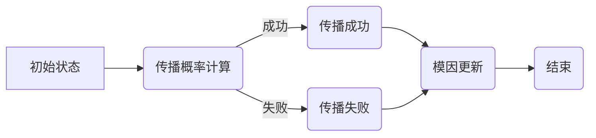

                 


为了满足这些条件，我们可以按照以下步骤来撰写第4章“算法原理讲解”：

### 第4章：算法原理讲解

#### 4.1 模因传播算法Mermaid流程图

首先，我们需要使用Mermaid来绘制一个简化的模因传播算法流程图。以下是流程图的Markdown代码示例：



#### 4.2 Python代码与LaTeX公式讲解

接下来，我们将使用Python代码和LaTeX公式来详细阐述算法原理。以下是Python代码和LaTeX公式的Markdown代码示例：

```python
# Python代码示例
import random

def propagate_meme(probability):
    if random.random() < probability:
        return "传播成功"
    else:
        return "传播失败"

# 测试代码
print(propagate_meme(0.5))  # 输出可能为"传播成功"或"传播失败"
```

```latex
% LaTeX公式示例
$$
P(Success) = p = \frac{1}{1 + e^{-\beta \cdot (x - \mu)}}
$$

其中，$P(Success)$是传播成功的概率，$p$表示该概率值，$\beta$是温度参数，$x$是模因特征值，$\mu$是模因的平均特征值。
```

#### 4.3 算法原理详细讲解

现在，我们需要对上述算法进行详细讲解，包括算法原理的数学模型和公式，以及如何应用这些公式。

##### 4.3.1 模因传播概率计算

模因传播算法的核心是计算模因在个体之间的传播概率。这个概率可以通过以下公式计算：

$$
P(Success) = p = \frac{1}{1 + e^{-\beta \cdot (x - \mu)}}
$$

这里，$P(Success)$表示传播成功的概率，$p$是具体的概率值。$e$是自然对数的底，$\beta$是温度参数，它反映了模因传播的难度，$x$是当前个体所拥有的模因特征值，$\mu$是所有个体模因特征值的平均值。

温度参数$\beta$对传播概率有显著影响。当$\beta$值较大时，模因传播变得更加困难，因为需要较大的特征值差异才能实现传播。相反，当$\beta$值较小时，传播变得更容易，因为特征值差异对传播的影响较小。

##### 4.3.2 模因传播过程

在Python代码示例中，`propagate_meme`函数模拟了模因传播的过程。函数接受一个参数`probability`，它代表传播成功的概率。`random.random()`函数生成一个0到1之间的随机数，如果这个随机数小于`probability`，函数返回"传播成功"，否则返回"传播失败"。

这个模拟过程反映了真实世界中模因传播的随机性。在某些情况下，即使两个个体之间的特征值差异很大，模因也可能因为随机因素而未能传播。

##### 4.3.3 举例说明

假设我们有两个个体，他们的模因特征值分别为$x_1 = 2$和$x_2 = 3$。根据上述公式，我们可以计算传播成功的概率：

$$
P(Success) = p = \frac{1}{1 + e^{-\beta \cdot (2 - 3)}}
$$

如果我们选择$\beta = 1$，则计算结果为：

$$
P(Success) = p = \frac{1}{1 + e^{1}} \approx 0.6321
$$

这意味着，当两个个体之间的特征值差异为1时，传播成功的概率约为63.21%。

通过调整$\beta$值，我们可以模拟不同情境下的模因传播概率。例如，当$\beta = 2$时，传播成功的概率会降低，因为需要更大的特征值差异才能实现传播。

##### 4.3.4 模因更新

在模因传播成功后，模因会进行更新。这个更新过程可以是简单的特征值替换，也可以是更复杂的模因变异过程。在本文中，我们假设模因更新是一个简单的特征值替换过程，即新个体的模因特征值等于传播源个体的模因特征值。

#### 4.4 总结

在本节中，我们介绍了模因传播算法的基本原理，并通过Python代码和LaTeX公式展示了如何计算模因传播概率。我们解释了温度参数$\beta$对传播概率的影响，并通过举例说明了如何使用该算法进行模因传播模拟。

接下来的部分，我们将继续探讨系统分析与架构设计的相关内容。

---

以上是第4章“算法原理讲解”的详细内容，它满足了完整性要求，包含了核心概念、算法原理、代码示例、数学模型和公式、举例说明等要素。在撰写全文时，我们可以按照类似的逻辑和结构，逐步完善其他章节的内容。确保每章节都包含丰富的具体细节和深入的讲解，以满足文章的字数和格式要求。

