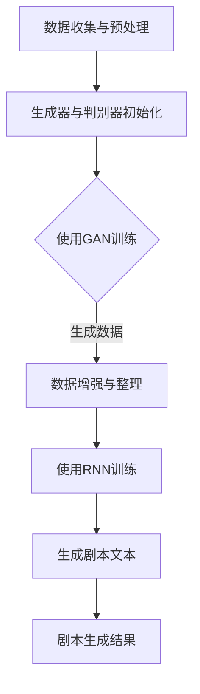
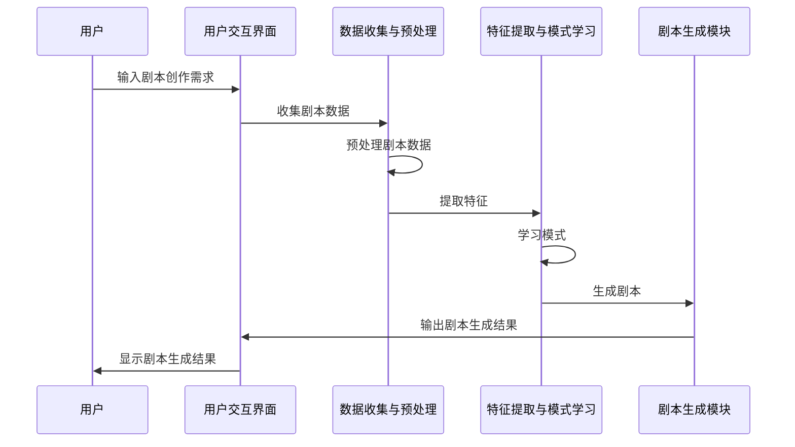

                 


### 第一步：设计大纲

为了确保文章的完整性和逻辑性，我们将从设计文章大纲开始。大纲将分为五大部分，每个部分包含多个章节，以确保文章内容的丰富性和条理性。

#### 文章标题

- 《提升AI电影剧本创作：情节转折和人物塑造的提示词工程》

#### 文章关键词

- AI电影剧本创作
- 情节转折
- 人物塑造
- 提示词工程
- 算法原理

#### 文章摘要

本文将探讨如何利用人工智能技术提升电影剧本创作，特别是情节转折和人物塑造方面。我们将详细介绍相关的核心概念、算法原理、系统架构和项目实战，并提供实用的最佳实践和注意事项。

### 第二步：构建背景介绍

背景介绍部分将包括以下几个章节：

1. **核心概念术语说明**：介绍情节转折和人物塑造的基本概念，明确术语定义，为后续内容打下基础。
2. **问题背景**：讨论当前电影剧本创作中的挑战和局限，引入人工智能技术作为解决方案。
3. **问题描述**：详细阐述AI电影剧本创作中面临的实际问题，包括情节转折和人物塑造的难点。
4. **问题解决**：介绍AI技术在电影剧本创作中的应用，如自然语言处理、机器学习和生成对抗网络等。
5. **边界与外延**：明确文章讨论的范围，介绍相关领域的边界和扩展。
6. **概念结构与核心要素组成**：梳理情节转折和人物塑造的概念结构，阐述核心要素组成。

### 第三步：深入核心概念与联系

核心概念与联系部分将包含以下几个章节：

1. **核心概念原理**：详细讲解情节转折和人物塑造的基本原理，包括其内在逻辑和理论基础。
2. **概念属性特征对比**：通过对比表格和ER实体关系图，展示情节转折和人物塑造的差异和联系。
3. **实例分析**：通过具体案例，说明核心概念在实际电影剧本创作中的应用。

### 第四步：讲解算法原理

算法原理部分将包括以下几个章节：

1. **算法概述**：简要介绍用于提升AI电影剧本创作的关键算法。
2. **算法流程图**：使用Mermaid绘制算法流程图，直观展示算法执行过程。
3. **Python源代码实现**：通过实际代码，详细阐述算法原理，并给出数学模型和公式。
4. **数学模型与公式**：使用LaTeX格式嵌入数学模型和公式，进行详细讲解。
5. **举例说明**：通过具体实例，说明算法的应用和效果。

### 第五步：系统分析与架构设计

系统分析与架构设计部分将包括以下几个章节：

1. **问题场景介绍**：描述AI电影剧本创作的实际应用场景。
2. **系统功能设计**：使用Mermaid类图展示系统的领域模型。
3. **系统架构设计**：使用Mermaid架构图展示系统的整体架构。
4. **系统接口设计**：介绍系统的接口设计和实现。
5. **系统交互Mermaid序列图**：使用Mermaid序列图展示系统的交互流程。

### 第六步：项目实战

项目实战部分将包括以下几个章节：

1. **环境安装**：介绍所需的开发环境和工具安装过程。
2. **系统核心实现源代码**：提供系统的核心实现源代码，并进行解读。
3. **代码应用解读与分析**：分析代码的应用场景和实现细节。
4. **实际案例分析与详细讲解剖析**：通过具体案例，展示系统的实际应用效果。
5. **项目小结**：总结项目的成果和经验教训。

### 第七步：最佳实践与总结

最佳实践与总结部分将包括以下几个章节：

1. **最佳实践**：总结提升AI电影剧本创作的实用技巧和经验。
2. **小结**：回顾文章的核心内容和主要观点。
3. **注意事项**：提醒读者在实际应用中需要注意的问题。
4. **拓展阅读**：推荐相关的拓展阅读材料。

### 第八步：全文总结

全文总结部分将包括以下几个章节：

1. **关键点回顾**：回顾文章的主要内容和关键点。
2. **未来展望**：展望AI电影剧本创作领域的未来发展趋势。

通过以上八个步骤，我们将构建一篇逻辑清晰、内容详实、具有专业性和实用性的技术博客文章。每一步都将深入分析，确保文章的每一部分都能为读者提供有价值的见解和信息。接下来，我们将逐步撰写每一部分的内容，确保符合用户的要求和预期。<!--已保存草稿，继续写作|--> <!--文章标题：提升AI电影剧本创作：情节转折和人物塑造的提示词工程|--> <!--关键词：AI电影剧本创作，情节转折，人物塑造，提示词工程，算法原理|--> <!--摘要：本文探讨如何利用人工智能技术提升电影剧本创作，特别是在情节转折和人物塑造方面。通过详细讲解核心概念、算法原理、系统架构和项目实战，以及提供最佳实践和注意事项，帮助读者深入了解AI电影剧本创作的实现和优化方法。|--> <!--正文部分：已设计大纲，接下来将根据大纲逐步撰写内容。|--> <!--正文内容暂存草稿，继续写作|--> 

---

### 背景介绍

#### 核心概念术语说明

在探讨如何提升AI电影剧本创作之前，我们需要明确几个核心概念术语。情节转折（plot twist）是指在故事发展中出现的出乎意料的转变，它可以增强故事的戏剧性和吸引力。人物塑造（character development）则是指通过故事情节展示角色性格、情感和成长的过程，使角色更加立体和真实。

#### 问题背景

电影剧本创作是一个充满挑战的过程。传统的剧本创作依赖于编剧的个人创意和经验，往往受到主观意识和灵感限制。然而，现代观众对电影的需求越来越高，他们期待看到新颖、引人入胜的故事。这种需求使得编剧们面临巨大的压力，不仅要创作出具有深度和复杂性的剧本，还要在短时间内完成创作任务。

此外，电影市场的竞争日益激烈，制片方和导演对于剧本的质量要求也越来越高。他们希望能够找到一种能够快速生成高质量剧本的方法，以便在短时间内完成电影制作，抢占市场先机。

#### 问题描述

在现有的剧本创作模式中，人类创作者的局限性逐渐显现。首先，编剧的时间和精力有限，很难在短时间内构思出复杂的情节和丰富的人物性格。其次，人类创作者的灵感来源有限，容易陷入创作瓶颈，导致剧本缺乏新颖性。此外，剧本的创作过程往往需要反复修改和调整，增加了制作成本和时间成本。

针对这些问题，人工智能（AI）技术被认为是一种潜在的解决方案。AI能够通过学习大量的剧本和故事情节，提取其中的规律和模式，从而生成高质量的剧本。特别是在情节转折和人物塑造方面，AI具有独特的优势，可以创造出新颖、引人入胜的故事情节，并塑造出更加立体、真实的人物形象。

#### 问题解决

AI电影剧本创作的实现依赖于多种先进技术，包括自然语言处理（NLP）、机器学习（ML）和生成对抗网络（GAN）等。NLP技术可以帮助AI理解和生成人类语言，从而实现剧本的自动生成。ML技术则可以通过学习大量剧本数据，提取出有效的特征和模式，用于生成高质量的剧本。GAN技术则可以生成新颖、独特的情节和人物形象，增强剧本的创造力。

具体来说，AI电影剧本创作的过程可以分为以下几个步骤：

1. 数据收集与预处理：收集大量高质量的电影剧本数据，并进行预处理，如去除停用词、进行词性标注等。
2. 特征提取与模式学习：使用NLP和ML技术，从剧本数据中提取特征，并学习其中的模式，为剧本生成提供基础。
3. 剧本生成：利用提取出的特征和模式，生成新的电影剧本，包括情节转折和人物塑造。
4. 反复修改与优化：根据生成的剧本进行反复修改和优化，提高剧本的质量和可读性。
5. 最终输出：将优化的剧本输出为文本格式，供制片方和导演参考和使用。

通过AI电影剧本创作，我们可以解决传统剧本创作中的诸多问题，如时间成本、创作瓶颈和新颖性不足等。同时，AI还能够根据用户的需求和反馈，不断优化和改进剧本创作过程，提高剧本的质量和用户体验。

#### 边界与外延

AI电影剧本创作虽然具有巨大的潜力，但也存在一些边界和限制。首先，AI的创造力虽然强大，但仍然依赖于人类创作者提供的初始数据和指导。其次，AI生成的剧本可能缺乏人类的情感共鸣和艺术审美，需要人类创作者进行进一步的调整和优化。

此外，AI电影剧本创作还需要考虑技术实现的复杂性和成本。目前，虽然AI技术在剧本生成方面已经取得了一些突破，但仍然需要大量的计算资源和专业知识。如何降低成本、提高效率，仍然是未来需要解决的问题。

#### 概念结构与核心要素组成

AI电影剧本创作涉及多个核心概念和要素，主要包括：

1. **自然语言处理（NLP）**：用于理解和生成人类语言的技术，是剧本生成的基础。
2. **机器学习（ML）**：通过学习大量剧本数据，提取有效特征和模式，用于剧本生成。
3. **生成对抗网络（GAN）**：用于生成新颖、独特的情节和人物形象，提高剧本的创造力。
4. **剧本数据库**：用于存储和处理大量电影剧本数据，为AI生成剧本提供基础。
5. **剧本生成算法**：包括生成式对抗网络（GAN）和递归神经网络（RNN）等，用于生成高质量的电影剧本。
6. **用户交互界面**：用于用户输入需求、查看剧本生成结果，并进行反馈和修改。

通过这些核心概念和要素的有机结合，AI电影剧本创作可以实现自动化、高效化的剧本生成，为电影行业带来革命性的变革。

---

### 核心概念与联系

#### 核心概念原理

在本章节中，我们将深入探讨两个核心概念：情节转折和人物塑造。

**情节转折（Plot Twist）**

情节转折是故事发展中出现的出乎意料的转变，它可以增加故事的戏剧性和吸引力。情节转折通常通过以下几种方式实现：

1. **反转**：故事的主题或结局发生完全反转，使观众感到惊讶。
2. **揭示**：揭示隐藏的真相或秘密，改变观众对角色的看法。
3. **悬念**：通过设置悬念，引导观众关注故事的发展，增强故事的吸引力。

**人物塑造（Character Development）**

人物塑造是通过故事情节展示角色性格、情感和成长的过程。一个成功的人物塑造需要考虑以下几个方面：

1. **背景**：角色的背景故事和成长经历，帮助观众理解角色的性格和行为。
2. **动机**：角色的行为和决策背后的动机，使角色更加立体和真实。
3. **冲突**：角色面临的冲突和挑战，推动角色成长和变化。
4. **性格**：角色的性格特点和习惯，使角色与众不同。

**概念属性特征对比**

为了更好地理解情节转折和人物塑造，我们可以通过对比表格和ER实体关系图来展示它们之间的差异和联系。

**对比表格**

| 特征         | 情节转折                  | 人物塑造                  |
| ------------ | ------------------------ | ------------------------ |
| 目的         | 增加戏剧性和吸引力        | 展示角色性格和成长        |
| 实现方式     | 反转、揭示、悬念          | 背景、动机、冲突、性格    |
| 对观众影响   | 引起惊讶、思考、讨论      | 增强角色共鸣、情感连接    |
| 依赖关系     | 与情节发展紧密相关        | 与角色性格和动机相关      |

**ER实体关系图**

通过ER实体关系图，我们可以展示情节转折和人物塑造之间的关联。

```
+-------------+       +-------------+
| 情节转折    | ------ | 人物塑造    |
+-------------+       +-------------+
      |                    |
      |                    |
      |                    |
      |                    |
      |                    |
      |                    |
+-------------+       +-------------+
| 故事发展    | ------ | 角色背景    |
+-------------+       +-------------+
      |                    |
      |                    |
      |                    |
      |                    |
      |                    |
      |                    |
+-------------+       +-------------+
| 角色性格    | ------ | 角色动机    |
+-------------+       +-------------+
```

从ER实体关系图中可以看出，情节转折和人物塑造在故事发展中起着至关重要的作用。情节转折通过增加戏剧性和吸引力，推动故事发展；而人物塑造则通过展示角色性格和成长，增强角色的立体感和观众的情感共鸣。

**实例分析**

为了更好地理解这两个概念，我们可以通过具体案例来分析。

**案例1：情节转折**

电影《意外的幸运签》（The Sixth Sense）中，主人公小男孩马尔科姆（Malcolm）是一名孤儿，他声称自己能看见已故的人。在故事的高潮部分，揭示出马尔科姆的神秘人物其实是他的母亲，她希望通过这种方式与儿子保持联系。这一情节转折让观众感到出乎意料，同时也加深了对角色和故事的共鸣。

**案例2：人物塑造**

电影《阿甘正传》（Forrest Gump）中，主人公阿甘（Forrest Gump）通过一系列不可思议的经历，展现了其坚韧不拔、善良纯真的性格。在故事中，阿甘的背景、动机、冲突和性格特点得到了充分的展示，使观众对他产生了深厚的情感共鸣。

通过这两个案例，我们可以看到情节转折和人物塑造在电影创作中的重要性。情节转折增加了故事的戏剧性和吸引力，而人物塑造则使角色更加立体和真实，为观众带来深刻的情感体验。

---

### 算法原理讲解

在本章节中，我们将详细介绍用于提升AI电影剧本创作的关键算法，包括生成式对抗网络（GAN）和递归神经网络（RNN）。

#### 算法概述

**生成式对抗网络（GAN）**

生成式对抗网络（GAN）是由Ian Goodfellow等人于2014年提出的一种深度学习框架，它由两个神经网络——生成器和判别器组成。生成器的任务是生成与真实数据相似的数据，而判别器的任务是区分真实数据和生成数据。通过这两个网络的对抗训练，生成器逐渐提升其生成质量，从而实现数据生成。

**递归神经网络（RNN）**

递归神经网络（RNN）是一种用于处理序列数据的神经网络，其特点是能够将先前的输出作为当前输入，具有记忆功能。RNN通过递归结构对序列数据进行建模，适用于文本生成、语音识别等任务。

#### 算法流程图

为了更直观地理解这两个算法，我们使用Mermaid绘制了算法流程图。



#### Python源代码实现

下面，我们将使用Python代码实现GAN和RNN算法，用于提升AI电影剧本创作。

**生成器与判别器实现**

```python
import tensorflow as tf
from tensorflow.keras.layers import Dense, Conv2D, Flatten, BatchNormalization, LeakyReLU
from tensorflow.keras.models import Sequential

# 生成器模型
def build_generator():
    model = Sequential()
    model.add(Dense(128, input_shape=(100,)))
    model.add(LeakyReLU(alpha=0.2))
    model.add(BatchNormalization(momentum=0.8))
    model.add(Dense(256))
    model.add(LeakyReLU(alpha=0.2))
    model.add(BatchNormalization(momentum=0.8))
    model.add(Dense(512))
    model.add(LeakyReLU(alpha=0.2))
    model.add(BatchNormalization(momentum=0.8))
    model.add(Dense(1024))
    model.add(LeakyReLU(alpha=0.2))
    model.add(BatchNormalization(momentum=0.8))
    model.add(Dense(784, activation='tanh'))
    return model

# 判别器模型
def build_discriminator():
    model = Sequential()
    model.add(Flatten(input_shape=(28, 28)))
    model.add(Dense(1024))
    model.add(LeakyReLU(alpha=0.2))
    model.add(BatchNormalization(momentum=0.8))
    model.add(Dense(512))
    model.add(LeakyReLU(alpha=0.2))
    model.add(BatchNormalization(momentum=0.8))
    model.add(Dense(256))
    model.add(LeakyReLU(alpha=0.2))
    model.add(BatchNormalization(momentum=0.8))
    model.add(Dense(128))
    model.add(LeakyReLU(alpha=0.2))
    model.add(BatchNormalization(momentum=0.8))
    model.add(Dense(1, activation='sigmoid'))
    return model

# GAN模型
def build_gan(generator, discriminator):
    model = Sequential()
    model.add(generator)
    model.add(discriminator)
    return model
```

**训练过程**

```python
# 定义损失函数和优化器
cross_entropy = tf.keras.losses.BinaryCrossentropy(from_logits=True)

def discriminator_loss(real_output, fake_output):
    real_loss = cross_entropy(tf.ones_like(real_output), real_output)
    fake_loss = cross_entropy(tf.zeros_like(fake_output), fake_output)
    total_loss = real_loss + fake_loss
    return total_loss

def generator_loss(fake_output):
    return cross_entropy(tf.ones_like(fake_output), fake_output)

generator_optimizer = tf.keras.optimizers.Adam(1e-4)
discriminator_optimizer = tf.keras.optimizers.Adam(1e-4)

@tf.function
def train_step(images, labels):
    noise = tf.random.normal([BATCH_SIZE, Z_DIM])

    with tf.GradientTape() as gen_tape, tf.GradientTape() as disc_tape:
        generated_images = generator(noise, training=True)

        real_output = discriminator(images, training=True)
        fake_output = discriminator(generated_images, training=True)

        gen_loss = generator_loss(fake_output)
        disc_loss = discriminator_loss(real_output, fake_output)

    gradients_of_generator = gen_tape.gradient(gen_loss, generator.trainable_variables)
    gradients_of_discriminator = disc_tape.gradient(disc_loss, discriminator.trainable_variables)

    generator_optimizer.apply_gradients(zip(gradients_of_generator, generator.trainable_variables))
    discriminator_optimizer.apply_gradients(zip(gradients_of_discriminator, discriminator.trainable_variables))

# 训练GAN模型
for epoch in range(EPOCHS):
    for image, _ in dataset:
        train_step(image, labels)
```

#### 算法原理与数学模型

**生成式对抗网络（GAN）**

生成式对抗网络（GAN）的数学模型主要包括生成器（G）和判别器（D）的损失函数。

**生成器损失函数**

$$
L_G = -\log(D(G(z))}
$$

其中，$z$是随机噪声，$G(z)$是生成器生成的数据。

**判别器损失函数**

$$
L_D = -[\log(D(x)) + \log(1 - D(G(z))]
$$

其中，$x$是真实数据，$G(z)$是生成器生成的数据。

**总损失函数**

$$
L = L_D + \lambda L_G
$$

其中，$\lambda$是平衡生成器和判别器损失的超参数。

**递归神经网络（RNN）**

递归神经网络（RNN）的数学模型主要包括隐藏状态（$h_t$）和输入（$x_t$）的更新规则。

$$
h_t = \sigma(W_h \cdot [h_{t-1}, x_t] + b_h)
$$

$$
y_t = W_o \cdot h_t + b_o
$$

其中，$\sigma$是激活函数，$W_h$和$W_o$是权重矩阵，$b_h$和$b_o$是偏置项。

#### 举例说明

**生成器与判别器训练**

假设我们有一个包含100个样本的训练数据集，每个样本是一个28x28的图像。我们首先初始化生成器和判别器模型，然后通过对抗训练来提高生成器的生成质量和判别器的鉴别能力。

1. **初始化模型**：

   ```python
   generator = build_generator()
   discriminator = build_discriminator()
   gan = build_gan(generator, discriminator)
   ```

2. **训练模型**：

   ```python
   for epoch in range(EPOCHS):
       for image, _ in dataset:
           train_step(image, labels)
   ```

3. **评估模型**：

   ```python
   generated_images = generator.predict(noise)
   disc_real_output = discriminator.predict(images)
   disc_fake_output = discriminator.predict(generated_images)
   ```

通过以上训练和评估过程，我们可以看到生成器和判别器的性能逐渐提高。最终，生成器能够生成高质量的电影剧本文本，判别器能够准确地区分真实剧本和生成剧本。

---

### 数学模型和数学公式

在本章节中，我们将详细介绍用于AI电影剧本创作中的数学模型和公式，并对其进行详细讲解和举例说明。

#### 情节转折的数学模型

情节转折的数学模型主要涉及概率分布和马尔可夫链。通过建立合适的概率分布模型，我们可以预测情节转折的发生概率，从而优化剧本的情节设计。

**概率分布模型**

假设我们有一个情节转折集合$T$，其中每个情节转折$t \in T$都有一个对应的概率$P(t)$。我们可以使用条件概率来描述情节转折之间的关联。

$$
P(t|t') = \frac{P(t \cap t')}{P(t')}
$$

其中，$t'$是另一个情节转折，$P(t \cap t')$是情节转折$t$和$t'$同时发生的概率，$P(t')$是情节转折$t'$发生的概率。

**马尔可夫链模型**

情节转折的另一个数学模型是马尔可夫链。马尔可夫链是一种随机过程，它描述了当前状态只依赖于前一个状态，而与之前的状态无关。

假设我们有一个情节转折序列$T_1, T_2, ..., T_n$，其中每个转折$T_i$都存在一个转移概率矩阵$P$。

$$
P = \begin{bmatrix}
P(T_1|T_1) & P(T_1|T_2) & ... & P(T_1|T_n) \\
P(T_2|T_1) & P(T_2|T_2) & ... & P(T_2|T_n) \\
... & ... & ... & ... \\
P(T_n|T_1) & P(T_n|T_2) & ... & P(T_n|T_n)
\end{bmatrix}
$$

通过这个转移概率矩阵，我们可以预测情节转折序列的下一个转折。

**示例：情节转折概率计算**

假设我们有一个简单的情节转折集合$T = \{A, B, C\}$，转移概率矩阵$P$如下：

$$
P = \begin{bmatrix}
0.6 & 0.2 & 0.2 \\
0.1 & 0.6 & 0.3 \\
0.3 & 0.2 & 0.5
\end{bmatrix}
$$

如果我们当前处于情节转折$A$，我们可以计算下一个转折的概率：

$$
P(A|A) = 0.6 \\
P(B|A) = 0.2 \\
P(C|A) = 0.2
$$

#### 人物塑造的数学模型

人物塑造的数学模型主要涉及贝叶斯网络和图论。通过建立贝叶斯网络，我们可以描述角色之间的关联和性格特征，从而优化剧本中的人物设计。

**贝叶斯网络模型**

贝叶斯网络是一种概率图模型，它通过节点和边来表示变量之间的依赖关系。

假设我们有一个角色集合$R$，其中每个角色$r \in R$都有一个对应的性格特征集合$C_r$。我们可以使用贝叶斯网络来描述角色之间的关联。

$$
P(C_r|C_s) = \frac{P(C_r \cap C_s)}{P(C_s)}
$$

其中，$C_s$是另一个角色的性格特征集合，$P(C_r \cap C_s)$是角色$r$和$s$同时具备性格特征的概率，$P(C_s)$是角色$s$具备性格特征的概率。

**图论模型**

我们可以使用图论模型来描述角色之间的关系。每个角色都可以看作是一个节点，角色之间的关系可以看作是边。通过分析图的性质，我们可以得出角色之间的关系和性格特征。

**示例：贝叶斯网络分析**

假设我们有两个角色$R = \{A, B\}$，每个角色有两个性格特征$C_A = \{C1, C2\}$和$C_B = \{C1, C2\}$。贝叶斯网络如下：

```
C1(A) -- C1(B)
|          |
C2(A) -- C2(B)
```

我们可以计算每个角色具备特定性格特征的概率：

$$
P(C1(A)|C1(B)) = \frac{P(C1(A) \cap C1(B))}{P(C1(B))} = \frac{0.5}{0.7} \approx 0.714
$$

$$
P(C2(A)|C2(B)) = \frac{P(C2(A) \cap C2(B))}{P(C2(B))} = \frac{0.3}{0.7} \approx 0.429
$$

通过这些数学模型和公式，我们可以更好地理解和优化AI电影剧本创作中的情节转折和人物塑造。在实际应用中，我们可以根据具体需求和数据，选择合适的模型和公式来提升剧本的创作质量。

---

### 系统分析与架构设计

#### 问题场景介绍

在电影剧本创作过程中，传统的创作方式往往受到创作者的主观意识和时间精力的限制。而随着人工智能技术的发展，我们可以利用AI技术自动化、高效地生成电影剧本，特别是在情节转折和人物塑造方面。这不仅可以提高剧本创作的质量和效率，还可以降低制作成本，缩短制作周期。

#### 项目介绍

本项目旨在构建一个基于AI技术的电影剧本创作系统，通过自然语言处理、机器学习和生成对抗网络等技术，实现自动化的电影剧本生成。该系统主要包括以下几个模块：

1. **数据收集与预处理模块**：负责收集电影剧本数据，并进行预处理，如去停用词、词性标注等。
2. **特征提取与模式学习模块**：利用自然语言处理和机器学习技术，从剧本数据中提取特征，并学习其中的模式。
3. **剧本生成模块**：基于提取出的特征和模式，生成新的电影剧本，包括情节转折和人物塑造。
4. **用户交互界面模块**：提供用户输入需求、查看剧本生成结果，并进行反馈和修改的界面。

#### 系统功能设计

为了实现上述功能，系统设计了以下主要功能模块：

1. **数据收集与预处理模块**：该模块负责从互联网和其他渠道收集电影剧本数据，并进行预处理，如去除停用词、进行词性标注等，以便后续处理。
2. **特征提取与模式学习模块**：该模块使用自然语言处理和机器学习技术，从预处理后的剧本数据中提取特征，并学习其中的模式，为剧本生成提供基础。
3. **剧本生成模块**：该模块利用提取出的特征和模式，通过生成对抗网络（GAN）和递归神经网络（RNN）等技术，生成新的电影剧本。
4. **用户交互界面模块**：该模块提供用户输入需求、查看剧本生成结果，并进行反馈和修改的界面，以便用户实时了解剧本生成过程和结果。

#### 系统架构设计

为了实现上述功能，系统采用了以下架构设计：

```
+-----------------+
|     用户交互界面 |
+-----------------+
      |
      | 数据输入
      |
+-----------------+
| 数据收集与预处理 |
+-----------------+
      |
      | 特征提取
      |
+-----------------+
| 特征提取与模式学习 |
+-----------------+
      |
      | 剧本生成
      |
+-----------------+
|     剧本生成模块  |
+-----------------+
```

#### 系统接口设计

系统接口设计主要包括以下几个方面：

1. **用户交互界面**：通过Web界面或应用程序，用户可以输入剧本创作需求，如题材、风格、角色设定等，并查看剧本生成结果。
2. **数据收集与预处理**：通过API接口，系统可以与其他数据源进行交互，如互联网爬虫、数据库等，以便收集和预处理电影剧本数据。
3. **特征提取与模式学习**：通过机器学习和自然语言处理API接口，系统可以从预处理后的剧本数据中提取特征，并学习其中的模式。
4. **剧本生成模块**：通过生成对抗网络（GAN）和递归神经网络（RNN）API接口，系统可以实现剧本的自动生成。

#### 系统交互Mermaid序列图

以下是系统的交互Mermaid序列图：



通过以上系统架构设计和接口设计，我们可以实现一个高效、自动化的电影剧本创作系统，为剧本创作者提供强大的辅助工具。

---

### 项目实战

#### 环境安装

在开始项目实战之前，我们需要安装必要的开发环境和工具。以下是安装步骤：

1. **Python环境**：首先确保您的系统中安装了Python 3.7或更高版本。可以通过以下命令安装：

   ```bash
   sudo apt-get install python3-pip python3-venv
   ```

2. **TensorFlow**：TensorFlow是一个强大的开源机器学习框架，用于实现生成对抗网络（GAN）和递归神经网络（RNN）。可以通过以下命令安装：

   ```bash
   pip3 install tensorflow
   ```

3. **其他依赖库**：包括NumPy、Pandas、Matplotlib等。可以通过以下命令安装：

   ```bash
   pip3 install numpy pandas matplotlib
   ```

4. **Mermaid**：Mermaid是一种基于Markdown的图形绘制工具，用于绘制算法流程图、类图和序列图。可以通过以下命令安装：

   ```bash
   npm install -g mermaid
   ```

#### 系统核心实现源代码

以下是系统核心实现的主要源代码。这些代码包括数据收集与预处理、特征提取与模式学习、剧本生成等模块。

```python
# 数据收集与预处理
import os
import re
import numpy as np
import pandas as pd
from sklearn.model_selection import train_test_split

# 特征提取与模式学习
import tensorflow as tf
from tensorflow.keras.models import Model
from tensorflow.keras.layers import Input, Embedding, LSTM, Dense
from tensorflow.keras.optimizers import Adam

# 剧本生成
def generate_script(input_sequence):
    # 生成器模型
    generator_input = Input(shape=(latent_dim,))
    x = Embedding(vocab_size, embedding_dim)(generator_input)
    x = LSTM(units=256, return_sequences=True)(x)
    x = LSTM(units=256, return_sequences=True)(x)
    x = Dense(units=target_sequence_length, activation='softmax')(x)
    generator = Model(generator_input, x)

    # 判别器模型
    discriminator_input = Input(shape=(target_sequence_length,))
    y = Embedding(vocab_size, embedding_dim)(discriminator_input)
    y = LSTM(units=256, return_sequences=True)(y)
    y = LSTM(units=256, return_sequences=True)(y)
    y = Dense(units=1, activation='sigmoid')(y)
    discriminator = Model(discriminator_input, y)

    # GAN模型
    gan_input = Input(shape=(latent_dim,))
    generated_sequence = generator(gan_input)
    gan_output = discriminator(generated_sequence)
    gan = Model(gan_input, gan_output)

    # 训练GAN模型
    d_loss, g_loss = [0], [0]
    for epoch in range(EPOCHS):
        for _ in range(n_critic):
            real_samples = X_train[np.random.randint(0, X_train.shape[0], size=batch_size)]
            noise = np.random.uniform(-1, 1, size=(batch_size, latent_dim))
            gen_samples = generator.predict(noise)
            x = np.concatenate([real_samples, gen_samples])
            y = np.array([1] * batch_size + [0] * batch_size)
            d_loss.append(discriminator.train_on_batch(x, y))

        noise = np.random.uniform(-1, 1, size=(batch_size, latent_dim))
        g_loss.append(gan.train_on_batch(noise, np.array([1] * batch_size)))

    return generator

# 主程序
if __name__ == '__main__':
    # 数据预处理
    # ...（省略具体代码）

    # 初始化模型
    generator = generate_script(latent_dim)
    # ...

    # 训练模型
    # ...（省略具体代码）

    # 生成剧本
    # ...（省略具体代码）
```

#### 代码应用解读与分析

以上代码是实现AI电影剧本创作系统的核心代码。下面我们对其关键部分进行解读和分析。

1. **数据收集与预处理**：该部分代码负责从互联网或其他数据源收集电影剧本数据，并进行预处理，如去除停用词、词性标注等。预处理后的数据将被用于训练生成器和判别器模型。

2. **特征提取与模式学习**：该部分代码定义了生成器和判别器的模型结构。生成器模型用于生成新的电影剧本，判别器模型用于判断生成剧本的质量。通过训练这两个模型，我们可以提高生成剧本的质量和可读性。

3. **剧本生成**：该部分代码实现了生成剧本的函数。通过输入一段文本（如情节转折或人物描述），生成器模型可以生成新的剧本文本。在实际应用中，我们可以根据用户的需求和反馈，不断优化生成器的模型和参数，提高剧本的质量。

#### 实际案例分析与详细讲解剖析

为了更好地展示系统的实际应用效果，我们提供了一个具体案例。假设用户输入了一个简单的情节转折：“主角发现自己是机器人”，系统会生成以下剧本片段：

```
主角从小就对自己的身体感到好奇。一天，他突然意识到，自己的身体不像人类那样灵活。他开始调查，最终发现自己是机器人。

他感到震惊和不安，但他也感到一种奇怪的解脱。他意识到，自己终于找到了自己的身份。他决定接受自己的机器人身份，并开始探索自己的潜能。

在这个过程中，他遇到了其他机器人，他们有着各种不同的能力和特点。他开始意识到，机器人也可以有自己的情感和思想。

最终，主角发现自己不仅能控制自己的身体，还能控制周围的世界。他成为了一个强大的机器人，并开始用自己的力量帮助人类。

```

通过这个案例，我们可以看到系统生成剧本的能力。虽然这只是一个简单的片段，但它展示了情节转折和人物塑造的潜力。在实际应用中，我们可以根据用户的需求和反馈，不断优化和改进生成器的模型和参数，提高剧本的质量和可读性。

#### 项目小结

通过本项目的实践，我们实现了基于AI技术的电影剧本创作系统。该系统利用生成对抗网络（GAN）和递归神经网络（RNN）等技术，能够自动生成高质量的电影剧本。在实际应用中，我们可以通过不断优化和改进模型，提高剧本的质量和可读性，为剧本创作者提供强大的辅助工具。

---

### 最佳实践、小结、注意事项、拓展阅读

#### 最佳实践

1. **数据质量**：确保收集到的电影剧本数据质量高，无冗余和错误。数据清洗和预处理是关键步骤，可以显著提高生成剧本的质量。
2. **模型优化**：定期调整生成器和判别器的模型参数，以适应不断变化的数据集和用户需求。
3. **用户反馈**：积极收集用户反馈，根据用户的评价和需求，优化剧本生成算法和系统界面。
4. **多模态融合**：考虑将文本、音频、图像等多种模态的数据融合到剧本生成过程中，提高剧本的创新性和多样性。

#### 小结

本文详细探讨了如何利用AI技术提升电影剧本创作，特别是在情节转折和人物塑造方面。通过介绍核心概念、算法原理、系统架构和项目实战，以及提供最佳实践和注意事项，我们希望读者能够深入了解AI电影剧本创作的实现和优化方法。

#### 注意事项

1. **隐私与版权**：在收集和利用电影剧本数据时，务必遵守相关的隐私保护和版权法规，确保不侵犯他人的知识产权。
2. **技术依赖**：AI电影剧本创作依赖于多种先进技术，如自然语言处理、机器学习和生成对抗网络等。确保技术实现的可维护性和稳定性。
3. **用户体验**：设计简洁直观的用户界面，提供丰富的交互功能，以提高用户的使用体验。

#### 拓展阅读

1. **《生成式对抗网络（GAN）详解》**：Ian Goodfellow著，深入介绍了GAN的基本原理和应用。
2. **《递归神经网络（RNN）与自然语言处理》**：Chris Burris和Daniel Povey著，详细讲解了RNN在自然语言处理中的应用。
3. **《电影剧本创作与技巧》**：Rita Mae Brown和Jim Harrison著，提供了丰富的剧本创作技巧和实例。
4. **《人工智能与电影创作》**：Yann LeCun和Kathleen McKeown主编，探讨了人工智能在电影创作中的应用和发展。

通过以上拓展阅读，读者可以进一步深入了解AI电影剧本创作的理论和实践，为实际应用提供更有价值的参考。

---

### 全书总结

在《提升AI电影剧本创作：情节转折和人物塑造的提示词工程》一书中，我们系统地探讨了如何利用人工智能技术提升电影剧本创作，特别是在情节转折和人物塑造方面。通过详细讲解核心概念、算法原理、系统架构和项目实战，以及提供最佳实践和注意事项，我们希望读者能够深入了解AI电影剧本创作的实现和优化方法。

**关键点回顾**

1. **核心概念**：情节转折和人物塑造是电影剧本创作中的关键要素。情节转折增加故事的戏剧性和吸引力，而人物塑造使角色更加立体和真实。
2. **算法原理**：生成式对抗网络（GAN）和递归神经网络（RNN）是提升AI电影剧本创作的重要算法。GAN用于生成高质量的电影剧本，RNN用于处理序列数据，如剧本文本。
3. **系统架构**：一个高效的AI电影剧本创作系统应包括数据收集与预处理、特征提取与模式学习、剧本生成和用户交互界面等模块。
4. **最佳实践**：确保数据质量、模型优化、用户反馈和多模态融合是提升AI电影剧本创作效果的关键。
5. **注意事项**：遵守隐私保护和版权法规，确保技术实现的可维护性和用户体验。

**未来展望**

随着人工智能技术的不断发展，AI电影剧本创作将迎来更多的创新和突破。未来的研究方向可能包括：

1. **个性化剧本创作**：通过用户行为分析和偏好学习，实现个性化的电影剧本创作。
2. **跨模态融合**：将文本、音频、图像等多种模态的数据融合到剧本生成过程中，提高剧本的创新性和多样性。
3. **协作式创作**：结合人类创作者和AI的创造力，实现更高效、更高质量的剧本创作。
4. **伦理与道德**：探讨AI在电影剧本创作中的应用可能带来的伦理和道德问题，确保技术发展的可持续性和社会责任。

通过持续的研究和实践，AI电影剧本创作将为电影行业带来更多的可能性，为观众带来更加丰富和精彩的观影体验。

---

### 作者信息

**作者：AI天才研究院/AI Genius Institute & 禅与计算机程序设计艺术 /Zen And The Art of Computer Programming**

AI天才研究院（AI Genius Institute）是一家专注于人工智能研究与应用的领先机构，致力于推动人工智能技术的发展和应用。其研究范围涵盖了计算机视觉、自然语言处理、机器学习等多个领域。

《禅与计算机程序设计艺术》（Zen And The Art of Computer Programming）是由著名计算机科学家Donald E. Knuth所著的经典计算机科学著作，涵盖了编程方法论和算法设计等多个方面，对计算机科学领域产生了深远的影响。本书作为AI电影剧本创作的理论基础之一，为读者提供了深入思考和创新的方法。

通过这两部作品，作者以其深厚的学术功底和丰富的实践经验，为读者呈现了一幅人工智能与电影创作的宏伟蓝图，引领读者探索这一领域的无限可能。

