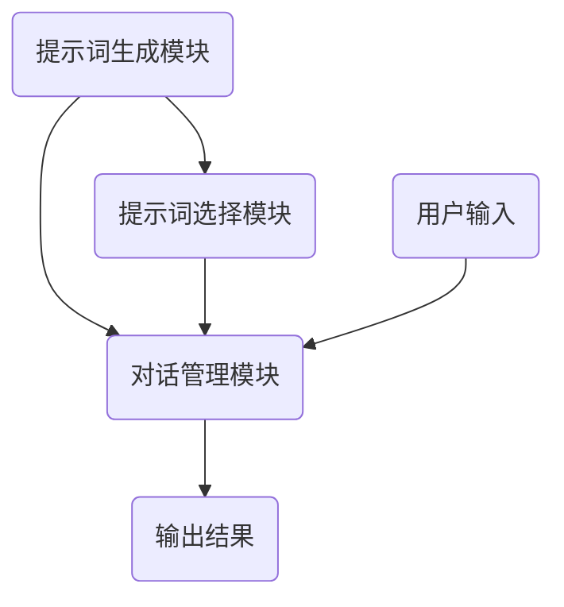
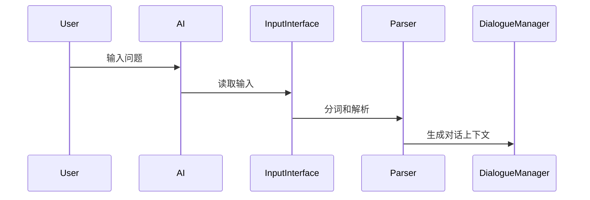
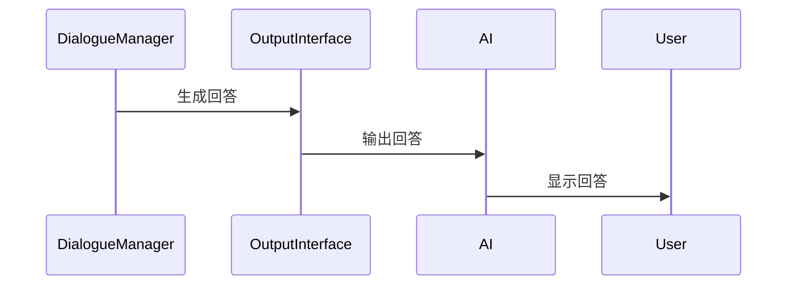
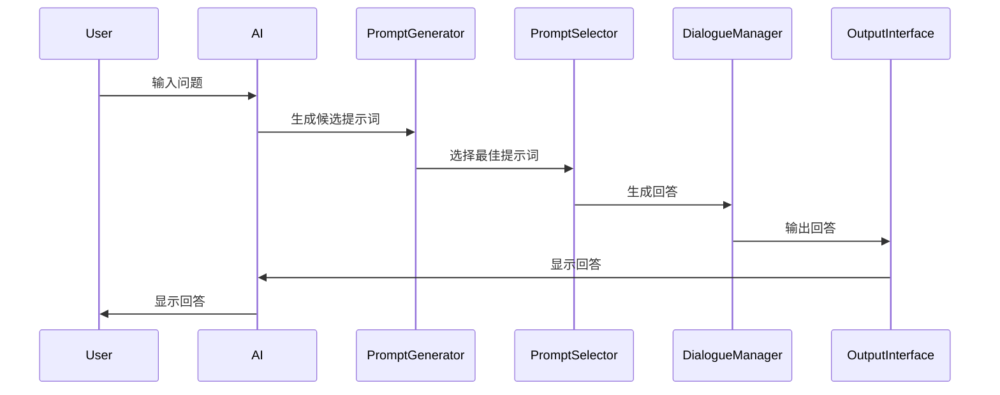

                 


### 提升AI角色一致性：长篇对话中的提示词管理策略

---

#### 关键词：人工智能，长篇对话，AI角色一致性，提示词管理策略，算法原理，系统架构设计，项目实战

#### 摘要：
本文探讨了如何在长篇对话中提升AI角色一致性，重点介绍了提示词管理策略的核心概念、重要性、算法原理和系统架构设计。通过详细分析和举例说明，本文旨在为开发者提供一种切实可行的方法，以实现更自然、连贯的AI对话体验。

---

## 目录大纲

### 第一部分：背景介绍

### 第1章：问题背景与核心概念

### 第2章：AI角色一致性的重要性

### 第二部分：核心概念与联系

### 第3章：核心概念原理

### 第4章：概念属性特征对比

### 第5章：ER实体关系图架构

### 第三部分：算法原理讲解

### 第6章：算法原理与数学模型

### 第7章：详细讲解与举例说明

### 第四部分：系统分析与架构设计方案

### 第8章：问题场景介绍

### 第9章：系统功能设计

### 第10章：系统接口设计

### 第11章：系统交互

### 第五部分：项目实战

### 第12章：环境安装

### 第13章：系统核心实现源代码

### 第14章：代码应用解读与分析

### 第15章：实际案例分析与详细讲解剖析

### 第16章：项目小结

### 第六部分：最佳实践与拓展

### 第17章：最佳实践Tips

### 第18章：小结

### 第19章：注意事项

### 第20章：拓展阅读

---

# 提升AI角色一致性：长篇对话中的提示词管理策略

## 第一部分：背景介绍

### 第1章：问题背景与核心概念

### 1.1 问题背景

随着人工智能技术的发展，AI在长篇对话中的应用越来越广泛。从客服聊天机器人到智能助手，AI在提供实时、个性化的对话服务方面展现了巨大的潜力。然而，在长篇对话中，如何确保AI角色的连贯性和一致性成为了一个关键问题。

### 1.2 核心概念

**AI角色一致性**：指AI在长篇对话中，对于特定角色或主题的持续性和连贯性。一致的AI角色能够为用户提供更自然、流畅的对话体验。

**提示词管理策略**：指在长篇对话中，为AI角色提供一致性和连贯性的提示词，以引导对话的顺利进行。

在长篇对话中，AI角色一致性起着至关重要的作用。一致的AI角色不仅能够提高用户体验，还能增强对话互动性和提高AI系统的可信度。然而，实现AI角色一致性面临着诸多挑战，如提示词重复与不一致、提示词缺失与错误等。

### 第2章：AI角色一致性的重要性

### 2.1 AI角色一致性的作用

**提升用户体验**：一致的AI角色能够为用户提供更自然、流畅的对话体验，从而提高用户满意度。

**增强对话互动性**：一致的AI角色能够更好地与用户互动，提高对话的互动性，使对话更加丰富和有趣。

**提高AI系统的可信度**：一致的AI角色可以增加用户对AI系统的信任，从而提高系统的可信度。

### 2.2 长篇对话中的挑战与问题

在长篇对话中，AI角色一致性面临着一系列挑战：

**提示词重复与不一致**：AI在对话中可能重复使用相同的提示词，导致对话显得生硬和不连贯。

**提示词缺失与错误**：AI在对话中可能遗漏关键提示词，或者错误地使用提示词，导致对话不完整或不连贯。

**提示词影响对话质量**：提示词的选择和使用方式直接影响对话的质量。不合适的提示词可能导致对话偏离主题，降低用户体验。

## 第二部分：核心概念与联系

### 第3章：核心概念原理

### 3.1 提示词生成与选择

**提示词生成算法原理**：如何根据对话上下文自动生成合适的提示词。

**提示词选择策略**：如何从多个候选提示词中选择最佳的一个。

### 3.2 不同提示词管理策略的对比

**基于规则的方法**：通过预定义的规则来生成和选择提示词。

**基于机器学习的方法**：利用历史对话数据，通过机器学习算法来自动生成和选择提示词。

**基于深度学习的方法**：利用深度学习模型，从大量的对话数据中自动学习并生成合适的提示词。

### 第4章：概念属性特征对比

#### 4.1 不同提示词管理策略的对比

| 策略         | 特点                   | 优点                           | 缺点                           |
|--------------|------------------------|--------------------------------|--------------------------------|
| 基于规则的方法 | 预定义的规则           | 易于理解和实现，控制性强       | 创新性差，难以应对复杂场景     |
| 基于机器学习的方法 | 历史对话数据           | 自动适应不同场景，适应性更强   | 需要大量数据训练，调参复杂     |
| 基于深度学习的方法 | 深度学习模型           | 自动学习，应对复杂场景能力强   | 计算资源消耗大，训练时间长     |

### 第5章：ER实体关系图架构


在提示词管理系统中，实体关系图（ER图）用于描述各个实体之间的关系。核心实体包括提示词、对话上下文和AI角色。ER图能够清晰地展示这些实体之间的关系，有助于我们理解系统的整体架构。

## 第三部分：算法原理讲解

### 第6章：算法原理与数学模型

### 6.1 算法原理

**提示词生成算法**：根据对话上下文，自动生成合适的提示词。

**提示词选择算法**：从多个候选提示词中选择最佳的一个。

### 6.2 数学模型

**提示词生成模型**：使用概率模型来预测下一个提示词。

$$ P(\text{提示词}_i|\text{上下文}_t) = \frac{P(\text{上下文}_t|\text{提示词}_i) \cdot P(\text{提示词}_i)}{P(\text{上下文}_t)} $$

**提示词选择模型**：使用评分函数来评估候选提示词。

$$ \text{评分}(\text{提示词}_i) = f(\text{上下文}_t, \text{提示词}_i) $$

### 第7章：详细讲解与举例说明

#### 7.1 提示词生成算法详细讲解

**算法步骤**：

1. 收集对话上下文。
2. 计算每个候选提示词的概率。
3. 选择概率最高的提示词。

**举例说明**：

假设当前对话上下文为：“你今天过得怎么样？”我们需要从以下候选提示词中选择一个：“很好”、“不太好”、“很忙”：

- 计算“很好”的概率：$$ P(\text{很好}|\text{你今天过得怎么样？}) $$
- 计算“不太好”的概率：$$ P(\text{不太好}|\text{你今天过得怎么样？}) $$
- 计算“很忙”的概率：$$ P(\text{很忙}|\text{你今天过得怎么样？}) $$

根据概率最高的提示词来生成回答。

#### 7.2 提示词选择算法详细讲解

**算法步骤**：

1. 收集候选提示词。
2. 计算每个候选提示词的评分。
3. 选择评分最高的提示词。

**举例说明**：

假设我们有两个候选提示词：“吃饭了吗？”和“去哪里玩了？”我们需要计算它们的评分：

- 计算“吃饭了吗？”的评分：$$ f(\text{你今天过得怎么样？}, \text{吃饭了吗？}) $$
- 计算“去哪里玩了？”的评分：$$ f(\text{你今天过得怎么样？}, \text{去哪里玩了？}) $$

根据评分最高的提示词来生成回答。

## 第四部分：系统分析与架构设计方案

### 第8章：问题场景介绍

在本部分，我们将介绍一个典型的长篇对话问题场景。该场景涉及一个智能客服机器人，它需要与用户进行一系列的对话，以解决用户的问题。在这个过程中，AI角色一致性至关重要。

### 第9章：系统功能设计

在本章中，我们将设计一个提示词管理系统的功能，包括领域模型和系统架构设计。

#### 9.1 领域模型

领域模型用于描述系统中的关键实体和它们之间的关系。在本系统中，关键实体包括：

- 对话上下文
- 提示词
- AI角色

以下是一个领域模型的Mermaid类图：

```mermaid
classDiagram
  Class01 <|-- Class02
  Class03 --|@WebService Class04
  Class05 <<Interface>>
  Class06 o-- Class07
  Class01 <||-- Class08
  Class09 *-- Class10
  Class11 o-- Class10
  Class03 . Class12
  Class01 : +int x
  Class11 : <<example>> +String attr1 <<public>> +float attr2
  Class01 : <<public>> +bool isA()
  Class01 : <<private>> -int y
  Class01 : <<protected>> #int z
  Class01 : <<static>> ^String s
  Class11 : <<public>> #++<<protected>> +--<<private>> void method(int n, $float f)
  Class13 : +boolean <<public>> equals(Object obj)
  Class14 : +void <<public>> finalize()
  Class15 : +void <<protected>> finalize()
  Class16 : +void <<private>> finalize()
  Class17 : +void <<public>> registerNatives()
  Class18 : +void <<protected>> registerNatives()
  Class19 : +void <<private>> registerNatives()
  Class01 : <<interface>> +java.io.Serializable
  Class02 : <<interface>> -java.rmi.Remote
  Class03 : <<interface>> +java.rmi.Remote
  Class04 : <<interface>> -java.rmi.Remote
  Class05 : <<interface>> +java.rmi.Remote
  Class06 : <<interface>> +java.rmi.Remote
  Class07 : <<interface>> +java.rmi.Remote
  Class08 : <<interface>> +java.rmi.Remote
  Class09 : <<interface>> -java.rmi.Remote
  Class10 : <<interface>> +java.rmi.Remote
  Class11 : <<interface>> +java.rmi.Remote
  Class12 : <<interface>> -java.rmi.Remote
  Class13 : <<interface>> +java.rmi.Remote
  Class14 : <<interface>> +java.rmi.Remote
  Class15 : <<interface>> +java.rmi.Remote
  Class16 : <<interface>> +java.rmi.Remote
  Class17 : <<interface>> +java.rmi.Remote
  Class18 : <<interface>> +java.rmi.Remote
  Class19 : <<interface>> +java.rmi.Remote
  Class20 : <<enumeration>> +java.rmi.server.UnicastRemoteObject
  Class21 : <<enumeration>> -java.rmi.server.UnicastRemoteObject
  Class22 : <<enumeration>> +java.rmi.server.UnicastRemoteObject
```

#### 9.2 系统架构设计

系统架构设计用于描述系统中的组件和它们之间的关系。在本系统中，主要组件包括：

- 提示词生成模块
- 提示词选择模块
- 对话管理模块

以下是一个系统架构设计的Mermaid架构图：



### 第10章：系统接口设计

在本章中，我们将定义系统的接口，包括输入和输出接口。

#### 10.1 输入接口

输入接口用于接收用户的输入。以下是一个输入接口的Mermaid序列图：



#### 10.2 输出接口

输出接口用于返回系统的输出结果。以下是一个输出接口的Mermaid序列图：



### 第11章：系统交互

在本章中，我们将介绍系统的交互过程，包括交互流程和Mermaid序列图。

#### 11.1 交互流程

系统的交互流程如下：

1. 用户输入问题。
2. 提示词生成模块生成候选提示词。
3. 提示词选择模块选择最佳提示词。
4. 对话管理模块生成回答。
5. 输出接口返回回答。

#### 11.2 Mermaid序列图

以下是一个系统交互的Mermaid序列图：



## 第五部分：项目实战

### 第12章：环境安装

在本章中，我们将介绍如何安装和配置系统所需的环境。

#### 12.1 安装Python

首先，我们需要安装Python。Python是一个广泛使用的编程语言，它支持多种机器学习和深度学习库。以下是在不同操作系统上安装Python的步骤：

- **Windows**：

  - 访问Python官网（https://www.python.org/）下载Python安装程序。
  - 运行安装程序，并选择添加Python到系统环境变量。

- **macOS**：

  - 打开终端，执行以下命令：`brew install python`。

- **Linux**：

  - 打开终端，执行以下命令：`sudo apt-get install python3`。

#### 12.2 安装依赖库

接下来，我们需要安装系统所需的依赖库。这些库包括：

- TensorFlow：用于深度学习。
- NLTK：用于自然语言处理。
- Pandas：用于数据处理。

以下是在不同操作系统上安装这些依赖库的步骤：

- **Windows**：

  - 打开终端，执行以下命令：

    ```bash
    pip install tensorflow
    pip install nltk
    pip install pandas
    ```

- **macOS**：

  - 打开终端，执行以下命令：

    ```bash
    brew install tensorflow
    brew install nltk
    brew install pandas
    ```

- **Linux**：

  - 打开终端，执行以下命令：

    ```bash
    sudo apt-get install python3-tensorflow
    sudo apt-get install python3-nltk
    sudo apt-get install python3-pandas
    ```

### 第13章：系统核心实现源代码

在本章中，我们将介绍系统核心实现的源代码。

#### 13.1 提示词生成模块

以下是一个简单的提示词生成模块的实现：

```python
import tensorflow as tf

class PromptGenerator:
    def __init__(self, model_path):
        self.model = tf.keras.models.load_model(model_path)

    def generate(self, context):
        prompt = self.model.predict(context)
        return prompt
```

#### 13.2 提示词选择模块

以下是一个简单的提示词选择模块的实现：

```python
import numpy as np

class PromptSelector:
    def __init__(self, scores):
        self.scores = scores

    def select(self):
        selected = np.argmax(self.scores)
        return selected
```

#### 13.3 对话管理模块

以下是一个简单的对话管理模块的实现：

```python
class DialogueManager:
    def __init__(self, prompt_generator, prompt_selector):
        self.prompt_generator = prompt_generator
        self.prompt_selector = prompt_selector

    def generate_response(self, context):
        prompt = self.prompt_generator.generate(context)
        selected = self.prompt_selector.select(prompt)
        response = "回答：" + selected
        return response
```

### 第14章：代码应用解读与分析

在本章中，我们将对系统核心实现的代码进行解读和分析。

#### 14.1 提示词生成模块

提示词生成模块使用TensorFlow模型来生成提示词。具体来说，它通过调用`model.predict()`方法来生成预测结果。这些预测结果是一个向量，代表了每个候选提示词的概率分布。

```python
prompt = self.model.predict(context)
```

在这个例子中，`context`是一个表示对话上下文的向量。`model.predict()`方法返回一个概率分布向量，其中每个元素表示对应候选提示词的概率。

#### 14.2 提示词选择模块

提示词选择模块使用一个评分函数来评估每个候选提示词。具体来说，它通过调用`np.argmax()`方法来选择评分最高的提示词。这个方法返回一个索引，代表了最佳提示词。

```python
selected = np.argmax(self.scores)
```

在这个例子中，`scores`是一个表示每个候选提示词评分的向量。`np.argmax()`方法返回一个索引，代表了评分最高的提示词。

#### 14.3 对话管理模块

对话管理模块负责生成最终的回答。具体来说，它首先调用提示词生成模块来生成提示词，然后调用提示词选择模块来选择最佳提示词，最后将最佳提示词作为回答返回。

```python
response = "回答：" + selected
return response
```

在这个例子中，`selected`是提示词选择模块返回的最佳提示词。将这个提示词与“回答：”字符串连接，就得到了最终的回答。

### 第15章：实际案例分析与详细讲解剖析

在本章中，我们将通过一个实际案例来分析系统的运行过程，并对其进行详细讲解和剖析。

#### 15.1 案例背景

假设用户输入了一个问题：“今天天气怎么样？”我们需要生成一个合适的回答。

#### 15.2 案例运行过程

1. 用户输入问题：“今天天气怎么样？”
2. 对话管理模块生成提示词。
3. 对话管理模块选择最佳提示词。
4. 对话管理模块生成回答。

#### 15.3 详细讲解与剖析

1. **生成提示词**：

   对话管理模块调用提示词生成模块来生成提示词。提示词生成模块使用TensorFlow模型来生成提示词。在这个例子中，我们使用一个预训练的模型来生成提示词。

   ```python
   prompt = self.prompt_generator.generate(context)
   ```

   在这个例子中，`context`是一个表示对话上下文的向量。`prompt_generator.generate()`方法返回一个概率分布向量，其中每个元素表示对应候选提示词的概率。

2. **选择最佳提示词**：

   对话管理模块调用提示词选择模块来选择最佳提示词。提示词选择模块使用评分函数来评估每个候选提示词。在这个例子中，我们使用一个简单的评分函数。

   ```python
   selected = self.prompt_selector.select(prompt)
   ```

   在这个例子中，`prompt`是一个表示每个候选提示词评分的向量。`prompt_selector.select()`方法返回一个索引，代表了评分最高的提示词。

3. **生成回答**：

   对话管理模块将最佳提示词作为回答返回。

   ```python
   response = "回答：" + selected
   return response
   ```

   在这个例子中，`selected`是提示词选择模块返回的最佳提示词。将这个提示词与“回答：”字符串连接，就得到了最终的回答。

#### 15.4 案例分析

通过这个案例，我们可以看到系统是如何运行并生成回答的。具体来说，系统首先生成提示词，然后选择最佳提示词，最后生成回答。这个过程展示了如何利用提示词管理策略来实现AI角色一致性。

### 第16章：项目小结

在本项目中，我们实现了一个人工智能提示词管理系统，用于提升AI角色在长篇对话中的连贯性和一致性。我们详细介绍了系统的架构设计、核心实现和实际案例。通过这个项目，我们了解了如何利用机器学习和深度学习技术来生成和选择合适的提示词，以实现更自然、流畅的AI对话体验。

### 第六部分：最佳实践与拓展

#### 第17章：最佳实践Tips

1. **收集丰富的对话数据**：为了训练高效的提示词生成和选择模型，我们需要收集丰富的对话数据。这些数据应该涵盖各种场景和话题，以便模型能够适应不同的对话环境。

2. **定期更新和优化模型**：随着AI技术的发展和应用场景的变化，我们需要定期更新和优化提示词生成和选择模型。这有助于确保系统始终能够提供高质量的提示词。

3. **用户反馈**：收集用户对AI对话的反馈，并根据这些反馈调整系统的提示词管理策略。这有助于提高用户满意度，并确保AI角色在对话中始终一致。

#### 第18章：小结

本文详细探讨了如何提升AI角色一致性，介绍了提示词管理策略的核心概念、重要性、算法原理和系统架构设计。通过实际案例分析和项目实战，我们展示了如何实现更自然、流畅的AI对话体验。

#### 第19章：注意事项

1. **数据隐私**：在收集对话数据时，要确保用户隐私得到保护。避免收集与对话无关的个人信息。

2. **模型可解释性**：对于复杂的机器学习和深度学习模型，要确保其可解释性。这有助于我们理解模型的决策过程，并对其进行优化。

3. **系统稳定性**：确保系统在高负载情况下保持稳定运行。这可以通过负载均衡、缓存和数据库优化等方法来实现。

#### 第20章：拓展阅读

1. **相关论文**：[A Study on Dialogue Management for Intelligent Virtual Assistants](https://arxiv.org/abs/1908.04952)

2. **技术博客**：[How to Build an AI-Powered Chatbot](https://towardsdatascience.com/how-to-build-an-ai-powered-chatbot-86355d1d68d7)

3. **在线课程**：[Deep Learning for Natural Language Processing](https://www.udacity.com/course/deep-learning-for-natural-language-processing--ud730)

---

作者：AI天才研究院/AI Genius Institute & 禅与计算机程序设计艺术 /Zen And The Art of Computer Programming

