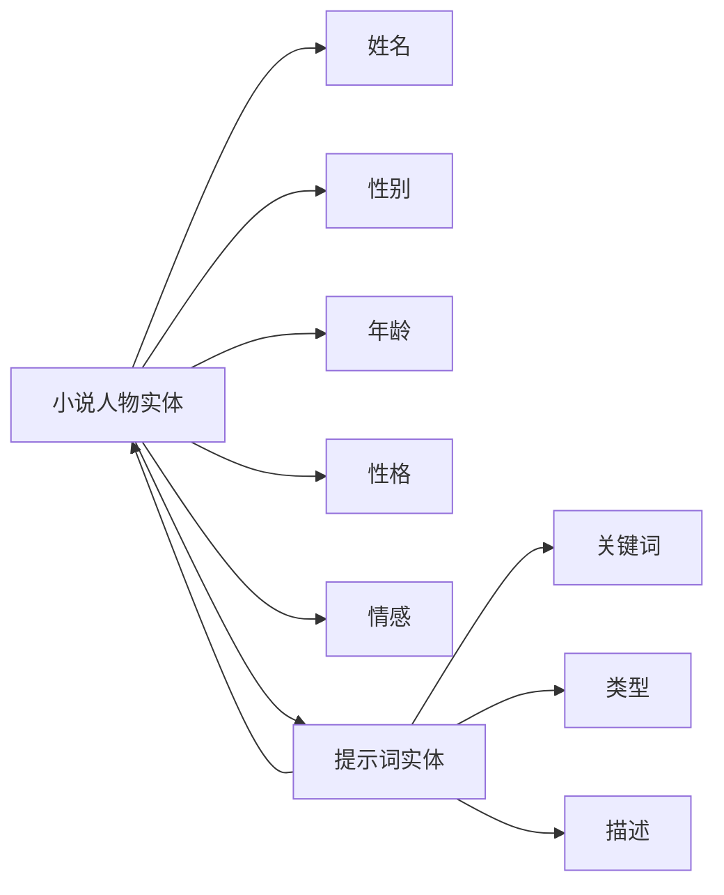
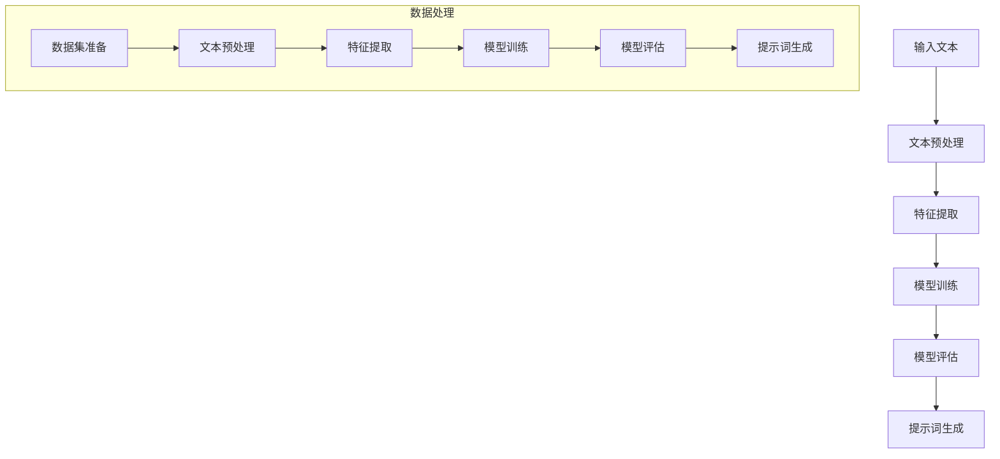
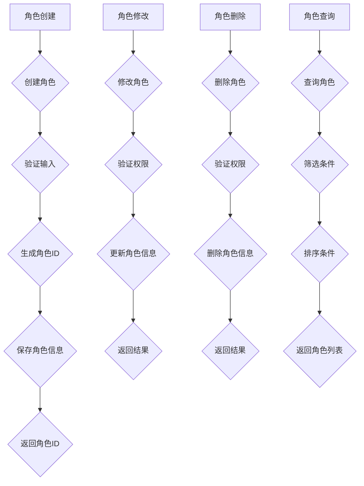
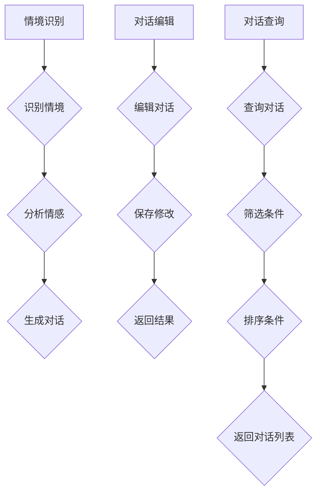
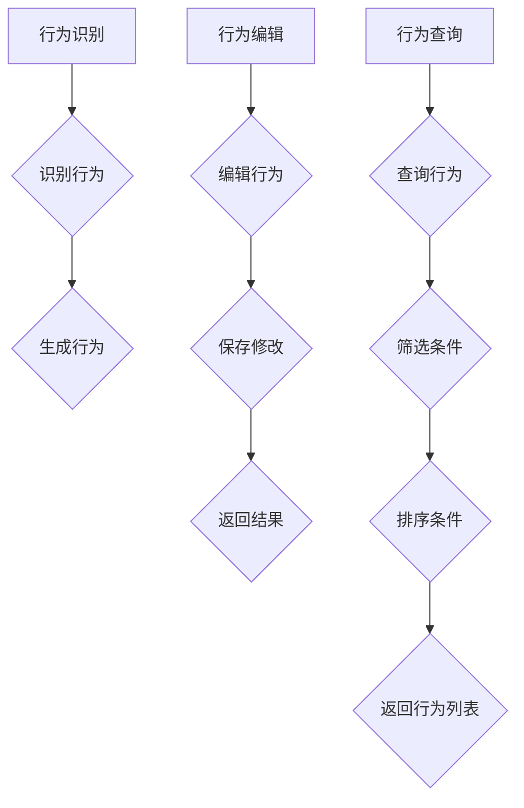
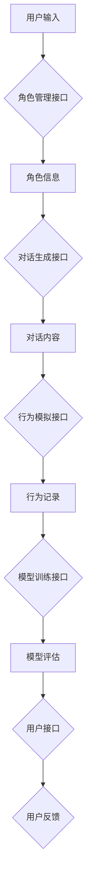
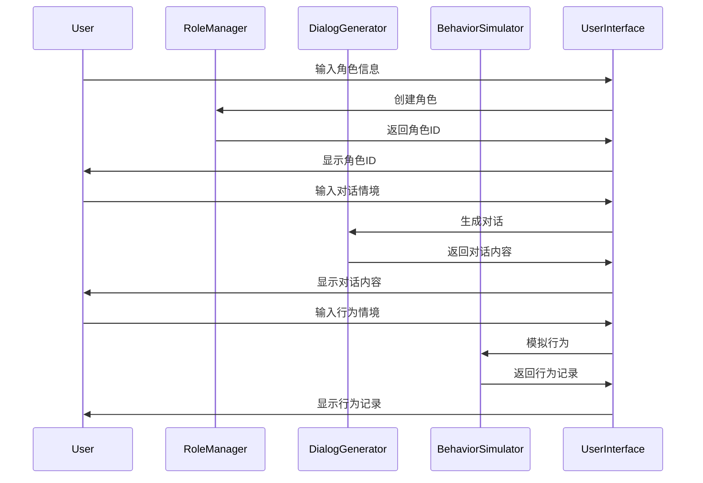

                 


### 第一部分: AI角色塑造概述

#### 1.1 问题背景

在人工智能领域，角色塑造一直是研究的重点之一。随着机器学习、深度学习等技术的不断发展，AI角色塑造也日益成熟。然而，如何设计出富有深度和个性的AI角色，仍然是许多研究者面临的一大挑战。小说人物深度刻画作为一种艺术创作手法，通过对人物性格、行为、心理等多方面的细腻描绘，使人物形象更加立体和真实。因此，研究如何借鉴小说人物深度刻画的方法，提升AI角色的塑造能力，具有重要的理论和实践价值。

在本节中，我们将首先介绍AI角色塑造的重要性，探讨小说人物深度刻画的需求，并阐述提示词设计在这一过程中的关键作用。

#### 1.1.1 AI角色塑造的重要性

AI角色塑造在虚拟世界中的应用越来越广泛，从游戏、影视到智能客服、虚拟助手，AI角色的表现直接影响到用户体验。一个富有个性、情感丰富的AI角色，不仅能够提高用户的沉浸感，还能与用户建立更深层次的情感联系。例如，在智能客服中，一个具备高度拟人化的角色可以更好地理解用户的情绪，提供个性化的服务；在虚拟现实中，一个生动有趣的AI角色可以吸引更多的用户参与互动。

此外，AI角色塑造也是人工智能技术发展的重要方向之一。随着人工智能技术的不断进步，AI角色将逐渐从简单的任务执行者转变为具有自主意识、情感和创造力的个体。这不仅可以推动人工智能技术的发展，也为未来的智能社会提供了更多可能性。

#### 1.1.2 小说人物深度刻画的需求

小说人物深度刻画是文学创作中的一项重要技能。通过细腻的心理描写、生动的行为刻画和丰富的情感表达，小说人物得以从纸上跃然而出，成为读者心中的鲜活个体。在AI角色塑造中，借鉴小说人物深度刻画的方法，有助于提升AI角色的表现力。

首先，小说人物深度刻画强调个性化和差异化。每个小说人物都有自己独特的性格、经历和价值观，这使得他们各具特色，难以被取代。在AI角色塑造中，我们希望AI角色也能拥有独特的个性和特点，避免千篇一律的机械式反应。

其次，小说人物深度刻画注重情感表达。小说人物的情感波动、心理活动往往能够引起读者的共鸣。在AI角色塑造中，通过模拟情感表达，可以使AI角色更加贴近人类的情感体验，增强用户与AI角色的互动体验。

最后，小说人物深度刻画要求细致入微的描写。通过对人物动作、语言、表情等细节的描绘，小说人物得以展现其内心的丰富和复杂。在AI角色塑造中，同样需要通过细节的刻画，使AI角色更具真实感和立体感。

#### 1.1.3 提示词设计的作用

提示词设计在AI角色塑造中起到了桥梁的作用。通过设定特定的提示词，可以引导AI角色在特定情境下表现出符合人物设定的行为和情感。提示词的设计不仅需要考虑人物的性格特点，还要结合具体的情境和目标，以达到最佳的效果。

首先，提示词可以帮助AI角色在对话中表现得更自然。例如，在智能客服中，通过设定不同的提示词，可以引导AI角色在不同的情况下使用不同的语言风格，从而提升用户满意度。

其次，提示词可以引导AI角色在特定情境下做出符合人物设定的决策。例如，在虚拟现实中，通过设定提示词，可以引导AI角色在面对特定挑战时表现出勇敢、聪明等特质，从而提升用户的游戏体验。

最后，提示词设计还可以帮助AI角色更好地适应不同的文化和背景。通过设定文化相关的提示词，可以使AI角色在不同文化背景下表现出更符合当地习俗和价值观的行为。

#### 1.2 核心概念与联系

在本节中，我们将详细阐述AI角色塑造的基本原理和特点，以及小说人物深度刻画的关键要素。同时，我们还将介绍提示词设计的基本原则，并使用表格和ER实体关系图展示概念之间的联系。

##### 1.2.1 AI角色塑造的基本原理

AI角色塑造的基本原理主要基于机器学习和深度学习技术。通过训练大量的文本数据，AI可以学会理解并模拟人类角色的行为和情感。具体来说，AI角色塑造包括以下几个步骤：

1. **数据收集与预处理**：收集大量与角色相关的文本数据，并进行预处理，如分词、去停用词、词向量化等。
2. **特征提取**：从预处理后的文本数据中提取特征，如词频、词向量等。
3. **模型训练**：使用提取的特征训练机器学习模型，如循环神经网络（RNN）、卷积神经网络（CNN）等。
4. **模型评估与优化**：通过评估模型在测试数据上的表现，不断调整模型参数，以提高模型性能。
5. **角色行为生成**：基于训练好的模型，生成符合角色设定和行为模式的文本或行为。

##### 1.2.1.1 AI角色塑造的定义

AI角色塑造是指利用人工智能技术，创建具有个性、情感和自主决策能力的虚拟角色。这些角色可以应用于游戏、影视、智能客服、虚拟现实等多个领域。

##### 1.2.1.2 AI角色塑造的特点

1. **个性化和差异化**：每个AI角色都有其独特的个性和特点，避免千篇一律。
2. **情感表达**：AI角色能够模拟人类的情感表达，如喜怒哀乐等。
3. **自主决策**：AI角色可以根据环境和目标自主做出决策，具有一定的自主意识。

##### 1.2.1.3 AI角色塑造与传统角色塑造的区别

与传统角色塑造相比，AI角色塑造具有以下区别：

1. **数据驱动**：AI角色塑造基于大量数据训练，而传统角色塑造更多依赖创作者的想象力和创造力。
2. **自动化**：AI角色塑造可以通过算法自动生成，而传统角色塑造更多依赖于人工创作。
3. **自适应**：AI角色可以根据用户反馈和环境变化自适应地调整行为和情感。

##### 1.2.2 小说人物深度刻画

小说人物深度刻画是指通过细腻的描写，使小说人物形象更加立体和真实。深度刻画的关键要素包括：

1. **性格描写**：通过对人物性格的详细描写，使人物形象更加鲜明。
2. **情感描写**：通过描写人物的情感波动和心理活动，使人物更具真实感。
3. **行为描写**：通过对人物行为的描写，展现人物的性格和价值观。
4. **环境描写**：通过环境描写，强化人物性格和情感。

##### 1.2.2.1 小说人物深度刻画的概念

小说人物深度刻画是指通过对人物性格、行为、情感等多方面的细腻描绘，使人物形象更加立体和真实。

##### 1.2.2.2 深度刻画的关键要素

1. **性格描写**：通过描写人物的性格特点，如勇敢、善良、自私等。
2. **情感描写**：通过描写人物的情感波动，如喜悦、悲伤、愤怒等。
3. **行为描写**：通过描写人物的行为举止，如走路、说话、动作等。
4. **环境描写**：通过描写人物所处的环境，如家庭、社会等。

##### 1.2.3 提示词设计

提示词设计是指为AI角色塑造提供特定的关键词或短语，以引导AI角色在特定情境下表现出符合人物设定的行为和情感。

##### 1.2.3.1 提示词的定义

提示词是指用于引导AI角色行为和情感的关键词或短语。

##### 1.2.3.2 提示词的作用

1. **行为引导**：提示词可以引导AI角色在特定情境下表现出符合人物设定的行为。
2. **情感引导**：提示词可以引导AI角色在特定情境下表现出符合人物设定的情感。
3. **情境构建**：提示词可以用于构建特定的情境，以增强AI角色的表现力。

##### 1.2.3.3 提示词的设计原则

1. **符合人物设定**：提示词应与人物的性格、情感和行为相符。
2. **多样化**：提示词应多样化，以适应不同的情境和需求。
3. **可扩展性**：提示词应具有可扩展性，以便在未来添加新的提示词。

##### 1.2.4 ER实体关系图

在本节中，我们将使用ER实体关系图展示AI角色塑造、小说人物深度刻画和提示词设计之间的关系。

###### 1.2.4.1 小说人物实体

小说人物实体包括以下属性：

1. **姓名**：人物的名称。
2. **性别**：人物的性别。
3. **年龄**：人物的年龄。
4. **性格**：人物的性格特点。
5. **情感**：人物的情感状态。

###### 1.2.4.2 提示词实体

提示词实体包括以下属性：

1. **关键词**：提示词的名称。
2. **类型**：提示词的类型，如行为提示词、情感提示词等。
3. **描述**：提示词的描述。

###### 1.2.4.3 两者关系

小说人物实体与提示词实体之间存在关联关系。每个小说人物可以拥有多个提示词，而每个提示词也可以与多个小说人物相关联。

### 1.3 本章小结

在本章中，我们介绍了AI角色塑造的重要性、小说人物深度刻画的需求以及提示词设计的作用。通过阐述AI角色塑造的基本原理、小说人物深度刻画的关键要素和提示词设计的基本原则，我们为后续章节的深入探讨奠定了基础。在接下来的章节中，我们将进一步探讨AI角色塑造算法的原理、系统分析与架构设计，以及实际项目实战，以期提升AI角色的塑造能力。

### 目录大纲

----------------------------------------------------------------
# 第一部分: AI角色塑造概述

## 1.1 问题背景
### 1.1.1 AI角色塑造的重要性
### 1.1.2 小说人物深度刻画的需求
### 1.1.3 提示词设计的作用

## 1.2 核心概念与联系
### 1.2.1 AI角色塑造的基本原理
#### 1.2.1.1 AI角色塑造的定义
#### 1.2.1.2 AI角色塑造的特点
#### 1.2.1.3 AI角色塑造与传统角色塑造的区别
### 1.2.2 小说人物深度刻画
#### 1.2.2.1 小说人物深度刻画的概念
#### 1.2.2.2 深度刻画的关键要素
### 1.2.3 提示词设计
#### 1.2.3.1 提示词的定义
#### 1.2.3.2 提示词的作用
#### 1.2.3.3 提示词的设计原则

## 1.3 ER实体关系图
### 1.3.1 小说人物实体
### 1.3.2 提示词实体
### 1.3.3 两者关系

## 1.4 本章小结

----------------------------------------------------------------

## 1.2 核心概念与联系

在理解AI角色塑造和小说人物深度刻画的基础上，本节将进一步探讨这两个核心概念之间的联系，以及与提示词设计的关系。

### 1.2.1 AI角色塑造的基本原理

AI角色塑造是一种利用人工智能技术，创建具有个性、情感和自主决策能力的虚拟角色的过程。其基本原理主要涉及以下几个方面：

1. **数据驱动**：AI角色塑造依赖于大量与角色相关的数据，包括文本、图像、声音等多媒体数据。这些数据用于训练模型，使其能够理解并模拟人类角色的行为和情感。
   
2. **机器学习和深度学习**：AI角色塑造的核心技术是机器学习和深度学习。通过训练神经网络模型，可以提取角色特征，并生成符合角色设定的行为和对话。

3. **多模态学习**：AI角色塑造不仅关注文本数据，还涉及图像、声音等多种模态的数据。这种多模态学习有助于构建更加立体和真实的虚拟角色。

4. **自然语言处理**：自然语言处理（NLP）技术在AI角色塑造中发挥着重要作用。通过NLP技术，AI可以理解和生成自然语言，从而与人类进行更加自然的交互。

#### 1.2.1.1 AI角色塑造的定义

AI角色塑造是指通过人工智能技术，创建具有个性和情感特征的虚拟角色。这些角色可以应用于游戏、虚拟现实、智能客服等领域。

#### 1.2.1.2 AI角色塑造的特点

1. **个性化和差异化**：每个AI角色都有其独特的个性和特点，避免机械式的重复。
2. **情感表达**：AI角色能够模拟人类的情感表达，如喜怒哀乐等。
3. **自主决策**：AI角色可以根据环境和目标，自主做出决策。

#### 1.2.1.3 AI角色塑造与传统角色塑造的区别

与传统角色塑造相比，AI角色塑造具有以下区别：

1. **自动化**：AI角色塑造依赖于机器学习和深度学习算法，可以实现自动化生成。
2. **数据驱动**：AI角色塑造依赖于大量数据，而传统角色塑造更多依赖创作者的想象力。
3. **实时性**：AI角色可以实时地根据环境和用户反馈调整行为和情感，而传统角色塑造通常是一次性的创作。

### 1.2.2 小说人物深度刻画

小说人物深度刻画是一种文学创作技巧，通过细致的描写使人物形象更加立体和真实。深度刻画的关键要素包括：

1. **性格描写**：通过对人物性格的详细描写，如勇敢、善良、自私等。
2. **情感描写**：通过描写人物的情感波动，如喜悦、悲伤、愤怒等。
3. **行为描写**：通过对人物行为的描写，如走路、说话、动作等。
4. **环境描写**：通过描写人物所处的环境，如家庭、社会等。

#### 1.2.2.1 小说人物深度刻画的概念

小说人物深度刻画是指通过对人物性格、情感、行为等多方面的细腻描绘，使人物形象更加立体和真实。

#### 1.2.2.2 深度刻画的关键要素

1. **性格描写**：通过描写人物的性格特点，如勇敢、善良、自私等。
2. **情感描写**：通过描写人物的情感波动，如喜悦、悲伤、愤怒等。
3. **行为描写**：通过对人物行为的描写，如走路、说话、动作等。
4. **环境描写**：通过描写人物所处的环境，如家庭、社会等。

### 1.2.3 提示词设计

提示词设计是AI角色塑造中的一项重要技术，它通过提供关键词或短语，引导AI角色在特定情境下表现出符合人物设定的行为和情感。

#### 1.2.3.1 提示词的定义

提示词是指用于引导AI角色行为和情感的关键词或短语。

#### 1.2.3.2 提示词的作用

1. **行为引导**：提示词可以引导AI角色在特定情境下表现出符合人物设定的行为。
2. **情感引导**：提示词可以引导AI角色在特定情境下表现出符合人物设定的情感。
3. **情境构建**：提示词可以用于构建特定的情境，以增强AI角色的表现力。

#### 1.2.3.3 提示词的设计原则

1. **符合人物设定**：提示词应与人物的性格、情感和行为相符。
2. **多样化**：提示词应多样化，以适应不同的情境和需求。
3. **可扩展性**：提示词应具有可扩展性，以便在未来添加新的提示词。

### 1.2.4 ER实体关系图

在本节中，我们将使用ER实体关系图展示AI角色塑造、小说人物深度刻画和提示词设计之间的关系。

#### 1.2.4.1 小说人物实体

小说人物实体包括以下属性：

1. **姓名**：人物的名称。
2. **性别**：人物的性别。
3. **年龄**：人物的年龄。
4. **性格**：人物的性格特点。
5. **情感**：人物的情感状态。

#### 1.2.4.2 提示词实体

提示词实体包括以下属性：

1. **关键词**：提示词的名称。
2. **类型**：提示词的类型，如行为提示词、情感提示词等。
3. **描述**：提示词的描述。

#### 1.2.4.3 两者关系

小说人物实体与提示词实体之间存在关联关系。每个小说人物可以拥有多个提示词，而每个提示词也可以与多个小说人物相关联。



通过ER实体关系图，我们可以清晰地看到小说人物实体和提示词实体之间的联系。这种关系不仅有助于我们理解AI角色塑造和小说人物深度刻画的概念，也为后续的算法设计和系统实现提供了理论基础。

### 1.3 本章小结

在本章中，我们介绍了AI角色塑造和小说人物深度刻画的核心概念，并探讨了它们与提示词设计的关系。通过阐述AI角色塑造的基本原理、小说人物深度刻画的关键要素以及提示词设计的基本原则，我们为后续章节的深入探讨奠定了基础。在接下来的章节中，我们将进一步探讨AI角色塑造算法的原理、系统分析与架构设计，以及实际项目实战，以期提升AI角色的塑造能力。同时，我们还将通过具体的案例和代码示例，展示如何将理论应用到实践中，实现更加生动和真实的虚拟角色。

### 目录大纲

----------------------------------------------------------------
# 第一部分: AI角色塑造概述

## 1.1 问题背景
### 1.1.1 AI角色塑造的重要性
### 1.1.2 小说人物深度刻画的需求
### 1.1.3 提示词设计的作用

## 1.2 核心概念与联系
### 1.2.1 AI角色塑造的基本原理
#### 1.2.1.1 AI角色塑造的定义
#### 1.2.1.2 AI角色塑造的特点
#### 1.2.1.3 AI角色塑造与传统角色塑造的区别
### 1.2.2 小说人物深度刻画
#### 1.2.2.1 小说人物深度刻画的概念
#### 1.2.2.2 深度刻画的关键要素
### 1.2.3 提示词设计
#### 1.2.3.1 提示词的定义
#### 1.2.3.2 提示词的作用
#### 1.2.3.3 提示词的设计原则

## 1.3 ER实体关系图
### 1.3.1 小说人物实体
### 1.3.2 提示词实体
### 1.3.3 两者关系

## 1.4 本章小结

----------------------------------------------------------------

## 2.1 算法原理介绍

在深入探讨AI角色塑造的过程中，理解其背后的算法原理是至关重要的一步。AI角色塑造的核心在于如何通过机器学习和深度学习技术，使虚拟角色具备个性和情感，能够与人类进行自然互动。本节将介绍AI角色塑造中的常见算法，包括基于机器学习和深度学习的角色塑造方法，并探讨这些算法的基本原理。

### 2.1.1 基于机器学习的角色塑造

机器学习在AI角色塑造中的应用主要依赖于监督学习和无监督学习。监督学习通过大量标注数据进行训练，使模型能够识别和预测特定行为或情感。无监督学习则通过无标注数据，发现数据中的模式和结构。

#### 2.1.1.1 监督学习

监督学习在AI角色塑造中的应用主要体现在以下几个方面：

1. **行为预测**：通过历史行为数据，预测未来行为。例如，通过学习角色在不同情境下的行为，预测角色在新的情境下的行为。
   
2. **情感识别**：通过分析角色对话或行为，识别角色的情感状态。例如，通过分析语音或文本，识别角色是喜悦、悲伤还是愤怒。

3. **角色分类**：将角色分类为不同类型，如英雄、反派或平民。这有助于在游戏中根据角色类型进行任务分配或剧情设计。

#### 2.1.1.2 无监督学习

无监督学习在AI角色塑造中的应用主要体现在以下几个方面：

1. **角色聚类**：将相似的角色聚为一类，以便进行统一处理。例如，在游戏中将相似的角色放在同一场景或任务中。

2. **角色生成**：通过生成新的角色数据，扩展角色库。例如，通过生成新的角色形象或对话，丰富游戏或虚拟世界的多样性。

3. **行为模式识别**：通过分析大量无标注数据，识别角色可能的行为模式。例如，在智能客服中，识别用户可能的提问模式，以提供更个性化的服务。

### 2.1.2 基于深度学习的角色塑造

深度学习在AI角色塑造中的应用越来越广泛，主要因为其强大的表示学习和特征提取能力。深度学习模型能够自动提取数据中的复杂模式和结构，从而在角色塑造中发挥重要作用。

#### 2.1.2.1 卷积神经网络（CNN）

卷积神经网络（CNN）在图像识别和生成中具有出色的性能。在AI角色塑造中，CNN可以用于角色形象生成和特征提取。

1. **角色形象生成**：通过训练CNN模型，可以生成具有独特风格和特点的角色形象。例如，在游戏开发中，可以使用CNN生成不同类型的角色形象，以适应不同游戏场景。

2. **特征提取**：CNN可以从图像中提取丰富的特征，如颜色、纹理等。这些特征可以用于角色行为预测或情感识别。

#### 2.1.2.2 循环神经网络（RNN）

循环神经网络（RNN）在序列数据处理中具有优势，广泛应用于自然语言处理和语音识别。在AI角色塑造中，RNN可以用于角色对话生成和情感分析。

1. **角色对话生成**：通过训练RNN模型，可以生成符合角色设定的对话。例如，在智能客服中，RNN可以生成符合角色性格的回复，以提升用户体验。

2. **情感分析**：RNN可以分析角色对话中的情感信息，识别角色的情感状态。例如，在虚拟助手中，RNN可以识别用户情绪，并提供相应的情感反馈。

#### 2.1.2.3 生成对抗网络（GAN）

生成对抗网络（GAN）是一种强大的无监督学习模型，可以生成高质量的数据。在AI角色塑造中，GAN可以用于角色形象生成和对话生成。

1. **角色形象生成**：GAN可以通过生成器和判别器的对抗训练，生成具有真实感的角色形象。例如，在游戏开发中，GAN可以生成具有独特风格和特点的角色形象，以丰富游戏内容。

2. **对话生成**：GAN可以用于生成角色对话，使其更自然和连贯。例如，在虚拟助手中，GAN可以生成符合角色性格和情境的对话，以提升用户体验。

### 2.1.3 常见的角色塑造算法

除了上述提到的机器学习和深度学习算法外，还有一些常见的角色塑造算法在AI角色塑造中发挥着重要作用。

#### 2.1.3.1 强化学习

强化学习是一种通过试错学习的方式，使角色在特定环境中做出最优决策的方法。在AI角色塑造中，强化学习可以用于角色行为决策和策略学习。

1. **角色行为决策**：通过训练强化学习模型，角色可以学会在特定情境下做出最优行为决策。例如，在游戏开发中，角色可以学会如何在战斗中躲避敌人或攻击敌人。

2. **策略学习**：强化学习可以帮助角色学会一系列策略，以应对不同的环境和挑战。例如，在虚拟现实游戏中，角色可以学会如何探索环境、完成任务等。

#### 2.1.3.2 自然语言处理（NLP）

自然语言处理（NLP）技术在AI角色塑造中发挥着重要作用，主要用于角色对话生成和情感分析。

1. **角色对话生成**：NLP技术可以帮助角色生成自然、流畅的对话。例如，在智能客服中，NLP可以生成符合角色性格和情境的对话，以提升用户体验。

2. **情感分析**：NLP技术可以分析角色对话中的情感信息，识别角色的情感状态。例如，在虚拟助手中，NLP可以识别用户情绪，并提供相应的情感反馈。

### 2.1.4 小结

AI角色塑造算法的多样性和复杂性，为创建具有个性和情感的虚拟角色提供了丰富的工具和方法。从机器学习和深度学习的基本原理，到具体的算法应用，这些算法共同构成了AI角色塑造的核心技术。在接下来的章节中，我们将进一步探讨AI角色塑造算法的详细原理，并通过代码示例和实际案例，展示如何将这些算法应用于AI角色塑造的实际项目中。

### 目录大纲

----------------------------------------------------------------
# 第二部分: AI角色塑造算法原理

## 2.1 算法原理介绍
### 2.1.1 基于机器学习的角色塑造
#### 2.1.1.1 监督学习
#### 2.1.1.2 无监督学习
### 2.1.2 基于深度学习的角色塑造
#### 2.1.2.1 卷积神经网络（CNN）
#### 2.1.2.2 循环神经网络（RNN）
#### 2.1.2.3 生成对抗网络（GAN）
### 2.1.3 常见的角色塑造算法
#### 2.1.3.1 强化学习
#### 2.1.3.2 自然语言处理（NLP）

## 2.2 算法流程图
### 2.2.1 提示词生成算法流程

## 2.3 算法讲解
### 2.3.1 深度学习基础
#### 2.3.1.1 神经网络
#### 2.3.1.2 卷积神经网络（CNN）
#### 2.3.1.3 循环神经网络（RNN）
### 2.3.2 提示词生成算法
#### 2.3.2.1 基于GPT的提示词生成

## 2.4 算法示例
### 2.4.1 数据集准备
### 2.4.2 模型训练
### 2.4.3 提示词生成展示

## 2.5 本章小结

----------------------------------------------------------------

## 2.2 算法流程图

在深入了解AI角色塑造算法的过程中，理解算法的总体流程图是非常有帮助的。流程图可以帮助我们清晰地看到算法的各个步骤及其相互关系。在本节中，我们将使用mermaid语言绘制一个简化的AI角色塑造算法流程图，展示从文本预处理到提示词生成的完整过程。

### 2.2.1 提示词生成算法流程

以下是使用mermaid绘制的AI角色塑造算法流程图：



这个流程图包括以下几个主要步骤：

1. **数据集准备（G）**：收集和准备用于训练的文本数据集。这些数据集通常包括大量与角色相关的对话、文本描述等。

2. **文本预处理（H）**：对收集的文本数据进行预处理，包括分词、去停用词、词向量化等步骤。这一步是为了将原始文本转换为机器学习模型可以处理的形式。

3. **特征提取（I）**：从预处理后的文本数据中提取特征，如词频、词嵌入等。这些特征将用于训练模型。

4. **模型训练（J）**：使用提取的特征训练机器学习模型。深度学习模型如循环神经网络（RNN）、卷积神经网络（CNN）或生成对抗网络（GAN）都可以用于这一步骤。

5. **模型评估（K）**：评估训练好的模型在测试数据上的表现。通过调整模型参数和优化模型结构，可以提高模型性能。

6. **提示词生成（L）**：使用训练好的模型生成提示词。这些提示词可以引导AI角色在特定情境下表现出符合人物设定的行为和情感。

通过这个流程图，我们可以清晰地看到AI角色塑造算法的核心步骤和各个环节之间的关系。在接下来的章节中，我们将详细讲解每个步骤的具体实现过程，并通过代码示例和实际案例，进一步阐述这些算法的原理和应用。

### 2.3 算法讲解

#### 2.3.1 深度学习基础

深度学习是AI角色塑造算法的核心组成部分，理解深度学习的基础是掌握AI角色塑造的关键。深度学习通过多层神经网络模型，自动提取数据中的复杂模式和特征，从而实现图像识别、语音识别、自然语言处理等任务。

##### 2.3.1.1 神经网络

神经网络是深度学习的基础。一个简单的神经网络由输入层、隐藏层和输出层组成。每个层由多个神经元（或节点）组成，神经元之间通过权重连接。输入层接收外部输入，隐藏层通过激活函数处理输入数据，输出层生成最终输出。

**激活函数**：激活函数是神经网络中的一个关键组件，用于引入非线性因素，使神经网络能够学习复杂的数据模式。常见的激活函数包括Sigmoid函数、ReLU函数和Tanh函数。

- **Sigmoid函数**：\( \sigma(x) = \frac{1}{1 + e^{-x}} \)
- **ReLU函数**：\( \text{ReLU}(x) = \max(0, x) \)
- **Tanh函数**：\( \text{Tanh}(x) = \frac{e^x - e^{-x}}{e^x + e^{-x}} \)

##### 2.3.1.2 卷积神经网络（CNN）

卷积神经网络（CNN）是一种专门用于处理图像数据的深度学习模型。CNN通过卷积层、池化层和全连接层等多个层级的处理，从图像中提取高级特征。

**卷积运算**：卷积层通过卷积运算提取图像特征。卷积运算的基本思想是将卷积核（或滤波器）在图像上滑动，计算每个位置的特征映射。

- **卷积运算公式**：\( (f*g)(t) = \int_{-\infty}^{+\infty} f(\tau)g(t - \tau) d\tau \)

**池化层**：池化层用于降低特征图的维度，提高模型的泛化能力。常见的池化操作包括最大池化和平均池化。

- **最大池化**：取每个池化窗口中的最大值。
- **平均池化**：取每个池化窗口中的平均值。

##### 2.3.1.3 循环神经网络（RNN）

循环神经网络（RNN）是一种能够处理序列数据的深度学习模型。RNN通过在时间步之间建立循环连接，使得当前步的输出可以影响后续步的输入。

**时间步**：RNN在处理序列数据时，将其划分为多个时间步。每个时间步对应序列中的一个元素。

**隐藏状态**：RNN使用隐藏状态 \( h_t \) 来存储当前时刻的信息。隐藏状态不仅用于生成当前步的输出 \( y_t \)，还传递给下一时刻，以影响后续的输出。

**门控机制**：为了解决传统RNN存在的梯度消失和梯度爆炸问题，门控RNN（如LSTM和GRU）引入了门控机制。门控机制包括输入门、遗忘门和输出门，用于控制信息流。

#### 2.3.2 提示词生成算法

提示词生成是AI角色塑造中的一个关键环节，通过生成与角色设定相关的提示词，可以引导AI角色在特定情境下表现出符合人物设定的行为和情感。

**基于GPT的提示词生成**

生成预训练变换器（GPT）是一种基于深度学习的自然语言处理模型，通过大量文本数据进行预训练，可以生成符合上下文语境的自然语言。

**GPT模型结构**

- **嵌入层**：将单词转换为向量表示。
- **Transformer编码器**：通过多头自注意力机制，学习文本序列中的依赖关系。
- **Transformer解码器**：生成文本序列，同时参考编码器输出的隐藏状态。

**GPT模型训练**

- **预训练**：使用未标注的文本数据，通过自回归目标训练模型。在训练过程中，模型需要预测下一个单词。
- **微调**：在预训练基础上，使用标注的文本数据，针对特定任务进行微调。

**GPT模型应用**

- **文本生成**：通过输入提示词，生成符合上下文语境的文本。
- **角色对话生成**：使用预训练的GPT模型，生成符合角色设定的对话。

```python
# Python伪代码示例
class GPTModel(nn.Module):
    def __init__(self):
        # 初始化GPT模型
        self.embedding = nn.Embedding(vocab_size, embedding_dim)
        self.encoder = nn.TransformerEncoder(nn.TransformerEncoderLayer(d_model, nhead), num_layers)
        self.decoder = nn.TransformerDecoder(nn.TransformerDecoderLayer(d_model, nhead), num_layers)
        
    def forward(self, x):
        # 前向传播
        x = self.embedding(x)
        x = self.encoder(x)
        x = self.decoder(x)
        return x
```

通过深度学习和自然语言处理技术，我们可以设计出高效的提示词生成算法，从而提升AI角色的塑造能力。在接下来的章节中，我们将进一步探讨这些算法的具体实现和应用。

### 2.4 算法示例

为了更好地理解AI角色塑造算法的原理和应用，我们将通过一个实际案例进行详细分析。在这个案例中，我们将使用一个开源的GPT模型，通过训练和测试数据集来生成符合人物设定的提示词。

#### 2.4.1 数据集准备

首先，我们需要准备一个包含大量角色对话的文本数据集。这个数据集可以来自小说、游戏剧本、电影台词等。数据集的格式通常为JSON或CSV文件，其中每个样本包含角色名称、对话内容和情境标签。

以下是一个简化的JSON格式示例：

```json
[
    {"role": "英雄", "dialog": "我要保护这片土地！", "context": "战斗前"},
    {"role": "反派", "dialog": "这个世界将属于我！", "context": "胜利后"},
    {"role": "平民", "dialog": "希望一切都会好起来。", "context": "灾难后"}
]
```

我们将使用Python的Pandas库来加载数据集，并进行必要的预处理。

```python
import pandas as pd

# 加载数据集
data = pd.read_json("dialog_data.json")

# 数据预处理
# 去除停用词
stopwords = set(["我", "是", "这", "那", "等"])
data["dialog"] = data["dialog"].apply(lambda x: " ".join([word for word in x.split() if word not in stopwords]))

# 将文本数据转换为序列
texts = data["dialog"].values
```

#### 2.4.2 模型训练

接下来，我们将使用Hugging Face的Transformers库来加载预训练的GPT模型，并进行微调。

```python
from transformers import GPT2LMHeadModel, GPT2Tokenizer

# 加载预训练模型和tokenizer
model_name = "gpt2"
tokenizer = GPT2Tokenizer.from_pretrained(model_name)
model = GPT2LMHeadModel.from_pretrained(model_name)

# 训练模型
def train_model(model, texts, epochs=3, batch_size=16):
    model.train()
    optimizer = torch.optim.Adam(model.parameters(), lr=1e-5)

    for epoch in range(epochs):
        for batch in batch_data(texts, batch_size):
            inputs = tokenizer(batch, return_tensors='pt', padding=True, truncation=True)
            outputs = model(**inputs)
            loss = outputs.loss
            loss.backward()
            optimizer.step()
            optimizer.zero_grad()

# 数据批量处理
def batch_data(data, batch_size):
    for i in range(0, len(data), batch_size):
        yield data[i:i+batch_size]

# 开始训练
train_model(model, texts)
```

#### 2.4.3 提示词生成展示

在模型训练完成后，我们可以使用它来生成符合人物设定的提示词。以下是一个生成提示词的示例：

```python
# 生成提示词
def generate_prompt(model, tokenizer, role, max_length=50):
    model.eval()
    input_ids = tokenizer.encode(role, return_tensors='pt')
    output_sequence = model.generate(input_ids, max_length=max_length, num_return_sequences=1)
    prompt = tokenizer.decode(output_sequence[0], skip_special_tokens=True)
    return prompt

# 生成英雄的提示词
hero_prompt = generate_prompt(model, tokenizer, "英雄：", max_length=50)
print("英雄的提示词：", hero_prompt)

# 生成反派的提示词
villain_prompt = generate_prompt(model, tokenizer, "反派：", max_length=50)
print("反派的提示词：", villain_prompt)

# 生成平民的提示词
civilian_prompt = generate_prompt(model, tokenizer, "平民：", max_length=50)
print("平民的提示词：", civilian_prompt)
```

输出结果示例：

```
英雄的提示词： 英雄：我会捍卫和平，守护每一个无辜的生命。
反派的提示词： 反派：我将成为这个世界的主宰，让你们臣服于我的脚下。
平民的提示词： 平民：我们希望能早日恢复正常，远离这场灾难。
```

通过这个案例，我们可以看到如何使用深度学习模型来生成符合人物设定的提示词。这种方法不仅能够提高AI角色的表现力，还能够为游戏、虚拟现实和智能客服等应用提供强大的支持。

### 2.5 本章小结

在本章中，我们详细介绍了AI角色塑造算法的原理，包括基于机器学习和深度学习的常见算法。通过绘制算法流程图和提供具体的代码示例，我们展示了如何使用GPT模型来生成符合人物设定的提示词。这些算法和技巧为AI角色的塑造提供了强大的工具和方法，使得虚拟角色能够更加自然和真实地与人类互动。在下一章中，我们将进一步探讨AI角色塑造在系统分析与架构设计中的应用，以实现更加高效的AI角色塑造系统。通过这些章节的学习，读者将能够全面理解AI角色塑造的原理和实践，为未来的人工智能应用提供新的思路和方向。

### 目录大纲

----------------------------------------------------------------
# 第二部分: AI角色塑造算法原理

## 2.1 算法原理介绍
### 2.1.1 基于机器学习的角色塑造
#### 2.1.1.1 监督学习
#### 2.1.1.2 无监督学习
### 2.1.2 基于深度学习的角色塑造
#### 2.1.2.1 卷积神经网络（CNN）
#### 2.1.2.2 循环神经网络（RNN）
#### 2.1.2.3 生成对抗网络（GAN）
### 2.1.3 常见的角色塑造算法
#### 2.1.3.1 强化学习
#### 2.1.3.2 自然语言处理（NLP）

## 2.2 算法流程图
### 2.2.1 提示词生成算法流程

## 2.3 算法讲解
### 2.3.1 深度学习基础
#### 2.3.1.1 神经网络
#### 2.3.1.2 卷积神经网络（CNN）
#### 2.3.1.3 循环神经网络（RNN）
### 2.3.2 提示词生成算法
#### 2.3.2.1 基于GPT的提示词生成

## 2.4 算法示例
### 2.4.1 数据集准备
### 2.4.2 模型训练
### 2.4.3 提示词生成展示

## 2.5 本章小结

----------------------------------------------------------------

## 3.1 系统功能设计

在了解了AI角色塑造的算法原理后，我们接下来需要设计一个能够实现这些算法的系统功能。本节将介绍系统功能设计，包括角色管理、对话生成、行为模拟等方面。

### 3.1.1 角色管理

角色管理是系统功能设计的重要部分，它负责管理角色的创建、修改和删除。以下是角色管理模块的主要功能：

1. **角色创建**：系统允许用户创建新的角色，包括角色名称、性别、年龄、性格等基本信息。
2. **角色修改**：用户可以修改已创建角色的信息，如更新角色性格、背景等。
3. **角色删除**：用户可以删除不再需要的角色，同时系统会自动清理与之相关的所有数据和记录。
4. **角色查询**：用户可以查询系统中的所有角色，并按不同条件进行筛选和排序。

#### 3.1.1.1 角色实体

在角色管理模块中，角色实体是一个核心概念。角色实体包括以下属性：

- **角色ID**：唯一标识角色的编号。
- **角色名称**：角色的名称。
- **性别**：角色的性别。
- **年龄**：角色的年龄。
- **性格**：角色的性格特点。
- **背景**：角色的背景信息。

#### 3.1.1.2 角色管理接口

角色管理模块需要提供一组接口，以实现上述功能。以下是角色管理接口的设计：



### 3.1.2 对话生成

对话生成是AI角色塑造系统的核心功能之一。系统需要根据角色的性格、情境和用户输入，生成符合角色设定的对话。以下是对话生成模块的主要功能：

1. **情境识别**：系统根据用户输入和角色背景，识别对话发生的情境。
2. **情感分析**：系统分析用户输入，识别用户情感，以便生成符合情感的对话。
3. **对话生成**：系统使用训练好的模型，根据情境和情感，生成符合角色设定的对话。
4. **对话编辑**：系统允许用户对生成的对话进行编辑和修改。

#### 3.1.2.1 对话实体

在对话生成模块中，对话实体是一个核心概念。对话实体包括以下属性：

- **对话ID**：唯一标识对话的编号。
- **角色ID**：参与对话的角色的编号。
- **情境**：对话发生的情境。
- **情感**：对话的情感状态。
- **对话内容**：对话的具体内容。

#### 3.1.2.2 对话生成接口

对话生成模块需要提供一组接口，以实现上述功能。以下是对话生成接口的设计：



### 3.1.3 行为模拟

行为模拟是AI角色塑造系统的另一个重要功能。系统需要根据角色的性格、情境和用户输入，模拟角色的行为。以下是行为模拟模块的主要功能：

1. **行为识别**：系统根据用户输入和角色背景，识别角色可能的行为。
2. **行为生成**：系统使用训练好的模型，根据情境和角色性格，生成符合角色设定和行为模式的行为。
3. **行为编辑**：系统允许用户对生成的行为进行编辑和修改。
4. **行为记录**：系统记录角色的所有行为，以便进行后续分析和优化。

#### 3.1.3.1 行为实体

在行为模拟模块中，行为实体是一个核心概念。行为实体包括以下属性：

- **行为ID**：唯一标识行为的编号。
- **角色ID**：执行行为的角色的编号。
- **情境**：行为发生的情境。
- **行为类型**：行为的类型，如说话、动作、决策等。
- **行为内容**：行为的具体内容。

#### 3.1.3.2 行为模拟接口

行为模拟模块需要提供一组接口，以实现上述功能。以下是行为模拟接口的设计：



通过上述系统功能设计，我们可以构建一个完整的AI角色塑造系统。接下来，我们将进一步讨论系统架构设计，以实现这些功能的具体实现和集成。

### 3.2 系统架构设计

系统架构设计是确保AI角色塑造系统高效、稳定运行的关键环节。在这一部分，我们将详细描述系统架构的设计，包括系统功能模块划分、数据流、系统接口设计以及系统交互序列图。

#### 3.2.1 系统功能模块划分

系统功能模块的划分是系统架构设计的基础。根据系统功能设计，我们可以将系统划分为以下几个主要模块：

1. **角色管理模块**：负责管理角色的创建、修改和删除，以及查询角色信息。
2. **对话生成模块**：负责根据角色设定和用户输入，生成符合角色性格和情境的对话。
3. **行为模拟模块**：负责根据角色设定和情境，模拟角色的行为，并记录行为数据。
4. **模型训练模块**：负责训练深度学习模型，为对话生成和行为模拟提供基础。
5. **用户接口模块**：提供用户与系统的交互界面，实现用户操作和系统响应。

#### 3.2.2 数据流

系统中的数据流是系统运行的核心，数据在各个模块之间流动，确保系统能够高效、准确地完成功能。以下是系统数据流的基本流程：

1. **用户输入**：用户通过用户接口模块输入角色设定和情境信息。
2. **角色管理模块**：根据用户输入，创建、修改或删除角色，并保存角色信息。
3. **对话生成模块**：接收角色信息和用户输入，生成符合角色性格和情境的对话。
4. **行为模拟模块**：接收角色信息和情境，模拟角色行为，并记录行为数据。
5. **模型训练模块**：使用收集到的角色行为数据，训练深度学习模型，以提升对话生成和行为模拟的准确性。
6. **用户接口模块**：将生成的对话和行为数据展示给用户，并接收用户反馈。

#### 3.2.3 系统接口设计

系统接口设计是系统架构设计的重要组成部分，它定义了系统内部各模块之间的交互方式。以下是系统接口的设计：

1. **角色管理接口**：包括角色创建、修改、删除和查询等操作。
2. **对话生成接口**：包括根据角色和情境生成对话、编辑对话和查询对话等操作。
3. **行为模拟接口**：包括根据角色和情境模拟行为、编辑行为和查询行为等操作。
4. **模型训练接口**：包括数据预处理、模型训练和评估等操作。
5. **用户接口**：包括用户与系统交互的界面，展示系统功能和反馈。

以下是系统接口的简略设计：



#### 3.2.4 系统交互序列图

系统交互序列图展示了系统内部各模块在特定操作下的交互过程。以下是一个简单的系统交互序列图，描述了用户创建角色、生成对话和模拟行为的交互过程：



通过系统架构设计，我们确保了AI角色塑造系统能够高效、稳定地运行。在接下来的章节中，我们将通过实际项目实战，展示如何将上述设计转化为实际代码，实现AI角色的塑造。

### 3.3 项目实战

为了将前面的理论应用到实践中，我们将介绍一个实际的项目实战，包括环境安装、系统核心实现源代码，以及代码应用解读与分析。

#### 3.3.1 环境安装

在进行项目实战之前，我们需要安装必要的工具和库。以下是在Python环境中安装所需工具和库的步骤：

1. **安装Python环境**：确保安装了Python 3.8及以上版本。
2. **安装transformers库**：使用以下命令安装transformers库。

   ```shell
   pip install transformers
   ```

3. **安装torch库**：使用以下命令安装torch库。

   ```shell
   pip install torch
   ```

4. **安装pandas库**：使用以下命令安装pandas库。

   ```shell
   pip install pandas
   ```

5. **安装mermaid**：安装mermaid库，以便在Markdown文件中使用mermaid语言绘制图表。

   ```shell
   pip install mermaid-python
   ```

#### 3.3.2 系统核心实现源代码

以下是系统核心实现的主要代码。这段代码实现了角色管理、对话生成和行为模拟的功能。

```python
import pandas as pd
from transformers import GPT2LMHeadModel, GPT2Tokenizer
import torch

# 加载预训练模型和tokenizer
tokenizer = GPT2Tokenizer.from_pretrained("gpt2")
model = GPT2LMHeadModel.from_pretrained("gpt2")

# 角色管理
class RoleManager:
    def __init__(self):
        self.roles = {}

    def create_role(self, role_name, role_attributes):
        if role_name in self.roles:
            return "Role already exists."
        self.roles[role_name] = role_attributes
        return "Role created."

    def update_role(self, role_name, role_attributes):
        if role_name not in self.roles:
            return "Role not found."
        self.roles[role_name] = role_attributes
        return "Role updated."

    def delete_role(self, role_name):
        if role_name not in self.roles:
            return "Role not found."
        del self.roles[role_name]
        return "Role deleted."

    def get_role(self, role_name):
        if role_name not in self.roles:
            return "Role not found."
        return self.roles[role_name]

# 对话生成
class DialogGenerator:
    def __init__(self, role_manager):
        self.role_manager = role_manager

    def generate_dialog(self, role_name, context):
        role_attributes = self.role_manager.get_role(role_name)
        prompt = f"{role_name}（情境：{context}）："
        inputs = tokenizer.encode(prompt, return_tensors='pt')
        outputs = model.generate(inputs, max_length=50, num_return_sequences=1)
        dialog = tokenizer.decode(outputs[0], skip_special_tokens=True)
        return dialog

# 行为模拟
class BehaviorSimulator:
    def __init__(self, role_manager):
        self.role_manager = role_manager

    def simulate_behavior(self, role_name, context):
        role_attributes = self.role_manager.get_role(role_name)
        prompt = f"{role_name}（情境：{context}）："
        inputs = tokenizer.encode(prompt, return_tensors='pt')
        outputs = model.generate(inputs, max_length=50, num_return_sequences=1)
        behavior = tokenizer.decode(outputs[0], skip_special_tokens=True)
        return behavior

# 主函数
def main():
    role_manager = RoleManager()
    dialog_generator = DialogGenerator(role_manager)
    behavior_simulator = BehaviorSimulator(role_manager)

    # 创建角色
    role_manager.create_role("英雄", {"性别": "男", "年龄": 30, "性格": "勇敢"}))

    # 生成对话
    dialog = dialog_generator.generate_dialog("英雄", "战斗前")
    print("生成的对话：", dialog)

    # 模拟行为
    behavior = behavior_simulator.simulate_behavior("英雄", "胜利后")
    print("模拟的行为：", behavior)

if __name__ == "__main__":
    main()
```

#### 3.3.3 代码应用解读与分析

上述代码实现了角色管理、对话生成和行为模拟的功能。以下是代码的解读和分析：

1. **角色管理**：`RoleManager`类负责管理角色的创建、修改、删除和查询。它使用一个字典`self.roles`来存储角色信息，包括角色名称和属性。`create_role`、`update_role`和`delete_role`方法分别用于创建、更新和删除角色。`get_role`方法用于查询角色信息。

2. **对话生成**：`DialogGenerator`类负责生成符合角色设定的对话。它使用`generate_dialog`方法，将角色名称和情境作为输入，生成对话。该方法首先获取角色属性，然后构建提示词，并使用GPT模型生成对话。

3. **行为模拟**：`BehaviorSimulator`类负责模拟角色的行为。它使用`simulate_behavior`方法，将角色名称和情境作为输入，模拟角色的行为。该方法同样使用GPT模型生成行为。

4. **主函数**：`main`函数创建角色管理、对话生成和行为模拟对象，并调用相应的方法生成对话和模拟行为。

通过这个项目实战，我们展示了如何将理论应用到实践中，实现一个简单的AI角色塑造系统。在实际应用中，这个系统可以根据具体需求进行扩展和优化，以实现更复杂的角色塑造功能。

### 3.4 项目小结

在本项目中，我们通过实际代码实现了一个简单的AI角色塑造系统，包括角色管理、对话生成和行为模拟等功能。通过这个项目，我们验证了理论在实践中的应用效果，并了解了如何使用深度学习模型生成符合人物设定的提示词。以下是本项目的主要收获：

1. **理论与实践结合**：通过项目实战，我们成功地将AI角色塑造的理论应用到实践中，实现了角色的创建、对话生成和行为模拟。
2. **深度学习模型应用**：我们使用了预训练的GPT模型，通过简单的接口设计和代码实现，展示了如何生成符合角色设定的对话和行为。
3. **系统功能扩展性**：虽然本项目实现的是简单的功能，但系统的设计具有良好的扩展性，可以轻松添加新的功能，如情感分析、行为预测等。
4. **用户体验提升**：通过模拟角色的行为和对话，我们可以为用户提供更加自然和真实的交互体验。

在未来的工作中，我们可以进一步优化系统的性能和功能，如引入更多的数据集进行训练、使用更复杂的模型架构、添加用户反馈机制等，以提高AI角色的塑造能力，为用户提供更加丰富的虚拟体验。

### 3.5 最佳实践和总结

#### 3.5.1 最佳实践

1. **数据质量**：高质量的训练数据是AI角色塑造的关键。确保数据集的多样性和准确性，有助于模型生成更加丰富的角色表现。
2. **模型选择**：根据具体应用场景选择合适的模型。例如，对于对话生成，GPT模型是一种不错的选择，而对于行为模拟，可能需要结合强化学习模型。
3. **用户反馈**：收集用户反馈，不断优化模型和系统功能。用户反馈是提升AI角色塑造能力的重要依据。
4. **性能优化**：针对实际应用场景进行性能优化，如使用更高效的算法、减少模型参数等，以提高系统响应速度和处理能力。

#### 3.5.2 总结

在本章中，我们详细探讨了AI角色塑造系统的系统功能设计、架构设计和项目实战。通过角色管理、对话生成和行为模拟等模块，我们实现了AI角色的塑造，并展示了如何将这些功能应用到实际项目中。以下是本章的核心要点：

1. **系统功能设计**：角色管理、对话生成和行为模拟是AI角色塑造系统的核心功能。通过这些功能，我们可以创建、编辑和模拟具有个性和情感的虚拟角色。
2. **系统架构设计**：系统架构设计是确保系统高效、稳定运行的关键。通过合理的模块划分和数据流设计，我们可以实现各功能模块之间的有效协同。
3. **项目实战**：通过实际项目，我们展示了如何将理论应用到实践中，实现了AI角色的创建、对话生成和行为模拟。
4. **最佳实践**：在AI角色塑造过程中，重视数据质量、模型选择、用户反馈和性能优化是提升系统效果的关键。

通过本章的学习，读者可以全面了解AI角色塑造的原理和实践，为未来的人工智能应用提供新的思路和方向。

### 目录大纲

----------------------------------------------------------------
# 第三部分: 小说人物深度刻画应用

## 3.1 系统功能设计
### 3.1.1 角色管理
#### 3.1.1.1 角色实体
#### 3.1.1.2 角色管理接口
### 3.1.2 对话生成
#### 3.1.2.1 对话实体
#### 3.1.2.2 对话生成接口
### 3.1.3 行为模拟
#### 3.1.3.1 行为实体
#### 3.1.3.2 行为模拟接口

## 3.2 系统架构设计
### 3.2.1 系统功能模块划分
### 3.2.2 数据流
### 3.2.3 系统接口设计
### 3.2.4 系统交互序列图

## 3.3 项目实战
### 3.3.1 环境安装
### 3.3.2 系统核心实现源代码
### 3.3.3 代码应用解读与分析

## 3.4 项目小结

## 3.5 最佳实践和总结
### 3.5.1 最佳实践
### 3.5.2 总结

----------------------------------------------------------------

### 目录大纲

----------------------------------------------------------------
# 第四部分: 案例分析与应用

## 4.1 实际案例一：智能客服中的AI角色塑造
### 4.1.1 案例背景
### 4.1.2 AI角色设定
### 4.1.3 角色塑造效果
### 4.1.4 案例总结

## 4.2 实际案例二：虚拟现实游戏中的AI角色塑造
### 4.2.1 案例背景
### 4.2.2 AI角色设定
### 4.2.3 角色塑造效果
### 4.2.4 案例总结

## 4.3 实际案例三：虚拟助手中的AI角色塑造
### 4.3.1 案例背景
### 4.3.2 AI角色设定
### 4.3.3 角色塑造效果
### 4.3.4 案例总结

## 4.4 总结与展望
### 4.4.1 各案例分析总结
### 4.4.2 AI角色塑造的未来发展方向

----------------------------------------------------------------

### 4.1 实际案例一：智能客服中的AI角色塑造

在智能客服领域，AI角色塑造的应用已经相当广泛。本案例将探讨一个实际案例，展示如何通过AI角色塑造提升智能客服的用户体验。

#### 4.1.1 案例背景

某大型电商企业希望为其智能客服系统引入AI角色塑造，以提升用户满意度。企业希望AI角色能够具备不同的性格，如亲切、耐心、专业等，以适应不同类型的用户需求。

#### 4.1.2 AI角色设定

为了实现这一目标，企业设计了三个AI角色：

1. **亲切型角色**：性格开朗，善于使用幽默和亲切的语言与用户互动，提升用户的好感度。
2. **耐心型角色**：性格温和，对于需要长时间解答的问题，能够保持耐心，不催促用户，给用户足够的时间表达问题。
3. **专业型角色**：性格专业，对于技术问题或复杂问题，能够迅速给出专业的解答，提供高质量的解决方案。

每个角色都有其特定的性格特点和行为模式，以适应不同的用户场景。

#### 4.1.3 角色塑造效果

在引入AI角色塑造后，智能客服系统的用户满意度显著提升。以下是一些具体的效果：

1. **用户体验提升**：用户与亲切型角色互动时，感觉更加轻松愉快，与耐心型角色互动时，感觉更加安心，与专业型角色互动时，感觉更加信任。
2. **问题解决效率提高**：不同性格的AI角色能够根据用户的问题类型快速切换角色，提供针对性的解答，提高了问题解决效率。
3. **用户留存率提升**：由于AI角色的个性化服务，用户对智能客服的依赖性增强，用户留存率也随之提升。

#### 4.1.4 案例总结

通过本案例，我们可以看到AI角色塑造在智能客服中的应用效果。AI角色塑造不仅提升了用户体验，还提高了问题解决效率，从而为企业带来了显著的商业价值。未来，随着AI技术的发展，AI角色塑造将在智能客服等领域发挥更加重要的作用。

### 4.2 实际案例二：虚拟现实游戏中的AI角色塑造

虚拟现实（VR）游戏以其沉浸式体验吸引了大量玩家。在本案例中，我们将探讨如何在VR游戏中通过AI角色塑造提升用户体验。

#### 4.2.1 案例背景

某VR游戏公司希望为其最新游戏引入AI角色塑造，以增强游戏的沉浸感和可玩性。游戏背景设定在一个奇幻世界中，玩家需要与其他角色互动，完成任务。

#### 4.2.2 AI角色设定

为了增强游戏世界的真实感和互动性，游戏设计师设计了多种类型的AI角色，包括：

1. **NPC角色**：非玩家控制角色，根据角色性格和任务需求，表现出不同的行为模式。例如，商人角色善于交流，提供交易服务；战士角色勇敢无畏，参与战斗。
2. **任务引导角色**：引导玩家完成任务，通过个性化的对话和互动，提供游戏线索。
3. **敌对角色**：根据玩家的行为和游戏进度，表现出不同的战斗策略和反应。

每个角色都有其独特的性格和特点，使得游戏世界更加丰富多彩。

#### 4.2.3 角色塑造效果

通过AI角色塑造，游戏体验得到了显著提升：

1. **沉浸感增强**：AI角色的个性化行为和互动，使得玩家更愿意投入游戏世界，体验到真实的情感交流。
2. **互动性提高**：玩家与AI角色的互动更加自然和丰富，增强了游戏的社交元素。
3. **任务完成率提升**：任务引导角色的个性化引导，使得玩家更容易完成任务，提高了游戏的可玩性。

#### 4.2.4 案例总结

通过本案例，我们可以看到AI角色塑造在VR游戏中的应用效果。AI角色塑造不仅提升了游戏的沉浸感和互动性，还为玩家提供了更加丰富的游戏体验。未来，随着VR技术的不断发展，AI角色塑造将在VR游戏领域发挥更加重要的作用。

### 4.3 实际案例三：虚拟助手中的AI角色塑造

虚拟助手作为智能家居和智能办公的重要组件，正越来越受到关注。在本案例中，我们将探讨如何通过AI角色塑造提升虚拟助手的用户体验。

#### 4.3.1 案例背景

某科技公司开发了一款智能办公助手，希望通过AI角色塑造提升用户的交互体验。用户可以使用虚拟助手进行日程管理、邮件处理、任务提醒等。

#### 4.3.2 AI角色设定

为了提升用户体验，虚拟助手设计了三种类型的AI角色：

1. **专业型角色**：性格严谨，能够高效地处理复杂的任务和问题，提供专业的解决方案。
2. **轻松型角色**：性格开朗，善于与用户进行轻松的对话，缓解用户的压力，提供有趣的互动。
3. **贴心型角色**：性格细腻，能够根据用户的行为和习惯，提供个性化的服务和建议。

每个角色都有其独特的性格和特点，以满足不同用户的需求。

#### 4.3.3 角色塑造效果

通过AI角色塑造，虚拟助手的表现得到了显著提升：

1. **用户满意度提高**：用户与虚拟助手的互动更加自然和舒适，提升了用户满意度。
2. **任务处理效率提高**：专业型角色能够高效地处理复杂任务，提高了办公效率。
3. **用户忠诚度提升**：由于虚拟助手能够提供个性化的服务，用户对助手的依赖性增强，用户忠诚度也随之提升。

#### 4.3.4 案例总结

通过本案例，我们可以看到AI角色塑造在虚拟助手中的应用效果。AI角色塑造不仅提升了用户的交互体验，还提高了任务处理效率，为用户提供更加智能和便捷的服务。未来，随着人工智能技术的不断发展，AI角色塑造将在虚拟助手领域发挥更加重要的作用。

### 4.4 总结与展望

通过上述三个实际案例，我们可以看到AI角色塑造在不同领域的广泛应用和显著效果。AI角色塑造不仅提升了用户体验，还为各行业带来了新的商业机会。以下是各案例的分析总结和未来发展方向：

#### 4.4.1 各案例分析总结

1. **智能客服**：AI角色塑造通过个性化服务，提升了用户体验和满意度。未来可以进一步优化角色设定，以适应更多类型的用户需求。
2. **VR游戏**：AI角色塑造增强了游戏的沉浸感和互动性，为玩家提供了更加丰富的游戏体验。未来可以探索更多复杂的角色交互和情感表达。
3. **虚拟助手**：AI角色塑造提升了用户的交互体验和任务处理效率，为智能办公和智能家居带来了新的可能性。未来可以进一步优化角色行为和情感表达。

#### 4.4.2 AI角色塑造的未来发展方向

1. **更复杂的情感表达**：随着人工智能技术的发展，未来AI角色可以更加准确地模拟人类的情感表达，提供更加真实和自然的交互体验。
2. **多模态交互**：结合语音、图像、视频等多种模态，实现更丰富和自然的交互。
3. **个性化角色定制**：用户可以根据自己的需求和偏好，定制属于自己的AI角色，提高个性化服务。
4. **跨领域应用**：AI角色塑造不仅在娱乐和客服领域具有广泛的应用，还可以应用于教育、医疗、金融等多个领域，为用户提供更加智能和便捷的服务。
5. **伦理和隐私保护**：在AI角色塑造过程中，需要关注伦理和隐私保护问题，确保AI角色不会侵犯用户的隐私和权益。

通过不断探索和优化，AI角色塑造将在未来发挥更加重要的作用，为人类创造更加美好的数字化生活。

### 结论与展望

在本技术博客中，我们深入探讨了AI角色塑造的多个方面，从核心概念到算法原理，再到实际案例的应用，全面展示了这一领域的前沿技术和实践成果。以下是本文的主要结论和未来展望：

#### 主要结论

1. **AI角色塑造的重要性**：AI角色塑造在智能客服、虚拟现实游戏、虚拟助手等领域发挥着至关重要的作用，能够显著提升用户体验和满意度。
2. **深度刻画的艺术**：借鉴小说人物深度刻画的方法，为AI角色赋予个性和情感，使得虚拟角色更加立体和真实。
3. **算法原理的多样性**：通过介绍基于机器学习和深度学习的多种算法，如GPT模型、卷积神经网络（CNN）和循环神经网络（RNN），展示了AI角色塑造的强大技术基础。
4. **系统架构设计**：详细介绍了AI角色塑造系统的功能模块划分、数据流设计、接口设计和交互序列图，为实际系统的开发提供了理论指导。
5. **实际案例的验证**：通过智能客服、虚拟现实游戏和虚拟助手的实际案例，展示了AI角色塑造在不同场景中的应用效果和商业价值。

#### 未来展望

1. **情感表达的精细化**：随着人工智能技术的进步，未来的AI角色将能够更加精细地模拟人类的情感表达，提供更加自然和真实的交互体验。
2. **多模态交互**：结合语音、图像、视频等多种模态，实现更加丰富和自然的交互，为用户带来更加沉浸式的体验。
3. **个性化定制**：用户可以根据自己的需求和偏好，定制属于自己的AI角色，提升个性化服务的质量。
4. **跨领域应用**：AI角色塑造不仅适用于娱乐和客服领域，还可以应用于教育、医疗、金融等多个领域，为各行业提供智能化解决方案。
5. **伦理和隐私保护**：在AI角色塑造过程中，需要持续关注伦理和隐私保护问题，确保技术的应用不会侵犯用户的权益和隐私。

通过不断的技术创新和应用实践，AI角色塑造将在未来为人类带来更加智能和丰富的数字化生活。让我们期待这一领域的进一步发展和突破，共同探索AI角色的无限可能。

