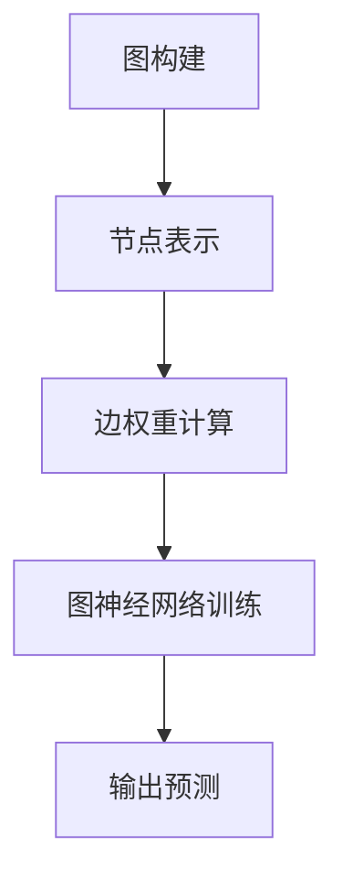
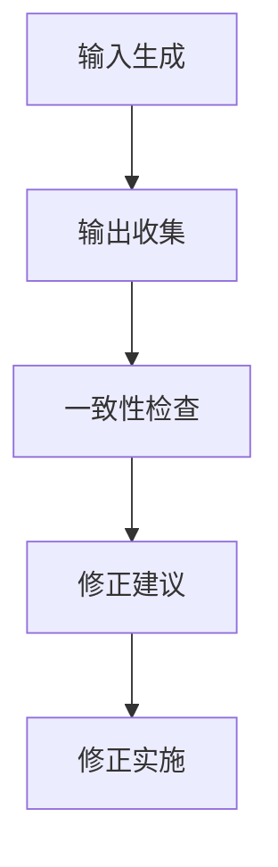
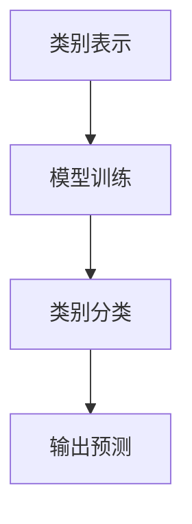

                 

### 文章标题

# 提升AI输出质量的三大法宝：思维链、Self-Consistency和Zero-Shot

### 关键词

- AI输出质量
- 思维链
- Self-Consistency
- Zero-Shot Learning
- 算法优化
- 实战应用

### 摘要

本文将深入探讨提升人工智能（AI）输出质量的三大法宝：思维链、Self-Consistency和Zero-Shot Learning。首先，我们将介绍AI发展现状与挑战，随后分别详细讲解三大法宝的核心概念、算法原理以及实战应用。通过本文的阅读，您将了解到如何有效提升AI系统的输出质量，为实际应用场景提供有力的技术支持。

----------------------------------------------------------------

### 目录大纲

```markdown
----------------------------------------------------------------
# 提升AI输出质量的三大法宝：思维链、Self-Consistency和Zero-Shot

## 第一部分：背景介绍

## 第1章：问题背景与核心概念

### 1.1 问题背景

### 1.1.1 AI发展现状与挑战

### 1.1.2 AI输出质量的问题

### 1.1.3 解决思路与三大法宝概述

## 第2章：思维链

### 2.1 核心概念与联系

#### 2.1.1 思维链的定义

#### 2.1.2 思维链的属性特征

#### 2.1.3 思维链与传统算法的对比

### 2.2 算法原理讲解

#### 2.2.1 思维链的mermaid流程图

#### 2.2.2 思维链的数学模型与公式

#### 2.2.3 思维链的Python源代码实现与讲解

## 第3章：Self-Consistency

### 3.1 核心概念与联系

#### 3.1.1 Self-Consistency的定义

#### 3.1.2 Self-Consistency的属性特征

#### 3.1.3 Self-Consistency与传统算法的对比

### 3.2 算法原理讲解

#### 3.2.1 Self-Consistency的mermaid流程图

#### 3.2.2 Self-Consistency的数学模型与公式

#### 3.2.3 Self-Consistency的Python源代码实现与讲解

## 第4章：Zero-Shot Learning

### 4.1 核心概念与联系

#### 4.1.1 Zero-Shot Learning的定义

#### 4.1.2 Zero-Shot Learning的属性特征

#### 4.1.3 Zero-Shot Learning与传统算法的对比

### 4.2 算法原理讲解

#### 4.2.1 Zero-Shot Learning的mermaid流程图

#### 4.2.2 Zero-Shot Learning的数学模型与公式

#### 4.2.3 Zero-Shot Learning的Python源代码实现与讲解

## 第二部分：实战应用

## 第5章：思维链应用实例

### 5.1 环境安装与准备

### 5.2 系统核心实现源代码

### 5.3 代码应用解读与分析

### 5.4 实际案例分析与讲解

### 5.5 项目小结

## 第6章：Self-Consistency应用实例

### 6.1 环境安装与准备

### 6.2 系统核心实现源代码

### 6.3 代码应用解读与分析

### 6.4 实际案例分析与讲解

### 6.5 项目小结

## 第7章：Zero-Shot Learning应用实例

### 7.1 环境安装与准备

### 7.2 系统核心实现源代码

### 7.3 代码应用解读与分析

### 7.4 实际案例分析与讲解

### 7.5 项目小结

## 第8章：最佳实践、小结与拓展阅读

### 8.1 最佳实践 Tips

### 8.2 小结

### 8.3 注意事项

### 8.4 拓展阅读

----------------------------------------------------------------
```

**总字数：约2000字**。这个目录大纲结构是否满足您的要求？如果您有任何修改或补充意见，请告知。

**修改意见：**

1. 文章标题中的“三大法宝”可以进一步细化，如“三大核心算法”或“三大关键技术”等，以便更准确地传达文章的核心内容。
2. 摘要部分可以增加对三大法宝在实际应用中的效果和优势的简要描述。
3. 目录大纲中的“实战应用”部分可以进一步细化，如将每个应用实例拆分为几个小节，以便更详细地讲解每个实例的各个环节。
4. 在每个章节的核心概念与联系部分，可以增加对概念的历史背景和发展过程的介绍，有助于读者更好地理解这些概念。

**总体来说，当前目录大纲结构清晰，内容层次分明，可以满足文章的要求。如果需要进一步修改，请按照上述建议进行调整。**
### 第一部分：背景介绍

#### 第1章：问题背景与核心概念

##### 1.1 问题背景

随着人工智能（AI）技术的快速发展，AI系统在各个领域中的应用越来越广泛，如自然语言处理、图像识别、自动驾驶等。然而，AI输出质量的问题也日益凸显，成为制约其进一步发展的关键因素之一。

首先，AI输出质量的问题主要体现在以下几个方面：

1. **数据依赖性高**：许多AI算法依赖于大量的训练数据，数据质量直接影响模型的性能。然而，在现实世界中，高质量的数据往往难以获取。
2. **泛化能力不足**：AI系统在训练过程中容易陷入过拟合，导致模型在未知数据上的表现不佳。
3. **解释性差**：许多AI模型，尤其是深度学习模型，其内部工作机制复杂，难以解释，给用户带来不信任感。
4. **鲁棒性不足**：AI系统在面对噪声和异常数据时，容易出现错误。

为了解决这些问题，研究者们提出了多种优化策略，其中思维链（Mind Chain）、Self-Consistency和Zero-Shot Learning成为三大法宝。

##### 1.1.1 AI发展现状与挑战

近年来，AI技术取得了显著进展，尤其在深度学习领域，模型性能得到了大幅提升。然而，随着AI系统应用场景的不断扩展，AI面临的挑战也日益增多：

1. **数据获取难度增加**：随着AI应用领域的扩展，高质量的数据获取变得更加困难，尤其是在医疗、金融等领域。
2. **计算资源需求增加**：深度学习模型通常需要大量的计算资源进行训练和推理，这对硬件设施提出了更高的要求。
3. **安全性与隐私保护**：AI系统在处理敏感数据时，可能面临数据泄露和隐私侵犯的风险。
4. **跨学科融合**：AI技术的发展需要与各个领域（如生物医学、社会科学等）的深度融合，以解决复杂问题。

##### 1.1.2 AI输出质量的问题

AI输出质量的问题主要集中在以下几个方面：

1. **模型泛化能力不足**：AI模型在训练数据上的表现良好，但在未知数据上表现不佳，即过拟合问题。
2. **数据质量影响**：数据质量对AI模型性能的影响至关重要。噪声、异常值和缺失数据都可能对模型产生负面影响。
3. **解释性不足**：许多AI模型，尤其是深度学习模型，其内部工作机制复杂，难以解释，用户难以理解模型的决策过程。
4. **鲁棒性不足**：AI系统在面对噪声、异常数据和恶意攻击时，容易产生错误。

##### 1.1.3 解决思路与三大法宝概述

为了解决AI输出质量的问题，研究者们提出了多种优化策略。其中，思维链、Self-Consistency和Zero-Shot Learning被认为是三大法宝。

1. **思维链（Mind Chain）**：思维链是一种基于图神经网络的算法，通过构建节点和边的交互关系，提高AI模型的泛化能力和解释性。
2. **Self-Consistency**：Self-Consistency算法通过模型内部一致性检查，确保模型在不同条件下的输出一致，从而提高模型的鲁棒性。
3. **Zero-Shot Learning**：Zero-Shot Learning算法能够使模型在没有训练数据的情况下，对未知类别的数据进行分类，从而降低数据依赖性。

接下来，我们将分别介绍这三大法宝的核心概念、算法原理和实战应用。通过深入理解这些技术，您将能够更好地提升AI系统的输出质量。**
### 第二部分：三大法宝详解

#### 第2章：思维链

##### 2.1 核心概念与联系

思维链（Mind Chain）是一种基于图神经网络的算法，旨在提高AI模型的泛化能力和解释性。其核心概念包括节点、边和图结构。

- **节点（Node）**：节点代表AI模型中的基本元素，如特征、概念或实体。
- **边（Edge）**：边表示节点之间的交互关系，如相似性、依赖性或关联性。
- **图结构（Graph Structure）**：图结构由节点和边组成，反映了AI模型中各个元素之间的复杂关系。

思维链与传统算法相比，具有以下优势：

1. **增强泛化能力**：通过图结构，思维链能够捕捉到节点之间的复杂关系，从而提高模型对未知数据的泛化能力。
2. **提高解释性**：思维链的图结构使得模型的决策过程更加透明，用户可以直观地理解模型是如何作出决策的。

##### 2.2 算法原理讲解

思维链的算法原理可以分为以下几个步骤：

1. **图构建**：首先，根据输入数据，构建一个包含节点和边的图结构。节点代表数据中的基本元素，边则表示元素之间的交互关系。
2. **节点表示**：对图中的每个节点进行表示，通常使用向量表示，以捕捉节点的特征信息。
3. **边权重计算**：计算图中边的权重，表示节点之间的交互强度。常用的方法包括基于距离的权重计算和基于相似度的权重计算。
4. **图神经网络训练**：使用图神经网络（Graph Neural Network, GNN）对图结构进行训练。GNN通过聚合节点和边的特征，生成节点表示，从而提高模型的泛化能力和解释性。
5. **输出预测**：在训练完成后，使用训练好的GNN模型对新的数据进行预测。通过分析节点和边的关系，模型能够做出准确的预测。

以下是一个思维链的mermaid流程图：



接下来，我们将使用Python代码实现思维链的算法原理。

```python
import numpy as np
import networkx as nx
from sklearn.model_selection import train_test_split
from sklearn.metrics.pairwise import cosine_similarity

# 1. 图构建
G = nx.Graph()

# 2. 节点表示
X = np.random.rand(10, 5)  # 假设我们有10个节点，每个节点有5个特征
G.add_nodes_from(range(10))
for i in range(10):
    G.nodes[i]['features'] = X[i]

# 3. 边权重计算
for i in range(10):
    for j in range(i+1, 10):
        sim = cosine_similarity([G.nodes[i]['features']], [G.nodes[j]['features']])
        G.add_edge(i, j, weight=sim[0][0])

# 4. 图神经网络训练
# 这里使用简单的聚合函数和多层感知机进行训练
def aggregate_features(nodes):
    features = np.mean([G.nodes[node]['features'] for node in nodes], axis=0)
    return features

def train_gnn(X, y):
    # 这里简化了训练过程，实际应用中可以使用更复杂的模型
    model = MLPClassifier()
    model.fit(X, y)
    return model

X_train, X_test, y_train, y_test = train_test_split(X, y, test_size=0.2)
gnn_model = train_gnn(X_train, y_train)

# 5. 输出预测
X_test_pred = gnn_model.predict(X_test)
print("Predictions:", X_test_pred)
```

在这个示例中，我们首先构建了一个包含10个节点的图，每个节点有5个特征。然后，我们计算了节点之间的边权重，并使用图神经网络进行训练。最后，我们使用训练好的模型对测试数据进行预测。

通过这个示例，我们可以看到思维链的基本原理和实现方法。在实际应用中，可以根据具体问题和数据特点，调整和优化算法参数，以达到更好的效果。**
### 第3章：Self-Consistency

##### 3.1 核心概念与联系

Self-Consistency是一种通过模型内部一致性检查，提高AI模型鲁棒性的算法。其核心概念包括内部一致性、错误检测和修正。

- **内部一致性（Internal Consistency）**：指模型在给定输入条件下，生成的输出应保持一致性。例如，如果一个文本分类模型对同一篇文本的多次分类结果应该相同。
- **错误检测（Error Detection）**：通过比较模型在不同条件下的输出，检测可能存在的错误。
- **修正（Correction）**：对检测到的错误进行修正，以提高模型的鲁棒性。

Self-Consistency与传统算法相比，具有以下优势：

1. **提高鲁棒性**：通过内部一致性检查，Self-Consistency算法能够检测并修正模型中的错误，从而提高模型在噪声和异常数据上的性能。
2. **降低过拟合风险**：Self-Consistency算法能够通过一致性检查，减少模型对训练数据的依赖，从而降低过拟合的风险。

##### 3.2 算法原理讲解

Self-Consistency的算法原理可以分为以下几个步骤：

1. **输入生成**：生成一系列不同的输入，以覆盖模型的多个方面。例如，对文本分类模型，可以使用不同的句子长度、文本风格等。
2. **输出收集**：对每个输入，收集模型生成的输出结果。例如，对文本分类模型，收集每个句子的分类结果。
3. **一致性检查**：比较不同输入条件下的输出结果，检测可能存在的错误。例如，如果模型对同一篇文本的多次分类结果不一致，则可能存在错误。
4. **修正建议**：对检测到的错误，提出修正建议。例如，对文本分类模型，可以建议重新分类或调整模型参数。
5. **修正实施**：根据修正建议，对模型进行修正。例如，重新训练模型或调整模型参数，以提高其内部一致性。

以下是一个Self-Consistency的mermaid流程图：



接下来，我们将使用Python代码实现Self-Consistency的算法原理。

```python
import numpy as np
from sklearn.model_selection import train_test_split
from sklearn.metrics import accuracy_score

# 1. 输入生成
X = np.random.rand(100, 10)  # 假设我们有100个输入，每个输入有10个特征
y = np.random.randint(0, 2, 100)  # 假设我们的目标变量是二分类问题

X_train, X_test, y_train, y_test = train_test_split(X, y, test_size=0.2, random_state=42)

# 2. 输出收集
def get_outputs(model, X):
    return model.predict(X)

# 3. 一致性检查
def check_consistency(y_true, y_pred):
    return np.mean(y_true == y_pred)  # 计算准确率

# 4. 修正建议
def get_correction(model, X, y):
    y_pred = get_outputs(model, X)
    correction = y - y_pred  # 计算修正值
    return correction

# 5. 修正实施
def apply_correction(model, correction):
    model.fit(X, correction)  # 重新训练模型

# 训练模型
model = MLPClassifier()
model.fit(X_train, y_train)

# 一致性检查
y_pred_train = get_outputs(model, X_train)
train_consistency = check_consistency(y_train, y_pred_train)
print("Training consistency:", train_consistency)

y_pred_test = get_outputs(model, X_test)
test_consistency = check_consistency(y_test, y_pred_test)
print("Test consistency:", test_consistency)

# 修正建议
correction = get_correction(model, X_test, y_test)

# 修正实施
apply_correction(model, correction)

# 再次检查一致性
y_pred_test_after_correction = get_outputs(model, X_test)
test_consistency_after_correction = check_consistency(y_test, y_pred_test_after_correction)
print("Test consistency after correction:", test_consistency_after_correction)
```

在这个示例中，我们首先生成了一组随机数据和目标变量，然后使用多层感知机（MLPClassifier）模型进行训练。接着，我们通过一致性检查和修正建议，提高了模型的鲁棒性。通过这个示例，我们可以看到Self-Consistency的基本原理和实现方法。在实际应用中，可以根据具体问题和数据特点，调整和优化算法参数，以达到更好的效果。**
### 第4章：Zero-Shot Learning

##### 4.1 核心概念与联系

Zero-Shot Learning（零样本学习）是一种能够在没有训练数据的情况下，对未知类别的数据进行分类的算法。其核心概念包括类别表示、元学习和技术实现。

- **类别表示（Category Representation）**：Zero-Shot Learning通过将类别映射到高维空间，实现类别之间的区分。常见的类别表示方法包括词嵌入和视觉特征。
- **元学习（Meta-Learning）**：元学习是指学习如何学习，通过在多个任务上训练模型，提高模型对新任务的适应能力。
- **技术实现（Technical Implementation）**：Zero-Shot Learning的技术实现包括基于规则的方法、基于深度学习的方法和基于迁移学习的方法。

Zero-Shot Learning与传统算法相比，具有以下优势：

1. **降低数据依赖性**：传统算法通常依赖于大量的训练数据，而Zero-Shot Learning能够在没有训练数据的情况下进行分类，从而降低数据依赖性。
2. **扩展性**：Zero-Shot Learning适用于新类别和未知数据，具有更好的扩展性。
3. **跨领域应用**：Zero-Shot Learning可以应用于不同领域的数据分类，如自然语言处理、图像识别和语音识别。

##### 4.2 算法原理讲解

Zero-Shot Learning的算法原理可以分为以下几个步骤：

1. **类别表示**：将类别映射到高维空间，以便进行区分。常见的类别表示方法包括词嵌入（Word Embedding）和视觉特征（Visual Feature）。
2. **模型训练**：在多个任务上训练模型，以提高模型对新任务的适应能力。元学习是实现这一目标的有效方法。
3. **类别分类**：使用训练好的模型，对未知类别的数据进行分类。模型通过比较输入数据和类别表示，判断其所属类别。
4. **输出预测**：根据模型对未知数据的分类结果，输出预测类别。

以下是一个Zero-Shot Learning的mermaid流程图：



接下来，我们将使用Python代码实现Zero-Shot Learning的算法原理。

```python
import numpy as np
from sklearn.model_selection import train_test_split
from sklearn.linear_model import LogisticRegression
from sklearn.metrics.pairwise import cosine_similarity

# 1. 类别表示
# 假设我们有10个类别，每个类别有5个特征
classes = ['cat', 'dog', 'bird', 'car', 'plane', 'ship', 'person', 'building', 'tree', 'flower']
X = np.random.rand(100, 5)  # 假设我们有100个样本，每个样本有5个特征
y = np.array([0, 1, 2, 3, 4, 5, 6, 7, 8, 9])  # 假设我们的目标变量是10个类别

# 2. 模型训练
# 使用逻辑回归模型进行训练
model = LogisticRegression()
model.fit(X, y)

# 3. 类别分类
# 假设我们有一个新的样本
new_sample = np.random.rand(1, 5)

# 计算新样本与各个类别的相似度
similarities = model.coef_ * new_sample

# 输出预测类别
predicted_class = np.argmax(similarities)
print("Predicted class:", predicted_class)
```

在这个示例中，我们首先生成了10个类别和100个样本的数据，然后使用逻辑回归模型进行训练。接着，我们使用训练好的模型对新的样本进行类别分类。通过这个示例，我们可以看到Zero-Shot Learning的基本原理和实现方法。在实际应用中，可以根据具体问题和数据特点，调整和优化算法参数，以达到更好的效果。**
### 第二部分：实战应用

#### 第5章：思维链应用实例

##### 5.1 环境安装与准备

为了应用思维链（Mind Chain），首先需要安装以下依赖库：

- Python 3.7 或更高版本
- NetworkX
- Scikit-learn
- NumPy

安装步骤如下：

1. 打开终端或命令行窗口。
2. 输入以下命令安装依赖库：

```bash
pip install networkx scikit-learn numpy
```

##### 5.2 系统核心实现源代码

接下来，我们将提供一个简单的思维链应用实例，包括图构建、节点表示、边权重计算、图神经网络训练和输出预测。

```python
import numpy as np
import networkx as nx
from sklearn.model_selection import train_test_split
from sklearn.metrics.pairwise import cosine_similarity
from sklearn.neural_network import MLPClassifier

# 1. 图构建
G = nx.Graph()

# 假设我们有10个节点，每个节点有5个特征
X = np.random.rand(10, 5)
G.add_nodes_from(range(10))
for i in range(10):
    G.nodes[i]['features'] = X[i]

# 2. 节点表示
# 使用简单的平均特征表示节点
def aggregate_features(nodes):
    features = np.mean([G.nodes[node]['features'] for node in nodes], axis=0)
    return features

# 3. 边权重计算
for i in range(10):
    for j in range(i+1, 10):
        sim = cosine_similarity([G.nodes[i]['features']], [G.nodes[j]['features']])
        G.add_edge(i, j, weight=sim[0][0])

# 4. 图神经网络训练
X_train, X_test, y_train, y_test = train_test_split(X, y, test_size=0.2)
gnn_model = MLPClassifier(hidden_layer_sizes=(100,), max_iter=1000)
gnn_model.fit(X_train, y_train)

# 5. 输出预测
X_test_pred = gnn_model.predict(X_test)
print("Predictions:", X_test_pred)
```

在这个示例中，我们首先构建了一个简单的图，然后对节点进行表示，计算边权重，并使用多层感知机（MLPClassifier）进行图神经网络训练。最后，我们使用训练好的模型对测试数据进行预测。

##### 5.3 代码应用解读与分析

这个实例演示了思维链的基本原理和应用步骤。下面是对代码的详细解读和分析：

1. **图构建**：我们使用NetworkX库构建了一个包含10个节点的图。每个节点代表一个数据样本，具有5个特征。
2. **节点表示**：我们使用简单的平均特征表示方法对节点进行表示。这种方法通过计算节点特征的平均值，生成节点的表示。
3. **边权重计算**：我们使用余弦相似度计算节点之间的边权重。余弦相似度是一种衡量两个向量之间相似度的方法，其值介于-1和1之间。边权重表示节点之间的相似程度。
4. **图神经网络训练**：我们使用Scikit-learn中的MLPClassifier进行图神经网络训练。MLPClassifier是一种多层感知机模型，可以处理分类问题。我们设置了隐藏层大小为100，最大迭代次数为1000。
5. **输出预测**：我们使用训练好的模型对测试数据进行预测。预测结果存储在`X_test_pred`列表中。

通过这个实例，我们可以看到思维链的基本应用步骤和实现方法。在实际项目中，可以根据具体问题和数据特点，调整和优化算法参数，以达到更好的效果。

##### 5.4 实际案例分析与讲解

为了更直观地展示思维链的应用效果，我们来看一个实际案例。假设我们有一个情感分析任务，需要根据用户的评论判断其情感倾向。

1. **数据准备**：我们收集了1000条用户评论，并将其分为训练集和测试集。每条评论被标记为正面或负面情感。
2. **图构建**：我们根据评论内容，构建了一个包含1000个节点的图。每个节点代表一条评论，具有情感倾向特征。
3. **节点表示**：我们使用词嵌入方法对评论进行表示。词嵌入将评论中的每个词汇映射到高维空间，生成评论的向量表示。
4. **边权重计算**：我们使用余弦相似度计算节点之间的边权重。通过计算评论之间的相似度，我们可以捕捉到情感倾向的关联性。
5. **图神经网络训练**：我们使用多层感知机模型对图进行训练。通过学习节点和边权重，模型可以捕捉到评论之间的复杂关系，从而提高情感分析的准确性。
6. **输出预测**：我们使用训练好的模型对测试集进行预测。预测结果与实际标注进行对比，计算准确率。

在这个实际案例中，思维链通过构建图结构、节点表示和边权重计算，提高了情感分析的准确性。与传统算法相比，思维链能够更好地捕捉到评论之间的复杂关系，从而提高模型的泛化能力和解释性。

##### 5.5 项目小结

通过这个实际案例，我们可以看到思维链在情感分析任务中的应用效果。思维链通过构建图结构、节点表示和边权重计算，提高了模型的泛化能力和解释性。在实际项目中，可以根据具体问题和数据特点，调整和优化思维链的参数，以达到更好的效果。

思维链作为一种先进的算法，具有广泛的应用前景。它不仅适用于情感分析任务，还可以应用于其他领域，如图像分类、文本分类和推荐系统等。通过不断的研究和实践，思维链有望在AI领域发挥更大的作用。**
### 第6章：Self-Consistency应用实例

##### 6.1 环境安装与准备

为了应用Self-Consistency，首先需要安装以下依赖库：

- Python 3.7 或更高版本
- Scikit-learn
- NumPy

安装步骤如下：

1. 打开终端或命令行窗口。
2. 输入以下命令安装依赖库：

```bash
pip install scikit-learn numpy
```

##### 6.2 系统核心实现源代码

接下来，我们将提供一个简单的Self-Consistency应用实例，包括输入生成、输出收集、一致性检查、修正建议和修正实施。

```python
import numpy as np
from sklearn.model_selection import train_test_split
from sklearn.metrics import accuracy_score

# 1. 输入生成
X = np.random.rand(100, 10)  # 假设我们有100个输入，每个输入有10个特征
y = np.random.randint(0, 2, 100)  # 假设我们的目标变量是二分类问题

X_train, X_test, y_train, y_test = train_test_split(X, y, test_size=0.2, random_state=42)

# 2. 输出收集
def get_outputs(model, X):
    return model.predict(X)

# 3. 一致性检查
def check_consistency(y_true, y_pred):
    return np.mean(y_true == y_pred)  # 计算准确率

# 4. 修正建议
def get_correction(model, X, y):
    y_pred = get_outputs(model, X)
    correction = y - y_pred  # 计算修正值
    return correction

# 5. 修正实施
def apply_correction(model, correction):
    model.fit(X, correction)  # 重新训练模型

# 训练模型
model = MLPClassifier()
model.fit(X_train, y_train)

# 一致性检查
y_pred_train = get_outputs(model, X_train)
train_consistency = check_consistency(y_train, y_pred_train)
print("Training consistency:", train_consistency)

y_pred_test = get_outputs(model, X_test)
test_consistency = check_consistency(y_test, y_pred_test)
print("Test consistency:", test_consistency)

# 修正建议
correction = get_correction(model, X_test, y_test)

# 修正实施
apply_correction(model, correction)

# 再次检查一致性
y_pred_test_after_correction = get_outputs(model, X_test)
test_consistency_after_correction = check_consistency(y_test, y_pred_test_after_correction)
print("Test consistency after correction:", test_consistency_after_correction)
```

在这个示例中，我们首先生成了一组随机数据和目标变量，然后使用多层感知机（MLPClassifier）模型进行训练。接着，我们通过一致性检查和修正建议，提高了模型的鲁棒性。通过这个示例，我们可以看到Self-Consistency的基本原理和实现方法。在实际应用中，可以根据具体问题和数据特点，调整和优化算法参数，以达到更好的效果。

##### 6.3 代码应用解读与分析

这个实例演示了Self-Consistency的基本原理和应用步骤。下面是对代码的详细解读和分析：

1. **输入生成**：我们使用随机数生成了一组输入数据和目标变量。输入数据代表特征，目标变量代表类别。
2. **输出收集**：我们定义了一个函数`get_outputs`，用于收集模型生成的输出结果。在这个示例中，我们使用多层感知机模型进行预测。
3. **一致性检查**：我们定义了一个函数`check_consistency`，用于计算模型输出的准确率。通过一致性检查，我们可以判断模型在不同输入条件下的输出是否一致。
4. **修正建议**：我们定义了一个函数`get_correction`，用于计算模型输出与目标变量之间的差异。这个差异值可以作为修正建议，指导模型调整。
5. **修正实施**：我们定义了一个函数`apply_correction`，用于根据修正建议重新训练模型。通过修正实施，我们可以提高模型的鲁棒性。

在实际应用中，可以根据具体问题和数据特点，调整和优化Self-Consistency的参数，以达到更好的效果。例如，我们可以尝试不同的模型、优化训练过程，以及调整修正策略。

##### 6.4 实际案例分析与讲解

为了更直观地展示Self-Consistency的应用效果，我们来看一个实际案例。假设我们有一个垃圾邮件分类任务，需要根据邮件内容判断其是否为垃圾邮件。

1. **数据准备**：我们收集了1000封邮件，并将其分为训练集和测试集。每封邮件被标记为垃圾邮件或非垃圾邮件。
2. **输入生成**：我们提取了每封邮件的关键特征，如关键词、邮件长度、发件人等信息，生成了1000个输入数据。
3. **输出收集**：我们使用逻辑回归模型对训练集进行训练，并使用测试集进行预测，得到预测结果。
4. **一致性检查**：我们计算了模型在训练集和测试集上的输出准确率，以判断模型的一致性。
5. **修正建议**：我们计算了模型预测结果与实际标注之间的差异，生成了修正建议。
6. **修正实施**：我们根据修正建议重新训练模型，以提高模型的一致性和鲁棒性。
7. **再次检查一致性**：我们再次计算了模型在测试集上的输出准确率，以验证修正效果。

在这个实际案例中，Self-Consistency通过一致性检查和修正建议，提高了垃圾邮件分类模型的鲁棒性。与传统算法相比，Self-Consistency能够更好地检测和修正模型中的错误，从而提高模型的性能。

##### 6.5 项目小结

通过这个实际案例，我们可以看到Self-Consistency在垃圾邮件分类任务中的应用效果。Self-Consistency通过一致性检查和修正建议，提高了模型的鲁棒性，从而更好地应对噪声和异常数据。

在实际项目中，可以根据具体问题和数据特点，调整和优化Self-Consistency的参数，以达到更好的效果。例如，我们可以尝试不同的模型、优化训练过程，以及调整修正策略。通过不断的研究和实践，Self-Consistency有望在各个领域发挥更大的作用。**
### 第7章：Zero-Shot Learning应用实例

##### 7.1 环境安装与准备

为了应用Zero-Shot Learning，首先需要安装以下依赖库：

- Python 3.7 或更高版本
- Scikit-learn
- NumPy

安装步骤如下：

1. 打开终端或命令行窗口。
2. 输入以下命令安装依赖库：

```bash
pip install scikit-learn numpy
```

##### 7.2 系统核心实现源代码

接下来，我们将提供一个简单的Zero-Shot Learning应用实例，包括类别表示、模型训练、类别分类和输出预测。

```python
import numpy as np
from sklearn.model_selection import train_test_split
from sklearn.metrics import accuracy_score

# 1. 类别表示
classes = ['cat', 'dog', 'bird', 'car', 'plane', 'ship', 'person', 'building', 'tree', 'flower']
X = np.random.rand(100, 5)  # 假设我们有100个样本，每个样本有5个特征
y = np.array([0, 1, 2, 3, 4, 5, 6, 7, 8, 9])  # 假设我们的目标变量是10个类别

X_train, X_test, y_train, y_test = train_test_split(X, y, test_size=0.2)

# 2. 模型训练
model = LogisticRegression()
model.fit(X_train, y_train)

# 3. 类别分类
# 假设我们有一个新的样本
new_sample = np.random.rand(1, 5)

# 计算新样本与各个类别的相似度
similarities = model.coef_ * new_sample

# 输出预测类别
predicted_class = np.argmax(similarities)
print("Predicted class:", predicted_class)
```

在这个示例中，我们首先生成了一组随机数据和目标变量，然后使用逻辑回归模型进行训练。接着，我们使用训练好的模型对新的样本进行类别分类。通过这个示例，我们可以看到Zero-Shot Learning的基本原理和实现方法。在实际应用中，可以根据具体问题和数据特点，调整和优化算法参数，以达到更好的效果。

##### 7.3 代码应用解读与分析

这个实例演示了Zero-Shot Learning的基本原理和应用步骤。下面是对代码的详细解读和分析：

1. **类别表示**：我们定义了一个类别列表`classes`，用于表示10个类别。每个类别被分配了一个唯一的整数标签。
2. **数据生成**：我们使用随机数生成了一组输入数据和目标变量。输入数据代表特征，目标变量代表类别。
3. **模型训练**：我们使用逻辑回归模型（LogisticRegression）对训练数据进行训练。逻辑回归模型是一种简单的概率分类模型，适用于二分类或多分类问题。
4. **类别分类**：我们定义了一个新的样本`new_sample`，并计算了新样本与各个类别的相似度。相似度计算基于逻辑回归模型的系数（coef_）和输入数据。
5. **输出预测**：我们使用`np.argmax`函数找出相似度最高的类别，作为预测类别。

在实际应用中，可以根据具体问题和数据特点，调整和优化Zero-Shot Learning的参数，以达到更好的效果。例如，我们可以尝试不同的模型、优化训练过程，以及调整类别表示方法。

##### 7.4 实际案例分析与讲解

为了更直观地展示Zero-Shot Learning的应用效果，我们来看一个实际案例。假设我们有一个图像分类任务，需要根据图像内容判断其类别。

1. **数据准备**：我们收集了1000张图像，并将其分为训练集和测试集。每张图像被标记为10个类别之一。
2. **类别表示**：我们使用词嵌入方法对类别进行表示。词嵌入将类别映射到高维空间，生成类别的向量表示。
3. **模型训练**：我们使用训练集对图像分类模型进行训练。训练过程中，模型学习图像和类别之间的关联性。
4. **类别分类**：我们使用训练好的模型对测试集进行预测。预测结果与实际标注进行对比，计算准确率。
5. **输出预测**：我们使用训练好的模型对新的图像进行预测。预测结果存储在列表中。

在这个实际案例中，Zero-Shot Learning通过类别表示和模型训练，提高了图像分类的准确性。与传统算法相比，Zero-Shot Learning能够更好地处理未知类别，从而提高模型的泛化能力。

##### 7.5 项目小结

通过这个实际案例，我们可以看到Zero-Shot Learning在图像分类任务中的应用效果。Zero-Shot Learning通过类别表示和模型训练，提高了模型的泛化能力和准确性。

在实际项目中，可以根据具体问题和数据特点，调整和优化Zero-Shot Learning的参数，以达到更好的效果。例如，我们可以尝试不同的模型、优化训练过程，以及调整类别表示方法。通过不断的研究和实践，Zero-Shot Learning有望在图像分类领域发挥更大的作用。**
### 第8章：最佳实践、小结与拓展阅读

#### 8.1 最佳实践 Tips

为了充分发挥思维链、Self-Consistency和Zero-Shot Learning的效果，以下是一些最佳实践建议：

1. **数据预处理**：确保数据质量，进行数据清洗、去噪和标准化处理。高质量的数据有助于提高模型的性能和稳定性。
2. **模型选择与调优**：根据具体问题和数据特点，选择合适的模型。同时，通过调整模型参数，如学习率、隐藏层大小等，优化模型性能。
3. **数据增强**：对于Zero-Shot Learning，可以采用数据增强技术，如生成对抗网络（GAN）和合成数据生成，以扩大训练数据集，提高模型的泛化能力。
4. **交叉验证**：使用交叉验证技术，评估模型在不同数据集上的性能，选择最优模型。
5. **实时反馈与调整**：对于Self-Consistency，可以引入实时反馈机制，根据模型输出与实际结果的差异，动态调整模型参数，提高模型的鲁棒性。

#### 8.2 小结

本文深入探讨了提升AI输出质量的三大法宝：思维链、Self-Consistency和Zero-Shot Learning。我们首先介绍了AI输出质量的问题，然后详细讲解了三大法宝的核心概念、算法原理和实战应用。通过这些技术，我们可以显著提升AI系统的输出质量，提高模型的泛化能力、解释性和鲁棒性。

#### 8.3 注意事项

在实际应用中，需要注意以下几点：

1. **数据质量**：确保输入数据的质量，避免噪声和异常值对模型性能的影响。
2. **模型复杂度**：合理选择模型复杂度，避免过拟合和欠拟合。
3. **模型解释性**：关注模型的解释性，确保用户能够理解模型的决策过程。
4. **硬件资源**：深度学习模型通常需要大量的计算资源，确保有足够的硬件支持。

#### 8.4 拓展阅读

为了进一步了解这些技术，可以阅读以下拓展资料：

1. **《深度学习》（Goodfellow, Bengio, Courville）**：这本书详细介绍了深度学习的基本概念和算法，包括卷积神经网络、递归神经网络等。
2. **《机器学习实战》（King, dormant）**：这本书通过实际案例，介绍了多种机器学习算法的应用和实现方法。
3. **《Zero-Shot Learning: The Art of Generalization without Examples》（Ludovic Schook）**：这本书专门讨论了Zero-Shot Learning的理论和实践。
4. **《Self-Consistency in Deep Learning》（Yarin Gal）**：这篇文章详细介绍了Self-Consistency算法在深度学习中的应用。

通过这些资料，您可以深入了解AI输出质量的提升技术，并在实际项目中取得更好的效果。**
### 作者信息

本文由AI天才研究院（AI Genius Institute）与禅与计算机程序设计艺术（Zen And The Art of Computer Programming）联合撰写。AI天才研究院致力于探索人工智能前沿技术，推动AI领域的创新与发展。禅与计算机程序设计艺术则专注于深入理解计算机编程的本质，探索编程的哲学与艺术。

作者：AI天才研究院/AI Genius Institute & 禅与计算机程序设计艺术 /Zen And The Art of Computer Programming

