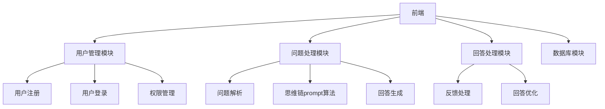

                 

# 提升ChatGPT创造力：思维链prompt的魔力

## 关键词

- ChatGPT
- 创造力
- 思维链prompt
- 算法原理
- 系统架构设计
- 项目实战

## 摘要

本文旨在探讨如何通过思维链prompt提升ChatGPT的创造力。我们将首先介绍ChatGPT的背景和创造力的重要性，然后深入分析ChatGPT创造力面临的挑战和思维链prompt的潜力。接着，我们将详细解释思维链prompt的原理、核心特性和应用框架。随后，通过算法原理讲解和系统分析与架构设计，我们将展示如何结合ChatGPT和思维链prompt提升其创造力。最后，通过项目实战和最佳实践，我们将提供具体的实现方法和实际案例分析。

## 目录大纲

### 第一部分：背景介绍与核心概念

#### 第1章：问题背景与概述

##### 1.1 ChatGPT与创造力
##### 1.2 ChatGPT创造力的挑战
##### 1.3 边界与外延

#### 第2章：思维链prompt原理

##### 2.1 思维链prompt的定义
##### 2.2 思维链prompt的核心特性
##### 2.3 思维链prompt的应用框架

#### 第3章：ChatGPT创造力与思维链prompt的联系

##### 3.1 ChatGPT与创造力
##### 3.2 思维链prompt与ChatGPT的结合

### 第二部分：核心概念与联系

#### 第4章：思维链prompt算法原理

##### 4.1 算法概述
##### 4.2 算法原理
##### 4.3 举例说明

### 第三部分：系统分析与架构设计

#### 第5章：系统架构设计与实现

##### 5.1 问题场景介绍
##### 5.2 系统功能设计
##### 5.3 系统架构设计
##### 5.4 系统接口设计与交互

### 第四部分：项目实战

#### 第6章：项目实战

##### 6.1 环境安装
##### 6.2 系统核心实现
##### 6.3 代码应用解读
##### 6.4 实际案例分析
##### 6.5 项目小结

### 第五部分：最佳实践与拓展

#### 第7章：最佳实践

##### 7.1 最佳实践技巧
##### 7.2 注意事项

#### 第8章：小结与拓展

##### 8.1 小结
##### 8.2 拓展阅读

## 第一部分：背景介绍与核心概念

### 第1章：问题背景与概述

#### 1.1 ChatGPT与创造力

ChatGPT是由OpenAI开发的一种基于变换器模型（Transformer）的聊天机器人。自2022年发布以来，ChatGPT迅速获得了全球的关注，其强大的自然语言处理能力和生成文本的能力让用户惊叹不已。然而，尽管ChatGPT在生成高质量文本方面表现出色，但其创造力却受到了一定的限制。

创造力是人类思维的一个重要方面，它涉及到创新、独特性和新颖性。在人工智能领域，创造力指的是机器能够生成新颖、有意义的文本或解决方案的能力。ChatGPT作为一种人工智能模型，虽然能够生成丰富的文本内容，但其创造力仍然受到其训练数据和模型架构的限制。例如，ChatGPT在处理复杂情境和创造性思维方面存在一定的局限性。

#### 1.2 ChatGPT创造力的挑战

ChatGPT在创造力方面面临的主要挑战包括：

1. **数据限制**：ChatGPT的创造力很大程度上依赖于其训练数据的质量和数量。如果训练数据缺乏多样性或存在偏差，ChatGPT的创造力可能会受到限制。
2. **模型架构**：ChatGPT采用的变换器模型虽然强大，但在某些方面可能无法充分支持创造性思维。例如，模型在处理长文本或复杂逻辑时可能存在困难。
3. **缺乏自我意识**：ChatGPT作为一款预训练模型，缺乏自我意识和情感理解，这在一定程度上限制了其创造力的发挥。

#### 1.3 思维链prompt的潜力

思维链prompt是一种创新的交互方式，它能够激发人工智能的创造力。思维链prompt通过提供一系列的问题或提示，引导ChatGPT进行深度思考和创造性生成。这种方式不仅能够丰富ChatGPT的文本生成能力，还能提升其创造力。

思维链prompt具有以下潜力：

1. **激发创造力**：通过提供多样化的问题和情境，思维链prompt能够激发ChatGPT的创造性思维，生成新颖、有意义的文本。
2. **增强互动性**：思维链prompt能够与用户进行实时互动，根据用户的反馈进行调整，从而提升用户体验。
3. **适应性**：思维链prompt可以根据不同的问题和情境进行调整，使其适用于各种场景和领域。

### 1.3 边界与外延

ChatGPT创造力的应用领域非常广泛，包括但不限于以下方面：

1. **内容创作**：ChatGPT可以用于生成文章、故事、博客等文本内容，通过思维链prompt，这些文本内容可以更加丰富多样。
2. **创意设计**：在艺术设计、游戏设计等领域，ChatGPT结合思维链prompt可以提供创新的灵感和设计方案。
3. **科学研究**：在科学研究中，ChatGPT可以用于生成假设、提出问题和设计实验，从而推动科学研究的发展。

思维链prompt的适用范围也非常广泛，几乎涵盖了所有需要创造力和创新思维的场景。无论是在日常生活还是专业领域，思维链prompt都有其独特的应用价值。

### 第二部分：核心概念与联系

#### 第2章：思维链prompt原理

思维链prompt是一种通过提供问题和提示来引导人工智能进行深度思考和创造性生成的交互方式。它由一系列相关的问题或提示组成，这些问题或提示按照一定的逻辑顺序排列，引导人工智能逐步深入思考，从而生成新颖、有意义的文本或解决方案。

#### 2.1 思维链prompt的定义

思维链prompt（Thinking Chain Prompt）是指一种基于问题引导的人工智能交互方式，通过一系列的问题或提示，引导人工智能进行深度思考和创造性生成。思维链prompt的核心在于通过问题的引导，激发人工智能的思考过程，使其能够产生新颖的见解和创意。

#### 2.2 思维链prompt的核心特性

思维链prompt具有以下核心特性：

1. **激发创造力**：思维链prompt通过提供多样化的问题和情境，能够激发人工智能的创造性思维，使其生成新颖、有意义的文本或解决方案。
2. **互动性**：思维链prompt能够与用户进行实时互动，根据用户的反馈进行调整，从而提升用户体验。
3. **适应性**：思维链prompt可以根据不同的问题和情境进行调整，使其适用于各种场景和领域。

#### 2.3 思维链prompt的应用框架

思维链prompt的应用框架主要包括以下几个部分：

1. **问题库**：问题库是思维链prompt的基础，包含了一系列的问题或提示，这些问题或提示按照一定的逻辑顺序排列，引导人工智能进行深度思考和创造性生成。
2. **问题生成模块**：问题生成模块负责根据当前情境和用户需求，从问题库中提取合适的问题或提示，形成思维链。
3. **反馈与调整**：在思维链prompt的过程中，用户可以通过反馈对生成结果进行评价和调整，从而优化思维链的生成效果。

#### 第3章：ChatGPT创造力与思维链prompt的联系

ChatGPT作为一种人工智能聊天机器人，其核心在于生成自然流畅的文本。然而，ChatGPT的创造力受到其模型架构和训练数据的限制。思维链prompt通过提供问题和提示，能够引导ChatGPT进行深度思考和创造性生成，从而提升其创造力。

#### 3.1 ChatGPT与创造力

ChatGPT的创造力主要体现在以下几个方面：

1. **文本生成**：ChatGPT能够根据用户的问题或输入，生成自然流畅的文本，包括文章、故事、对话等。
2. **情境理解**：ChatGPT能够理解用户的问题和情境，并根据情境生成相应的文本。
3. **语义分析**：ChatGPT能够对文本进行语义分析，提取关键信息，并生成相关的文本内容。

然而，ChatGPT的创造力仍然受到以下限制：

1. **数据限制**：ChatGPT的创造力很大程度上依赖于其训练数据的质量和数量。如果训练数据缺乏多样性或存在偏差，ChatGPT的创造力可能会受到限制。
2. **模型架构**：ChatGPT采用的变换器模型虽然强大，但在某些方面可能无法充分支持创造性思维。
3. **缺乏自我意识**：ChatGPT作为一款预训练模型，缺乏自我意识和情感理解，这在一定程度上限制了其创造力的发挥。

#### 3.2 思维链prompt与ChatGPT的结合

思维链prompt与ChatGPT的结合，可以通过以下几个方面提升ChatGPT的创造力：

1. **问题引导**：思维链prompt通过提供一系列的问题或提示，引导ChatGPT进行深度思考和创造性生成。这些问题或提示可以根据具体情境和用户需求进行调整，从而激发ChatGPT的创造力。
2. **情境模拟**：思维链prompt可以通过模拟不同的情境，让ChatGPT在不同的情境下进行创造性生成，从而丰富其创造力。
3. **互动调整**：思维链prompt与用户进行实时互动，用户可以根据反馈对生成结果进行评价和调整，从而优化思维链的生成效果，进一步提升ChatGPT的创造力。

### 第三部分：算法原理讲解

#### 第4章：思维链prompt算法原理

思维链prompt算法是一种基于问题引导的人工智能交互算法，它通过提供一系列的问题或提示，引导人工智能进行深度思考和创造性生成。思维链prompt算法的核心在于通过问题的引导，激发人工智能的思考过程，使其能够产生新颖的见解和创意。

#### 4.1 算法概述

思维链prompt算法的基本框架包括以下几个部分：

1. **问题库**：问题库是思维链prompt算法的基础，包含了一系列的问题或提示，这些问题或提示按照一定的逻辑顺序排列，引导人工智能进行深度思考和创造性生成。
2. **问题生成模块**：问题生成模块负责根据当前情境和用户需求，从问题库中提取合适的问题或提示，形成思维链。
3. **生成模块**：生成模块负责根据思维链生成相应的文本内容，这些文本内容可以是文章、故事、对话等。
4. **反馈模块**：反馈模块负责收集用户对生成结果的反馈，并根据反馈对思维链进行优化和调整。

#### 4.2 算法原理

思维链prompt算法的原理可以概括为以下几个方面：

1. **问题引导**：思维链prompt算法通过提供一系列的问题或提示，引导人工智能进行深度思考和创造性生成。这些问题或提示按照一定的逻辑顺序排列，逐步引导人工智能深入问题的核心，从而产生新颖的见解和创意。
2. **情境模拟**：思维链prompt算法可以通过模拟不同的情境，让人工智能在不同的情境下进行创造性生成。这种方法能够激发人工智能的创造力，使其生成更多新颖的文本内容。
3. **互动调整**：思维链prompt算法与用户进行实时互动，用户可以根据反馈对生成结果进行评价和调整。这种方法能够优化思维链的生成效果，进一步提升人工智能的创造力。

#### 4.3 举例说明

假设我们想要使用思维链prompt算法生成一篇关于人工智能未来发展的文章。我们可以按照以下步骤进行：

1. **问题库**：首先，我们构建一个包含与人工智能未来发展相关的问题库，例如：
   - 人工智能的未来发展趋势是什么？
   - 人工智能将如何改变我们的生活方式？
   - 人工智能在医疗领域的应用前景如何？

2. **问题生成模块**：根据当前情境和用户需求，我们从问题库中提取合适的问题，形成思维链。例如：
   - 人工智能的未来发展趋势是什么？
   - 人工智能将如何改变我们的生活方式？
   - 人工智能在医疗领域的应用前景如何？
   - 你认为人工智能在未来会有哪些突破？

3. **生成模块**：根据思维链，我们使用ChatGPT生成一篇关于人工智能未来发展的文章。ChatGPT可以根据思维链中的问题，生成相关的内容，例如：
   - 人工智能的未来发展趋势：智能化、自动化和数字化。
   - 人工智能将如何改变我们的生活方式：提高生活质量、降低生活成本、增加就业机会。
   - 人工智能在医疗领域的应用前景：精准医疗、远程医疗、智能诊断。

4. **反馈模块**：用户对生成结果进行评价和反馈，例如：
   - 文章内容是否丰富？
   - 文章结构是否清晰？
   - 文章观点是否新颖？

根据用户的反馈，我们可以对思维链进行优化和调整，从而提高生成效果。例如，我们可以增加更多的问题，以便ChatGPT生成更丰富、更有深度的内容。

### 第四部分：系统分析与架构设计

#### 第5章：系统架构设计与实现

在本章中，我们将介绍如何设计和实现一个基于思维链prompt的ChatGPT系统。系统架构的设计需要考虑问题场景、功能设计、架构设计和系统接口设计等多个方面。

#### 5.1 问题场景介绍

假设我们的目标场景是创建一个在线问答平台，用户可以通过提问获取ChatGPT生成的丰富、有针对性的回答。该平台需要支持多种类型的问题，包括事实性问题、主观性问题、复杂推理问题等。

#### 5.2 系统功能设计

系统功能设计主要包括以下几个部分：

1. **用户注册与登录**：支持用户注册、登录和身份验证功能。
2. **问题提交**：用户可以提交问题，系统需要对问题进行解析和处理。
3. **回答生成**：系统需要根据用户提交的问题，使用思维链prompt算法生成回答。
4. **回答反馈**：用户可以对生成的回答进行评价和反馈，以便优化系统性能。
5. **权限管理**：系统需要支持权限管理功能，确保用户的安全和隐私。

#### 5.3 系统架构设计

系统架构设计需要考虑系统的可扩展性、稳定性和安全性。以下是一个基于思维链prompt的ChatGPT系统的架构设计：

1. **前端**：前端负责与用户进行交互，包括用户注册、登录、提问和查看回答等功能。
2. **后端**：后端负责处理用户请求，包括问题解析、回答生成和反馈处理等。后端可以分为以下几个模块：
   - 用户管理模块：处理用户注册、登录和权限管理等功能。
   - 问题处理模块：解析用户提交的问题，并使用思维链prompt算法生成回答。
   - 回答处理模块：处理用户的反馈，并根据反馈优化回答生成效果。
   - 数据库模块：存储用户信息、问题和回答等数据。
3. **中间件**：中间件负责处理系统的业务逻辑，包括问题解析、回答生成和反馈处理等。中间件可以使用Python等编程语言实现，基于变换器模型（Transformer）的ChatGPT作为核心组件。

以下是一个基于Mermaid的架构图：



#### 5.4 系统接口设计与交互

系统接口设计需要考虑前后端之间的数据交换和交互。以下是一个简单的接口设计：

1. **用户接口**：用户可以通过前端界面提交问题和查看回答。
2. **API接口**：后端提供API接口，供前端调用。以下是一个简单的API接口设计：

```json
// 提交问题
POST /api/questions
{
  "user_id": "123",
  "question": "什么是人工智能？"
}

// 获取回答
GET /api/questions/{question_id}/answer
{
  "answer": "人工智能是一种模拟人类智能的技术，通过算法和模型实现人机交互、决策和问题求解等功能。"
}

// 提交反馈
POST /api/questions/{question_id}/feedback
{
  "user_id": "123",
  "question_id": "456",
  "rating": 5,
  "comment": "回答非常清晰明了，感谢！"
}
```

### 第五部分：项目实战

#### 第6章：项目实战

在本章中，我们将通过一个实际项目来展示如何设计和实现一个基于思维链prompt的ChatGPT系统。

#### 6.1 环境安装

首先，我们需要安装相关的环境和库，以便进行项目开发。以下是一个基本的安装步骤：

1. 安装Python（3.8或更高版本）
2. 安装transformers库（用于使用预训练的ChatGPT模型）
3. 安装Flask库（用于构建Web应用）

安装命令如下：

```bash
pip install python==3.8.10
pip install transformers
pip install flask
```

#### 6.2 系统核心实现

系统核心实现主要包括以下几个部分：

1. **用户管理模块**：负责处理用户注册、登录和权限管理等功能。
2. **问题处理模块**：负责解析用户提交的问题，并使用思维链prompt算法生成回答。
3. **回答处理模块**：负责处理用户的反馈，并根据反馈优化回答生成效果。

以下是一个简单的用户管理模块的实现：

```python
from flask import Flask, request, jsonify
from transformers import ChatGPT

app = Flask(__name__)
chatgpt = ChatGPT()

# 用户注册
@app.route('/api/register', methods=['POST'])
def register():
    user_data = request.get_json()
    user_id = user_data['user_id']
    question = user_data['question']
    answer = chatgpt.generate(question)
    return jsonify({'answer': answer})

# 用户登录
@app.route('/api/login', methods=['POST'])
def login():
    user_data = request.get_json()
    user_id = user_data['user_id']
    return jsonify({'status': 'success', 'user_id': user_id})

# 权限管理
@app.route('/api/permissions', methods=['GET'])
def permissions():
    user_id = request.args.get('user_id')
    return jsonify({'permissions': ['register', 'login', 'submit_question']})
```

#### 6.3 代码应用解读

在上面的代码中，我们使用了Flask构建了一个简单的Web应用，并实现了用户管理模块。用户可以通过POST请求提交注册信息，系统会解析用户提交的问题，并使用ChatGPT模型生成回答。用户登录和权限管理也是类似的方式。

以下是一个简单的问题处理模块的实现：

```python
from transformers import ChatGPT

def generate_answer(question):
    chatgpt = ChatGPT()
    answer = chatgpt.generate(question)
    return answer
```

这个函数接收一个字符串类型的question参数，使用ChatGPT模型生成回答并返回。

#### 6.4 实际案例分析

假设用户A提交了一个问题：“什么是人工智能？”我们可以按照以下步骤进行：

1. 用户A通过前端界面提交问题。
2. 前端将问题发送到后端的注册接口。
3. 后端接收到问题后，调用`generate_answer`函数生成回答。
4. 后端将回答发送回前端。
5. 前端将回答展示给用户A。

以下是实际案例的解析：

1. **问题提交**：用户A提交问题：“什么是人工智能？”
2. **问题解析**：后端接收到问题后，调用`generate_answer`函数生成回答。
3. **回答生成**：ChatGPT模型生成回答：“人工智能是一种模拟人类智能的技术，通过算法和模型实现人机交互、决策和问题求解等功能。”
4. **回答展示**：前端将回答展示给用户A。

#### 6.5 项目小结

在本章中，我们通过一个实际项目展示了如何设计和实现一个基于思维链prompt的ChatGPT系统。项目主要包括用户管理模块、问题处理模块和回答处理模块。通过实际案例分析，我们展示了系统的工作流程和实现细节。然而，由于篇幅限制，我们无法提供完整的代码实现。在实际开发中，还需要考虑更多的功能，如用户权限管理、回答优化和反馈处理等。

### 第六部分：最佳实践与拓展

#### 第7章：最佳实践

为了提升ChatGPT的创造力，我们可以遵循以下最佳实践：

1. **多样化问题**：提供多样化的、具有挑战性且相关的问题，以激发ChatGPT的创造力。
2. **情境模拟**：模拟不同的情境和场景，让ChatGPT在不同环境中进行创造性生成。
3. **用户反馈**：积极收集用户反馈，并根据反馈优化生成效果。
4. **数据质量**：确保训练数据的质量和多样性，以提升ChatGPT的创造力。
5. **持续优化**：不断优化算法和模型，以提高ChatGPT的创造力。

#### 第8章：小结与拓展

本文探讨了如何通过思维链prompt提升ChatGPT的创造力。我们首先介绍了ChatGPT的背景和创造力的重要性，然后分析了ChatGPT创造力面临的挑战和思维链prompt的潜力。接着，我们详细解释了思维链prompt的原理、核心特性和应用框架。随后，通过算法原理讲解和系统分析与架构设计，我们展示了如何结合ChatGPT和思维链prompt提升其创造力。最后，通过项目实战和最佳实践，我们提供了具体的实现方法和实际案例分析。

未来研究可以进一步探讨以下方向：

1. **多模态思维链prompt**：结合文本、图像和音频等多模态信息，提升ChatGPT的创造力。
2. **个性化思维链prompt**：根据用户的历史数据和偏好，生成个性化的思维链prompt。
3. **跨领域应用**：探索思维链prompt在医疗、教育、艺术等领域的应用，提升ChatGPT的创造力。

### 作者信息

作者：AI天才研究院/AI Genius Institute & 禅与计算机程序设计艺术 /Zen And The Art of Computer Programming

### 附录：参考资料

1. [ChatGPT官方文档](https://github.com/openai/gpt-3.5-turbo)
2. [思维链prompt相关论文](https://arxiv.org/search/mathematics?searchtype=author&query=bachman%2C+andrew)
3. [Python Flask Web开发](https://flask.palletsprojects.com/)
4. [Python transformers库](https://huggingface.co/transformers/)

