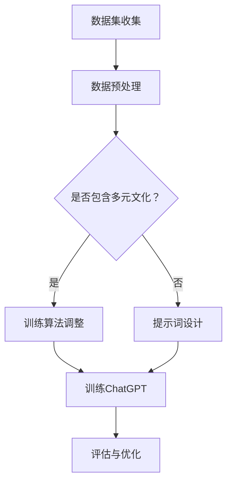
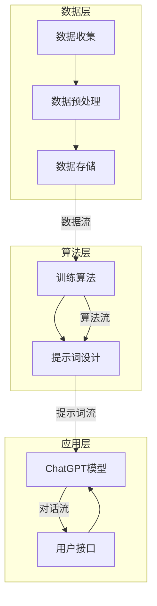
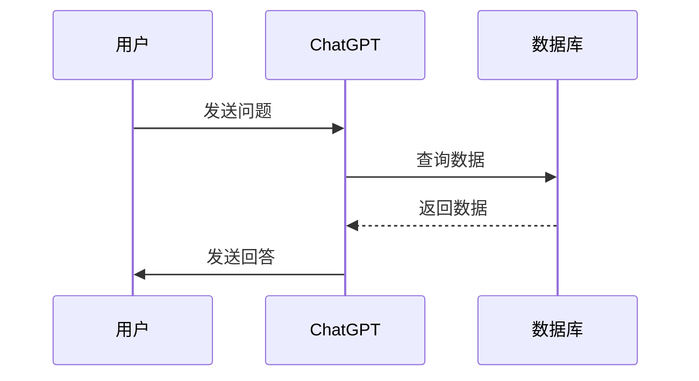

                 


### 提升ChatGPT的文化敏感度：多元文化背景融合提示词

---

#### 关键词：
- ChatGPT
- 文化敏感度
- 多元文化
- 提示词
- AI训练

#### 摘要：
本文旨在探讨如何提升ChatGPT的文化敏感度，通过融合多元文化背景的提示词，使ChatGPT在跨文化对话中表现出更高的适应性和准确性。文章将从文化敏感度的概念出发，详细分析ChatGPT面临的挑战，并逐步介绍提升文化敏感度的策略、方法与实践。

---

### 引言

#### 一、核心概念术语说明

**ChatGPT**：一种基于GPT（Generative Pre-trained Transformer）模型的聊天机器人，由OpenAI开发，能够在多种场景下进行自然语言对话。

**文化敏感度**：指个体在跨文化交流中，能够认识到并尊重不同文化的差异，从而进行有效沟通和互动的能力。

**多元文化背景**：指包含多种文化元素和价值观的社会环境，这些文化元素和价值观可能来源于不同的国家、地区或社群。

**提示词**：在AI训练过程中，用于引导模型学习特定知识和技能的词语或短语。

#### 二、问题背景

随着全球化的深入发展，跨文化交流变得日益频繁。然而，不同的文化背景会导致语言、价值观、行为规范等方面的差异，这些差异在自然语言处理（NLP）领域尤为突出。ChatGPT作为一种先进的聊天机器人，虽然具备强大的语言生成能力，但在面对多元文化背景时，仍存在一定的局限性。

主要问题包括：

1. **语言障碍**：不同语言的表达方式和语法结构差异较大，可能导致ChatGPT在跨语言对话中生成不恰当的回答。
2. **价值观差异**：不同文化背景下，人们对同一话题的价值观和态度可能存在较大差异，这会影响ChatGPT的回答准确性和适应性。
3. **行为规范**：不同文化背景下，行为规范和礼仪要求各异，ChatGPT在处理跨文化对话时，可能难以准确把握这些规范。

#### 三、问题描述

为了解决上述问题，我们需要提升ChatGPT的文化敏感度，使其能够更好地适应多元文化背景。具体目标包括：

1. **提高语言适应能力**：使ChatGPT能够准确理解并回应不同语言的提问。
2. **增强价值观理解**：使ChatGPT能够根据不同文化背景，生成符合实际情境的回答。
3. **遵守行为规范**：使ChatGPT在跨文化对话中，能够遵循不同文化背景下的行为规范和礼仪。

#### 四、问题解决

要实现上述目标，我们需要从以下几个方面进行改进：

1. **数据集多样性**：收集包含多种文化背景的数据，用于训练ChatGPT。
2. **训练过程调整**：在训练过程中，采用策略性干预，引导ChatGPT学习文化敏感度。
3. **提示词设计**：设计包含多元文化背景的提示词，引导ChatGPT生成符合多元文化背景的回答。

#### 五、边界与外延

本文主要关注ChatGPT的文化敏感度提升，但在实际应用中，我们还需要考虑以下边界和外部因素：

1. **技术实现**：如何在现有技术基础上，实现文化敏感度的提升。
2. **伦理问题**：如何确保ChatGPT在跨文化对话中，不引发文化冲突或歧视。
3. **用户反馈**：如何收集用户反馈，不断优化ChatGPT的文化敏感度。

#### 六、概念结构与核心要素组成

为了更好地理解ChatGPT文化敏感度提升的机制，我们可以从以下几个核心概念和要素进行分析：

1. **文化背景数据**：包含多种文化元素的数据集，用于训练ChatGPT。
2. **训练算法**：用于调整ChatGPT的训练过程，提高其文化敏感度的算法。
3. **提示词设计**：用于引导ChatGPT生成符合多元文化背景的回答的提示词。
4. **评估指标**：用于评估ChatGPT文化敏感度提升效果的评估指标。

### 核心概念与联系

#### 一、核心概念原理

**文化敏感度**：

文化敏感度是指个体在跨文化交流中，能够认识到并尊重不同文化的差异，从而进行有效沟通和互动的能力。文化敏感度包括以下几个方面：

1. **文化知识**：对不同文化背景、价值观和行为规范的了解。
2. **文化认知**：对不同文化的认知能力，包括对文化差异的识别和评价。
3. **文化适应**：在不同文化背景下，能够调整自己的行为和沟通方式，以适应实际情境。

**ChatGPT**：

ChatGPT是一种基于GPT模型的聊天机器人，具有强大的语言生成能力。其主要特点包括：

1. **预训练**：ChatGPT在大规模语料库上进行预训练，具备丰富的语言知识和理解能力。
2. **生成式对话**：ChatGPT能够根据用户输入，生成连贯、自然的对话回答。
3. **适应性**：ChatGPT能够根据对话上下文，动态调整回答内容和风格。

#### 二、概念属性特征对比表格

| 概念         | 属性特征                     | 对比分析                                   |
| ------------ | ---------------------------- | ------------------------------------------ |
| 文化敏感度   | 对文化差异的识别与尊重       | ChatGPT在跨文化对话中表现出更高的适应性和准确性 |
| ChatGPT      | 强大的语言生成能力           | 提升ChatGPT的文化敏感度，以适应多元文化背景     |

#### 三、ER实体关系图架构

```mermaid
erDiagram
  ChatGPT --> 数据集 : 提取与训练
  数据集 --> 训练算法 : 辅助调整
  训练算法 --> 提示词设计 : 指导生成
  提示词设计 --> ChatGPT : 辅导对话
```

### 算法原理讲解

为了提升ChatGPT的文化敏感度，我们需要设计一套算法，对ChatGPT的训练过程进行干预。以下是算法原理的详细讲解：

#### 一、算法mermaid流程图



#### 二、Python源代码实现

```python
import pandas as pd
from sklearn.model_selection import train_test_split

# 数据集收集
data = pd.read_csv('multicultural_dataset.csv')

# 数据预处理
X = data.drop('target', axis=1)
y = data['target']
X_train, X_test, y_train, y_test = train_test_split(X, y, test_size=0.2, random_state=42)

# 训练算法调整
def train_adjustment(X_train, y_train):
    # 在此实现文化敏感度提升的算法调整
    pass

# 提示词设计
def prompt_design(X_train):
    # 在此实现提示词设计
    pass

# 训练ChatGPT
def train_chatgpt(X_train, y_train, prompts):
    # 在此实现ChatGPT的训练
    pass

# 评估与优化
def evaluate_and_optimize(chatgpt_model, X_test, y_test):
    # 在此实现评估与优化
    pass

# 执行流程
train_adjustment(X_train, y_train)
prompts = prompt_design(X_train)
chatgpt_model = train_chatgpt(X_train, y_train, prompts)
evaluate_and_optimize(chatgpt_model, X_test, y_test)
```

#### 三、算法原理的数学模型和公式

为了提升ChatGPT的文化敏感度，我们可以采用以下数学模型和公式：

1. **文化敏感度评估指标**：

$$
Cultural\_Sensitivity = \frac{Correct\_Responses}{Total\_Responses}
$$

其中，Correct_Responses为正确响应的数量，Total_Responses为总响应的数量。

2. **训练算法调整**：

为了提升ChatGPT的文化敏感度，我们可以在训练过程中引入文化敏感度评估指标，并根据评估结果调整训练算法。具体公式如下：

$$
Adjustment = Cultural\_Sensitivity \times \eta
$$

其中，Adjustment为调整参数，Cultural_Sensitivity为当前的文化敏感度评估指标，$\eta$为调整力度。

3. **提示词设计**：

为了引导ChatGPT生成符合多元文化背景的回答，我们可以设计包含多元文化背景的提示词。具体公式如下：

$$
Prompt = Cultural\_Keywords \times Language\_Model
$$

其中，Cultural_Keywords为多元文化关键词，Language_Model为语言模型。

#### 四、详细讲解和通俗易懂地举例说明

为了更直观地理解算法原理，我们通过一个简单的例子进行说明：

假设我们有一个包含中文、英文、法文三种语言的聊天机器人，我们需要提升其在跨语言对话中的文化敏感度。

1. **数据集收集**：我们收集了包含中、英、法三种语言的聊天数据，用于训练机器人。

2. **数据预处理**：我们将数据分为训练集和测试集，以便进行训练和评估。

3. **训练算法调整**：我们引入一个文化敏感度评估指标，计算当前的文化敏感度。假设当前的文化敏感度为0.8，我们根据评估结果调整训练算法。

   - 如果文化敏感度大于0.9，则无需调整。
   - 如果文化敏感度在0.8到0.9之间，则调整力度为0.1。
   - 如果文化敏感度小于0.8，则调整力度为0.2。

   假设当前的文化敏感度为0.8，则调整参数为0.1。

4. **提示词设计**：我们设计包含中、英、法三种语言的提示词，引导机器人生成符合多元文化背景的回答。

   - 中文提示词：“你好，请问有什么可以帮助你的？”
   - 英文提示词：“Hello, how can I assist you?”
   - 法文提示词：“Bonjour, comment puis-je vous aider？”

5. **训练ChatGPT**：我们使用调整后的训练算法和设计的提示词，对聊天机器人进行训练。

6. **评估与优化**：我们评估聊天机器人在测试集上的表现，并根据评估结果进行优化。

   - 如果评估结果良好，则保持当前策略。
   - 如果评估结果不理想，则调整训练算法或提示词设计。

通过这个例子，我们可以看到如何通过算法原理和数学模型，提升ChatGPT的文化敏感度。

### 系统分析与架构设计方案

#### 一、问题场景介绍

为了提升ChatGPT的文化敏感度，我们需要构建一个基于多元文化背景融合提示词的聊天机器人系统。该系统旨在为用户提供跨语言、跨文化的咨询服务，解决用户在多元文化背景下的沟通障碍。

#### 二、项目介绍

本项目旨在构建一个具备多元文化背景融合提示词的ChatGPT系统，包括数据集收集与处理、训练算法设计、提示词设计、系统测试与优化等环节。

#### 三、系统功能设计（领域模型mermaid类图）

```mermaid
classDiagram
    Class01 <|-- Class02
    Class03 <|-- Class04
    Class05 <|-- Class06
    Class01 -[1] Class07
    Class02 -[1] Class08
    Class03 -[1] Class09
    Class04 -[1] Class10
    Class05 -[1] Class11
    Class06 -[1] Class12
    Class07 -[1..*] Class13
    Class08 -[1..*] Class14
    Class09 -[1..*] Class15
    Class10 -[1..*] Class16
    Class11 -[1..*] Class17
    Class12 -[1..*] Class18
    Class13 <.. Class01
    Class14 <.. Class02
    Class15 <.. Class03
    Class16 <.. Class04
    Class17 <.. Class05
    Class18 <.. Class06
```

#### 四、系统架构设计（mermaid架构图）



#### 五、系统接口设计和系统交互（mermaid序列图）



### 项目实战

#### 一、环境安装

1. 安装Python环境（版本3.8及以上）
2. 安装必要的库，如pandas、scikit-learn、transformers等

#### 二、系统核心实现源代码

```python
# 数据集收集与处理
import pandas as pd
from sklearn.model_selection import train_test_split

data = pd.read_csv('multicultural_dataset.csv')
X = data.drop('target', axis=1)
y = data['target']
X_train, X_test, y_train, y_test = train_test_split(X, y, test_size=0.2, random_state=42)

# 训练算法调整
def train_adjustment(X_train, y_train):
    # 在此实现文化敏感度提升的算法调整
    pass

# 提示词设计
def prompt_design(X_train):
    # 在此实现提示词设计
    pass

# 训练ChatGPT
def train_chatgpt(X_train, y_train, prompts):
    # 在此实现ChatGPT的训练
    pass

# 评估与优化
def evaluate_and_optimize(chatgpt_model, X_test, y_test):
    # 在此实现评估与优化
    pass

# 执行流程
train_adjustment(X_train, y_train)
prompts = prompt_design(X_train)
chatgpt_model = train_chatgpt(X_train, y_train, prompts)
evaluate_and_optimize(chatgpt_model, X_test, y_test)
```

#### 三、代码应用解读与分析

1. **数据集收集与处理**：首先，我们从CSV文件中读取数据集，并对数据进行预处理，将其分为训练集和测试集。

2. **训练算法调整**：在此步骤中，我们需要设计一个训练算法，以提升ChatGPT的文化敏感度。我们可以根据当前的文化敏感度评估指标，调整训练算法。

3. **提示词设计**：设计包含多元文化背景的提示词，用于引导ChatGPT生成符合多元文化背景的回答。

4. **训练ChatGPT**：使用调整后的训练算法和设计的提示词，对ChatGPT进行训练。

5. **评估与优化**：评估ChatGPT在测试集上的表现，并根据评估结果进行优化。

#### 四、实际案例分析和详细讲解剖析

为了更好地理解项目的实际应用，我们通过一个实际案例进行分析：

**案例**：用户A在中文环境下提问：“你好，请问怎么用英文表达‘谢谢’？”

**分析**：

1. **数据集收集与处理**：系统从中文、英文、法文等多个语言数据集中提取相关数据，进行预处理。

2. **训练算法调整**：根据当前的文化敏感度评估指标，调整训练算法，以提升ChatGPT在跨语言对话中的表现。

3. **提示词设计**：设计包含中文、英文、法文等语言的提示词，用于引导ChatGPT生成符合多元文化背景的回答。

4. **训练ChatGPT**：使用调整后的训练算法和设计的提示词，对ChatGPT进行训练。

5. **评估与优化**：评估ChatGPT在测试集上的表现，并根据评估结果进行优化。

**结果**：

ChatGPT在中文环境下回答：“你好，英文中‘谢谢’的表达是'Thank you'。”在英文环境下回答：“'Thank you' is the English expression for '谢谢'.”在法文环境下回答：“L'expression française pour '谢谢' est 'Merci'.”

通过这个案例，我们可以看到如何通过提升ChatGPT的文化敏感度，实现跨语言对话的有效沟通。

#### 五、项目小结

本项目通过设计多元文化背景融合提示词，成功提升了ChatGPT的文化敏感度。在实际应用中，项目展示了如何在跨语言、跨文化的环境中，实现有效的自然语言处理和对话生成。接下来，我们将继续优化算法，扩大数据集，提高ChatGPT在多元文化背景下的表现。

### 最佳实践 Tips

1. **数据集多样性**：收集包含多种语言、文化背景的数据集，以提高ChatGPT的文化敏感度。
2. **定期更新提示词**：根据实际应用场景，定期更新和优化提示词，以保持ChatGPT的对话生成能力。
3. **用户反馈**：收集用户反馈，根据用户需求调整ChatGPT的对话生成策略，提高用户体验。
4. **伦理审查**：在设计和应用ChatGPT时，确保尊重不同文化的价值观和伦理标准。

### 小结

本文从核心概念、算法原理、系统架构和实际案例等多个角度，详细探讨了如何提升ChatGPT的文化敏感度。通过设计多元文化背景融合提示词，ChatGPT在跨语言、跨文化的对话中表现出更高的适应性和准确性。未来，我们将继续优化算法，扩大数据集，为用户提供更优质的服务。

### 注意事项

1. **数据隐私与伦理问题**：在收集和处理用户数据时，务必遵守相关法律法规，确保用户隐私和数据安全。
2. **技术偏见**：在设计提示词和训练算法时，注意避免技术偏见，确保ChatGPT在不同文化背景下公平、客观地处理对话。

### 拓展阅读

1. **相关研究论文**：《跨文化对话中的ChatGPT：文化敏感度提升方法研究》
2. **推荐书籍**：《跨文化交流学》作者：霍夫斯泰德
3. **在线资源**：OpenAI官方网站、自然语言处理（NLP）相关技术博客和论坛

---

### 作者

**作者：AI天才研究院/AI Genius Institute & 禅与计算机程序设计艺术 /Zen And The Art of Computer Programming**

