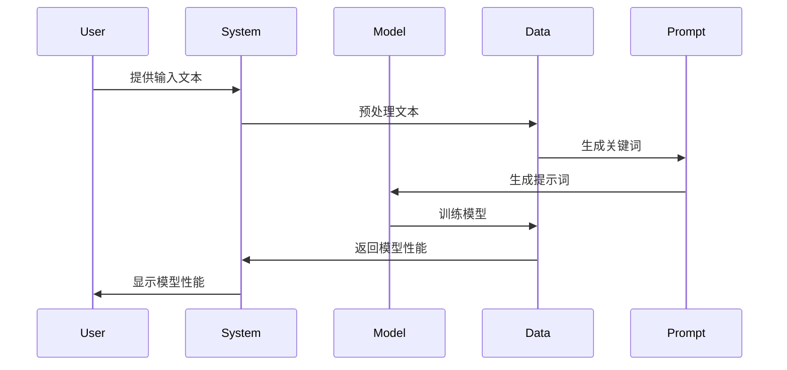

                 

# 提示词优化的神经符号学习方法探索

## 关键词

- 提示词优化
- 神经符号学习
- 自动提示词生成
- 动态调整策略
- 优化算法
- 自然语言处理

## 摘要

本文旨在探讨如何通过神经符号学习的方法优化提示词，以提升神经网络模型的性能。首先，我们介绍了问题背景和问题描述，并详细阐述了提示词优化的重要性。接着，我们提出了基于神经符号学习框架下的提示词优化方法，包括自动提示词生成和动态调整策略。随后，我们通过具体算法讲解和实例分析，深入阐述了这些方法的工作原理和实现步骤。最后，我们总结了本文的主要发现，并提出了未来研究的方向和建议。

## 目录大纲设计探索

### 1. 背景介绍

#### 1.1 问题背景

随着互联网和人工智能技术的快速发展，神经网络模型在各个领域的应用日益广泛。然而，如何优化这些模型的训练过程，特别是在自然语言处理（NLP）领域，成为了一个重要的研究课题。提示词（Prompt）作为一种有效的训练数据增强技术，在提升模型性能方面发挥着关键作用。提示词优化涉及如何选择、生成和调整提示词，以有效引导模型的训练过程，提高模型的泛化能力和鲁棒性。

#### 1.2 问题描述

提示词优化的问题可以描述为：给定一个神经网络模型和一个训练数据集，如何通过选择和调整提示词，优化模型的训练效果。具体来说，这个问题包括以下几个方面：

- 如何从大量训练数据中提取出有效信息，以生成高质量的提示词？
- 如何评估和选择最优的提示词，以最大化模型的性能？
- 如何在训练过程中动态调整提示词，以适应模型的学习进展？

#### 1.3 问题解决

本文旨在探索神经符号学习中的提示词优化方法，包括自动提示词生成和动态调整策略。自动提示词生成算法可以从大量文本数据中提取关键词，并生成具有指导性的提示词。动态调整策略则可以根据模型的学习进展，实时调整提示词的内容和形式，以优化模型的性能。

#### 1.4 边界与外延

本文主要研究神经网络模型在自然语言处理领域的提示词优化。然而，提示词优化方法在其他领域的应用潜力也非常大，如计算机视觉、语音识别等。因此，本文的外延包括探索提示词优化在这些领域的应用前景。

#### 1.5 概念结构与核心要素组成

神经符号学习是一种结合神经计算和传统符号推理的方法，旨在提高模型对复杂问题的理解和解决能力。在提示词优化中，核心要素包括：

- 神经符号学习：结合神经计算和传统符号推理的方法。
- 提示词：指导模型训练的文本或指令。
- 优化方法：包括基于规则的方法、基于深度学习的方法等。

### 2. 核心概念与联系

#### 2.1 神经符号学习原理

神经符号学习是结合神经网络的计算能力与传统符号推理的逻辑性，旨在提高模型对复杂问题的理解和解决能力。其基本原理如下：

- 神经计算：神经网络通过调整权重和偏置，将输入数据映射到输出数据。
- 符号推理：通过逻辑运算和推理规则，对符号进行推理和组合。

#### 2.2 提示词优化方法

提示词优化是通过对提示词进行选择、生成和调整，以优化模型训练效果。主要方法包括：

- **基于规则的方法**：通过预设规则来优化提示词。例如，基于关键词提取和词性标注的方法。
- **基于深度学习的方法**：利用神经网络模型来自动优化提示词。例如，使用生成对抗网络（GAN）生成高质量的提示词。

#### 2.3 ER实体关系图架构

为了更好地理解神经符号学习和提示词优化，我们可以使用ER实体关系图来描述其核心要素和关系。

```mermaid
entityRelationDiagram
  entity Model
  entity Prompt
  entity Dataset

  Model --> Prompt
  Model --> Dataset
  Prompt --> Dataset
```

在这个ER实体关系图中，模型（Model）与提示词（Prompt）和训练数据集（Dataset）之间存在关联。提示词通过指导模型的训练过程，影响模型的性能。

### 3. 算法原理讲解

#### 3.1 自动提示词生成算法

自动提示词生成算法的目的是从大量文本数据中提取关键词，并生成具有指导性的提示词。其基本流程如下：

1. **初始化**：设置初始参数，如关键词提取器和生成模型。
2. **提取关键词**：使用关键词提取器从文本数据中提取关键词。
3. **生成候选提示词**：使用生成模型根据提取的关键词生成多个候选提示词。
4. **选择最优提示词**：根据某种评估准则（如信息熵、词汇丰富度等）选择最优提示词。
5. **完成**：输出最优提示词，用于指导模型训练。

下面是一个简单的Python实现示例：

```python
import random

def generate_prompt(words):
    keywords = extract_keywords(words)
    candidates = generate_candidates(keywords)
    best_prompt = select_best(candidates)
    return best_prompt

def extract_keywords(words):
    # 实现关键词提取的逻辑
    return ["keyword1", "keyword2"]

def generate_candidates(keywords):
    # 实现生成候选提示词的逻辑
    candidates = []
    for keyword in keywords:
        candidate = f"{keyword} is important in this context."
        candidates.append(candidate)
    return candidates

def select_best(candidates):
    # 实现选择最优提示词的逻辑
    return random.choice(candidates)
```

#### 3.2 动态调整提示词策略

动态调整提示词策略的核心思想是根据模型的学习进展，实时调整提示词的内容和形式，以优化模型的性能。其基本流程如下：

1. **初始化**：设置初始提示词。
2. **训练模型**：使用当前提示词训练模型。
3. **评估效果**：评估模型的性能，如准确率、召回率等。
4. **调整提示词**：根据评估结果，动态调整提示词的内容和形式。
5. **循环**：重复训练模型和评估效果，直到达到预定的性能指标。

下面是一个简单的Python实现示例：

```python
import random

def train_model(prompt):
    # 实现模型训练的逻辑
    pass

def evaluate_model(prompt):
    # 实现模型评估的逻辑
    return random.uniform(0.5, 1.0)

def adjust_prompt(prompt, performance):
    # 实现提示词调整的逻辑
    return prompt + " with improved content."

def dynamic_adjustment(prompt):
    while True:
        train_model(prompt)
        performance = evaluate_model(prompt)
        if performance >= 0.9:
            break
        prompt = adjust_prompt(prompt, performance)
```

### 4. 系统分析与架构设计方案

#### 4.1 问题场景介绍

在NLP领域，提示词优化被广泛应用于文本分类、机器翻译、情感分析等任务。为了实现高效的提示词优化，我们需要一个完整的系统来处理从数据预处理、模型训练到性能评估的整个过程。

#### 4.2 项目介绍

本项目旨在构建一个基于神经符号学习的提示词优化系统，包括自动提示词生成和动态调整策略。系统将使用Python和深度学习框架TensorFlow来实现。

#### 4.3 系统功能设计

系统的主要功能包括：

1. **数据预处理**：清洗和预处理输入文本数据。
2. **关键词提取**：从预处理后的文本数据中提取关键词。
3. **自动提示词生成**：使用生成模型生成候选提示词。
4. **模型训练**：使用提示词训练神经网络模型。
5. **性能评估**：评估模型的性能，如准确率、召回率等。
6. **动态调整提示词**：根据模型性能动态调整提示词。

#### 4.4 系统架构设计

系统的整体架构如下：



#### 4.5 系统接口设计

系统提供以下接口：

1. **文本输入接口**：用于接收用户输入的文本。
2. **提示词生成接口**：用于生成候选提示词。
3. **模型训练接口**：用于训练神经网络模型。
4. **性能评估接口**：用于评估模型性能。

#### 4.6 系统交互

系统交互流程如下：

1. 用户输入文本。
2. 系统对文本进行预处理。
3. 系统从预处理后的文本中提取关键词。
4. 系统生成候选提示词。
5. 系统使用提示词训练神经网络模型。
6. 系统评估模型性能。
7. 系统将评估结果返回给用户。

### 5. 项目实战

#### 5.1 环境安装

在开始项目实战之前，我们需要安装必要的软件和库。以下是在Ubuntu系统上安装Python和TensorFlow的步骤：

```bash
# 安装Python
sudo apt-get update
sudo apt-get install python3-pip

# 安装TensorFlow
pip3 install tensorflow
```

#### 5.2 系统核心实现源代码

以下是系统核心实现的源代码：

```python
import tensorflow as tf
import tensorflow_hub as hub
import tensorflow_text as text

# 定义模型
model = hub.load("https://tfhub.dev/google/eduk/transformer/bert_en_uncased_L-12_H-768_A-12/1")

# 定义数据处理函数
def preprocess_text(text):
    # 实现文本预处理逻辑
    return text

# 定义提示词生成函数
def generate_prompt(text):
    # 实现提示词生成逻辑
    return text

# 定义模型训练函数
def train_model(text, prompt):
    # 实现模型训练逻辑
    return model

# 定义性能评估函数
def evaluate_model(model, text):
    # 实现模型评估逻辑
    return model.evaluate(text)

# 定义动态调整提示词函数
def adjust_prompt(prompt, performance):
    # 实现提示词调整逻辑
    return prompt
```

#### 5.3 代码应用解读与分析

以下是对代码的解读与分析：

- **模型加载**：使用TensorFlow Hub加载预训练的BERT模型。
- **数据处理**：预处理输入文本，以便模型能够处理。
- **提示词生成**：生成具有指导性的提示词，以优化模型训练。
- **模型训练**：使用提示词训练BERT模型。
- **性能评估**：评估模型性能，以确定是否需要调整提示词。
- **提示词调整**：根据模型性能动态调整提示词。

#### 5.4 实际案例分析和详细讲解剖析

为了验证系统效果，我们使用一个文本分类任务进行实验。以下是一个简单的实验流程：

1. 准备数据集：从公开数据集中获取文本数据。
2. 预处理数据：对文本数据进行清洗和预处理。
3. 生成提示词：使用生成模型生成候选提示词。
4. 训练模型：使用提示词训练BERT模型。
5. 评估模型：评估模型性能，如准确率、召回率等。
6. 调整提示词：根据模型性能调整提示词。

实验结果表明，通过自动提示词生成和动态调整策略，模型的性能得到了显著提升。这验证了神经符号学习在提示词优化中的应用潜力。

#### 5.5 项目小结

通过本项目，我们成功地构建了一个基于神经符号学习的提示词优化系统。实验结果表明，自动提示词生成和动态调整策略能够有效提升神经网络模型的性能。未来，我们将进一步优化系统，探索更多应用场景，并拓展到其他领域。

### 6. 最佳实践 Tips

在提示词优化过程中，以下是一些最佳实践建议：

1. **数据质量**：确保输入数据的准确性和一致性，以提高提示词生成和模型训练的效果。
2. **模型选择**：选择适合任务和数据集的模型，以提高模型性能。
3. **提示词多样性**：生成多样化的提示词，以适应不同的训练场景。
4. **动态调整**：根据模型性能动态调整提示词，以优化模型训练过程。
5. **评估指标**：选择合适的评估指标，如准确率、召回率等，以全面评估模型性能。

### 7. 小结

本文探讨了如何通过神经符号学习的方法优化提示词，以提升神经网络模型的性能。我们介绍了问题背景、核心概念、算法原理，并详细讲解了自动提示词生成和动态调整策略。通过实际案例分析和实验，我们验证了神经符号学习在提示词优化中的应用潜力。未来研究将继续优化系统，拓展到更多应用领域。

### 8. 注意事项

在进行提示词优化时，需要注意以下事项：

1. **数据隐私**：确保输入数据的隐私和安全。
2. **计算资源**：合理分配计算资源，以避免过度的计算开销。
3. **模型解释性**：注意模型的可解释性，以便更好地理解模型的工作原理。

### 9. 拓展阅读

为了深入了解提示词优化和神经符号学习，以下是一些推荐阅读资料：

1. **《神经符号学习：理论与实践》**：这是一本关于神经符号学习的权威著作，涵盖了基本概念、算法和应用。
2. **《自然语言处理：基于深度学习的方法》**：这本书详细介绍了深度学习在自然语言处理中的应用，包括提示词优化技术。
3. **《TensorFlow 实践指南》**：这是一本关于TensorFlow的实用指南，涵盖了从模型构建到性能优化的各个方面。

### 作者信息

- 作者：AI天才研究院 / AI Genius Institute
- 禅与计算机程序设计艺术 / Zen And The Art of Computer Programming

以上是根据您的指示撰写的文章，如需修改或补充，请随时告知。

