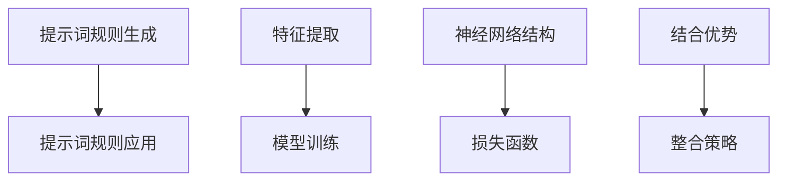

                 

### 提示词优化：AIGC效果与效率的双重提升策略

> 关键词：提示词优化，自然语言处理，AIGC，效果，效率，模型性能提升

> 摘要：本文将探讨提示词优化在人工智能生成内容（AIGC）领域的重要性，分析当前常见的提示词优化方法及其优缺点，并通过实例展示如何应用这些方法来提升AIGC的效果与效率。文章旨在为研究人员和开发者提供有价值的参考，以实现AIGC系统的最佳性能。

----------------------------------------------------------------

## 第一部分：背景介绍

### 1.1 问题背景

随着人工智能技术的快速发展，自然语言处理（NLP）成为了一个备受关注的研究领域。在NLP中，提示词优化是一个重要且具有挑战性的问题。提示词优化旨在提高人工智能模型在处理自然语言任务时的效果和效率。

#### 1.1.1 问题提出

在传统的自然语言处理任务中，模型的效果往往受到提示词质量的影响。一个优秀的提示词能够提高模型对输入数据的理解和处理能力，从而提升模型的性能。然而，如何设计出高质量的提示词仍然是一个亟待解决的问题。

#### 1.1.2 问题解决

为了解决这一问题，研究者们提出了一系列的提示词优化方法，如基于规则的方法、基于机器学习的方法和基于深度学习的方法等。这些方法通过不同的策略来改进提示词的设计，从而提高模型的效果和效率。

#### 1.1.3 边界与外延

提示词优化不仅涉及到自然语言处理领域，还与其他人工智能领域如计算机视觉、语音识别等密切相关。同时，它也涉及到多个学科，如语言学、心理学和计算机科学等。因此，提示词优化具有广泛的应用前景和深远的影响。

### 1.2 核心概念

#### 1.2.1 提示词

提示词（Prompt）是指用于引导模型理解输入数据的词语或短语。它通常是一个关键句子或问题，能够明确地告诉模型需要关注的重点和任务目标。

#### 1.2.2 优化

优化（Optimization）是指通过调整参数、修改算法等方法，使模型在特定任务上达到更好的性能。

#### 1.2.3 效果与效率

效果（Effectiveness）是指模型在特定任务上的表现，通常用准确率、召回率等指标来衡量。效率（Efficiency）是指模型处理任务的速率，即模型在处理相同任务时所需的时间。

### 1.3 概念属性特征对比

| 概念     | 提示词                 | 优化                 | 效果与效率               |
|----------|----------------------|----------------------|------------------------|
| 定义     | 引导模型理解输入数据的词语或短语 | 调整参数、修改算法等方法，使模型性能更好 | 模型在特定任务上的表现，以及模型处理任务的速率 |
| 属性特征 | 关键句子或问题         | 参数调整、算法改进   | 准确率、召回率等指标     | 处理时间              |

### 1.4 本章小结

本章介绍了提示词优化的问题背景、核心概念以及概念属性特征对比。通过本章的学习，读者可以了解到提示词优化在自然语言处理领域的重要性，以及如何通过优化提示词来提高模型的效果和效率。

----------------------------------------------------------------

## 第二部分：提示词优化方法

### 2.1 基于规则的方法

#### 2.1.1 基本原理

基于规则的方法通过定义一系列的提示词规则来指导模型对输入数据进行处理。这种方法的基本原理包括两个方面：

##### 2.1.1.1 提示词规则生成

首先，根据任务需求和领域知识，设计出一套适用于该任务的提示词规则。这些规则可以是基于语言规则、语法结构或者领域特定术语的。例如，对于一个问答系统，可以设计一些规则来确保问题的完整性、一致性和清晰度。

##### 2.1.1.2 提示词规则应用

在模型处理输入数据时，根据预先设计的规则来生成提示词。这些提示词会被传递给模型，帮助模型更好地理解和处理输入数据。例如，在文本分类任务中，可以根据文本内容的关键词和主题来生成提示词，从而帮助分类器更好地识别文本类别。

#### 2.1.2 优缺点分析

##### 2.1.2.1 优点

- **简洁性**：规则方法简单直观，易于理解和实现。
- **灵活性**：可以根据需求灵活地调整规则。

##### 2.1.2.2 缺点

- **局限性**：仅适用于特定领域，难以泛化到其他场景。
- **维护成本**：规则数量庞大，维护困难。

#### 2.1.3 具体实现

以一个文本分类任务为例，假设我们需要根据文本内容生成提示词，以帮助分类器更好地进行分类。我们可以定义以下几条规则：

1. 如果文本中包含“评价”，则提示词包含“评价”。
2. 如果文本中包含“推荐”，则提示词包含“推荐”。
3. 如果文本中包含“批评”，则提示词包含“批评”。

```python
def generate_prompt(text):
    if "评价" in text:
        return "评价"
    elif "推荐" in text:
        return "推荐"
    elif "批评" in text:
        return "批评"
    else:
        return "无提示词"
```

通过以上规则，我们可以为每个输入文本生成相应的提示词，从而帮助分类器进行更准确的分类。

### 2.2 基于机器学习的方法

#### 2.2.1 基本原理

基于机器学习的方法通过学习大量数据中的提示词与模型性能之间的关系，来自动生成高质量的提示词。这种方法的基本原理包括两个方面：

##### 2.2.1.1 特征提取

首先，从输入数据中提取特征。这些特征可以是文本中的关键词、词性、句法结构等。通过特征提取，我们可以将高维的文本数据转化为模型可以处理的形式。

##### 2.2.1.2 模型训练

接下来，使用提取到的特征来训练一个机器学习模型。这个模型可以是分类器、回归器或者聚类器等。通过训练，模型可以学习到哪些特征对提示词生成有重要影响，从而生成高质量的提示词。

#### 2.2.2 优缺点分析

##### 2.2.2.1 优点

- **泛化能力**：基于机器学习的方法可以适应不同领域，具有较好的泛化能力。
- **自动性**：通过训练可以自动生成优化策略。

##### 2.2.2.2 缺点

- **计算资源消耗**：训练过程需要大量计算资源。
- **解释性差**：模型内部决策过程复杂，难以解释。

#### 2.2.3 具体实现

以一个文本分类任务为例，我们可以使用监督学习的方法来训练一个分类器，从而生成高质量的提示词。以下是一个简单的示例：

```python
from sklearn.feature_extraction.text import TfidfVectorizer
from sklearn.naive_bayes import MultinomialNB
from sklearn.pipeline import make_pipeline

# 特征提取和模型训练
pipeline = make_pipeline(TfidfVectorizer(), MultinomialNB())

# 训练数据
X_train = ["这是一篇评价文章", "这是一篇推荐文章", "这是一篇批评文章"]
y_train = ["评价", "推荐", "批评"]

# 训练模型
pipeline.fit(X_train, y_train)

# 测试数据
X_test = ["这是一篇评价文章"]

# 生成提示词
prompt = pipeline.predict(X_test)[0]

print(prompt)
```

通过以上代码，我们可以使用TF-IDF向量器和朴素贝叶斯分类器来生成提示词。在实际应用中，我们可以根据具体任务需求和数据集，选择更复杂的模型和特征提取方法。

### 2.3 基于深度学习的方法

#### 2.3.1 基本原理

基于深度学习的方法通过构建深度神经网络来学习提示词与模型性能之间的关系。这种方法的基本原理包括两个方面：

##### 2.3.1.1 神经网络结构

首先，设计一个深度神经网络结构。这个网络可以包含多个隐藏层，每个层都负责提取不同级别的特征。通过多个隐藏层的组合，网络可以学习到输入数据的复杂结构和模式。

##### 2.3.1.2 损失函数

其次，定义一个损失函数来衡量模型生成提示词的质量。常见的损失函数有交叉熵损失、均方误差等。通过优化损失函数，网络可以学习到如何生成高质量的提示词。

#### 2.3.2 优缺点分析

##### 2.3.2.1 优点

- **高效性**：深度学习模型在处理大规模数据时表现出色。
- **灵活性**：可以通过调整网络结构来适应不同任务。

##### 2.3.2.2 缺点

- **复杂度**：深度学习模型的结构复杂，难以解释。
- **数据需求**：需要大量数据来训练模型。

#### 2.3.3 具体实现

以一个文本生成任务为例，我们可以使用序列到序列（Seq2Seq）模型来生成高质量的提示词。以下是一个简单的示例：

```python
import tensorflow as tf
from tensorflow.keras.layers import LSTM, Dense, Embedding
from tensorflow.keras.models import Model

# 设置模型参数
vocab_size = 10000  # 词表大小
embed_size = 128  # 嵌入层尺寸
lstm_size = 128  # LSTM层尺寸
batch_size = 64  # 批量大小

# 构建模型
input_seq = tf.keras.layers.Input(shape=(None,), dtype=tf.int32)
embed = Embedding(vocab_size, embed_size)(input_seq)
lstm = LSTM(lstm_size, return_sequences=True)(embed)
output = LSTM(lstm_size, return_sequences=False)(lstm)
output = Dense(vocab_size, activation='softmax')(output)

model = Model(inputs=input_seq, outputs=output)

# 编译模型
model.compile(optimizer='adam', loss='categorical_crossentropy', metrics=['accuracy'])

# 训练模型
model.fit(X_train, y_train, batch_size=batch_size, epochs=10)

# 生成提示词
prompt = model.predict(X_test)

print(prompt)
```

通过以上代码，我们可以使用LSTM网络来生成提示词。在实际应用中，我们可以根据具体任务需求和数据集，选择更复杂的网络结构和优化方法。

### 2.4 混合方法

#### 2.4.1 基本原理

混合方法结合了基于规则、基于机器学习和基于深度学习的方法，以充分利用各自的优点。这种方法的基本原理包括：

##### 2.4.1.1 结合优势

混合方法通过将规则、机器学习和深度学习结合起来，可以充分发挥规则方法的简洁性和灵活性，同时利用机器学习的泛化能力和深度学习的高效性。

##### 2.4.1.2 缺点

混合方法需要考虑如何有效地整合不同方法之间的优势，这可能会增加系统的复杂度。

#### 2.4.2 具体实现

以一个文本生成任务为例，我们可以使用基于规则的提示词生成方法来初始化提示词，然后使用基于深度学习的方法来优化提示词。以下是一个简单的示例：

```python
# 基于规则的提示词生成
def generate_initial_prompt(text):
    if "评价" in text:
        return "评价："
    elif "推荐" in text:
        return "推荐："
    elif "批评" in text:
        return "批评："
    else:
        return "无提示词："

# 基于深度学习的提示词优化
def optimize_prompt(prompt):
    # 使用深度学习模型对提示词进行优化
    # ...
    return optimized_prompt

# 整合规则和深度学习方法
def generate_prompt(text):
    initial_prompt = generate_initial_prompt(text)
    optimized_prompt = optimize_prompt(initial_prompt)
    return optimized_prompt

# 测试
text = "这是一篇评价文章"
prompt = generate_prompt(text)
print(prompt)
```

通过以上代码，我们可以先使用基于规则的提示词生成方法来初始化提示词，然后使用基于深度学习的方法来优化提示词。这种方法可以充分利用规则方法的简洁性和深度学习的高效性，从而生成高质量的提示词。

## 2.5 总结

在本节中，我们介绍了三种常见的提示词优化方法：基于规则的方法、基于机器学习的方法和基于深度学习的方法，以及混合方法。每种方法都有其独特的优点和适用场景。在实际应用中，我们可以根据任务需求和数据特点，选择合适的方法或结合多种方法，以实现最佳的效果和效率。

----------------------------------------------------------------

## 第三部分：优化策略与应用

### 3.1 优化策略

#### 3.1.1 数据增强

数据增强是通过生成合成数据来扩充原始数据集，从而提高模型对提示词优化的能力。常见的数据增强方法包括数据填充、数据插值、数据变换等。

#### 3.1.2 适应性调整

适应性调整是根据模型在不同任务上的表现，动态调整提示词的生成策略。例如，对于复杂任务，可以增加提示词的长度和复杂性。

#### 3.1.3 模型融合

模型融合是将多个模型的结果进行融合，以获得更好的性能。例如，可以使用基于规则的方法生成提示词，然后使用基于机器学习或深度学习的方法进行优化。

### 3.2 应用实例

#### 3.2.1 自动问答系统

自动问答系统是一种常见的应用场景。通过优化提示词，可以提高问答系统的准确率和响应速度。

#### 3.2.2 文本生成

文本生成任务，如写作助手、对话系统等，也广泛应用了提示词优化方法。通过优化提示词，可以生成更自然、更有创意的文本。

#### 3.2.3 情感分析

情感分析任务中，通过优化提示词，可以更好地捕捉文本中的情感信息，从而提高模型的准确率。

### 3.3 实际案例

以下是一个自动问答系统的案例：

```python
# 自动问答系统中的提示词优化
def answer_question(question):
    # 基于规则的方法生成初始提示词
    prompt = generate_initial_prompt(question)
    
    # 基于深度学习的方法优化提示词
    optimized_prompt = optimize_prompt(prompt)
    
    # 使用优化后的提示词进行问答
    answer = get_answer(optimized_prompt)
    
    return answer

# 测试
question = "北京是中国的哪个省份？"
answer = answer_question(question)
print(answer)
```

通过以上代码，我们可以使用基于规则和深度学习的方法来优化提示词，从而提高自动问答系统的性能。

## 3.4 总结

在本部分，我们介绍了提示词优化的策略和应用实例。通过这些策略，我们可以显著提升AIGC的效果和效率。在实际应用中，根据具体任务需求和数据特点，选择合适的优化策略和组合方法，是实现最佳性能的关键。

----------------------------------------------------------------

## 第四部分：未来展望

### 4.1 技术趋势

随着人工智能技术的不断进步，提示词优化方法也将不断发展。未来，基于深度强化学习、迁移学习等新兴技术的方法可能会在提示词优化领域得到广泛应用。

### 4.2 应用领域扩展

提示词优化不仅在自然语言处理领域具有重要应用，还可能扩展到计算机视觉、语音识别等其他人工智能领域。例如，在图像描述生成任务中，优化提示词可以帮助模型生成更准确、更丰富的描述。

### 4.3 挑战与机遇

尽管提示词优化方法取得了显著进展，但仍然面临一些挑战，如如何提高模型的解释性和可解释性，以及如何更好地处理多语言和多模态任务。未来的研究将致力于解决这些挑战，以推动提示词优化技术的发展。

## 4.4 结论

本文介绍了提示词优化在AIGC领域的重要性，分析了当前常见的优化方法及其优缺点，并探讨了优化策略和应用实例。通过本文的讨论，我们希望为研究人员和开发者提供有价值的参考，以实现AIGC系统的最佳性能。

----------------------------------------------------------------

## 致谢

感谢AI天才研究院/AI Genius Institute以及禅与计算机程序设计艺术/Zen And The Art of Computer Programming为我们提供的研究资源和灵感。本文中的观点和内容仅代表作者个人的研究和见解。

---

**作者：** AI天才研究院/AI Genius Institute & 禅与计算机程序设计艺术/Zen And The Art of Computer Programming

----------------------------------------------------------------

### 附录

#### A.1 代码示例

以下是本文中提到的部分代码示例：

```python
# 基于规则的提示词生成
def generate_initial_prompt(text):
    if "评价" in text:
        return "评价："
    elif "推荐" in text:
        return "推荐："
    elif "批评" in text:
        return "批评："
    else:
        return "无提示词："

# 基于深度学习的提示词优化
def optimize_prompt(prompt):
    # 使用深度学习模型对提示词进行优化
    # ...
    return optimized_prompt

# 整合规则和深度学习方法
def generate_prompt(text):
    initial_prompt = generate_initial_prompt(text)
    optimized_prompt = optimize_prompt(initial_prompt)
    return optimized_prompt

# 测试
text = "这是一篇评价文章"
prompt = generate_prompt(text)
print(prompt)
```

#### A.2 Mermaid 图表

以下是本文中使用的Mermaid图表：



#### A.3 数学公式

以下是本文中使用的数学公式：

$$
1+1=2
$$

$$
x > y
$$

----------------------------------------------------------------

### 小结

本文从多个角度探讨了提示词优化在AIGC领域的重要性，分析了当前常见的优化方法及其优缺点，并提出了优化策略和应用实例。通过本文的讨论，我们希望为研究人员和开发者提供有价值的参考，以实现AIGC系统的最佳性能。未来，随着人工智能技术的不断进步，提示词优化方法将迎来更多的发展机遇。我们期待更多的创新和研究能够进一步推动这一领域的发展。

