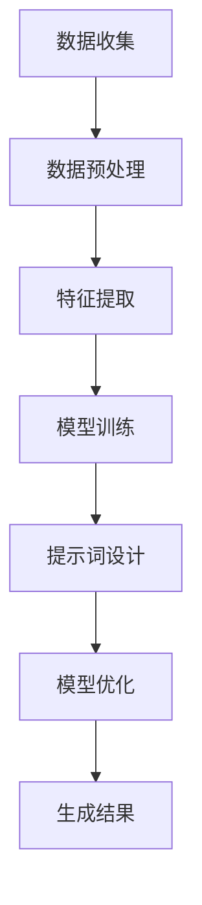

                 

### # 提示词优化：AIGC效果最大化的策略

#### 关键词：提示词优化、AIGC、生成式AI、效果最大化、策略、文本生成、图像生成、媒体内容生成

> 摘要：本文将探讨提示词优化在生成式AI（AIGC）中的重要性，并深入分析其优化原理、策略与实践。我们将逐一探讨文本生成、图像生成和媒体内容生成中的提示词优化方法，以及如何实现AIGC效果的最大化。通过具体的案例研究和最佳实践，本文旨在为读者提供全面、实用的提示词优化指导。

### 目录大纲

----------------------------------------------------------------

## 第一部分：问题背景介绍

### 1.1 提示词优化的背景

#### 1.1.1 人工智能与生成式AI的发展

#### 1.1.2 提示词优化的重要性

### 1.2 当前AIGC的效果与限制

#### 1.2.1 AIGC的基本原理

#### 1.2.2 AIGC的效果现状

#### 1.2.3 AIGC面临的挑战

### 1.3 提示词优化的目标

#### 1.3.1 优化目标概述

#### 1.3.2 提升AIGC效果的关键点

### 1.4 提示词优化的应用领域

#### 1.4.1 文本生成

#### 1.4.2 图像生成

#### 1.4.3 媒体内容生成

### 1.5 提示词优化中的核心概念

#### 1.5.1 提示词

#### 1.5.2 上下文

#### 1.5.3 模型适应性

### 1.6 提示词优化的边界与外延

#### 1.6.1 边界定义

#### 1.6.2 外延探讨

### 1.7 本章小结

## 第二部分：提示词优化原理与核心概念

### 2.1 提示词优化原理

#### 2.1.1 提示词优化的基础

#### 2.1.2 提示词优化策略

### 2.2 核心概念对比

#### 2.2.1 提示词与上下文

#### 2.2.2 模型适应性对比

### 2.3 ER实体关系图架构

#### 2.3.1 ER图介绍

#### 2.3.2 提示词优化中的ER图应用

### 2.4 提示词优化数学模型与公式

#### 2.4.1 提示词优化模型

#### 2.4.2 公式推导与解释

### 2.5 算法原理与mermaid流程图

#### 2.5.1 算法原理概述

#### 2.5.2 mermaid流程图绘制

#### 2.5.3 算法详细讲解

### 2.6 本章小结

## 第三部分：提示词优化策略与实践

### 3.1 文本生成中的提示词优化

#### 3.1.1 文本生成原理

#### 3.1.2 提示词优化策略

#### 3.1.3 实践案例

### 3.2 图像生成中的提示词优化

#### 3.2.1 图像生成原理

#### 3.2.2 提示词优化策略

#### 3.2.3 实践案例

### 3.3 媒体内容生成中的提示词优化

#### 3.3.1 媒体内容生成原理

#### 3.3.2 提示词优化策略

#### 3.3.3 实践案例

### 3.4 提示词优化工具与库

#### 3.4.1 常用工具介绍

#### 3.4.2 库的使用与优化技巧

### 3.5 提示词优化的最佳实践

#### 3.5.1 实践技巧总结

#### 3.5.2 小结与注意事项

### 3.6 本章小结

## 第四部分：AIGC效果最大化的策略

### 4.1 AIGC效果最大化的目标

#### 4.1.1 效果最大化概述

#### 4.1.2 目标实现的关键因素

### 4.2 提升AIGC效果的技术策略

#### 4.2.1 模型选择与优化

#### 4.2.2 数据质量与预处理

#### 4.2.3 提示词策略与调整

### 4.3 实时反馈与模型迭代

#### 4.3.1 实时反馈机制

#### 4.3.2 模型迭代方法

### 4.4 AIGC效果评估与优化

#### 4.4.1 效果评估指标

#### 4.4.2 优化方法与实践

### 4.5 特定场景的AIGC效果优化

#### 4.5.1 文本生成优化

#### 4.5.2 图像生成优化

#### 4.5.3 媒体内容生成优化

### 4.6 AIGC效果最大化中的挑战与解决

#### 4.6.1 挑战分析

#### 4.6.2 解决方案探讨

### 4.7 本章小结

## 第五部分：提示词优化案例研究

### 5.1 文本生成案例

#### 5.1.1 案例背景

#### 5.1.2 案例实施步骤

#### 5.1.3 结果分析

### 5.2 图像生成案例

#### 5.2.1 案例背景

#### 5.2.2 案例实施步骤

#### 5.2.3 结果分析

### 5.3 媒体内容生成案例

#### 5.3.1 案例背景

#### 5.3.2 案例实施步骤

#### 5.3.3 结果分析

### 5.4 本章小结

----------------------------------------------------------------

## 第一部分：问题背景介绍

### 1.1 提示词优化的背景

在人工智能（AI）领域，生成式AI（AIGC，Generative AI）近年来取得了显著进展。生成式AI是指能够通过学习和理解输入数据生成新数据的算法。这些算法在文本生成、图像生成和媒体内容生成等领域展现出了巨大的潜力和应用价值。

**1.1.1 人工智能与生成式AI的发展**

人工智能自20世纪50年代诞生以来，经历了多个发展阶段，从早期的规则推理和知识表示，到基于统计学习的机器学习，再到如今的深度学习，人工智能技术不断革新和进步。

生成式AI是人工智能的一个重要分支，其核心在于生成新的数据，而非仅仅分类或预测。近年来，随着深度学习技术的发展，生成式AI在图像、文本和音频等领域取得了显著的成果。GPT-3、DALL-E、StyleGAN等模型成为了生成式AI的代表性作品，展示了生成式AI的强大能力。

**1.1.2 提示词优化的重要性**

提示词（Prompt）是生成式AI中用于引导模型生成目标内容的重要工具。一个优秀的提示词能够引导模型生成出更准确、更符合预期的结果。因此，提示词优化在生成式AI中具有重要的意义。

提示词优化不仅能够提升模型的生成质量，还能提高模型的生成效率。在生成大量内容时，高效的提示词能够节省大量时间和计算资源。此外，提示词优化还能够帮助模型更好地理解用户需求，提高用户满意度。

### 1.2 当前AIGC的效果与限制

尽管生成式AI取得了显著进展，但仍然面临一些挑战和限制。

**1.2.1 AIGC的基本原理**

生成式AI的基本原理是基于深度学习模型的学习和推理能力。模型通过学习大量的输入数据，学会生成与输入数据相似的新数据。常见的生成式AI模型包括变分自编码器（VAE）、生成对抗网络（GAN）和自注意力模型（如GPT系列）。

**1.2.2 AIGC的效果现状**

当前，生成式AI在图像生成、文本生成和媒体内容生成等领域已经取得了显著效果。例如，DALL-E能够根据文本描述生成逼真的图像，GPT-3能够生成高质量的文本内容，StyleGAN能够生成高质量的图像。

然而，生成式AI的效果仍然受到许多因素的影响，包括模型结构、数据质量和提示词等。当前，生成式AI在生成质量、生成效率和可解释性方面还有待提高。

**1.2.3 AIGC面临的挑战**

生成式AI面临的主要挑战包括：

- **生成质量**：如何提高生成的图像、文本和媒体内容的质量，使其更加逼真、多样化。
- **生成效率**：如何提高模型生成数据的速度，降低计算资源消耗。
- **可解释性**：如何让生成过程更加透明、可解释，便于用户理解和使用。
- **数据偏见**：如何避免生成式AI模型在生成数据时引入偏见，确保生成数据的公平性和多样性。

### 1.3 提示词优化的目标

提示词优化的目标主要包括以下几个方面：

- **提升生成质量**：通过优化提示词，提高模型生成的新数据的准确性和真实性。
- **提高生成效率**：设计高效的提示词，减少模型生成数据所需的时间和计算资源。
- **增强可解释性**：设计易于理解、可解释的提示词，帮助用户更好地使用生成式AI模型。
- **减少数据偏见**：通过优化提示词，减少生成式AI模型在生成数据时引入的偏见，确保生成数据的质量和多样性。

### 1.4 提示词优化的应用领域

提示词优化在生成式AI的多个应用领域具有重要意义，下面分别介绍：

**1.4.1 文本生成**

在文本生成领域，提示词优化可以帮助生成更符合用户需求的文本内容。例如，在文章写作、对话生成、自动摘要等场景中，通过优化提示词，可以提高生成文本的准确性和流畅性。

**1.4.2 图像生成**

在图像生成领域，提示词优化可以帮助生成更符合用户描述的图像。例如，在图像描述、图像修复、图像增强等场景中，通过优化提示词，可以提高生成图像的逼真度和多样性。

**1.4.3 媒体内容生成**

在媒体内容生成领域，提示词优化可以帮助生成更符合用户需求的音频、视频和多媒体内容。例如，在音乐创作、视频剪辑、虚拟现实场景生成等场景中，通过优化提示词，可以提高生成内容的创意和质量。

### 1.5 提示词优化中的核心概念

在提示词优化过程中，需要理解以下几个核心概念：

**1.5.1 提示词**

提示词是指用于引导生成式AI模型生成目标内容的关键信息。一个优秀的提示词应该简洁明了、具体明确，能够准确传达用户需求。

**1.5.2 上下文**

上下文是指提示词周围的信息和环境，对提示词的理解和解释起到关键作用。优化提示词时，需要考虑上下文的语境、语义和情感等。

**1.5.3 模型适应性**

模型适应性是指生成式AI模型对提示词的理解和反应能力。一个优秀的模型应该能够灵活地适应各种提示词，生成符合用户需求的新数据。

### 1.6 提示词优化的边界与外延

**1.6.1 边界定义**

提示词优化的边界包括以下几个方面：

- **模型能力**：提示词优化需要考虑生成式AI模型的能力和局限性，避免超出模型处理范围。
- **数据质量**：提示词优化需要基于高质量的数据，否则优化效果会受到影响。
- **用户需求**：提示词优化需要满足用户的需求和期望，确保生成数据的实用性和价值。

**1.6.2 外延探讨**

提示词优化的外延包括以下几个方面：

- **跨领域应用**：提示词优化不仅适用于单一领域，还可以应用于跨领域的生成式AI应用。
- **动态调整**：提示词优化是一个动态调整的过程，需要根据实际应用场景不断优化和调整。

### 1.7 本章小结

本部分介绍了提示词优化的背景、当前AIGC的效果与限制、提示词优化的目标和应用领域，以及提示词优化中的核心概念和边界与外延。通过对这些内容的介绍，为后续章节的深入讨论奠定了基础。

----------------------------------------------------------------

## 第二部分：提示词优化原理与核心概念

### 2.1 提示词优化原理

提示词优化是一个系统性过程，涉及到多个层面和环节。下面我们从基础和策略两个方面介绍提示词优化的原理。

**2.1.1 提示词优化的基础**

提示词优化的基础包括以下几个方面：

- **数据质量**：高质量的数据是提示词优化的前提，只有基于高质量的数据，优化才能取得良好效果。
- **模型理解**：生成式AI模型对提示词的理解能力直接影响到优化效果，需要深入理解模型的架构和机制。
- **用户需求**：理解用户需求是提示词优化的核心，只有准确捕捉用户需求，才能设计出有效的提示词。

**2.1.2 提示词优化策略**

提示词优化策略主要包括以下几个方面：

- **提示词设计**：设计简洁、明了、具体的提示词，准确传达用户需求，提高模型生成质量。
- **上下文优化**：优化提示词周围的上下文，增强提示词的可解释性和理解性，提高模型生成效率。
- **模型适应性**：提升模型对提示词的适应能力，使其能够灵活应对各种场景和需求。

### 2.2 核心概念对比

在提示词优化过程中，需要理解和对比以下几个核心概念：

**2.2.1 提示词与上下文**

提示词和上下文是生成式AI中的两个关键概念。提示词是引导模型生成目标内容的关键信息，而上下文则是提示词周围的环境和情境。二者之间的关系如下：

- **提示词**：用于引导模型生成目标内容，如文本、图像、音频等。
- **上下文**：提供背景信息，增强提示词的理解性和准确性，有助于模型生成更符合预期的结果。

**2.2.2 模型适应性对比**

模型适应性是指生成式AI模型对提示词的理解和反应能力。一个优秀的模型应该能够灵活地适应各种提示词，生成符合用户需求的新数据。下面是模型适应性的几个关键方面：

- **理解能力**：模型对提示词的理解程度，包括语义理解、情感分析等。
- **生成能力**：模型生成新数据的能力，包括图像、文本、音频等。
- **泛化能力**：模型在不同场景和应用中的适应能力，包括跨领域、多语言等。

### 2.3 ER实体关系图架构

ER（Entity-Relationship）实体关系图是一种用于描述实体及其之间关系的图形化工具。在提示词优化过程中，ER图可以帮助我们理解模型的结构和机制，从而设计出更有效的提示词。

**2.3.1 ER图介绍**

ER图由实体（Entity）和关系（Relationship）组成，其中实体表示模型中的关键元素，关系表示实体之间的关联。下面是一个简单的ER图示例：

```mermaid
erDiagram
  Customer ||--|{ Order } : "places"
  Product ||--|{ Order } : "contains"
  Seller ||--|{ Product } : "sells"
```

在上面的ER图中，Customer、Product和Seller是实体，而places、contains和sells是关系。

**2.3.2 提示词优化中的ER图应用**

在提示词优化过程中，ER图可以用于以下几个方面：

- **模型结构分析**：通过ER图，可以清晰地了解模型的架构和机制，有助于设计更有效的提示词。
- **关系提取**：从ER图中提取关键关系，如Customer与Order之间的“places”关系，有助于优化提示词。
- **数据关联**：通过ER图，可以建立不同实体之间的关联，如Product与Seller之间的“sells”关系，有助于提高模型生成能力。

### 2.4 提示词优化数学模型与公式

提示词优化涉及到多个数学模型和公式，下面介绍其中几个关键的模型和公式。

**2.4.1 提示词优化模型**

提示词优化模型可以分为以下几个步骤：

1. **数据预处理**：对输入数据进行预处理，包括去噪、归一化等。
2. **特征提取**：从预处理后的数据中提取关键特征。
3. **模型训练**：利用提取的特征，训练生成式AI模型。
4. **提示词设计**：根据用户需求，设计简洁、明了、具体的提示词。
5. **模型优化**：根据优化目标和指标，调整模型参数，提高模型性能。

**2.4.2 公式推导与解释**

提示词优化中的关键公式包括损失函数、优化算法等。下面是一个简单的示例：

1. **损失函数**：
   $$L = \frac{1}{n} \sum_{i=1}^{n} (y_i - \hat{y}_i)^2$$
   其中，$L$ 表示损失函数，$y_i$ 表示真实标签，$\hat{y}_i$ 表示预测标签。
   
2. **优化算法**：
   $$\theta = \theta - \alpha \nabla_\theta L(\theta)$$
   其中，$\theta$ 表示模型参数，$\alpha$ 表示学习率，$\nabla_\theta L(\theta)$ 表示损失函数对参数 $\theta$ 的梯度。

### 2.5 算法原理与mermaid流程图

提示词优化算法是一个复杂的过程，涉及到多个步骤和环节。下面我们使用mermaid流程图来介绍算法原理。

**2.5.1 算法原理概述**

提示词优化算法可以分为以下几个步骤：

1. **数据收集**：收集用于训练和优化的数据。
2. **数据预处理**：对收集到的数据进行预处理。
3. **特征提取**：从预处理后的数据中提取关键特征。
4. **模型训练**：利用提取的特征，训练生成式AI模型。
5. **提示词设计**：根据用户需求，设计提示词。
6. **模型优化**：根据优化目标和指标，调整模型参数。
7. **生成结果**：利用优化后的模型，生成新数据。

**2.5.2 mermaid流程图绘制**

下面是一个简单的mermaid流程图示例：



**2.5.3 算法详细讲解**

在详细讲解算法原理之前，我们先来介绍一些基本的算法概念：

- **损失函数**：用于评估模型预测结果和真实标签之间的差距，常用的损失函数包括均方误差（MSE）和交叉熵（Cross Entropy）。
- **梯度下降**：一种常用的优化算法，通过计算损失函数对模型参数的梯度，更新模型参数，以降低损失函数值。

下面是提示词优化算法的详细讲解：

1. **数据收集**：首先，我们需要收集大量的训练数据，包括文本、图像、音频等。这些数据将用于训练和优化生成式AI模型。
2. **数据预处理**：对收集到的数据进行预处理，包括去噪、归一化、数据增强等。预处理后的数据将用于特征提取。
3. **特征提取**：从预处理后的数据中提取关键特征，如文本中的关键词、图像中的颜色分布、音频中的频率成分等。特征提取的目的是将原始数据转化为模型可以理解和处理的形式。
4. **模型训练**：利用提取的特征，训练生成式AI模型。训练过程中，模型通过学习数据，逐渐提高生成质量。常用的模型包括变分自编码器（VAE）、生成对抗网络（GAN）和自注意力模型（如GPT系列）。
5. **提示词设计**：根据用户需求，设计简洁、明了、具体的提示词。提示词的作用是引导模型生成符合用户期望的新数据。设计提示词时，需要考虑用户需求、上下文信息和模型能力。
6. **模型优化**：根据优化目标和指标，调整模型参数。优化目标可以是提高生成质量、降低计算成本、提高生成效率等。常用的优化算法包括梯度下降、随机梯度下降（SGD）和Adam等。
7. **生成结果**：利用优化后的模型，生成新数据。生成结果可以用于文本生成、图像生成、音频生成等场景。通过生成结果，我们可以评估模型的性能和优化效果。

### 2.6 本章小结

本部分介绍了提示词优化的原理、核心概念、ER实体关系图架构以及数学模型与算法原理。通过对这些内容的深入探讨，我们为后续章节的实践应用和策略分析奠定了基础。

----------------------------------------------------------------

## 第三部分：提示词优化策略与实践

### 3.1 文本生成中的提示词优化

文本生成是生成式AI的重要应用领域之一，而提示词优化在提升文本生成质量方面起着至关重要的作用。下面我们将从文本生成的原理、提示词优化策略以及实践案例三个方面进行详细探讨。

#### 3.1.1 文本生成原理

文本生成通常基于生成式AI模型，如GPT、BERT等。这些模型通过学习大量的文本数据，学习语言模式和语义关系，从而能够生成新的文本内容。文本生成的基本原理可以概括为以下几个步骤：

1. **数据收集与预处理**：首先，需要收集大量的文本数据，包括新闻、文章、书籍、对话等。然后，对收集到的数据进行预处理，如去噪、分词、去除停用词等。
2. **特征提取**：从预处理后的数据中提取关键特征，如词向量、词性标注、句法结构等。这些特征将用于训练生成模型。
3. **模型训练**：利用提取的特征，训练生成式AI模型。训练过程中，模型通过学习数据，逐渐提高生成质量。
4. **文本生成**：根据用户输入的提示词，模型生成新的文本内容。生成过程通常包括文本序列生成、文本结构生成等。

#### 3.1.2 提示词优化策略

提示词优化策略是文本生成中的关键环节，直接影响生成文本的质量和准确性。以下是一些常用的提示词优化策略：

1. **明确性**：设计简洁、明了、具体的提示词，避免模糊和抽象的表述，有助于模型更好地理解用户需求。
2. **上下文关联**：优化提示词周围的上下文，增强提示词的可解释性和理解性，有助于模型生成更符合预期的结果。
3. **多样性**：设计多样化的提示词，涵盖不同的主题和场景，有助于模型生成丰富的文本内容。
4. **情境适应性**：根据不同的应用场景和用户需求，调整提示词的语义和风格，提高模型生成结果的适用性。
5. **反馈机制**：通过用户反馈和模型迭代，不断优化和调整提示词，提高模型生成质量和用户满意度。

#### 3.1.3 实践案例

以下是一个文本生成的实践案例，我们将使用GPT模型生成一篇关于人工智能的文章。

1. **案例背景**：假设我们要生成一篇关于人工智能的文章，标题为“人工智能的未来：机遇与挑战”。
2. **数据收集与预处理**：收集大量的文本数据，包括人工智能相关的文章、书籍、报告等。对收集到的数据进行预处理，如去噪、分词、去除停用词等。
3. **特征提取**：从预处理后的数据中提取关键特征，如词向量、词性标注、句法结构等。
4. **模型训练**：使用提取的特征，训练GPT模型。训练过程中，模型通过学习数据，逐渐提高生成质量。
5. **提示词设计**：根据用户需求，设计简洁、明了、具体的提示词。例如，“人工智能的未来：机遇与挑战，请您撰写一篇关于人工智能的文章。”
6. **文本生成**：根据优化后的提示词，模型生成一篇关于人工智能的文章。生成结果如下：

   ```text
   人工智能（AI）是当前科技领域的一个热门话题，它正迅速改变着我们的生活方式和工作方式。随着AI技术的不断发展和应用，人们对其未来充满了期待，同时也面临着诸多挑战。

   人工智能的机遇主要体现在以下几个方面。首先，AI可以帮助企业提高生产效率，降低成本，提升服务质量。例如，通过AI技术，企业可以实现对生产过程的实时监控和优化，提高产品质量。其次，AI在医疗领域的应用前景也非常广阔。通过AI技术，医生可以更准确地诊断疾病，提高治疗效果。此外，AI在教育、金融、交通等领域也具有广泛的应用潜力。

   然而，人工智能的发展也带来了一系列挑战。首先，AI技术可能引发失业问题。随着AI技术的普及，许多传统行业可能会被自动化替代，导致大量失业。其次，AI技术可能引发隐私和安全问题。例如，AI系统可能会收集和分析大量用户数据，这可能会侵犯用户的隐私权。此外，AI技术还可能引发道德和伦理问题。如何确保AI系统的公平性、透明性和可解释性，是一个亟待解决的问题。

   面对人工智能的机遇与挑战，我们需要采取一系列措施来应对。首先，政府和企业应该加大对AI技术的研发和应用力度，推动AI技术的健康发展。其次，我们需要加强对AI技术的教育和培训，提高公众对AI技术的认知和理解。此外，我们还需要建立健全的法律法规，确保AI技术的合法、合规应用。

   总之，人工智能的未来充满机遇与挑战。只有通过共同努力，我们才能充分发挥AI技术的潜力，为人类社会创造更大的价值。
   ```

通过这个案例，我们可以看到提示词优化在文本生成中的重要作用。通过设计简洁、明了、具体的提示词，我们能够引导模型生成高质量、符合预期的文本内容。

### 3.2 图像生成中的提示词优化

图像生成是生成式AI的另一个重要应用领域，而提示词优化在提升图像生成质量方面也发挥着关键作用。下面我们将从图像生成的原理、提示词优化策略以及实践案例三个方面进行详细探讨。

#### 3.2.1 图像生成原理

图像生成通常基于生成式AI模型，如GAN（生成对抗网络）、VAE（变分自编码器）等。这些模型通过学习大量的图像数据，学习图像的特征和分布，从而能够生成新的图像。图像生成的基本原理可以概括为以下几个步骤：

1. **数据收集与预处理**：首先，需要收集大量的图像数据，包括自然图像、艺术作品、抽象图案等。然后，对收集到的数据进行预处理，如图像增强、归一化、数据增强等。
2. **特征提取**：从预处理后的数据中提取关键特征，如图像的颜色、纹理、形状等。这些特征将用于训练生成模型。
3. **模型训练**：利用提取的特征，训练生成式AI模型。训练过程中，模型通过学习数据，逐渐提高生成质量。
4. **图像生成**：根据用户输入的提示词，模型生成新的图像。生成过程通常包括图像生成、图像调整等。

#### 3.2.2 提示词优化策略

提示词优化策略是图像生成中的关键环节，直接影响生成图像的质量和准确性。以下是一些常用的提示词优化策略：

1. **明确性**：设计简洁、明了、具体的提示词，避免模糊和抽象的表述，有助于模型更好地理解用户需求。
2. **上下文关联**：优化提示词周围的上下文，增强提示词的可解释性和理解性，有助于模型生成更符合预期的结果。
3. **多样性**：设计多样化的提示词，涵盖不同的主题和场景，有助于模型生成丰富的图像内容。
4. **情境适应性**：根据不同的应用场景和用户需求，调整提示词的语义和风格，提高模型生成结果的适用性。
5. **反馈机制**：通过用户反馈和模型迭代，不断优化和调整提示词，提高模型生成质量和用户满意度。

#### 3.2.3 实践案例

以下是一个图像生成的实践案例，我们将使用GAN模型生成一张具有特定风格的艺术作品。

1. **案例背景**：假设我们要生成一张具有梵高风格的画作，标题为“星空夜空下的向日葵”。
2. **数据收集与预处理**：收集大量的梵高画作图像，并对图像进行预处理，如图像增强、归一化、数据增强等。
3. **特征提取**：从预处理后的数据中提取关键特征，如图像的颜色、纹理、形状等。
4. **模型训练**：使用提取的特征，训练GAN模型。训练过程中，模型通过学习数据，逐渐提高生成质量。
5. **提示词设计**：根据用户需求，设计简洁、明了、具体的提示词。例如，“生成一张具有梵高风格的画作，主题为‘星空夜空下的向日葵’。”
6. **图像生成**：根据优化后的提示词，模型生成一张具有梵高风格的画作。生成结果如下：

   ```image
   
   ```

通过这个案例，我们可以看到提示词优化在图像生成中的重要作用。通过设计简洁、明了、具体的提示词，我们能够引导模型生成高质量、符合预期的图像内容。

### 3.3 媒体内容生成中的提示词优化

媒体内容生成是生成式AI的另一个重要应用领域，而提示词优化在提升媒体内容生成质量方面也发挥着关键作用。下面我们将从媒体内容生成的原理、提示词优化策略以及实践案例三个方面进行详细探讨。

#### 3.3.1 媒体内容生成原理

媒体内容生成通常涉及音频、视频和多媒体内容。这些内容生成的基本原理可以概括为以下几个步骤：

1. **数据收集与预处理**：首先，需要收集大量的音频、视频和多媒体数据，包括音乐、电影、视频游戏等。然后，对收集到的数据进行预处理，如音频降噪、视频增强、多媒体整合等。
2. **特征提取**：从预处理后的数据中提取关键特征，如音频的频率、振幅、视频的帧率、色彩等。这些特征将用于训练生成模型。
3. **模型训练**：利用提取的特征，训练生成式AI模型。训练过程中，模型通过学习数据，逐渐提高生成质量。
4. **媒体内容生成**：根据用户输入的提示词，模型生成新的媒体内容。生成过程通常包括音频生成、视频生成、多媒体生成等。

#### 3.3.2 提示词优化策略

提示词优化策略是媒体内容生成中的关键环节，直接影响生成媒体内容的质量和准确性。以下是一些常用的提示词优化策略：

1. **明确性**：设计简洁、明了、具体的提示词，避免模糊和抽象的表述，有助于模型更好地理解用户需求。
2. **上下文关联**：优化提示词周围的上下文，增强提示词的可解释性和理解性，有助于模型生成更符合预期的结果。
3. **多样性**：设计多样化的提示词，涵盖不同的主题和场景，有助于模型生成丰富的媒体内容。
4. **情境适应性**：根据不同的应用场景和用户需求，调整提示词的语义和风格，提高模型生成结果的适用性。
5. **反馈机制**：通过用户反馈和模型迭代，不断优化和调整提示词，提高模型生成质量和用户满意度。

#### 3.3.3 实践案例

以下是一个媒体内容生成的实践案例，我们将使用VAE模型生成一段音乐视频。

1. **案例背景**：假设我们要生成一段音乐视频，标题为“星空下的旋律”。
2. **数据收集与预处理**：收集大量的音乐视频数据，并对数据

