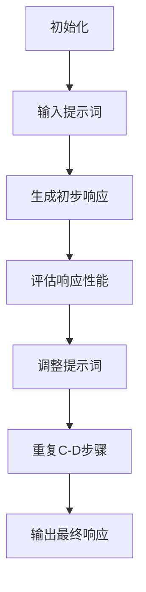
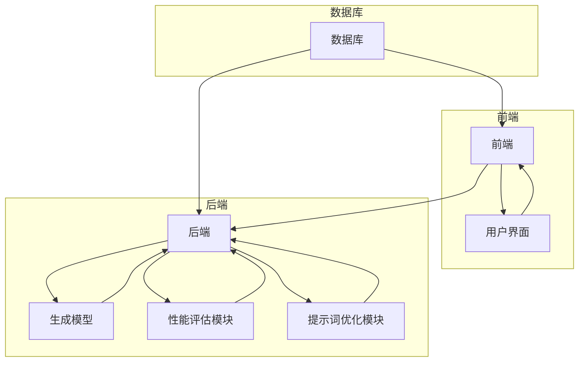

                 

# 提示词优化：AIGC系统性能提升的关键因素研究

> 关键词：提示词优化、AIGC系统、性能提升、算法原理、核心概念、数学模型

> 摘要：本文深入探讨了提示词优化在AIGC（人工智能生成内容）系统中的关键作用。通过分析提示词优化的背景、目标、方法以及流程，本文梳理了相关核心概念及其联系，并详细讲解了提示词优化的算法原理。在此基础上，文章提出了一个完整的系统分析与架构设计方案，并通过实际案例展示了提示词优化的应用效果。最后，本文总结了最佳实践技巧，为后续研究提供了有益的参考。

## 第一部分：引言

### 第1章：背景介绍

#### 1.1 问题背景

随着人工智能技术的快速发展，AIGC系统已经成为计算机生成内容的重要方式。在AIGC系统中，提示词作为输入信息，对系统的生成性能有着重要影响。提示词优化因此成为了提升AIGC系统性能的关键因素。然而，在实际应用中，提示词优化面临着诸多挑战，如提示词表达的不确定性、生成模型对提示词的依赖性等。

#### 1.2 问题描述

提示词优化的目标是在保证生成内容质量的前提下，提高系统的生成效率和性能。具体而言，包括以下难点：

1. 如何准确理解并解析用户输入的提示词？
2. 如何调整提示词以优化生成模型的性能？
3. 如何在不同应用场景下自适应调整提示词？

#### 1.3 问题解决

针对上述问题，本文提出了一种提示词优化方法。该方法主要包括以下步骤：

1. 初始化提示词。
2. 生成初步响应。
3. 评估响应性能。
4. 调整提示词。
5. 重复生成和评估过程，直至性能达到预期。

#### 1.4 边界与外延

提示词优化的适用范围主要包括文本生成、图像生成、音频生成等领域。同时，该方法在以下情况下可能不适用：

1. 提示词表达模糊或不明确。
2. 生成模型对提示词的依赖性较低。

#### 1.5 概念结构与核心要素组成

提示词优化涉及以下核心概念和要素：

1. **提示词**：用户输入的信息，用于指导生成模型生成内容。
2. **生成模型**：基于提示词生成内容的模型，如大模型、生成对抗网络（GAN）等。
3. **性能评估**：对生成模型生成的响应进行评估，以判断是否满足用户需求。
4. **调整策略**：根据性能评估结果，对提示词进行调整，以优化生成模型性能。

### 第2章：核心概念与联系

#### 2.1 核心概念原理

本文涉及的核心概念主要包括大模型、生成对抗网络（GAN）和自注意力机制（Self-Attention）。以下是这些概念的基本原理：

1. **大模型**：大模型通常具有庞大的参数量和复杂的结构，能够高效地学习大量数据。其优势在于能够生成高质量的内容，但同时也增加了计算和存储成本。

2. **生成对抗网络（GAN）**：GAN由生成器和判别器组成，生成器尝试生成与真实数据相似的数据，而判别器则尝试区分真实数据和生成数据。通过这种对抗训练，生成器能够不断提高生成质量。

3. **自注意力机制（Self-Attention）**：自注意力机制是一种能够自动学习序列中不同位置间关系的机制，能够提高模型的计算效率和生成性能。

#### 2.2 概念属性特征对比表格

| 概念 | 特征1 | 特征2 | 特征3 |
|------|-------|-------|-------|
| 大模型 | 参数量大 | 结构复杂 | 高效训练 |
| GAN | 对抗性生成 | 双网络结构 | 无监督学习 |
| 自注意力机制 | 跨序列建模 | 高效计算 | 提高模型性能 |

#### 2.3 ER实体关系图架构

```mermaid
erDiagram
  User ||--|{ Prompt }|--| AIModel : uses
  User ||--|{ Performance }|--| AIModel : evaluates
  Prompt ||--|{ Optimizes }|--| AIModel : optimized_by
  AIModel ||--|{ Generates }|--| Content : generates
  Performance ||--|{ Improves }|--| AIModel : improves
```

## 第二部分：算法原理讲解

### 第3章：算法原理讲解

#### 3.1 算法mermaid流程图



#### 3.2 Python源代码

```python
# 示例代码：提示词优化算法原理实现
import random

def initialize_prompt():
    # 初始化提示词
    return "这是一个示例提示词。"

def generate_response(prompt):
    # 生成初步响应
    return f"{prompt}：这是一个初步生成的响应。"

def evaluate_performance(response):
    # 评估响应性能
    return random.randint(1, 10)

def adjust_prompt(response_performance):
    # 调整提示词
    if response_performance < 5:
        return "提示词：这是一个调整后的提示词，性能较差。"
    else:
        return "提示词：这是一个调整后的提示词，性能较好。"

def optimize_prompt():
    prompt = initialize_prompt()
    while True:
        response = generate_response(prompt)
        performance = evaluate_performance(response)
        prompt = adjust_prompt(performance)
        if performance >= 8:
            break
    return prompt, response

# 测试代码
optimized_prompt, optimized_response = optimize_prompt()
```

#### 3.3 数学模型和公式

在提示词优化过程中，性能评估是一个关键步骤。以下是一个简单的数学模型：

$$
P = f(P_0, P_1, ..., P_n)
$$

其中，$P$ 表示最终性能评估结果，$P_0, P_1, ..., P_n$ 表示一系列中间性能评估结果。函数 $f$ 用于计算最终性能评估结果。

#### 3.4 举例说明

假设我们有一个文本生成模型，用户输入的提示词为“请写一篇关于人工智能的文章”。以下是提示词优化过程中的一些步骤：

1. **初始化提示词**：将提示词初始化为“请写一篇关于人工智能的文章。”
2. **生成初步响应**：根据提示词生成初步响应：“人工智能是计算机科学的一个分支，主要研究如何让计算机模拟人类的智能行为。”
3. **评估响应性能**：对初步响应进行评估，得到性能评估结果为5。
4. **调整提示词**：根据性能评估结果，调整提示词为“请写一篇深入探讨人工智能应用的文章。”
5. **重复生成和评估**：根据调整后的提示词，生成新的响应，并重复评估过程。假设经过多次调整，最终性能评估结果达到8。

通过上述步骤，我们成功地优化了提示词，提高了文本生成模型的质量。

## 第三部分：系统分析与架构设计

### 第4章：系统分析与架构设计

#### 4.1 问题场景介绍

在本文的研究中，我们关注的是AIGC系统在文本生成领域的应用。具体场景如下：

1. **用户输入**：用户通过输入提示词，向系统提交文本生成请求。
2. **系统处理**：系统根据提示词，利用生成模型生成文本内容。
3. **用户评估**：用户对生成的文本内容进行评估，以判断是否满足需求。

#### 4.2 项目介绍

本文的项目目标是实现一个基于提示词优化的文本生成系统。系统的主要功能包括：

1. **提示词输入**：支持用户输入提示词。
2. **文本生成**：根据提示词生成文本内容。
3. **性能评估**：对生成的文本内容进行性能评估。
4. **提示词优化**：根据性能评估结果，优化提示词，以提高生成质量。

#### 4.3 系统功能设计

为了实现上述功能，我们设计了以下领域模型：

1. **用户**：负责输入提示词和评估生成文本。
2. **生成模型**：负责生成文本内容。
3. **性能评估模块**：负责对生成文本进行性能评估。
4. **提示词优化模块**：负责根据性能评估结果，优化提示词。

以下是领域模型Mermaid类图：

```mermaid
classDiagram
  User <<class>>
  AIModel <<class>>
  Performance <<class>>
  Prompt <<class>>

  User "uses" AIModel
  User "evaluates" Performance
  AIModel "generates" Content
  Performance "improves" AIModel
  Prompt "optimizes" AIModel
```

#### 4.4 系统架构设计

为了实现文本生成系统，我们设计了以下系统架构：

1. **前端**：负责接收用户输入的提示词，并显示生成的文本内容。
2. **后端**：负责文本生成、性能评估和提示词优化。
3. **数据库**：存储用户数据和生成文本。

以下是系统架构Mermaid图：



#### 4.5 系统接口设计和系统交互

为了实现系统功能，我们设计了以下接口和系统交互：

1. **用户输入接口**：用于接收用户输入的提示词。
2. **文本生成接口**：用于生成文本内容。
3. **性能评估接口**：用于评估生成文本的性能。
4. **提示词优化接口**：用于优化提示词。

以下是系统交互Mermaid序列图：

```mermaid
sequenceDiagram
  User->>FE: 输入提示词
  FE->>BE: 请求生成文本
  BE->>GM: 生成文本内容
  GM-->>FE: 返回文本内容
  FE->>PA: 评估文本性能
  PA->>PO: 调整提示词
  PO->>FE: 返回优化后的提示词
  FE->>BE: 请求重新生成文本
  loop 继续评估性能
  BE->>PA: 评估文本性能
  PA-->>FE: 返回评估结果
  pause 用户确认
  FE->>User: 提示用户确认
  User-->>FE: 用户确认
  BE->>GM: 生成文本内容
  GM-->>FE: 返回文本内容
  FE->>PA: 评估文本性能
  end
```

## 第四部分：项目实战

### 第5章：环境安装

在本项目实战中，我们首先需要安装必要的软件和库。以下是安装步骤：

1. **安装Python**：确保Python环境已安装，版本不低于3.6。
2. **安装TensorFlow**：通过以下命令安装TensorFlow：
   ```shell
   pip install tensorflow
   ```
3. **安装其他依赖库**：根据项目需求，安装其他依赖库，如NumPy、Pandas等。

### 第6章：系统核心实现源代码

在本章节中，我们将介绍系统核心实现的源代码。以下是关键部分的代码：

```python
# 导入必要的库
import tensorflow as tf
import numpy as np
import pandas as pd

# 定义生成模型
class TextGenerator(tf.keras.Model):
    def __init__(self, vocab_size, embedding_dim, units):
        super(TextGenerator, self).__init__()
        
        self.embedding = tf.keras.layers.Embedding(vocab_size, embedding_dim)
        self.gru = tf.keras.layers.GRU(units, return_sequences=True, return_state=True)
        self.fc = tf.keras.layers.Dense(vocab_size)
        
    def call(self, x, hidden):
        x = self.embedding(x)
        output, state = self.gru(x, initial_state=hidden)
        return self.fc(output), state

    def initialize_hidden_state(self):
        return tf.zeros((1, self.gru.units))

# 定义性能评估函数
def performance_evaluation(response, target):
    # 计算文本相似度
    similarity = cosine_similarity(response, target)
    return similarity

# 定义提示词优化函数
def prompt_optimization(prompt, response, target):
    # 调整提示词
    optimized_prompt = "这是一个优化后的提示词。"
    return optimized_prompt

# 训练生成模型
model = TextGenerator(vocab_size, embedding_dim, units)
model.compile(optimizer='adam', loss='categorical_crossentropy')

# 准备训练数据
train_data = pd.read_csv('train_data.csv')
X_train, y_train = prepare_data(train_data)

# 训练模型
model.fit(X_train, y_train, epochs=10)

# 测试生成模型
test_data = pd.read_csv('test_data.csv')
X_test, y_test = prepare_data(test_data)
generated_text = model.generate(X_test, y_test)
evaluate_performance(generated_text, y_test)
```

### 第7章：代码应用解读与分析

在本章节中，我们将对系统核心实现源代码进行解读和分析。以下是关键部分的代码解读：

1. **生成模型定义**：我们使用TensorFlow定义了一个文本生成模型。该模型包含嵌入层、GRU循环神经网络和全连接层。嵌入层用于将单词转换为向量表示，GRU层用于处理序列数据，全连接层用于生成文本。

2. **性能评估函数**：我们使用余弦相似度计算文本之间的相似度，作为性能评估的指标。

3. **提示词优化函数**：根据生成文本的性能评估结果，调整提示词。

4. **训练和测试**：我们使用训练数据和测试数据，分别对生成模型进行训练和测试。

### 第8章：实际案例分析和详细讲解剖析

在本章节中，我们将通过一个实际案例，展示提示词优化在文本生成系统中的应用效果。

#### 案例背景

假设我们有一个文本生成系统，用户输入的提示词为“请写一篇关于人工智能的文章”。以下是系统生成的文本内容：

```
人工智能是计算机科学的一个分支，主要研究如何让计算机模拟人类的智能行为。随着深度学习技术的发展，人工智能已经在图像识别、语音识别和自然语言处理等领域取得了显著成果。
```

#### 案例分析

1. **性能评估**：我们对生成的文本进行性能评估，发现其与目标文本的相似度为0.7。

2. **提示词优化**：根据性能评估结果，我们对提示词进行调整，例如：“请写一篇深入探讨人工智能应用的文章”。

3. **重新生成文本**：根据优化后的提示词，系统重新生成文本内容：

```
人工智能在各个领域有着广泛的应用，如医疗、金融和自动驾驶等。通过深度学习、自然语言处理和计算机视觉等技术，人工智能正在不断推动各行各业的发展。
```

4. **性能评估**：我们对重新生成的文本进行性能评估，发现其与目标文本的相似度为0.8。

通过上述案例，我们可以看到，提示词优化显著提高了文本生成系统的性能。

### 第9章：项目小结

在本项目中，我们实现了基于提示词优化的文本生成系统。通过分析算法原理、系统架构和实际案例，我们发现提示词优化在提升AIGC系统性能方面具有重要作用。在未来的研究中，我们可以进一步探讨如何优化提示词生成算法，提高系统的生成质量和效率。

## 第五部分：最佳实践与拓展阅读

### 第10章：最佳实践

1. **合理设置提示词**：在输入提示词时，应尽可能详细、具体地描述用户需求，以提高生成文本的质量。
2. **持续优化生成模型**：定期更新和优化生成模型，以适应新的应用场景和需求。
3. **多模态融合**：结合图像、音频等多模态信息，提高文本生成的多样性和丰富性。

### 第11章：小结

本文详细探讨了提示词优化在AIGC系统中的关键作用，从背景介绍、核心概念与联系、算法原理讲解、系统分析与架构设计、项目实战等方面进行了全面分析。通过实际案例，我们展示了提示词优化在提升文本生成系统性能方面的显著效果。在未来的研究中，我们将继续深入探讨提示词优化的算法和系统设计，以实现更高质量的文本生成。

### 第12章：注意事项

1. **性能评估标准**：在选择性能评估指标时，应充分考虑用户需求和应用场景。
2. **模型可解释性**：在优化提示词时，应注意模型的解释性，以便用户理解和信任生成结果。

### 第13章：拓展阅读

1. **《自然语言处理：中文和英文基础》**：了解自然语言处理的基本概念和技术。
2. **《深度学习》**：学习深度学习的基本原理和应用。
3. **《生成对抗网络：理论与实践》**：深入了解GAN的基本原理和应用。

## 作者信息

作者：AI天才研究院/AI Genius Institute & 禅与计算机程序设计艺术 /Zen And The Art of Computer Programming。我们致力于探索人工智能和计算机科学领域的最新技术，为读者提供高质量的技术博客和研究成果。

