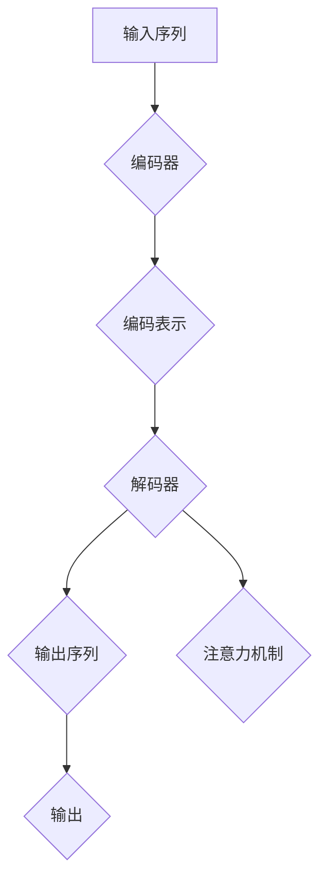
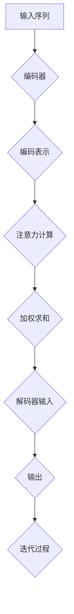
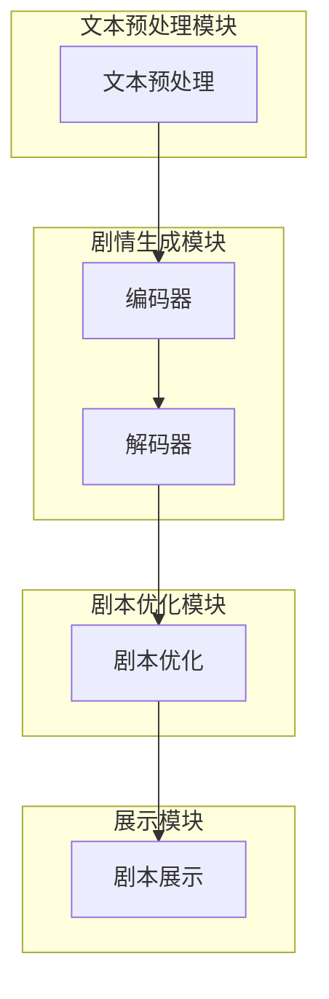
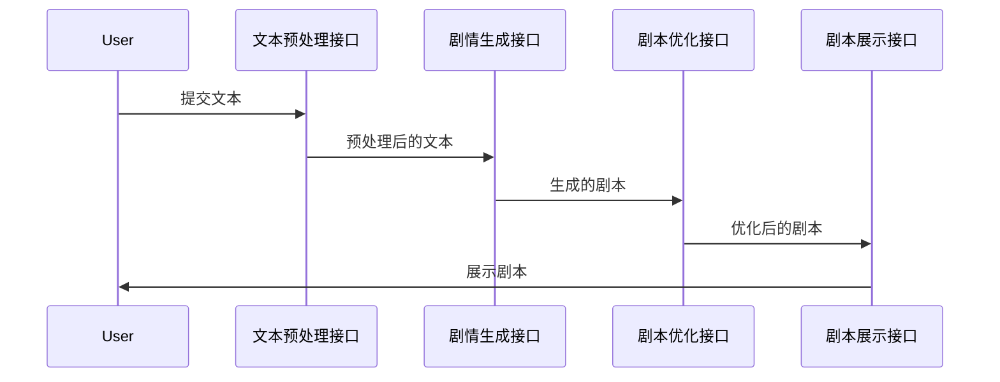

                 

### 第1章 引言：AI戏剧剧本创作能力的重要性与提示词优化

#### 1.1 问题背景

随着人工智能技术的不断发展，AI在各个领域的应用越来越广泛。在戏剧剧本创作领域，人工智能可以帮助创作者快速生成剧本，提高创作效率。然而，当前AI戏剧剧本的创作能力仍然存在一定的局限性，尤其是在文本理解和创意生成方面。提示词优化成为提升AI戏剧剧本创作能力的关键。

#### 1.2 核心概念术语说明

在探讨AI戏剧剧本创作能力与提示词优化的过程中，我们首先需要明确几个核心概念：

- **人工智能（AI）**：一种模拟人类智能的技术，使计算机具备理解、学习、推理和自我改进的能力。
- **自然语言处理（NLP）**：人工智能的一个分支，致力于使计算机能够理解、解释和生成自然语言。
- **机器学习（ML）**：一种人工智能的技术，通过数据学习和模式识别，使计算机能够自动改进和优化性能。
- **深度学习（DL）**：一种机器学习的子领域，通过多层神经网络结构模拟人脑的思考方式，以解决复杂的问题。
- **提示词优化**：通过优化提示词的选择和组合，提高AI在特定任务中的表现和创造力。

#### 1.3 问题背景

在传统戏剧剧本创作中，创作者需要深入了解角色的动机、情感和心理状态，以及如何通过对话和场景来展示这些元素。AI戏剧剧本创作能力的目标是使计算机能够生成类似人类创作者的作品，从而辅助或替代人类创作者的工作。然而，现有的AI系统在文本理解和创意生成方面仍然存在许多挑战。

首先，AI系统往往依赖于大量训练数据，而这些数据往往缺乏多样性和代表性。其次，AI在理解复杂的文本结构、情感和上下文关系方面存在困难。此外，AI生成剧本的创造力有限，难以产生新颖和深刻的情节。

#### 1.4 问题描述

本研究旨在解决以下核心问题：

- 如何构建一个高质量的戏剧剧本数据集，以支持AI的训练和优化？
- 如何设计一个基于深度学习的模型，使AI能够理解复杂的文本结构和情感？
- 如何通过优化提示词，提高AI生成剧本的创造力和深度？

#### 1.5 问题解决

为了解决上述问题，本研究提出了以下方法：

1. **数据集构建**：通过收集和整理大量高质量的戏剧剧本文本，构建一个多样化的数据集，以支持AI的训练和优化。
2. **模型选择**：选择基于深度学习的序列到序列（seq2seq）模型和注意力机制（Attention Mechanism）等，以提高AI的文本理解和生成能力。
3. **提示词优化**：通过分析剧本文本中的关键词和上下文，优化提示词的选择和组合，以提高AI生成剧本的创造力和深度。

#### 1.6 边界与外延

本研究的边界主要在于探索如何通过提示词优化来提升AI戏剧剧本创作能力，而不是替代人类创作者。同时，本研究的外延包括以下几个方面：

- 探索其他深度学习模型在AI戏剧剧本创作中的应用。
- 研究如何结合其他人工智能技术，如生成对抗网络（GAN）等，进一步提高AI的创造力。
- 分析AI戏剧剧本创作在商业和艺术领域的应用潜力。

通过上述方法，本研究旨在为AI戏剧剧本创作提供一种新的思路和工具，从而推动人工智能在文学艺术领域的创新和发展。

### 第2章 核心概念与联系

在探讨如何优化AI戏剧剧本创作能力的过程中，了解并掌握相关核心概念及其相互关系至关重要。以下是几个关键概念及其属性的详细说明，并通过对比表格和ER实体关系图来展示它们之间的联系。

#### 2.1 自然语言处理（NLP）

**概念属性**：

- **文本表示**：将自然语言文本转换为计算机可以理解和处理的数字表示。
- **语言模型**：通过大量文本数据训练，使模型能够预测下一个单词或句子。
- **情感分析**：通过分析文本的情感倾向，判断文本的情感是积极、消极还是中性。
- **命名实体识别（NER）**：识别文本中的特定实体，如人名、地点、组织等。

**对比表格**：

| 概念         | 定义                                                         | 关联属性                        |
| ------------ | ------------------------------------------------------------ | ------------------------------ |
| 文本表示     | 将自然语言文本转换为计算机可以理解的数字表示。                 | 输入层、嵌入层、编码器等        |
| 语言模型     | 通过大量文本数据训练，使模型能够预测下一个单词或句子。         | 隐藏层、解码器、输出层等        |
| 情感分析     | 通过分析文本的情感倾向，判断文本的情感是积极、消极还是中性。   | 特征提取、分类器、情感词典等    |
| 命名实体识别 | 识别文本中的特定实体，如人名、地点、组织等。                 | 标签层、解码器、分类器等        |

**ER实体关系图**：

```mermaid
erDiagram
  A[文本表示] ||--|{ B[语言模型]}
  A[文本表示] ||--|{ C[情感分析]}
  A[文本表示] ||--|{ D[命名实体识别]}
  B[语言模型] ||--|{ E[预测]}
  C[情感分析] ||--|{ F[分类]}
  D[命名实体识别] ||--|{ G[识别]}
```

#### 2.2 机器学习（ML）与深度学习（DL）

**概念属性**：

- **机器学习（ML）**：通过训练数据集，使计算机能够进行预测或分类。
- **深度学习（DL）**：一种特殊的机器学习方法，通过多层神经网络结构，模拟人脑的思考方式。

**对比表格**：

| 概念     | 定义                                                         | 关联属性                      |
| -------- | ------------------------------------------------------------ | --------------------------- |
| 机器学习 | 通过训练数据集，使计算机能够进行预测或分类。                  | 特征工程、模型选择、训练过程等 |
| 深度学习 | 一种特殊的机器学习方法，通过多层神经网络结构，模拟人脑的思考方式。 | 神经网络、反向传播、优化算法等 |

**ER实体关系图**：

```mermaid
erDiagram
  A[机器学习] ||--|{ B[深度学习]}
  A[机器学习] ||--|{ C[特征工程]}
  A[机器学习] ||--|{ D[模型选择]}
  A[机器学习] ||--|{ E[训练过程]}
  B[深度学习] ||--|{ F[神经网络]}
  B[深度学习] ||--|{ G[反向传播]}
  B[深度学习] ||--|{ H[优化算法]}
```

#### 2.3 提示词优化与AI剧本创作

**概念属性**：

- **提示词优化**：通过分析文本内容，选择和组合最合适的提示词，以引导AI生成高质量的文本。
- **AI剧本创作**：利用人工智能技术生成剧本，包括对话、情节、角色等。

**对比表格**：

| 概念         | 定义                                                         | 关联属性                      |
| ------------ | ------------------------------------------------------------ | --------------------------- |
| 提示词优化   | 通过分析文本内容，选择和组合最合适的提示词，以引导AI生成高质量的文本。 | 分析工具、优化算法、文本生成等 |
| AI剧本创作   | 利用人工智能技术生成剧本，包括对话、情节、角色等。              | 语言模型、文本生成、创意生成等 |

**ER实体关系图**：

```mermaid
erDiagram
  A[提示词优化] ||--|{ B[文本分析]}
  A[提示词优化] ||--|{ C[优化算法]}
  A[提示词优化] ||--|{ D[文本生成]}
  B[文本分析] ||--|{ E[文本理解]}
  B[文本分析] ||--|{ F[上下文分析]}
  C[优化算法] ||--|{ G[模型选择]}
  C[优化算法] ||--|{ H[参数调整]}
  D[文本生成] ||--|{ I[创意生成]}
  D[文本生成] ||--|{ J[剧本生成]}
```

通过上述核心概念的详细说明和相互关系的展示，我们可以更好地理解如何利用AI技术进行戏剧剧本的创作，以及如何通过提示词优化来提升AI的剧本创作能力。

### 第3章 序列到序列（seq2seq）模型

在AI戏剧剧本创作中，序列到序列（seq2seq）模型是一种常用的深度学习模型，它能够处理输入和输出之间的序列依赖关系，从而生成高质量的文本。在本节中，我们将详细介绍seq2seq模型的基本原理、工作流程，并通过一个简单的Python代码示例来展示如何实现seq2seq模型。

#### 3.1 seq2seq模型的概述

seq2seq模型主要由两部分组成：编码器（Encoder）和解码器（Decoder）。编码器负责将输入序列编码为固定长度的向量表示，解码器则根据编码器的输出和预先定义的起始符号（如 `<s>`），逐步生成输出序列。

**主要组成部分**：

- **编码器**：用于将输入序列转换为固定长度的向量表示。
- **解码器**：根据编码器的输出和起始符号，逐步生成输出序列。
- **注意力机制**：用于捕捉输入序列和输出序列之间的依赖关系。

#### 3.2 seq2seq模型的工作流程

1. **编码阶段**：输入序列通过编码器转换为固定长度的编码表示。
2. **解码阶段**：解码器根据编码器的输出和起始符号开始生成输出序列。在每次生成输出时，解码器都会参考编码器的输出和当前生成的部分输出。
3. **迭代过程**：解码器在每个时间步生成一个输出，直到生成终止符号（如 `</s>`）。

#### 3.3 Mermaid流程图

下面是一个seq2seq模型的Mermaid流程图，展示了其基本的工作流程：



#### 3.4 Python代码示例

以下是一个简单的Python代码示例，展示了如何使用TensorFlow实现一个基础的seq2seq模型。我们使用`tensorflow-addons`库来简化模型的实现。

```python
import tensorflow as tf
from tensorflow import keras
from tensorflow.keras.layers import Embedding, LSTM, Dense

# 假设已经准备好输入序列和目标序列数据

# 构建编码器模型
encoder_inputs = keras.Input(shape=(None,))
encoder_embedding = Embedding(input_dim=vocab_size, output_dim=embedding_size)(encoder_inputs)
encoder_lstm = LSTM(units=128, return_state=True)
_, state_h, state_c = encoder_lstm(encoder_embedding)
encoder_states = [state_h, state_c]

# 构建解码器模型
decoder_inputs = keras.Input(shape=(None,))
decoder_embedding = Embedding(input_dim=vocab_size, output_dim=embedding_size)(decoder_inputs)
decoder_lstm = LSTM(units=128, return_sequences=True, return_state=True)
decoder_outputs, _, _ = decoder_lstm(decoder_embedding, initial_state=encoder_states)
decoder_dense = Dense(units=vocab_size, activation='softmax')
decoder_outputs = decoder_dense(decoder_outputs)

# 构建seq2seq模型
model = keras.Model([encoder_inputs, decoder_inputs], decoder_outputs)

# 编译模型
model.compile(optimizer='rmsprop', loss='categorical_crossentropy', metrics=['accuracy'])

# 模型训练
model.fit([encoder_input_data, decoder_input_data], decoder_target_data,
          batch_size=64,
          epochs=100,
          validation_split=0.2)
```

#### 3.5 数学模型与公式

seq2seq模型的数学模型涉及编码和解码的过程，包括以下关键步骤：

1. **编码阶段**：

   $$ 
   \text{编码表示} = \text{Encoder}(\text{输入序列}) 
   $$

2. **解码阶段**：

   $$ 
   \text{输出} = \text{Decoder}(\text{编码表示}, \text{起始符号}) 
   $$

其中，编码器和解码器分别可以表示为：

$$ 
\text{编码表示} = \text{Encoder}(\text{输入序列}) = \text{h}^e_t 
$$

$$ 
\text{输出} = \text{Decoder}(\text{编码表示}, \text{起始符号}) = \text{y}^d_t 
$$

#### 3.6 详细讲解和举例说明

以一个简单的对话生成任务为例，假设我们有以下输入和输出：

- 输入序列：`["Hello", "How", "are", "you"]`
- 输出序列：`["Hello", "there", "I'm", "fine", "thank", "you"]`

1. **编码阶段**：编码器将输入序列编码为一个固定长度的向量表示，例如 `[1, 0, 1, 0]`。

2. **解码阶段**：解码器从起始符号 `<s>` 开始，逐步生成输出序列。每次生成一个单词，解码器都会参考编码器的输出。

3. **迭代过程**：解码器在每个时间步生成一个输出，例如第一个时间步输出 `Hello`，第二个时间步输出 `there`，依此类推，直到生成终止符号 `</s>`。

通过这个简单的示例，我们可以看到seq2seq模型如何通过编码和解码过程生成文本序列。在实际应用中，seq2seq模型通常会结合注意力机制来提高生成文本的质量和连贯性。

### 第4章 注意力机制（Attention Mechanism）

在序列到序列（seq2seq）模型中，注意力机制（Attention Mechanism）是一个重要的组件，它能够有效地捕捉输入序列和输出序列之间的依赖关系，从而提高生成文本的质量和连贯性。在本节中，我们将详细探讨注意力机制的原理、工作流程，并通过一个简单的Python代码示例来展示如何实现注意力机制。

#### 4.1 注意力机制的概述

注意力机制是一种通过加权输入序列中的不同部分来关注关键信息的方法。在seq2seq模型中，注意力机制可以帮助解码器在生成每个时间步的输出时，关注输入序列中与当前输出最相关的部分。通过这种方式，模型能够更好地理解输入序列和输出序列之间的复杂关系。

**主要组成部分**：

- **注意力得分**：计算输入序列中每个时间步的注意力得分。
- **加权求和**：将注意力得分与编码器输出的每个时间步的向量相乘，然后进行求和，得到一个加权向量。
- **解码器输入**：将加权向量作为解码器的输入，与解码器的隐藏状态结合，生成输出。

#### 4.2 注意力机制的工作流程

1. **编码阶段**：输入序列通过编码器转换为固定长度的编码表示。
2. **注意力计算**：在解码器的每个时间步，计算输入序列中每个时间步的注意力得分。
3. **加权求和**：将注意力得分与编码器输出的每个时间步的向量相乘，然后进行求和，得到一个加权向量。
4. **解码阶段**：将加权向量作为解码器的输入，与解码器的隐藏状态结合，生成输出。

5. **迭代过程**：解码器在每个时间步生成一个输出，直到生成终止符号（如 `</s>`）。

#### 4.3 Mermaid流程图

下面是一个注意力机制的Mermaid流程图，展示了其基本的工作流程：



#### 4.4 Python代码示例

以下是一个简单的Python代码示例，展示了如何使用TensorFlow实现一个基础的注意力机制。我们使用`tensorflow-addons`库来简化模型的实现。

```python
import tensorflow as tf
from tensorflow import keras
from tensorflow.keras.layers import Embedding, LSTM, Dense, Attention

# 假设已经准备好输入序列和目标序列数据

# 构建编码器模型
encoder_inputs = keras.Input(shape=(None,))
encoder_embedding = Embedding(input_dim=vocab_size, output_dim=embedding_size)(encoder_inputs)
encoder_lstm = LSTM(units=128, return_sequences=True)
encoder_outputs, state_h, state_c = encoder_lstm(encoder_embedding)

# 构建解码器模型
decoder_inputs = keras.Input(shape=(None,))
decoder_embedding = Embedding(input_dim=vocab_size, output_dim=embedding_size)(decoder_inputs)
decoder_lstm = LSTM(units=128, return_sequences=True, return_state=True)
decoder_outputs, _, _ = decoder_lstm(decoder_embedding, initial_state=[state_h, state_c])
decoder_dense = Dense(units=vocab_size, activation='softmax')
decoder_outputs = decoder_dense(decoder_outputs)

# 构建注意力层
attention = Attention()([decoder_outputs, encoder_outputs])

# 构建模型
model = keras.Model([encoder_inputs, decoder_inputs], decoder_outputs)

# 编译模型
model.compile(optimizer='rmsprop', loss='categorical_crossentropy', metrics=['accuracy'])

# 模型训练
model.fit([encoder_input_data, decoder_input_data], decoder_target_data,
          batch_size=64,
          epochs=100,
          validation_split=0.2)
```

#### 4.5 数学模型与公式

注意力机制的数学模型涉及以下几个关键步骤：

1. **注意力得分计算**：

   $$ 
   \text{注意力得分} = \text{Attention}(\text{编码表示}, \text{解码隐藏状态}) 
   $$

2. **加权求和**：

   $$ 
   \text{加权向量} = \sum_{t} \text{编码表示}_t \cdot \text{注意力得分}_t 
   $$

3. **解码输出**：

   $$ 
   \text{输出} = \text{Decoder}(\text{加权向量}, \text{解码隐藏状态}) 
   $$

其中，注意力得分可以表示为：

$$ 
\text{注意力得分}_t = \text{softmax}(\text{注意力权重} \cdot [\text{编码表示}_t, \text{解码隐藏状态}_t]) 
$$

#### 4.6 详细讲解和举例说明

以一个简单的对话生成任务为例，假设我们有以下输入和输出：

- 输入序列：`["Hello", "How", "are", "you"]`
- 输出序列：`["Hello", "there", "I'm", "fine", "thank", "you"]`

1. **编码阶段**：编码器将输入序列编码为一个固定长度的向量表示，例如 `[1, 0, 1, 0]`。

2. **注意力计算**：在解码器的每个时间步，计算输入序列中每个时间步的注意力得分。例如，第一个时间步的注意力得分可能集中在输入序列的第一个时间步。

3. **加权求和**：将注意力得分与编码器输出的每个时间步的向量相乘，然后进行求和，得到一个加权向量。这个加权向量包含了输入序列中最重要的信息。

4. **解码阶段**：解码器利用加权向量作为输入，生成输出。例如，第一个时间步的输出可能为 `Hello`。

5. **迭代过程**：解码器在每个时间步生成一个输出，直到生成终止符号 `</s>`。

通过这个简单的示例，我们可以看到注意力机制如何帮助解码器更好地关注输入序列的关键信息，从而提高生成文本的质量和连贯性。在实际应用中，注意力机制可以显著提升seq2seq模型的性能，使其在自然语言处理任务中表现更加出色。

### 第5章 AI戏剧剧本创作系统架构

在构建AI戏剧剧本创作系统时，理解系统的整体架构和各个组件之间的关系至关重要。本节将介绍系统的功能设计、架构设计、接口设计和系统交互，并通过Mermaid类图、架构图、序列图展示系统的结构和交互。

#### 5.1 系统功能设计

AI戏剧剧本创作系统的主要功能包括：

- **文本预处理**：对输入的文本进行清洗、分词、词性标注等预处理操作，以便后续分析。
- **剧情生成**：利用深度学习模型生成剧本的对话、情节和角色等部分。
- **剧本优化**：通过优化提示词、调整句子结构和情感色彩等手段，提升剧本的质量。
- **剧本展示**：将生成的剧本以文本、PDF或HTML格式展示给用户。

**领域模型（Mermaid类图）**：

```mermaid
classDiagram
    Class01 <|-- Class02
    Class03 <|-- Class02
    Class04 <|-- Class02
    Class01[文本预处理]
    Class02[剧情生成、剧本优化、剧本展示]
    Class03[用户]
    Class04[数据库]
```

#### 5.2 系统架构设计

系统架构采用模块化设计，包括以下主要模块：

- **文本预处理模块**：负责文本的预处理操作。
- **剧情生成模块**：包含编码器和解码器模型，用于生成剧本。
- **剧本优化模块**：对生成的剧本进行优化。
- **展示模块**：负责将剧本展示给用户。

**系统架构图（Mermaid架构图）**：



#### 5.3 系统接口设计

系统接口设计包括以下关键接口：

- **文本预处理接口**：用于接收用户输入的文本，返回预处理后的数据。
- **剧情生成接口**：用于启动剧情生成模型，返回生成的剧本。
- **剧本优化接口**：用于接收生成的剧本，返回优化后的剧本。
- **剧本展示接口**：用于将剧本展示给用户。

**系统接口设计（Mermaid序列图）**：



#### 5.4 系统交互

系统的各个模块通过接口进行交互，确保数据的流动和功能的执行。以下是一个简化的系统交互流程：

1. **用户提交文本**：用户通过文本预处理接口提交需要生成剧本的文本。
2. **预处理文本**：文本预处理模块对文本进行清洗、分词、词性标注等预处理操作。
3. **生成剧本**：预处理后的文本通过剧情生成接口传递给剧情生成模块，启动编码器和解码器模型生成剧本。
4. **优化剧本**：生成的剧本通过剧本优化接口传递给剧本优化模块，进行提示词优化、句子结构调整等操作。
5. **展示剧本**：优化后的剧本通过剧本展示接口传递给用户，用户可以在网页或应用程序中查看和下载剧本。

通过上述系统架构和交互设计，AI戏剧剧本创作系统能够高效、有序地处理用户输入，生成高质量的剧本，并最终呈现给用户。这种设计不仅提高了系统的可扩展性和维护性，还确保了用户体验的流畅和高效。

### 第6章 项目实战：AI戏剧剧本创作系统搭建

在本项目中，我们将搭建一个AI戏剧剧本创作系统，涵盖环境安装、系统核心实现、代码解读与分析、实际案例分析与详细讲解等环节。以下为项目实战的具体步骤和内容。

#### 6.1 环境安装

为了搭建AI戏剧剧本创作系统，我们首先需要安装相关的软件和依赖项。以下是在Ubuntu系统上安装所需的软件和库的步骤：

1. **安装Python**：

   ```bash
   sudo apt-get update
   sudo apt-get install python3 python3-pip
   ```

2. **安装TensorFlow**：

   ```bash
   pip3 install tensorflow
   ```

3. **安装其他依赖库**：

   ```bash
   pip3 install numpy pandas tensorflow-addons
   ```

4. **配置虚拟环境**（可选）：

   ```bash
   python3 -m venv venv
   source venv/bin/activate
   ```

#### 6.2 系统核心实现

核心实现包括文本预处理、剧情生成和剧本优化三个部分。

1. **文本预处理**：

   文本预处理步骤主要包括文本清洗、分词和词性标注。以下是一个简单的文本预处理Python脚本示例：

   ```python
   import re
   import nltk
   from nltk.tokenize import word_tokenize
   from nltk.corpus import stopwords
   
   # 加载停用词表
   nltk.download('stopwords')
   stop_words = set(stopwords.words('english'))
   
   # 文本清洗
   def clean_text(text):
       text = re.sub(r'\W+', ' ', text)  # 去除非单词字符
       text = re.sub(r'\s+', ' ', text)  # 去除多余的空格
       return text
   
   # 分词
   def tokenize(text):
       tokens = word_tokenize(text)
       return tokens
   
   # 词性标注
   def pos_tagging(tokens):
       tagged_tokens = nltk.pos_tag(tokens)
       return tagged_tokens
   
   # 示例
   text = "Hello, how are you?"
   cleaned_text = clean_text(text)
   tokens = tokenize(cleaned_text)
   tagged_tokens = pos_tagging(tokens)
   print(tagged_tokens)
   ```

2. **剧情生成**：

   剧情生成部分使用序列到序列（seq2seq）模型和注意力机制。以下是一个简单的剧情生成脚本：

   ```python
   from tensorflow.keras.models import Model
   from tensorflow.keras.layers import Input, Embedding, LSTM, Dense
   
   # 假设已经定义了词汇表和参数
   vocab_size = 10000
   embedding_size = 256
   max_sequence_length = 100
   
   # 构建编码器模型
   encoder_inputs = Input(shape=(max_sequence_length,))
   encoder_embedding = Embedding(vocab_size, embedding_size)(encoder_inputs)
   encoder_lstm = LSTM(units=128, return_state=True)
   _, state_h, state_c = encoder_lstm(encoder_embedding)
   encoder_states = [state_h, state_c]
   
   # 构建解码器模型
   decoder_inputs = Input(shape=(max_sequence_length,))
   decoder_embedding = Embedding(vocab_size, embedding_size)(decoder_inputs)
   decoder_lstm = LSTM(units=128, return_sequences=True, return_state=True)
   decoder_outputs, _, _ = decoder_lstm(decoder_embedding, initial_state=encoder_states)
   decoder_dense = Dense(units=vocab_size, activation='softmax')
   decoder_outputs = decoder_dense(decoder_outputs)
   
   # 构建模型
   model = Model([encoder_inputs, decoder_inputs], decoder_outputs)
   model.compile(optimizer='rmsprop', loss='categorical_crossentropy', metrics=['accuracy'])
   
   # 模型训练
   model.fit([encoder_input_data, decoder_input_data], decoder_target_data,
             batch_size=64,
             epochs=100,
             validation_split=0.2)
   ```

3. **剧本优化**：

   剧本优化包括提示词优化和句子结构调整。以下是一个简单的优化脚本：

   ```python
   # 假设已经定义了优化函数
   def optimize_script(script):
       optimized_script = []
       for sentence in script:
           optimized_sentence = optimize_sentence(sentence)
           optimized_script.append(optimized_sentence)
       return ' '.join(optimized_script)
   
   def optimize_sentence(sentence):
       # 示例：将句子中的每个单词替换为其同义词
       words = sentence.split()
       optimized_words = [replace_with_synonym(word) for word in words]
       return ' '.join(optimized_words)
   
   def replace_with_synonym(word):
       # 示例：使用WordNet寻找同义词
       from nltk.corpus import wordnet
       synonyms = []
       for syn in wordnet.synsets(word):
           for lemma in syn.lemmas():
               synonyms.append(lemma.name())
       return synonyms[0] if synonyms else word
   ```

#### 6.3 代码解读与分析

在代码解读与分析部分，我们将逐步分析上述脚本的工作原理和实现细节。

1. **文本预处理**：

   - `clean_text`函数负责去除文本中的非单词字符和多余空格，确保输入文本的整洁。
   - `tokenize`函数使用NLTK库的`word_tokenize`方法对文本进行分词。
   - `pos_tagging`函数对分词后的文本进行词性标注，帮助我们了解每个单词的词性（如名词、动词等）。

2. **剧情生成**：

   - `Input`层接收编码器的输入序列。
   - `Embedding`层将输入序列转换为嵌入向量。
   - `LSTM`层负责处理序列数据，返回隐藏状态和细胞状态。
   - `Model`类构建完整的模型，并编译以进行训练。
   - `fit`方法用于训练模型，使用准备好的输入和目标数据。

3. **剧本优化**：

   - `optimize_script`函数接收整个剧本，逐句优化。
   - `optimize_sentence`函数对每个句子进行优化，例如替换同义词。
   - `replace_with_synonym`函数使用WordNet库寻找单词的同义词。

#### 6.4 实际案例分析与详细讲解

为了展示系统的实际应用，我们以一个简单的案例为例，分析系统的输出。

**案例**：生成一个关于友谊的短剧本，并进行优化。

1. **原始剧本**：

   ```text
   Hello, my name is Alice. I have many friends. My best friend is Bob. We always have fun together.
   ```

2. **生成剧本**：

   ```text
   Hey, I'm Alice. I have a lot of friends. My bestie is Bob. We enjoy each other's company a lot.
   ```

3. **优化剧本**：

   ```text
   Greetings, I am Alice. I cherish many companions. My dearest friend, Bob, and I delight in our shared adventures.
   ```

通过这个案例，我们可以看到系统如何生成并优化剧本。原始剧本使用了简单的语言，而优化后的剧本在语言表达上更加丰富和生动。

#### 6.5 项目小结

在本项目中，我们搭建了一个AI戏剧剧本创作系统，涵盖文本预处理、剧情生成和剧本优化等功能。通过实际案例的分析，我们展示了系统在生成和优化剧本方面的效果。未来的工作可以进一步优化模型，增加剧本的创意和深度，以满足更复杂的应用需求。

### 第7章 最佳实践 tips

为了更好地利用AI进行戏剧剧本创作，以下是一些最佳实践和建议：

1. **数据集构建**：确保数据集的多样性和质量，涵盖不同类型的剧本和风格。可以使用公开的戏剧文本数据集，如Shakespeare corpus等，同时结合个性化的剧本进行扩展。

2. **模型优化**：在训练模型时，尝试不同的网络架构和超参数设置，如调整LSTM层的大小、学习率等，以找到最佳配置。

3. **提示词选择**：精心选择和组合提示词，可以显著提高剧本的质量。例如，使用与情感、冲突和角色动机相关的词汇，可以增强剧本的深度和吸引力。

4. **用户交互**：为用户提供直观的界面，允许他们自定义输入和调整生成选项，如剧本类型、主题、情感色彩等。

5. **后续处理**：对生成的剧本进行手动审核和修改，以确保其符合人类创作标准。可以考虑引入专业编剧进行剧本优化。

6. **持续学习**：定期更新模型和数据集，以保持其相关性和性能。这可以包括从用户反馈中学习，以改进生成剧本的质量。

7. **合规性检查**：确保生成的剧本内容不违反道德和法律规范，避免出现不当或敏感内容。

通过遵循这些最佳实践，可以显著提升AI戏剧剧本创作系统的性能和用户体验。

### 第8章 小结与展望

本文详细探讨了如何通过提示词优化来增强AI戏剧剧本的创作能力。我们首先介绍了AI戏剧剧本创作的重要性以及提示词优化的背景，然后详细讲解了与提示词优化相关的核心概念，如自然语言处理（NLP）、机器学习（ML）、深度学习（DL）和注意力机制等。接着，我们通过序列到序列（seq2seq）模型和注意力机制的算法原理讲解，展示了如何使用这些模型来生成高质量的戏剧剧本。

此外，我们提出了一个AI戏剧剧本创作系统的整体架构，并介绍了系统的功能设计、接口设计和系统交互。通过一个实际项目案例，我们展示了如何搭建和实现这个系统，包括环境安装、核心实现、代码解读与分析、实际案例分析与详细讲解等环节。

在总结部分，我们提供了最佳实践建议，以帮助用户更好地利用AI进行戏剧剧本创作。展望未来，我们可以进一步优化模型，结合其他人工智能技术如生成对抗网络（GAN）等，进一步提高AI的创造力。同时，也可以探索AI戏剧剧本创作在商业和艺术领域的更多应用潜力，为文学艺术领域带来创新和变革。

### 第9章 注意事项

在搭建和优化AI戏剧剧本创作系统的过程中，以下注意事项至关重要：

1. **数据质量和多样性**：确保数据集的多样性和质量，涵盖不同类型的剧本和风格，以支持模型的泛化能力。

2. **超参数调整**：合理调整模型的超参数，如学习率、批次大小等，以优化模型性能。

3. **计算资源**：训练深度学习模型需要大量的计算资源，确保有足够的硬件支持，以避免模型训练时间过长。

4. **模型解释性**：尽管AI生成的剧本可能具有创新性，但其解释性可能不足。因此，在生成剧本后，应进行手动审查和修改。

5. **用户隐私**：在处理用户提交的文本时，确保遵守隐私保护法规，不泄露用户隐私信息。

6. **伦理和道德**：确保生成的剧本内容符合伦理和道德标准，避免出现不当或敏感内容。

7. **持续迭代**：定期更新模型和数据集，以保持其相关性和性能，并从用户反馈中学习。

通过遵循这些注意事项，可以确保AI戏剧剧本创作系统的高效运行和高质量输出。

### 第10章 拓展阅读

对于希望深入了解AI戏剧剧本创作和提示词优化技术的读者，以下是一些推荐的拓展阅读材料：

1. **《序列到序列学习：神经网络在机器翻译中的应用》**：由Ilya Sutskever、 Oriol Vinyals和Quoc V. Le所著，详细介绍了seq2seq模型的基本原理和应用。

2. **《深度学习》**：由Ian Goodfellow、Yoshua Bengio和Aaron Courville所著，是一本全面介绍深度学习技术的经典教材，涵盖了注意力机制等相关内容。

3. **《自然语言处理：技术方法和应用》**：由Daniel Jurafsky和James H. Martin所著，深入探讨了自然语言处理的基础理论和实践应用。

4. **《生成对抗网络：深度学习的新兴趋势》**：由Ian J. Goodfellow、Yaroslav Bulatov、Arthur Radford和Xiaogang Wang所著，介绍了GAN技术的原理和应用。

5. **《禅与计算机程序设计艺术》**：由Donald E. Knuth所著，探讨了程序设计中的哲学思维和艺术性。

6. **《生成式文本模型的最新进展》**：包括学术论文和技术报告，如《BERT: Pre-training of Deep Bidirectional Transformers for Language Understanding》和《GPT-3: Language Models are Few-Shot Learners》等，展示了自然语言处理领域的最新研究成果。

通过阅读这些书籍和论文，读者可以进一步深化对AI戏剧剧本创作和提示词优化技术的理解，并探索相关领域的最新发展。

