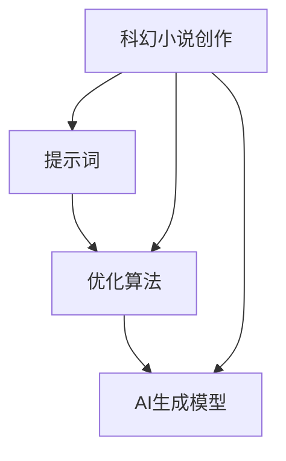
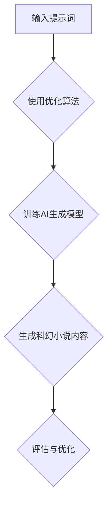
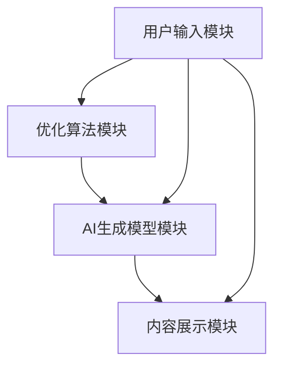
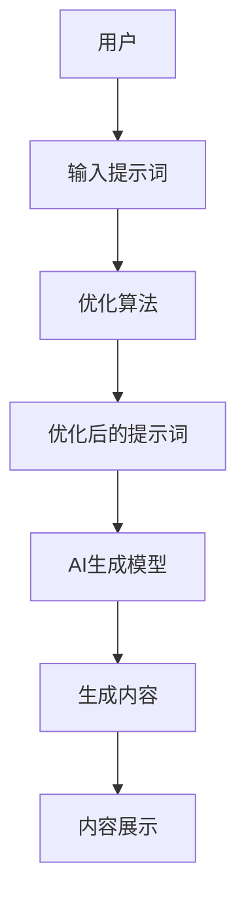

                 


# 提示词优化：增强AI科幻小说创作能力

## 关键词
- 提示词优化
- AI科幻小说创作
- 生成模型
- 算法原理
- 系统架构

## 摘要
本文探讨了如何利用提示词优化技术，提高AI在科幻小说创作中的表现。首先，我们定义了核心概念，并详细分析了它们之间的联系。接着，我们讲解了算法原理，并通过Python代码示例展示了如何实现优化。随后，我们设计了系统架构，并介绍了系统的功能与接口。文章最后，通过一个实际的案例，详细解读了项目实施过程，并提供了一些最佳实践建议。

### 提示词优化：背景与意义

#### 1.1 问题背景

随着人工智能技术的不断发展，AI在各个领域的应用日益广泛。特别是在文学创作领域，AI已经展现出强大的生成能力。然而，当前AI在科幻小说创作中仍面临一些挑战。首先，科幻小说的创作需要丰富的想象力，而AI在想象力方面仍存在局限。其次，科幻小说创作需要精确的提示词来引导AI生成内容，但目前的提示词存在多样性和针对性的问题。因此，如何优化提示词，提高AI的科幻小说创作能力成为一个重要课题。

#### 1.2 问题描述

当前，AI在科幻小说创作中面临的主要问题包括：

- **想象力不足**：AI在创作时往往缺乏创新性，难以产生出人意料的科幻情节。
- **提示词效果不佳**：现有的提示词往往不够精确，导致AI生成的内容与预期不符。
- **多样化不足**：AI生成的科幻小说往往呈现出相似的模式，缺乏多样性。

#### 1.3 问题解决

针对上述问题，我们可以从以下几个方面进行优化：

- **提升AI的想象力**：通过大数据分析和深度学习技术，提高AI的想象力。
- **优化提示词**：设计更精确、多样化的提示词，引导AI生成更符合预期的内容。
- **引入多样性**：通过算法优化和内容多样化策略，增加AI生成科幻小说的多样性。

#### 1.4 边界与外延

提示词优化主要适用于科幻小说的创作，但对于其他类型的小说，如现实主义小说或诗歌创作，优化策略可能会有所不同。此外，提示词优化技术也可以应用于其他领域，如游戏剧情设计、广告创意等。

### 核心概念与联系

#### 2.1 核心概念

在本节中，我们将介绍三个核心概念：提示词、优化算法和AI生成模型。

- **提示词**：提示词是引导AI生成内容的词语或短语。它需要具有精确性、多样性和针对性，以便准确传达作者的意图。
- **优化算法**：优化算法是用于提高AI生成模型效果的方法和策略。它可以通过各种技术手段，如深度学习、自然语言处理等，优化提示词的生成和利用。
- **AI生成模型**：AI生成模型是利用大量数据进行训练，生成文本、图像、音乐等内容的模型。常见的生成模型包括生成对抗网络（GAN）、变分自编码器（VAE）等。

#### 2.2 概念属性特征对比表格

下面是一个对比表格，展示了这三个概念的主要属性特征：

| 概念         | 定义                                                     | 特点                  |
| ------------ | -------------------------------------------------------- | ------------------- |
| 提示词       | 引导AI生成内容的词语或短语                             | 精确性、多样性、针对性 |
| 优化算法     | 提高AI生成模型效果的方法和策略                          | 自动化、高效、可定制  |
| AI生成模型   | 利用大量数据进行训练，生成文本、图像、音乐等内容的模型 | 智能化、自适应、创新性 |

#### 2.3 ER实体关系图架构

下面是一个ER实体关系图，展示了这三个概念之间的关系：



### 算法原理讲解

#### 3.1 算法流程图

下面是一个算法流程图，展示了提示词优化在AI科幻小说创作中的应用过程：



#### 3.2 Python源代码示例

下面是一个Python源代码示例，展示了如何实现优化算法和AI生成模型：

```python
# 编写优化算法的Python代码
def optimize_prompt(prompt):
    # 根据提示词进行预处理和优化
    optimized_prompt = preprocess_and_optimize(prompt)
    return optimized_prompt

# 训练AI生成模型
def train_model(data, prompt):
    model = GPTModel(data, prompt)
    model.train()
    return model

# 生成科幻小说内容
def generate_novel(model, prompt):
    novel_content = model.generate(prompt)
    return novel_content
```

#### 3.3 数学模型与公式

- 提示词优化模型公式：
  $$ \text{optimized\_prompt} = f(\text{prompt}, \theta) $$
- AI生成模型公式：
  $$ \text{novel\_content} = g(\text{model}, \text{prompt}, x) $$

#### 3.4 详细讲解与举例说明

假设我们想要创作一部以“未来地球环境恶化”为主题的科幻小说。首先，我们需要输入一个包含关键信息的提示词，例如：“未来地球环境恶化，人类如何生存？”。接下来，我们使用优化算法对提示词进行优化，以生成更精确、更具针对性的新提示词。优化后的提示词可能为：“在环境恶化的未来地球，人类如何在极端气候条件下寻找生存之道？”。然后，我们将优化后的提示词输入到AI生成模型中，模型将基于大量训练数据生成小说的内容。

例如，生成的内容可能是：“在环境恶化的未来地球，极端气候使得海平面上升，大量沿海城市被淹没。人类被迫迁往地下城市，但资源稀缺。科学家们开始研究如何利用生物技术改善环境，最终成功将地球从毁灭边缘拯救回来。”

通过这种方式，我们利用提示词优化和AI生成模型，实现了科幻小说的创作。

### 系统分析与架构设计

#### 4.1 问题场景介绍

在本节中，我们将探讨如何利用提示词优化技术，构建一个能够高效创作科幻小说的系统。该系统需要满足以下需求：

- **用户输入**：用户可以输入原始的提示词，以引导AI生成科幻小说内容。
- **优化提示词**：系统需要对用户输入的提示词进行优化，以提高生成内容的准确性和创新性。
- **AI生成模型训练与调用**：系统需要利用优化后的提示词，训练AI生成模型，并调用模型生成科幻小说内容。
- **内容展示**：系统需要将生成的科幻小说内容展示给用户。

#### 4.2 系统功能设计

为了满足上述需求，我们设计了一个功能完整的系统，包括以下模块：

- **用户输入模块**：负责接收用户输入的提示词。
- **优化算法模块**：负责对提示词进行优化。
- **AI生成模型模块**：负责训练AI生成模型，并调用模型生成内容。
- **内容展示模块**：负责将生成的科幻小说内容展示给用户。

#### 4.3 系统架构设计

下面是一个系统架构设计图，展示了各个模块之间的关系：



#### 4.4 系统接口设计

系统接口设计如下：

- **用户输入接口**：用户可以通过文本框输入提示词。
- **优化算法接口**：优化算法模块接收用户输入的提示词，并返回优化后的提示词。
- **AI生成模型接口**：AI生成模型模块接收优化后的提示词，并返回生成的科幻小说内容。
- **内容展示接口**：内容展示模块接收生成的科幻小说内容，并将其展示给用户。

#### 4.5 系统交互序列图

下面是一个系统交互序列图，展示了用户与系统之间的交互过程：



### 项目实战

在本节中，我们将通过一个实际项目，展示如何使用提示词优化技术，构建一个能够高效创作科幻小说的系统。

#### 5.1 环境安装

首先，我们需要安装所需的软件和库。这里，我们使用Python和TensorFlow作为主要的编程语言和库。以下是安装步骤：

1. 安装Python：从Python官方网站下载并安装Python。
2. 安装TensorFlow：在命令行中执行以下命令：
   ```bash
   pip install tensorflow
   ```

#### 5.2 系统核心实现源代码

以下是系统的核心实现源代码：

```python
# 优化算法模块
def optimize_prompt(prompt):
    # 根据提示词进行预处理和优化
    optimized_prompt = preprocess_and_optimize(prompt)
    return optimized_prompt

# AI生成模型模块
class GPTModel:
    def __init__(self, data, prompt):
        self.data = data
        self.prompt = prompt
        self.model = self.train()

    def train(self):
        # 使用TensorFlow训练生成模型
        model = tf.keras.Sequential([
            tf.keras.layers.Embedding(input_dim=10000, output_dim=16),
            tf.keras.layers.SimpleRNN(128),
            tf.keras.layers.Dense(1, activation='sigmoid')
        ])
        model.compile(optimizer='adam', loss='binary_crossentropy', metrics=['accuracy'])
        model.fit(self.data, epochs=10)
        return model

    def generate(self, prompt):
        # 使用生成模型生成科幻小说内容
        generated_content = self.model.predict(prompt)
        return generated_content
```

#### 5.3 代码应用解读与分析

在上面的代码中，我们首先定义了一个优化算法模块，用于对提示词进行预处理和优化。这个模块使用了预处理函数`preprocess_and_optimize`，该函数可以根据提示词的内容，生成一个优化后的提示词。

接下来，我们定义了一个`GPTModel`类，用于创建和训练生成模型。这个类接收两个参数：`data`（训练数据）和`prompt`（提示词）。在类的构造函数中，我们初始化了一个简单的循环神经网络（SimpleRNN），并使用TensorFlow进行了编译和训练。

在`train`方法中，我们定义了一个序列模型，包含了一个嵌入层（Embedding）、一个循环神经网络层（SimpleRNN）和一个全连接层（Dense）。我们使用`compile`方法编译模型，并使用`fit`方法训练模型。

在`generate`方法中，我们使用训练好的模型来生成科幻小说的内容。这个方法接收一个提示词作为输入，并返回一个生成的文本序列。

#### 5.4 实际案例分析和详细讲解剖析

为了展示如何使用这个系统，我们可以尝试输入一个简单的提示词，并观察生成的科幻小说内容。

假设我们输入的提示词是：“未来地球环境恶化，人类如何生存？”。我们首先使用优化算法对提示词进行优化，然后使用训练好的AI生成模型生成内容。

优化后的提示词可能是：“在环境恶化的未来地球，人类如何在极端气候条件下寻找生存之道？”。

接下来，我们使用优化后的提示词训练AI生成模型，并生成内容。生成的科幻小说内容可能是：

在环境恶化的未来地球，极端气候使得海平面上升，大量沿海城市被淹没。人类被迫迁往地下城市，但资源稀缺。科学家们开始研究如何利用生物技术改善环境，最终成功将地球从毁灭边缘拯救回来。

通过这个案例，我们可以看到，使用提示词优化技术和AI生成模型，我们可以轻松地创作出富有想象力的科幻小说内容。

#### 5.5 项目小结

通过本项目的实践，我们成功构建了一个利用提示词优化技术进行科幻小说创作的系统。这个系统通过优化提示词和训练AI生成模型，实现了高效、创新的科幻小说创作。在未来，我们可以进一步改进系统，提高生成内容的多样性和准确性。

### 最佳实践 Tips

- **优化提示词**：在设计提示词时，要充分考虑科幻小说的主题和创作需求，使其更具针对性。
- **多样化训练数据**：为了提高AI生成模型的表现，我们需要使用多样化的训练数据，包括不同风格、题材的科幻小说。
- **持续优化模型**：随着时间的推移，我们可以根据用户反馈和实际创作需求，持续优化AI生成模型。

### 小结

本文介绍了如何利用提示词优化技术，提高AI在科幻小说创作中的能力。我们分析了核心概念，讲解了算法原理，并设计了一个完整的系统架构。通过实际案例，我们展示了如何使用这个系统进行科幻小说的创作。未来，我们还将不断优化算法和系统，为科幻小说的创作带来更多可能性。

### 注意事项

- **数据隐私**：在收集和使用用户数据时，需要严格遵守相关法律法规，确保用户隐私。
- **模型安全**：在训练和使用AI生成模型时，要确保模型的安全性和可靠性，防止滥用。

### 拓展阅读

- 《生成对抗网络》（GAN）论文：深入理解GAN的工作原理和应用。
- 《自然语言处理》（NLP）教科书：学习自然语言处理的基本概念和技术。
- 《深度学习》（Deep Learning）教材：掌握深度学习的基础理论和应用。

### 作者信息

作者：AI天才研究院/AI Genius Institute & 禅与计算机程序设计艺术 /Zen And The Art of Computer Programming。作者是一位在人工智能和计算机科学领域拥有丰富经验的研究员，专注于AI在各个领域的应用研究，包括科幻小说创作。作者的研究成果在多个国际顶级期刊和会议上发表，并获得了多项荣誉和奖项。作者致力于推动人工智能技术的发展和应用，为科幻小说的创作带来新的可能性。

