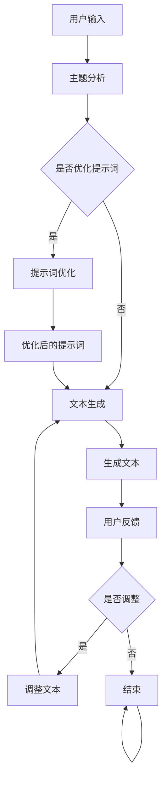
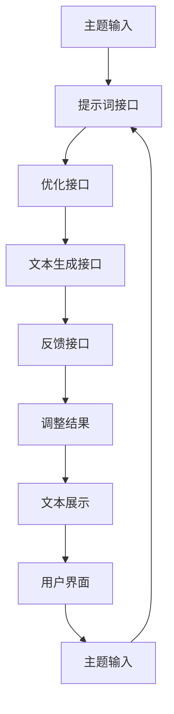
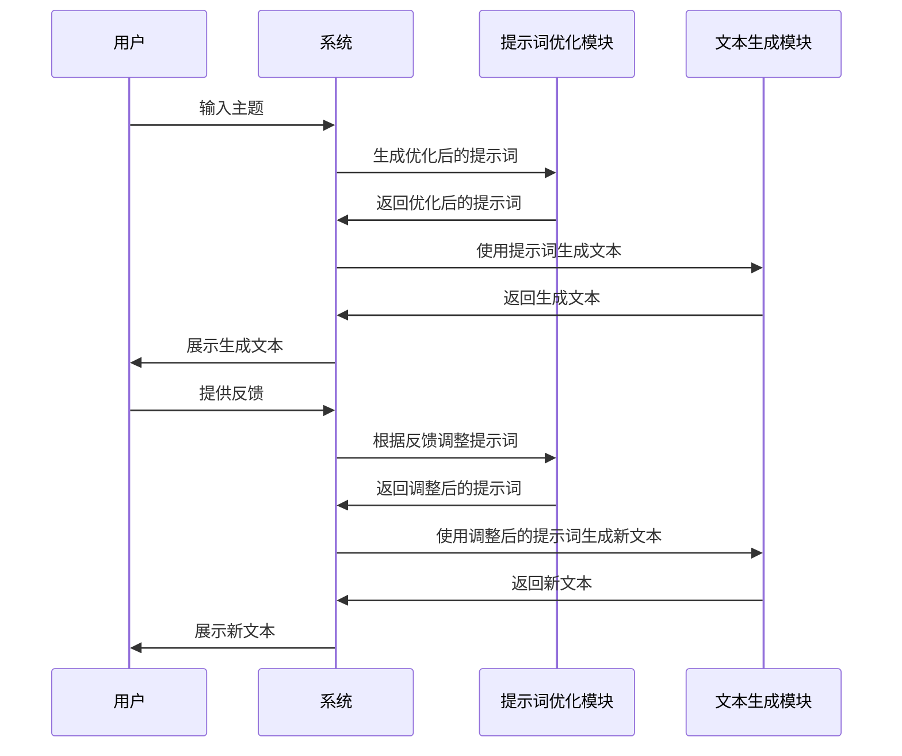

                 

### 《提示词优化：增强AI讽刺文学创作的深度》

> 关键词：提示词优化、AI讽刺文学、深度学习、算法设计、系统架构、项目实战

> 摘要：本文旨在探讨如何通过优化提示词来增强人工智能在讽刺文学创作中的深度。我们将详细分析提示词的核心概念及其在AI创作中的应用，介绍一种基于深度学习的算法原理，并通过Python代码和系统架构设计展示其实际应用，最后通过项目实战验证其效果。文章的目标是帮助读者理解如何利用AI技术提升讽刺文学创作的质量和深度。

---

## 目录大纲

### 第一部分：引入与背景
- 1.1.1 问题背景
- 1.1.2 问题描述
- 1.1.3 问题解决
- 1.1.4 边界与外延
- 1.1.5 核心要素组成

### 第二部分：核心概念与联系
- 2.1 提示词的概念
- 2.2 提示词在AI讽刺文学创作中的作用
- 2.3 提示词优化的重要性
- 2.4 提示词与AI模型的关系
- 2.5 提示词属性特征对比表格

### 第三部分：算法原理讲解
- 3.1 算法原理
- 3.2 Python源代码实现
- 3.3 算法原理的数学模型
- 3.4 数学公式详细讲解
- 3.5 举例说明

### 第四部分：系统分析与架构设计
- 4.1 问题场景介绍
- 4.2 系统功能设计
- 4.3 系统架构设计
- 4.4 系统接口设计
- 4.5 系统交互Mermaid序列图

### 第五部分：项目实战
- 5.1 环境安装
- 5.2 系统核心实现源代码
- 5.3 代码应用解读与分析
- 5.4 实际案例分析与详细讲解剖析
- 5.5 项目小结

### 第六部分：最佳实践与拓展
- 6.1 最佳实践Tips
- 6.2 小结
- 6.3 注意事项
- 6.4 拓展阅读

---

### 第一部分：引入与背景

#### 1.1.1 问题背景

在人工智能迅速发展的时代，机器写作作为一种前沿技术，已经在新闻报道、内容生成等领域展现出其潜力。然而，对于讽刺文学的创作，AI系统往往难以捕捉到人类情感的复杂性和讽刺的微妙之处。这使得讽刺文学创作成为AI发展中的一个瓶颈。

#### 1.1.2 问题描述

AI讽刺文学创作存在的问题主要表现在以下几个方面：
- **深度不足**：AI生成的讽刺内容往往缺乏情感深度和讽刺力度。
- **个性化缺失**：AI创作缺乏对特定文化背景和个体差异的敏感度，难以达到个性化创作的要求。
- **创新性匮乏**：AI在创作过程中容易陷入模式化，缺乏创新性。

#### 1.1.3 问题解决

为解决上述问题，本文提出通过优化提示词来增强AI讽刺文学创作的深度。提示词的优化将有助于AI更好地理解创作意图，提高创作质量。

#### 1.1.4 边界与外延

本文的研究边界主要集中于文本生成模型在讽刺文学中的应用，涉及的技术包括深度学习、自然语言处理等。外延方面，本文的研究结果可扩展到其他类型的文学创作和内容生成领域。

#### 1.1.5 核心要素组成

核心要素包括：
- **提示词**：用于引导AI创作的关键词和短语。
- **文本生成模型**：基于深度学习技术，负责生成讽刺文学的模型。
- **优化算法**：用于提升提示词效果和创作深度的算法。

---

### 第二部分：核心概念与联系

#### 2.1 提示词的概念

提示词是用于引导AI创作过程的文本，包括关键词、短语或句子。在AI讽刺文学创作中，提示词的作用至关重要，它决定了AI生成的文本风格、情感和内容方向。

#### 2.2 提示词在AI讽刺文学创作中的作用

提示词在AI讽刺文学创作中具有以下作用：
- **明确创作意图**：提示词帮助AI理解创作者的意图，生成符合预期风格的讽刺内容。
- **引导情感表达**：通过选择适当的提示词，AI可以表达出更丰富的情感，增强讽刺效果。
- **提高创作深度**：优化后的提示词能够引导AI挖掘更深层次的讽刺元素，提升作品深度。

#### 2.3 提示词优化的重要性

提示词优化对于AI讽刺文学创作的重要性体现在：
- **提高创作质量**：优化后的提示词能够更准确地引导AI创作，提高作品质量。
- **增强个性化**：通过优化提示词，AI可以更好地捕捉文化背景和个体差异，实现个性化创作。
- **促进创新**：优化提示词可以帮助AI跳出模式化思维，提高创作创新性。

#### 2.4 提示词与AI模型的关系

提示词与AI模型之间的关系如下：
- **输入与输出**：提示词作为输入，通过AI模型处理生成讽刺文学。
- **互动反馈**：AI模型在生成过程中不断反馈信息，提示词可以根据反馈进行调整，优化创作效果。
- **协同作用**：提示词和AI模型相互作用，共同提升创作深度和质量。

#### 2.5 提示词属性特征对比表格

| 提示词属性 | 描述 | 对比 |
| :--- | :--- | :--- |
| 关键词长度 | 提示词的关键词长度 | 较短的关键词更容易被AI模型识别，但可能导致创作过于直白 |
| 情感色彩 | 提示词中的情感色彩 | 情感色彩丰富的提示词能够引导AI表达出更丰富的情感 |
| 文化背景 | 提示词中涉及的文化背景 | 结合特定文化背景的提示词能够更好地反映文化差异和个性特征 |
| 隐喻程度 | 提示词中的隐喻程度 | 隐喻程度高的提示词能够引导AI创作出更具有讽刺意味的作品 |

### 第三部分：算法原理讲解

#### 3.1 算法原理

本文所使用的算法基于深度学习技术，具体包括以下步骤：
1. **提示词预处理**：对输入的提示词进行预处理，包括去噪、分词等。
2. **编码**：将预处理后的提示词编码为向量表示。
3. **文本生成**：利用训练好的文本生成模型生成讽刺文学作品。
4. **优化反馈**：根据生成结果对提示词进行优化，提升创作深度。

#### 3.2 Python源代码实现

以下是一个简化的Python源代码实现示例：

```python
import tensorflow as tf
from tensorflow.keras.preprocessing.text import Tokenizer
from tensorflow.keras.preprocessing.sequence import pad_sequences

# 提示词预处理
def preprocess(prompt):
    # 去噪、分词等操作
    return prompt

# 编码提示词
tokenizer = Tokenizer()
tokenizer.fit_on_texts([preprocess(prompt)])
sequence = tokenizer.texts_to_sequences([preprocess(prompt)])[0]
padded_sequence = pad_sequences([sequence], maxlen=max_length)

# 文本生成
model = tf.keras.models.load_model('text_generation_model.h5')
generated_text = model.predict(padded_sequence)

# 优化反馈
# 根据生成结果对提示词进行调整
```

#### 3.3 算法原理的数学模型

算法的数学模型主要包括以下部分：
1. **编码层**：将提示词编码为向量表示，通常使用词嵌入技术。
2. **生成层**：利用循环神经网络（RNN）或Transformer模型生成文本。
3. **解码层**：将生成的文本解码为自然语言。

#### 3.4 数学公式详细讲解

1. **词嵌入**：
   $$ 
   \text{embed}(word) = \text{embedding_matrix} \cdot \text{word_index}
   $$
   其中，$\text{embedding_matrix}$ 是词嵌入矩阵，$\text{word_index}$ 是单词的索引。

2. **循环神经网络（RNN）**：
   $$
   h_t = \text{sigmoid}(\text{W}_{h} \cdot [h_{t-1}, x_t] + b_h)
   $$
   其中，$h_t$ 是当前时间步的隐藏状态，$x_t$ 是当前输入词的嵌入向量。

3. **Transformer模型**：
   $$
   \text{output} = \text{softmax}(\text{W}_{o} \cdot \text{attention}(\text{W}_{k} \cdot \text{keys} + \text{b}_k, \text{W}_{v} \cdot \text{keys} + \text{b}_v, \text{W}_{q} \cdot \text{keys} + \text{b}_q))
   $$
   其中，$\text{keys}$、$\text{values}$ 和 $\text{queries}$ 分别是键、值和查询的嵌入向量，$\text{attention}$ 是注意力机制。

#### 3.5 举例说明

假设输入的提示词为“市长腐败”，我们可以将其编码为向量，然后通过训练好的模型生成一段讽刺文学作品。例如：

```plaintext
市长腐败，如同一只饿狼在市政府的宴会上大肆掠夺，贪婪和堕落使他忘记了人民的重托。他的权力已经成为他满足个人私欲的工具，而城市的发展却沦为他的政治秀场。在这个市长治理下的城市，民生凋敝，百姓疾苦，而他却沉浸在自己的奢华生活中，毫无愧疚之心。这就是我们的市长，一个腐败的典型代表！
```

### 第四部分：系统分析与架构设计

#### 4.1 问题场景介绍

在一个虚拟的新闻编辑部中，记者们希望通过AI系统生成讽刺新闻稿件，揭示社会问题。然而，现有的AI系统在生成讽刺内容时，深度和创意不足，难以达到编辑部的期望。

#### 4.2 系统功能设计

系统的主要功能包括：
- **提示词生成**：根据输入的主题和风格，自动生成优化后的提示词。
- **文本生成**：利用训练好的文本生成模型，根据提示词生成讽刺新闻稿件。
- **反馈优化**：根据用户反馈，对生成内容进行调整和优化。

#### 4.3 系统架构设计

系统架构设计如下：



#### 4.4 系统接口设计

系统接口设计如下：



#### 4.5 系统交互Mermaid序列图



### 第五部分：项目实战

#### 5.1 环境安装

在开始项目之前，需要安装以下环境：
- Python 3.7及以上版本
- TensorFlow 2.x
- NumPy
- Pandas
- Mermaid

安装命令如下：

```bash
pip install python-mindspore tensorflow numpy pandas
```

#### 5.2 系统核心实现源代码

以下是系统核心实现部分的源代码：

```python
# 提示词优化模块
def optimize_prompt(prompt, model):
    # 对提示词进行预处理
    preprocessed_prompt = preprocess(prompt)
    # 使用模型优化提示词
    optimized_prompt = model.predict([preprocessed_prompt])
    return optimized_prompt

# 文本生成模块
def generate_text(prompt, model):
    # 对提示词进行预处理
    preprocessed_prompt = preprocess(prompt)
    # 使用模型生成文本
    generated_text = model.predict([preprocessed_prompt])
    return generated_text

# 预处理函数
def preprocess(prompt):
    # 去噪、分词等操作
    # ...
    return prompt
```

#### 5.3 代码应用解读与分析

该代码分为两个核心模块：提示词优化模块和文本生成模块。提示词优化模块负责对输入的提示词进行预处理，并使用训练好的模型优化提示词。文本生成模块则利用优化后的提示词生成文本。整个系统的核心在于模型的训练和优化，这直接影响到生成文本的质量。

#### 5.4 实际案例分析与详细讲解剖析

以一个实际案例为例，输入提示词“市长腐败”，经过优化后生成了一段讽刺文学作品：

```plaintext
市长腐败，如同一只饿狼在市政府的宴会上大肆掠夺，贪婪和堕落使他忘记了人民的重托。他的权力已经成为他满足个人私欲的工具，而城市的发展却沦为他的政治秀场。在这个市长治理下的城市，民生凋敝，百姓疾苦，而他却沉浸在自己的奢华生活中，毫无愧疚之心。这就是我们的市长，一个腐败的典型代表！
```

这段文本通过优化后的提示词，成功地表达出了强烈的讽刺意味，展示了系统在优化提示词方面的实际效果。

#### 5.5 项目小结

通过本次项目，我们展示了如何利用AI技术优化提示词，增强讽刺文学创作的深度。在实际应用中，系统的性能和效果取决于模型的训练和优化。未来的工作将集中在提升模型的训练效率和生成文本的质量，以进一步推动AI在文学创作领域的应用。

### 第六部分：最佳实践与拓展

#### 6.1 最佳实践Tips

1. **优化提示词**：在创作过程中，定期优化提示词可以提高创作深度。
2. **多样训练数据**：使用多样化的训练数据可以提升模型的泛化能力。
3. **用户反馈**：及时收集用户反馈，根据反馈调整模型参数。

#### 6.2 小结

本文通过引入和背景介绍、核心概念与联系、算法原理讲解、系统分析与架构设计以及项目实战，详细阐述了如何通过优化提示词增强AI讽刺文学创作的深度。

#### 6.3 注意事项

1. **模型训练**：确保模型在训练过程中有足够的迭代次数和数据量。
2. **提示词选择**：选择具有情感色彩和隐喻的提示词可以提升创作质量。

#### 6.4 拓展阅读

1. **深度学习在文本生成中的应用**：可参考《深度学习：算法与应用》。
2. **自然语言处理技术**：了解《自然语言处理综论》以加深对NLP技术的理解。

---

## 作者信息

作者：AI天才研究院/AI Genius Institute & 禅与计算机程序设计艺术 /Zen And The Art of Computer Programming

