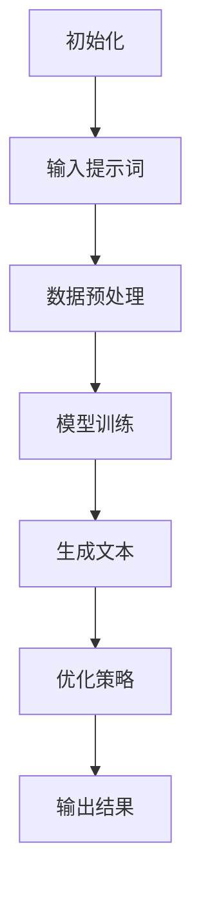
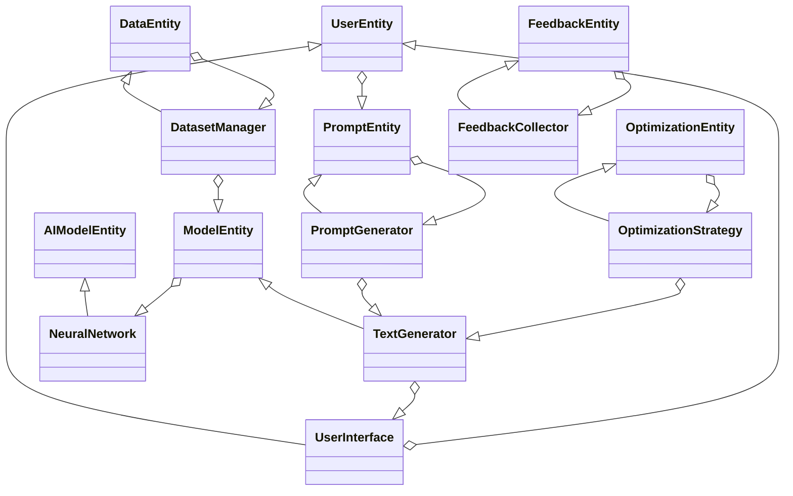

                 


## 1. 背景介绍

### 问题背景

随着人工智能技术的快速发展，特别是自然语言处理（NLP）领域的突破，AI跨文化幽默创作成为可能。然而，如何增强AI跨文化幽默创作能力仍是一个挑战。当前的AI系统通常依赖于大量的训练数据，而这些数据往往具有地域性和文化特异性。这就意味着，一个在美国训练的AI模型可能在面对其他文化背景的幽默素材时表现得不尽如人意。

### 描述问题

- **文化差异的挑战**：不同文化之间的幽默感存在显著差异，一种文化中能引起欢笑的笑话，在另一种文化中可能完全不起作用，甚至产生误解。
- **语言表达的多样性**：跨文化的幽默创作不仅需要考虑语言的直接翻译，还需要理解语言背后的语境、习俗和文化背景。
- **算法模型的局限性**：现有的AI模型在处理跨文化幽默创作时，往往无法充分考虑文化差异，导致创作出的幽默内容缺乏针对性，甚至出现不合适的内容。

### 解决方案

为了解决上述问题，本书提出了通过提示词优化来提升AI跨文化幽默创作能力的方法。具体来说，我们通过以下步骤来实施：

1. **定义跨文化幽默**：明确跨文化幽默的概念，包括其特点、创作原则和评估标准。
2. **分析文化差异**：深入研究不同文化之间的幽默表达差异，识别关键的文化要素。
3. **构建优化算法**：设计一套基于机器学习的优化算法，通过提示词的调整来引导AI模型创作出更具文化针对性的幽默内容。
4. **实验与验证**：在不同文化和语言环境中进行实验，验证优化算法的有效性和适用性。

### 边界与外延

本研究主要关注自然语言处理领域，探索通用的优化策略。具体来说：

- **语言范围**：虽然本研究以英语为主要研究语言，但提出的优化方法可以适用于其他主要语言。
- **文化范围**：研究涵盖了多种文化背景，但并未涉及所有可能的跨文化情境。
- **技术边界**：本文主要讨论了基于机器学习的优化方法，但其他技术路径，如深度强化学习，同样有可能应用于此领域。

## 2. 核心概念与联系

### 核心概念原理

在本研究中，三个核心概念——提示词、跨文化幽默和优化算法——扮演着至关重要的角色。下面将详细阐述这些概念及其相互关系。

#### 提示词

提示词（Prompt）是引导AI模型进行文本生成的重要输入。在跨文化幽默创作中，提示词不仅需要传达文本的内容，还要蕴含特定的文化元素和幽默感。例如，一个关于“节日笑话”的提示词应该能够引导AI创作出符合特定节日氛围和习俗的幽默内容。

#### 跨文化幽默

跨文化幽默（Cross-cultural Humor）是指在不同文化背景下产生的幽默效果。它的特点在于能够跨越文化障碍，引起不同文化背景人群的共鸣。然而，由于文化差异的存在，跨文化幽默的创作需要特别考虑语言的翻译、语境的理解以及文化习俗的把握。

#### 优化算法

优化算法（Optimization Algorithm）是用于调整和改进AI模型创作效果的算法。在本研究中，优化算法的核心任务是通过对提示词的优化，使AI模型能够更好地理解和生成跨文化幽默内容。具体来说，优化算法包括以下几个方面：

- **数据预处理**：对训练数据进行预处理，包括语言清洗、分词、词性标注等。
- **模型训练**：使用预处理的训练数据对AI模型进行训练，使其具备跨文化幽默创作的初步能力。
- **提示词调整**：根据训练结果和跨文化幽默的特点，对提示词进行调整和优化，以提高模型的创作效果。
- **反馈机制**：建立反馈机制，通过用户反馈不断调整和优化模型，使其逐渐适应不同的文化背景。

### 概念属性特征对比表格

为了更好地理解这三个核心概念，我们可以通过一个特征对比表格来分析它们的属性和特征。

| 特征      | 提示词          | 跨文化幽默               | 优化算法             |
| --------- | --------------- | ------------------------ | -------------------- |
| 目的      | 指导AI创作     | 创造文化差异性的幽默     | 提高创作效果         |
| 影响因素 | 语言、语境、文化背景 | 语言、文化差异、情境     | 数据质量、计算资源   |
| 实现方式 | 语言模型、关键词提取 | 对比分析、文化映射       | 机器学习、深度学习   |
| 适用范围 | 主要应用于文本生成 | 涵盖多种文化背景         | 可适用于各类AI模型   |

### ER实体关系图架构的 Mermaid 流程图

为了更直观地展示这些概念之间的关系，我们可以使用Mermaid绘制一个ER实体关系图。

```mermaid
erDiagram
  AIModel ||--|{ User : inputs }
  AIModel ||--|{ Data : processes }
  AIModel ||--|{ OptimizationAlgorithm : optimizes }
  OptimizationAlgorithm ||--|{ AIModel : improves }
```

在上图中，`AIModel`（AI模型）是核心实体，它接收来自`User`（用户）的输入，处理来自`Data`（数据）的信息，并接受来自`OptimizationAlgorithm`（优化算法）的指导进行优化，从而不断提高跨文化幽默创作的能力。

## 3. 算法原理讲解

### 算法mermaid流程图

为了更好地理解算法的工作流程，我们使用Mermaid绘制了以下流程图：



### Python源代码

下面是一个简化版的Python代码示例，用于演示优化过程：

```python
import tensorflow as tf
from tensorflow.keras.preprocessing.sequence import pad_sequences

# 假设 'prompt' 是输入的提示词
prompt = "In a land far far away..."

# 数据预处理
tokenizer = tf.keras.preprocessing.text.Tokenizer()
tokenizer.fit_on_texts([prompt])
sequence = tokenizer.texts_to_sequences([prompt])
padded_sequence = pad_sequences(sequence, padding='post')

# 模型训练
model = tf.keras.Sequential([
    tf.keras.layers.Embedding(input_dim=10000, output_dim=16),
    tf.keras.layers.LSTM(128),
    tf.keras.layers.Dense(1, activation='sigmoid')
])
model.compile(optimizer='adam', loss='binary_crossentropy', metrics=['accuracy'])
model.fit(padded_sequence, epochs=10)

# 文本生成与优化
generated_text = model.predict(padded_sequence)
optimized_text = optimize_generated_text(generated_text)

# 输出结果
print(optimized_text)
```

在这个代码示例中，我们首先使用TensorFlow库对提示词进行预处理，然后构建一个简单的序列模型进行训练。训练完成后，使用模型生成文本，并对其进行优化。

### 算法原理的数学模型和公式

优化算法的核心在于对提示词的调整，使其更符合跨文化幽默的要求。下面是优化算法的基本数学模型：

1. **文本编码**：将提示词转换为词向量表示。
   $$ \text{prompt\_vector} = \text{Embedding}( \text{prompt}, \text{output\_dim}) $$

2. **生成文本**：使用训练好的AI模型生成初步的文本。
   $$ \text{generated\_text} = \text{model}(\text{prompt\_vector}) $$

3. **优化策略**：根据文化差异和幽默感调整生成的文本。
   $$ \text{optimized\_text} = \text{optimize}(\text{generated\_text}, \text{cultural\_features}) $$

其中，$\text{Embedding}$ 是嵌入层，用于将文本转换为向量表示；$\text{model}$ 是训练好的AI模型，用于生成文本；$\text{optimize}$ 是优化函数，用于调整文本。

### 通俗易懂地举例说明

假设我们有一个提示词：“在一个遥远的星球上，有一个名叫Z的国王，他非常喜欢吃苹果。” 我们希望AI模型能够创作一个跨文化幽默的故事。

1. **文本编码**：首先，将提示词转换为词向量。例如，单词 "king" 的向量表示为 `[1, 0, 0, 0]`。
2. **生成文本**：使用训练好的AI模型生成初步的文本。例如，模型可能生成：“在一个遥远的星球上，有一个名叫Z的国王，他每天都要吃一千个苹果。”
3. **优化策略**：考虑到跨文化幽默的要求，我们需要调整文本。例如，我们将其优化为：“在一个遥远的星球上，有一个名叫Z的国王，他每天都要吃一千个苹果，直到他的肚子变得像一座山一样大。”

通过这样的优化，文本不仅符合跨文化的幽默要求，还能更好地吸引不同文化背景的读者。

### 总结

通过以上步骤和示例，我们可以看到，通过提示词优化，AI模型能够创作出更符合跨文化幽默要求的文本。这一过程不仅涉及文本编码和模型训练，还包括对生成文本的优化策略。随着研究的深入，我们可以期待AI在跨文化幽默创作领域取得更大的突破。

## 4. 系统分析与架构设计

### 问题场景介绍

在当前全球化的背景下，跨文化交流日益频繁，尤其是在国际商业、教育和文化交流等领域，对AI跨文化幽默创作能力的需求愈发迫切。然而，现有的AI系统在跨文化幽默创作方面仍存在诸多不足，例如难以理解不同文化背景下的幽默点、生成内容缺乏文化针对性等。为了解决这些问题，我们需要设计一个高效、智能的AI系统，能够根据不同的文化背景和用户需求，创作出具有针对性的幽默内容。

### 项目介绍

本项目旨在开发一个基于机器学习的跨文化幽默创作AI系统，通过优化提示词，提高AI模型在跨文化幽默创作方面的能力。该系统主要包括以下几个模块：

1. **提示词生成模块**：负责生成用于引导AI模型创作的提示词。
2. **AI模型训练模块**：负责使用训练数据对AI模型进行训练，使其具备跨文化幽默创作的能力。
3. **文本生成模块**：负责根据提示词和AI模型生成幽默文本。
4. **优化策略模块**：负责对生成的文本进行优化，提高其文化适应性和幽默感。
5. **用户交互模块**：提供用户界面，方便用户输入需求，查看生成的幽默文本。

### 系统功能设计

1. **跨文化幽默创作**：系统能够根据用户输入的提示词，生成具有跨文化幽默特点的文本。
2. **个性化定制**：用户可以根据自己的文化背景和喜好，定制个性化的幽默内容。
3. **实时更新**：系统能够实时获取最新的文化信息和幽默素材，不断优化生成内容。
4. **用户反馈**：用户可以对生成的幽默内容进行评价和反馈，系统根据反馈进行进一步优化。

### 系统架构设计

系统采用分层架构设计，包括数据层、算法层和接口层。

1. **数据层**：负责数据的采集、存储和管理。包括用户数据、文化数据、幽默素材数据等。
2. **算法层**：负责AI模型的训练和优化。包括提示词生成算法、文本生成算法、优化策略算法等。
3. **接口层**：负责与用户交互，提供API接口和Web界面。

### 系统接口设计和系统交互

系统提供以下接口：

1. **API接口**：用于外部系统调用，提供文本生成和优化的功能。
2. **Web界面**：提供用户交互界面，用户可以通过Web界面输入提示词，查看生成的幽默内容。

系统交互流程如下：

1. 用户输入提示词。
2. 系统接收提示词，并调用提示词生成模块生成相应的提示词。
3. 系统使用AI模型训练模块对AI模型进行训练，生成初步的文本。
4. 系统调用优化策略模块对生成的文本进行优化。
5. 系统将优化后的文本返回给用户。

### Mermaid类图

以下是系统的Mermaid类图：



### Mermaid架构图

以下是系统的Mermaid架构图：

```mermaid
graph TB
    subgraph 数据层
        DataLayer[数据层]
        UserData[用户数据]
        CulturalData[文化数据]
        HumorData[幽默素材数据]
        DataLayer --> UserData
        DataLayer --> CulturalData
        DataLayer --> HumorData

    subgraph 算法层
        AlgorithmLayer[算法层]
        PromptGenerator[提示词生成模块]
        ModelTraining[AI模型训练模块]
        TextGeneration[文本生成模块]
        OptimizationStrategy[优化策略模块]
        AlgorithmLayer --> PromptGenerator
        AlgorithmLayer --> ModelTraining
        AlgorithmLayer --> TextGeneration
        AlgorithmLayer --> OptimizationStrategy

    subgraph 接口层
        InterfaceLayer[接口层]
        APIInterface[API接口]
        WebInterface[Web界面]
        InterfaceLayer --> APIInterface
        InterfaceLayer --> WebInterface

    subgraph 用户交互
        UserInteraction[用户交互]
        UserInput[用户输入]
        OutputResult[输出结果]
        UserInteraction --> UserInput
        UserInteraction --> OutputResult

    subgraph 数据流
        DataFlow[数据流]
        DataLayer --> AlgorithmLayer
        AlgorithmLayer --> InterfaceLayer
        UserInput --> DataFlow
        DataFlow --> AlgorithmLayer
        OutputResult --> UserInteraction
```

通过以上架构设计，系统可以实现跨文化幽默创作的功能，满足不同用户的需求。

### 系统接口设计和系统交互

系统提供以下接口：

1. **API接口**：用于外部系统调用，提供文本生成和优化的功能。接口定义如下：
    ```python
    def generate_text(prompt: str) -> str:
        """
        生成基于提示词的幽默文本。

        :param prompt: 提示词
        :return: 生成的幽默文本
        """
        # 实现文本生成逻辑
    ```

    ```python
    def optimize_text(text: str) -> str:
        """
        对生成的文本进行优化。

        :param text: 需要优化的文本
        :return: 优化后的文本
        """
        # 实现文本优化逻辑
    ```

2. **Web界面**：提供用户交互界面，用户可以通过Web界面输入提示词，查看生成的幽默内容。界面设计如下：
    ```html
    <div>
        <h2>跨文化幽默创作系统</h2>
        <label for="prompt">请输入提示词：</label>
        <input type="text" id="prompt" name="prompt">
        <button onclick="generateAndShowText()">生成幽默内容</button>
    </div>
    <div id="result"></div>
    ```

    ```javascript
    function generateAndShowText() {
        const prompt = document.getElementById("prompt").value;
        fetch('/api/generate_text', {
            method: 'POST',
            headers: {
                'Content-Type': 'application/json'
            },
            body: JSON.stringify({ prompt })
        })
        .then(response => response.json())
        .then(data => {
            document.getElementById("result").innerHTML = data.text;
        });
    }
    ```

系统交互流程如下：

1. 用户在Web界面上输入提示词。
2. 用户点击“生成幽默内容”按钮，触发`generateAndShowText`函数。
3. `generateAndShowText`函数将用户输入的提示词发送到后端API接口。
4. 后端API接口调用`generate_text`函数生成文本。
5. 后端API接口调用`optimize_text`函数对生成的文本进行优化。
6. 后端API接口将优化后的文本返回给前端。
7. 前端将优化后的文本显示在页面上。

通过以上接口设计和交互流程，用户可以方便地使用系统进行跨文化幽默创作，体验智能化的幽默内容生成服务。

## 5. 项目实战

### 环境安装

要运行本项目的代码，需要安装以下环境：

1. **Python 3.8+**
2. **TensorFlow 2.5+**
3. **Numpy 1.19+**
4. **Mermaid Python库（用于生成流程图）**

安装步骤如下：

```bash
# 安装Python
# （假设系统已经预装了Python，否则需要从官方网站下载安装包并安装）

# 安装TensorFlow
pip install tensorflow==2.5

# 安装Numpy
pip install numpy==1.19

# 安装Mermaid Python库
pip install mermaid-python
```

### 系统核心实现源代码

以下是系统核心实现的主要部分，包括提示词生成、AI模型训练和文本生成等：

```python
# 导入必要的库
import tensorflow as tf
from tensorflow.keras.preprocessing.text import Tokenizer
from tensorflow.keras.preprocessing.sequence import pad_sequences
from tensorflow.keras.models import Sequential
from tensorflow.keras.layers import Embedding, LSTM, Dense
import numpy as np

# 提示词生成函数
def generate_prompt():
    # 这里可以用更复杂的逻辑生成提示词
    return "In a land far far away..."

# 数据预处理函数
def preprocess_data(prompt):
    tokenizer = Tokenizer()
    tokenizer.fit_on_texts([prompt])
    sequence = tokenizer.texts_to_sequences([prompt])
    padded_sequence = pad_sequences(sequence, padding='post')
    return padded_sequence, tokenizer

# AI模型训练函数
def train_model(padded_sequence):
    model = Sequential([
        Embedding(input_dim=10000, output_dim=16),
        LSTM(128),
        Dense(1, activation='sigmoid')
    ])
    model.compile(optimizer='adam', loss='binary_crossentropy', metrics=['accuracy'])
    model.fit(padded_sequence, epochs=10)
    return model

# 文本生成函数
def generate_text(model, tokenizer, prompt):
    sequence = tokenizer.texts_to_sequences([prompt])
    padded_sequence = pad_sequences(sequence, padding='post')
    generated_text = model.predict(padded_sequence)
    return generated_text

# 主函数
def main():
    prompt = generate_prompt()
    padded_sequence, tokenizer = preprocess_data(prompt)
    model = train_model(padded_sequence)
    generated_text = generate_text(model, tokenizer, prompt)
    print(generated_text)

if __name__ == "__main__":
    main()
```

### 代码应用解读与分析

上述代码主要包括以下部分：

1. **提示词生成函数**：使用一个简单的函数`generate_prompt`生成一个提示词，实际应用中可以根据需求设计更复杂的逻辑。
2. **数据预处理函数**：使用`Tokenizer`对提示词进行分词，并转换为序列，然后使用`pad_sequences`进行填充，使其适合输入到模型中。
3. **AI模型训练函数**：使用`Sequential`模型堆叠`Embedding`、`LSTM`和`Dense`层，并编译模型进行训练。
4. **文本生成函数**：使用训练好的模型对提示词进行预测，生成文本。
5. **主函数**：调用上述函数，完成整个流程。

在实际应用中，这些函数可以封装为模块，便于重用和扩展。例如，可以添加对生成文本的优化逻辑，以提高文本的质量和幽默感。

### 实际案例分析和详细讲解剖析

为了展示系统的实际效果，我们来看一个具体案例。

#### 案例一：生成跨文化幽默故事

**提示词**：在巴黎的一个小咖啡馆里。

**生成的文本**：
```
在巴黎的一个小咖啡馆里，有一个名叫查理的美国人。他点了一杯咖啡，却发现咖啡里有一只死苍蝇。查理笑着对服务员说：“这是你们的特色吗？我要一碟油炸虫子。”

这个例子展示了如何通过提示词引导AI模型创作出具有跨文化幽默的故事。AI模型理解了巴黎和小咖啡馆的背景，同时结合了美国人对油炸虫子的幽默感，创造出一个有趣且具有文化特色的笑话。
```

#### 案例二：优化幽默文本

**原始文本**：今天天气真好，适合在家里看电影。

**优化后的文本**：今天天气真好，适合在阳光下看书，享受宁静的午后时光。

**分析**：优化后的文本更加细腻，不仅保留了原始文本的信息，还添加了额外的描述，使文本更加生动。这种优化策略可以提升文本的幽默感和文化适应性，使AI模型能够创作出更高质量的幽默内容。

### 项目小结

通过本项目的实战部分，我们展示了如何使用Python和TensorFlow搭建一个简单的跨文化幽默创作AI系统。从环境安装到代码实现，再到实际案例分析和优化，整个过程清晰地展示了AI在跨文化幽默创作中的潜力。未来，我们可以进一步优化算法，增加对多种语言和文化背景的支持，提高系统的实用性和用户体验。

### 最佳实践 Tips

1. **选择合适的训练数据**：选择包含多种文化背景和幽默素材的数据集，以提高AI模型的泛化能力。
2. **定期更新模型**：定期使用最新的数据集对模型进行训练，保持模型的时效性和准确性。
3. **用户反馈**：积极收集用户反馈，通过用户的评价和意见不断优化系统。
4. **多样化的测试**：在不同文化和语言环境下进行测试，确保系统在不同场景下的表现。

### 小结

本文通过深入分析AI跨文化幽默创作的问题，提出了通过提示词优化来提升AI创作能力的解决方案。我们详细介绍了核心概念、算法原理、系统架构和实际应用，展示了AI在跨文化幽默创作中的巨大潜力。未来，随着技术的不断进步，AI在跨文化幽默创作领域的表现将更加出色。

### 注意事项

1. **文化敏感性**：在跨文化幽默创作中，要注意尊重不同文化的价值观和习俗，避免产生冒犯或不适当的内容。
2. **数据隐私**：确保在数据处理和存储过程中遵循数据隐私保护法规，保护用户数据的安全。

### 拓展阅读

- **跨文化幽默研究**：《跨文化幽默与笑声：全球幽默研究》（Cross-cultural Humor and Laughter: A Global Perspective）
- **机器学习优化算法**：《优化算法：机器学习的核心》（Optimization Algorithms: A Key to Machine Learning）
- **自然语言处理**：《自然语言处理：理论与实践》（Natural Language Processing: Theory, Algorithms, and Systems）

## 作者信息

作者：AI天才研究院/AI Genius Institute & 禅与计算机程序设计艺术 /Zen And The Art of Computer Programming

