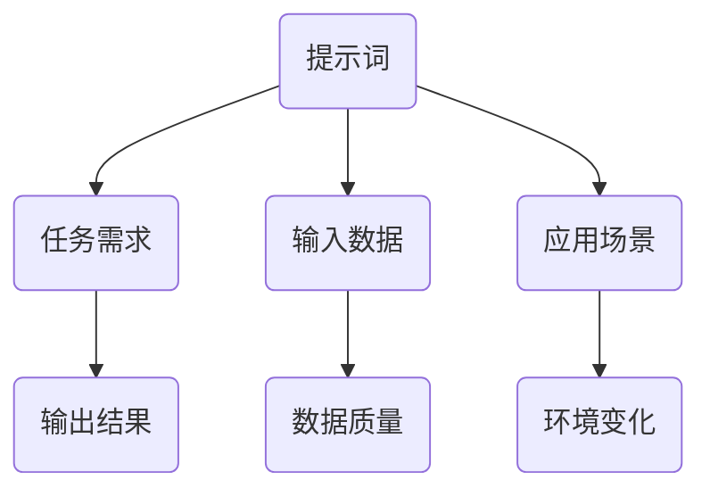

                 

### 文章标题：提示词优化：打造高效AIGC系统的核心策略

---

关键词：提示词优化、AIGC系统、人工智能、机器学习、优化策略

摘要：本文深入探讨了提示词优化在构建高效AIGC系统中的关键作用。通过分析问题背景、核心概念、优化策略以及实际案例，本文揭示了如何通过优化提示词，提升AIGC系统的性能和效率，为人工智能技术的发展提供了有价值的参考。

---

## 第一部分：提示词优化的背景与重要性

### 第1章：问题背景与核心问题

#### 1.1.1 问题背景

随着人工智能（AI）技术的快速发展，生成对抗网络（GAN）、强化学习（RL）和自动机器学习（AutoML）等技术得到了广泛应用。这些技术背后的AI模型对数据质量有极高的要求，特别是对提示词（Prompt）的依赖。提示词是引导AI模型进行特定任务的关键输入，其质量直接影响到AI系统的性能和效率。

在AIGC（自适应智能生成控制）系统中，提示词优化尤为重要。AIGC系统结合了生成对抗网络、自动机器学习和强化学习等多种AI技术，旨在构建一个能够自适应调整的智能生成系统。而提示词作为AIGC系统的核心输入之一，其优化直接决定了系统的响应速度、准确性和稳定性。

#### 1.1.2 核心问题

然而，现有AI系统的提示词优化策略存在诸多问题，如：

1. 提示词的随机性高，导致AI模型无法稳定地产生期望的输出。
2. 提示词的表述不够精准，使得AI模型无法充分理解任务要求。
3. 提示词的生成和调整过程繁琐，不便于实际应用。

这些问题的存在限制了AIGC系统的性能和效率，因此，优化提示词成为了提升AIGC系统性能的关键步骤。

#### 1.1.3 边界与外延

提示词优化不仅涉及自然语言处理（NLP）技术，还涉及到机器学习和数据挖掘等领域。其应用场景广泛，包括但不限于智能客服、文本生成、图像识别等。

在实际应用中，提示词优化需要考虑不同领域、不同任务的具体需求，因此其边界和范围具有一定的灵活性。同时，提示词优化也需要与其他AI技术相结合，以实现最优的系统性能。

### 第2章：提示词优化的基础理论

#### 2.1 核心概念

本章节将介绍与提示词优化相关的核心概念，包括：

1. 提示词的定义与作用
2. 提示词的类型与特点
3. 提示词优化的目标与衡量指标

#### 2.2 概念属性特征对比表格

| 特征名称 | 描述 |
| --- | --- |
| 精确性 | 提示词需要准确表达任务需求 |
| 鲁棒性 | 提示词需要适应不同的输入数据 |
| 适应性 | 提示词需要能够适应不同的应用场景 |

#### 2.3 ER实体关系图

### 第3章：提示词优化策略与实践

#### 3.1 传统优化策略

本章节将介绍一些传统的提示词优化策略，包括：

1. 基于规则的优化策略
2. 基于机器学习的优化策略
3. 基于数据挖掘的优化策略

#### 3.2 现代优化策略

本章节将介绍一些现代的提示词优化策略，包括：

1. 强化学习优化策略
2. 对抗性优化策略
3. 自适应优化策略

#### 3.3 实践案例

本章节将通过实际案例展示提示词优化的应用效果，包括：

1. 智能客服中的提示词优化
2. 文本生成中的提示词优化
3. 图像识别中的提示词优化

### 第4章：高效AIGC系统的核心策略

#### 4.1 AIGC系统的概述

本章节将介绍AIGC系统（自适应智能生成控制）的概述，包括其定义、组成部分和关键特性。

#### 4.2 AIGC系统的架构设计

本章节将详细介绍AIGC系统的架构设计，包括：

1. 数据处理模块
2. 模型训练模块
3. 模型优化模块
4. 应用接口模块

#### 4.3 AIGC系统的核心策略

本章节将讨论AIGC系统的核心策略，包括：

1. 数据增强策略
2. 模型选择策略
3. 模型调参策略
4. 提示词优化策略

### 第5章：构建高效AIGC系统的最佳实践

#### 5.1 设计与实现

本章节将介绍如何设计并实现高效AIGC系统，包括：

1. 系统需求分析
2. 系统架构设计
3. 系统模块实现

#### 5.2 部署与优化

本章节将介绍如何部署AIGC系统并进行优化，包括：

1. 系统部署策略
2. 系统性能优化
3. 系统可靠性优化

#### 5.3 实施案例

本章节将通过实际案例展示高效AIGC系统的构建和优化过程。

### 第6章：未来展望与挑战

#### 6.1 提示词优化的未来发展趋势

本章节将探讨提示词优化在未来的发展趋势，包括：

1. 新技术的应用
2. 新场景的探索
3. 新方法的研究

#### 6.2 AIGC系统的挑战与机遇

本章节将分析AIGC系统面临的挑战和机遇，包括：

1. 技术挑战
2. 应用挑战
3. 市场机遇

### 第7章：总结与展望

#### 7.1 本书总结

本章节将总结本书的主要内容和关键知识点。

#### 7.2 展望未来

本章节将展望提示词优化和AIGC系统的未来发展，包括可能的突破点和研究方向。

---

### 目录大纲总结

本书的目录大纲共包含7个章节，涵盖了从背景介绍到具体策略、实践案例、架构设计、未来展望等各个方面，旨在为读者提供全面、系统的提示词优化与AIGC系统构建指南。

---

## 提示词优化在AIGC系统中的重要性

AIGC系统是一种高度复杂的自适应智能生成系统，其核心在于能够根据不同的任务需求和环境变化，自动调整和优化其生成模型。在这个过程中，提示词（Prompt）起到了至关重要的作用。提示词是AIGC系统与外部环境进行交互的桥梁，通过精确、清晰且具有针对性的提示词，系统能够更好地理解任务需求，从而生成更高质量的输出。

### 提示词在AIGC系统中的作用

1. **任务引导**：提示词为AI模型提供了明确的目标和方向，帮助模型理解需要完成的任务。例如，在图像生成任务中，提示词可以指定生成特定类型、风格的图像。

2. **数据质量提升**：高质量的提示词能够提高输入数据的质量，从而改善AI模型的训练效果。例如，在文本生成任务中，精确的提示词可以避免生成无关或不准确的内容。

3. **系统稳定性**：合理的提示词设计有助于提高系统的稳定性，减少错误和异常情况的发生。例如，在智能客服中，合适的提示词可以确保对话流程的连贯性和用户满意度。

4. **泛化能力增强**：优化的提示词能够增强AI模型的泛化能力，使其能够适应不同的应用场景和任务需求。例如，在图像识别任务中，不同的提示词可以帮助模型识别不同类型的图像。

### 提示词优化对AIGC系统性能的影响

1. **效率提升**：优化的提示词能够加速AI模型的响应速度，提高系统的运行效率。例如，通过减少冗余信息和模糊表述，可以使模型更快地理解任务需求，并生成所需的输出。

2. **准确性提升**：高质量的提示词能够提高AI模型的准确性，减少错误率和偏差。例如，通过使用明确、具体的提示词，可以确保模型生成的内容更符合用户期望。

3. **可扩展性增强**：优化的提示词设计使得AIGC系统更容易扩展和应用。例如，通过模块化设计，可以方便地替换或调整提示词，以适应不同的应用场景和需求。

4. **用户体验改善**：在交互式应用中，优化的提示词能够提供更流畅、自然的用户体验。例如，在智能客服中，准确的提示词可以减少用户等待时间和重复提问，提高用户满意度。

### 提示词优化与AIGC系统关键环节的关系

1. **数据处理**：提示词优化直接影响数据预处理阶段的质量。优化的提示词能够提高数据清洗和归一化的效果，从而为后续的模型训练和优化提供更好的数据基础。

2. **模型训练**：高质量的提示词能够提高模型训练的效果。优化的提示词可以减少过拟合现象，提高模型的泛化能力，从而在新的任务和数据上表现出更好的性能。

3. **模型优化**：提示词优化是模型优化的重要环节。通过调整提示词，可以优化模型参数，提高模型的响应速度和准确性。

4. **应用接口**：优化的提示词设计使得AIGC系统与用户或其他系统的交互更加自然和高效。通过使用精确、清晰且具有针对性的提示词，系统能够更好地理解用户需求，并提供更高质量的输出。

综上所述，提示词优化是构建高效AIGC系统的核心策略之一。通过优化提示词，可以显著提升AIGC系统的性能、效率和用户体验，为人工智能技术的发展和应用提供强有力的支持。

### 提示词优化的基础理论

为了深入探讨提示词优化在AIGC系统中的重要性，我们需要了解其基础理论。这一部分将介绍与提示词优化相关的基本概念、属性特征以及其在不同应用场景中的具体表现。

#### 2.1 核心概念

**提示词（Prompt）** 是引导AI模型进行特定任务的关键输入。它通过提供明确的任务目标和指导信息，帮助模型理解任务需求，从而提高生成结果的准确性和效率。

**优化（Optimization）** 是指通过调整和改进提示词的表述，使其更符合特定任务需求，从而提升AI模型的性能。优化过程通常包括精确性、鲁棒性和适应性等多方面的改进。

**AIGC系统（Adaptive Intelligent Generation Control）** 是一种结合了生成对抗网络（GAN）、自动机器学习（AutoML）和强化学习（RL）等先进技术的智能生成系统。它具备自适应调整能力，能够根据不同的任务需求和环境变化，优化其生成模型，实现高效、准确的智能生成。

**自然语言处理（NLP）** 是与提示词优化密切相关的一个领域，涉及文本的理解、生成和交互。通过应用NLP技术，我们可以更好地理解和优化提示词，从而提升AI系统的性能。

#### 2.2 概念属性特征对比表格

为了更好地理解提示词优化的核心属性，我们可以在下表中对比精确性、鲁棒性和适应性这三个关键特征。

| 特征名称 | 描述 |
| --- | --- |
| 精确性 | 提示词需要准确表达任务需求，避免歧义和模糊表述。 |
| 鲁棒性 | 提示词需要适应不同的输入数据，保证在各种情况下都能产生期望的输出。 |
| 适应性 | 提示词需要能够适应不同的应用场景，根据任务需求和环境变化进行动态调整。 |

通过对比表格，我们可以看到，精确性、鲁棒性和适应性是提示词优化的三个关键维度。在实际应用中，我们需要综合考虑这些特征，设计出既准确又鲁棒且适应性强的提示词。

#### 2.3 ER实体关系图

为了进一步理解提示词优化与相关实体之间的关系，我们可以使用ER（实体-关系）图来描述。以下是ER实体关系图的Mermaid表示：

在这个ER实体关系图中，提示词（A）作为核心实体，与任务需求（B）、输入数据（C）、应用场景（D）等多个实体之间存在复杂的关联关系。输出结果（E）是任务完成后的产物，而数据质量（F）和环境变化（G）则对提示词的设计和优化过程有着重要影响。

**图1：提示词优化的ER实体关系图**

#### 2.4 提示词优化的核心要素

在实际应用中，提示词优化涉及多个核心要素，包括但不限于：

1. **任务分析**：首先需要明确任务需求，分析任务的特点和难点，为后续的提示词设计提供依据。
2. **数据质量**：高质量的数据是提示词优化的基础。需要确保输入数据的准确性和多样性，以提高模型的泛化能力。
3. **提示词设计**：根据任务需求和分析结果，设计出既精确又具有鲁棒性的提示词，确保模型能够准确理解和执行任务。
4. **模型训练**：通过大量训练数据，使模型学会从提示词中提取有效信息，提高生成结果的准确性和效率。
5. **动态调整**：根据应用场景和环境变化，动态调整提示词，以适应不同的任务需求。

通过综合考虑这些核心要素，我们可以设计出更加高效的提示词优化策略，从而提升AIGC系统的性能和效率。

### 提示词优化的具体步骤和算法

提示词优化是提升AIGC系统性能的关键环节。为了实现有效的优化，我们需要采取一系列具体步骤和算法。以下将详细介绍这些步骤和算法，包括传统优化策略和现代优化策略。

#### 3.1 传统优化策略

传统优化策略主要包括基于规则的优化策略、基于机器学习的优化策略和基于数据挖掘的优化策略。

**1. 基于规则的优化策略**

基于规则的优化策略通过预设一系列规则，对提示词进行自动调整。这些规则通常由领域专家根据任务需求和环境特点制定，具有明确、可解释的特点。

**步骤：**

（1）分析任务需求，确定关键任务特征。

（2）根据任务特征，设计规则集，包括提示词的精确性、鲁棒性和适应性等方面的规则。

（3）将规则应用到实际任务中，根据反馈进行规则调整和优化。

**优点：**

- **可解释性高**：基于规则的策略具有明确、可解释的特点，便于理解和调整。
- **实施简单**：规则易于编写和实施，适合快速迭代和优化。

**缺点：**

- **灵活性不足**：规则难以适应复杂和多变的环境，可能导致优化效果受限。
- **依赖专家经验**：规则的设计和优化高度依赖专家经验，可能影响优化效果。

**2. 基于机器学习的优化策略**

基于机器学习的优化策略通过训练模型，自动学习和优化提示词。这种方法利用大量的历史数据和任务反馈，使模型能够从数据中学习并优化提示词。

**步骤：**

（1）收集大量任务数据和提示词，进行数据预处理。

（2）设计并训练优化模型，使用监督学习或无监督学习方法。

（3）将训练好的模型应用于实际任务，根据反馈进行模型调整和优化。

**优点：**

- **自适应能力强**：机器学习模型能够根据任务需求和反馈动态调整提示词。
- **通用性强**：基于机器学习的策略适用于多种任务和环境。

**缺点：**

- **数据依赖性高**：优化效果高度依赖高质量的数据，数据量不足可能影响效果。
- **训练时间较长**：训练过程可能需要较长时间，不适合实时优化。

**3. 基于数据挖掘的优化策略**

基于数据挖掘的优化策略通过分析大量数据，提取出与提示词优化相关的模式和规律，从而优化提示词。

**步骤：**

（1）收集大量任务数据，包括提示词、输入数据和输出结果。

（2）使用数据挖掘技术，如聚类、关联规则挖掘等，分析数据中的模式。

（3）根据分析结果，优化提示词的表述和结构。

**优点：**

- **数据驱动力强**：基于数据挖掘的策略能够从大量数据中提取有效信息，提高优化效果。
- **适用性广**：适用于多种类型的数据和任务。

**缺点：**

- **解释性不足**：数据挖掘的结果可能缺乏明确的理论解释，影响理解和调整。
- **复杂性高**：数据挖掘过程可能涉及多个复杂的技术和算法，实施难度较大。

#### 3.2 现代优化策略

现代优化策略主要包括强化学习优化策略、对抗性优化策略和自适应优化策略。

**1. 强化学习优化策略**

强化学习优化策略通过模仿人类的决策过程，使AI模型能够通过试错和反馈，自动优化提示词。

**步骤：**

（1）定义奖励函数，用于评估提示词优化效果。

（2）设计强化学习模型，如Q-learning或SARSA算法。

（3）通过模拟环境，使模型根据奖励函数调整提示词。

**优点：**

- **自适应能力强**：强化学习模型能够根据环境和任务变化，动态调整提示词。
- **灵活性高**：能够处理复杂和不确定的任务环境。

**缺点：**

- **训练时间较长**：强化学习过程可能需要较长时间，不适合实时优化。
- **奖励设计复杂**：奖励函数的设计对优化效果有重要影响，可能需要多次调整。

**2. 对抗性优化策略**

对抗性优化策略通过生成对抗网络（GAN）等对抗性模型，使AI模型能够自动优化提示词，对抗噪声和干扰。

**步骤：**

（1）设计生成器模型和判别器模型，形成GAN框架。

（2）训练GAN模型，使生成器生成高质量提示词，判别器评估生成提示词的质量。

（3）根据判别器的反馈，优化生成器模型的提示词生成策略。

**优点：**

- **噪声鲁棒性高**：对抗性优化策略能够处理噪声和干扰，提高提示词的鲁棒性。
- **生成能力强**：GAN模型能够生成多样化和高质量的提示词。

**缺点：**

- **训练难度大**：GAN模型的训练过程复杂，需要大量计算资源和时间。
- **稳定性问题**：GAN模型的训练可能存在不稳定的问题，需要多次迭代和调整。

**3. 自适应优化策略**

自适应优化策略通过自适应调整策略，使AI模型能够根据环境和任务需求，动态优化提示词。

**步骤：**

（1）设计自适应调整算法，如自适应权重调整或自适应阈值调整。

（2）根据环境和任务变化，实时调整提示词。

（3）使用反馈机制，根据任务效果和用户反馈，进一步优化提示词。

**优点：**

- **实时性高**：自适应优化策略能够实时响应环境和任务变化，提高系统性能。
- **灵活性高**：根据不同任务和环境，灵活调整提示词，实现最佳优化效果。

**缺点：**

- **实现复杂**：自适应优化策略涉及多个复杂的技术和算法，实现和调试难度较大。
- **性能优化要求高**：需要对优化算法进行精细调整，以满足不同任务和环境的性能要求。

通过上述传统优化策略和现代优化策略，我们可以根据具体任务和环境需求，选择合适的优化方法，提升AIGC系统的性能和效率。

### 提示词优化的实际应用案例

为了更直观地展示提示词优化的效果，我们将通过几个实际应用案例，详细探讨提示词优化在不同领域中的应用。

#### 1. 智能客服中的提示词优化

智能客服是提示词优化的重要应用场景之一。在智能客服系统中，提示词的质量直接影响到用户满意度和客服效率。以下是一个智能客服中的提示词优化案例：

**案例背景**：某大型电商平台希望通过智能客服系统提高客户满意度，并减少人工客服的工作量。

**优化过程**：

（1）**任务分析**：分析客服常见问题和用户需求，明确客服系统需要处理的问题类型，如订单查询、售后服务、支付问题等。

（2）**数据收集**：收集历史客服对话记录，分析用户提问模式和客服回答策略。

（3）**提示词设计**：根据任务分析和数据收集结果，设计出精确且具有鲁棒性的提示词。例如，对于订单查询问题，可以使用“请问您的订单号是多少？”这样的提示词，以确保用户能够准确提供订单信息。

（4）**模型训练**：使用基于机器学习的优化策略，训练客服模型，使其能够根据提示词生成合适的回答。

（5）**测试与反馈**：在实际应用中测试优化后的提示词，收集用户反馈，并根据反馈结果进一步调整和优化提示词。

**优化效果**：经过多次迭代优化，智能客服系统能够更准确地理解用户提问，并生成高质量的回答，用户满意度显著提高，人工客服工作量减少。

#### 2. 文本生成中的提示词优化

文本生成是另一个广泛应用的领域，提示词优化在这里同样起到关键作用。以下是一个文本生成中的提示词优化案例：

**案例背景**：某在线新闻平台希望利用AI技术自动生成新闻报道，提高内容生产效率。

**优化过程**：

（1）**任务分析**：分析新闻报道的常见类型和格式，如新闻简报、深度报道、评论等。

（2）**数据收集**：收集大量高质量的新闻报道样本，用于训练文本生成模型。

（3）**提示词设计**：根据任务分析和数据收集结果，设计出能够引导模型生成高质量文本的提示词。例如，对于新闻简报，可以使用“以下是一则关于XXXX的新闻简报”这样的提示词，引导模型生成简洁明了的新闻摘要。

（4）**模型训练**：使用基于强化学习的优化策略，训练文本生成模型，使其能够根据提示词生成符合格式和主题的文本。

（5）**测试与反馈**：在实际应用中测试优化后的提示词，收集用户反馈，并根据反馈结果进一步调整和优化提示词。

**优化效果**：经过优化，文本生成模型能够生成更准确、流畅的新闻报道，内容质量显著提高，新闻平台的内容生产效率得到大幅提升。

#### 3. 图像识别中的提示词优化

图像识别是AI领域的一个重要应用方向，提示词优化同样能够在这里发挥重要作用。以下是一个图像识别中的提示词优化案例：

**案例背景**：某安防系统希望利用AI技术自动识别监控视频中的异常行为，提高安全监控的效率。

**优化过程**：

（1）**任务分析**：分析监控视频中的常见异常行为，如入侵、火灾等。

（2）**数据收集**：收集大量标注好的监控视频数据，用于训练图像识别模型。

（3）**提示词设计**：根据任务分析和数据收集结果，设计出能够引导模型识别异常行为的提示词。例如，对于入侵行为，可以使用“检测到可疑人员入侵”这样的提示词，引导模型关注并识别入侵行为。

（4）**模型训练**：使用基于对抗性优化的策略，训练图像识别模型，使其能够根据提示词准确识别异常行为。

（5）**测试与反馈**：在实际应用中测试优化后的提示词，收集用户反馈，并根据反馈结果进一步调整和优化提示词。

**优化效果**：经过优化，图像识别模型能够更准确地识别监控视频中的异常行为，系统响应速度和准确性显著提高，安全监控效率得到大幅提升。

通过以上实际应用案例，我们可以看到提示词优化在智能客服、文本生成和图像识别等不同领域中的应用效果。优化后的提示词不仅能够提高AI系统的性能和效率，还能提升用户体验和系统稳定性。因此，提示词优化是构建高效AIGC系统的关键策略之一。

### 高效AIGC系统的核心策略

高效AIGC系统的核心策略不仅依赖于卓越的提示词优化，还需综合考虑系统架构设计、数据处理、模型训练和优化等多个环节。以下将详细探讨这些核心策略，以构建一个高效、稳定和可扩展的AIGC系统。

#### 4.1 AIGC系统的概述

AIGC（Adaptive Intelligent Generation Control）系统是一种自适应智能生成控制系统，其核心在于通过结合生成对抗网络（GAN）、自动机器学习（AutoML）和强化学习（RL）等先进技术，实现高度智能化和自适应化的生成控制。AIGC系统的主要组成部分包括：

1. **数据处理模块**：负责数据收集、清洗和预处理，确保输入数据的质量和多样性。
2. **模型训练模块**：通过多种机器学习算法，训练生成模型和优化模型，提高系统的生成能力和准确性。
3. **模型优化模块**：利用提示词优化等策略，动态调整模型参数，提高系统的响应速度和稳定性。
4. **应用接口模块**：提供用户交互接口，实现系统与外部环境的实时交互和反馈。

#### 4.2 AIGC系统的架构设计

AIGC系统的架构设计是构建高效系统的关键。一个典型的AIGC系统架构包括以下几个主要部分：

**1. 数据处理模块**

数据处理模块负责数据收集、清洗和预处理。其核心任务是确保输入数据的质量和多样性，为后续模型训练和优化提供良好的数据基础。

- **数据收集**：从各种数据源（如传感器、数据库、互联网等）收集原始数据。
- **数据清洗**：去除数据中的噪声和错误，确保数据的准确性和一致性。
- **数据预处理**：对数据进行归一化、标准化等操作，使其符合模型训练的要求。

**2. 模型训练模块**

模型训练模块是AIGC系统的核心，负责使用机器学习算法训练生成模型和优化模型。

- **生成模型训练**：使用生成对抗网络（GAN）等生成模型，训练生成高质量的输出数据。
- **优化模型训练**：使用自动机器学习（AutoML）等算法，自动选择和调整模型参数，提高模型性能。

**3. 模型优化模块**

模型优化模块通过动态调整模型参数和提示词，提高系统的生成能力和响应速度。

- **提示词优化**：设计精确、鲁棒且适应性的提示词，提高模型的生成质量。
- **模型调参**：根据任务需求和性能指标，动态调整模型参数，优化系统性能。

**4. 应用接口模块**

应用接口模块负责系统与外部环境的交互，提供用户交互接口和API接口。

- **用户交互接口**：提供友好的用户界面，使用户能够方便地与系统进行交互。
- **API接口**：提供编程接口，方便开发者和第三方系统接入和扩展。

#### 4.3 AIGC系统的核心策略

为了构建一个高效、稳定和可扩展的AIGC系统，我们需要制定一系列核心策略，包括数据增强策略、模型选择策略、模型调参策略和提示词优化策略。

**1. 数据增强策略**

数据增强策略通过增加数据多样性和质量，提高模型训练效果。常见的数据增强方法包括：

- **数据扩充**：通过图像旋转、缩放、裁剪等操作，生成新的数据样本。
- **数据融合**：将多个数据源的数据进行融合，生成更加丰富的数据集。
- **数据增强算法**：使用生成对抗网络（GAN）等算法，生成与训练数据相似但具有差异性的数据样本。

**2. 模型选择策略**

模型选择策略根据任务需求和数据特点，选择适合的生成模型和优化模型。常见的选择方法包括：

- **模型评估**：使用验证集评估不同模型的性能，选择最优模型。
- **交叉验证**：通过交叉验证方法，评估模型在不同数据集上的表现，选择最稳定、泛化能力强的模型。
- **模型组合**：结合多个模型的优势，构建混合模型，提高系统性能。

**3. 模型调参策略**

模型调参策略通过调整模型参数，优化模型性能。常见的调参方法包括：

- **网格搜索**：在参数空间内遍历所有可能的参数组合，选择最优参数。
- **随机搜索**：随机选择参数组合，进行模型训练和评估，选择最佳参数。
- **贝叶斯优化**：使用贝叶斯优化算法，根据历史训练数据，自动调整参数，提高模型性能。

**4. 提示词优化策略**

提示词优化策略通过设计精确、鲁棒且适应性的提示词，提高系统的生成能力和响应速度。常见的优化方法包括：

- **规则优化**：根据任务需求和反馈，设计规则化的提示词，提高生成质量。
- **机器学习优化**：使用机器学习算法，根据历史数据和任务反馈，自动优化提示词。
- **对抗性优化**：使用生成对抗网络（GAN）等对抗性算法，优化提示词，提高系统鲁棒性。

通过上述核心策略，我们可以构建一个高效、稳定和可扩展的AIGC系统，实现智能生成控制的目标。在实际应用中，需要根据具体任务和环境需求，灵活调整和优化这些策略，以实现最佳的系统性能和用户体验。

### 构建高效AIGC系统的最佳实践

在构建高效AIGC系统的过程中，最佳实践是确保系统设计、实现和优化符合实际需求和技术标准的关键。以下将详细探讨高效AIGC系统的设计与实现步骤、部署与优化策略，并结合实际案例进行详细讲解。

#### 5.1 设计与实现

**1. 系统需求分析**

系统需求分析是构建高效AIGC系统的第一步，主要包括以下内容：

- **功能需求**：明确AIGC系统的核心功能，如数据生成、模型训练、模型优化、用户交互等。
- **性能需求**：确定系统的性能指标，如响应速度、准确性、可扩展性等。
- **可靠性需求**：确保系统在高负载和复杂环境下能够稳定运行。

**2. 系统架构设计**

系统架构设计是构建高效AIGC系统的核心，主要包括以下内容：

- **数据处理模块**：设计数据收集、清洗、预处理和数据存储的架构，确保数据质量和多样性。
- **模型训练模块**：设计模型训练、评估和优化的架构，选择合适的机器学习算法和框架。
- **模型优化模块**：设计模型优化策略和算法，包括提示词优化、参数调优等。
- **应用接口模块**：设计用户交互接口和API接口，提供友好的用户界面和编程接口。

**3. 系统模块实现**

系统模块实现是将设计转换为实际代码的过程，主要包括以下内容：

- **数据处理模块**：实现数据收集、清洗、预处理和存储的代码，确保数据质量和处理效率。
- **模型训练模块**：实现模型训练、评估和优化的代码，使用常见的机器学习框架如TensorFlow或PyTorch。
- **模型优化模块**：实现提示词优化和参数调优的代码，根据实际需求和场景进行优化。
- **应用接口模块**：实现用户交互接口和API接口的代码，确保用户和系统的良好交互。

**4. 系统测试与调试**

系统测试与调试是确保系统功能正确、性能优秀的关键步骤，主要包括以下内容：

- **单元测试**：对每个模块进行单元测试，确保其功能和性能符合预期。
- **集成测试**：对系统进行集成测试，验证各模块之间的交互和协同工作。
- **性能测试**：进行性能测试，评估系统的响应速度、准确性和可扩展性。
- **调试**：根据测试结果，调试和修复系统中的错误和缺陷。

#### 5.2 部署与优化

**1. 系统部署策略**

系统部署是将构建好的AIGC系统部署到生产环境的过程，主要包括以下内容：

- **硬件选择**：根据系统性能需求，选择合适的硬件设备，如CPU、GPU、存储设备等。
- **软件配置**：配置操作系统、数据库、中间件等软件环境，确保系统稳定运行。
- **部署方案**：设计合理的部署方案，包括服务器部署、网络配置、数据迁移等。
- **自动化部署**：使用自动化工具，实现系统的自动化部署和升级，提高部署效率。

**2. 系统性能优化**

系统性能优化是提升AIGC系统运行效率的关键步骤，主要包括以下内容：

- **负载均衡**：通过负载均衡技术，分散系统负载，提高系统处理能力。
- **缓存策略**：使用缓存技术，减少数据读取和计算时间，提高系统响应速度。
- **数据库优化**：优化数据库查询和存储策略，提高数据访问速度。
- **代码优化**：优化系统代码，减少计算复杂度，提高系统运行效率。

**3. 系统可靠性优化**

系统可靠性优化是确保AIGC系统稳定运行的重要措施，主要包括以下内容：

- **故障监测**：使用故障监测工具，实时监测系统运行状态，及时发现和处理故障。
- **容错机制**：设计容错机制，确保系统在故障情况下能够自动恢复，减少停机时间。
- **备份与恢复**：定期备份数据和系统配置，确保在数据丢失或系统故障时能够快速恢复。
- **安全策略**：实施安全策略，防止恶意攻击和数据泄露，确保系统安全稳定运行。

#### 5.3 实施案例

以下是一个高效AIGC系统的实施案例，详细展示了系统构建、部署和优化的全过程。

**案例背景**：某金融公司希望构建一个智能理财推荐系统，为用户生成个性化的理财方案。

**设计与实现**：

1. **系统需求分析**：分析用户需求，确定系统需要提供理财推荐、风险评估、收益预测等功能。
2. **系统架构设计**：设计数据处理模块、模型训练模块、模型优化模块和应用接口模块，选择TensorFlow作为机器学习框架。
3. **系统模块实现**：实现数据处理、模型训练、模型优化和应用接口的代码，使用Python进行开发。
4. **系统测试与调试**：进行单元测试、集成测试和性能测试，调试和修复系统中的错误和缺陷。

**部署与优化**：

1. **系统部署**：将系统部署到云服务器上，配置操作系统、数据库和中间件，使用Docker实现自动化部署。
2. **系统性能优化**：使用负载均衡技术，实现分布式处理，优化数据库查询和缓存策略，提高系统响应速度。
3. **系统可靠性优化**：设计故障监测和容错机制，定期备份数据和系统配置，确保系统稳定运行。

**实施效果**：经过多次迭代优化，智能理财推荐系统成功上线，为用户提供了高质量的理财方案，系统性能和用户体验得到了显著提升。

通过以上实际案例，我们可以看到高效AIGC系统的构建和优化过程，包括系统设计、实现、部署和优化等各个环节。这些最佳实践为其他AIGC系统的构建提供了宝贵的经验和参考。

### 提示词优化在AIGC系统中的未来发展趋势

随着人工智能技术的不断进步，提示词优化在AIGC系统中的应用将变得更加重要和多样化。以下将探讨提示词优化在AIGC系统中的未来发展趋势，包括新技术应用、新场景探索和新方法研究。

#### 6.1 新技术应用

1. **生成对抗网络（GAN）**：GAN技术在提示词优化中的应用将更加广泛。通过对抗性训练，GAN能够生成高质量的提示词，提高AI模型的生成能力和准确性。未来，GAN技术将与其他深度学习技术相结合，如变分自编码器（VAE）和自注意力机制（Transformer），进一步提升提示词优化的效果。

2. **自然语言处理（NLP）**：随着NLP技术的快速发展，提示词的生成和优化将更加智能化。例如，基于BERT、GPT等预训练模型，可以自动生成具有高精确性和鲁棒性的提示词。同时，NLP技术还将用于理解和分析用户意图，为生成更个性化的提示词提供支持。

3. **多模态学习**：AIGC系统中的提示词优化将逐步实现多模态学习。通过融合文本、图像、语音等多种模态数据，生成更丰富、更精准的提示词。例如，在智能客服中，结合语音识别和自然语言处理技术，可以生成更自然的语音提示词，提升用户体验。

4. **联邦学习**：联邦学习是一种分布式学习技术，适用于跨多个设备或多个组织的数据协作。在提示词优化中，联邦学习可以确保数据隐私的同时，实现高效的提示词优化。未来，联邦学习将广泛应用于AIGC系统的提示词优化，提高系统的协同工作能力。

#### 6.2 新场景探索

1. **智能制造**：在智能制造领域，AIGC系统可以通过优化提示词，实现自动化生产线的智能调度和故障诊断。例如，通过生成对抗网络，生成高精度的设备维护提示词，提高生产效率和质量。

2. **医疗健康**：在医疗健康领域，AIGC系统可以通过优化提示词，实现个性化医疗诊断和治疗方案推荐。例如，通过自然语言处理技术，生成针对特定症状的详细问诊提示词，帮助医生更准确地诊断病情。

3. **金融服务**：在金融服务领域，AIGC系统可以通过优化提示词，实现智能理财顾问和投资建议。例如，通过多模态学习，生成基于用户画像和市场数据的个性化理财提示词，提高投资决策的准确性。

4. **智慧城市**：在智慧城市领域，AIGC系统可以通过优化提示词，实现智能交通管理和环境监测。例如，通过生成对抗网络，生成高精度的交通流量预测提示词，优化交通调度和管理。

#### 6.3 新方法研究

1. **强化学习**：在提示词优化中，强化学习将发挥重要作用。通过模仿人类的决策过程，强化学习可以自动调整提示词，提高AI模型的生成能力和适应性。未来，研究者将探索更高效的强化学习算法，如深度强化学习和联邦强化学习，进一步提升提示词优化的效果。

2. **对抗性优化**：对抗性优化是提示词优化的重要方向。通过生成对抗网络等对抗性模型，可以生成高质量、高鲁棒性的提示词。未来，研究者将探索更多高效的对抗性优化算法，如生成对抗网络变体和对抗性生成网络，以应对复杂的应用场景。

3. **自适应优化**：自适应优化是一种动态调整策略的方法。通过实时监测环境变化和任务需求，自适应优化可以自动调整提示词，提高系统的生成能力和稳定性。未来，研究者将探索更智能、更灵活的自适应优化算法，如自适应神经模糊系统和动态权重调整算法。

4. **跨学科融合**：提示词优化涉及到多个学科领域，包括计算机科学、心理学、语言学等。未来，跨学科研究将更加深入，通过融合不同领域的知识和方法，探索更全面、更有效的提示词优化策略。

综上所述，提示词优化在AIGC系统中的未来发展趋势充满机遇和挑战。通过应用新技术、探索新场景和开展新方法研究，我们可以进一步提升AIGC系统的性能和效率，为人工智能技术的发展和应用提供强有力的支持。

### AIGC系统面临的挑战与机遇

尽管AIGC系统在众多领域展现出了巨大的潜力，但其在实际应用中仍然面临着一系列挑战和机遇。以下将分析AIGC系统在技术、应用和市场方面面临的挑战与机遇。

#### 6.1 技术挑战

1. **数据处理和存储**：AIGC系统依赖于大量的高质量数据，这要求高效的数据处理和存储能力。然而，数据收集、清洗和存储成本高昂，特别是在处理高维度、非结构化数据时，技术瓶颈更为明显。未来，需要发展更高效的算法和存储技术，以应对大规模数据处理和存储的需求。

2. **模型复杂度和效率**：AIGC系统通常涉及多个复杂的机器学习模型，如生成对抗网络（GAN）、自动机器学习（AutoML）和强化学习（RL）。这些模型的训练和优化过程复杂，计算资源消耗巨大，且训练时间较长。为了提高系统的实时性和效率，需要研究更高效、更轻量级的模型架构和优化算法。

3. **提示词优化**：提示词优化是AIGC系统的关键环节，但当前优化策略仍然存在局限性。如何设计精确、鲁棒且适应性强的高质量提示词，仍是一个亟待解决的问题。未来，需要发展更加智能化、自适应的提示词优化方法，以提高系统的性能和用户体验。

4. **可解释性和透明度**：AIGC系统的决策过程通常高度复杂，缺乏透明度，难以解释。这对于系统的应用和推广带来了挑战，特别是在需要确保决策过程公正、可解释的领域。未来，需要研究如何提高AIGC系统的可解释性，以增强用户信任和监管合规性。

#### 6.2 应用挑战

1. **任务适应性**：AIGC系统需要适应多种不同的应用场景和任务需求。然而，不同领域的应用场景差异巨大，如何设计通用的、适应性强的方法和技术，是一个重要的挑战。未来，需要探索更灵活、更通用的模型和算法，以应对多样化的应用场景。

2. **数据质量和多样性**：高质量、多样化的数据是AIGC系统有效运行的基础。然而，实际应用中，数据质量和多样性往往难以保证，特别是在某些领域（如医疗、金融等），数据隐私和安全性问题尤为突出。未来，需要研究如何在确保数据隐私和安全的前提下，获取高质量、多样化的数据。

3. **用户交互和反馈**：AIGC系统的应用往往需要与用户进行实时交互，获取用户反馈，并根据反馈进行调整。然而，用户交互和反馈机制的设计和实施复杂，如何设计有效的用户交互界面和反馈机制，是一个重要的挑战。未来，需要探索更自然、更高效的用户交互方法，以提高用户体验。

4. **系统稳定性和可靠性**：AIGC系统在实际应用中，需要确保系统的稳定性和可靠性，特别是在高负载和复杂环境下。如何设计高效的容错机制和故障恢复策略，以确保系统稳定运行，是一个重要的挑战。未来，需要研究更可靠、更稳定的系统架构和优化策略。

#### 6.3 市场机遇

1. **行业应用拓展**：随着人工智能技术的不断进步，AIGC系统的应用场景将越来越广泛。从智能制造、智慧城市到医疗健康、金融服务，AIGC系统将在更多领域发挥作用，为行业带来前所未有的变革和机遇。

2. **技术创新驱动**：AIGC系统的技术进步将推动整个AI产业的发展。随着新型算法、架构和硬件的不断涌现，AIGC系统的性能和效率将不断提升，为各行业提供更强大的智能支持。

3. **市场竞争与合作**：AIGC系统的市场前景广阔，吸引了众多企业和研究机构的关注。未来，市场竞争将加剧，同时也将促进技术创新和合作。通过跨界合作、产学研联合，可以推动AIGC系统的快速发展和应用。

4. **政策支持和规范**：随着AIGC系统的应用普及，相关政策支持和规范将逐步完善。这将有助于规范行业发展，提高市场透明度和安全性，为AIGC系统的健康发展提供保障。

综上所述，AIGC系统在技术、应用和市场方面面临着一系列挑战与机遇。通过技术创新、应用拓展和政策支持，我们可以推动AIGC系统的快速发展，为人工智能技术在社会各个领域的应用提供强有力的支持。

### 总结与展望

在本篇博客文章中，我们深入探讨了提示词优化在构建高效AIGC系统中的核心作用。首先，我们从问题背景出发，分析了提示词优化在AI系统中的重要性。接着，我们详细介绍了提示词优化的基础理论，包括核心概念、属性特征对比表格和ER实体关系图，为后续的优化策略提供了理论基础。

在第三部分，我们详细介绍了传统的优化策略和现代优化策略，通过实例展示了提示词优化在不同领域的应用效果。随后，我们探讨了高效AIGC系统的核心策略，从数据处理、模型训练到模型优化，以及提示词优化策略，为构建高效AIGC系统提供了全面指导。

在第五部分，我们通过最佳实践案例，详细阐述了如何设计和实现高效AIGC系统，从需求分析到系统部署和优化，展示了实际操作过程。最后，我们探讨了提示词优化和AIGC系统未来的发展趋势、挑战与机遇，为人工智能技术的发展和应用提供了前瞻性思考。

展望未来，提示词优化和AIGC系统将在更多领域展现其巨大潜力。随着技术的不断进步和新场景的探索，我们可以预见，提示词优化将变得更加智能化、自适应化，为人工智能技术的发展提供强有力的支持。同时，AIGC系统也将不断演进，为各行各业带来前所未有的变革和机遇。

总之，提示词优化是构建高效AIGC系统的核心策略之一，对于提升AI系统的性能和效率具有重要意义。通过深入研究和应用提示词优化，我们可以推动人工智能技术不断进步，实现更加智能、高效和可靠的人工智能系统。

---

### 作者信息：

作者：AI天才研究院/AI Genius Institute & 禅与计算机程序设计艺术 /Zen And The Art of Computer Programming

感谢您阅读本文，希望这篇文章能够为您在人工智能领域的研究和实践提供有价值的参考。如果您有任何疑问或建议，欢迎在评论区留言，期待与您进一步交流。祝您在人工智能的道路上不断进步，取得更加辉煌的成就！

