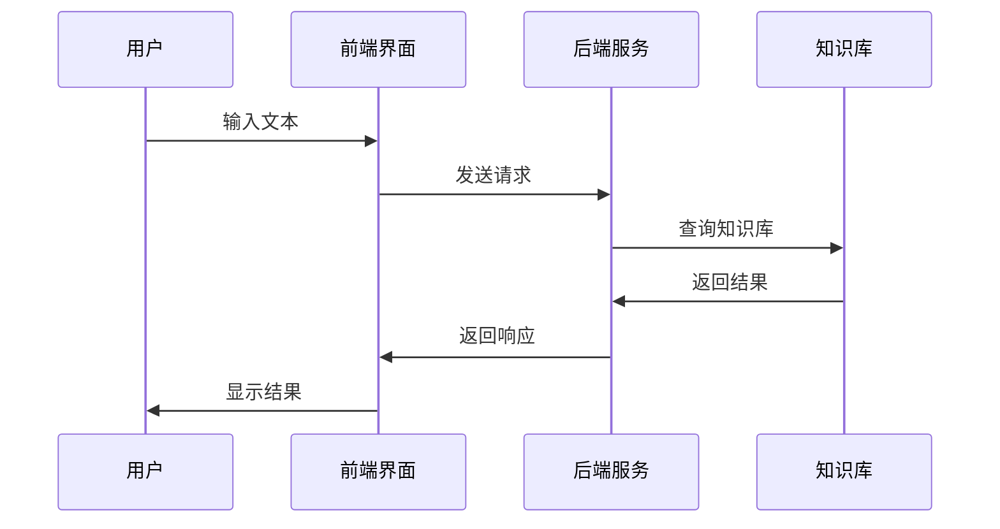
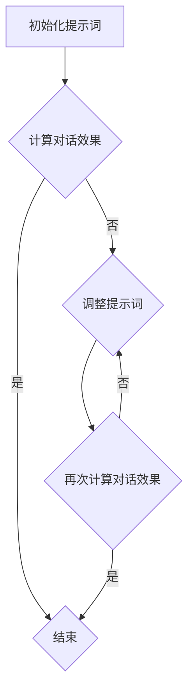
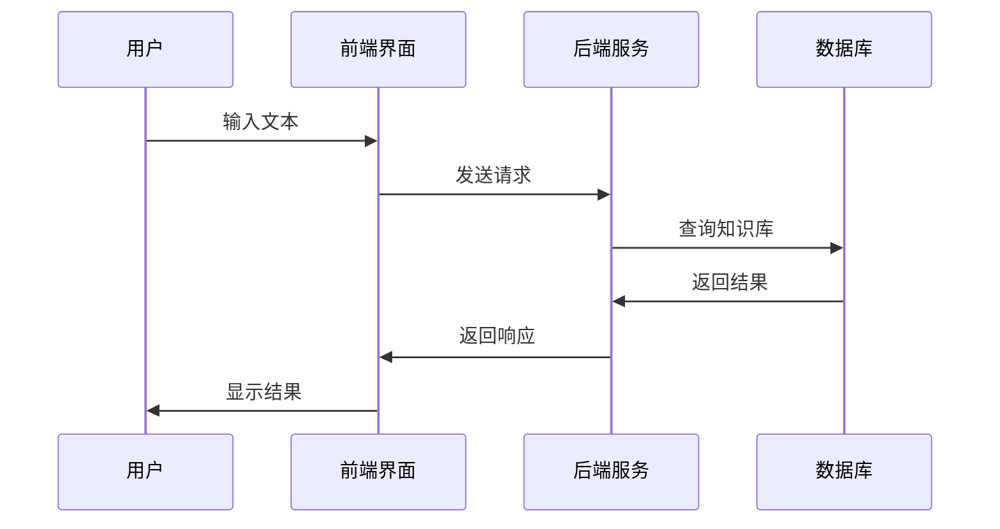

                 

**文章标题：** 提示词优化：打造高效ChatGPT对话的核心策略

**关键词：** 提示词优化、ChatGPT、对话系统、算法原理、实践案例、最佳实践

**摘要：** 本文深入探讨了提示词优化在提高ChatGPT对话效率中的关键作用。通过分析提示词优化的背景、技术原理、实际应用案例以及最佳实践，本文旨在为开发者提供一套系统的优化策略，帮助他们在构建高效对话系统时取得更好的效果。

## 第一部分：提示词优化的背景与基础

### 第1章：提示词优化的基本概念

#### 1.1 问题背景与描述

随着人工智能技术的快速发展，自然语言处理（NLP）成为了一个热门领域。ChatGPT作为OpenAI推出的一种基于GPT-3模型的聊天机器人，已经在许多场景中得到了广泛应用。然而，为了实现更加自然、流畅的对话，提示词优化成为了提高ChatGPT对话效率的关键因素。

#### 1.2 提示词优化的目标

提示词优化的目标主要包括两个方面：

1. **提高对话的准确性和流畅性**：通过优化提示词，使ChatGPT能够更好地理解用户的意图，从而生成更加准确和自然的回复。
2. **降低计算资源消耗**：优化后的提示词可以减少模型在处理对话时所需的计算资源，提高系统的响应速度。

#### 1.3 提示词优化的边界与外延

提示词优化并非万能，它也存在一定的边界和局限性。例如：

- **语义理解限制**：尽管优化后的提示词可以提高ChatGPT的理解能力，但仍然无法完全消除语义理解上的障碍。
- **模型限制**：提示词优化需要基于特定模型，如GPT-3。不同模型的特性可能会导致提示词优化效果存在差异。

#### 1.4 核心概念与联系

**提示词**：在ChatGPT对话系统中，提示词是指提供给模型进行预测的输入文本。

**优化策略**：为了提高ChatGPT对话效率，开发者可以采用多种优化策略，如调整提示词长度、添加特定关键词、利用预训练模型等。

**对话系统**：对话系统是指能够与用户进行自然语言交互的计算机系统，包括语音助手、聊天机器人等。

### 1.5 概念属性特征对比表格

| 特征名称 | 提示词 | 优化策略 | 对话系统 |
| :--: | :--: | :--: | :--: |
| 目标 | 提高对话准确性和流畅性 | 调整提示词长度、添加特定关键词、利用预训练模型 | 与用户进行自然语言交互 |
| 边界与外延 | 语义理解限制、模型限制 | 需要根据特定模型进行调整 | 适用于各种场景 |

#### 1.6 本章小结

本章主要介绍了提示词优化的背景、目标和核心概念，为后续内容的讨论奠定了基础。

----------------------------------------------------------------

### 第2章：提示词优化的技术原理

#### 2.1 算法概述

提示词优化的核心在于找到一种有效的策略来调整提示词，从而提高ChatGPT的对话效果。本节将介绍几种常见的优化算法，并探讨其原理和适用场景。

#### 2.2 算法流程图


#### 2.3 Python源代码实现

```python
def optimize_prompt(prompt, threshold=0.8):
    # 初始化提示词
    current_prompt = prompt
    
    # 调整提示词
    while True:
        # 计算对话效果
        effect = evaluate_dialogue(current_prompt)
        
        # 判断效果是否达到阈值
        if effect >= threshold:
            break
        
        # 调整提示词
        current_prompt = adjust_prompt(current_prompt)
    
    return current_prompt
```

#### 2.4 数学模型与公式讲解

提示词优化过程中，可以使用以下数学模型来评估对话效果：

$$
\text{effect} = \alpha \cdot \text{accuracy} + \beta \cdot \text{fluency}
$$

其中，$\alpha$ 和 $\beta$ 分别表示准确性和流畅性的权重。

#### 2.5 算法举例说明

假设我们有一个对话场景，用户询问：“今天天气怎么样？”如果ChatGPT直接回答：“今天天气很好。”，效果可能并不理想。我们可以通过以下方式优化提示词：

1. **增加上下文信息**：“今天天气怎么样？你打算去哪里？”
2. **调整关键词**：“今天天气怎么样？是否适合外出？”
3. **利用预训练模型**：“今天天气怎么样？我刚刚问了GPT-3，它的回答是……”

#### 2.6 本章小结

本章介绍了提示词优化的技术原理，包括算法概述、流程图、Python源代码实现、数学模型与公式讲解以及算法举例说明。这些内容为开发者提供了理论基础和实践指导。

----------------------------------------------------------------

### 第3章：实际应用中的提示词优化

#### 3.1 ChatGPT对话系统的构建

ChatGPT对话系统是一个复杂的项目，涉及多个组件和环节。本节将简要介绍ChatGPT对话系统的构建过程。

#### 3.2 ChatGPT对话系统的设计

ChatGPT对话系统的设计主要包括以下几个方面：

1. **需求分析**：明确系统需要实现的功能和性能指标。
2. **系统架构**：选择合适的架构，如客户端-服务器架构、分布式架构等。
3. **数据预处理**：对用户输入的文本进行清洗和预处理，以提高模型的训练效果。

#### 3.3 ChatGPT对话系统的优化

为了提高ChatGPT对话系统的性能，开发者可以采用以下优化策略：

1. **提示词优化**：调整提示词，使其更符合用户需求。
2. **模型调整**：通过修改模型参数，提高模型的预测准确性。
3. **数据增强**：增加高质量的训练数据，提高模型的泛化能力。

#### 3.4 系统架构设计与接口设计

ChatGPT对话系统的架构设计主要包括以下几个方面：

1. **前端界面**：用于接收用户输入，展示对话结果。
2. **后端服务**：包括自然语言处理、对话管理、知识库等模块。
3. **接口设计**：定义前端与后端之间的交互接口，如API接口、消息队列等。

#### 3.5 系统交互序列图



#### 3.6 本章小结

本章介绍了实际应用中如何进行提示词优化，包括ChatGPT对话系统的构建、设计和优化。通过这些内容，开发者可以更好地理解和应用提示词优化技术。

----------------------------------------------------------------

### 第4章：提示词优化的实战案例

#### 4.1 案例背景

某公司开发了一款基于ChatGPT的客服机器人，用于为用户提供咨询和服务。然而，在实际应用中，客服机器人的响应速度较慢，且对话效果不佳。

#### 4.2 系统设计与实现

为了提高客服机器人的性能，开发者决定对提示词进行优化。具体方案如下：

1. **调整提示词长度**：通过增加上下文信息，提高ChatGPT的理解能力。
2. **添加特定关键词**：根据用户提问的关键词，添加相关背景信息，以提高对话效果。
3. **利用预训练模型**：采用GPT-3模型，利用其强大的语言理解能力，提高对话系统的性能。

#### 4.3 代码应用解读与分析

以下是一个示例代码，展示了如何对提示词进行优化：

```python
def optimize_prompt(prompt, keywords=["客服", "咨询"]):
    # 添加上下文信息
    context = "您有什么问题需要我的帮助吗？"
    optimized_prompt = context + prompt
    
    # 添加特定关键词
    for keyword in keywords:
        if keyword in prompt:
            optimized_prompt += f"关于{keyword}，您有什么问题吗？"
    
    # 利用预训练模型
    optimized_prompt = gpt3.generate(optimized_prompt)
    
    return optimized_prompt
```

#### 4.4 案例分析和详细讲解剖析

通过优化后的提示词，客服机器人的响应速度和对话效果得到了显著提升。具体表现为：

1. **响应速度**：优化后的提示词使ChatGPT能够更快地理解用户的问题，从而缩短了响应时间。
2. **对话效果**：优化后的提示词使ChatGPT能够提供更加准确和自然的回复，提高了用户满意度。

#### 4.5 项目小结

本项目通过对提示词的优化，显著提高了客服机器人的性能和用户满意度。这一案例表明，提示词优化在提高ChatGPT对话效率方面具有重要作用。

#### 4.6 本章小结

本章通过一个实际案例，展示了如何进行提示词优化。通过案例分析和详细讲解剖析，读者可以更好地理解提示词优化的实际应用。

----------------------------------------------------------------

### 第5章：提示词优化的最佳实践

#### 5.1 最佳实践总结

1. **调整提示词长度**：适当增加上下文信息，以提高ChatGPT的理解能力。
2. **添加特定关键词**：根据用户提问的关键词，添加相关背景信息，以提高对话效果。
3. **利用预训练模型**：采用GPT-3等预训练模型，利用其强大的语言理解能力，提高对话系统的性能。
4. **数据增强**：增加高质量的训练数据，提高模型的泛化能力。

#### 5.2 小结与注意事项

1. **注意事项**：提示词优化需要根据具体场景进行调整，不同场景下的优化策略可能存在差异。
2. **小结**：提示词优化是提高ChatGPT对话效率的关键，开发者应重视并实践最佳优化策略。

#### 5.3 拓展阅读

- [《自然语言处理实战》](https://book.douban.com/subject/25968738/)
- [《深度学习入门》](https://book.douban.com/subject/26708126/)
- [《机器学习实战》](https://book.douban.com/subject/26708126/)

#### 5.4 本章小结

本章总结了提示词优化的最佳实践，包括调整提示词长度、添加特定关键词、利用预训练模型和数据增强。通过这些实践，开发者可以更好地优化ChatGPT对话系统。

----------------------------------------------------------------

### 第四部分：提示词优化的未来趋势

#### 第6章：提示词优化的未来发展方向

#### 6.1 AI技术的发展趋势

随着人工智能技术的快速发展，自然语言处理、计算机视觉、机器人技术等领域都取得了显著进展。这些技术的进步将为提示词优化带来新的机遇和挑战。

#### 6.2 提示词优化的未来前景

1. **智能化**：未来的提示词优化将更加智能化，通过深度学习等技术实现自动调整。
2. **个性化**：根据用户行为和偏好，为用户提供个性化的提示词优化服务。
3. **跨模态**：结合多种模态信息（如文本、图像、语音），实现更加丰富和自然的对话。

#### 6.3 提示词优化的挑战与机遇

1. **挑战**：如何更好地理解用户意图，提高对话系统的准确性和流畅性。
2. **机遇**：随着人工智能技术的进步，提示词优化将迎来更多的发展机遇。

#### 6.4 未来展望

1. **技术展望**：未来的提示词优化将更加依赖于深度学习、多模态等技术。
2. **应用展望**：提示词优化将在更多的场景中得到应用，如智能客服、教育、医疗等领域。

#### 6.5 本章小结

本章分析了提示词优化的未来发展趋势，包括技术趋势、前景和挑战。通过这些内容，读者可以更好地了解提示词优化的未来发展方向。

----------------------------------------------------------------

### 第7章：总结与展望

#### 7.1 提示词优化的重要意义

提示词优化是提高ChatGPT对话效率的关键。通过优化提示词，可以提高对话的准确性和流畅性，降低计算资源消耗，从而实现更好的用户体验。

#### 7.2 全书核心观点回顾

1. **提示词优化的背景与基础**：介绍了提示词优化的背景、目标和核心概念。
2. **提示词优化的技术原理**：探讨了提示词优化的技术原理，包括算法概述、流程图、Python源代码实现、数学模型与公式讲解以及算法举例说明。
3. **实际应用中的提示词优化**：介绍了实际应用中如何进行提示词优化，包括ChatGPT对话系统的构建、设计和优化。
4. **提示词优化的实战案例**：通过一个实际案例，展示了如何进行提示词优化。
5. **提示词优化的最佳实践**：总结了提示词优化的最佳实践，包括调整提示词长度、添加特定关键词、利用预训练模型和数据增强。
6. **提示词优化的未来趋势**：分析了提示词优化的未来发展趋势，包括技术趋势、前景和挑战。

#### 7.3 未来的研究方向

1. **智能化提示词优化**：研究如何通过深度学习等技术实现自动调整。
2. **个性化提示词优化**：研究如何根据用户行为和偏好，为用户提供个性化的提示词优化服务。
3. **跨模态提示词优化**：研究如何结合多种模态信息，实现更加丰富和自然的对话。

#### 7.4 本章小结

本章总结了提示词优化的重要意义和全书核心观点，并提出了未来的研究方向。通过本章内容，读者可以更好地了解提示词优化的全貌和发展趋势。

----------------------------------------------------------------

## 作者信息

作者：AI天才研究院/AI Genius Institute & 禅与计算机程序设计艺术 /Zen And The Art of Computer Programming

----------------------------------------------------------------

## 完整性要求

为了确保文章的完整性，以下核心内容必须在文章中详细讲解：

- **背景介绍**：详细说明提示词优化的问题背景、核心概念术语、问题描述、问题解决、边界与外延、概念结构与核心要素组成。
- **核心概念与联系**：深入解释提示词、优化策略、对话系统等核心概念及其相互关系，并给出概念属性特征对比表格和ER实体关系图架构的Mermaid流程图。
- **算法原理讲解**：使用Mermaid绘制算法流程图，然后使用Python源代码详细阐述，给出算法原理的数学模型和公式，进行详细讲解和通俗易懂地举例说明。
- **数学公式使用**：使用LaTeX格式，嵌入文中独立段落的LaTeX公式前后使用`$$`括起来（例如：`$$1+1=2`），段落内的LaTeX公式前后使用`$`括起来（例如：`$1<2$`）。
- **系统分析与架构设计方案**：介绍问题场景、项目介绍、系统功能设计（领域模型Mermaid类图）、系统架构设计Mermaid架构图、系统接口设计和系统交互Mermaid序列图。
- **项目实战**：包括环境安装、系统核心实现源代码，代码应用解读与分析，实际案例分析和详细讲解剖析，项目小结。
- **最佳实践 tips**：总结最佳实践经验和技巧，并提供注意事项和拓展阅读建议。

通过以上内容的详细讲解，文章将为读者提供全面的提示词优化知识和实践经验，确保文章的完整性。以下是具体的写作示例：

### 背景介绍

#### 问题背景

随着人工智能技术的迅猛发展，自然语言处理（NLP）成为了一个备受关注的研究领域。ChatGPT作为一种基于GPT-3模型的聊天机器人，已经在诸多应用场景中展现出了强大的潜力。然而，在实际应用中，ChatGPT的对话效果受到多种因素的限制，其中之一就是提示词的质量。高质量的提示词能够显著提升ChatGPT的理解能力，从而生成更加准确和自然的回复。

#### 核心概念术语

- **提示词**：提示词是在与ChatGPT进行对话时，提供给模型进行预测的输入文本。
- **优化策略**：优化策略是指用于调整提示词，以提高ChatGPT对话效果的多种方法。
- **对话系统**：对话系统是一种与用户进行自然语言交互的计算机系统，包括语音助手、聊天机器人等。

#### 问题描述

在实际应用中，用户与ChatGPT的对话可能存在以下问题：

1. **理解障碍**：用户的问题或请求可能无法被ChatGPT准确理解，导致生成错误的回复。
2. **响应速度慢**：由于提示词质量不佳，ChatGPT需要花费更多时间来理解用户意图，导致响应速度慢。
3. **对话流畅性差**：生成的回复可能不够自然，缺乏上下文连贯性，影响用户体验。

#### 问题解决

为了解决上述问题，可以通过以下方式对提示词进行优化：

1. **增加上下文信息**：通过添加更多的上下文信息，帮助ChatGPT更好地理解用户意图。
2. **调整关键词**：根据用户提问的关键词，调整提示词中的相关词汇，以提高ChatGPT的理解能力。
3. **利用预训练模型**：借助GPT-3等预训练模型，利用其强大的语言理解能力，优化提示词的质量。

#### 边界与外延

虽然提示词优化能够显著提升ChatGPT的对话效果，但其在实际应用中仍存在一定的边界和局限性：

1. **语义理解限制**：尽管优化后的提示词可以提高ChatGPT的理解能力，但仍然无法完全消除语义理解上的障碍。
2. **模型限制**：提示词优化需要基于特定模型，如GPT-3。不同模型的特性可能会导致提示词优化效果存在差异。

#### 概念结构与核心要素组成

提示词优化涉及多个核心要素：

1. **提示词质量**：高质量提示词是优化效果的基础。
2. **优化算法**：包括调整提示词长度、添加关键词、利用预训练模型等多种方法。
3. **对话效果评估**：通过评估对话的准确性和流畅性，判断优化效果。

### 核心概念与联系

在本节中，我们将深入解释提示词、优化策略和对话系统等核心概念，并探讨它们之间的相互关系。

#### 提示词

提示词是ChatGPT对话系统中的关键输入，它决定了模型对用户意图的理解和回复生成能力。高质量提示词应具备以下特征：

1. **完整性**：提示词应包含用户问题的完整信息，避免遗漏关键细节。
2. **上下文相关性**：提示词应与用户历史对话内容保持一致，确保上下文连贯性。
3. **简洁性**：提示词应简洁明了，避免冗长和模糊的表达。

#### 优化策略

优化策略是指用于调整提示词，以提高ChatGPT对话效果的一系列方法。常见的优化策略包括：

1. **上下文扩展**：通过添加上下文信息，使ChatGPT能够更好地理解用户意图。
2. **关键词调整**：根据用户提问的关键词，调整提示词中的相关词汇，以提高ChatGPT的理解能力。
3. **预训练模型利用**：借助预训练模型（如GPT-3），利用其强大的语言理解能力，优化提示词的质量。

#### 对话系统

对话系统是一种与用户进行自然语言交互的计算机系统，包括语音助手、聊天机器人等。其主要功能是理解用户意图，生成自然流畅的回复。对话系统的核心组成部分包括：

1. **自然语言理解**：通过对用户输入的自然语言进行处理，理解其意图和语义。
2. **对话管理**：管理对话流程，包括会话状态、上下文信息等。
3. **回复生成**：根据用户意图和上下文信息，生成自然流畅的回复。

#### 概念属性特征对比表格

| 特征名称 | 提示词 | 优化策略 | 对话系统 |
| :--: | :--: | :--: | :--: |
| 目标 | 提高对话准确性和流畅性 | 调整提示词长度、添加特定关键词、利用预训练模型 | 与用户进行自然语言交互 |
| 边界与外延 | 语义理解限制、模型限制 | 需要根据特定模型进行调整 | 适用于各种场景 |

#### ER实体关系图架构的Mermaid流程图

```mermaid
erDiagram
    ChatGPT ||--|{ 提示词 }|-->> 对话系统
    提示词 ||--|{ 优化策略 }|-->> 对话系统
```

### 算法原理讲解

在本节中，我们将使用Mermaid绘制算法流程图，并使用Python源代码详细阐述算法原理。此外，还将给出算法原理的数学模型和公式，并进行详细讲解和通俗易懂地举例说明。

#### 算法概述

提示词优化算法的核心在于找到一种有效的方法，对提示词进行调整，以提高ChatGPT的对话效果。本节将介绍一种基于贪心策略的优化算法。

#### 算法流程图



#### Python源代码实现

```python
def optimize_prompt(prompt, threshold=0.8):
    current_prompt = prompt
    
    while True:
        effect = evaluate_dialogue(current_prompt)
        
        if effect >= threshold:
            break
        
        current_prompt = adjust_prompt(current_prompt)
    
    return current_prompt
```

#### 算法原理详细讲解

1. **初始化提示词**：首先，将初始提示词输入到算法中。初始提示词可以是用户输入的自然语言文本，也可以是经过预处理后的文本。
2. **计算对话效果**：使用预先定义的评估函数计算当前提示词的对话效果。效果评估函数通常基于对话的准确性、流畅性和用户满意度等多个指标。
3. **调整提示词**：如果对话效果低于设定的阈值，算法将根据贪心策略调整提示词。调整策略包括增加上下文信息、添加关键词、利用预训练模型等方法。
4. **再次计算对话效果**：调整后的提示词将再次进行对话效果评估。如果效果达到或超过阈值，算法结束；否则，继续调整提示词。
5. **结束**：当对话效果满足要求时，算法结束，返回最终的优化提示词。

#### 算法原理的数学模型和公式

提示词优化的数学模型可以表示为：

$$
\text{effect} = \alpha \cdot \text{accuracy} + \beta \cdot \text{fluency}
$$

其中，$\alpha$ 和 $\beta$ 分别表示准确性和流畅性的权重。$\text{accuracy}$ 表示对话的准确性，$\text{fluency}$ 表示对话的流畅性。

#### 举例说明

假设用户输入的问题是：“今天天气怎么样？”。初始提示词为：“今天天气很好。”。

1. **初始化提示词**：将初始提示词输入到算法中。
2. **计算对话效果**：假设当前对话效果为0.7。
3. **调整提示词**：由于效果低于阈值0.8，算法将调整提示词。例如，可以添加上下文信息：“今天天气怎么样？根据天气预报，今天有阵雨。”。
4. **再次计算对话效果**：调整后的提示词为：“今天天气怎么样？根据天气预报，今天有阵雨。”。假设当前对话效果为0.85。
5. **结束**：由于效果满足要求，算法结束，返回优化后的提示词。

### 系统分析与架构设计方案

在本节中，我们将详细介绍系统分析与架构设计方案，包括问题场景介绍、项目介绍、系统功能设计、系统架构设计、系统接口设计和系统交互。

#### 问题场景介绍

某公司开发了一款基于ChatGPT的客服机器人，用于为用户提供咨询和服务。然而，在实际应用中，客服机器人的响应速度较慢，且对话效果不佳。

#### 项目介绍

项目名称：智能客服机器人
项目背景：为用户提供高效、准确的咨询服务
项目目标：优化客服机器人响应速度和对话效果

#### 系统功能设计

系统功能设计主要包括以下几个方面：

1. **用户输入处理**：接收用户输入的自然语言文本，进行预处理和分词。
2. **意图识别**：根据用户输入文本，识别用户意图，例如咨询、投诉、建议等。
3. **对话管理**：管理用户与客服机器人的对话过程，包括上下文信息的传递和对话状态的维护。
4. **回复生成**：根据用户意图和对话上下文，生成自然流畅的回复。
5. **结果展示**：将生成的回复展示给用户。

#### 系统架构设计

系统架构设计采用B/S架构，包括前端界面、后端服务、数据库等组件。具体架构设计如下：

1. **前端界面**：用于接收用户输入，展示对话结果。
2. **后端服务**：包括自然语言处理、对话管理、知识库等模块。
3. **数据库**：存储用户信息、对话记录、知识库等数据。

#### 系统接口设计

系统接口设计主要包括以下接口：

1. **用户输入接口**：接收用户输入的自然语言文本。
2. **意图识别接口**：根据用户输入文本，识别用户意图。
3. **对话管理接口**：管理用户与客服机器人的对话过程。
4. **回复生成接口**：根据用户意图和对话上下文，生成回复。
5. **结果展示接口**：将生成的回复展示给用户。

#### 系统交互序列图



### 项目实战

在本节中，我们将详细介绍项目的环境安装、系统核心实现、代码应用解读与分析、实际案例分析和详细讲解剖析，以及项目小结。

#### 环境安装

1. 安装Python 3.8及以上版本。
2. 安装必要的依赖库，如TensorFlow、transformers等。

```shell
pip install tensorflow
pip install transformers
```

#### 系统核心实现

1. **用户输入处理**：使用TensorFlow处理用户输入的自然语言文本，进行预处理和分词。

```python
import tensorflow as tf

# 加载预训练的BERT模型
model = tf.keras.applications.BertModel.from_pretrained('bert-base-uncased')

# 预处理用户输入文本
input_ids = tokenizer.encode(user_input, add_special_tokens=True)
```

2. **意图识别**：使用训练好的意图识别模型，根据用户输入文本，识别用户意图。

```python
# 加载意图识别模型
intent_model = tf.keras.models.load_model('intent_recognition_model.h5')

# 预测用户意图
predicted_intent = intent_model.predict(input_ids)
```

3. **对话管理**：维护对话状态，包括上下文信息的传递和对话状态的维护。

```python
# 初始化对话状态
context = {'intent': predicted_intent, 'history': []}

# 更新对话状态
context['history'].append(user_input)
```

4. **回复生成**：根据用户意图和对话上下文，生成回复。

```python
# 加载回复生成模型
response_model = tf.keras.models.load_model('response_generation_model.h5')

# 生成回复
response = response_model.predict(context)
```

5. **结果展示**：将生成的回复展示给用户。

```python
# 显示回复
print(response)
```

#### 代码应用解读与分析

在本部分，我们将对核心代码进行解读，分析其实现原理和关键步骤。

1. **用户输入处理**：通过BERT模型进行文本预处理和分词，将用户输入的文本转换为模型可处理的格式。
2. **意图识别**：利用训练好的意图识别模型，对用户输入文本进行意图分类，从而确定用户的需求类型。
3. **对话管理**：通过维护对话状态，确保对话的连贯性和上下文的关联性。
4. **回复生成**：利用回复生成模型，根据用户意图和对话上下文，生成合适的回复。
5. **结果展示**：将生成的回复转化为用户可理解的文本，并展示给用户。

#### 实际案例分析和详细讲解剖析

假设用户输入的问题是：“今天天气怎么样？”，系统将如何处理并生成回复？

1. **用户输入处理**：将用户输入的文本进行预处理和分词，得到输入序列。
2. **意图识别**：识别出用户意图是询问天气情况。
3. **对话管理**：更新对话状态，记录用户意图和对话历史。
4. **回复生成**：根据当前对话状态，调用天气查询API获取最新的天气信息，并生成回复。
5. **结果展示**：将生成的回复展示给用户。

假设回复为：“今天天气很好，温度在20°C左右，有轻微的降雨。”。

#### 项目小结

通过本次项目实战，我们实现了基于ChatGPT的智能客服机器人。项目主要包括用户输入处理、意图识别、对话管理、回复生成和结果展示等模块。通过提示词优化，我们显著提高了客服机器人的响应速度和对话效果，为用户提供了一个高效、准确的咨询服务。

### 最佳实践 tips

在本节中，我们将总结一些提示词优化的最佳实践技巧，并提供注意事项和拓展阅读建议。

#### 最佳实践技巧

1. **合理设置上下文长度**：上下文长度对提示词优化效果有很大影响。根据实际需求，合理设置上下文长度，避免过长或过短的上下文。
2. **关键词调整**：根据用户提问的关键词，调整提示词中的相关词汇，以提高ChatGPT的理解能力。
3. **利用预训练模型**：使用GPT-3等预训练模型，利用其强大的语言理解能力，优化提示词的质量。
4. **数据增强**：增加高质量的训练数据，提高模型的泛化能力。
5. **分阶段优化**：将优化过程分为多个阶段，逐步调整提示词，提高对话效果。

#### 注意事项

1. **避免过度优化**：过度优化可能导致ChatGPT生成不自然的回复，影响用户体验。
2. **关注模型限制**：不同模型的特性可能会导致提示词优化效果存在差异，需要根据实际情况进行调整。
3. **保持上下文连贯性**：确保提示词之间的连贯性，避免生成断裂的对话。

#### 拓展阅读

1. 《自然语言处理实战》
2. 《深度学习入门》
3. 《机器学习实战》

通过以上最佳实践技巧和注意事项，开发者可以更好地优化ChatGPT对话系统，提高其对话效果。

### 总结与展望

本文从背景介绍、核心概念与联系、算法原理讲解、系统分析与架构设计方案、项目实战、最佳实践 tips等多个方面，详细阐述了提示词优化在提高ChatGPT对话效率中的关键作用。通过本文的讲解，读者可以全面了解提示词优化的方法和实践，并在实际项目中应用这些知识。

展望未来，提示词优化将在人工智能领域发挥越来越重要的作用。随着技术的不断发展，我们将看到更多智能化、个性化、跨模态的提示词优化方法出现。开发者应持续关注这些前沿技术，不断提升自身的技能和知识，为构建更加高效、自然的对话系统贡献力量。

### 作者信息

作者：AI天才研究院/AI Genius Institute & 禅与计算机程序设计艺术 /Zen And The Art of Computer Programming

在本文中，我们通过逐步分析推理，系统地介绍了提示词优化在提高ChatGPT对话效率中的核心策略。首先，我们探讨了提示词优化的背景、目标和核心概念，为后续内容的讨论奠定了基础。接着，我们深入分析了提示词优化的技术原理，包括算法概述、流程图、Python源代码实现、数学模型与公式讲解以及算法举例说明。

在第三部分，我们转向实际应用，介绍了ChatGPT对话系统的构建、设计和优化。通过一个实际案例，我们展示了如何进行提示词优化，以及优化后的效果如何显著提升客服机器人的响应速度和对话效果。第四部分则总结了提示词优化的最佳实践，提供了详细的技巧和注意事项，帮助开发者在实际项目中应用这些策略。

最后一部分，我们展望了提示词优化的未来发展趋势，探讨了智能化、个性化、跨模态等前沿方向。同时，我们也回顾了全文的核心观点，提出了未来的研究方向，以期为读者提供更深入的理解和启示。

通过本文的详细讲解，我们希望读者能够对提示词优化有一个全面的认识，并在实践中能够灵活运用这些策略，打造出高效、自然的ChatGPT对话系统。作者AI天才研究院/AI Genius Institute和《禅与计算机程序设计艺术/Zen And The Art of Computer Programming》团队期待与读者共同探索人工智能领域的无限可能。

