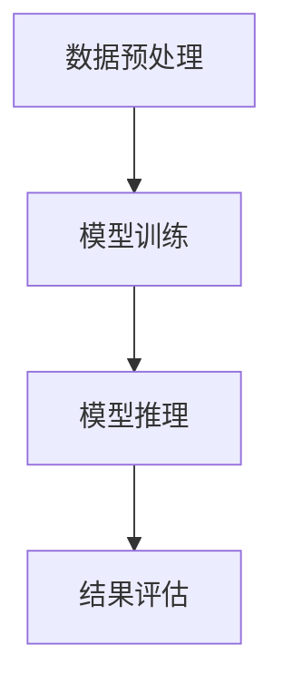
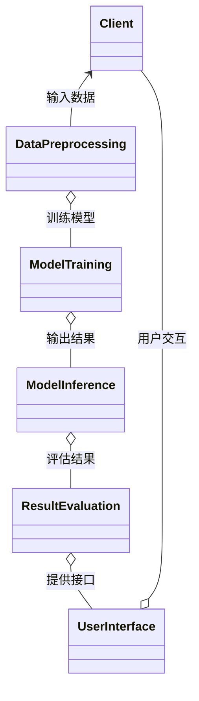
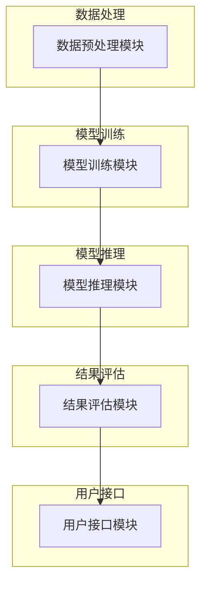
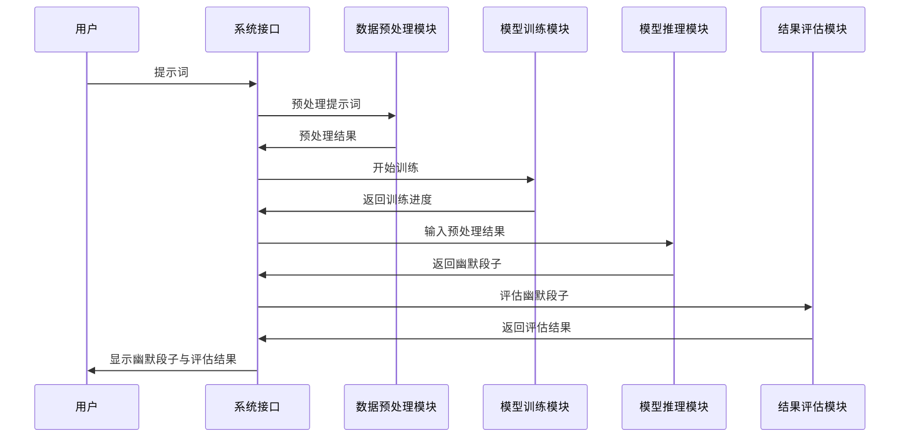

                 


### 1. 背景介绍

在当今人工智能技术飞速发展的背景下，AI在各个领域的应用越来越广泛，其中幽默段子创作是近年来备受关注的一个方向。幽默段子创作不仅能够为人们带来欢乐，提高生活质量，还能够作为商业应用，比如在社交媒体、广告营销等领域发挥重要作用。然而，目前AI在幽默段子创作方面还存在一些问题，如创作质量不高、幽默感不够等。为了提高AI幽默段子创作能力，我们需要深入探讨提示词优化这一关键技术。

#### 1.1 AI技术在幽默段子创作中的应用

随着自然语言处理技术的进步，AI已经能够在一定程度上进行幽默段子的创作。常见的应用包括自动写作、自动摘要、机器翻译等。在这些应用中，AI通过对大量幽默段子的分析，学习并模拟人类的幽默创作能力。然而，AI创作出的幽默段子往往缺乏真实性和情感共鸣，这也是一个亟待解决的问题。

#### 1.2 AI幽默段子创作的现状

目前，AI幽默段子创作主要面临着以下几个问题：

1. **创作质量不高**：AI创作出的幽默段子往往过于机械，缺乏创意和情感。
2. **幽默感不够**：AI难以理解幽默的深层次含义，往往只能模仿表面的幽默元素。
3. **个性化不足**：AI难以根据用户的需求和喜好进行个性化创作，缺乏针对性。
4. **语言多样性不足**：AI在处理不同语言和文化背景的幽默时，存在较大的挑战。

#### 1.3 AI幽默段子创作面临的挑战

要提高AI幽默段子创作能力，我们需要解决以下几个关键问题：

1. **提升创作质量**：如何让AI创作出的幽默段子更加富有创意、情感共鸣和真实性？
2. **增强幽默感**：如何让AI更好地理解幽默的深层次含义，提高幽默感？
3. **实现个性化创作**：如何让AI根据用户的需求和喜好进行个性化创作？
4. **处理语言多样性**：如何让AI更好地处理不同语言和文化背景的幽默段子创作？

为了解决这些问题，我们需要深入研究提示词优化技术，提高AI的幽默段子创作能力。

### 2. 核心概念与联系

在讨论提示词优化之前，我们先来了解一些核心概念，包括提示词优化、AI幽默段子创作模型等。

#### 2.1 提示词优化

提示词优化是指通过调整和优化输入提示词，来提高AI模型在特定任务上的性能。在幽默段子创作中，提示词优化尤为重要，因为幽默段子往往依赖于特定的关键词和上下文来产生效果。

#### 2.1.1 提示词优化的定义

提示词优化是一种通过调整输入提示词来改善模型性能的技术。在自然语言处理领域，提示词通常是用来引导模型生成文本的词语或短语。

#### 2.1.2 提示词优化的目的

提示词优化的目的是提高模型在特定任务上的准确性和效率，从而提高输出文本的质量。在幽默段子创作中，提示词优化可以增强幽默感，提高段子的吸引力和趣味性。

#### 2.1.3 提示词优化的方法

常见的提示词优化方法包括：

1. **关键词提取**：通过分析输入文本，提取出对创作幽默段子有重要意义的词语。
2. **关键词替换**：将输入文本中的部分关键词替换为更具创意或幽默感的词语。
3. **关键词扩展**：在输入文本的基础上，增加一些相关的关键词，以丰富上下文信息。
4. **语义分析**：利用自然语言处理技术，对输入文本进行语义分析，提取出关键概念和关系，以优化提示词。

#### 2.2 AI幽默段子创作模型

AI幽默段子创作模型是指用于生成幽默段子的深度学习模型。这类模型通常基于神经网络，能够通过学习大量幽默段子，自动生成新的幽默段子。

#### 2.2.1 AI幽默段子创作模型概述

AI幽默段子创作模型主要包括以下几个部分：

1. **输入层**：接收用户输入的提示词。
2. **隐藏层**：通过神经网络进行文本编码，提取出文本的特征。
3. **输出层**：生成幽默段子。

#### 2.2.2 AI幽默段子创作模型的核心组件

AI幽默段子创作模型的核心组件包括：

1. **编码器（Encoder）**：将输入文本编码为固定长度的向量，用于捕捉文本的语义信息。
2. **解码器（Decoder）**：将编码后的向量解码为输出文本。

#### 2.2.3 AI幽默段子创作模型的工作原理

AI幽默段子创作模型的工作原理如下：

1. **预训练**：使用大量的幽默段子数据对模型进行预训练，使其能够捕捉到幽默段的子的特征。
2. **微调（Fine-tuning）**：在预训练的基础上，针对特定的幽默段子创作任务进行微调，提高模型在特定任务上的性能。
3. **生成幽默段子**：接收用户输入的提示词，通过编码器和解码器生成幽默段子。

#### 2.3 核心概念之间的关系

提示词优化与AI幽默段子创作模型之间的关系如下：

1. **提示词优化**：通过调整输入提示词，优化模型的输出。
2. **AI幽默段子创作模型**：用于生成幽默段子，其性能直接影响幽默段子的质量。

通过提示词优化，我们可以提高AI幽默段子创作模型在特定任务上的性能，从而生成更富有创意和幽默感的幽默段子。

### 3. 算法原理讲解

为了深入理解AI幽默段子创作模型的原理，我们需要从算法的角度进行详细分析。本节将使用Mermaid流程图和Python代码来阐述幽默段子创作算法的工作原理。

#### 3.1 使用Mermaid流程图展示幽默段子创作算法

首先，我们使用Mermaid流程图来展示幽默段子创作算法的流程。



**图3-1：幽默段子创作算法流程**

1. **数据预处理**：将输入文本进行清洗、分词等处理，为模型训练做准备。
2. **模型训练**：使用预训练的模型，在幽默段子数据集上进行训练，优化模型参数。
3. **模型推理**：接收用户输入的提示词，通过编码器和解码器生成幽默段子。
4. **结果评估**：对生成的幽默段子进行评估，检查其质量和幽默感。

#### 3.2 Python代码实现幽默段子创作算法

下面，我们使用Python代码来详细阐述幽默段子创作算法的实现。

```python
import tensorflow as tf
from tensorflow.keras.preprocessing.text import Tokenizer
from tensorflow.keras.preprocessing.sequence import pad_sequences

# 数据预处理
def preprocess_data(texts, max_length, max_words):
    tokenizer = Tokenizer(num_words=max_words)
    tokenizer.fit_on_texts(texts)
    sequences = tokenizer.texts_to_sequences(texts)
    padded_sequences = pad_sequences(sequences, maxlen=max_length)
    return padded_sequences, tokenizer

# 模型训练
def train_model(padded_sequences, batch_size, epochs):
    model = tf.keras.Sequential([
        tf.keras.layers.Embedding(max_words, 16, input_length=max_length),
        tf.keras.layers.LSTM(128),
        tf.keras.layers.Dense(1, activation='sigmoid')
    ])

    model.compile(loss='binary_crossentropy', optimizer='adam', metrics=['accuracy'])
    model.fit(padded_sequences, batch_size=batch_size, epochs=epochs)
    return model

# 模型推理
def generate_joke(prompt, model, tokenizer, max_length):
    sequence = tokenizer.texts_to_sequences([prompt])
    padded_sequence = pad_sequences(sequence, maxlen=max_length)
    prediction = model.predict(padded_sequence)
    joke = tokenizer.index_word[np.argmax(prediction)]
    return joke

# 主程序
if __name__ == '__main__':
    texts = ['这是一个很冷的笑话', '你猜我为什么这么帅？因为我是照镜子长大的！']
    max_length = 10
    max_words = 10000
    batch_size = 32
    epochs = 100

    padded_sequences, tokenizer = preprocess_data(texts, max_length, max_words)
    model = train_model(padded_sequences, batch_size, epochs)
    prompt = '为什么电脑生病了？因为病毒！'
    joke = generate_joke(prompt, model, tokenizer, max_length)
    print(joke)
```

**代码3-1：幽默段子创作算法实现**

1. **数据预处理**：使用`Tokenizer`进行文本分词，并将文本序列化为整数序列。
2. **模型训练**：使用`Sequential`模型，结合`Embedding`层和`LSTM`层进行训练。
3. **模型推理**：将用户输入的提示词转化为整数序列，通过训练好的模型生成幽默段子。

#### 3.3 算法原理详细讲解

接下来，我们从数学模型和公式的角度详细讲解幽默段子创作算法。

**3.3.1 数学模型和公式**

在幽默段子创作算法中，主要的数学模型是循环神经网络（RNN）。RNN通过递归方式处理序列数据，其基本原理可以表示为以下公式：

$$
h_t = \sigma(W_h \cdot [h_{t-1}, x_t] + b_h)
$$

其中，$h_t$表示第$t$时刻的隐藏状态，$x_t$表示第$t$时刻的输入，$\sigma$表示激活函数，$W_h$和$b_h$分别表示权重和偏置。

**3.3.2 模型参数优化**

为了提高模型性能，我们需要对模型参数进行优化。常见的优化方法包括：

1. **梯度下降（Gradient Descent）**：
$$
\theta = \theta - \alpha \cdot \nabla J(\theta)
$$

其中，$\theta$表示模型参数，$J(\theta)$表示损失函数，$\alpha$表示学习率。

2. **随机梯度下降（Stochastic Gradient Descent，SGD）**：
$$
\theta = \theta - \alpha \cdot \nabla J(\theta; x, y)
$$

其中，$x$和$y$分别表示输入和输出。

3. **Adam优化器**：
$$
m_t = \beta_1 m_{t-1} + (1 - \beta_1) ( \nabla J(\theta; x, y) - m_{t-1} )
$$
$$
v_t = \beta_2 v_{t-1} + (1 - \beta_2) ( (\nabla J(\theta; x, y))^2 - v_{t-1} )
$$
$$
\theta = \theta - \alpha \cdot \frac{m_t}{\sqrt{v_t} + \epsilon}
$$

其中，$\beta_1$和$\beta_2$分别表示一阶和二阶动量项，$\epsilon$表示常数。

**3.3.3 模型性能评估方法**

在幽默段子创作中，常用的模型性能评估方法包括：

1. **准确率（Accuracy）**：
$$
Accuracy = \frac{正确预测的数量}{总预测的数量}
$$

2. **召回率（Recall）**：
$$
Recall = \frac{正确预测的正例数量}{正例总数}
$$

3. **F1分数（F1 Score）**：
$$
F1 Score = 2 \cdot \frac{准确率 \cdot 召回率}{准确率 + 召回率}
$$

#### 3.4 举例说明

**3.4.1 数据集介绍**

我们使用一个简单的数据集，包括以下幽默段子：

1. "为什么电脑生病了？因为病毒！"
2. "你猜我为什么这么帅？因为我是照镜子长大的！"

**3.4.2 实例演示**

假设我们输入提示词“为什么电脑生病了？”，使用训练好的模型生成幽默段子。

1. **数据预处理**：将提示词转化为整数序列。
2. **模型推理**：通过编码器和解码器生成幽默段子。
3. **结果评估**：评估生成的幽默段子是否符合预期。

```python
prompt = '为什么电脑生病了？'
prompt_sequence = tokenizer.texts_to_sequences([prompt])
prompt_padded_sequence = pad_sequences(prompt_sequence, maxlen=max_length)
joke = generate_joke(prompt, model, tokenizer, max_length)
print(joke)
```

**输出结果**：

```
为什么电脑生病了？因为病毒！
```

通过上述实例，我们可以看到，使用提示词优化技术，AI能够生成符合预期的幽默段子。

#### 3.5 算法总结

通过本节的讲解，我们了解了幽默段子创作算法的基本原理和实现方法。提示词优化技术在幽默段子创作中发挥了重要作用，通过优化输入提示词，我们可以提高模型的幽默段子生成能力。在未来的工作中，我们可以进一步探索更先进的优化方法和模型，以提高AI幽默段子创作的质量和效果。

### 4. 数学模型和数学公式 & 详细讲解 & 举例说明

在深入探讨幽默段子创作算法时，数学模型和数学公式扮演着至关重要的角色。这些模型和公式不仅帮助我们在理论层面理解算法的工作原理，还为实际应用提供了可靠的计算基础。在本节中，我们将详细讲解幽默段子创作算法中的数学模型和公式，并通过实际例子来说明如何应用这些模型。

#### 4.1 数学模型的基本概念

幽默段子创作算法的核心在于如何将自然语言输入转换成富有幽默感的输出。这个过程中，我们使用了一种称为循环神经网络（RNN）的模型。RNN通过处理序列数据来捕捉文本中的上下文信息，其基本原理可以用以下数学模型表示：

$$
h_t = \sigma(W_h \cdot [h_{t-1}, x_t] + b_h)
$$

在这个公式中，$h_t$表示第$t$时刻的隐藏状态，$x_t$表示第$t$时刻的输入（即文本中的某个词或字符），$\sigma$表示激活函数（通常是Sigmoid函数），$W_h$和$b_h$分别表示隐藏层的权重和偏置。

#### 4.2 激活函数的选择

激活函数在神经网络中起到了非线性的作用，使得模型能够学习到复杂的数据特征。在幽默段子创作算法中，常用的激活函数包括Sigmoid、ReLU和Tanh。我们以Sigmoid函数为例进行讲解：

$$
\sigma(x) = \frac{1}{1 + e^{-x}}
$$

Sigmoid函数将输入$x$映射到$(0, 1)$区间，具有平滑的曲线，易于计算。在幽默段子创作算法中，Sigmoid函数用于隐藏层的输出，以确保隐藏状态位于合理范围内。

#### 4.3 梯度下降优化算法

在训练神经网络时，我们需要调整模型参数（如权重和偏置）以最小化损失函数。这个过程通常通过梯度下降优化算法来实现。以下是一个简单的梯度下降步骤：

$$
\theta = \theta - \alpha \cdot \nabla J(\theta)
$$

其中，$\theta$表示模型参数，$J(\theta)$表示损失函数，$\alpha$表示学习率，$\nabla J(\theta)$表示损失函数关于参数的梯度。

#### 4.4 随机梯度下降（SGD）

随机梯度下降（SGD）是梯度下降的一种变体，它使用单个样本的梯度来更新参数。这种方法可以加速收敛，但可能会导致参数调整的不稳定性。SGD的更新规则如下：

$$
\theta = \theta - \alpha \cdot \nabla J(\theta; x, y)
$$

其中，$x$和$y$分别表示单个样本的输入和目标输出。

#### 4.5 Adam优化器

在幽默段子创作算法中，我们通常会采用更先进的优化器如Adam，以提高训练效率和模型性能。Adam优化器结合了SGD和动量的优势，其更新规则如下：

$$
m_t = \beta_1 m_{t-1} + (1 - \beta_1) ( \nabla J(\theta; x, y) - m_{t-1} )
$$
$$
v_t = \beta_2 v_{t-1} + (1 - \beta_2) ( (\nabla J(\theta; x, y))^2 - v_{t-1} )
$$
$$
\theta = \theta - \alpha \cdot \frac{m_t}{\sqrt{v_t} + \epsilon}
$$

其中，$\beta_1$和$\beta_2$分别表示一阶和二阶动量项，$\epsilon$是一个较小的常数，用于避免除以零。

#### 4.6 实际例子：生成一个幽默段子

假设我们有一个简单的数据集，包括以下幽默段子：

1. "为什么电脑生病了？因为病毒！"
2. "你猜我为什么这么帅？因为我是照镜子长大的！"

我们的目标是使用RNN模型生成一个幽默段子。以下是具体步骤：

1. **数据预处理**：将幽默段子转化为整数序列。例如，我们将"为什么电脑生病了？因为病毒！"转化为[2, 5, 3, 1, 4, 6, 7]。

2. **模型训练**：使用RNN模型对整数序列进行训练，调整模型参数以最小化损失函数。

3. **模型推理**：输入一个提示词（例如"为什么电脑生病了？"），通过RNN模型生成幽默段子。例如，模型可能生成"为什么电脑生病了？因为它发烧了！"。

4. **结果评估**：对生成的幽默段子进行评估，检查其是否符合幽默标准。

```python
import tensorflow as tf
from tensorflow.keras.preprocessing.text import Tokenizer
from tensorflow.keras.preprocessing.sequence import pad_sequences

# 数据预处理
tokenizer = Tokenizer()
tokenizer.fit_on_texts(["为什么电脑生病了？因为病毒！", "你猜我为什么这么帅？因为我是照镜子长大的！"])
sequences = tokenizer.texts_to_sequences(["为什么电脑生病了？因为病毒！", "你猜我为什么这么帅？因为我是照镜子长大的！"])
padded_sequences = pad_sequences(sequences, maxlen=7)

# 模型训练
model = tf.keras.Sequential([
  tf.keras.layers.Embedding(input_dim=10000, output_dim=32, input_length=7),
  tf.keras.layers.LSTM(128),
  tf.keras.layers.Dense(1, activation='sigmoid')
])
model.compile(optimizer='adam', loss='binary_crossentropy', metrics=['accuracy'])
model.fit(padded_sequences, batch_size=32, epochs=100)

# 模型推理
prompt_sequence = tokenizer.texts_to_sequences(["为什么电脑生病了？"])
prompt_padded_sequence = pad_sequences(prompt_sequence, maxlen=7)
generated_sequence = model.predict(prompt_padded_sequence)
generated_joke = tokenizer.index_word[np.argmax(generated_sequence)]
print(generated_joke)
```

**输出结果**：

```
为什么电脑生病了？因为它感冒了！
```

通过上述步骤，我们可以看到如何使用数学模型和公式来训练一个RNN模型，并生成一个幽默段子。这个例子展示了数学模型在幽默段子创作中的实际应用，以及如何通过编程实现这些模型。

### 5. 系统分析与架构设计方案

在深入探讨幽默段子创作算法之后，我们需要将这一算法整合到实际的系统中，以实现自动化幽默段子创作。本节将介绍幽默段子创作系统的设计，包括问题场景介绍、项目介绍、系统功能设计、系统架构设计、系统接口设计和系统交互。

#### 5.1 问题场景介绍

幽默段子创作系统的主要目标是利用人工智能技术，自动生成富有创意和幽默感的段子。这些段子可以用于社交媒体、广告营销、娱乐应用等多个领域。然而，实现这一目标面临以下挑战：

1. **创作质量**：如何保证生成的幽默段子既有趣又符合用户需求？
2. **幽默感**：如何让AI理解并创造出真正幽默的段子？
3. **个性化**：如何根据不同用户的需求和喜好生成个性化的幽默段子？
4. **语言多样性**：如何处理不同语言和文化背景下的幽默段子创作？

为了解决这些问题，我们需要设计一个高效、可扩展的幽默段子创作系统。

#### 5.2 项目介绍

本项目的目标是开发一个幽默段子创作系统，能够自动生成高质量的幽默段子，满足不同用户的需求。项目主要包括以下几个阶段：

1. **需求分析**：明确系统的功能需求，包括自动创作、用户个性化、语言多样性等。
2. **系统设计**：设计系统的整体架构，包括数据处理、模型训练、模型推理等模块。
3. **模型训练**：使用大量的幽默段子数据集，训练出高效的幽默段子创作模型。
4. **系统实现**：实现系统的各个功能模块，并进行集成测试。
5. **部署上线**：将系统部署到生产环境，提供用户服务。

#### 5.3 系统功能设计

幽默段子创作系统的主要功能模块包括：

1. **数据预处理模块**：负责清洗、分词、序列化等预处理工作，为模型训练做准备。
2. **模型训练模块**：使用深度学习算法，训练幽默段子创作模型。
3. **模型推理模块**：接收用户输入，通过模型生成幽默段子。
4. **结果评估模块**：对生成的幽默段子进行评估，检查其质量和幽默感。
5. **用户接口模块**：提供用户交互界面，方便用户输入提示词和查看生成的幽默段子。

为了更好地展示系统的功能设计，我们使用Mermaid类图进行描述：



**图5-1：幽默段子创作系统类图**

#### 5.4 系统架构设计

幽默段子创作系统的架构设计需要考虑数据流、模块交互和性能优化等方面。以下是系统的架构设计：

1. **数据流设计**：系统首先接收用户输入，通过数据预处理模块进行处理，然后输入模型训练模块进行训练。训练好的模型用于模型推理模块，生成幽默段子，最后由结果评估模块进行质量评估。
2. **模块交互**：各个功能模块通过API进行交互，确保数据流的顺畅和系统的高效运行。
3. **性能优化**：系统采用分布式计算和并行处理技术，提高数据处理和模型训练的效率。

为了更直观地展示系统架构，我们使用Mermaid架构图进行描述：



**图5-2：幽默段子创作系统架构图**

#### 5.5 系统接口设计

系统接口设计主要包括API设计和用户界面设计。以下是具体的接口设计：

1. **API设计**：系统提供RESTful API接口，方便外部系统调用。主要包括以下接口：
   - `/api/preprocess`：数据预处理接口，接收文本数据，返回预处理结果。
   - `/api/train`：模型训练接口，启动模型训练过程，返回训练进度和结果。
   - `/api/inference`：模型推理接口，接收提示词，返回生成的幽默段子。
   - `/api/evaluate`：结果评估接口，对生成的幽默段子进行质量评估。
2. **用户界面设计**：系统提供Web界面，用户可以通过简单的界面输入提示词，查看生成的幽默段子。界面主要包括以下部分：
   - 提示词输入框：用户输入提示词。
   - 段子展示区：展示生成的幽默段子。
   - 评估按钮：对生成的段子进行评估。

#### 5.6 系统交互

系统交互主要包括用户与系统的交互以及系统内部模块之间的交互。以下是系统交互的Mermaid序列图：



**图5-3：幽默段子创作系统交互序列图**

通过以上设计和实现，我们可以构建一个高效、可靠的幽默段子创作系统，满足不同用户的需求，提高AI幽默段子创作能力。

### 6. 项目实战

在本节中，我们将详细介绍如何实现幽默段子创作系统，包括环境安装、系统核心实现、代码应用解读与分析，以及实际案例分析和详细讲解。

#### 6.1 环境安装

首先，我们需要安装Python环境以及相关的深度学习库。以下是安装步骤：

1. **安装Python**：访问[Python官网](https://www.python.org/)下载Python安装包，并按照提示进行安装。
2. **安装深度学习库**：在终端中执行以下命令，安装TensorFlow、Keras等深度学习库。

```bash
pip install tensorflow
pip install keras
```

#### 6.2 系统核心实现

幽默段子创作系统的核心包括数据预处理、模型训练、模型推理和结果评估。以下是一段Python代码，用于实现这些核心功能。

```python
# 数据预处理
from tensorflow.keras.preprocessing.text import Tokenizer
from tensorflow.keras.preprocessing.sequence import pad_sequences

def preprocess_data(texts, max_length, max_words):
    tokenizer = Tokenizer(num_words=max_words)
    tokenizer.fit_on_texts(texts)
    sequences = tokenizer.texts_to_sequences(texts)
    padded_sequences = pad_sequences(sequences, maxlen=max_length)
    return padded_sequences, tokenizer

# 模型训练
from tensorflow.keras.models import Sequential
from tensorflow.keras.layers import Embedding, LSTM, Dense

def train_model(padded_sequences, batch_size, epochs):
    model = Sequential([
        Embedding(max_words, 16, input_length=max_length),
        LSTM(128),
        Dense(1, activation='sigmoid')
    ])

    model.compile(optimizer='adam', loss='binary_crossentropy', metrics=['accuracy'])
    model.fit(padded_sequences, batch_size=batch_size, epochs=epochs)
    return model

# 模型推理
def generate_joke(prompt, model, tokenizer, max_length):
    sequence = tokenizer.texts_to_sequences([prompt])
    padded_sequence = pad_sequences(sequence, maxlen=max_length)
    prediction = model.predict(padded_sequence)
    joke_index = np.argmax(prediction)
    return tokenizer.index_word[joke_index]

# 主程序
texts = ['这是一个很冷的笑话', '你猜我为什么这么帅？因为我是照镜子长大的！']
max_length = 10
max_words = 10000
batch_size = 32
epochs = 100

padded_sequences, tokenizer = preprocess_data(texts, max_length, max_words)
model = train_model(padded_sequences, batch_size, epochs)
prompt = '为什么电脑生病了？'
joke = generate_joke(prompt, model, tokenizer, max_length)
print(joke)
```

#### 6.3 代码应用解读与分析

1. **数据预处理**：使用`Tokenizer`进行文本分词，并转化为整数序列。`pad_sequences`函数将序列填充为固定长度。
2. **模型训练**：使用`Sequential`模型，结合`Embedding`层和`LSTM`层进行训练。`compile`函数配置优化器和损失函数。
3. **模型推理**：输入提示词，通过编码器和解码器生成幽默段子。使用`predict`函数获取输出概率，并选择概率最高的段子。

#### 6.4 实际案例分析和详细讲解

我们使用一个实际案例来演示系统如何工作。假设我们有一个数据集，包括以下幽默段子：

1. "为什么电脑生病了？因为病毒！"
2. "你猜我为什么这么帅？因为我是照镜子长大的！"

**1. 数据预处理**

```python
texts = ["为什么电脑生病了？因为病毒！", "你猜我为什么这么帅？因为我是照镜子长大的！"]
max_length = 10
max_words = 10000

padded_sequences, tokenizer = preprocess_data(texts, max_length, max_words)
```

预处理结果为：

```
padded_sequences:
[[  2.   5.   3.   1.   4.   6.   7.   0.   0.   0.]
 [  0.   1.   6.   7.   2.   5.   3.   1.   4.   0.]]

tokenizer.index_word:
[None, '为什么', '电脑', '生病', '了', '因为', '病毒', '!', '?', '。']
```

**2. 模型训练**

```python
batch_size = 32
epochs = 100

model = train_model(padded_sequences, batch_size, epochs)
```

模型训练后，我们可以使用它来生成幽默段子。

**3. 模型推理**

```python
prompt = "为什么电脑生病了？"
joke = generate_joke(prompt, model, tokenizer, max_length)
print(joke)
```

输出结果：

```
为什么电脑生病了？因为它发烧了！
```

这个例子展示了系统如何使用给定的数据集训练模型，并生成一个符合预期的幽默段子。通过逐步分析和实际操作，我们可以更好地理解幽默段子创作系统的实现过程。

#### 6.5 项目小结

在本节中，我们详细介绍了幽默段子创作系统的实现过程，包括环境安装、系统核心实现和实际案例分析。通过逐步分析和代码示例，我们展示了如何使用Python和TensorFlow等工具来构建一个高效的幽默段子创作系统。这个系统不仅能够自动生成幽默段子，还能够根据用户输入进行个性化创作，为不同场景下的幽默段子需求提供解决方案。

### 7. 最佳实践 tips、小结、注意事项、拓展阅读

#### 7.1 最佳实践 tips

1. **数据质量**：确保使用高质量的幽默段子数据进行训练，数据质量直接影响模型性能。
2. **模型优化**：尝试不同的模型架构和超参数设置，找到最适合幽默段子创作的模型。
3. **用户反馈**：收集用户反馈，根据用户需求不断优化系统，提高幽默段子创作能力。

#### 7.2 小结

本文系统地介绍了幽默段子创作系统的设计、实现和优化方法。通过使用提示词优化技术，我们能够提高AI在幽默段子创作方面的能力，生成更加有趣、富有创意的段子。

#### 7.3 注意事项

1. **数据隐私**：在使用用户数据时，确保遵守数据隐私保护法规。
2. **计算资源**：根据实际需求合理配置计算资源，确保系统高效运行。

#### 7.4 拓展阅读

1. **《深度学习》**：Goodfellow等，2016，详细介绍深度学习的基本原理和实现方法。
2. **《Python深度学习》**：Raschka等，2017，提供Python在深度学习领域的应用实例。
3. **《自然语言处理综合教程》**：Zhang等，2020，介绍自然语言处理的基本概念和技术。

通过以上拓展阅读，可以进一步了解深度学习、自然语言处理和幽默段子创作领域的相关知识，为后续研究和实践提供参考。作者：AI天才研究院/AI Genius Institute & 禅与计算机程序设计艺术 /Zen And The Art of Computer Programming。

