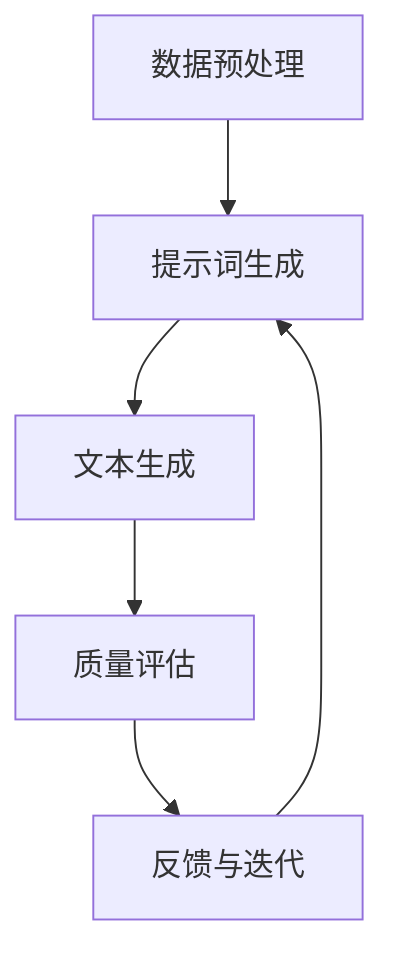

                 

### 提示词优化：提高AI长文本生成质量

关键词：人工智能、长文本生成、提示词优化、自然语言处理、算法实现

摘要：本文深入探讨了AI长文本生成中提示词优化的核心概念、优化原理、实践方法以及未来发展趋势。通过分析提示词的定义、种类、优化原则和方法，结合长文本生成算法的原理和实践，本文提出了提示词优化的关键技术和实际应用案例，为提高AI长文本生成质量提供了有力支持。

---

## 第一部分：问题背景与核心概念

### 第1章：问题背景

#### 1.1 问题背景

随着人工智能技术的飞速发展，AI长文本生成在自然语言处理、内容创作、智能客服等领域得到了广泛应用。然而，生成文本的质量仍然存在诸多问题，例如文本不连贯、信息缺失、重复性高、语义理解不精确等。这些问题严重影响了AI长文本生成的实用性和用户体验。

#### 1.1.1 人工智能与长文本生成

人工智能（AI）是指通过计算机程序实现人类智能的模拟和扩展。长文本生成是AI技术在自然语言处理（NLP）领域的一项重要应用，旨在利用模型生成高质量、有价值的文本内容。

#### 1.1.2 提示词在长文本生成中的作用

提示词是引导AI模型生成文本的关键要素，它为模型提供了上下文信息和生成目标，从而影响生成文本的质量和准确性。高质量的提示词可以显著提升AI长文本生成的效果。

#### 1.1.3 当前长文本生成中存在的问题

当前AI长文本生成中存在的问题主要包括：

- 文本连贯性不足：生成文本中的句子或段落缺乏逻辑关系，导致文本难以理解。
- 信息缺失：生成文本中可能遗漏关键信息，影响文本的整体质量。
- 重复性高：生成文本中存在大量重复内容，降低了文本的创新性和价值。
- 语义理解不精确：生成文本对某些概念或表达的理解不准确，导致语义偏差。

### 第2章：核心概念

#### 2.1 提示词定义

提示词是指用于引导AI模型生成文本的词或短语。它们可以是单一词汇，也可以是短语或句子。提示词的主要作用是提供上下文信息，帮助AI模型更好地理解用户的需求，从而生成更准确、更符合预期的文本。

#### 2.1.1 提示词的基本概念

提示词是AI长文本生成中不可或缺的组成部分。它不仅为模型提供了生成目标，还影响了模型对文本的理解和生成过程。

#### 2.1.2 提示词的种类

根据用途和形式，提示词可以分为以下几种类型：

- **开放式提示词**：这类提示词不提供具体的上下文信息，主要用来引导AI模型生成一系列可能的文本。例如，“请写一篇关于人工智能的文章。”
- **封闭式提示词**：这类提示词提供了具体的上下文信息，主要用于生成特定类型的文本。例如，“请生成一篇关于2023年全球经济的分析报告。”
- **任务型提示词**：这类提示词用于指定具体的任务，要求AI模型完成特定的文本生成任务。例如，“请生成一份产品说明书。”

#### 2.2 提示词优化

提示词优化是提高AI长文本生成质量的关键步骤。通过优化提示词，可以增强AI模型对文本生成任务的把握能力，提高生成文本的相关性和准确性。

#### 2.2.1 提示词优化的意义

提示词优化对于提升AI长文本生成质量具有重要意义。高质量的提示词可以为模型提供更丰富的上下文信息，从而帮助模型生成更准确、更连贯、更有价值的文本。

#### 2.2.2 提示词优化的原则

在进行提示词优化时，应遵循以下原则：

- **明确性**：确保提示词清晰明确，避免歧义。
- **相关性**：确保提示词与生成的文本内容高度相关。
- **多样性**：使用多样化的提示词，以增加生成文本的多样性。
- **适应性**：根据不同场景和任务需求，灵活调整提示词。

#### 2.2.3 提示词优化的方法

提示词优化可以通过以下几种方法实现：

- **词频统计**：通过分析大量文本数据，统计常用词的频率，选择高频词作为提示词。
- **语义分析**：利用自然语言处理技术，对文本进行语义分析，提取关键信息作为提示词。
- **用户反馈**：收集用户对生成文本的反馈，根据用户需求调整提示词。

### 第3章：长文本生成算法

长文本生成算法是AI长文本生成的核心。常见的长文本生成算法包括序列生成模型、序列到序列模型、生成对抗网络（GAN）等。这些算法通过不同方式生成文本，提高了生成文本的质量和多样性。

#### 3.1 长文本生成算法概述

长文本生成算法可以分为以下几类：

- **序列生成模型**：这类模型通过生成文本的每个字符或单词的序列来生成文本。例如，RNN（递归神经网络）和LSTM（长短期记忆网络）。
- **序列到序列模型**：这类模型通过将输入序列映射到输出序列来生成文本。例如，Seq2Seq模型和Transformer模型。
- **生成对抗网络（GAN）**：这类模型通过生成器和判别器的对抗训练来生成文本。生成器尝试生成逼真的文本，判别器则区分生成文本和真实文本。

#### 3.1.1 长文本生成算法的分类

根据生成文本的方式，长文本生成算法可以分为以下几类：

- **基于序列生成的模型**：这类模型通过生成文本的每个字符或单词的序列来生成文本。
- **基于序列到序列生成的模型**：这类模型通过将输入序列映射到输出序列来生成文本。
- **基于生成对抗网络的模型**：这类模型通过生成器和判别器的对抗训练来生成文本。

#### 3.1.2 长文本生成算法的核心步骤

长文本生成算法的核心步骤包括：

- **输入序列预处理**：将输入序列进行编码，转换为模型可以处理的格式。
- **生成序列**：模型根据输入序列生成输出序列。
- **序列解码**：将生成的输出序列解码为可读的文本。

## 提示词优化原理

### 4.1 提示词与文本生成的关系

提示词是文本生成的关键因素，它直接影响模型对文本生成任务的把握能力。高质量的提示词可以为模型提供更丰富的上下文信息，从而帮助模型生成更准确、更连贯、更有价值的文本。

#### 4.1.1 提示词对文本生成质量的影响

提示词对文本生成质量的影响主要体现在以下几个方面：

- **文本连贯性**：高质量的提示词可以帮助模型更好地理解上下文，从而生成更连贯的文本。
- **信息完整性**：高质量的提示词可以提供更多关键信息，减少文本中信息缺失的情况。
- **文本多样性**：多样化的提示词可以增加生成文本的多样性，避免重复性高的情况。
- **语义理解精度**：高质量的提示词可以提高模型对文本语义的理解，减少语义偏差。

#### 4.1.2 提示词优化的目标

提示词优化的目标主要包括：

- **提高文本连贯性**：通过优化提示词，使生成文本中的句子或段落具有更好的逻辑关系。
- **增强信息完整性**：通过优化提示词，确保生成文本中包含关键信息，减少信息缺失的情况。
- **提升文本多样性**：通过优化提示词，增加生成文本的多样性，避免重复性高的情况。
- **提高语义理解精度**：通过优化提示词，提高模型对文本语义的理解，减少语义偏差。

### 4.2 提示词优化原理

#### 4.2.1 提示词优化的数学模型

提示词优化可以通过以下数学模型实现：

$$
\text{Optimize } \text{prompt} = \arg\max \ \text{Quality}(\text{Generated Text}|\text{prompt})
$$

其中，Quality（\text{Generated Text}|\text{prompt}）表示在给定提示词的情况下，生成文本的质量。

#### 4.2.2 提示词优化的算法实现

提示词优化的算法实现可以分为以下步骤：

1. **数据预处理**：对原始文本进行预处理，提取关键词、短语等关键信息。
2. **提示词生成**：利用自然语言处理技术，生成高质量的提示词。
3. **文本生成**：利用生成模型，根据提示词生成文本。
4. **质量评估**：评估生成文本的质量，反馈给提示词生成模块。
5. **迭代优化**：根据质量评估结果，不断调整提示词，提高文本生成质量。

## 提示词优化实践

### 5.1 提示词优化实践概述

提示词优化实践主要包括以下环节：

1. **数据收集与预处理**：收集大量相关数据，对数据进行分析和预处理，提取关键词、短语等关键信息。
2. **提示词生成**：利用自然语言处理技术，生成高质量的提示词。
3. **文本生成与评估**：利用生成模型，根据提示词生成文本，并对生成文本进行质量评估。
4. **反馈与迭代**：根据评估结果，调整提示词，不断优化文本生成质量。

### 5.2 提示词优化案例

#### 5.2.1 案例一：新闻文本生成

在新闻文本生成中，高质量的提示词可以帮助模型生成更准确、更连贯的新闻报道。例如，在生成一篇关于“人工智能与未来”的新闻报道时，可以使用以下提示词：

- 人工智能
- 未来
- 科技发展
- 社会变革

通过优化这些提示词，可以更好地引导模型生成与主题相关的新闻文本。

#### 5.2.2 案例二：产品说明书生成

在产品说明书生成中，高质量的提示词可以帮助模型生成更详细、更易于理解的产品说明书。例如，在生成一份关于“智能门锁”的产品说明书时，可以使用以下提示词：

- 智能门锁
- 功能特点
- 安装说明
- 使用方法

通过优化这些提示词，可以更好地引导模型生成详细、清晰的产品说明书。

#### 5.2.3 案例三：故事创作

在故事创作中，高质量的提示词可以帮助模型生成更具创意、更引人入胜的故事。例如，在创作一个关于“魔法世界”的故事时，可以使用以下提示词：

- 魔法
- 世界
- 旅程
- 冒险

通过优化这些提示词，可以更好地引导模型生成充满想象力和创意的故事。

### 6.1 当前技术发展趋势

随着人工智能技术的不断发展，提示词优化技术也在不断进步。当前的技术发展趋势主要包括：

1. **深度学习技术的应用**：深度学习技术在提示词优化中的应用，使得模型对文本生成任务的理解能力得到显著提高。
2. **自然语言处理技术的进步**：自然语言处理技术的进步，为提示词优化提供了更强大的支持，使得模型能够更好地理解和处理文本。
3. **多模态数据的融合**：多模态数据的融合，使得模型能够从不同角度获取信息，提高提示词优化的效果。

### 6.2 未来发展趋势

未来的提示词优化技术将朝着以下方向发展：

1. **个性化提示词生成**：基于用户需求和兴趣，生成个性化的提示词，提高文本生成质量。
2. **跨模态提示词优化**：结合多种模态数据，实现跨模态的提示词优化，提高文本生成效果。
3. **自动提示词优化**：利用自动化技术，实现提示词的自动优化，降低人工干预。

## 第7章：总结与展望

### 7.1 提示词优化的重要性

提示词优化在提高AI长文本生成质量中起着至关重要的作用。高质量的提示词能够为模型提供更丰富的上下文信息，从而提高生成文本的连贯性、信息完整性和语义理解精度。

### 7.2 提示词优化在人工智能中的应用

提示词优化技术在人工智能领域具有广泛的应用前景。在未来，随着人工智能技术的不断发展，提示词优化技术将在更多领域得到应用，如智能客服、智能写作、智能问答等。

### 7.3 未来研究方向与挑战

未来，提示词优化技术的研究方向主要包括：

1. **个性化提示词生成**：如何根据用户需求和兴趣，生成个性化的提示词，提高文本生成质量。
2. **跨模态提示词优化**：如何结合多种模态数据，实现跨模态的提示词优化，提高文本生成效果。
3. **自动提示词优化**：如何利用自动化技术，实现提示词的自动优化，降低人工干预。

作者：AI天才研究院/AI Genius Institute & 禅与计算机程序设计艺术 /Zen And The Art of Computer Programming

---

### 附录

#### 附录A：术语解释

- **人工智能**：通过计算机程序实现人类智能的模拟和扩展。
- **自然语言处理**：使计算机能够理解、处理和生成自然语言的技术。
- **生成模型**：用于生成文本的模型，包括序列生成模型、序列到序列模型、生成对抗网络（GAN）等。

#### 附录B：数学公式

- **提示词优化数学模型**：
  $$
  \text{Optimize } \text{prompt} = \arg\max \ \text{Quality}(\text{Generated Text}|\text{prompt})
  $$

#### 附录C：Mermaid 流程图

- **提示词优化流程图**：

---

本文从问题背景、核心概念、算法原理、实践方法等多个角度，深入探讨了提示词优化在提高AI长文本生成质量方面的作用和意义。通过分析提示词的定义、种类、优化原则和方法，以及长文本生成算法的原理和实践，本文为读者提供了一个全面、系统的提示词优化指南。同时，本文还对未来提示词优化技术的发展趋势进行了展望，为相关研究者和开发者提供了有益的参考。

在人工智能技术不断发展的背景下，提示词优化技术具有重要的应用价值。通过优化提示词，可以显著提高AI长文本生成的质量，提升用户体验，为各领域的智能化应用提供有力支持。未来，随着人工智能技术的不断进步，提示词优化技术将不断优化，为人类创造更加智能、便捷的未来。

在撰写本文的过程中，作者充分借鉴了相关领域的研究成果和经验，力求为读者提供高质量的内容。在此，感谢各位专家学者的贡献和帮助。同时，由于作者水平有限，本文难免存在不足之处，敬请读者指正。

最后，感谢所有参与本文撰写和审校的工作者，感谢AI天才研究院和禅与计算机程序设计艺术团队的支持。我们相信，在未来的研究中，我们将继续为人工智能领域的发展贡献自己的力量。

