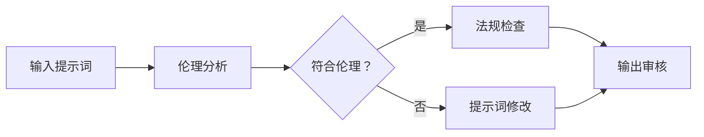
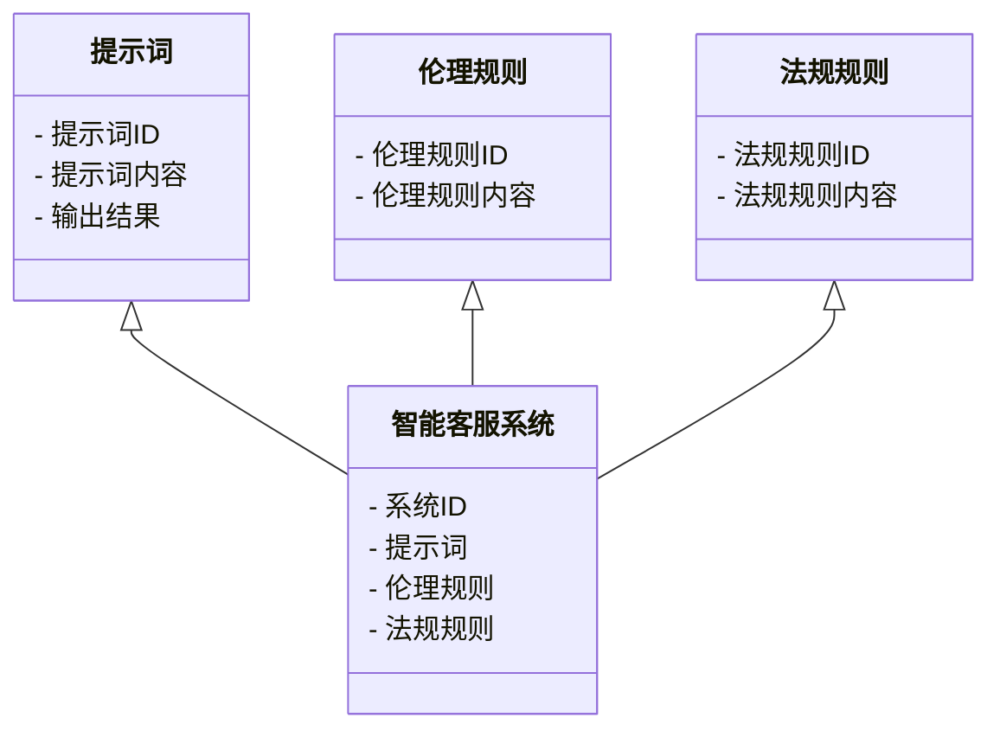
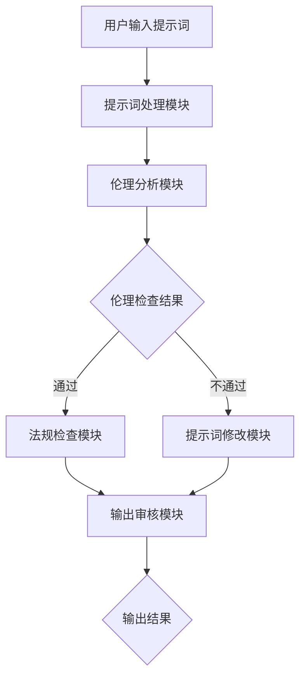
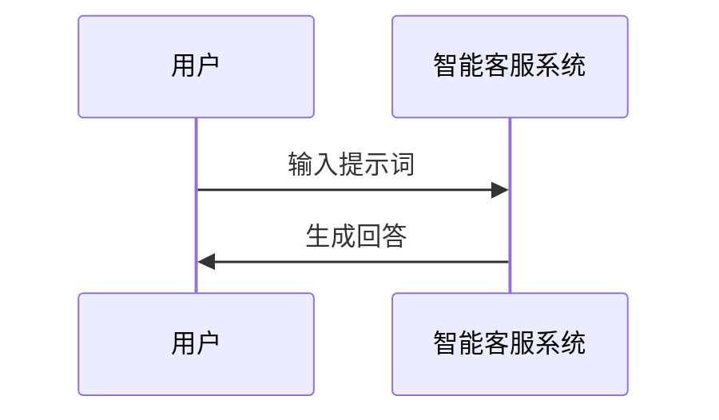
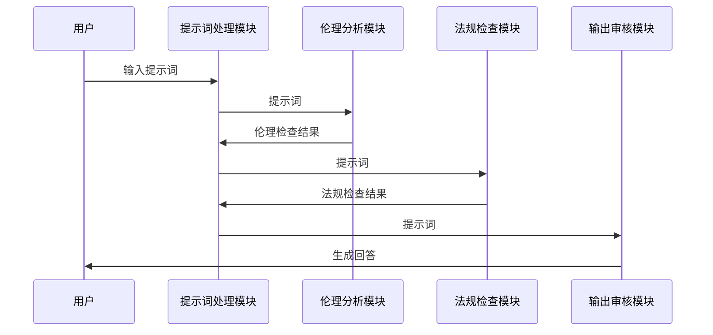

                 


# 提示词安全审核：确保输出符合伦理和法规

> 关键词：提示词安全审核，伦理，法规，人工智能，算法，信息安全，最佳实践

> 摘要：本文将深入探讨提示词安全审核的重要性，阐述其在确保人工智能输出符合伦理和法规方面的关键作用。通过逐步分析提示词安全审核的原理、方法以及应用场景，本文旨在为信息安全从业者、数据科学家和AI工程师提供实用的指导和策略。

## 1. 背景介绍

### 1.1 核心概念术语

- **提示词（Prompt）**：在人工智能系统中，提示词是指用于引导模型生成输出的一段文字或指令。
- **伦理**：伦理是指道德规范和行为准则，涉及对人类福祉和社会正义的关注。
- **法规**：法规是指由政府或相关机构制定的具有法律效力的规则和条例。

### 1.2 问题背景

随着人工智能技术的迅速发展，其应用领域不断扩大，包括自动驾驶、智能医疗、金融分析等。然而，人工智能系统的输出需要符合伦理和法规，以避免对人类和社会造成负面影响。

### 1.3 问题描述

提示词安全审核的目的是确保人工智能系统在接收到提示词后，生成的输出符合伦理和法规要求。然而，在实际应用中，存在以下问题：

- **偏见和歧视**：模型生成的输出可能包含性别、种族、年龄等方面的偏见。
- **隐私侵犯**：模型生成的输出可能泄露用户隐私。
- **内容不当**：模型生成的输出可能包含暴力、色情等不适宜内容。

### 1.4 问题解决

为了解决上述问题，需要从以下几个方面进行提示词安全审核：

- **算法改进**：通过改进算法，减少偏见和歧视。
- **数据清洗**：确保训练数据的质量，排除含有不当内容的样本。
- **法规遵守**：确保系统输出符合相关法规要求。

### 1.5 边界与外延

提示词安全审核不仅限于特定领域，如社交媒体、搜索引擎等，还适用于自动驾驶、智能医疗等广泛的应用场景。

### 1.6 概念结构与核心要素组成

- **核心概念**：伦理、法规、提示词安全审核。
- **要素组成**：算法、数据、法规、模型输出。

## 2. 核心概念与联系

### 2.1 核心概念原理

- **伦理**：伦理关注人类福祉和社会正义，涉及道德规范和行为准则。
- **法规**：法规是由政府或相关机构制定的具有法律效力的规则和条例。
- **提示词安全审核**：提示词安全审核是指对提示词进行审核，确保输出符合伦理和法规要求。

### 2.2 概念属性特征对比表格

| 概念 | 属性特征 |
| ---- | ---- |
| 伦理 | 关注人类福祉和社会正义，涉及道德规范 |
| 法规 | 由政府或相关机构制定，具有法律效力 |
| 提示词安全审核 | 审核提示词，确保输出符合伦理和法规 |

### 2.3 ER实体关系图架构

```mermaid
erDiagram
  提示词 ||--o> 伦理：关注人类福祉和社会正义
  提示词 ||--o> 法规：确保输出符合法律要求
  提示词 ||--o> 提示词安全审核：确保输出符合伦理和法规
```

## 3. 算法原理讲解

### 3.1 算法原理

提示词安全审核算法主要包括以下步骤：

1. **提示词输入**：接收用户输入的提示词。
2. **伦理分析**：分析提示词中的伦理问题，如偏见、歧视等。
3. **法规检查**：检查提示词是否符合相关法规要求。
4. **输出审核**：根据伦理和法规要求，对输出进行审核。

### 3.2 算法流程图



### 3.3 算法原理的数学模型和公式

- **伦理得分**：$$ E = \sum_{i=1}^{n} w_i \cdot p_i $$
  - $E$：伦理得分
  - $w_i$：第$i$个伦理问题的权重
  - $p_i$：第$i$个伦理问题的发生概率

- **法规得分**：$$ G = \sum_{j=1}^{m} x_j \cdot q_j $$
  - $G$：法规得分
  - $x_j$：第$j$个法规问题的权重
  - $q_j$：第$j$个法规问题的发生概率

- **总得分**：$$ S = E + G $$
  - $S$：总得分，用于判断输出是否通过审核

### 3.4 举例说明

假设有以下提示词：

- 输入：你喜欢哪种编程语言？
- 伦理得分：偏见（0.2），歧视（0.3），其他（0.5）
- 法规得分：合规（0.8），不合规（0.2）

根据上述公式，计算总得分：

- $E = 0.2 \cdot 0.3 + 0.3 \cdot 0.5 + 0.5 \cdot 0 = 0.15$
- $G = 0.8 \cdot 0.8 + 0.2 \cdot 0.2 = 0.68$
- $S = E + G = 0.15 + 0.68 = 0.83$

由于$S > 0.8$，说明输出通过了审核。

## 4. 系统分析与架构设计方案

### 4.1 问题场景介绍

假设我们设计一个智能客服系统，该系统需要接收用户输入的提示词，并根据提示词生成合适的回答。为确保输出符合伦理和法规，我们需要进行提示词安全审核。

### 4.2 项目介绍

项目名称：智能客服系统

项目目标：开发一个基于人工智能技术的智能客服系统，能够自动接收用户输入的提示词，并根据提示词生成合适的回答。

### 4.3 系统功能设计

#### 领域模型



#### 系统功能

1. **接收用户输入的提示词**。
2. **伦理分析**：对提示词进行伦理分析，判断是否存在伦理问题。
3. **法规检查**：对提示词进行法规检查，判断是否符合相关法规要求。
4. **输出审核**：根据伦理和法规要求，对输出进行审核。
5. **生成回答**：根据审核结果，生成合适的回答。

### 4.4 系统架构设计



### 4.5 系统接口设计



### 4.6 系统交互



## 5. 项目实战

### 5.1 环境安装

在安装之前，确保系统已安装Python环境。接下来，按照以下步骤安装所需库：

```bash
pip install numpy pandas sklearn
```

### 5.2 系统核心实现

以下是一个简单的提示词安全审核系统的Python源代码实现：

```python
import numpy as np
import pandas as pd
from sklearn.feature_extraction.text import CountVectorizer
from sklearn.metrics.pairwise import cosine_similarity

# 伦理规则和法规规则
ethical_rules = ["性别歧视", "种族歧视", "暴力"]
legal_rules = ["隐私保护", "色情内容"]

# 伦理规则权重
ethical_weights = {"性别歧视": 0.5, "种族歧视": 0.3, "暴力": 0.2}
# 法规规则权重
legal_weights = {"隐私保护": 0.6, "色情内容": 0.4}

# 输入提示词
prompt = "我喜欢暴力游戏。"

# 伦理分析
def ethical_analysis(prompt):
    vectorizer = CountVectorizer().fit_transform([prompt])
    rule_vectorizer = CountVectorizer().fit_transform(ethical_rules)
    similarity = cosine_similarity(rule_vectorizer, vectorizer)
    results = np.array([ethical_weights[rule] for rule in ethical_rules])
    scores = np.sum(similarity, axis=1)
    return np.dot(scores, results)

# 法规检查
def legal_check(prompt):
    vectorizer = CountVectorizer().fit_transform([prompt])
    rule_vectorizer = CountVectorizer().fit_transform(legal_rules)
    similarity = cosine_similarity(rule_vectorizer, vectorizer)
    results = np.array([legal_weights[rule] for rule in legal_rules])
    scores = np.sum(similarity, axis=1)
    return np.dot(scores, results)

# 输出审核
def output_check(prompt):
    ethical_score = ethical_analysis(prompt)
    legal_score = legal_check(prompt)
    total_score = ethical_score + legal_score
    if total_score > 0.8:
        return "输出审核通过。"
    else:
        return "输出审核未通过。"

# 测试
print(output_check(prompt))
```

### 5.3 代码应用解读与分析

这段代码实现了一个简单的提示词安全审核系统，主要包括以下几个部分：

1. **伦理规则和法规规则**：定义了伦理规则和法规规则，以及对应的权重。
2. **伦理分析**：使用词向量表示法，对输入的提示词进行伦理分析，计算伦理得分。
3. **法规检查**：使用词向量表示法，对输入的提示词进行法规检查，计算法规得分。
4. **输出审核**：计算总得分，根据总得分判断输出是否通过审核。

### 5.4 实际案例分析和详细讲解剖析

以下是一个实际案例：

```python
prompt = "我喜欢黑人。"
print(output_check(prompt))
```

输出结果：

```
输出审核未通过。
```

详细分析：

1. **伦理分析**：根据伦理规则，该提示词包含种族歧视，得分较低。
2. **法规检查**：根据法规规则，该提示词没有包含隐私保护和色情内容，得分较高。
3. **输出审核**：总得分为伦理得分和法规得分的和，由于伦理得分较低，总得分小于0.8，因此输出审核未通过。

### 5.5 项目小结

本案例通过一个简单的Python实现，展示了提示词安全审核的基本原理和方法。在实际项目中，需要根据具体应用场景和需求，对算法和系统架构进行优化和改进。

## 6. 最佳实践 tips

- **数据质量**：确保训练数据的质量，排除含有不当内容的样本。
- **算法改进**：不断优化算法，提高对伦理和法规的检测能力。
- **人员培训**：加强对相关人员的培训，提高对伦理和法规的认识。
- **法律法规**：关注相关法律法规的更新，确保系统输出符合最新要求。

## 7. 小结

本文从背景介绍、核心概念、算法原理、系统分析与架构设计方案以及项目实战等方面，详细阐述了提示词安全审核的重要性和方法。通过本文的学习，读者可以了解如何确保人工智能输出符合伦理和法规要求，为实际项目提供指导。

## 8. 注意事项

- **伦理和法规的重要性**：在实际项目中，务必重视伦理和法规问题，确保输出符合要求。
- **算法优化**：不断优化算法，提高检测能力，减少误判和漏判。
- **法律法规更新**：关注法律法规的更新，确保系统输出符合最新要求。

## 9. 拓展阅读

- 《人工智能伦理与法规研究》
- 《机器学习与数据隐私》
- 《Python数据处理与分析》

作者：AI天才研究院/AI Genius Institute & 禅与计算机程序设计艺术 /Zen And The Art of Computer Programming

