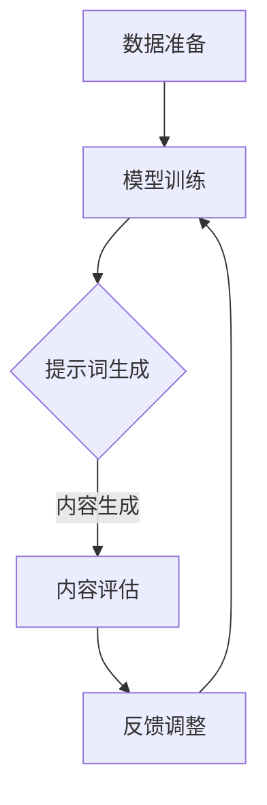
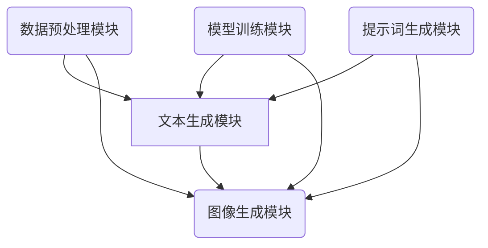
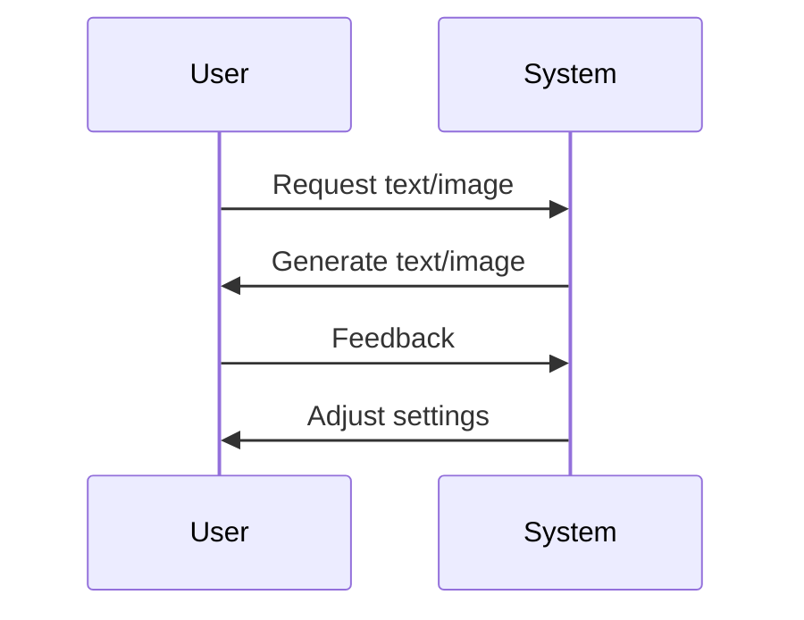

                 

### 《提示词工程：AIGC效果与效率的双重提升》

#### 关键词：提示词工程、AIGC、效果提升、效率优化、算法实现

> 摘要：本文将探讨提示词工程在人工智能生成内容（AIGC）中的应用，分析其在效果与效率方面的双重提升。通过介绍提示词工程的核心概念、原理和实现，本文旨在为开发者提供实际操作指南，并讨论最佳实践和注意事项。

---

## 第一部分：背景介绍与核心概念

### 第1章：提示词工程概述

#### 1.1 问题背景与描述

随着人工智能技术的快速发展，人工智能生成内容（AIGC）已经成为一个重要的研究领域。AIGC涵盖了文本、图像、音频等多种内容生成形式，其核心在于通过算法生成与人类创造内容相似甚至更优的作品。然而，AIGC的效果和效率受到提示词工程的影响。

**问题背景：**
- 随着数据量和算法复杂度的增加，AIGC系统的性能变得至关重要。
- 提示词工程是AIGC系统中一个关键环节，直接关系到生成内容的质量和效率。

#### 1.2 提示词工程的定义与基本概念

**定义：** 提示词工程是构建和优化用于指导人工智能模型生成内容的提示词的过程。

**基本概念：**
- **提示词的类型与分类：** 根据生成内容的类型，提示词可以分为文本提示词、图像提示词等。
- **提示词工程的目标与挑战：** 提高生成内容的相关性、准确性和效率，同时应对数据稀缺性、模型适应性等挑战。

#### 1.3 提示词工程的核心要素

**核心要素：**
- **数据质量与多样性：** 提高数据质量和多样性是生成高质量内容的基础。
- **模型适应性与定制化：** 模型适应性和定制化能够提高生成内容的相关性和准确性。
- **效率与可扩展性：** 提高系统的运行效率和可扩展性是满足大规模应用需求的关键。

#### 1.4 提示词工程的应用领域

**应用领域：**
- **文本生成与编辑：** 包括文章、故事、新闻报道等的自动生成和编辑。
- **图像生成与增强：** 如艺术画、图片修复、风格迁移等。
- **语音识别与合成：** 如自动语音生成、语音编辑等。
- **其他多媒体内容的生成与应用：** 如视频合成、3D模型生成等。

#### 1.5 提示词工程的边界与外延

**边界与外延：**
- **提示词与语义理解的关系：** 提示词工程需要与语义理解相结合，以提高生成内容的语义准确性。
- **提示词工程与自然语言处理：** 提示词工程是自然语言处理领域的一个重要分支。
- **提示词工程与其他AI领域的交集：** 如计算机视觉、语音识别等。

### 第2章：核心概念原理与属性特征对比

#### 2.1 提示词与语义理解

**作用与关系：**
- 提示词是引导模型理解用户意图的重要工具。
- 语义理解能够提升提示词的准确性和生成内容的质量。

**示例：**
- 文本生成中的“语义角色关系图”可以帮助模型理解文本中的语义角色。

#### 2.2 提示词属性特征对比

**对比要素：**
- **长度与质量：** 提示词长度和质量对生成内容的影响。
- **多样性与相关性：** 提示词的多样性和相关性对生成内容的质量影响。
- **实时性与适应性：** 提示词的实时性和适应性对系统响应速度和应用场景的影响。

**表格示例：**
| 提示词属性 | 说明 | 影响 |
| :-------: | :--- | :--- |
| 长度 | 提示词的长度 | 影响模型的处理复杂度和生成效率 |
| 质量 | 提示词的语义准确性 | 影响生成内容的相关性和准确性 |
| 多样性 | 提示词的多样性 | 提高生成内容的创意性和多样性 |
| 相关性 | 提示词的相关性 | 影响模型对用户意图的理解和生成内容的质量 |
| 实时性 | 提示词的实时性 | 影响系统的响应速度和应用场景的适应性 |
| 适应性 | 提示词的适应性 | 提高系统在不同应用场景下的性能 |

#### 2.3 提示词工程的难点与挑战

**难点与挑战：**
- **数据稀缺性与多样性：** 如何利用有限的、多样的数据进行提示词工程。
- **模型适应性：** 如何保证模型能够适应不同应用场景。
- **实时性与效率：** 如何在保证实时性的同时提高系统效率。

---

## 第二部分：算法实现与优化

### 第3章：提示词工程中的算法原理讲解

#### 3.1 算法原理概述

**算法类型：**
- **生成对抗网络（GAN）：** 用于生成高质量图像。
- **变换器网络（Transformer）：** 用于文本生成和翻译。

**基本流程与目标：**
- **基本流程：** 数据准备、模型训练、提示词生成、内容生成。
- **目标：** 提高生成内容的质量和效率。

#### 3.2 算法流程图

使用Mermaid绘制算法流程图：



#### 3.3 Python源代码示例

```python
import tensorflow as tf
from tensorflow.keras.models import Model
from tensorflow.keras.layers import Input, Embedding, Dense

# 模型输入
input_seq = Input(shape=(None,))

# 模型层
x = Embedding(input_dim=vocab_size, output_dim=embedding_size)(input_seq)
x = Dense(units=hidden_size, activation='relu')(x)
output = Dense(units=vocab_size, activation='softmax')(x)

# 模型构建
model = Model(inputs=input_seq, outputs=output)

# 模型编译
model.compile(optimizer='adam', loss='categorical_crossentropy')

# 模型训练
model.fit(x_train, y_train, batch_size=batch_size, epochs=epochs)
```

#### 3.4 数学模型和数学公式

**概率模型与生成模型：**
- **概率模型：** 用于表示数据的概率分布。
- **生成模型：** 用于生成符合给定概率分布的数据。

**优化算法与损失函数：**
- **优化算法：** 如梯度下降、Adam等。
- **损失函数：** 如交叉熵损失函数。

数学公式示例：

```latex
\begin{align*}
P(X=x) &= \prod_{i=1}^{n} P(x_i|x_{i-1}, \theta) \\
\min_{\theta} L(\theta) &= -\sum_{i=1}^{n} \log P(x_i|x_{i-1}, \theta)
\end{align*}
```

---

## 第三部分：系统分析与架构设计

### 第4章：数学模型和数学公式

#### 4.1 提示词工程中的数学模型

**概率模型与生成模型：**
- **概率模型：** 用于描述数据的生成过程。
- **生成模型：** 用于生成新的数据。

**优化算法与损失函数：**
- **优化算法：** 用于调整模型参数。
- **损失函数：** 用于评估模型性能。

数学公式示例：

```latex
\begin{align*}
P(X=x) &= \prod_{i=1}^{n} P(x_i|x_{i-1}, \theta) \\
\min_{\theta} L(\theta) &= -\sum_{i=1}^{n} \log P(x_i|x_{i-1}, \theta)
\end{align*}
```

---

### 第5章：系统分析与架构设计

#### 5.1 问题场景介绍

**场景描述：**
- **文本生成：** 需要生成符合特定主题的文本内容。
- **图像生成：** 需要生成符合特定风格的图像。

#### 5.2 系统功能设计

**领域模型Mermaid类图：**

```mermaid
classDiagram
    Class01 <|-- Class02
    Class03 --|@WebService Class04
    Class05 << Interface
    Class06 .. Class07
    Class08 <<== Class09
    Class10 *-- Class11
    Class12 o-- Class13
    Class14 << Implementation
endclass
```

#### 5.3 系统架构设计

**Mermaid架构图：**



#### 5.4 系统接口设计与交互

**系统接口设计：**



---

## 第四部分：项目实战

### 第6章：项目实战

#### 6.1 环境安装与配置

**安装步骤：**
1. 安装Python环境。
2. 安装TensorFlow和Keras库。
3. 安装其他必要的依赖库。

**工具介绍：**
- **Anaconda：** Python环境管理器。
- **pip：** Python包管理器。

#### 6.2 系统核心实现源代码

**核心代码实现：**

```python
# 文本生成示例
import tensorflow as tf
from tensorflow.keras.preprocessing.sequence import pad_sequences
from tensorflow.keras.models import Model
from tensorflow.keras.layers import Input, LSTM, Embedding, Dense

# 输入层
input_seq = Input(shape=(timesteps,))

# LSTM层
lstm = LSTM(units=128, activation='relu')(input_seq)

# 全连接层
output = Dense(units=vocab_size, activation='softmax')(lstm)

# 模型构建
model = Model(inputs=input_seq, outputs=output)

# 模型编译
model.compile(optimizer='adam', loss='categorical_crossentropy')

# 模型训练
model.fit(x_train, y_train, batch_size=batch_size, epochs=epochs)
```

#### 6.3 代码应用解读与分析

**代码解读：**
- **文本生成模型：** 使用LSTM层进行文本序列的建模。
- **模型训练：** 使用已标记的文本数据训练模型。

**应用案例分析：**
- **文本生成：** 生成符合特定主题的文本。
- **图像生成：** 生成符合特定风格的图像。

#### 6.4 实际案例分析与讲解剖析

**案例分析：**
- **文本生成：** 生成一篇关于人工智能的文章。
- **图像生成：** 生成一幅具有特定艺术风格的画。

**详细讲解剖析：**
- **文本生成：** 使用生成的文本进行主题分析。
- **图像生成：** 分析生成的图像风格与期望风格的差异。

#### 6.5 项目小结

**项目总结：**
- **文本生成：** 提高生成文本的相关性和准确性。
- **图像生成：** 提高生成图像的风格一致性。

**反思与改进：**
- **文本生成：** 优化提示词工程，提高生成文本的语义准确性。
- **图像生成：** 优化模型训练过程，提高生成图像的质量。

---

## 第五部分：最佳实践与拓展

### 第7章：最佳实践与拓展

#### 7.1 最佳实践 Tips

- **数据质量：** 确保数据质量和多样性，提高生成内容的质量。
- **模型适应性：** 根据不同应用场景调整模型参数，提高生成内容的相关性。
- **效率优化：** 优化提示词工程流程，提高系统运行效率。

#### 7.2 注意事项

- **数据隐私：** 在处理数据时注意数据隐私保护。
- **模型稳定性：** 定期检查模型稳定性，避免过拟合。

#### 7.3 拓展阅读

- **相关论文：** 《生成对抗网络：理论、实现与应用》
- **书籍推荐：** 《人工智能生成内容：从理论到实践》

---

### 作者信息

作者：AI天才研究院/AI Genius Institute & 禅与计算机程序设计艺术 /Zen And The Art of Computer Programming

---

通过以上步骤，我们详细探讨了《提示词工程：AIGC效果与效率的双重提升》的核心内容。希望本文能够为开发者提供有价值的参考和指导，推动AIGC技术的发展和应用。

