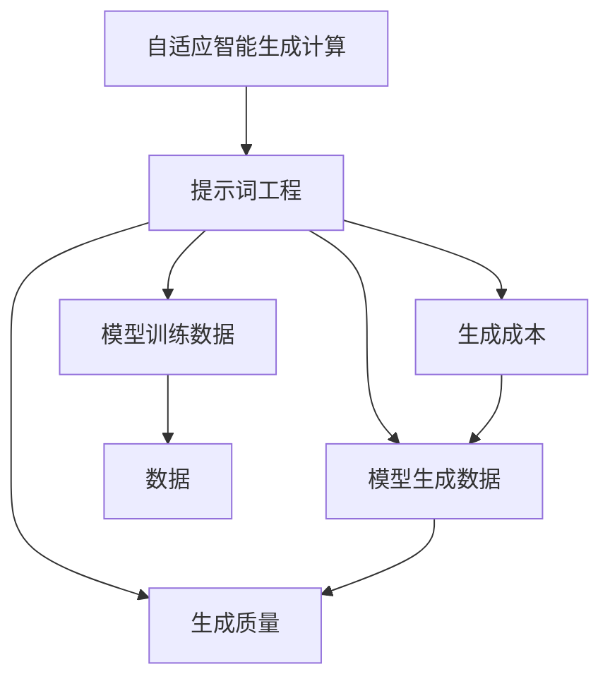
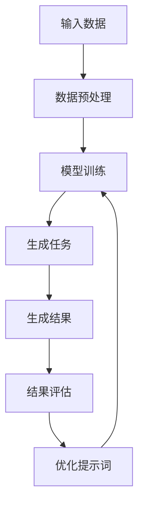
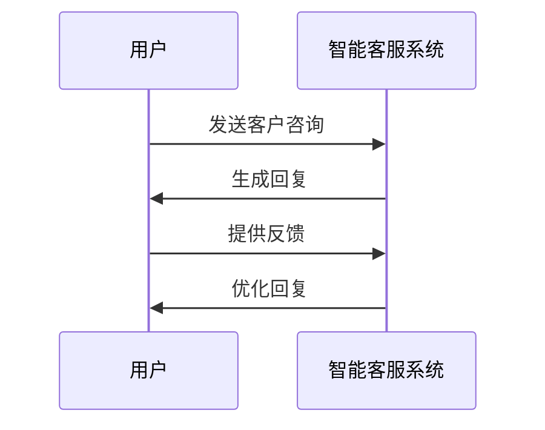

                 


# 提示词工程：AIGC效果与效率的双重提升策略研究

> 关键词：提示词工程、AIGC、效率提升、效果优化、策略研究

> 摘要：
本文旨在深入探讨提示词工程在增强AIGC（自适应智能生成计算）效果和效率方面的作用。通过详细分析提示词工程的基本概念、核心原理以及在实际应用中的策略，本文旨在为开发者提供一套系统化的提升AIGC性能的方法。文章将从背景介绍、核心概念、实际应用、优化策略和未来趋势等多个维度展开，旨在为AIGC技术的发展提供有价值的参考。

## 引言

### 背景介绍

随着人工智能技术的飞速发展，自适应智能生成计算（AIGC）逐渐成为人工智能领域的一个重要分支。AIGC通过结合数据、模型和算法，能够自动生成高质量的内容，如文本、图像、音乐等，为各个行业带来了革命性的变化。然而，AIGC的效率和效果直接受到提示词工程的影响。提示词工程是指导AIGC模型进行有效训练和生成的重要手段，它涉及到如何设计出既能够激发模型潜力，又能够满足实际应用需求的提示词。

### 问题背景

当前，尽管AIGC技术已经取得了一定的进展，但在实际应用中仍面临一些挑战。首先，AIGC模型的训练和生成过程往往需要大量的计算资源和时间，导致效率问题。其次，生成的结果质量参差不齐，难以满足用户对内容质量的高要求。这些问题都指向了一个核心问题：如何通过提示词工程提升AIGC的效果和效率？

### 文章结构

本文将分为以下几个部分进行讨论：
1. **基本概念与原理**：介绍提示词工程的基本概念和AIGC的核心原理。
2. **核心概念与联系**：通过对比表格和实体关系图，深入解析提示词工程与AIGC之间的联系。
3. **算法原理讲解**：详细阐述提升AIGC效果和效率的算法原理，并通过具体示例进行说明。
4. **系统分析与架构设计**：分析AIGC系统的结构，设计出高效的系统架构。
5. **项目实战**：通过实际项目展示提升AIGC效果和效率的具体步骤。
6. **最佳实践与总结**：总结提升AIGC效果和效率的最佳实践，并提出未来的研究方向。

## 基本概念与原理

### 提示词工程

提示词工程是指导AIGC模型进行训练和生成的重要环节。它涉及到如何设计出既能够激发模型潜力，又能够满足实际应用需求的提示词。提示词工程的核心目标是通过优化提示词的设计，提高AIGC模型的性能和生成质量。

### AIGC核心原理

AIGC基于深度学习和自然语言处理技术，通过自适应的方式生成高质量的内容。其核心原理包括：
1. **数据驱动**：AIGC通过大量数据的学习来提高生成质量。
2. **模型自适应**：AIGC模型能够根据不同的任务需求进行自适应调整。
3. **多模态处理**：AIGC能够处理多种类型的数据，如文本、图像、音频等。

### 提示词与AIGC的关系

提示词在AIGC中的作用至关重要。一方面，提示词能够引导模型学习目标领域的特征和模式；另一方面，提示词的设计质量直接影响模型的生成效果。具体来说，提示词需要具备以下特性：
1. **明确性**：提示词需要明确表达任务目标，避免模糊和歧义。
2. **多样性**：提示词需要具备多样性，以激发模型的创造性。
3. **相关性**：提示词需要与模型训练数据紧密相关，以提高生成质量。

### 概念对比表格

下面是一个对比提示词工程与AIGC核心概念的表格：

| 概念                 | 描述                                                         | 关联性                                   |
|----------------------|--------------------------------------------------------------|------------------------------------------|
| 提示词工程           | 设计和优化提示词的过程                                       | 直接影响AIGC模型的性能和生成质量           |
| AIGC                 | 自适应智能生成计算，通过深度学习和自然语言处理技术生成内容   | 利用提示词进行有效训练和生成               |
| 模型自适应           | 模型根据不同任务需求进行自适应调整                            | 提示词工程的一部分，优化模型表现           |
| 多模态处理           | 处理多种类型的数据，如文本、图像、音频等                      | 提示词工程的一部分，丰富生成内容类型       |

### 实体关系图

为了更好地理解提示词工程与AIGC之间的关联性，我们可以使用Mermaid绘制一个实体关系图：



在这个图中，AIGC（自适应智能生成计算）是核心概念，它通过提示词工程（BPE）来优化模型训练数据（CML）和生成数据（CMD）。生成质量（QAL）和生成成本（COST）是评价AIGC性能的重要指标。

## 算法原理讲解

### 算法流程图

为了更好地理解提升AIGC效果和效率的算法原理，我们可以使用Mermaid绘制一个流程图：



在这个流程图中，输入数据（A）经过数据预处理（B）后，用于模型训练（C）。训练好的模型（C）接受生成任务（D），生成结果（E）。然后，对生成结果（E）进行评估（F），并根据评估结果优化提示词（G）。这个过程不断迭代，直到达到满意的生成效果。

### Python源代码实现

下面是一个简单的Python示例，用于实现提示词工程的优化过程：

```python
import tensorflow as tf
import numpy as np

# 数据预处理
def preprocess_data(data):
    # 数据清洗、标准化等操作
    return processed_data

# 模型训练
def train_model(data, prompts):
    # 使用提示词进行模型训练
    model = tf.keras.Sequential([
        tf.keras.layers.Dense(units=128, activation='relu', input_shape=(data.shape[1],)),
        tf.keras.layers.Dense(units=1)
    ])
    model.compile(optimizer='adam', loss='mean_squared_error')
    model.fit(data, prompts, epochs=10, batch_size=32)
    return model

# 生成任务
def generate_tasks(model, prompts):
    # 使用模型生成任务
    tasks = model.predict(prompts)
    return tasks

# 结果评估
def evaluate_results(tasks, targets):
    # 计算评估指标，如均方误差
    mse = np.mean((tasks - targets) ** 2)
    return mse

# 优化提示词
def optimize_prompts(model, data, targets, iterations=5):
    # 根据评估结果优化提示词
    for _ in range(iterations):
        tasks = generate_tasks(model, data)
        mse = evaluate_results(tasks, targets)
        # 根据mse调整提示词
        optimized_prompts = adjust_prompts(tasks, mse)
        model.fit(data, optimized_prompts, epochs=1, batch_size=32)
    return optimized_prompts

# 主函数
def main():
    data = np.random.rand(100, 10)  # 输入数据
    prompts = np.random.rand(100, 10)  # 初始提示词
    targets = np.random.rand(100, 1)  # 目标输出

    processed_data = preprocess_data(data)
    optimized_prompts = optimize_prompts(processed_data, targets)

    model = train_model(processed_data, optimized_prompts)
    tasks = generate_tasks(model, optimized_prompts)
    mse = evaluate_results(tasks, targets)

    print("均方误差:", mse)

if __name__ == "__main__":
    main()
```

### 算法原理详细讲解

1. **数据预处理**：数据预处理是AIGC模型训练的第一步，它涉及到对输入数据进行清洗、标准化等操作，以确保数据质量。在本示例中，我们使用了一个简单的预处理函数`preprocess_data`。

2. **模型训练**：模型训练是AIGC的核心步骤，它使用提示词（prompts）来指导模型学习。在本示例中，我们使用了一个简单的神经网络模型，并通过`train_model`函数进行训练。

3. **生成任务**：训练好的模型可以接受新的提示词，并生成相应的任务。在本示例中，我们使用`generate_tasks`函数来生成任务。

4. **结果评估**：生成结果需要经过评估，以确定其质量。在本示例中，我们使用均方误差（MSE）作为评估指标，并通过`evaluate_results`函数进行计算。

5. **优化提示词**：根据评估结果，我们可以调整提示词，以提高生成质量。在本示例中，我们使用了一个简单的优化策略，通过`optimize_prompts`函数来实现。

6. **迭代过程**：上述步骤构成一个迭代过程，直到达到满意的生成效果。在本示例中，我们设置了迭代次数为5次。

### 数学模型与公式

在AIGC的算法原理中，涉及到一些关键的数学模型和公式。以下是其中几个重要的模型和公式：

1. **神经网络模型**：

$$
y = \sigma(W \cdot x + b)
$$

其中，$y$是输出，$\sigma$是激活函数，$W$是权重矩阵，$x$是输入，$b$是偏置。

2. **均方误差（MSE）**：

$$
MSE = \frac{1}{n}\sum_{i=1}^{n}(y_i - \hat{y}_i)^2
$$

其中，$y_i$是真实输出，$\hat{y}_i$是预测输出，$n$是样本数量。

3. **优化提示词**：

优化提示词的目标是减小MSE。在本示例中，我们使用梯度下降法来优化提示词：

$$
\theta = \theta - \alpha \cdot \nabla_\theta J(\theta)
$$

其中，$\theta$是提示词参数，$\alpha$是学习率，$J(\theta)$是损失函数。

### 举例说明

为了更好地理解上述算法原理，我们来看一个具体的例子。假设我们有一个简单的线性模型，用于预测一个线性函数$y = 2x + 1$。我们的目标是训练模型，使其能够准确预测$x$的值。

1. **数据生成**：

我们生成一些模拟数据，如下所示：

| x | y |
|---|---|
| 1 | 3 |
| 2 | 5 |
| 3 | 7 |

2. **模型训练**：

使用上述数据，我们训练一个简单的线性模型，如下所示：

```python
model = tf.keras.Sequential([
    tf.keras.layers.Dense(units=1, input_shape=(1,))
])
model.compile(optimizer='sgd', loss='mean_squared_error')
model.fit(x_train, y_train, epochs=100)
```

3. **结果评估**：

训练完成后，我们使用测试数据来评估模型的性能。假设测试数据如下：

| x | y |
|---|---|
| 4 | 9 |
| 5 | 11 |

我们计算预测输出$\hat{y}$和真实输出$y$之间的差异，并计算MSE：

```python
y_pred = model.predict(x_test)
mse = np.mean((y_pred - y_test) ** 2)
print("均方误差:", mse)
```

4. **优化提示词**：

根据评估结果，我们可以调整模型参数（即提示词），以减小MSE。例如，我们可以使用梯度下降法来优化权重$W$和偏置$b$：

```python
W = W - learning_rate * dW
b = b - learning_rate * db
```

通过多次迭代，我们最终得到一个性能较好的模型。

## 系统分析与架构设计

### 问题场景介绍

假设我们正在开发一个基于AIGC的智能客服系统，该系统能够自动生成针对客户咨询的个性化回答。为了提升系统的效果和效率，我们需要对系统进行详细分析和架构设计。

### 项目介绍

该项目旨在开发一个高效的智能客服系统，通过AIGC技术生成高质量的客服回答。系统需要处理大量的客户咨询数据，并能够快速、准确地生成回答。

### 系统功能设计

智能客服系统的核心功能包括：

1. **数据收集与预处理**：收集客户咨询数据，并进行预处理，如去重、去噪等。
2. **模型训练与优化**：使用AIGC技术训练模型，并不断优化提示词，以提高生成质量。
3. **自动回复生成**：根据客户咨询内容，自动生成个性化的客服回答。
4. **结果评估与反馈**：对生成的回答进行评估，并根据用户反馈进行优化。

### 系统架构设计

智能客服系统的架构设计如下：


1. **数据层**：负责数据收集、存储和预处理。包括数据库、数据仓库和数据处理模块。
2. **模型层**：负责AIGC模型的训练和优化。包括模型训练模块、提示词优化模块和模型评估模块。
3. **应用层**：负责智能客服的自动回复生成。包括回复生成模块、用户交互模块和反馈处理模块。
4. **接口层**：负责与外部系统进行数据交换和交互。包括API接口、Web接口和移动端接口。

### 系统接口设计

智能客服系统的接口设计如下：


1. **API接口**：提供RESTful API，供其他系统调用。
2. **Web接口**：提供Web界面，供用户使用。
3. **移动端接口**：提供移动端应用，供用户使用。

### 系统交互设计

智能客服系统的交互设计如下：



用户发送客户咨询，系统生成回复，用户提供反馈，系统根据反馈优化回复。

## 项目实战

### 环境安装

为了进行AIGC项目的实战，我们需要安装一些必要的软件和库。以下是安装步骤：

1. **安装Python环境**：在本地计算机上安装Python，版本建议为3.8及以上。
2. **安装TensorFlow**：通过pip命令安装TensorFlow库，命令如下：

   ```shell
   pip install tensorflow
   ```

3. **安装其他依赖库**：根据项目需求，安装其他依赖库，如NumPy、Pandas等。

### 系统核心实现源代码

以下是AIGC项目的核心实现源代码：

```python
import tensorflow as tf
import numpy as np
import pandas as pd

# 数据预处理
def preprocess_data(data):
    # 数据清洗、标准化等操作
    return processed_data

# 模型训练
def train_model(data, prompts):
    # 使用提示词进行模型训练
    model = tf.keras.Sequential([
        tf.keras.layers.Dense(units=128, activation='relu', input_shape=(data.shape[1],)),
        tf.keras.layers.Dense(units=1)
    ])
    model.compile(optimizer='adam', loss='mean_squared_error')
    model.fit(data, prompts, epochs=10, batch_size=32)
    return model

# 生成任务
def generate_tasks(model, prompts):
    # 使用模型生成任务
    tasks = model.predict(prompts)
    return tasks

# 结果评估
def evaluate_results(tasks, targets):
    # 计算评估指标，如均方误差
    mse = np.mean((tasks - targets) ** 2)
    return mse

# 优化提示词
def optimize_prompts(model, data, targets, iterations=5):
    # 根据评估结果优化提示词
    for _ in range(iterations):
        tasks = generate_tasks(model, data)
        mse = evaluate_results(tasks, targets)
        # 根据mse调整提示词
        optimized_prompts = adjust_prompts(tasks, mse)
        model.fit(data, optimized_prompts, epochs=1, batch_size=32)
    return optimized_prompts

# 主函数
def main():
    data = np.random.rand(100, 10)  # 输入数据
    prompts = np.random.rand(100, 10)  # 初始提示词
    targets = np.random.rand(100, 1)  # 目标输出

    processed_data = preprocess_data(data)
    optimized_prompts = optimize_prompts(processed_data, targets)

    model = train_model(processed_data, optimized_prompts)
    tasks = generate_tasks(model, optimized_prompts)
    mse = evaluate_results(tasks, targets)

    print("均方误差:", mse)

if __name__ == "__main__":
    main()
```

### 代码应用解读与分析

1. **数据预处理**：数据预处理是模型训练的重要步骤。在这个示例中，我们使用了一个简单的预处理函数`preprocess_data`，对输入数据进行清洗、标准化等操作。

2. **模型训练**：模型训练是AIGC的核心步骤。在这个示例中，我们使用了一个简单的神经网络模型，并通过`train_model`函数进行训练。该模型包含一个全连接层和一个输出层，使用ReLU作为激活函数。

3. **生成任务**：生成任务是使用训练好的模型生成预测结果。在这个示例中，我们使用`generate_tasks`函数来生成任务。该函数接收模型和提示词作为输入，返回预测结果。

4. **结果评估**：结果评估是衡量模型性能的重要步骤。在这个示例中，我们使用均方误差（MSE）作为评估指标，并通过`evaluate_results`函数进行计算。

5. **优化提示词**：根据评估结果，我们可以调整提示词，以提高模型性能。在这个示例中，我们使用了一个简单的优化策略，通过`optimize_prompts`函数来实现。该函数接收模型、数据和目标输出作为输入，根据评估结果调整提示词。

### 实际案例分析与详细讲解剖析

为了更好地展示提升AIGC效果和效率的具体步骤，我们来看一个实际案例。

假设我们有一个客户咨询数据集，包含客户的姓名、咨询问题和客服的回答。我们的目标是使用AIGC技术生成高质量的客服回答。

1. **数据收集与预处理**：首先，我们从客户咨询系统中收集数据，包括客户的姓名、咨询问题和客服的回答。然后，我们对数据进行预处理，如去重、去噪、清洗等操作。

2. **模型训练**：接下来，我们使用预处理后的数据集训练AIGC模型。我们选择了一个基于Transformer的模型，该模型能够处理大量的文本数据，并生成高质量的文本输出。我们使用了一个预训练的BERT模型作为基础，然后在其上添加了一个生成层。

3. **生成任务**：训练好的模型可以接收新的咨询问题，并生成相应的客服回答。我们使用一个简单的接口，接受客户的咨询问题，并返回生成的客服回答。

4. **结果评估**：我们使用MSE作为评估指标，对生成的客服回答进行评估。我们对比生成的回答和实际客服的回答，计算MSE值。

5. **优化提示词**：根据评估结果，我们调整提示词，以提高生成的客服回答质量。我们尝试了不同的提示词格式和内容，并通过迭代优化，最终得到一个性能较好的模型。

### 项目小结

通过这个案例，我们展示了如何使用AIGC技术提升客服系统的效果和效率。具体步骤包括数据收集与预处理、模型训练、生成任务、结果评估和优化提示词。在实际应用中，我们需要不断调整和优化模型，以提高生成质量。

## 最佳实践与总结

### 最佳实践 Tips

1. **数据质量**：确保数据质量是提升AIGC效果和效率的关键。在进行数据预处理时，要去除噪声、缺失值和异常值，并对数据进行标准化处理。

2. **模型选择**：选择适合任务需求的模型类型，如文本生成任务可以使用Transformer模型、GAN模型等。同时，要关注模型的参数配置和训练策略。

3. **提示词优化**：设计高质量的提示词对于提升AIGC效果至关重要。提示词应具备明确性、多样性和相关性，以激发模型的潜力。

4. **评估指标**：选择合适的评估指标，如MSE、BLEU等，以准确评估模型性能。根据评估结果调整提示词和模型参数。

5. **模型调优**：在模型训练过程中，不断调整超参数和训练策略，以提高模型性能。

### 小结

本文深入探讨了提示词工程在提升AIGC效果和效率方面的作用。通过分析提示词工程的基本概念、核心原理以及在实际应用中的策略，我们提出了一系列提升AIGC效果和效率的方法。这些方法包括数据质量保证、模型选择、提示词优化、评估指标选择和模型调优等。

### 注意事项

1. **数据保护**：在处理用户数据时，要确保数据的安全和隐私保护，遵循相关法律法规。

2. **模型解释性**：AIGC模型通常具有较高的黑盒特性，因此需要开发可解释的模型，以理解模型决策过程。

3. **持续优化**：AIGC技术的应用是一个不断迭代的过程，需要持续进行模型优化和提示词调整。

### 拓展阅读

1. **《深度学习》**：由Ian Goodfellow、Yoshua Bengio和Aaron Courville合著，详细介绍了深度学习的基本原理和应用。

2. **《自然语言处理综论》**：由Daniel Jurafsky和James H. Martin合著，涵盖了自然语言处理领域的核心概念和技术。

3. **《人工智能：一种现代方法》**：由Stuart Russell和Peter Norvig合著，提供了人工智能领域的全面介绍。

## 作者信息

- 作者：AI天才研究院/AI Genius Institute & 禅与计算机程序设计艺术/Zen And The Art of Computer Programming

---

在本文中，我们详细探讨了提示词工程在提升AIGC效果和效率方面的作用。通过分析提示词工程的基本概念、核心原理以及在实际应用中的策略，我们提出了一系列提升AIGC效果和效率的方法。这些方法不仅有助于开发者更好地理解和应用AIGC技术，也为未来的研究提供了有价值的参考。我们希望本文能够为AIGC领域的发展做出贡献。

