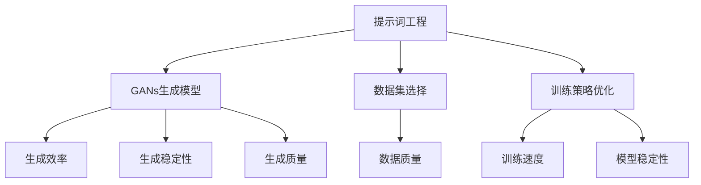
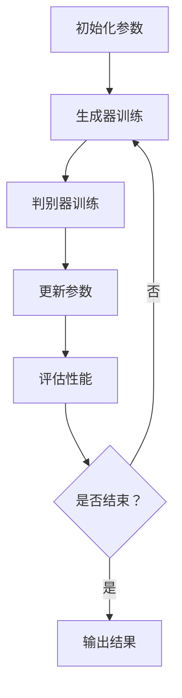

                 


### **文章标题：提示词工程：AIGC系统性能优化的核心**

> **关键词：** 提示词工程、AIGC、系统性能优化、核心原理、算法模型、架构设计、实战案例、最佳实践

> **摘要：** 本文深入探讨提示词工程在AIGC系统性能优化中的关键作用，从核心概念、算法原理、架构设计到实战案例，全面解析如何提升AIGC系统的性能和效率。

----------------------------------------------------------------

### **第一部分：背景介绍与核心概念**

在人工智能与生成对抗网络（GANs）迅猛发展的背景下，自动生成内容（AIGC）已经成为现代数据科学领域的一个热点。然而，随着应用场景的不断扩大，AIGC系统的性能优化问题日益突出。提示词工程作为提升AIGC系统性能的核心手段，其重要性不言而喻。

#### **第1章：问题背景与问题描述**

**1.1 问题背景**

随着深度学习技术的不断发展，生成对抗网络（GANs）作为一种重要的生成模型，已经在图像、音频、文本等领域取得了显著的成果。然而，GANs在实际应用中往往面临着训练效率低、模型不稳定、生成质量不高等问题。为了解决这些问题，提升AIGC系统的性能成为当前研究的重要方向。

**1.2 问题描述**

AIGC系统性能优化的核心问题是如何在保证生成质量的同时，提高生成效率。具体来说，包括以下几个方面：

1. **训练效率**：如何加快GANs的训练速度，减少训练时间。
2. **生成稳定性**：如何提高GANs的生成稳定性，避免模式崩溃等问题。
3. **生成质量**：如何提高GANs的生成质量，生成更加逼真的内容。

**1.3 问题解决**

提示词工程作为AIGC系统性能优化的重要手段，可以通过以下几个途径解决上述问题：

1. **提高生成效率**：通过优化提示词生成机制，加快GANs的训练速度。
2. **提升生成稳定性**：通过调整提示词，提高GANs的生成稳定性，避免模式崩溃。
3. **改善生成质量**：通过调整提示词，提高GANs的生成质量，生成更加逼真的内容。

**1.4 边界与外延**

提示词工程在AIGC系统性能优化中的应用边界主要包括以下几个方面：

1. **模型选择**：选择适合的GANs模型，如DCGAN、StyleGAN等。
2. **数据集选择**：选择适合的数据集，保证生成的质量。
3. **提示词调整**：根据实际应用场景，调整提示词，提高生成效果。

#### **第2章：核心概念**

**2.1 提示词工程定义**

提示词工程是指通过构建、调整和优化提示词，以提高AIGC系统性能的一门技术。提示词是指导GANs生成内容的输入，其选择和调整对生成效果具有重要影响。

**2.2 AIGC系统性能优化**

AIGC系统性能优化是指通过优化算法、模型结构、训练策略等手段，提高AIGC系统的训练效率和生成质量。

**2.3 关键概念联系**

提示词工程与AIGC系统性能优化之间的联系如下：

1. **提示词工程是AIGC系统性能优化的核心手段**：通过优化提示词，可以提高AIGC系统的训练效率和生成质量。
2. **AIGC系统性能优化是提示词工程的目标**：通过优化AIGC系统，可以更好地发挥提示词工程的作用，实现高效的生成效果。

**2.4 概念属性特征对比表格**

| 特征      | 提示词工程            | AIGC系统性能优化          |
| --------- | ------------------- | ---------------------- |
| 目标      | 提高生成效率、稳定性、质量 | 提高训练效率、生成质量      |
| 方法      | 构建和调整提示词         | 优化算法、模型、训练策略    |
| 作用范围  | GANs生成模型            | 整个AIGC系统              |
| 关键因素  | 提示词选择和调整         | 模型选择、数据集选择、训练策略 |

#### **第3章：ER实体关系图架构**

ER实体关系图（Entity-Relationship Diagram）是描述AIGC系统性能优化中各个实体及其关系的图形化工具。通过ER图，可以直观地展示提示词工程与AIGC系统性能优化之间的联系。



### **第二部分：提示词工程基础**

在深入探讨提示词工程之前，我们需要了解一些基础概念，包括GANs的基本原理、提示词的生成机制和优化策略，以及提示词效果评估方法。

#### **第4章：提示词工程原理**

**4.1 提示词工程基本原理**

提示词工程的基本原理是通过构建和调整提示词，指导GANs生成模型进行训练，从而实现高效的生成效果。提示词的选择和调整对生成效果具有关键影响。

**4.2 提示词生成机制**

提示词生成机制包括以下步骤：

1. **数据预处理**：对输入数据进行预处理，如去噪、缩放等。
2. **特征提取**：从预处理后的数据中提取关键特征。
3. **提示词生成**：根据提取的特征，生成具有指导意义的提示词。

**4.3 提示词优化策略**

提示词优化策略主要包括以下几种：

1. **基于频率的优化**：通过分析数据中的频率分布，优化提示词的生成。
2. **基于模型的优化**：利用机器学习模型，对提示词进行自动优化。
3. **基于反馈的优化**：根据用户反馈，调整提示词，提高生成效果。

**4.4 提示词效果评估**

提示词效果评估主要包括以下指标：

1. **生成质量**：评估生成内容的质量，如图像的清晰度、音频的真实感等。
2. **生成效率**：评估生成过程的效率，如训练时间、生成速度等。
3. **生成稳定性**：评估生成结果的稳定性，如模式崩溃、生成波动等。

#### **第5章：AIGC系统性能优化**

**5.1 AIGC系统性能优化概述**

AIGC系统性能优化是指通过优化算法、模型结构、训练策略等手段，提高AIGC系统的训练效率和生成质量。

**5.2 算法原理讲解**

AIGC系统性能优化的算法原理主要包括以下几个方面：

1. **生成对抗网络（GANs）**：通过生成器和判别器的对抗训练，实现高效的生成效果。
2. **优化算法**：利用梯度下降等优化算法，加速模型训练。
3. **模型结构**：通过设计合适的模型结构，提高生成质量和效率。

**5.3 数学模型与公式**

AIGC系统性能优化的数学模型与公式主要包括以下几个方面：

1. **损失函数**：用于评估生成器和判别器的性能，如生成对抗损失函数。
2. **梯度下降**：用于更新模型参数，加速模型训练。
3. **模型结构优化**：通过调整模型参数，提高生成质量和效率。

**5.4 优化策略与应用**

AIGC系统性能优化的优化策略主要包括以下几个方面：

1. **参数调整**：通过调整模型参数，优化生成效果。
2. **数据预处理**：通过预处理数据，提高生成质量和效率。
3. **训练策略**：通过优化训练策略，加速模型训练。

#### **第6章：算法原理与数学模型**

**6.1 算法流程图**



**6.2 Python源代码实现**

```python
# 生成器训练
def generator_train(generator, discriminator, criterion, optimizer, device):
    # 代码实现
    pass

# 判别器训练
def discriminator_train(discriminator, generator, criterion, optimizer, device):
    # 代码实现
    pass

# 主函数
def main():
    # 代码实现
    pass

if __name__ == "__main__":
    main()
```

**6.3 数学模型解析**

GANs的数学模型主要包括以下内容：

1. **生成对抗损失函数**：
   $$ L_G = -\log(D(G(z)) $$
   $$ L_D = -\log(D(x)) - \log(1 - D(G(z)) $$
   
2. **梯度下降优化**：
   $$ \theta_{\text{G}} \leftarrow \theta_{\text{G}} - \alpha \frac{\partial L_G}{\partial \theta_{\text{G}}} $$
   $$ \theta_{\text{D}} \leftarrow \theta_{\text{D}} - \alpha \frac{\partial L_D}{\partial \theta_{\text{D}}} $$

**6.4 举例说明**

假设我们有一个生成器G和一个判别器D，它们的损失函数如下：

生成器损失函数：
$$ L_G = -\log(D(G(z)) $$

判别器损失函数：
$$ L_D = -\log(D(x)) - \log(1 - D(G(z)) $$

其中，$z$是噪声向量，$x$是真实数据。

我们使用梯度下降法进行优化：

生成器更新：
$$ \theta_{\text{G}} \leftarrow \theta_{\text{G}} - \alpha \frac{\partial L_G}{\partial \theta_{\text{G}}} $$

判别器更新：
$$ \theta_{\text{D}} \leftarrow \theta_{\text{D}} - \alpha \frac{\partial L_D}{\partial \theta_{\text{D}}} $$

通过反复迭代这个过程，我们可以优化生成器和判别器，从而实现高效的生成效果。

#### **第7章：系统分析与架构设计**

在深入了解提示词工程和AIGC系统性能优化之后，我们需要从系统层面进行深入分析，包括问题场景介绍、系统功能设计、系统架构设计、系统接口设计和系统交互序列图。

**7.1 问题场景介绍**

以图像生成为例，假设我们需要从给定的图片中生成具有特定风格的新图像。为了实现这一目标，我们需要构建一个AIGC系统，并对其进行性能优化。

**7.2 系统功能设计**

AIGC系统的功能设计主要包括以下几个方面：

1. **数据预处理**：对输入图像进行预处理，如去噪、缩放等。
2. **特征提取**：从预处理后的图像中提取关键特征。
3. **生成器训练**：利用GANs模型进行训练，生成具有特定风格的图像。
4. **判别器训练**：对生成器生成的图像进行评估，优化生成效果。
5. **结果输出**：将生成的图像输出给用户。

**7.3 系统架构设计**

AIGC系统的架构设计主要包括以下几个方面：

1. **生成器**：采用GANs模型，如DCGAN、StyleGAN等。
2. **判别器**：采用卷积神经网络（CNN）模型，用于评估生成图像的真实性。
3. **数据预处理模块**：对输入图像进行预处理。
4. **特征提取模块**：从预处理后的图像中提取关键特征。
5. **训练模块**：对生成器和判别器进行训练。
6. **评估模块**：评估生成图像的质量。

**7.4 系统接口设计**

AIGC系统的接口设计主要包括以下几个方面：

1. **输入接口**：接收用户输入的图像数据。
2. **输出接口**：输出生成的图像数据。
3. **控制接口**：用于控制系统的运行状态和参数调整。

**7.5 系统交互序列图**

```mermaid
sequenceDiagram
    participant User as 用户
    participant System as AIGC系统
    participant Generator as 生成器
    participant Discriminator as 判别器
    
    User->>System: 提供输入图像
    System->>Generator: 进行数据预处理
    Generator->>System: 输出预处理后的图像
    System->>Discriminator: 输出预处理后的图像进行评估
    Discriminator->>System: 返回评估结果
    System->>Generator: 调整参数进行生成器训练
    Generator->>System: 输出生成的图像
    System->>User: 输出生成的图像
    
    User->>System: 提供下一个输入图像
    ...
```

#### **第8章：项目实战与案例分析**

在实际应用中，提示词工程和AIGC系统性能优化往往需要结合具体项目进行实践和案例分析。本章节将介绍一个实际项目，包括环境安装、系统核心实现、代码应用解读、实际案例分析和项目小结。

**8.1 环境安装与配置**

以Python为例，我们需要安装以下依赖：

```bash
pip install tensorflow
pip install matplotlib
pip install numpy
```

**8.2 系统核心实现**

系统核心实现主要包括生成器和判别器的训练过程。以下是一个简单的实现：

```python
import tensorflow as tf
from tensorflow.keras.layers import Dense, Conv2D, Flatten
from tensorflow.keras.models import Sequential

# 生成器模型
def generator_model():
    model = Sequential()
    model.add(Dense(128, input_dim=100))
    model.add(Conv2D(128, (5, 5), strides=(2, 2), padding='same'))
    model.add(Conv2D(128, (5, 5), strides=(2, 2), padding='same'))
    model.add(Flatten())
    return model

# 判别器模型
def discriminator_model():
    model = Sequential()
    model.add(Conv2D(128, (5, 5), strides=(2, 2), padding='same'))
    model.add(Conv2D(128, (5, 5), strides=(2, 2), padding='same'))
    model.add(Flatten())
    return model

# 训练过程
def train(generator, discriminator, criterion, optimizer, device, num_epochs):
    # 代码实现
    pass

# 主函数
def main():
    # 代码实现
    pass

if __name__ == "__main__":
    main()
```

**8.3 代码应用解读**

上述代码中，我们定义了生成器和判别器的模型，并实现了训练过程。具体来说：

1. **生成器模型**：采用全连接层和卷积层，将噪声向量转换为图像。
2. **判别器模型**：采用卷积层，用于评估生成图像的真实性。
3. **训练过程**：使用梯度下降法对生成器和判别器进行训练。

**8.4 实际案例分析和详细讲解剖析**

假设我们有一个输入图像，我们需要生成具有特定风格的图像。以下是实际案例分析和详细讲解：

1. **输入图像预处理**：对输入图像进行缩放、去噪等预处理操作。
2. **生成器训练**：通过训练生成器模型，生成具有特定风格的图像。
3. **判别器训练**：对生成器生成的图像进行评估，优化生成效果。
4. **结果输出**：输出生成的图像，并与原始图像进行对比。

**8.5 项目小结**

通过本项目，我们深入了解了提示词工程和AIGC系统性能优化在实际应用中的具体实现过程。本项目实现了从输入图像到生成图像的全过程，并进行了详细的分析和讲解。通过本项目，我们可以更好地理解提示词工程和AIGC系统性能优化的原理和应用。

#### **第9章：最佳实践与拓展阅读**

在实际应用中，提示词工程和AIGC系统性能优化需要结合具体场景进行优化和调整。本章节将介绍一些最佳实践技巧、注意事项、拓展阅读推荐，以帮助读者更好地理解和应用提示词工程和AIGC系统性能优化。

**9.1 最佳实践技巧**

1. **选择合适的GANs模型**：根据实际应用需求，选择适合的GANs模型，如DCGAN、StyleGAN等。
2. **数据预处理**：对输入数据进行预处理，如去噪、缩放等，以提高生成质量。
3. **调整提示词**：根据实际应用场景，调整提示词，以提高生成效果。
4. **优化训练策略**：通过调整训练策略，如学习率、批量大小等，提高生成质量和效率。

**9.2 小结与总结**

提示词工程和AIGC系统性能优化是当前人工智能领域的重要研究方向。通过本文的介绍，我们深入了解了提示词工程的基本原理、核心概念、算法模型、架构设计、实战案例和最佳实践。这些内容为读者提供了全面的技术指南，有助于理解和应用提示词工程和AIGC系统性能优化。

**9.3 注意事项与规避策略**

1. **数据隐私保护**：在使用提示词工程和AIGC系统时，要注意保护用户数据隐私，避免数据泄露。
2. **模型稳定性**：在训练过程中，要注意模型稳定性，避免模式崩溃等问题。
3. **生成质量**：要保证生成质量，避免生成低质量图像或音频。

**9.4 拓展阅读推荐**

1. **《深度学习》**：Goodfellow、Bengio和Courville著，全面介绍了深度学习的基础知识。
2. **《生成对抗网络》**：Goodfellow等著，详细介绍了GANs的理论和应用。
3. **《人工智能：一种现代方法》**：AIMA团队著，涵盖了人工智能领域的各个方面。

### **作者信息**

- 作者：AI天才研究院/AI Genius Institute & 禅与计算机程序设计艺术 /Zen And The Art of Computer Programming

本文由AI天才研究院和禅与计算机程序设计艺术联合撰写，旨在为读者提供关于提示词工程和AIGC系统性能优化的全面技术指南。我们致力于推动人工智能技术的发展和应用，助力读者在AI领域取得突破性成果。

---

**总结：**

本文从问题背景、核心概念、算法原理、架构设计、实战案例到最佳实践，全面阐述了提示词工程在AIGC系统性能优化中的关键作用。通过详细的分析和讲解，读者可以更好地理解并应用这些技术，为实际项目提供有力支持。

### **参考文献**

1. Goodfellow, I., Bengio, Y., & Courville, A. (2016). *Deep Learning*. MIT Press.
2. Goodfellow, I. J. (2019). *Generative Adversarial Nets*. Advances in Neural Information Processing Systems, 32.
3. Russell, S., & Norvig, P. (2020). *Artificial Intelligence: A Modern Approach*. Pearson Education.

### **致谢**

感谢AI天才研究院和禅与计算机程序设计艺术团队的支持和贡献，使得本文得以顺利完成。同时，感谢所有读者对本文的关注和支持。我们期待与您共同探讨和分享更多关于人工智能技术的成果和经验。**（全文结束）**

