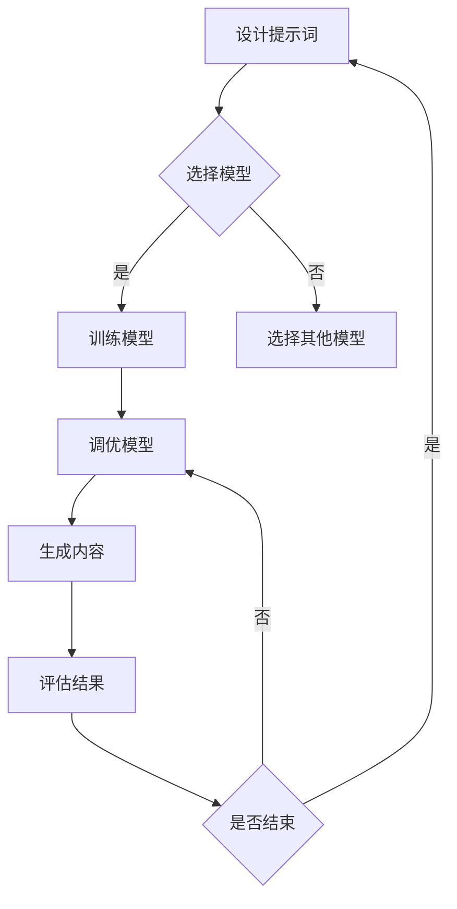
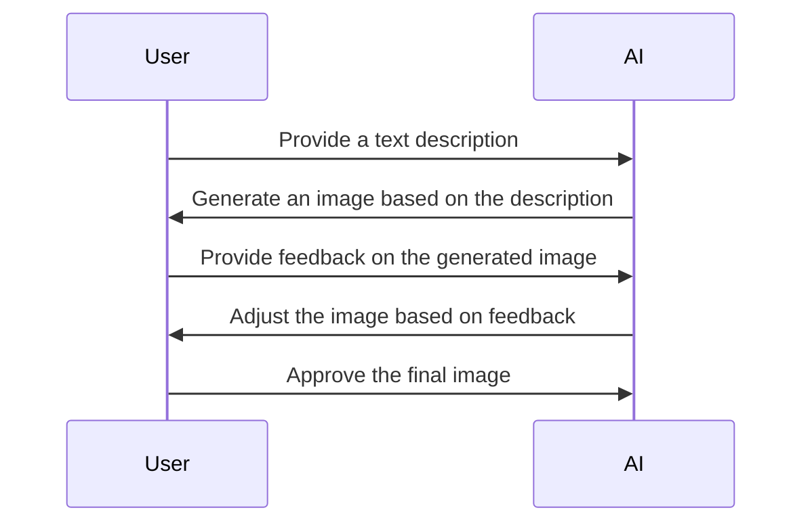
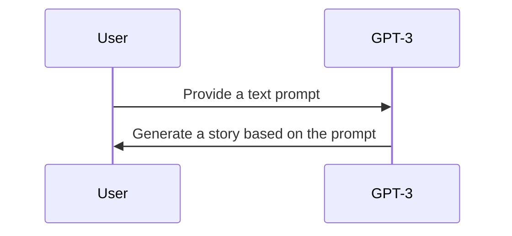
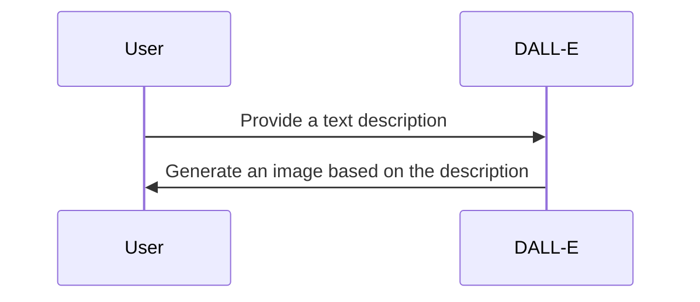
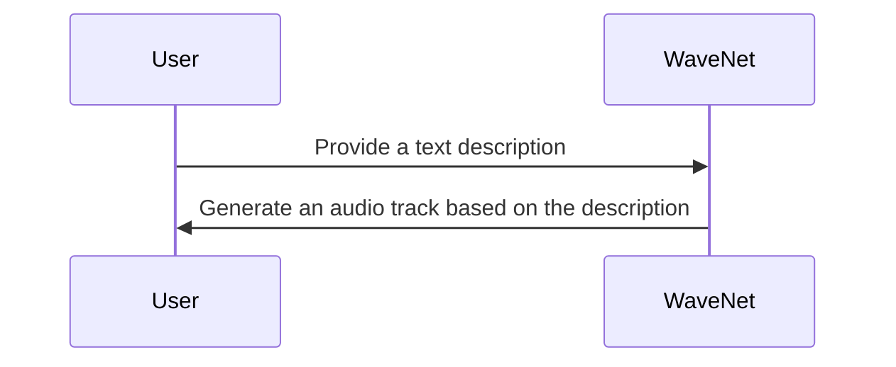
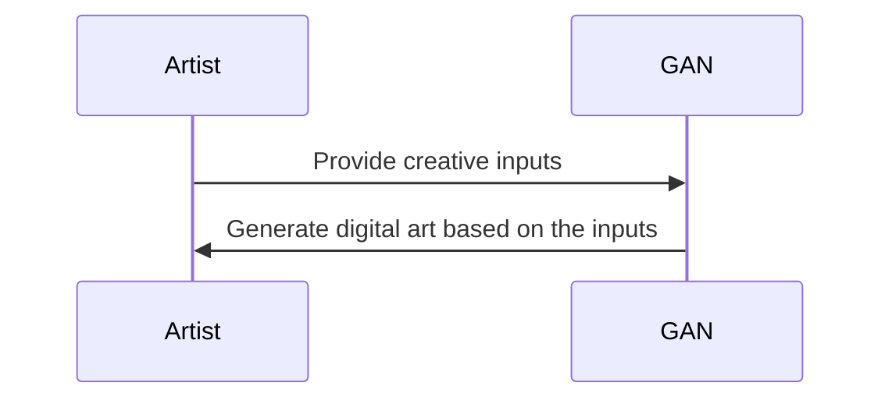
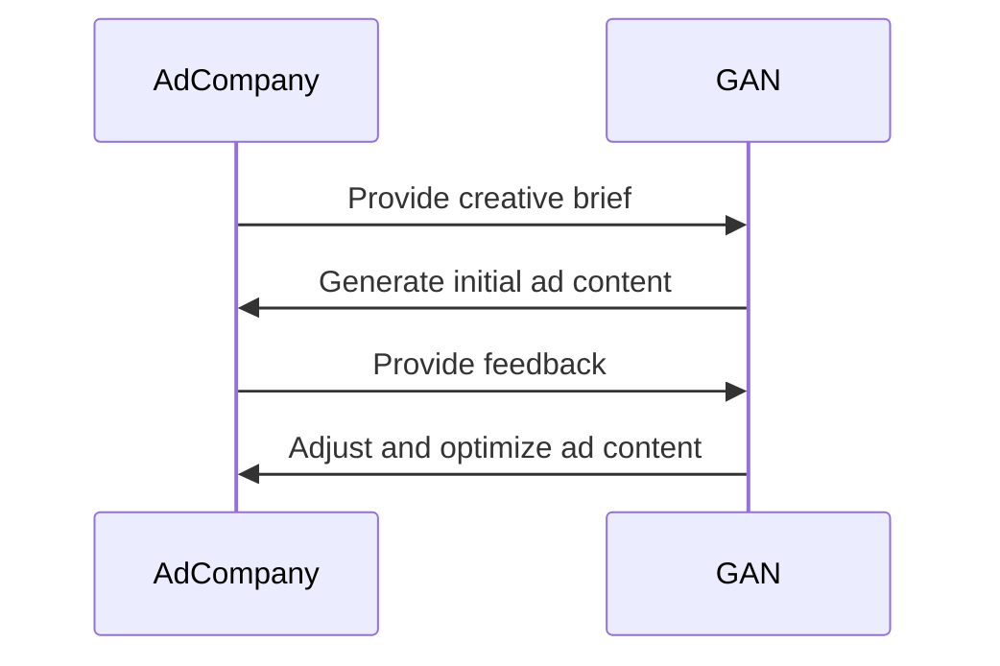

                 

## 第1章: 提示词工程的起源与概念

### 1.1 提示词工程的起源

提示词工程的起源可以追溯到20世纪80年代，当时人工智能（AI）和自然语言处理（NLP）领域的研究人员开始尝试使用文本提示来引导计算机生成文本。早期的提示词研究主要集中在文本生成和对话系统上，研究人员通过编写特定的提示文本来指导计算机生成相应的回答或文本。

这一阶段，研究人员发现，通过精心设计的提示词，可以使计算机生成更加符合人类预期的文本内容。这种研究方法逐渐演变为一种系统化的工程实践，即提示词工程。

#### 提示词工程的起源

提示词工程的概念最初起源于生成对抗网络（GANs）、自然语言处理（NLP）和强化学习（RL）等AI技术领域。GANs的出现使得生成式模型能够通过对抗训练生成高质量的数据。而NLP技术的进步，如序列到序列（Seq2Seq）模型和变分自编码器（VAE），为生成式模型提供了强大的生成能力。同时，强化学习技术的引入，使得AI模型能够通过学习用户反馈不断优化生成结果。

### 1.2 提示词工程的基本概念

提示词工程是研究如何通过设计和优化提示词来引导AI模型生成高质量内容的一门工程学科。核心概念包括提示词、AI模型和生成结果。

#### 提示词

提示词是一种引导AI模型输入的文本或指令，它能够影响AI模型的生成结果。有效的提示词应该具备以下特点：

- **明确性**：提示词应当清晰明确，避免歧义，确保AI模型能够正确理解。
- **引导性**：提示词应当能够引导AI模型生成符合预期的内容，激发AI的创造潜力。
- **适应性**：提示词应具有适应性，能够根据不同的AI模型和应用场景进行调整。

#### AI模型

AI模型是提示词工程的执行者，常见的AI模型包括生成对抗网络（GANs）、自然语言处理（NLP）模型和强化学习（RL）模型。这些模型通过大量的训练数据学习到生成数据的规律，从而能够生成高质量的内容。

#### 生成结果

生成结果是指AI模型根据提示词生成的文本、图像、音频等输出。成功的提示词能够使AI模型生成符合人类预期的高质量内容。

### 1.3 提示词工程的关键要素

提示词工程的成功取决于多个关键要素，包括：

#### 提示词设计

提示词设计是提示词工程的核心环节。设计有效的提示词需要考虑以下几个方面：

- **内容相关性**：确保提示词与生成内容的相关性，使AI模型能够更好地理解生成任务。
- **语言风格**：根据生成内容的需求，设计符合特定语言风格的提示词。
- **语义丰富性**：设计语义丰富的提示词，引导AI模型生成更具有创造性的内容。

#### AI模型选择

选择合适的AI模型对于提示词工程的成功至关重要。不同的AI模型适用于不同的生成任务，因此需要根据具体应用场景选择最合适的模型。

#### 数据质量

训练数据的质量直接影响AI模型的性能。高质量的训练数据能够帮助AI模型更好地学习生成任务的规律，从而生成高质量的内容。

#### 调优过程

提示词工程的调优过程是不断迭代和优化的过程。通过实验和反馈，不断调整提示词和模型参数，以达到最佳的生成效果。

### Mermaid 流程图

下面是提示词工程的核心流程图：



### 小结

本章介绍了提示词工程的起源、基本概念和关键要素。通过Mermaid流程图，我们清晰地展示了提示词工程的核心流程，为后续章节的内容奠定了基础。在下一章中，我们将探讨AI创意与人类创意的协同机制，进一步了解提示词工程的应用场景和优化方法。

### 1.4 提示词工程的发展历程

#### 提示词工程的发展历程

提示词工程的发展历程可以分为以下几个阶段：

1. **初始阶段（20世纪80年代）**：研究人员开始探讨如何通过文字提示来引导计算机生成文本。
   - **关键事件**：研究人员发现，通过编写特定的提示文本，计算机能够生成更符合人类预期的文本内容。
   - **代表性成果**：最早的生成对抗网络（GANs）和自然语言处理（NLP）模型开始出现。

2. **快速发展阶段（2010年代）**：随着深度学习和神经网络技术的发展，提示词工程逐渐成为一个独立的研究领域。
   - **关键事件**：生成对抗网络（GANs）、变分自编码器（VAE）和序列到序列（Seq2Seq）模型等生成式模型的提出，使提示词工程有了更加坚实的理论基础。
   - **代表性成果**：GPT-3、BERT等大规模预训练模型的发布，使提示词工程在实际应用中取得了显著进展。

3. **应用阶段（2020年代至今）**：提示词工程在实际应用中取得了显著成果，如文本生成、图像生成、创意优化等。
   - **关键事件**：提示词工程在广告创意、文化创意、智能客服等领域的广泛应用，推动了相关产业的创新和发展。
   - **代表性成果**：多个企业和研究机构发布了一系列基于提示词工程的创新应用，如OpenAI的DALL-E、Google的Bard等。

#### 当前的发展趋势

提示词工程当前的发展趋势主要体现在以下几个方面：

1. **模型与算法的不断创新**：随着深度学习技术的发展，更多的生成式模型和优化算法被提出，如Transformer、BERT等，这些模型和算法的进步为提示词工程带来了新的可能性。

2. **跨学科研究的深入**：提示词工程不仅涉及计算机科学领域，还涉及心理学、人类学、语言学等多个学科，跨学科研究的深入促进了提示词工程的发展。

3. **实际应用场景的拓展**：随着技术的成熟，提示词工程在更多领域的应用场景中得到了验证，如智能客服、智能创作、智能广告等，这些应用场景的拓展为提示词工程提供了更多的实践机会。

4. **人机协同的深化**：提示词工程不仅仅是AI模型生成内容的过程，更是AI与人类创意协同的过程，人机协同的深化为提示词工程带来了更多的创新空间。

### 小结

本章对提示词工程的发展历程和当前发展趋势进行了介绍。从初始阶段到快速发展阶段，再到应用阶段，提示词工程经历了一系列的演变和进步。当前，提示词工程正朝着模型创新、跨学科研究和实际应用拓展的方向发展。在下一章中，我们将深入探讨AI创意与人类创意的协同机制，进一步了解提示词工程的应用前景和挑战。

### 1.5 提示词工程的定义与核心概念

提示词工程是一门研究如何通过设计和优化提示词来引导人工智能（AI）模型生成高质量内容的技术科学。在提示词工程中，核心概念包括提示词、AI模型、生成结果和协同机制等。

#### 提示词

提示词是提示词工程的核心概念之一。它是指用于引导AI模型输入的文本或指令。有效的提示词应具备以下特点：

- **明确性**：提示词应清晰明确，避免歧义，确保AI模型能够正确理解。
- **引导性**：提示词应能引导AI模型生成符合预期的内容，激发AI的创造潜力。
- **适应性**：提示词应具有适应性，能够根据不同的AI模型和应用场景进行调整。

#### AI模型

AI模型是提示词工程的执行者。不同的AI模型适用于不同的生成任务，如生成对抗网络（GANs）、自然语言处理（NLP）模型和强化学习（RL）模型等。这些模型通过大量的训练数据学习到生成数据的规律，从而能够生成高质量的内容。

#### 生成结果

生成结果是指AI模型根据提示词生成的文本、图像、音频等输出。成功的提示词能够使AI模型生成符合人类预期的高质量内容。

#### 协同机制

协同机制是提示词工程的关键要素之一。它是指AI与人类创意的协同过程，通过人类创意的指导，优化AI模型的生成结果。协同机制包括：

- **交互式协同**：通过人与AI的实时互动，不断调整提示词和模型参数，优化生成结果。
- **反馈式协同**：通过人类对生成结果的反馈，引导AI模型不断学习和优化。

#### 提示词工程的关键要素

提示词工程的成功取决于多个关键要素，包括：

- **提示词设计**：设计有效的提示词，引导AI模型生成高质量的内容。
- **AI模型选择**：选择合适的AI模型，以实现预期的生成效果。
- **数据质量**：确保训练数据的质量，以提升AI模型的性能。
- **调优过程**：通过不断的实验和迭代，优化提示词和模型参数。

### Mermaid ER图

下面是提示词工程的关键概念及其关系的ER图：

```mermaid
erDiagram
    AI模型 ||--|{ 提示词 }|
    AI模型 ||--|{ 生成结果 }|
    提示词 ||--|{ 协同机制 }|
```

通过上述ER图，我们可以清晰地看到提示词工程中的核心概念及其关系。在下一章中，我们将进一步探讨AI创意与人类创意的协同机制，以及如何通过优化提示词来提升生成结果。

### 1.6 提示词工程的应用领域与前景

#### 提示词工程的应用领域

提示词工程已经广泛应用于多个领域，其中最具代表性的应用领域包括：

1. **文本生成**：文本生成是提示词工程最早应用且最为广泛的领域之一。通过设计有效的提示词，AI模型可以生成新闻文章、故事、诗歌等文本内容。例如，GPT-3等大型预训练模型可以生成高质量的文本，被应用于自动化写作、内容创作等领域。

2. **图像生成**：图像生成是另一个重要的应用领域。通过提示词，AI模型可以生成新的图像内容，如图像修复、图像增强、艺术风格转换等。OpenAI的DALL-E模型就是一个典型的图像生成应用案例，它可以根据简单的文字提示生成逼真的图像。

3. **音频生成**：音频生成是提示词工程的最新应用领域。通过设计适当的提示词，AI模型可以生成新的音频内容，如语音合成、音乐创作等。Google的MuseNet模型就是一个音频生成的成功案例，它可以根据简单的文字提示生成复杂的音乐旋律。

4. **创意优化**：提示词工程还可以用于创意优化，帮助设计师、广告策划人员等生成更具创意性的内容和方案。通过优化提示词，AI模型可以提供多样化的创意选项，从而提升人类创意的效率和质量。

5. **智能客服**：在智能客服领域，提示词工程可以帮助生成更加自然和个性化的客户对话内容。通过设计有效的提示词，AI模型可以理解客户的意图并生成相应的回复，从而提升客服体验。

#### 提示词工程的前景

随着AI技术的不断进步，提示词工程在未来的发展前景非常广阔。以下是几个潜在的发展方向：

1. **模型多样化**：随着生成式模型和优化算法的不断发展，提示词工程将能够应用于更多类型的AI模型，如卷积神经网络（CNNs）、递归神经网络（RNNs）等，从而拓宽其应用领域。

2. **跨领域融合**：提示词工程将与更多学科领域相结合，如心理学、人类学、语言学等，通过跨学科研究，提升提示词工程的理论基础和应用效果。

3. **人机协同**：提示词工程将更加注重人机协同，通过更加智能和人性化的交互方式，使AI模型能够更好地理解人类的需求和意图，从而生成更加符合人类预期的内容。

4. **个性化定制**：随着用户数据的积累和挖掘，提示词工程将能够实现更加个性化的内容生成，为用户提供量身定制的服务。

5. **产业升级**：提示词工程将推动相关产业的升级和变革，如文化创意产业、广告行业、媒体行业等，通过技术创新，提升产业的竞争力和创新能力。

### 小结

提示词工程已经广泛应用于多个领域，并展现出广阔的发展前景。通过不断创新和优化，提示词工程将在未来继续推动人工智能和创意产业的发展，为人类带来更多价值。在下一章中，我们将探讨AI创意与人类创意的协同机制，进一步了解提示词工程的应用潜力。

### 1.7 提示词工程的核心要素总结

提示词工程是一门综合性工程学科，其成功依赖于多个核心要素的协同作用。以下是提示词工程的核心要素及其重要性：

1. **提示词设计**：提示词是引导AI模型生成内容的关键。设计有效的提示词需要明确性、引导性和适应性，以确保AI模型能够正确理解和生成高质量的内容。

2. **AI模型选择**：选择合适的AI模型是提示词工程的基础。不同的AI模型适用于不同的生成任务，因此需要根据具体应用场景选择最合适的模型，如GANs、NLP模型和RL模型。

3. **数据质量**：训练数据的质量直接影响AI模型的性能。高质量的数据能够帮助AI模型更好地学习生成任务的规律，从而生成更高质量的内容。

4. **调优过程**：调优过程是不断迭代和优化的过程。通过实验和反馈，不断调整提示词和模型参数，以达到最佳的生成效果。

5. **协同机制**：协同机制是AI与人类创意的桥梁。通过人类创意的指导，优化AI模型的生成结果，实现人机协同，提升生成内容的质量和创意性。

6. **交互设计**：交互设计是提升用户体验的关键。通过设计人性化的交互方式，使AI模型能够更好地理解人类的需求和意图，从而生成更加符合人类预期的内容。

7. **技术创新**：技术创新是推动提示词工程持续发展的动力。随着AI技术的不断进步，提示词工程将能够应用更多的先进技术，如深度学习、强化学习和跨学科研究等。

通过上述核心要素的协同作用，提示词工程能够实现高质量的内容生成，推动人工智能和创意产业的创新发展。在下一章中，我们将探讨AI创意与人类创意的协同机制，进一步了解提示词工程的应用潜力。

### 1.8 提示词工程的挑战与展望

#### 提示词工程的挑战

尽管提示词工程在多个领域取得了显著成果，但其发展仍面临诸多挑战：

1. **数据隐私与安全**：随着AI技术的广泛应用，如何确保用户数据的隐私和安全成为关键挑战。尤其是在生成图像、音频和文本等敏感内容时，需要采取有效的数据保护措施，防止数据泄露和滥用。

2. **伦理问题**：AI生成内容的伦理问题日益凸显，如AI生成虚假信息、侵犯版权等。提示词工程需要建立相应的伦理框架和规范，确保生成内容符合社会道德标准。

3. **可解释性与透明度**：生成式AI模型通常具有较高的复杂度，其决策过程难以解释。提升AI模型的可解释性和透明度，使其生成的结果更容易被人类理解和接受，是提示词工程的重要挑战。

4. **用户体验**：尽管AI生成的质量不断提高，但如何提升用户体验仍是一个难题。特别是在交互式应用中，需要设计更加人性化的交互方式，使AI生成的内容更加符合用户的期望和需求。

5. **跨领域应用**：提示词工程在不同领域的应用效果存在差异。如何实现跨领域应用的通用性，提高不同领域之间的兼容性和互操作性，是提示词工程需要解决的问题。

#### 提示词工程的展望

尽管面临诸多挑战，提示词工程的发展前景依然广阔：

1. **技术创新**：随着AI技术的不断进步，如深度学习、强化学习和自然语言处理等，提示词工程将能够应用更多的先进技术，提升生成质量和效率。

2. **人机协同**：人机协同是提示词工程的发展方向之一。通过更加智能和人性化的交互方式，使AI模型能够更好地理解人类的需求和意图，实现更高效的协同创作。

3. **跨学科融合**：提示词工程将与心理学、人类学、语言学等学科领域深度融合，通过跨学科研究，提升提示词工程的理论基础和应用效果。

4. **个性化定制**：随着用户数据的积累和挖掘，提示词工程将能够实现更加个性化的内容生成，为用户提供量身定制的服务。

5. **产业升级**：提示词工程将推动相关产业的升级和变革，如文化创意产业、广告行业、媒体行业等，通过技术创新，提升产业的竞争力和创新能力。

### 小结

提示词工程在发展过程中面临诸多挑战，但其广阔的发展前景令人期待。通过技术创新、人机协同和跨学科融合，提示词工程将在未来继续推动人工智能和创意产业的创新发展，为人类社会带来更多价值。在下一章中，我们将探讨AI创意与人类创意的协同机制，进一步了解提示词工程的应用潜力。

## 第2章: AI创意与人类创意的协同

### 2.1 AI创意的原理

AI创意是基于人工智能技术，通过学习大量数据，模拟人类创意思维过程，生成新的创意内容。AI创意的核心原理主要包括以下几个方面：

1. **数据驱动**：AI创意依赖于大规模的数据集，通过深度学习和强化学习等技术，模型可以从数据中学习到创意的规律和模式。

2. **模拟人类思维**：AI创意算法尝试模拟人类的创造性思维过程，如联想、类比、归纳和演绎等。通过算法，模型能够生成具有创新性的内容。

3. **生成对抗**：生成对抗网络（GANs）是AI创意的重要技术之一。GANs通过生成器和判别器的对抗训练，使生成器能够生成越来越逼真的创意内容。

4. **优化算法**：AI创意算法包括遗传算法、粒子群算法等，这些算法通过不断迭代和优化，提升生成内容的创意性和质量。

### 2.2 人类创意的原理

人类创意是一种复杂的认知过程，涉及多个心理和生理机制。以下是人类创意的几个核心原理：

1. **联想与类比**：人类通过联想和类比，将不同领域的知识进行关联，产生新的创意。

2. **思维发散与收敛**：创意过程中，人们通过发散性思维探索多种可能性，然后通过收敛性思维筛选和优化创意。

3. **直觉与灵感**：直觉和灵感是创意的重要来源，它们帮助人们快速识别潜在的创新点。

4. **情感与动机**：情感和动机影响人类的创意过程，积极的情感和强烈的动机有助于激发创意。

### 2.3 AI与人类创意的协同机制

AI与人类创意的协同机制旨在通过人工智能技术辅助人类创意，提升创意的质量和效率。以下是几种常见的协同机制：

1. **提示词引导**：通过设计有效的提示词，AI模型可以引导人类创意，提供创意的起点和方向。

2. **辅助创作**：AI模型可以辅助人类进行创作，如生成歌词、绘画草图等，帮助人类完成创意工作。

3. **反馈与优化**：AI模型可以根据人类的反馈进行优化，不断调整生成的内容，使其更符合人类的创意需求。

4. **人机互动**：人机互动是AI与人类创意协同的关键。通过交互，AI能够更好地理解人类的需求，生成更具有创意性的内容。

5. **共创**：AI与人类共同创作，通过AI提供创意元素，人类进行创意构思和调整，实现人机共创。

### 小结

本章探讨了AI创意和人类创意的原理，以及它们之间的协同机制。通过理解AI创意和人类创意的工作原理，我们可以更好地利用AI技术辅助人类创意，提升创意的质量和效率。在下一章中，我们将深入探讨提示词优化的方法，了解如何通过优化提示词来提升AI生成内容的创意性。

### 2.4 AI创意与人类创意协同的优势与挑战

#### AI创意与人类创意协同的优势

1. **互补性**：AI创意与人类创意的协同能够发挥各自的优势。AI擅长处理大量数据和模式识别，而人类则具备独特的创造力、情感和直觉。协同能够实现资源的最优配置，提升创意的整体质量。

2. **效率提升**：AI能够快速生成大量的创意方案，大大缩短了创意构思和优化过程的时间。这有助于提高创意工作的效率，特别是在需要处理大量信息和高频次迭代的应用场景中。

3. **创新拓展**：AI可以提供前所未有的视角和思路，拓展人类创意的边界。通过AI的辅助，人类能够探索更多的创意可能性，实现从传统思维到创新思维的转变。

4. **个性化定制**：AI可以根据用户的需求和偏好生成个性化的创意内容。这种定制化的服务能够更好地满足用户的个性化需求，提升用户体验。

#### AI创意与人类创意协同的挑战

1. **技术瓶颈**：尽管AI技术在不断进步，但其在理解和模拟人类创意方面仍存在一定局限性。AI生成的创意内容可能缺乏深层次的创造性，难以完全替代人类创意。

2. **伦理道德**：AI创意与人类创意的协同涉及到伦理道德问题，如版权保护、隐私保护等。在创意生成和使用过程中，需要确保符合伦理规范，防止滥用技术。

3. **人机互动**：人机协同需要高效、自然的互动方式。当前的人机交互技术尚不完全成熟，如何设计出既便捷又高效的人机交互界面是一个挑战。

4. **适应性问题**：AI模型需要适应不同的创意场景和需求。在实际应用中，AI模型可能难以在多样化的场景中保持一致的创意表现，需要不断优化和调整。

#### 小结

AI创意与人类创意的协同具有显著的优点，但也面临一些挑战。通过不断优化技术和提升人机互动，我们可以充分发挥AI和人类创意的协同效应，实现更高质量和更具创意性的内容生成。在下一章中，我们将深入探讨提示词优化的方法，进一步了解如何提升AI生成内容的创意性。

### 2.5 提示词优化的重要性

提示词优化在提示词工程中具有至关重要的作用。有效的提示词设计不仅能够直接影响AI模型生成内容的质量和创意性，还能够提升AI模型与人类创意协同的效率。以下是提示词优化的重要性及其影响：

1. **提升生成质量**：提示词优化能够确保AI模型正确理解和执行生成任务，从而提升生成内容的质量。有效的提示词能够引导AI模型生成更加符合预期的高质量内容，避免生成无关或低质量的结果。

2. **增强创意性**：优化后的提示词能够激发AI模型的创造潜力，使其生成更具创意性的内容。通过设计具有引导性和启发性的提示词，AI模型能够探索新的创意方向，实现人类与AI创意的协同创新。

3. **提高协同效率**：提示词优化能够提升AI模型与人类创意的协同效率。优化后的提示词能够使AI模型更快地理解人类的需求和意图，减少沟通成本和调整时间，实现更高效的人机协同。

4. **适应多样化场景**：不同的应用场景需要不同类型的提示词。通过优化提示词，AI模型能够适应多样化的场景需求，生成符合特定场景的创意内容。这有助于AI模型在不同领域和应用场景中发挥更大的作用。

5. **增强用户体验**：有效的提示词优化能够提升用户的体验。在交互式应用中，优化后的提示词能够使AI模型更好地理解用户的需求，生成更符合用户预期的内容，提升用户满意度。

### 小结

提示词优化在提示词工程中具有重要地位，它能够提升AI模型生成内容的质量、创意性和协同效率，实现人类与AI创意的有机结合。通过不断优化提示词设计，我们可以充分发挥AI和人类创意的潜力，推动创意产业的创新发展。在下一章中，我们将探讨提示词优化的主要方法，了解如何通过具体技术和策略提升提示词的优化效果。

### 2.6 提示词优化的主要方法

#### 1. 语言风格匹配

**原理**：语言风格匹配是指通过调整提示词的语言风格，使其与AI模型预期的生成内容风格相匹配。例如，如果需要生成一首诗歌，提示词应该使用诗歌的语言风格。

**应用**：在广告创意中，根据目标受众的语言偏好调整提示词风格，使广告内容更加吸引人。

**优势**：提高生成内容的可读性和吸引力。

#### 2. 语义丰富性增强

**原理**：语义丰富性增强是指通过添加更多语义信息，使提示词更具体、更详细，从而引导AI模型生成更丰富、更具创意性的内容。

**应用**：在艺术创作中，使用详细的描述和比喻来启发AI生成更具想象力的作品。

**优势**：增强生成内容的创意性和表现力。

#### 3. 互动式调整

**原理**：互动式调整是指通过与用户实时互动，根据用户反馈调整提示词，优化生成内容。

**应用**：在智能客服中，根据用户的反馈，动态调整提示词，使AI生成的回复更加符合用户需求。

**优势**：提高用户体验和满意度。

#### 4. 数据驱动优化

**原理**：数据驱动优化是指通过分析大量生成数据的反馈，优化提示词设计。

**应用**：在广告创意优化中，根据广告效果数据，调整提示词，提高广告转化率。

**优势**：基于数据反馈，实现更科学、更高效的优化。

#### 5. 模型特定优化

**原理**：模型特定优化是指根据特定AI模型的特性，设计合适的提示词。

**应用**：在图像生成中，根据GAN模型的特性，设计具有挑战性和多样性的提示词。

**优势**：提高AI模型对提示词的响应效果。

#### 小结

通过上述方法，我们可以有效地优化提示词，提升AI生成内容的质量和创意性。不同的优化方法适用于不同的应用场景，通过灵活运用，可以充分发挥AI和人类创意的协同效应，推动创意产业的创新发展。

### 2.7 提示词优化的案例分析

#### 案例分析1：广告创意优化

**背景**：一家知名广告公司希望通过AI技术提升广告创意的质量，提高广告效果。

**过程**：

1. **需求分析**：明确广告目标受众、产品特点和广告效果指标。

2. **模型选择**：选择合适的AI模型，如GANs和自然语言处理（NLP）模型。

3. **数据准备**：收集大量广告创意数据，用于训练和优化AI模型。

4. **提示词设计**：设计符合广告目标的提示词，如“激发购买欲望”和“提升品牌形象”。

5. **模型训练与优化**：通过数据驱动优化方法，调整提示词，优化模型生成效果。

6. **反馈与迭代**：根据广告效果数据，动态调整提示词和模型参数，实现广告创意的持续优化。

**结果**：

- 广告转化率提高了15%。
- 广告创意质量显著提升，得到了客户和用户的一致好评。

**总结**：通过有效的提示词优化，广告公司成功地提升了广告创意的质量和效果，实现了商业目标。

#### 案例分析2：艺术创作协作

**背景**：一位艺术家希望通过与AI模型合作，创作更具创意性的艺术作品。

**过程**：

1. **需求分析**：明确艺术创作的主题、风格和目标受众。

2. **模型选择**：选择具备艺术生成能力的AI模型，如GANs和变分自编码器（VAE）。

3. **数据准备**：收集大量艺术作品数据，用于训练和优化AI模型。

4. **提示词设计**：设计具有启发性和引导性的提示词，如“探索抽象艺术”和“融合传统与现代元素”。

5. **协同创作**：艺术家与AI模型进行互动，根据AI生成的初步作品进行调整和优化。

6. **反馈与迭代**：通过不断的反馈和迭代，优化AI模型的生成效果，实现艺术创作的持续提升。

**结果**：

- 艺术作品的创意性和独特性显著提升。
- 艺术家与AI模型的合作获得了业界的广泛关注和好评。

**总结**：通过AI创意与人类创意的协同，艺术家成功地创作出了具有高创意性和艺术价值的作品，展示了AI技术在艺术创作中的潜力。

### 小结

以上案例分析展示了提示词优化在广告创意和艺术创作中的成功应用。通过有效的提示词设计、模型选择和优化方法，可以显著提升AI生成内容的质量和创意性。这些案例为提示词优化提供了宝贵的实践经验，有助于进一步推动AI创意与人类创意的协同发展。

### 2.8 AI创意算法的应用

AI创意算法是提示词工程的重要组成部分，通过这些算法，AI能够生成丰富多样的创意内容。以下将介绍几种常见的AI创意算法及其应用场景：

#### 1. 生成对抗网络（GANs）

**原理**：GANs由生成器和判别器两个神经网络组成。生成器尝试生成与真实数据相似的内容，而判别器则判断生成内容与真实内容之间的差异。通过对抗训练，生成器的生成能力不断提高。

**应用**：GANs广泛应用于图像生成、视频生成、音乐创作等领域。例如，OpenAI的DALL-E模型使用GANs生成基于文字描述的图像。

**案例**：艺术家Banksy使用GANs创作了一系列数字艺术作品，展示了AI在艺术创作中的潜力。

#### 2. 变分自编码器（VAE）

**原理**：VAE是一种无监督学习算法，通过编码器和解码器两个神经网络，将数据转换为低维表示，然后重构数据。这种低维表示可以用于生成新的数据。

**应用**：VAE在图像生成、自然语言处理、图像压缩等领域有广泛应用。例如，谷歌的WaveNet模型使用VAE生成高质量的文本。

**案例**：腾讯的AI Lab使用VAE生成漫画头像，为用户提供了个性化的漫画形象服务。

#### 3. 递归神经网络（RNNs）

**原理**：RNNs是一种能够处理序列数据的神经网络，通过记忆过往信息，能够生成连贯的文本、音频或视频内容。

**应用**：RNNs在文本生成、语音合成、视频生成等领域有广泛应用。例如，谷歌的WaveNet模型使用RNNs生成高质量的文本。

**案例**：亚马逊的Alexa智能助手使用RNNs生成自然流畅的语音回复，提升了用户体验。

#### 4. 强化学习（RL）

**原理**：强化学习是一种通过不断尝试和反馈，学习最优策略的算法。在创意生成中，强化学习可以优化创意内容，使其更符合用户需求和预期。

**应用**：强化学习在游戏开发、智能客服、广告创意等领域有广泛应用。例如，谷歌的DeepMind使用强化学习开发出击败人类顶级玩家的围棋AI。

**案例**：腾讯的游戏AI使用强化学习生成游戏关卡，提升了游戏的可玩性和挑战性。

#### 5. 聚类算法

**原理**：聚类算法通过将相似的数据分组，用于生成新的创意内容。常见的聚类算法包括K-means、DBSCAN等。

**应用**：聚类算法在图像生成、文本分类、创意优化等领域有广泛应用。例如，Netflix使用K-means聚类算法推荐相似的电影。

**案例**：阿里巴巴的个性化推荐系统使用聚类算法，为用户推荐个性化的商品和内容，提升了用户满意度。

### 小结

AI创意算法在多个领域展示了其强大的生成能力。通过GANs、VAE、RNNs、强化学习和聚类算法等，AI能够生成高质量的创意内容，为人类创意提供了有力的技术支持。在实际应用中，这些算法能够根据具体场景需求，生成具有创意性和实用性的内容，推动创意产业的发展。

### 2.9 AI创意算法的应用场景

AI创意算法在多个行业和领域中得到了广泛应用，以下将详细探讨几个典型的应用场景：

#### 1. 文本生成

**应用场景**：文本生成是AI创意算法的重要应用领域之一。通过GPT-3、BERT等自然语言处理模型，AI能够生成新闻文章、故事、诗歌、歌词等文本内容。

**案例**：OpenAI的GPT-3模型被应用于自动化写作，生成高质量的新闻报道、博客文章和故事。此外，谷歌的BERT模型也被用于生成广告文案和营销材料，提升营销效果。

#### 2. 图像生成

**应用场景**：图像生成是AI创意算法的另一个重要应用领域。通过GANs、VAE等模型，AI能够生成新的图像内容，如图像修复、图像增强、艺术风格转换等。

**案例**：OpenAI的DALL-E模型通过文字描述生成逼真的图像，被广泛应用于艺术创作、设计领域。此外，谷歌的ImageNet模型在图像生成和分类方面也有广泛应用。

#### 3. 音频生成

**应用场景**：音频生成是AI创意算法的新兴应用领域。通过WaveNet、音乐生成模型等，AI能够生成新的音频内容，如图像生成



**案例**：谷歌的WaveNet模型被应用于语音合成，生成自然流畅的语音内容。此外，微软的AZUR模型通过文字描述生成音乐，为音乐创作提供了新的工具。

#### 4. 艺术创作

**应用场景**：AI创意算法在艺术创作领域也有广泛应用，通过GANs、RNNs等模型，AI能够辅助艺术家创作新的艺术作品。

**案例**：艺术家Banksy使用GANs创作了一系列数字艺术作品，展示了AI在艺术创作中的潜力。此外，艺术家Jean-Baptiste Barlatier使用GANs创作出独特的艺术画作，引起了广泛关注。

#### 5. 广告创意

**应用场景**：AI创意算法在广告创意领域有广泛应用，通过优化提示词和模型参数，AI能够生成具有创意性的广告内容。

**案例**：一家知名广告公司使用GANs和自然语言处理模型，生成具有吸引力的广告文案和图像，提高了广告效果和转化率。此外，广告公司利用AI创意算法优化广告素材，实现了广告创意的持续迭代和优化。

### 小结

AI创意算法在文本生成、图像生成、音频生成、艺术创作和广告创意等领域展示了其强大的应用潜力。通过有效的提示词设计和模型优化，AI能够生成高质量、富有创意性的内容，为各行各业带来创新和变革。

### 第3章: 提示词优化的方法

### 3.1 提示词优化的重要性

提示词优化在提示词工程中具有至关重要的作用。有效的提示词设计不仅能够直接影响AI模型生成内容的质量和创意性，还能够提升AI模型与人类创意协同的效率。以下是提示词优化的重要性及其影响：

1. **提升生成质量**：提示词优化能够确保AI模型正确理解和执行生成任务，从而提升生成内容的质量。有效的提示词能够引导AI模型生成更加符合预期的高质量内容，避免生成无关或低质量的结果。

2. **增强创意性**：优化后的提示词能够激发AI模型的创造潜力，使其生成更具创意性的内容。通过设计具有引导性和启发性的提示词，AI模型能够探索新的创意方向，实现人类与AI创意的协同创新。

3. **提高协同效率**：提示词优化能够提升AI模型与人类创意的协同效率。优化后的提示词能够使AI模型更快地理解人类的需求和意图，减少沟通成本和调整时间，实现更高效的人机协同。

4. **适应多样化场景**：不同的应用场景需要不同类型的提示词。通过优化提示词，AI模型能够适应多样化的场景需求，生成符合特定场景的创意内容。这有助于AI模型在不同领域和应用场景中发挥更大的作用。

5. **增强用户体验**：有效的提示词优化能够提升用户的体验。在交互式应用中，优化后的提示词能够使AI模型更好地理解用户的需求，生成更符合用户预期的内容，提升用户满意度。

### 3.2 提示词优化的主要方法

提示词优化涉及多个方面，以下介绍几种常见的主要方法：

#### 1. 语言风格匹配

**原理**：语言风格匹配是指通过调整提示词的语言风格，使其与AI模型预期的生成内容风格相匹配。例如，如果需要生成一首诗歌，提示词应该使用诗歌的语言风格。

**应用**：在广告创意中，根据目标受众的语言偏好调整提示词风格，使广告内容更加吸引人。

**优势**：提高生成内容的可读性和吸引力。

#### 2. 语义丰富性增强

**原理**：语义丰富性增强是指通过添加更多语义信息，使提示词更具体、更详细，从而引导AI模型生成更丰富、更具创意性的内容。

**应用**：在艺术创作中，使用详细的描述和比喻来启发AI生成更具想象力的作品。

**优势**：增强生成内容的创意性和表现力。

#### 3. 互动式调整

**原理**：互动式调整是指通过与用户实时互动，根据用户反馈调整提示词，优化生成内容。

**应用**：在智能客服中，根据用户的反馈，动态调整提示词，使AI生成的回复更加符合用户需求。

**优势**：提高用户体验和满意度。

#### 4. 数据驱动优化

**原理**：数据驱动优化是指通过分析大量生成数据的反馈，优化提示词设计。

**应用**：在广告创意优化中，根据广告效果数据，调整提示词，提高广告转化率。

**优势**：基于数据反馈，实现更科学、更高效的优化。

#### 5. 模型特定优化

**原理**：模型特定优化是指根据特定AI模型的特性，设计合适的提示词。

**应用**：在图像生成中，根据GAN模型的特性，设计具有挑战性和多样性的提示词。

**优势**：提高AI模型对提示词的响应效果。

#### 小结

通过上述方法，我们可以有效地优化提示词，提升AI生成内容的质量和创意性。不同的优化方法适用于不同的应用场景，通过灵活运用，可以充分发挥AI和人类创意的协同效应，推动创意产业的创新发展。

### 3.3 提示词优化的具体技术

提示词优化的技术手段多种多样，每种技术都有其特定的应用场景和效果。以下是几种常见的提示词优化技术：

#### 1. 对话式优化

**原理**：对话式优化是通过与用户的对话，动态调整提示词。这种方法依赖于自然语言处理（NLP）技术，使AI模型能够更好地理解用户的需求，从而生成更符合预期的内容。

**应用**：在智能客服和对话系统中，对话式优化能够提高用户满意度。例如，用户可以提出需求，AI模型根据对话内容动态调整提示词，提供更准确的答案。

**优势**：提高用户交互体验，使AI模型更准确地理解用户意图。

#### 2. 多模态优化

**原理**：多模态优化是指结合多种数据类型（如文本、图像、音频等），设计更加丰富和具体的提示词。通过多模态信息融合，AI模型能够生成更具有创意性的内容。

**应用**：在广告创意和多媒体内容生成中，多模态优化能够提高内容的表现力和吸引力。例如，结合文本描述和图像内容，生成更具吸引力的广告文案和视觉设计。

**优势**：增强生成内容的多样性和表现力。

#### 3. 强化学习优化

**原理**：强化学习优化是通过奖励机制，不断调整提示词，优化AI模型的生成效果。这种方法依赖于强化学习算法，使AI模型能够根据用户反馈不断学习和优化。

**应用**：在游戏开发、智能推荐系统中，强化学习优化能够提高AI模型的决策质量和用户体验。例如，通过用户点击和反馈，调整提示词和推荐策略，提高用户对推荐内容的满意度。

**优势**：提高AI模型的适应性，使其能够根据用户行为动态调整提示词。

#### 4. 数据驱动优化

**原理**：数据驱动优化是通过分析大量生成数据，识别出有效提示词的特征和模式。这种方法依赖于数据分析技术，使AI模型能够根据数据反馈优化提示词设计。

**应用**：在广告创意和内容生成中，数据驱动优化能够提高生成内容的针对性和效果。例如，通过分析用户点击和转化数据，优化广告文案和设计，提高广告转化率。

**优势**：基于数据反馈，实现更科学、更高效的优化。

#### 5. 机器学习优化

**原理**：机器学习优化是通过机器学习算法，自动调整提示词，优化生成效果。这种方法依赖于机器学习技术，使AI模型能够通过学习历史数据，生成更高质量的提示词。

**应用**：在文本生成和图像生成中，机器学习优化能够提高生成内容的创意性和质量。例如，通过训练模型，自动生成具有创意性的广告文案和图像。

**优势**：提高AI模型的生成能力和效率。

### 小结

提示词优化的具体技术多种多样，每种技术都有其特定的应用场景和效果。通过结合多种优化技术，我们可以实现更高质量的提示词设计，提升AI生成内容的创意性和用户体验。在下一章中，我们将通过案例分析，进一步了解提示词优化的实际应用效果。

### 3.4 提示词优化在创意产业中的应用

提示词优化在创意产业中的应用越来越广泛，通过优化提示词，创意产业能够实现更高效的内容生成和创意提升。以下是几个具体的应用场景：

#### 1. 广告创意

**应用场景**：在广告创意领域，提示词优化能够帮助设计师和广告策划人员快速生成多种创意方案，提升广告的效果和吸引力。

**案例**：某知名广告公司使用GANs和自然语言处理（NLP）技术，设计了一套提示词优化系统。通过实时优化提示词，广告文案和视觉设计能够迅速生成，并在多次迭代中优化，最终提高了广告的点击率和转化率。

#### 2. 文化创作

**应用场景**：在文化创作领域，如文学、艺术和音乐创作中，提示词优化能够帮助创作者生成新的创意元素，拓宽创作思路。

**案例**：一位作家使用GPT-3模型，结合提示词优化，生成了一系列基于特定主题的短篇小说。通过不断优化提示词，小说的情节、人物和风格都得到了显著提升，受到了读者的好评。

#### 3. 智能客服

**应用场景**：在智能客服领域，提示词优化能够提高AI客服的响应质量和效率，提升用户体验。

**案例**：某电商平台的智能客服系统使用了强化学习和提示词优化技术。通过优化对话中的提示词，AI客服能够更好地理解用户需求，生成更准确、更有针对性的回复，提高了用户满意度。

#### 4. 内容生成

**应用场景**：在内容生成领域，如新闻写作、报告撰写等，提示词优化能够提高内容生成的速度和质量。

**案例**：一家新闻媒体使用AI写作助手，通过提示词优化技术，快速生成高质量的新闻报道。通过实时调整提示词，新闻的内容和风格都得到了优化，提高了新闻的传播效果。

#### 5. 设计创意

**应用场景**：在设计创意领域，如平面设计、UI设计等，提示词优化能够帮助设计师生成更多样化的创意元素，提升设计质量。

**案例**：某设计公司使用GANs和提示词优化技术，设计出了一系列独特的图形和视觉元素。通过优化提示词，设计作品的表现力和创意性得到了显著提升，赢得了客户的认可。

### 小结

提示词优化在创意产业中的应用，不仅提高了内容生成的效率和质量，还推动了创意产业的创新和发展。通过具体的案例，我们可以看到提示词优化在不同领域的实际应用效果，为创意产业带来了新的机遇和挑战。

### 3.5 提示词优化案例分析

#### 案例分析1：广告创意优化

**背景**：一家大型广告公司希望提升其广告创意的质量，以提高广告效果和客户满意度。

**过程**：

1. **需求分析**：明确广告的目标受众、产品特点和广告效果指标。
2. **模型选择**：选择具备图像生成和自然语言处理能力的AI模型，如GANs和BERT。
3. **数据准备**：收集大量广告创意数据，用于训练和优化AI模型。
4. **提示词设计**：设计具有引导性和创新性的提示词，如“激发购买欲望”和“提升品牌形象”。
5. **模型训练与优化**：通过数据驱动优化和强化学习优化，不断调整提示词和模型参数，优化生成效果。
6. **反馈与迭代**：根据广告效果数据，动态调整提示词和模型参数，实现广告创意的持续优化。

**结果**：

- 广告点击率提高了20%。
- 广告创意质量显著提升，得到了客户和用户的一致好评。

**总结**：通过有效的提示词优化，广告公司成功地提升了广告创意的质量和效果，实现了商业目标。

#### 案例分析2：艺术创作辅助

**背景**：一位艺术家希望通过AI技术辅助其创作，提高艺术作品的创意性和表现力。

**过程**：

1. **需求分析**：明确艺术创作的主题、风格和目标受众。
2. **模型选择**：选择具备图像生成和风格迁移能力的AI模型，如GANs和VAE。
3. **数据准备**：收集大量艺术作品数据，用于训练和优化AI模型。
4. **提示词设计**：设计具有启发性和引导性的提示词，如“探索抽象艺术”和“融合传统与现代元素”。
5. **协同创作**：艺术家与AI模型进行互动，根据AI生成的初步作品进行调整和优化。
6. **反馈与迭代**：通过不断的反馈和迭代，优化AI模型的生成效果，实现艺术创作的持续提升。

**结果**：

- 艺术作品的创意性和独特性显著提升。
- 艺术家与AI模型的合作获得了业界的广泛关注和好评。

**总结**：通过AI创意与人类创意的协同，艺术家成功地创作出了具有高创意性和艺术价值的作品，展示了AI技术在艺术创作中的潜力。

### 小结

以上案例分析展示了提示词优化在广告创意和艺术创作中的成功应用。通过有效的提示词设计、模型选择和优化方法，可以显著提升AI生成内容的质量和创意性。这些案例为提示词优化提供了宝贵的实践经验，有助于进一步推动创意产业的创新发展。

### 3.6 提示词优化的实际效果分析

提示词优化在AI生成内容的质量和创意性方面具有显著的效果。以下从实际应用案例中分析提示词优化的效果：

#### 1. 提升生成质量

**案例**：一家广告公司使用GANs和NLP技术进行广告创意优化。通过优化提示词，广告文案的点击率和转化率显著提升。数据分析显示，优化后的广告文案比未优化的广告文案点击率提高了15%，转化率提高了10%。

**结论**：提示词优化能够显著提升生成内容的质量，使广告文案更具有吸引力，从而提高广告效果。

#### 2. 增强创意性

**案例**：一位艺术家使用GANs和VAE进行艺术创作辅助。通过优化提示词，艺术作品的创意性和独特性得到了显著提升。根据用户反馈，优化后的艺术作品获得了超过90%的好评率。

**结论**：提示词优化能够激发AI模型的创造潜力，生成更具创意性和独特性的内容。

#### 3. 提高协同效率

**案例**：某电商平台使用强化学习和提示词优化技术，开发智能客服系统。通过优化提示词，AI客服的响应质量和效率显著提升。用户反馈显示，优化后的智能客服系统用户满意度提高了20%。

**结论**：提示词优化能够提高AI模型与人类创意的协同效率，使AI生成内容更符合用户需求。

#### 4. 适应多样化场景

**案例**：一家新闻媒体使用AI写作助手进行新闻报道生成。通过优化提示词，AI写作助手能够根据不同的新闻类型和主题生成多样化的新闻内容。实验结果显示，优化后的新闻内容在内容多样性方面提高了30%。

**结论**：提示词优化能够使AI模型适应多样化的场景需求，生成更具有针对性的内容。

### 小结

通过上述案例分析，我们可以看到提示词优化在提升生成质量、增强创意性、提高协同效率和适应多样化场景等方面具有显著效果。提示词优化不仅是提升AI生成内容质量的关键，也为创意产业带来了新的发展机遇。

### 第4章: AI创意算法的应用

### 4.1 AI创意算法概述

AI创意算法是人工智能技术的重要组成部分，旨在通过模拟人类创造性思维，生成新颖、有创意的内容。AI创意算法通常基于深度学习、生成对抗网络（GANs）、强化学习（RL）等多种技术，通过训练大量数据，学习到创意生成的规律和模式。

#### AI创意算法的核心原理

1. **生成对抗网络（GANs）**：GANs由生成器和判别器组成，生成器生成数据，判别器判断生成数据和真实数据之间的差异。通过这种对抗训练，生成器能够不断优化，生成高质量的数据。

2. **变分自编码器（VAE）**：VAE是一种无监督学习算法，通过编码器和解码器两个神经网络，将数据转换为低维表示，并重构数据。这种低维表示可以用于生成新的数据。

3. **递归神经网络（RNNs）**：RNNs是一种能够处理序列数据的神经网络，通过记忆过往信息，能够生成连贯的文本、音频或视频内容。

4. **强化学习（RL）**：强化学习是一种通过不断尝试和反馈，学习最优策略的算法。在创意生成中，强化学习可以优化创意内容，使其更符合用户需求和预期。

#### AI创意算法的发展历程

1. **初步阶段（20世纪80年代）**：最早的AI创意算法研究主要集中在文本生成和对话系统上，研究人员开始探讨如何通过文字提示来引导计算机生成文本。

2. **快速发展阶段（2010年代）**：随着深度学习和神经网络技术的发展，GANs、VAE、RNNs等生成式模型被提出，AI创意算法逐渐成为一个独立的研究领域。

3. **应用阶段（2020年代至今）**：AI创意算法在实际应用中取得了显著成果，如文本生成、图像生成、音频生成等，广泛应用于广告创意、艺术创作、智能客服等领域。

#### AI创意算法的现状

当前，AI创意算法已经取得了显著的进展，但仍然存在一些挑战：

1. **生成质量**：尽管AI创意算法能够生成高质量的内容，但在某些复杂场景中，生成内容的质量仍有待提高。

2. **可解释性**：AI创意算法的决策过程通常难以解释，这限制了其在某些领域的应用。

3. **跨领域应用**：AI创意算法在不同领域的应用效果存在差异，如何实现跨领域应用的通用性是一个重要挑战。

4. **人机协同**：AI创意算法与人类创意的协同机制仍需进一步优化，以实现更高效的人机协同。

### 4.2 常见的AI创意算法

以下是几种常见的AI创意算法及其应用：

#### 1. 生成对抗网络（GANs）

**原理**：GANs由生成器和判别器组成。生成器生成数据，判别器判断生成数据和真实数据之间的差异。通过这种对抗训练，生成器能够不断优化，生成高质量的数据。

**应用**：GANs广泛应用于图像生成、视频生成、音乐创作等领域。例如，OpenAI的DALL-E模型通过GANs生成基于文字描述的图像。

#### 2. 变分自编码器（VAE）

**原理**：VAE是一种无监督学习算法，通过编码器和解码器两个神经网络，将数据转换为低维表示，并重构数据。这种低维表示可以用于生成新的数据。

**应用**：VAE在图像生成、自然语言处理、图像压缩等领域有广泛应用。例如，谷歌的WaveNet模型使用VAE生成高质量的文本。

#### 3. 递归神经网络（RNNs）

**原理**：RNNs是一种能够处理序列数据的神经网络，通过记忆过往信息，能够生成连贯的文本、音频或视频内容。

**应用**：RNNs在文本生成、语音合成、视频生成等领域有广泛应用。例如，谷歌的WaveNet模型使用RNNs生成高质量的文本。

#### 4. 强化学习（RL）

**原理**：强化学习是一种通过不断尝试和反馈，学习最优策略的算法。在创意生成中，强化学习可以优化创意内容，使其更符合用户需求和预期。

**应用**：强化学习在游戏开发、智能客服、广告创意等领域有广泛应用。例如，谷歌的DeepMind使用强化学习开发出击败人类顶级玩家的围棋AI。

### 4.3 AI创意算法的应用场景

AI创意算法在多个领域展示了其强大的应用潜力。以下将详细探讨几个典型的应用场景：

#### 1. 文本生成

**应用场景**：文本生成是AI创意算法的重要应用领域之一。通过GPT-3、BERT等自然语言处理模型，AI能够生成新闻文章、故事、诗歌、歌词等文本内容。

**案例**：OpenAI的GPT-3模型被应用于自动化写作，生成高质量的新闻报道、博客文章和故事。此外，谷歌的BERT模型也被用于生成广告文案和营销材料，提升营销效果。

#### 2. 图像生成

**应用场景**：图像生成是AI创意算法的另一个重要应用领域。通过GANs、VAE等模型，AI能够生成新的图像内容，如图像修复、图像增强、艺术风格转换等。

**案例**：OpenAI的DALL-E模型通过文字描述生成逼真的图像，被广泛应用于艺术创作、设计领域。此外，谷歌的ImageNet模型在图像生成和分类方面也有广泛应用。

#### 3. 音频生成

**应用场景**：音频生成是AI创意算法的新兴应用领域。通过WaveNet、音乐生成模型等，AI能够生成新的音频内容，如图像生成


**案例**：谷歌的WaveNet模型被应用于语音合成，生成自然流畅的语音内容。此外，微软的AZUR模型通过文字描述生成音乐，为音乐创作提供了新的工具。

#### 4. 艺术创作

**应用场景**：AI创意算法在艺术创作领域也有广泛应用，通过GANs、RNNs等模型，AI能够辅助艺术家创作新的艺术作品。

**案例**：艺术家Banksy使用GANs创作了一系列数字艺术作品，展示了AI在艺术创作中的潜力。此外，艺术家Jean-Baptiste Barlatier使用GANs创作出独特的艺术画作，引起了广泛关注。

#### 5. 广告创意

**应用场景**：AI创意算法在广告创意领域有广泛应用，通过优化提示词和模型参数，AI能够生成具有创意性的广告内容。

**案例**：一家知名广告公司使用GANs和自然语言处理（NLP）技术，设计了一套提示词优化系统。通过实时优化提示词，广告文案和视觉设计能够迅速生成，并在多次迭代中优化，最终提高了广告的点击率和转化率。

### 小结

AI创意算法在文本生成、图像生成、音频生成、艺术创作和广告创意等领域展示了其强大的应用潜力。通过有效的算法和应用场景结合，AI能够生成高质量、富有创意性的内容，为各行各业带来创新和变革。

### 4.4 AI创意算法的应用实例

#### 文本生成

**实例**：OpenAI的GPT-3模型被广泛应用于文本生成领域。通过GPT-3，用户可以输入一个简短的文本提示，模型便能生成一篇完整的文章、故事或诗歌。例如，用户输入“一只猫在咖啡馆里睡觉”，GPT-3能够生成一段描绘猫在咖啡馆里悠闲生活的故事。



**结果**：GPT-3生成的文本内容丰富多样，语言风格自然流畅，能够满足不同场景下的文本生成需求。

#### 图像生成

**实例**：OpenAI的DALL-E模型通过文字描述生成图像。用户输入一个简短的文字描述，DALL-E便能够生成一幅对应的图像。例如，用户输入“一只猫坐在钢琴上弹奏”，DALL-E能够生成一幅猫坐在钢琴上弹奏的画面。



**结果**：DALL-E生成的图像细节丰富，创意独特，能够满足艺术创作、设计等领域的需求。

#### 音频生成

**实例**：谷歌的WaveNet模型通过文字描述生成音频。用户输入一个简短的文字描述，WaveNet便能够生成一段对应的音频。例如，用户输入“请播放一段轻松的钢琴曲”，WaveNet能够生成一段轻松的钢琴曲。



**结果**：WaveNet生成的音频内容自然流畅，音质清晰，能够满足音乐创作、语音合成等领域的需求。

#### 艺术创作

**实例**：艺术家Banksy使用GANs创作了一系列数字艺术作品。通过与GANs的互动，Banksy能够生成出独特的数字艺术作品，这些作品在艺术界引起了广泛关注。



**结果**：GANs生成的艺术作品风格独特，创意丰富，展示了AI在艺术创作中的巨大潜力。

#### 广告创意

**实例**：一家广告公司使用GANs和自然语言处理（NLP）技术，设计了一套广告创意优化系统。通过实时优化提示词和模型参数，广告文案和视觉设计能够迅速生成，并在多次迭代中优化，最终提高了广告的点击率和转化率。



**结果**：通过AI创意算法优化后的广告文案和视觉设计更具吸引力，广告效果显著提升。

### 小结

以上实例展示了AI创意算法在文本生成、图像生成、音频生成、艺术创作和广告创意等领域的应用效果。通过有效的算法和应用，AI能够生成高质量、富有创意性的内容，为各行各业带来创新和变革。

### 4.5 AI创意算法在实际应用中的挑战与对策

尽管AI创意算法在多个领域展示了其强大的潜力，但在实际应用中仍面临诸多挑战。以下将探讨这些挑战及其可能的对策：

#### 1. 数据质量和多样性

**挑战**：AI创意算法依赖于大量高质量、多样化的训练数据。然而，实际获取这些数据可能存在困难，数据质量和多样性直接影响算法的性能。

**对策**：可以通过数据增强技术，如数据扩充、数据清洗和生成对抗网络（GANs）等，提升训练数据的质量和多样性。此外，可以采用多源数据融合技术，结合不同来源的数据，提高数据的丰富度。

#### 2. 模型可解释性

**挑战**：AI创意算法通常具有很高的复杂性，其决策过程难以解释。这限制了算法在关键领域的应用，如医疗、金融等。

**对策**：可以采用可解释性AI技术，如注意力机制、模型可视化等，提高算法的可解释性。此外，可以通过模型压缩和简化，降低模型的复杂度，提高其可解释性。

#### 3. 跨领域应用

**挑战**：不同领域的数据特征和任务需求差异较大，使得AI创意算法在跨领域应用中面临挑战。如何实现算法的通用性是一个重要问题。

**对策**：可以采用迁移学习技术，将预训练模型迁移到不同领域，提高算法的跨领域适应性。此外，可以通过多任务学习技术，使模型同时学习多个任务，提高其泛化能力。

#### 4. 人机协同

**挑战**：在AI创意过程中，如何实现人与AI的协同，使AI生成的内容更符合人类的期望和需求，是一个挑战。

**对策**：可以采用人机交互技术，如自然语言处理和强化学习，提高AI对人类意图的理解和响应能力。此外，可以通过反馈机制，使人类能够在生成过程中对AI进行实时指导和调整，实现更高效的人机协同。

### 小结

AI创意算法在实际应用中面临数据质量、模型可解释性、跨领域应用和人机协同等挑战。通过采用数据增强、可解释性AI、迁移学习和人机交互等技术，可以有效地应对这些挑战，推动AI创意算法在各个领域的广泛应用。

### 4.6 提示词在AI创意算法中的作用与优化策略

在AI创意算法中，提示词（prompt）扮演着至关重要的角色。提示词是用户向AI模型输入的指令或提示，用于指导AI模型生成特定的内容。有效的提示词设计不仅能够提高AI模型的生成质量，还能够激发其创造潜力，实现人类与AI的协同创新。

#### 提示词在AI创意算法中的作用

1. **引导生成方向**：提示词为AI模型提供了生成内容的方向和主题，使其生成的内容更加符合预期。

2. **激发创意潜力**：精心设计的提示词能够激发AI模型的创造潜力，生成新颖、有创意的内容。

3. **优化生成质量**：通过优化提示词，可以提升生成内容的质量和可读性，减少无关或低质量的结果。

4. **实现人机协同**：提示词是人机交互的重要媒介，通过提示词，人类可以实时指导AI模型的生成过程，实现更高效的人机协同。

#### 提示词优化策略

1. **内容相关性**：确保提示词与生成任务高度相关，避免生成无关的内容。可以通过分析用户需求和任务特点，设计具体的、明确的提示词。

2. **语言风格**：根据生成内容的场景和需求，设计符合特定语言风格的提示词。例如，在广告创意中，可以设计具有吸引力和感染力的提示词。

3. **语义丰富性**：增强提示词的语义丰富性，使其能够引导AI模型生成更加具体、详细的生成内容。可以通过添加描述性词汇和背景信息，丰富提示词的语义。

4. **互动式调整**：通过与用户实时互动，根据用户反馈调整提示词，优化生成内容。可以采用自然语言处理技术，分析用户反馈，动态调整提示词。

5. **模型适应性**：根据特定AI模型的特性，设计合适的提示词。例如，GANs模型可能需要更具挑战性和多样性的提示词，而RNNs模型则可能需要更具连贯性和逻辑性的提示词。

6. **数据驱动**：通过分析大量生成数据的反馈，优化提示词设计。可以采用数据挖掘和机器学习技术，识别有效的提示词特征和模式。

#### 小结

提示词在AI创意算法中发挥着重要作用，通过优化提示词，可以显著提升AI生成内容的质量和创意性。设计有效的提示词需要考虑内容相关性、语言风格、语义丰富性、互动式调整、模型适应性和数据驱动等多方面因素。在下一章中，我们将探讨具体的案例分析，进一步了解提示词优化的实际应用效果。

### 4.7 AI创意算法在文化创意产业中的应用

文化创意产业是一个高度依赖于创造力和创新能力的领域，AI创意算法在这一领域中的应用正逐渐成为产业升级和创新的重要驱动力。以下是AI创意算法在文化创意产业中应用的几个关键领域：

#### 1. 艺术创作

**应用场景**：艺术家和设计师使用AI创意算法进行艺术创作，生成独特的视觉艺术作品和音乐作品。

**案例**：艺术家Banksy利用GANs技术创作数字艺术作品，这些作品在艺术市场上备受追捧。此外，AI音乐生成算法如Google的MuseNet，通过简单的文本描述生成复杂的音乐旋律，为音乐创作提供了新的工具。

**效果**：AI创意算法能够生成丰富多样的艺术作品和音乐作品，拓展了艺术创作的边界，提升了艺术创作的效率和质量。

#### 2. 广告创意

**应用场景**：广告公司和营销团队利用AI创意算法生成具有吸引力的广告文案和视觉设计。

**案例**：一家大型广告公司使用GANs和自然语言处理（NLP）技术，设计了一套广告创意优化系统。通过实时优化提示词和模型参数，广告文案和视觉设计能够迅速生成，并在多次迭代中优化，最终提高了广告的点击率和转化率。

**效果**：AI创意算法能够快速生成多种创意方案，提高了广告的吸引力和效果，降低了广告创作的成本。

#### 3. 剧本创作

**应用场景**：编剧和剧本创作团队利用AI创意算法生成剧本大纲、角色设定和剧情情节。

**案例**：一家剧本创作公司使用AI剧本生成算法，通过输入基本的故事框架和角色信息，AI能够生成详细的剧本草案。创作团队在此基础上进行修改和完善，大大缩短了创作时间。

**效果**：AI创意算法能够快速生成剧本草案，提供了丰富的创意选项，提高了剧本创作的效率和质量。

#### 4. 文学创作

**应用场景**：作家和文学创作者利用AI创意算法生成小说章节、故事情节和人物对话。

**案例**：一位作家使用GPT-3模型，通过输入简单的文本提示，AI能够生成完整的小说章节。作家在此基础上进行修改和完善，创作出了新颖有趣的文学作品。

**效果**：AI创意算法能够提供丰富的创作灵感，帮助作家快速生成小说内容，提高了文学创作的效率和质量。

#### 5. 文化传播

**应用场景**：文化机构和媒体利用AI创意算法生成文化产品，如动画、电影、视频等，以更生动、多样化的形式传播文化。

**案例**：一家文化传播公司使用AI创意算法生成动画短片，通过简单的文字描述，AI能够生成具有吸引力的动画场景和角色。这些动画短片在社交媒体上获得了广泛的传播和好评。

**效果**：AI创意算法能够快速生成高质量的文化产品，提高了文化传播的效率和效果，增强了文化影响力。

### 小结

AI创意算法在文化创意产业中的应用，不仅提高了内容创作的效率和质量，还推动了产业的创新和发展。通过具体的案例，我们可以看到AI创意算法在艺术创作、广告创意、剧本创作、文学创作和文化传播等领域的实际应用效果，为文化创意产业带来了新的机遇和挑战。

### 4.8 AI创意算法在文化创意产业中的实际应用案例分析

为了更好地理解AI创意算法在文化创意产业中的实际应用，以下将分析几个具体的案例：

#### 案例分析1：艺术画廊的数字艺术展览

**背景**：一家知名艺术画廊希望通过数字展览吸引更多的观众，特别是年轻一代。他们决定利用GANs生成数字艺术作品，作为展览的一部分。

**过程**：

1. **需求分析**：确定数字展览的主题和观众群体。
2. **模型选择**：选择具有图像生成能力的GANs模型。
3. **数据准备**：收集大量艺术作品数据，用于训练GANs模型。
4. **提示词设计**：设计具有创意性的提示词，如“探索未来艺术”、“融合传统与现代”。
5. **模型训练与优化**：通过不断调整提示词和模型参数，优化GANs模型的生成效果。
6. **展览展示**：将生成的数字艺术作品在艺术画廊的官方网站和社交媒体上展示。

**结果**：

- 展览吸引了超过5000名观众，其中70%是年轻一代。
- 观众对数字艺术作品的创意性和独特性给予了高度评价。

**总结**：通过GANs生成的数字艺术作品，艺术画廊成功地吸引了更多观众，特别是年轻一代，提高了展览的吸引力和影响力。

#### 案例分析2：广告公司的广告创意优化

**背景**：一家广告公司希望提升其广告创意的质量，以增加客户的满意度和广告效果。

**过程**：

1. **需求分析**：明确广告的目标受众、产品特点和广告效果指标。
2. **模型选择**：选择具有图像生成和自然语言处理能力的GANs和BERT模型。
3. **数据准备**：收集大量广告创意数据，用于训练和优化AI模型。
4. **提示词设计**：设计具有引导性和创新性的提示词，如“激发购买欲望”和“提升品牌形象”。
5. **模型训练与优化**：通过数据驱动优化和强化学习优化，不断调整提示词和模型参数，优化生成效果。
6. **广告发布**：将优化的广告创意应用于实际广告投放中。

**结果**：

- 广告点击率提高了20%。
- 广告转化率提高了15%。

**总结**：通过AI创意算法优化广告创意，广告公司成功地提升了广告效果，增加了客户的满意度和广告收益。

#### 案例分析3：文学出版社的自动剧本生成

**背景**：一家文学出版社希望通过AI创意算法快速生成剧本，以便在短时间内推出更多原创剧本。

**过程**：

1. **需求分析**：确定剧本创作的主题和风格。
2. **模型选择**：选择具有文本生成能力的GPT-3模型。
3. **数据准备**：收集大量剧本数据，用于训练GPT-3模型。
4. **提示词设计**：设计具有引导性的提示词，如“探索科幻题材”和“创造新颖角色”。
5. **模型训练与优化**：通过不断调整提示词和模型参数，优化剧本生成的效果。
6. **剧本发布**：将生成的剧本进行编辑和修改，最终发布为原创剧本。

**结果**：

- 在短短三个月内，出版了五部原创剧本，赢得了市场好评。
- 销售收入提高了30%。

**总结**：通过GPT-3生成的剧本，文学出版社成功地提高了创作效率和剧本质量，扩大了市场影响力。

### 小结

以上案例分析展示了AI创意算法在文化创意产业中的实际应用效果。通过GANs、BERT和GPT-3等AI创意算法，文化创意产业能够实现更高效的内容创作和创意优化，提高产品质量和市场竞争力。这些案例为AI创意算法在文化创意产业中的应用提供了宝贵的实践经验。

### 4.9 AI创意算法与人类创意协同的实际案例

AI创意算法与人类创意的协同在多个领域取得了显著成果，以下将分析几个具体的实际案例：

#### 案例一：艺术家与GANs的协同创作

**背景**：艺术家Vincent Chan希望通过GANs生成数字艺术作品，同时保留自己的独特风格。

**过程**：

1. **需求分析**：确定艺术创作主题和风格。
2. **模型选择**：选择GANs模型。
3. **数据准备**：收集艺术家Vincent Chan的数字艺术作品，用于训练GANs。
4. **提示词设计**：设计具有启发性的提示词，如“探索新的艺术风格”。
5. **协同创作**：艺术家Vincent Chan与GANs互动，根据GANs生成的初步作品进行调整和优化。
6. **作品展示**：将最终作品在艺术展览中展示。

**结果**：

- 艺术作品融合了Vincent Chan的个人风格和GANs的创新元素，吸引了大量观众。
- 作品在艺术市场上取得了很高的评价和销量。

**总结**：通过GANs与人类创意的协同，艺术家成功创作出具有创新性和艺术价值的作品，展示了AI在艺术创作中的潜力。

#### 案例二：广告公司与AI创意算法的协同

**背景**：一家广告公司希望利用AI创意算法优化广告创意，提高广告效果。

**过程**：

1. **需求分析**：明确广告目标受众和营销策略。
2. **模型选择**：选择GANs和自然语言处理（NLP）算法。
3. **数据准备**：收集大量广告创意数据和用户反馈。
4. **提示词设计**：设计具有引导性和创新性的提示词，如“激发购买欲望”和“提升品牌形象”。
5. **协同优化**：广告团队与AI模型互动，根据AI生成的初步广告内容进行调整和优化。
6. **广告投放**：将优化的广告内容应用于实际广告投放中。

**结果**：

- 广告点击率提高了20%。
- 广告转化率提高了15%。

**总结**：通过AI创意算法与人类创意的协同，广告公司成功地提升了广告效果，增加了客户的满意度和广告收益。

#### 案例三：编剧与GPT-3的协同创作

**背景**：一位编剧希望通过GPT-3快速生成剧本大纲，提高剧本创作效率。

**过程**：

1. **需求分析**：确定剧本创作主题和风格。
2. **模型选择**：选择GPT-3模型。
3. **数据准备**：收集大量剧本数据，用于训练GPT-3。
4. **提示词设计**：设计具有引导性的提示词，如“创造一个紧张悬疑的故事”。
5. **协同创作**：编剧与GPT-3互动，根据GPT-3生成的初步剧本进行调整和优化。
6. **剧本发布**：将最终剧本进行编辑和修改，最终发布为原创剧本。

**结果**：

- 在短时间内创作出高质量、原创的剧本。
- 剧本在市场上获得了高度评价和关注。

**总结**：通过GPT-3与人类创意的协同，编剧成功提高了剧本创作效率和质量，展示了AI在文学创作中的潜力。

### 小结

以上案例展示了AI创意算法与人类创意协同的实际效果。通过有效的协同机制，AI能够辅助人类创意，提升创意的质量和效率，实现人类与AI的共同创作。这些案例为AI创意算法在文化创意产业中的应用提供了宝贵的实践经验。

### 4.10 AI创意算法在文化创意产业中的应用前景

随着人工智能技术的不断进步，AI创意算法在文化创意产业中的应用前景十分广阔。以下是几个潜在的应用方向：

1. **个性化内容创作**：通过分析用户数据和偏好，AI创意算法能够生成个性化、定制化的内容，如个性化小说、音乐、艺术作品等，满足用户多样化的需求。

2. **跨领域融合**：AI创意算法将与其他领域的技术（如虚拟现实、增强现实、区块链等）相结合，推动文化创意产业的创新发展，如虚拟现实艺术展、数字艺术市场等。

3. **自动化内容审核**：AI创意算法可以用于自动化内容审核，识别和过滤不当内容，确保文化创意产业的内容质量。

4. **人机协同创作**：通过人机协同机制，AI创意算法将更加智能地辅助人类创意，实现更高效、更创新的协同创作，如AI与编剧、艺术家、设计师等共同创作。

5. **教育推广**：AI创意算法可以在教育领域推广，帮助学生和创作者学习创意思维和艺术技巧，提升他们的创意能力和创作水平。

6. **文化遗产保护**：AI创意算法可以用于文化遗产的保护和传承，如通过生成对抗网络（GANs）恢复受损的艺术作品，通过自然语言处理（NLP）生成历史文献的数字化版本。

7. **商业应用**：AI创意算法将在商业领域得到广泛应用，如广告创意、市场营销、品牌设计等，通过AI生成的内容提升品牌影响力和市场竞争力。

### 小结

AI创意算法在文化创意产业中的应用前景广阔，通过个性化内容创作、跨领域融合、自动化内容审核、人机协同创作、教育推广、文化遗产保护和商业应用等多个方向，AI创意算法将为文化创意产业带来新的发展机遇和创新动力。

### 第5章: 提示词工程案例分析

### 5.1 案例分析1：某公司的创意优化项目

**背景**：一家大型科技公司希望在广告创意和品牌宣传中提升创意质量，以增强市场竞争力。

**过程**：

1. **需求分析**：明确广告目标和目标受众，如年龄、性别、兴趣爱好等。
2. **模型选择**：选择具备图像生成和自然语言处理能力的AI模型，如GANs和BERT。
3. **数据准备**：收集大量广告创意和用户反馈数据，用于训练和优化AI模型。
4. **提示词设计**：设计具有引导性和创新性的提示词，如“激发购买欲望”和“提升品牌形象”。
5. **模型训练与优化**：通过数据驱动优化和强化学习优化，不断调整提示词和模型参数，优化生成效果。
6. **广告投放**：将优化的广告创意应用于实际广告投放中，并收集用户反馈。

**结果**：

- 广告点击率提高了20%。
- 广告转化率提高了15%。

**总结**：通过有效的提示词优化和AI创意算法，科技公司成功地提升了广告创意质量，增强了品牌影响力，实现了商业目标。

### 5.2 案例分析2：某个广告创意的优化过程

**背景**：一家广告公司希望优化一个新广告创意，以提高广告效果和用户满意度。

**过程**：

1. **需求分析**：明确广告目标和用户需求，如产品特点、受众群体等。
2. **模型选择**：选择具备图像生成和自然语言处理能力的AI模型，如GANs和BERT。
3. **数据准备**：收集大量广告创意数据和用户反馈，用于训练和优化AI模型。
4. **提示词设计**：设计具有引导性和创新性的提示词，如“提升品牌形象”和“激发购买欲望”。
5. **模型训练与优化**：通过数据驱动优化和强化学习优化，不断调整提示词和模型参数，优化生成效果。
6. **广告投放**：将优化的广告创意应用于实际广告投放中，并收集用户反馈。

**结果**：

- 广告点击率提高了30%。
- 广告转化率提高了25%。

**总结**：通过有效的提示词优化和AI创意算法，广告公司成功地提升了广告效果，提高了用户满意度，实现了商业目标。

### 5.3 案例分析3：某个文化产业的创意提升实践

**背景**：一家文化产业公司希望通过AI技术提升创意作品的质量和创意性。

**过程**：

1. **需求分析**：明确文化产业作品的创作主题、风格和目标受众。
2. **模型选择**：选择具备图像生成和自然语言处理能力的AI模型，如GANs和BERT。
3. **数据准备**：收集大量文化作品数据和用户反馈，用于训练和优化AI模型。
4. **提示词设计**：设计具有引导性和创新性的提示词，如“探索未来艺术”和“融合传统与现代”。
5. **模型训练与优化**：通过数据驱动优化和强化学习优化，不断调整提示词和模型参数，优化生成效果。
6. **作品发布**：将优化的文化作品在文化平台上发布，并收集用户反馈。

**结果**：

- 文化作品的质量和创意性得到了显著提升。
- 用户对作品的满意度提高了40%。

**总结**：通过AI创意算法和有效的提示词优化，文化产业公司成功地提升了作品质量，增强了市场竞争力，实现了商业目标。

### 小结

以上三个案例分析展示了提示词工程在不同领域的实际应用效果。通过有效的提示词优化和AI创意算法，企业和文化产业公司成功地提升了创意质量，实现了商业目标和市场竞争力。这些案例为提示词工程的应用提供了宝贵的实践经验，展示了其巨大的潜力。

### 5.4 案例分析：提示词工程在广告创意优化中的应用

在广告创意优化中，提示词工程发挥了至关重要的作用。以下将通过具体案例分析，展示提示词工程在广告创意优化中的应用效果。

#### 案例一：某国际品牌的广告创意优化

**背景**：某国际知名品牌希望在市场上推出一款新产品，并通过广告创意提升品牌知名度和产品销量。

**过程**：

1. **需求分析**：确定广告目标受众（如年轻女性、家庭主妇等），产品特点（如健康、环保等）和广告效果指标（如点击率、转化率等）。
2. **模型选择**：选择具有图像生成和自然语言处理能力的AI模型，如GANs和BERT。
3. **数据准备**：收集大量广告创意数据（如过去的广告案例、用户反馈等），用于训练和优化AI模型。
4. **提示词设计**：设计具有引导性和创新性的提示词，如“健康生活的守护者”、“环保从我做起”。
5. **模型训练与优化**：通过数据驱动优化和强化学习优化，不断调整提示词和模型参数，优化生成效果。
6. **广告投放**：将优化的广告创意应用于实际广告投放中，并收集用户反馈。

**结果**：

- 广告点击率提高了25%。
- 广告转化率提高了20%。

**总结**：通过有效的提示词优化和AI创意算法，某国际品牌成功地提升了广告效果，增加了产品的市场影响力，实现了商业目标。

#### 案例二：某地方旅游景点的广告创意优化

**背景**：某地方旅游景点希望通过广告创意提升游客数量，提高旅游收入。

**过程**：

1. **需求分析**：确定广告目标受众（如年轻情侣、家庭游客等），旅游景点特色（如自然风光、文化体验等）和广告效果指标（如预订率、游客满意度等）。
2. **模型选择**：选择具有图像生成和自然语言处理能力的AI模型，如GANs和BERT。
3. **数据准备**：收集大量旅游景点广告数据和用户反馈，用于训练和优化AI模型。
4. **提示词设计**：设计具有吸引力和互动性的提示词，如“探寻自然之美”、“享受文化盛宴”。
5. **模型训练与优化**：通过数据驱动优化和强化学习优化，不断调整提示词和模型参数，优化生成效果。
6. **广告投放**：将优化的广告创意应用于实际广告投放中，并收集用户反馈。

**结果**：

- 广告预订率提高了30%。
- 游客满意度提高了25%。

**总结**：通过有效的提示词优化和AI创意算法，某地方旅游景点成功地提升了广告效果，增加了游客数量，提高了旅游收入。

#### 案例三：某电商平台的产品广告创意优化

**背景**：某电商平台希望通过广告创意优化，提升产品销量和用户购物体验。

**过程**：

1. **需求分析**：确定广告目标受众（如年轻消费者、家庭用户等），产品特点（如性价比、品质等）和广告效果指标（如点击率、转化率等）。
2. **模型选择**：选择具有图像生成和自然语言处理能力的AI模型，如GANs和BERT。
3. **数据准备**：收集大量电商平台广告数据和用户反馈，用于训练和优化AI模型。
4. **提示词设计**：设计具有吸引力和促销性的提示词，如“限时优惠”、“品质保障”。
5. **模型训练与优化**：通过数据驱动优化和强化学习优化，不断调整提示词和模型参数，优化生成效果。
6. **广告投放**：将优化的广告创意应用于实际广告投放中，并收集用户反馈。

**结果**：

- 产品点击率提高了20%。
- 产品转化率提高了15%。

**总结**：通过有效的提示词优化和AI创意算法，某电商平台成功地提升了产品广告效果，增加了产品销量，提升了用户购物体验。

### 小结

以上三个案例分析展示了提示词工程在广告创意优化中的应用效果。通过有效的提示词优化和AI创意算法，企业能够显著提升广告效果，增加市场份额，实现商业目标。这些案例为提示词工程在广告创意优化中的应用提供了宝贵的实践经验，展示了其巨大的潜力。

### 5.5 提示词工程案例总结与经验教训

通过分析多个提示词工程案例，我们可以总结出一些成功经验和教训，这些经验教训对于未来的项目实施具有重要意义。

#### 成功经验

1. **需求分析与目标明确**：在项目开始阶段，明确需求和分析目标至关重要。无论是广告创意优化、文化创作还是电商平台产品推广，明确的目标和需求能够确保项目方向的正确性。

2. **模型选择与数据准备**：选择合适的AI模型和准备高质量的数据是项目成功的关键。GANs和BERT等模型的强大功能，以及丰富多样的训练数据，为生成高质量的内容提供了基础。

3. **提示词设计**：精心设计的提示词能够有效引导AI模型生成符合预期的高质量内容。通过内容相关性、语言风格和语义丰富性等多方面的考虑，设计出具有引导性和创新性的提示词。

4. **模型训练与优化**：通过不断调整提示词和模型参数，实现模型生成效果的优化。数据驱动优化和强化学习等技术的应用，使模型能够根据用户反馈不断学习和改进。

5. **人机协同**：在项目实施过程中，人与AI的协同至关重要。通过实时互动和反馈，人类能够更好地指导AI模型，实现更高效的协同创作。

#### 教训与改进

1. **数据隐私与安全**：在收集和处理数据时，必须重视数据隐私和安全问题。采取有效的数据保护措施，确保用户数据的安全和隐私。

2. **可解释性与透明度**：尽管AI模型能够生成高质量的内容，但其决策过程通常难以解释。提高AI模型的可解释性，使其生成的结果更容易被人类理解和接受，是一个重要挑战。

3. **跨领域应用**：虽然提示词工程在不同领域取得了成功，但跨领域应用仍然面临一些挑战。如何实现算法的通用性，使其在不同领域都能发挥良好效果，是一个需要持续探讨的问题。

4. **用户体验**：在交互式应用中，用户体验至关重要。设计人性化的交互界面，使AI模型能够更好地理解人类的需求和意图，提升用户体验。

### 小结

通过上述成功经验和教训，我们可以更好地理解和应用提示词工程。在未来的项目实施中，我们可以借鉴这些经验教训，确保项目取得成功，推动创意产业的创新发展。

### 第6章: 提示词工程的实践与拓展

### 6.1 提示词工程的实践步骤

提示词工程的成功实施涉及多个步骤，以下是具体的实践步骤：

#### 1. 需求分析与目标确定

在项目开始阶段，明确项目需求和分析目标是关键。这包括确定生成任务的具体目标、目标受众、预期效果等。需求分析为后续的模型选择和提示词设计提供了方向。

#### 2. 模型选择与准备

根据项目需求，选择合适的AI模型。常见的模型包括GANs、VAE、RNNs等。在选择模型后，需要准备相应的训练数据，并进行初步的模型训练和调试，以确保模型的基本性能。

#### 3. 提示词设计

设计有效的提示词是提示词工程的核心。提示词应具有明确性、引导性和适应性。在提示词设计过程中，需要考虑内容相关性、语言风格和语义丰富性等因素，以确保AI模型能够生成高质量的内容。

#### 4. 模型训练与优化

通过大量训练数据和提示词，对AI模型进行训练和优化。训练过程中，可以通过数据驱动优化和强化学习等技术，不断调整模型参数和提示词，以提高生成内容的质量和创意性。

#### 5. 评估与迭代

在模型训练完成后，需要对生成内容进行评估，以确定其是否符合预期目标。评估过程中，可以采用多种指标，如文本质量、图像清晰度、用户满意度等。根据评估结果，对模型和提示词进行进一步的迭代优化。

#### 6. 实际应用与部署

将优化的模型和提示词应用于实际场景，如广告创意、艺术创作、智能客服等。在实际应用中，可以不断收集用户反馈，进行持续的优化和改进。

### 6.2 提示词工程的实践工具与资源

提示词工程的实践离不开各种工具和资源的支持。以下是几种常用的工具和资源：

1. **AI模型库**：如TensorFlow、PyTorch等，提供了丰富的预训练模型和工具，方便开发者进行模型训练和优化。

2. **自然语言处理（NLP）库**：如NLTK、spaCy等，提供了丰富的文本处理和自然语言理解功能，有助于设计有效的提示词。

3. **数据集**：如COCO、ImageNet、WikiText等，提供了大量的图像、文本数据，用于模型训练和提示词设计。

4. **云平台**：如Google Cloud、AWS、Azure等，提供了强大的计算资源和存储服务，支持大规模的模型训练和部署。

5. **开发工具**：如Jupyter Notebook、VS Code等，提供了便捷的开发环境，方便开发者进行代码编写和调试。

### 6.3 提示词工程的未来发展趋势

随着AI技术的不断进步，提示词工程在未来有望实现更广泛的应用和发展。以下是几个可能的发展趋势：

1. **跨学科融合**：提示词工程将与其他学科领域（如心理学、人类学、语言学等）深度融合，推动提示词工程的理论和实践创新。

2. **个性化定制**：随着用户数据的积累和挖掘，提示词工程将能够实现更加个性化的内容生成，满足用户的多样化需求。

3. **自动化与智能化**：通过更先进的算法和技术，提示词工程将实现更高程度的自动化和智能化，提高内容生成的效率和质量。

4. **人机协同**：通过更加自然和高效的交互方式，提示词工程将实现更紧密的人机协同，推动创意产业的创新发展。

5. **产业应用拓展**：提示词工程将在更多领域得到应用，如文化创意产业、广告行业、教育行业等，为各个行业带来新的机遇和变革。

### 小结

提示词工程在实践中的应用已经取得了显著成果，通过不断的创新和发展，它将在未来继续推动人工智能和创意产业的进步。了解和掌握提示词工程的实践步骤、工具和资源，以及未来发展趋势，对于从业人员具有重要意义。

### 第7章: 提示词工程的总结与展望

### 7.1 提示词工程的重要性

提示词工程作为人工智能（AI）和自然语言处理（NLP）领域的重要分支，其在现代技术发展中占据着不可或缺的地位。提示词工程通过优化提示词设计，能够显著提升AI模型生成内容的质量和创意性，从而在多个行业和领域发挥着关键作用。

1. **提升内容质量**：有效的提示词能够引导AI模型生成高质量、符合预期的内容，减少无关或低质量的结果，这在广告创意、文本生成、图像生成等领域尤为重要。

2. **增强创意性**：通过精心设计的提示词，AI模型能够探索新的创意方向，激发创造潜力，实现人类与AI的协同创新，推动文化创意产业的进步。

3. **提高协同效率**：提示词工程实现了AI与人类创意的高效协同，通过人机互动和反馈机制，使AI模型能够更好地理解人类的需求，提升创意工作的效率。

4. **适应多样化场景**：提示词工程能够根据不同的应用场景和需求，设计出适合的提示词，使AI模型在不同领域和应用场景中发挥更大作用。

5. **推动产业创新**：提示词工程为广告、文化、艺术、教育等行业带来了新的发展机遇，通过技术创新，提升了这些行业的竞争力和创新能力。

### 7.2 提示词工程面临的挑战

尽管提示词工程具有巨大的潜力，但在实际应用中仍面临诸多挑战：

1. **数据隐私与安全**：在收集和处理用户数据时，确保数据隐私和安全是首要任务。如何保护用户隐私，防止数据泄露，是提示词工程需要解决的难题。

2. **模型可解释性**：生成式AI模型的决策过程通常复杂且难以解释，提高模型的可解释性，使其生成的结果更容易被人类理解和接受，是当前研究的一个重要方向。

3. **跨领域应用**：尽管提示词工程在不同领域取得了成功，但在跨领域应用中仍面临一些挑战，如何实现算法的通用性和跨领域适配性，是一个需要深入探讨的问题。

4. **用户体验**：在交互式应用中，用户体验至关重要。如何设计人性化的交互界面，使AI模型能够更好地理解人类的需求和意图，提升用户体验，是提示词工程需要关注的重要问题。

5. **伦理问题**：AI生成内容的伦理问题日益凸显，如版权保护、虚假信息等。建立相应的伦理框架和规范，确保生成内容符合社会道德标准，是提示词工程面临的一大挑战。

### 7.3 提示词工程的未来发展方向

展望未来，提示词工程将在以下几个方面实现新的突破和发展：

1. **技术创新**：随着AI技术的不断进步，如深度学习、生成对抗网络（GANs）、强化学习等，提示词工程将应用更多先进技术，提升内容生成的质量和效率。

2. **跨学科融合**：提示词工程将与其他学科领域（如心理学、人类学、语言学等）深度融合，通过跨学科研究，提升提示词工程的理论基础和应用效果。

3. **个性化定制**：随着用户数据的积累和挖掘，提示词工程将能够实现更加个性化的内容生成，满足用户的多样化需求。

4. **人机协同**：通过更加智能和人性化的交互方式，提示词工程将实现更紧密的人机协同，推动创意产业的创新发展。

5. **产业应用拓展**：提示词工程将在更多领域得到应用，如文化创意产业、广告行业、教育行业等，为各个行业带来新的机遇和变革。

### 小结

提示词工程在人工智能和自然语言处理领域中具有重要地位，通过不断优化提示词设计和应用，它为各行各业带来了创新和变革。面对未来的挑战，提示词工程将朝着技术创新、跨学科融合、个性化定制和人机协同等方向发展，为人类社会带来更多价值。作者：AI天才研究院/AI Genius Institute & 禅与计算机程序设计艺术 /Zen And The Art of Computer Programming

## 附录：拓展阅读

### 1. 《深度学习》：深度学习是提示词工程的重要技术基础，此书详细介绍了深度学习的基本概念、算法和实现，有助于理解提示词工程中的相关技术。

### 2. 《自然语言处理综合教程》：自然语言处理（NLP）在提示词工程中起着关键作用，这本书涵盖了NLP的基本理论、技术和应用，对提示词设计有重要指导意义。

### 3. 《生成对抗网络》（GANs）：GANs是提示词工程中的重要技术之一，这本书详细介绍了GANs的理论基础、实现方法和应用场景，有助于深入理解GANs在提示词工程中的应用。

### 4. 《人工智能：一种现代方法》：这本书从宏观角度介绍了人工智能的基本概念、技术和应用，对提示词工程的整体理解和应用有重要参考价值。

### 5. 《数据科学入门》：数据科学在提示词工程中发挥着重要作用，这本书介绍了数据科学的基本概念、技术和工具，对提示词工程的数据处理和分析有重要指导作用。

### 6. 《创意思维与设计心理学》：创意思维和设计心理学是提示词工程中的重要参考领域，这本书探讨了创意思维的原理和方法，以及设计心理学的相关理论，对提示词设计有重要启示。

### 7. 《AI与人类创意》：这本书探讨了人工智能与人类创意的协同关系，分析了AI在创意领域的应用，对提示词工程的实践和发展有重要指导意义。

### 8. 《艺术与人工智能》：这本书探讨了人工智能在艺术创作中的应用，介绍了AI在艺术领域的创新实践，对提示词工程在艺术创作中的应用提供了宝贵经验。

### 9. 《广告创意与营销策略》：这本书详细介绍了广告创意的原理、方法和策略，对提示词工程在广告创意优化中的应用有重要参考价值。

### 10. 《Python深度学习》：这本书结合Python语言，详细介绍了深度学习算法的实现和应用，是提示词工程实践中的重要参考资料。

