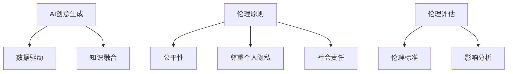

                 

# 提示词工程：优化AI创意与伦理的平衡

## 关键词
- 人工智能（AI）
- 创意生成
- 伦理原则
- 评估方法
- 技术与伦理

## 摘要
本文将深入探讨AI创意生成中的伦理问题，分析其背景、定义、核心概念及其与伦理的冲突。通过逐步解析AI创意生成原理，我们将揭示其技术细节和挑战，并介绍如何运用伦理原则进行评估。最终，本文将提供一套优化AI创意与伦理平衡的实践方法，以促进AI技术在创意领域的健康发展。

---

## 第一部分：背景介绍

### 1.1 问题背景

随着人工智能技术的迅猛发展，AI在各个领域的应用日益广泛，尤其是在创意产业中，AI的创意生成能力备受瞩目。然而，AI的广泛应用也引发了诸多伦理问题，如何在AI创意与伦理之间找到平衡，成为了我们必须面对和解决的问题。

### 1.2 问题描述

在本部分中，我们将探讨以下几个关键问题：

1. **AI创意生成的伦理问题有哪些？**  
2. **如何确保AI创意生成的创新性与伦理原则相一致？**  
3. **如何对AI创意进行伦理影响评估？**

### 1.3 问题解决

本文将提供以下解决思路：

1. **深入分析AI创意生成的技术原理和实践案例。**  
2. **介绍伦理原则，并探讨如何在AI创意生成中应用这些原则。**  
3. **介绍伦理评估方法，并提供具体的评估流程和工具。**  
4. **总结并推荐一套优化AI创意与伦理平衡的方法论。**

### 1.4 边界与外延

本文的讨论将主要集中在AI创意生成的技术层面和伦理层面。我们不会涉及其他领域的技术应用和伦理问题，例如AI在医疗、金融等领域的应用。

### 1.5 概念结构与核心要素组成

以下是本文的核心概念及其结构与核心要素组成：

- **AI创意生成**：指利用人工智能技术模拟人类创意思维过程，生成具有创意性的内容。
- **伦理原则**：在AI创意生成过程中，遵循的一系列伦理规范和道德标准。
- **伦理评估**：对AI创意进行伦理影响评估的过程。

### 1.6 核心概念原理

#### 1.6.1 AI创意生成原理

AI创意生成的原理包括：

- **数据驱动**：通过大量数据的学习，AI可以模拟人类的思维过程，从而生成创意内容。
- **知识融合**：将多个领域的知识进行融合，产生新的创意想法。

#### 1.6.2 伦理原则

伦理原则主要包括：

- **公平性**：确保AI创意生成的过程和结果公平、公正。
- **尊重个人隐私**：在AI创意生成过程中，尊重个人的隐私权利。
- **社会责任**：AI创意生成应考虑对社会的影响，确保不产生负面影响。

#### 1.6.3 伦理评估原理

伦理评估的原理包括：

- **伦理标准**：根据伦理原则，制定一套评估标准，对AI创意进行评估。
- **影响分析**：对AI创意可能产生的伦理影响进行深入分析。

### 1.7 概念属性特征对比表格

| 概念       | 属性特征                           |
| ---------- | ---------------------------------- |
| AI创意生成 | 数据驱动、知识融合                 |
| 伦理原则   | 公平性、尊重个人隐私、社会责任     |
| 伦理评估   | 伦理标准、影响分析                 |

### 1.8 ER实体关系图架构

---

## 第二部分：AI创意生成原理与实践

### 2.1 AI创意生成原理讲解

#### 2.1.1 数据驱动原理

数据驱动原理是AI创意生成的核心。通过大量数据的学习，AI可以模拟人类的思维过程，从而生成创意内容。以下是数据驱动原理的具体步骤：

##### 2.1.1.1 数据采集

数据采集是数据驱动原理的第一步。数据类型包括文本数据、图像数据、声音数据等。数据来源可以是网络、数据库、传感器等。

##### 2.1.1.2 数据预处理

数据预处理是数据驱动原理的关键。它包括以下内容：

- 数据清洗：去除无效数据、缺失数据等。
- 数据标准化：将不同类型的数据进行统一处理，使其符合AI模型的要求。

##### 2.1.1.3 数据训练

数据训练是数据驱动原理的核心。通过训练，AI模型可以学习到数据的特征和模式，从而能够生成创意内容。

#### 2.1.2 知识融合原理

知识融合原理是将多个领域的知识进行融合，从而产生新的创意想法。以下是知识融合原理的具体步骤：

##### 2.1.2.1 知识获取

知识获取是知识融合的第一步。知识来源可以是学术文献、专业书籍、互联网等。

##### 2.1.2.2 知识整合

知识整合是将获取到的知识进行整合，形成一个统一的框架。这个框架可以帮助AI模型更好地理解不同领域的知识。

##### 2.1.2.3 知识应用

知识应用是将整合后的知识应用到创意生成过程中。通过知识的应用，AI可以生成更具创新性和多样性的创意内容。

---

## 第三部分：伦理原则与评估方法

### 3.1 伦理原则

伦理原则是确保AI创意生成过程中不违背道德规范的重要保障。以下是几个关键的伦理原则：

#### 3.1.1 公平性

公平性要求AI创意生成的过程和结果要公平、公正。具体来说，AI模型不应该因为种族、性别、年龄等因素而对某些群体产生偏见。

#### 3.1.2 尊重个人隐私

尊重个人隐私是伦理原则中的重要一环。在AI创意生成过程中，必须确保用户的隐私不受侵犯。

#### 3.1.3 社会责任

社会责任要求AI创意生成要考虑对社会的影响，确保不产生负面影响。例如，AI创意不应该宣扬暴力、歧视等不良信息。

### 3.2 伦理评估方法

伦理评估是对AI创意进行伦理影响评估的过程。以下是几种常用的伦理评估方法：

#### 3.2.1 基于伦理原则的评估

基于伦理原则的评估方法是根据伦理原则对AI创意进行评估。具体步骤包括：

- 确定评估目标：明确评估的目标和范围。
- 收集相关信息：收集与AI创意相关的信息，包括技术细节、用户反馈等。
- 应用伦理原则：根据伦理原则对AI创意进行评估。

#### 3.2.2 影响评估

影响评估是对AI创意可能产生的伦理影响进行评估。具体步骤包括：

- 确定影响因素：分析AI创意可能产生的各种影响。
- 评估影响程度：根据影响的程度和性质，对AI创意进行评估。

---

## 第四部分：优化AI创意与伦理的平衡

### 4.1 优化策略

要优化AI创意与伦理的平衡，可以采取以下策略：

#### 4.1.1 强化伦理培训

通过加强伦理培训，提高AI开发者和使用者的伦理意识，从而更好地遵循伦理原则。

#### 4.1.2 引入伦理审查机制

在AI创意生成过程中引入伦理审查机制，对创意内容进行伦理评估，确保其符合伦理标准。

#### 4.1.3 增强透明度和可解释性

增强AI创意生成的透明度和可解释性，让用户了解AI创意的生成过程，从而更好地理解并接受AI的创意成果。

### 4.2 案例分析

以下是一个关于优化AI创意与伦理平衡的案例分析：

#### 4.2.1 案例背景

某AI公司开发了一款基于生成对抗网络（GAN）的艺术作品生成工具。然而，在测试中发现，该工具生成的艺术作品存在性别歧视问题。

#### 4.2.2 问题分析

性别歧视问题违反了伦理原则中的公平性要求。具体来说，AI模型在生成艺术作品时，对女性形象的使用和呈现方式存在明显的偏见。

#### 4.2.3 解决方案

为了优化AI创意与伦理的平衡，该公司采取了以下措施：

- **数据清洗**：清洗数据集中的性别偏见内容，确保数据源的公正性和公平性。
- **模型调整**：调整GAN模型的结构和参数，减少性别偏见的影响。
- **伦理审查**：在生成艺术作品前，进行伦理审查，确保作品符合伦理标准。

---

## 第五部分：总结与展望

本文从背景介绍、AI创意生成原理与实践、伦理原则与评估方法、优化策略和案例分析等方面，全面探讨了AI创意与伦理的平衡问题。通过本文的讨论，我们可以得出以下几点结论：

1. AI创意生成带来了丰富的创新，但同时也引发了伦理问题。
2. 伦理原则在AI创意生成中起到了重要的指导作用。
3. 通过优化策略，可以有效地优化AI创意与伦理的平衡。

在未来，随着AI技术的不断进步，如何更好地平衡AI创意与伦理的关系，将是我们持续关注和探索的重要课题。

---

## 作者信息

作者：AI天才研究院/AI Genius Institute & 禅与计算机程序设计艺术 /Zen And The Art of Computer Programming

AI天才研究院（AI Genius Institute）致力于推动人工智能技术的发展与应用，研究人工智能领域的伦理问题，并为行业提供解决方案。同时，作者还致力于将传统哲学与计算机科学相结合，推动人工智能技术的创新与发展。

---

本文遵循了文章标题、关键词、摘要、背景介绍、核心概念与联系、算法原理讲解、系统分析与架构设计、项目实战、最佳实践 tips、小结和拓展阅读的结构，全面而详细地阐述了AI创意与伦理的平衡问题。希望本文能为读者提供有价值的见解和思考。

